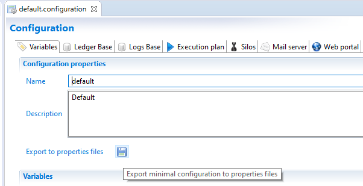
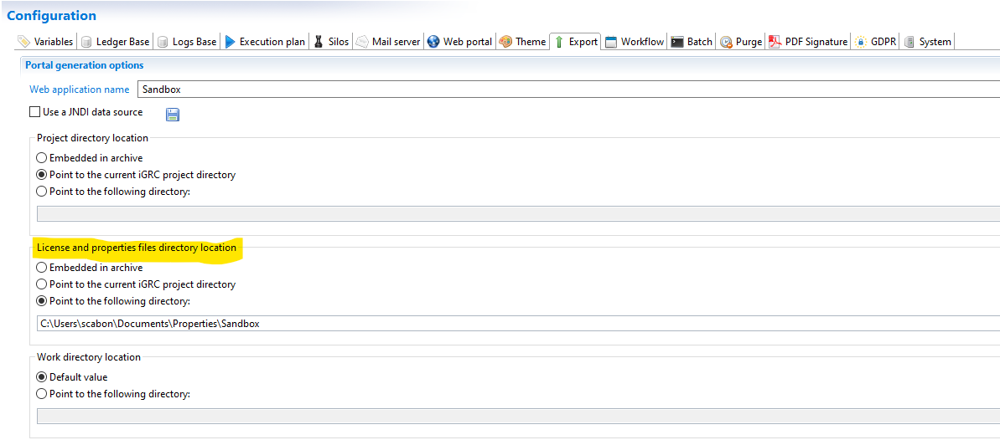
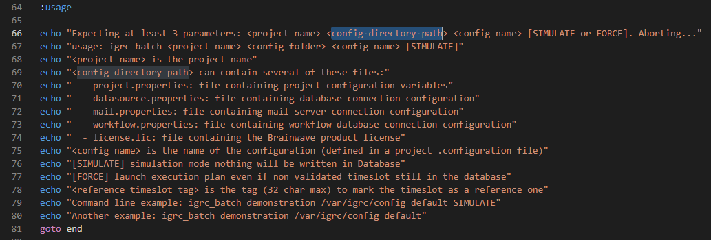
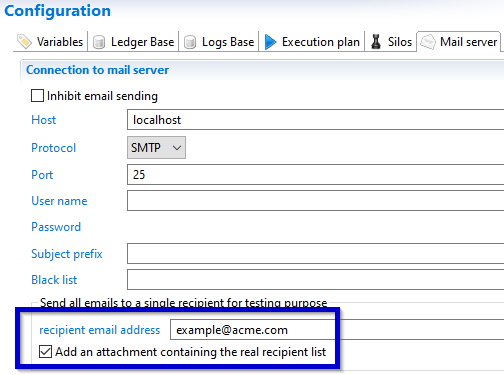
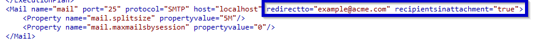
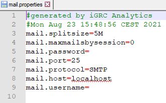

# Best practice for installation and deployment

The following pages include Brainwave's **Best Practices** to follow when deploying and configuring a project.  

## Technical configuration

It is possible to override the parameters configured in the technical configuration using `.properties` files. Please be aware that there are pros & cons to using the `.properties` files.  

### Pros

__Single .configuration file__

It allows you to have a **single** `.configuration` file for all your environments (often called `com` or `common`).  
Using the properties files you override / overload only **environment specific** variables, for instance the database or SMTP server connection information.  
The rest of the variables values are only set once in the common configuration.  

__Delivery__

There is no need to deliver a new project version to fix a variable value, as it can be updated in the `.properties` files directly.  

__Operations__

In some contexts, maintenance of some environments (i.e. Prod) are done by other teams than the iGRC project team.  
It's often easier for them to update the `.properties` files without having to update the project itself and mess with the technical configuration file.  

### Cons

__Versioning__

Projects are often using a versioning system (i.e. Git) that track changes to the configuration files (excluding development configurations).  
Properties files updates will not be tracked in the versioning system (unless those files are also in Git, but that is rarely the case).  

__Deltas__

There can be discrepancies between the variables existing in the configuration files & the ones in the properties files, because the project evolves.  
It can be hard to track / update.  

> Also see the warnings section at the end

### Properties files

Properties files can be used to override the technical configuration values.  

It means that if a configuration variable value exists in both the `.properties` files and in the technical configuration file, the value from the `.properties` files will be used **in prior** by the project.  
If there is **no value** in the `.properties` files, then the variable value **from the technical configuration** file will be used.  

These `.properties` files can be generated from the technical configuration file's `Variables` tab by clicking on `Export to properties files` 💾:  

  

This will generate the following files (listed with their corresponding tab in the configuration file):  

- `config.properties`: web portal configuration (`Web portal` tab)  
- `datasource.properties`: ledger database connection information (`Ledger base` tab)  
- `mail.properties`: email & smtp server configuration (`Mail server` tab)  
- `project.properties`: configuration variables (`Variables` tab)  
- `workflow.properties`: workflow database connection (`Workflow` tab)  

### Properties usage

> Using the `.properties` files is optional, but a `license.lic` file is often **required** in the properties folder, see below  

#### Web portal

To use `.properties` files with the web portal, update the `License and properties files directory location` value in the `Export` tab of the technical configuration to `Point to the following directory`:  

  

#### Batch

To use `.properties` files in the batch, use the `config directory path` parameter of the batch.  
As shown in the `igrc_batch.cmd` help, it's the second parameter, `<config directory path>`:  

```bat  
:usage

echo "Expecting at least 3 parameters: <project name> <config directory path> <config name> [SIMULATE or FORCE]. Aborting..."
echo "usage: igrc_batch <project name> <config folder> <config name> [SIMULATE]"
echo "<project name> is the project name"
echo "<config directory path> can contain several of these files:"
```

  

So for example `igrc_batch.cmd Sandbox C:\Users\scabon\Documents\Properties\Sandbox dev` where `C:\Users\scabon\Documents\Properties\Sandbox` is the path to the folder containing the `.properties` files.  

> As explained previously, if no `.properties` files are present in the folder, variables values from the project will be considered. The only mandatory file in this folder is the **license**.

#### Studio

The studio always uses the values from the technical configuration file for the collect / timeslots, it cannot overload values using the `.properties` files.  

But if your webapp points to the project, you can add `.properties` files to your `/webportal` folder to overload their values.  

### License

The `license.lic` file is often put in the same folder as the `.properties` files.  
As using the `.properties` files is optional, it is possible to have only the `license.lic` file in the path to the properties folder for either the **batch** or the **portal**, as they both require a license to function properly.  

### Warnings

#### New variables

It's easy to forget that new variables were added to the project (for example because a new facet was installed, presence of a new `.configvariables` file in your project), and to add those to the `.configuration` files, meaning that only some of the configuration variables are overloaded by properties.  

It means that each time:

- A new `.configvariables` file appears in your project, do not miss to add new variables in your `.configuration` file (by simply opening and save it)
- A new variable is added to the `.configuration` file of your project, you should set its value and export `.properties` files

But, in that case, take care about not to overwrite some existing values in your `.properties` files not identical to your project configuration.

#### Generation

Generating the properties files from the Studio creates files with a subset of all possible variables.  
I.e. not all variables that can be overloaded are listed (for the `webportal` for instance).  

For instance, from the `Mail server` tab, it is possible to set `redirectto` and `recipientsinattachment` properties but those are not exported in `.properties` files.





Here is the result of the export of the `mail.properties` fils:


