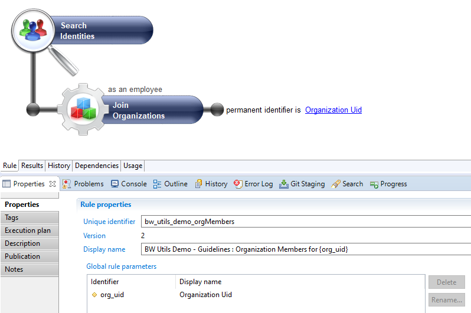
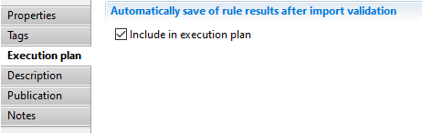
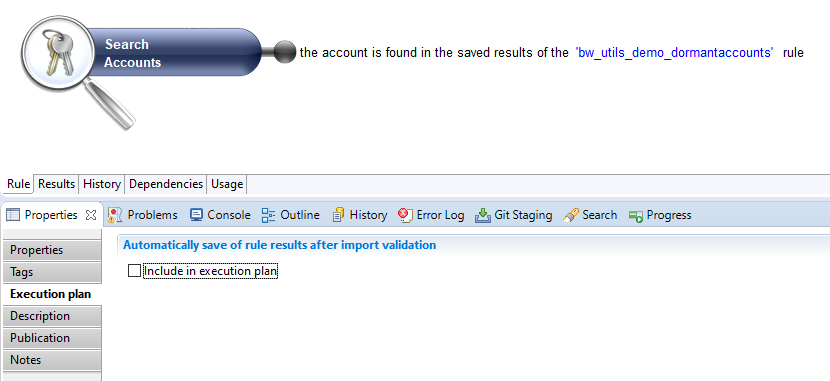

# Best practice for rules

Rules should be used as a library of business filters for ledger data.  
When adding filters to a view, prefer to use a rule instead:  

* Better performance (saved rule results);  
* Reusesability (same rule used in different views);  

## Definition  

Use the project/facet identifier as a prefix in the rule identifier and name.  
Use the same **naming rules** for attributes as for views.  

> See `Concept Prefixes` in [Views best practice](./03-rules)  

Example rule:  
  

## Saved rules  

When reusing rules in views, it's better to use the saved rule result links in views, as it's faster.  
For instance:  
  

You have to ensure that the rule is included in the execution plan:  
  

> Note that this only applies to rules **without parameters**.

### Warnings

There is no dependency check between rules.  
If you want a main rule to use saved rule results from detail rules, the main rule cannot be saved in the execution plan!  
  
