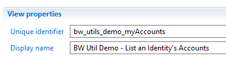
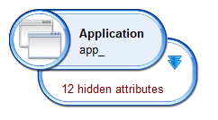
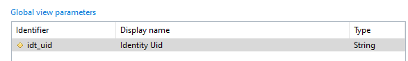
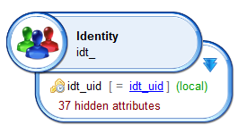
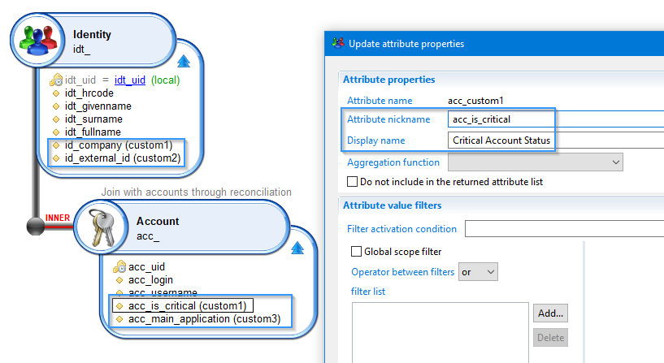
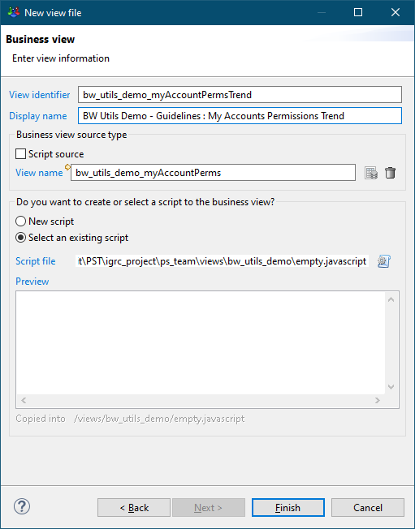
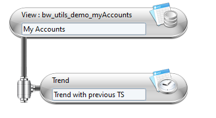

# Best practice for views

## views

### Identifier  

Have the project/facet identifier as prefix in the view Identifier, and in the displayname.
For example:  

  

### Concept Prefixes  

Always have a prefix on each concept:  

  

> This is true even if only one concept is returned by the view: it allows you to known what the view returns when using it in a page or report without having to open it.  

Suggested prefixes:  

* Repository: `repo_`  
* Account: `acc_`  
* Group: `grp_`  
* Application: `app_`  
* Permission: `perm_`  
* Identity: `idt_`  
* Organization: `org_`  

> There are of course exceptions, for instance if you want to return identities and their managers; for instance keep `idt_` for identities and use `mgr_` for their managers.

### View parameters  

Always set the type of the parameter, so that you know what variables you can pass from the page.  

Also try to have the concept's prefix in the parameter's identifier, so that the caller knows what concept the parameter is used on.  

> If a view requires an `uid` parameter, you don't know what the uid is for, but if it requires an `idt_uid` then you kown it will be used as a filter on identity uids.  

  

If done so, the parameter name will match the concept field it is used to filter (`idt_uid = idt_uid`), as can be seen here:  

  

> You can hide the field used for filtering the view (`idt_uid`) as its values if known already (same as the parameter).  

### Returned attributes  

For performances reasons, prefer to return only `required` attributes.  

### Computed columns  

Computed columns should start with an `underscore` (same rule as in discoveries), so that you known which fields come as is from the DB or are computed in the view.  

### Sort  

Always add a `sort` to the views so that the list presented to the end user is consistent between sessions.  
Try to be consistent with how the data is presented to the user.  
For instance, if you list an Identity's accounts in a table, and the first column of the table is the account login, then sort the underlying view on the account login.  

> The first table column should be the one sorted in the view.  

If you return multiple concepts, then there should be a `sort` on each concept, also in accordance with how the data is shown to the user (depending on the table).  

### Filtering  

Avoid filters directly in the view, but use saved rule results when possible.  
For instance:  

  

> You can reuse this filter in many views, otherwise you would have to implement the same filter in all views - that requires more time and is less easy to maintain.  
> Be sure that the rule you are using has the `Include in execution plan` option.  

### Custom Attributes  

To avoid having to handle columns that have obscure names like id_custom8 and acc_custom5, add an Alias to custom attributes in the views:  

  

## Business Views  

The same as for views applies for BusinessViews (use the project/facet prefix in the identifier and in the displayname).  
If the view requires no javascript, then have it point to an `empty.javascript` file so that you have less javascript files in the project, and that you know everything is done in the BV.  

  

### BusinessView parameters  

Try to have the same parameter names as the underlying views.  

### Names  

Add labels to the sources and filters items in the view:  

  
