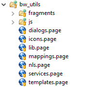
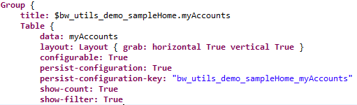
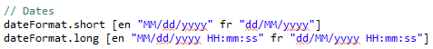
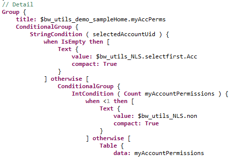
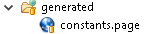
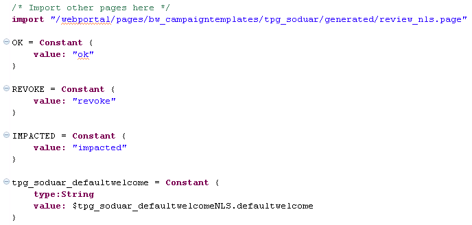
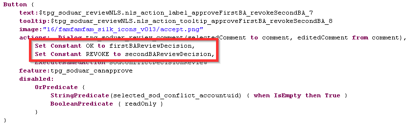

# Best Practice for pages

The Goal is to provide coding/implementation Guidelines for iGRC.  

## Pages

- Use prefixes of project/facet in Identifiers (for instance `bw_utils_demo`);  
- Do not use hard-coded text values, put it all in one NLS file;
- As much as possible, do not use hard-coded values, put it all in one Constant file;
- Have separate files for Dialogs, Mappings, Fragments, NLS, Constants, Styles etc.;  

  

- Put only one `Page` declaration in each `.page` file;  
- Add `disabled` properties to datasets, so that data is fetched only when displayed;  
- Take into account that in some cases there can be no data, show a message to the user instead of an empty table;  
- Allow the user to both double-click on an item and on a button;  
- Have buttons disabled when the required parameter is not set.  

### Variables

#### Naming

Always use explicit name for your variables and in camelCase.

#### Typing

Always set the variable type, so that others know what they are used for.  
`activeTabManagedApps = Variable { type: Boolean }`  
`selectedAccountUid = Variable { type: String }`  

### Tables

#### Properties

A standard table setup should look like this:  
  
Here is the code:  

```page
Group {
    title: $bw_utils_demo_sampleHome.myAccounts
    Table {
        data: myAccounts
        layout: Layout { grab: horizontal True vertical True }
        configurable: True
        persist-configuration: True
        persist-configuration-key: "bw_utils_demo_sampleHome_myAccounts"
        show-count: True
        show-filter: True
        ...
    }
}
```

See below for why.  

__Label__: Avoid the `label:` property of tables that takes up place to the left of the table, and instead put the table in a `Group` that has a `title:` property used as the table name.

__Layout__: The table won't grow by default, you need to add a `grab` layout: `layout: Layout { grab: horizontal True vertical True }`  

__Configurable__: For a better user experience, enable the `configurable:` property of the table. It should also come with the `persist-configuration` and `persist-configuration-key` properties.  
You need a unique `persist-configuration-key`. If you have multiple tables on the same page, you can concatenate the page identifier with the table's dataset name to have unique entries.  

__Filter__: Also, `show-count` and `show-filter` are recommended as it allows the user to promplty filter the table, and because the count is updated when a filter is applied.  

#### Columns

__Size__: By default, let the engine or the user choose and set `100%` as the default `width`.  
Exceptions are for `boolean` or `dates` values where the size is fixed.  

__Headers__: If possible, use the NLS from the default project for the `Header:` property (see `/webportal/pages/resources/concepts_nls.page`).  

__Default__: This should be the default column setup:  

```page
Column {
    column: app_displayname
    header: $application.displayname
    filterable: True
    sortable: True
    width: 100%
}
```

__Initialy Masked__: It's better to display by defaut the `displayname` of objects.  
Columns containing `codes` should have the `initialy-masked` property set to `True` (requires that the table is `configurable`).  

```page
Column {
    column: app_code
    header: $application.code
    filterable: True
    sortable: True
    width: 100%
    initially-masked: True
}
```

> The first non hidden column of your table must be visible (not `initialy-masked:True`) because if you have checkboxes they are attached to the first column and will not be visible if the column isn't displayed by default.  

__Selection__: Selection usualy happens on `uids`, and therefore those columns should have the `hidden` property set to true.  

```page
Column {
    column: app_uid
    hidden: True
    selection: selectedApplicationUid
}
```

__Booleans__: Use the `text:` property with a mapping to display boolean values as human readable values and also add an `image`.  
You can set a fixed width since the size won't change.  
The `filterable:` property should be remove (or set to `False`) since we can't filter on the `Text` shown to the user.  

```page
Column {
    column: acc_disabled
    header: $bw_utils_NLS.account.enabled
    text: Transform Current acc_disabled using bw_utils_reverseBooleanDisplayMapping
    image: TemplateImageSelection ( Current acc_disabled ) using bw_utils_reverseBooleanStrImage
    sortable: True
    width: 60px
}
```

__Dates__: Transform dates to the user's local format (most people don't like to read LDAP dates). To do so, have the date formats defined in an NLS file, preferably with a short & long version depending on the information displayed:  
  

> Short format might be used for an Identity's arrival or departure date, whereas the long format might be required for an account's last login date.  

Width can also be fixed here.  

```page
Column {
    column: acc_lastlogindate
    header: $bw_utils_NLS.account.lastlogindate
    text: Date ( Current acc_lastlogindate ).value( $bw_utils_NLS.dateFormat.long )
    filterable: True
    sortable: True
    width: 130px
}
```

#### Actions

The `double-click` should be implemented, and there should be a button allowing the same action as the double-click.  
For instance:  

```page
double-click:
    GoTo Activity Permission Detail with selectedPermissionUid to paramPermissionUid
```

### Master / Detail

In Master/Detail configurations, the right pane should take into account three use cases:  

- No selection has been made yet on the master pane;  
- A selection has been made on the master pane but the view for the detail pane returns no result;  
- The detail pane returns results.  

This should result in the following implementation:  
  

The `StringCondition` tests if an item has been selected in the master pane. If `selectedAccountUid` is empty, then no item has been selected yet, and we display a text to ask the user to select an item (the `selectfirst.Acc` NLS).  
Then `IntCondition` tests if the detail view returned results. If the view returns no results, then `Count myAccountPermissions` is less than `1` and we display a text saying that no result was found (the `non` NLS).  
Otherwise (ie. if an item is selcted in the master pane, and if the detail pane returns results), we show the details table.  

```page
// Detail
    Group {
        title: $bw_utils_demo_sampleHome.myAccPerms
        ConditionalGroup {
            StringCondition ( selectedAccountUid ) {
                when IsEmpty then [
                    Text {
                        value: $bw_utils_NLS.selectfirst.Acc
                        compact: True
                    }
                ] otherwise [
                    ConditionalGroup {
                        IntCondition ( Count myAccountPermissions ) {
                            when <1 then [
                                Text {
                                    value: $bw_utils_NLS.non
                                    compact: True
                                }
                            ] otherwise [
                                Table {
                                    data: myAccountPermissions
```

### Datasets

Always have a `disabled:` property on datasets, to ensure that data is fetched only when needed.  

Here is an example for a page that has two tabs.  
The datasets used for the second tab have a `disabled:` property:  

```page
managedApps = Dataset {
    view: bw_utils_demo_managedApps with
        Principal.uid to id_uid
    disabled:
        Not BooleanPredicate ( activeTabManagedApps )
}
```

When the second tab is selected, the variable in the `disabled` is set to `True`:  

```page
TabItem {
    text: $bw_utils_demo_sampleHome.managedApp
    activation-event:
        Set True to activeTabManagedApps
```

### Buttons

Buttons should:  

- Have a `disabled:` property when the required parameters are not set;  
- Have an `image:` for visual consistency;  
- Have a `tooltip:` that explains what the button does.  

By default, a button should look like the following (sample to go to an Account detail page):  

```page
Button {
    text: $bw_utils_NLS.button.account.detail
    tooltip: $bw_utils_NLS.button.account.detail.tooltip
    actions:
        GoTo Activity Account Detail with accountUid to paramAccountUid
    image: "16/audit/white/account_16.png"
    disabled:
        StringPredicate ( accountUid ) {
            when IsEmpty then True
        }
}
```

### Fragments

When possible, use fragments.  
The button above for instance is intended to open the Detail page of an account.  
This can be used in a fragment so that each time a table lists accounts, you can add a call the fragment to add a button to the selected account's detail page.  
Here is the fragment for the button above:  

```page
// Button to go the an Account's detail page
bu_utils_accountDetail = PageFragment {

  accountUid = Variable { type: String }
  
  Button {
    text: $bw_utils_NLS.button.account.detail
    align: Right
    layout: Layout { grab: horizontal True vertical False align: horizontal End vertical Center }
    tooltip: $bw_utils_NLS.button.account.detail.tooltip
    actions:
      GoTo Activity Account Detail with accountUid to paramAccountUid
    image: "16/audit/white/account_16.png"
    disabled:
      StringPredicate ( accountUid ) {
        when IsEmpty then True
      }
  }
}
```

> The only difference is layout options, because fragments complicate layouting a bit.  

The call to the fragment is simply:  

```page
IncludeFragment {
    fragment: bu_utils_accountDetail with
        selectedAccountUid binds-to accountUid
}
```

> It's much much easier to maintain than having the whole button in each page.

__Variable binding__

You have two options when it comes to bind variables from a page to a fragment: `value-of` and `bind-to`.

`value-of` is monodirectional and only flows from the page to the fragment unlike `bind-to` which is bidirectional (so the value in the page is always the same as the one in the fragment).

By default, you should always use `value-of`, unless the variable can be edited in the fragment and retrieved in the origin page.
This will prevent to add listners between the page and the fragment when it is not needed.  

__Documentation__

When creating a fragment you can write a documentation for it using javadoc style comments (`/** .... */`).
The documentation should be written for every fragment you create following the given template :  

```page
/**
 * <span style="white-space: pre-line">
 * Fragment description
 * 
 * <u>Parameters:</u><ul>
 * <li><b>(variable 1 name)</b> (in/out/inout) desctiption of the variable</li>
 * <li><b>(variable 2 name)</b> (in/out/inout) desctiption of the variable</li>
 * <li><b>(variable 3 name)</b> (in/out/inout) desctiption of the variable</li>
 * .....
 * </ul>
 * </span>
 */

```

### Empty values

Avoid displaying empty values in pages.  
Instead, you can use the `optionStringMapping` in `/webportal/pages/resources/mappings.page`:  

```page
optionStringMapping = StringMapping {
  when IsEmpty then $global.novalue
  otherwise current
}
```

Where $global.novalue is (from `/webportal/pages/resources/pages_nls.page`):  

```page
global = NLS {
  novalue [en "No value" fr "Donnée non précisée"]
}
```

### Constant values

As much as possible, use of constant values (review decision status for example) should be done from `Constant` variable and not hard-coded directly in the Page file.

All Constants should be put in a centralized file named `constants.page`.





Page files which use one of them should reference this file.




### Features

Always consider adding a `feature` to your page even if you handle access rights using menuitem, due to the fact that direct access to the page can be shared using `permalink`.  
