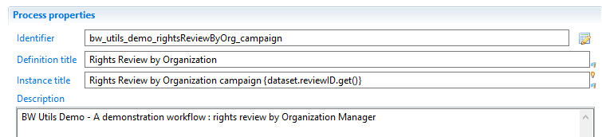
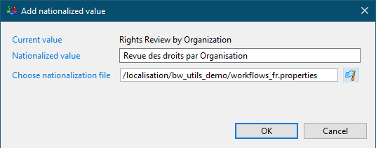
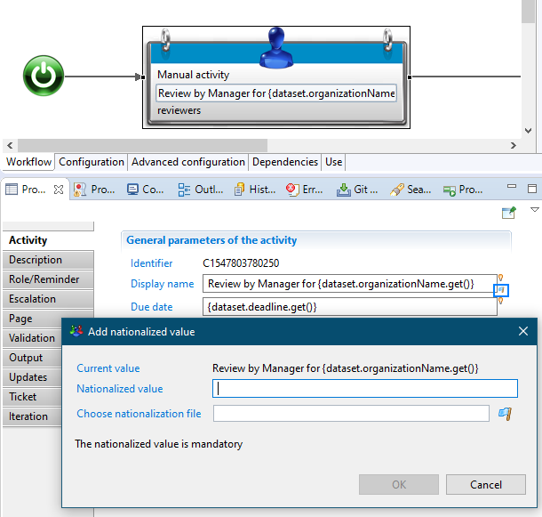
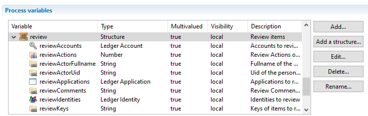
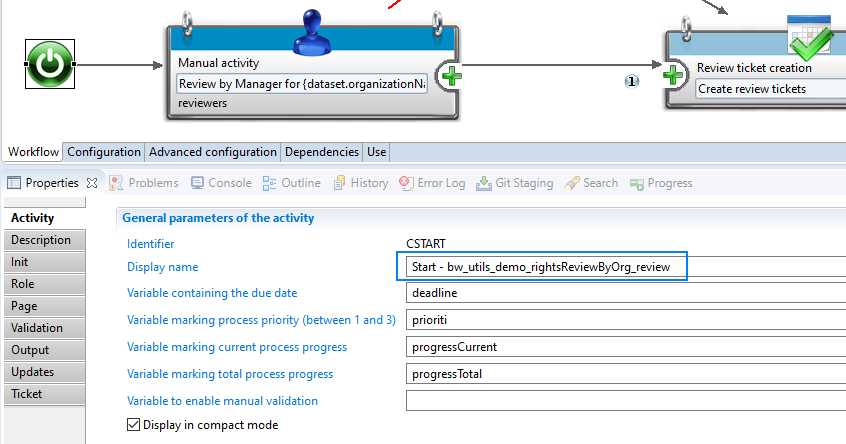
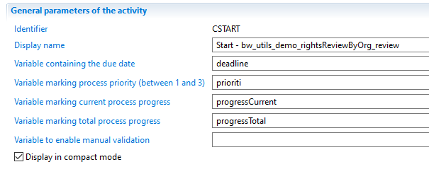
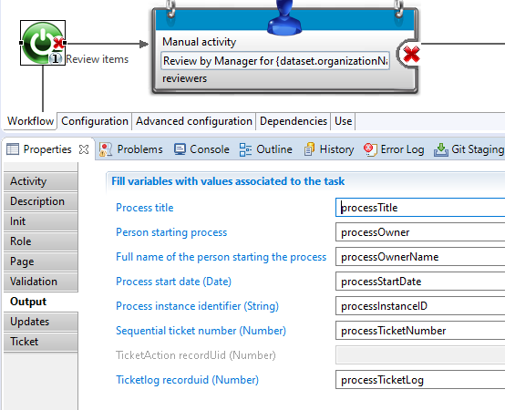
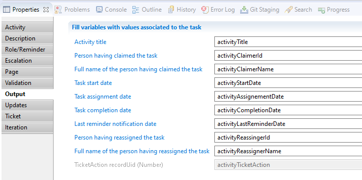
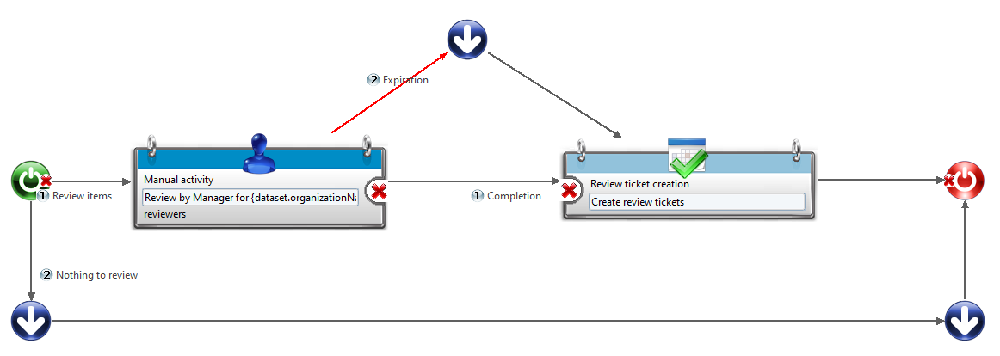

# Best Practice for workflows

The Goal is to provide coding/implementation Guidelines for iGRC.

## Identifiers

Always add the project/facet identifier as prefix in the workflow definition:  
  

> Remember to add the `.get()` in the `instance title` even if it's not done by the editor.  
> The `instance title` should be different than the `definition title` and be based on workflow variables so that different instances can be identified easily by users in the portal.  

## Localisation

Always use the localisation files (create your own .properties files if needed):  
  

> This allows the clients to modify the workflow labels without modifying the workflow itself, and allows multiple languages.  

Repeat for each language:  
  

> This has to be done for all the workflows `Definition title` and `Instance title`; and for all manual Tasks:  

  

## Variables

Recommendations:  

- Always add a description;  
- Use structures if possible;  
- Use the correct type/ledger type.  

  

> For structures, prefix the variables names with the structure name, so that they are always together (when using auto-complete in a page for instance).  

## Start / End

Always add the workflow identifier to the `Start` and `End` components: they have no unique identifiers like other worklfow activities (for instance `C1547803780250`):  
  

> This allows for easier debug via the logs.  
> The same goes for route components.  

## Status / Progress / Information

Try to map as much information as possible so that the taskManager and other interfaces won't show empty fields:  
  

The same goes for Workflow information that you might require:  
  

And for tasks:  
  

## Routes

Keep in mind all the use cases that might occur.  
For example in a Detail process of a review:  

- There is nothing to review;  
- The task expires;  
- The manager completes the task.  

  

> Add labels to routes so that you don't have to look at the conditions.  
