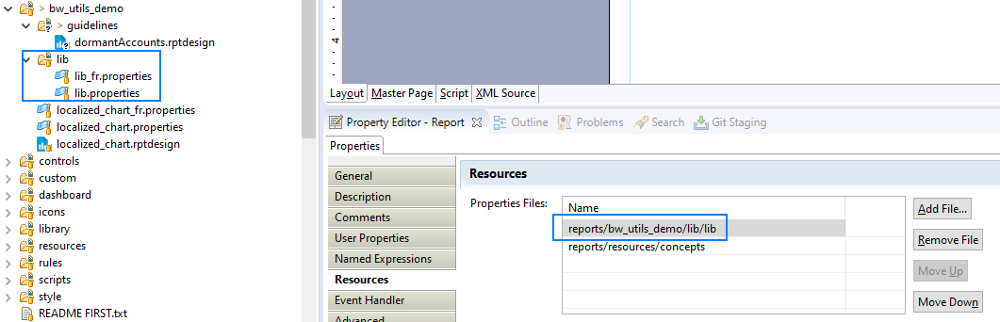
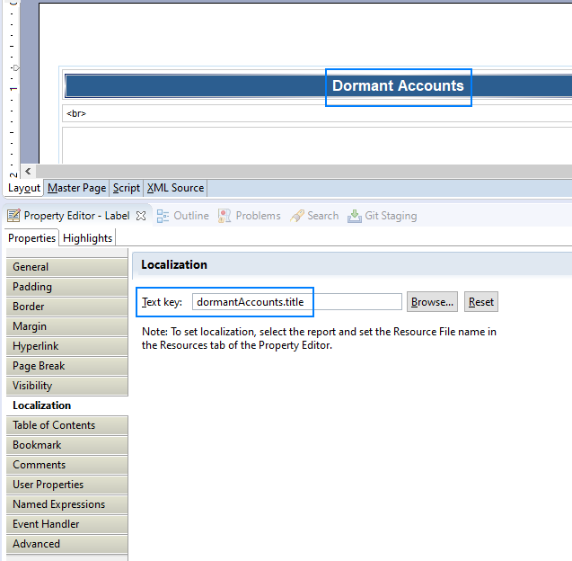
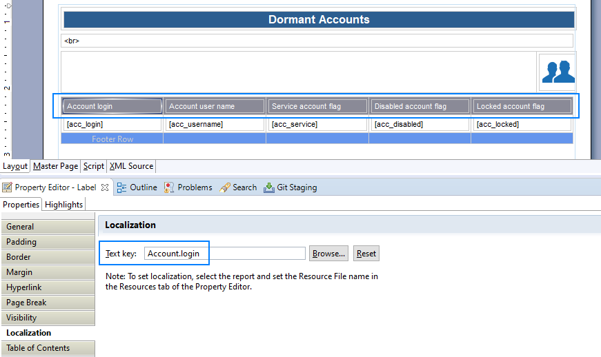

# Best Practice for reports

The Goal is to provide coding/implementation Guidelines for iGRC.

## General principles

Reports are very useful to provide compliance reports of a review campaign.

However, to display KPIs, we advise you to prefer [Mashup Dashboards](../igrc-platform/dashboards/index) or Pages with [display](../igrc-platform/pages/09-display-widgets) or [chart](../igrc-platform/pages/12-chart-widgets) widgets instead of reports, which are more user-friendly.  

## Localisation

The default project properties files for localization is always imported, but you will probably need one for you project/facet.  
Remember to import your custom resource when creating reports:  
  

> Resources can be in a shared properties file (library) or dedicated for each report.  

Always set a Localization value in texts:  
  

> The text shown in the report editor will be overloaded with the value from the properties file.  

The same applies for column headers:  
  
