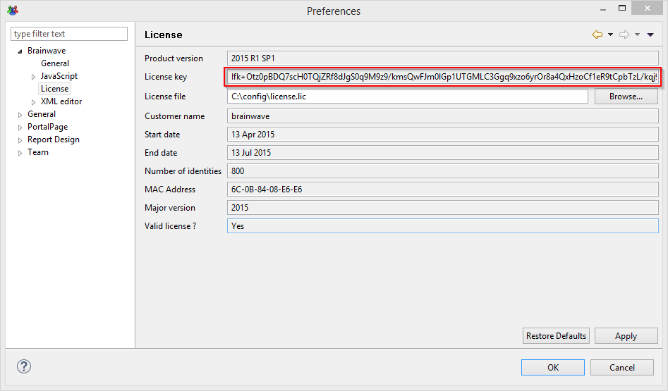

# iGRCanalytics Downloads

## Warning

### Dependencies

Descartes by default **requires** IAP version **1.8**!  

> [!warning] If upgrading from a previous version of the product with an IAP version of 1.7 and bellow, it is **necessary** to add the option `-Doptimizediapcounters=false` to the `JAVA_OPTS` of the execution plan.  
> If you have questions on the compatibility of your version of IAP please contact the support services.

### Database migration

No database migration is necessary when upgrading from version `Curie R3` or `Descartes R1`.  

If you are migrating from a version of the product prior to **Curie R3** see [**here**](https://documentation.brainwavegrc.com/Descartes/docs/igrc-platform/installation-and-deployment/database/schema-35-upgrade-procedure/) for the detailed procedure.  

## Version Descartes R2

We are pleased to announce the release of the latest version of the product: **Descartes R2**

This version includes the updated review experience in the portal. To leverage this experience it is required to update IAP to version 2.0.  

This version includes as improvements a new metadata computation phase that occurs before the calculation of temporal criteria. It is also possible alter the truncation policy through properties within batch context. This version also includes a series of bug fixes. Please refer to the release notes for more information.

- [**Release notes**](02-release-notes-descartes-r2)

Please navigate to the following link to download the latest version of the product: Brainwave Identity GRC Descartes:  

- [**Download Descartes R2**](https://download.brainwavegrc.com/index.php/s/fsqosCEPHkBaoaP)

See [below](#how-to-calculate-the-hash) for more information on how to check the integrity of your download.  

> [!note] As a reminder Brainwave Analytics is provided without any support on Linux.  
> Linux deployment should be used only for data loading automation through the "Batch" mode and for deploying the web application. The configuration performed through Brainwave Analytics should be made under a Microsoft Windows environment.  

Looking for an older version? have a look at the [archived versions repository](05-archived-version)  

Please use the following link for the full list of the certified environments:  

[Certified Operating Environment for Brainwave Identity GRC Version](https://documentation.brainwavegrc.com/Descartes/docs/igrc-platform/installation-and-deployment/brainwave-grc-certified-environments/)  

Please see [**here**](04-product-lifecycle) for more information on the product versions lifecycle, including the end of support dates.

## License key

Please log into your Brainwave Online support account and use "the request a license" form to request a license:

[https://support.radiantlogic.com](https://support.radiantlogic.com)

> Challenge: Copy and paste the challenge found in the product (field "License key" in the following screenshot). See [here](https://support.radiantlogic.com/hc/en-us/articles/17805187130516-Brainwave-licence-requests) for more information



## Checking the integrity of the download

In order to verify the integrity of the downloaded file you can also download the associated .sha1 checksum file that contains the correct sha1 hash.

To verify the file:
`iGRCAnalyticsSetup_win32_x64_Ader-R1_2019-12-10.exe`  

You can download the checksum file:
`iGRCAnalyticsSetup_win32_x64_Ader-R1_2019-12-10.sha1`

You can calculate the SHA1 of your downloaded file and it should match exactly with the hash in the ".sha1" file.

## How to calculate the hash?

### Windows

#### Get-FileHash

In Powershell you can use the commandlet `Get-FileHash` to compute the hash value for a file by using a specified hash algorithm.

Please use the following link for more information.
[https://docs.microsoft.com/en-us/powershell/module/microsoft.powershell.utility/get-filehash?view=powershell-6](https://docs.microsoft.com/en-us/powershell/module/microsoft.powershell.utility/get-filehash?view=powershell-6)

#### Certutil

In windows, you can use the command line tool certutil
`Certutil -hashfile iGRCAnalyticsSetup_win32_x64_Ader-R1_2019-12-10.exe SHA1`

#### Microsoft File Checksum Integrity Verifier

You can also download the Microsoft File Checksum Integrity Verifier ([https://www.microsoft.com/en-us/download/details.aspx?id=11533](https://www.microsoft.com/en-us/download/details.aspx?id=11533))  

`fciv.exe -sha1 iGRCAnalyticsSetup_win32_x64_Ader-R1_2019-12-10.exe`

### Unix/Linux

Most unix-like operating systems include the tools shasum and/or sha1sum

```powershell
shasum iGRCAnalyticsSetup_win32_x64_Ader-R1_2019-12-10.exe
sha1sum iGRCAnalyticsSetup_win32_x64_Ader-R1_2019-12-10.exe
```

Finally, if shasum (or sha1sum) is available, the verification can done directly using the .sha1 file:

```bash
shasum -c iGRCAnalyticsSetup_win32_x64_Ader-R1_2019-12-10.sha1
```

## Drivers

For legal reasons the `Oracle` and `Microsoft SQL server` drivers have been removed from the installation bundle. Please refer to the following pages for information on how to download and install the drivers :

- [How-To install and use Microsoft SQL server official driver](../how-to/database/sqlserver/install-sqlserver-driver)
- [How-to install and use the official Oracle database driver](../how-to/database/oracle/install-orcl-driver)
