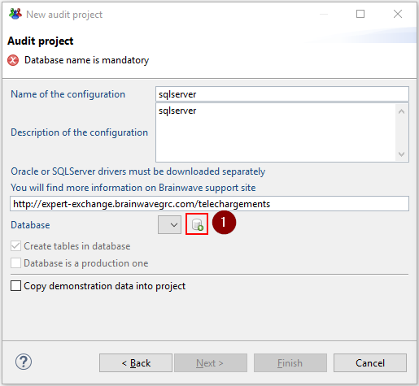
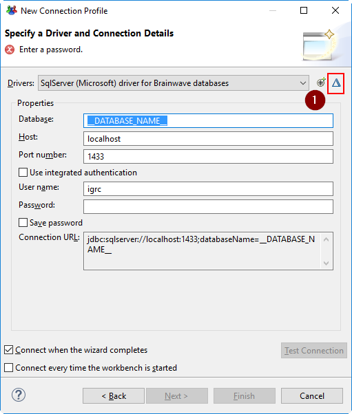
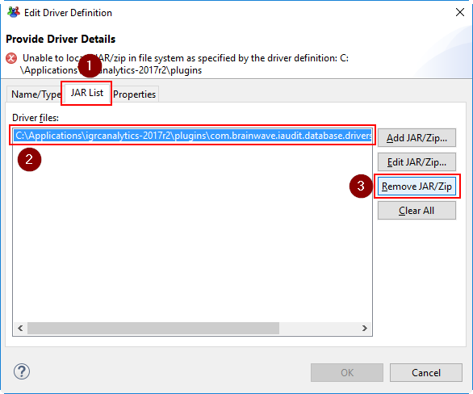
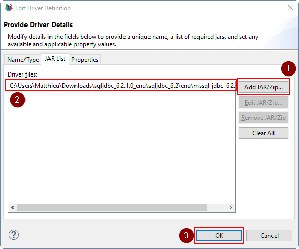

# How to install SQL server and Oracle JDBC drivers

As of version 2017 R2 an updated method has been added to allow the user to import the missing SQL server and Oracle JDBC drivers.

This updated methodology simplifies the import of the missing drivers as it is no longer necessary to manually copy/paste and rename them.

## Prerequisites

This option is only valid as of version 2017 R2

## Dependencies

It is necessary to have previously downloaded the relevant driver versions. You will find more information on where to download them in the following pages :

- SQL Server: [How-To install and use Microsofts SQL server official driver](./sqlserver/install-sqlserver-driver)
- Oracle: [How-to install and use the official Oracle database driver](./oracle/install-orcl-driver)

> [!warning] Please make sure that the correct driver compatible is used for the correct version of the product.  

## Procedure

Once the product is installed you can create a new connection to the database either:

- in the new project wizard

- Or in the technical configuration by creating a new datasource

These options open the wizard allowing the user to configure a new connection profile.  
By clicking on the "edit" button, the triangle icon shown in the caption below, it is now possible to import the desired driver.

This opens a new window where it is possible to add the driver.

An existing definition of the driver is present in the JAR list tab of the window. It is possible to either:

- Edit the driver definition
- Remove and than add a new driver definition

The second method is shown in the captions below.

When adding or editing the driver another window is opened to define the location of the driver. Once selected the path of the driver file should be updated, as shown below:

All that is left to do is to configure the connection details and finish the configuration of the data source.  
This operation copies the selected driver while renaming it to the folder    `C:\Applications\igrcanalytics-2017r2\plugins\com.brainwave.iaudit.database.drivers_1.0.0\drivers`

The SQL server driver will automatically be renamed to `sqljdbc4.jar` while the Oracle driver will be renamed to `ojdbc6_12102.jar`.
