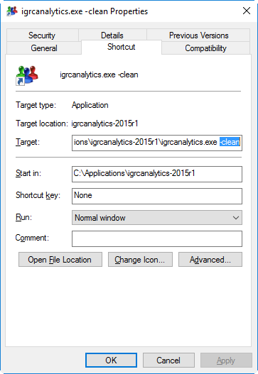

# How-to install and use the official Oracle database driver  

The latest versions of the product no longer comes with the **Oracle** and **Microsoft SQL server** drivers included by default in the installation of the product for licensing reasons.  
As such, it is now necessary for you to download from the vendor's site the latest version of the driver and to include it in the product.  

## Procedure

### Download the driver

To download the driver navigate to the vendor site : [https://www.oracle.com/](https://www.oracle.com/)  

You can find the latest version of the Oracle drivers by hovering the mouse over the **Downloads** menu and under the Database section click **See All**. This bring you to a page where you should find a Drivers section with a JDBC Drivers link. Click on this link.  

The following link should direct you directly to the correct page : [https://www.oracle.com/database/technologies/appdev/jdbc-downloads.html](https://www.oracle.com/database/technologies/appdev/jdbc-downloads.html)  

This will open a new page that lists all available versions of the driver. Select the driver compatible with the version of the database used and click on the link.  

This will open a new page with all available drivers for your database version.  

Select and download the driver named **ojdbcX.jar**.  

> [!warning] Please download the correct version of the driver as a function of the version of JAVA used to run the application.  

### Install the driver

#### Version 2017 R2 and later

If you are using version 2017 R2 or later please refer to the following article for more information on how to install the driver:  

[How to install SQL server and Oracle JDBC drivers](../install-sql-server-oracle-jdbc-drivers)

#### Version 2017 R1 and earlier

Navigate to the following folder in your installation of the product:  

```sh
<Brainwave GRC home installation folder>\plugins\com.brainwave.iaudit.database.drivers_1.0.0\drivers
```

Copy the downloaded jar file to the folder and rename the file exactly to the name provided in the **README.txt** file.  

> [!warning] It is necessary to rename the jar driver as the name of the driver is hard coded in the product. **Incorrectly** naming the driver will result in errors.

### Launch the product

In order for the changes made to the plugins folder to be taken into account it is necessary to launch the product using the `-clean` option.  

This can be done either using the command line by using the following command in a PowerShell window (you have to run the command from the home installation folder of the product) :  

```sh
.\igrcanalytics.exe -clean
```

Or creating a shortcut where you change the target value to add a `-clean` at the end as displayed in the following caption:  



You can then simply use the product as usual.

## Known limitations

As explained above, it is necessary for you to rename the downloaded driver as this name is hard coded in the product.  
The driver name can change from version to version so please refer to the **README.txt** file to be sure that the correct name is used.  
