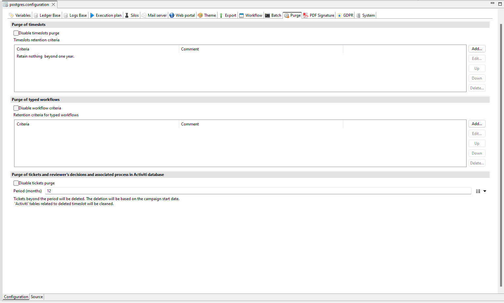
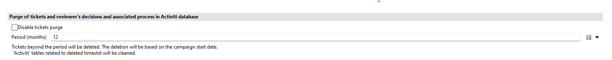

# How to purge tickets and activiti

The purge of tickets and activiti is only possible with the advanced purge using the technical configuration, under the purge tab in the igrc studio.

## Activiti

To purge activiti, 'Disable tickets purge' should be unchecked. During the purge, activiti data related to a deleted timeslot will be cleared.

## Tickets

To purge tickets, 'Disable tickets purge' should be unchecked. Select the keep
period (in month) in the technical configuration. Every ticket created beyond the keep date will be deleted. The date used is based on the campaign start date. To delete a ticket, three criterias must be respected:

- The ticket creation must be beyond the keep period
- The ticket must be related to a deleted timeslot
- The ticket shouldn't be related to an existing campaign

> **Note**: It is important to understand that the period is used to define what you keep and not what you delete !

## Launch Purge

See [Advanced Purge](../../igrc-platform/timeslots-and-execution-plan/02-purge-of-timeslots.md)