# Facet Migration

## Overview

A dedicated facet management tool has been included in iGRCanalytics. It can be used to:  

- List all available facets
- List all installed facets
- View facet documentation, versions, dependencies, variables,...
- Manage facets and perform operations such as:  install, repair, upgrade, delete, etc.
- Upgrade facets using the dedicated migration tool

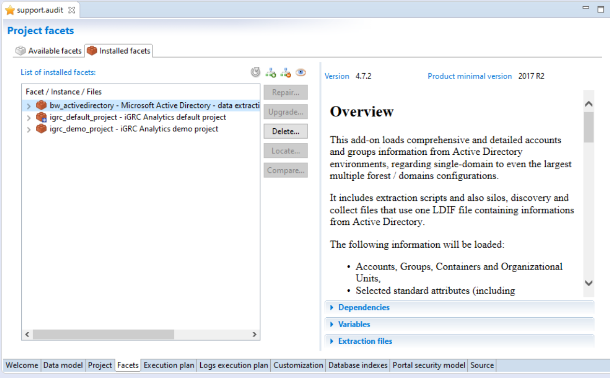

## Prepare the Migration

First check the current version installed.  

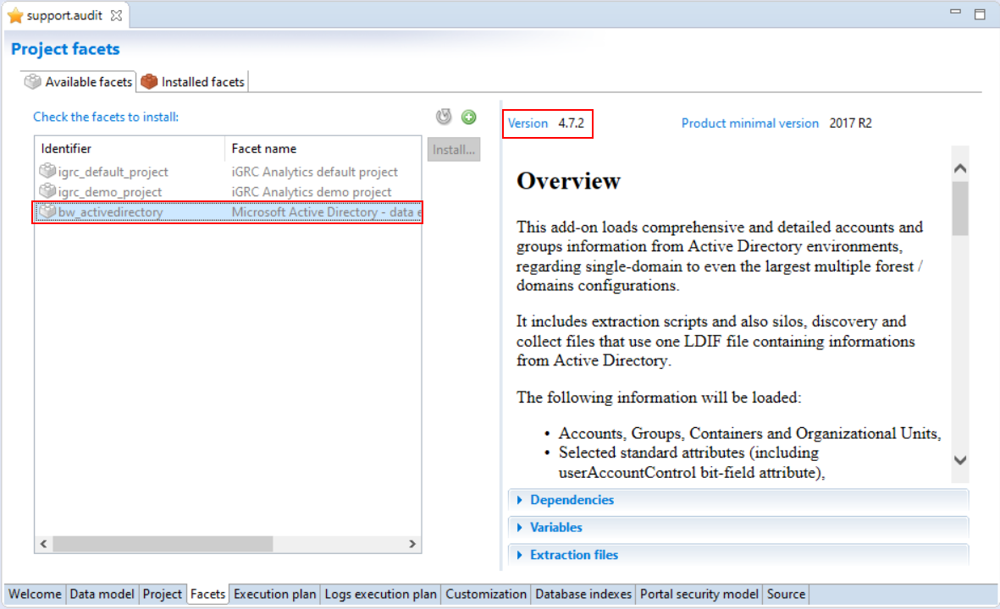

Then download the latest version of the facet from Brainwave's Marketplace [here](https://marketplace.brainwavegrc.com/).

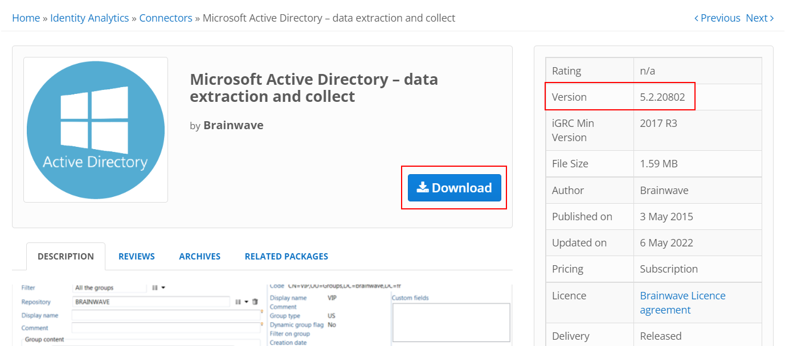

Copy the facet file to the following folder of the project `<projectDirectory>\library\facets`

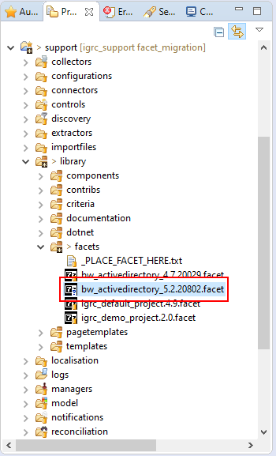

Check that the product has detected the new version, it might be necessary to refresh the list of available facets

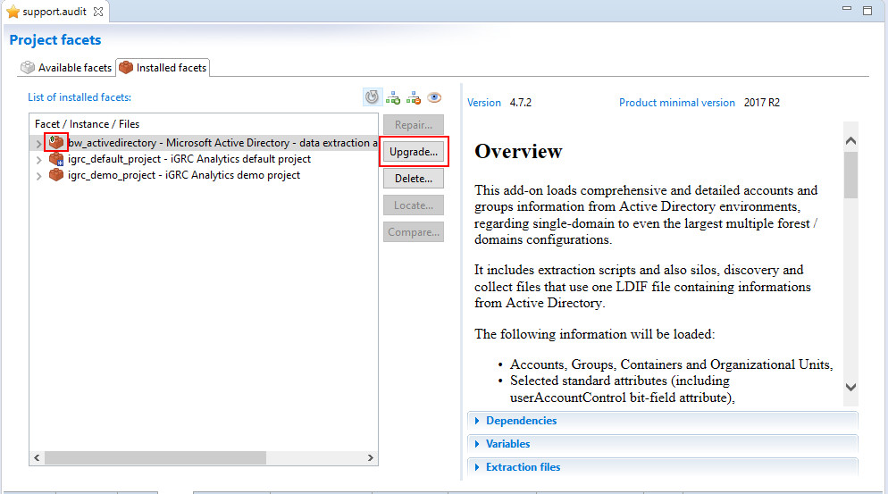

## Launch the Migration

If a newer version of a facet is available the the upgrade button will be available. Clicking this button opens a wizard to help perform the migration of the facet.  
Please follow the steps in the wizard to update your facet.  

### Variable Configuration

This step is ignored if the facet has no variables to configured.  

This dialog lists the existing variables as read only and if there are new variables configured in the updated version of the facet you will be able to set their values:  

### Upgrade Summary

A summary of all actions that will be performed during the upgrade is listed. This details the list of created, updated and/or removed files within the updated facet:  

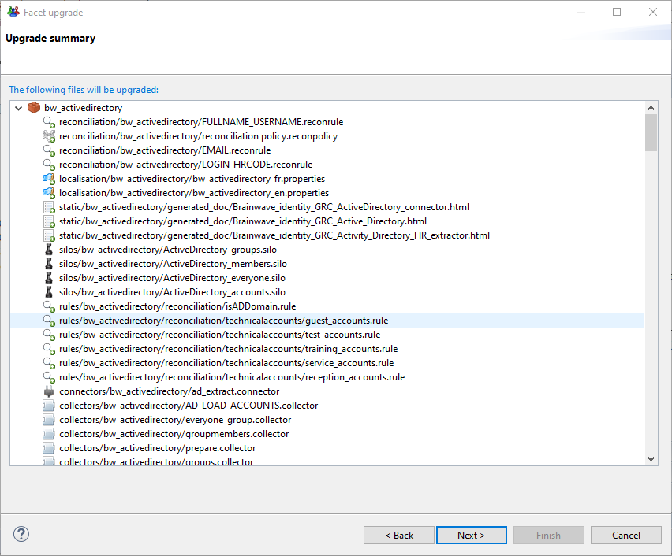

### Deleted Files

This step is shown on only if deleted files exist withing the upgrade.

In some cases files can be deleted when upgrading from one version of a facet to another. However these files can have been previously referenced in customizations performed in the project.  

It is recommended to delete these files after checking that they are obsolete. However, If they are referenced in the project, make sure there are no conflicts with the new add-on files by running a consistency check on the project.

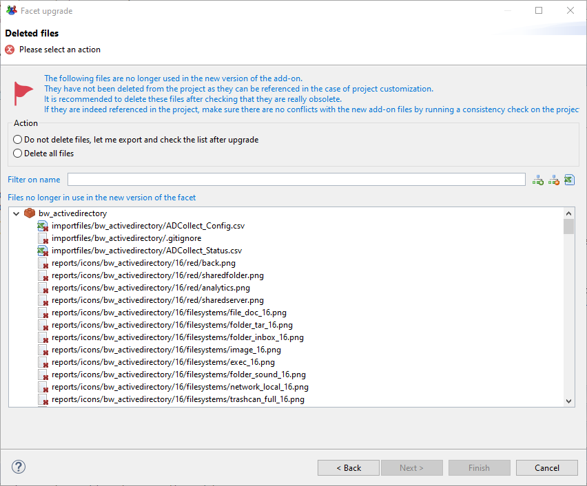

If project customization have been made you can check the option "Delete all files". The migration tool will then automatically delete the listed files durning the upgrade otherwise.

> [!warning] If you check the option "Do not delete files" then please export the list deleted files before proceeding with the migration wizard. This is done by clicking the export tooltip button.  
> The export button will generate a csv file containing the deprecated files. See caption below.  

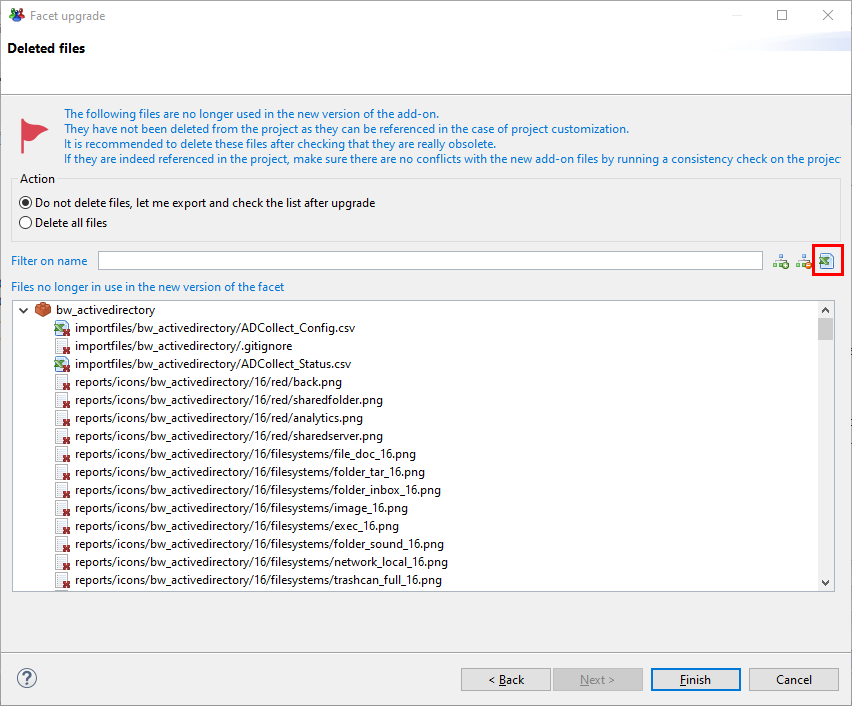

## Merge Tool

At the end of each add-on migration (except when no modification is done) a dialog box shows the results of the upgrade. This dialog displays statistics of the impact of the migration add-on files.  

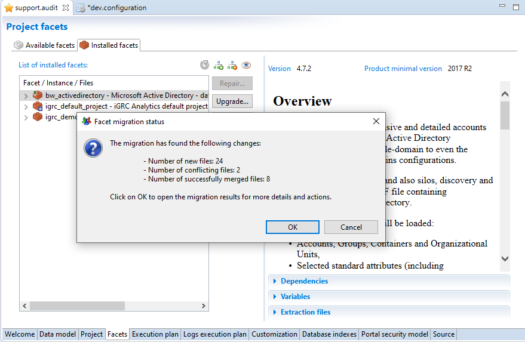

After clicking "OK" you will be redirected to the **add-on migration merge tool** editor. This tool displays information on the migration actions of the add-on. Such as:

- The list of conflicting files
- The automatically merged files
- The list of modifications applied to the existing files
- ...  

A merging tool is provided to help resolve potential conflicts and finalize the migration by copying the manually merged files to your project.  

In the next caption we will explain the information displayed and the possible actions in this editor:  

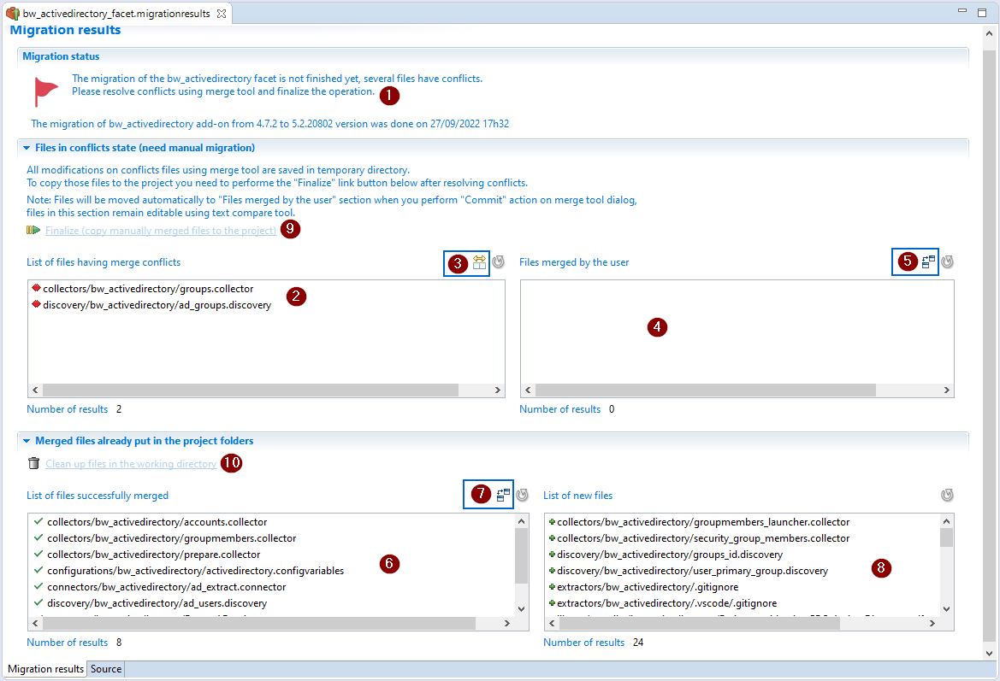

1. **Status of the migration:** Displays the general information on the migration and the current state (Migration has conflicts, is waiting for finalization or finished).  
2. **Conflicting files:** List of files that the product couldn't merge files automatically. The user must complete the operation manually (for example using merge tool see next option).  
3. **Merge tool:** This option will open the merge tool for the selected files. It displays the conflicts and allows the user to merge and commit the changes applied.  
4. **User Merged files:** List of files merged and validated by the user. Files are automatically added to the table when the user commits a modification to resolve conflict (committing from the option above).  
5. **Compare tool (editable):** This option a window that allows the user to compare the files with previous version. This allows the user to see the changes and resolve conflicts operation. Edition is allowed at this level.  
6. **Already merged files:** List of the files merged automatically and added in the project's folder. No operation is now allowed on these files using the compare tool (read-only).  
7. **Compare tool (read only):** This option opens a window to comparing files with their previous versions. The changes to the files are displayed for selected file.  
8. **Added files:** List of new files added.  
9. **Finalize:** This option finalizes the migration process by copying the manually merged files to your project folders. This option is available only once all conflicts are resolved.  
10. **Clean:** This option is available only once migration has successfully finalized. Cleaning will delete the current merge information and all temporary files and folders created during the migration.

### Technical Information

The add-on migration merge tool creates a temporary git repository in your project. This repository is automatically deleted when performing the cleanup. Step 10 above.  

The files displayed in section 2, the List of files having merge conflicts, and section 4, Files merged by the user, are stored in a hidden temporary directory under logs folder, please **don't** empty your `/logs` directory before finalizing the migration.  

The files displayed in section 6, List of successfully merged, and section 8, List of new files, are automatically added to your project.  

### Different Migration States

The add-on migration tool will end in one of the following states:  

1. **Migration has conflicts:** The migration is not finished as there are conflicts.
2. **Migration awainting finalization:** This is an intermediate state where the user has resolved all conflicts but hasn't finalized the migration.
3. **Migration finished successfully:** No actions needed, the add-on migration merge tool is shown just for read-only purpose.

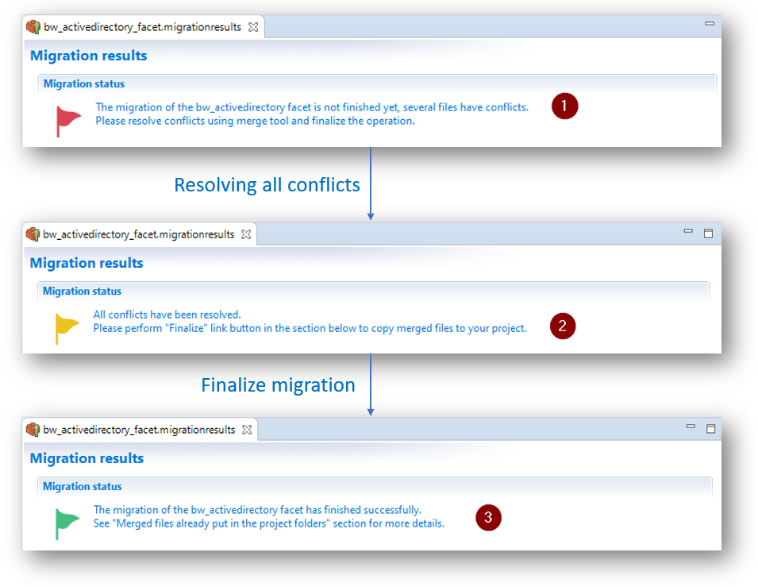

## Resolve Conflicts

Conflicts, which require user action, occur when files cannot be merged automatically.  

The add-on migration merge tool provides three technical ways to resolve conflicts. You are free to choose the action to perform according to your case:  

1. Resolve conflicts using merge tool
2. Keep current version in the project
3. Replace with generated version

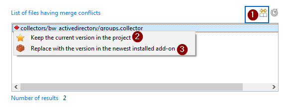

### Resolve Conflicts Using Merge Tool

This is based on Eclipse Egit merge tool. The merge editor shows the current version of the file in the left pane and the version to be merged (version generated by the current migration) in the right pane.
  
You can edit the working tree version, the current version in the project, until you are satisfied. Once finish editing, you must commit the changes . The updated file will then automatically be moved to the section `File merged by the user`.  

In the next caption we will highlight the actions available in the merge tool. We will illustrate using a file having:  

- Conflicting changes
- Non conflicting changes
- Preserving user customization

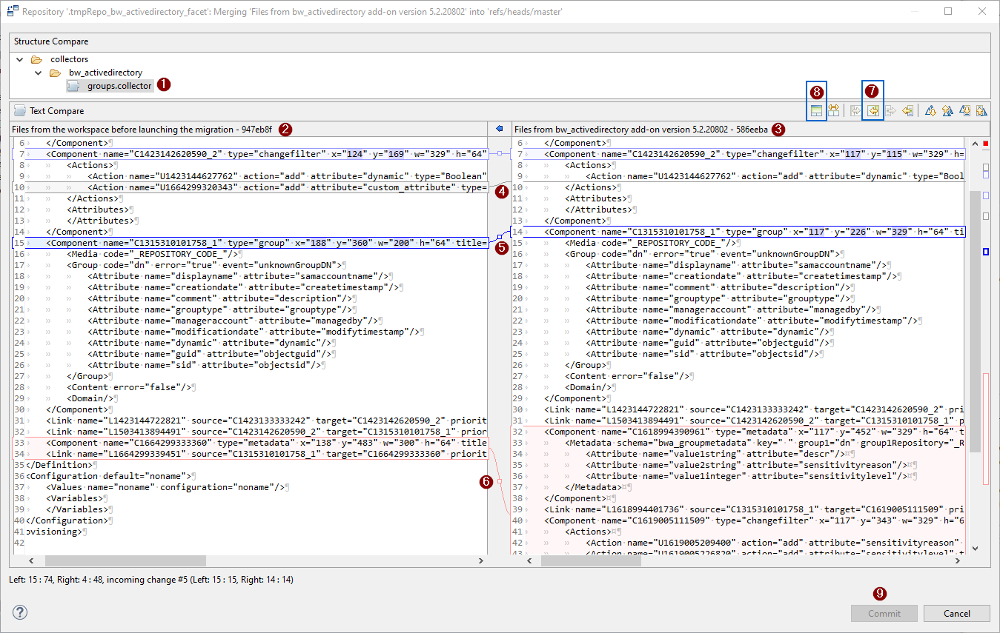

1. The conflicting File name
2. The left pane displays the working tree version. The current version of the file in the project.
3. The right pane displays the content generated by the current migration.
4. When changes have not been merged as the user customized this line by adding new attributes for example. This customization will be kept, the merge tool highlights the line with grey color to show that there is a difference.
5. When non conflicting changes have been detected. Non conflicting changes,  highlighted in blue, are generally new content to add to your file. To automatically add all non conflicting changes, perform the option displayed in point 7
6. Conflicts: conflict occur when changes are applied to the same code when comparing with previous file content. The changes displayed in the left pane are done by the user and in the right pane are done by the migration engine. In this situation the user has to decide if he needs to keep the two versions by grabbing the differences from right to left, keep his version (left pane) or replace his version by the generated version (right pane).
7. The "copy of non conflicting changes" allows to copy all changes highlighted in blue from the right pane to the left.
8. The ancestor pane: This allows to Show/Hide Ancestor pane that contains the version of the file from the previous facet version before the user changed the file manually. Using this pane can be helpful to understand the difference between changes displayed in the left and right pane.
9. Commit: Use this button to validate your modifications, after this validation the file will be moved from the list of files having merge conflicts to Files merged by the user.

To copy the current selected change from right to left you can use the option shown below

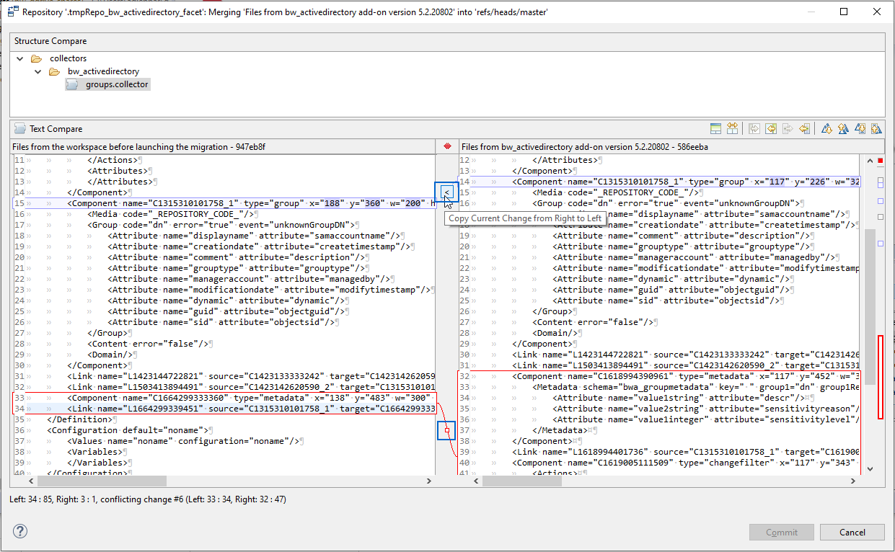

> When confronted with complicated conflicts, the best solution is to use **Replace with the version from the newest add-on** option and then use the comparison tool on the files merged by the user to only take the changes from current version of the workspace to the migration version. This minimizes the risk of conflicts on this file in the future add-on migration.

### Waiting to Finalize Migration

This is an intermediate state where all conflicts have been resolved and you can now copy the merged files to the project. When in this state files are stored in temporary directory.  

### Finalize Migration

This operation will copy files merged by the user and replace files in the project. At the end of this operation this list of files will be moved to the list of successfully merged files.  

No changes on files will then be possible. Changes are displayed in read only. Once done you can clean the temporary working directory.

### Clean Temporary Working Directory

The Add-on migration merge tool is still available for read-only purpose, to check easily the changes applied to your project files.  

If no longer necessary you can clean up files in the working directory to delete the migration result file and related temporary working directories and files. These files are all stored in the `/logs` directory of the project.  

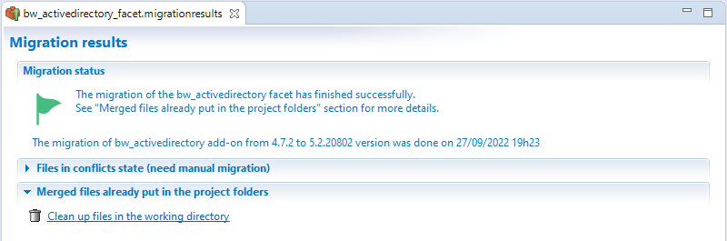

The list of deleted files are:  

1. Migration result file `logs/ADD-ON-NAME_facet.migrationresults`
2. Working directories `logs/.ADD-ON-NAME_facet folder`
3. Temporary git repository

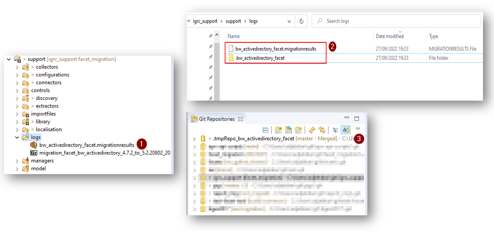
