# Table of contents
{: .no_toc .text-delta }

1. TOC
{:toc}
---

# Facets: Principles

A dedicated framework allowing to create your own facets is included in iGRC. It can be used to help structure your project, so even if your goal is not to make a publishable facet, we advise you to check it out.  

## What is a Facet ?

A facet is basically a part of a project that can be installed and uninstalled at will, allowing to add / remove functionalities in a seamless way. Those can be collectors for specific applications, workflow processes, reports, examples or documentation, etc. The advantage of delivering project content in a facet over simply dropping a bunch of files are mainly :     

- the possibility to install and remove the files in a single operation, allowing to avoid interferences with the rest of the project
- the possibility to repeat the same installation on any number of iGRC instances  
- the possibility to track file modifications and to apply upgrades
- the possibility to provide out-of-the-box functionalities to people that will not need to understand every detail of the content, thanks to advanced features like variables usage or conditional installation of files
- the possibility to make your work available to others through Brainwave's marketplace

You can check out our [Tips for designing a facet collecting data]({{site.baseurl}}) if you are interested in creating a facet dedicated to a given application.

## Start a New Facet Project

To start with your facet creation, you can select **Facet** in the **New...** section of the main menu. You will have to give an identifier and a version for your facet.  

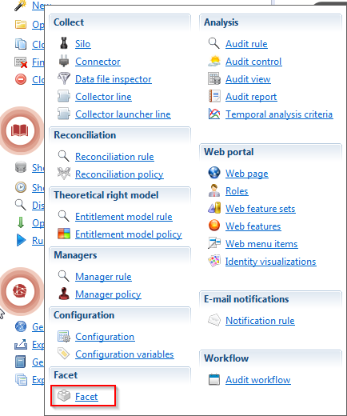

Validating this wizard will have the following effects on your project :  

- it will create a directory named after your facet in the _facets\_info_ folder
- it creates the main facet description file, called _manifest.xml_, in this folder
- it creates a _\_resources_ folder at the same location, containing all the additional resources needed to document the facet that will not be included in the project during facet installation  
- it adds directories named after the facet in the project main folders (_/collectors_, _/rules_, _/webportal/pages_, etc)

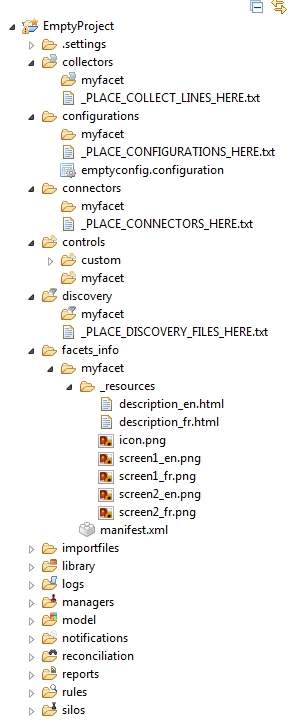

Don't panic when you see all those changes to your project, as you can very easily remove all those additional elements. In the **Build** tab of the facet editor, you will find options to remove / recreate the facet folders. Only the empty folders will be deleted, so you will need to remove the main folder in _/facets\_info_ manually. This option can also be used to tidy up your project from unnecessary folders when you are done adding files to build your facet.

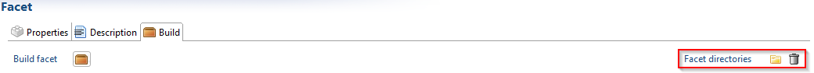

To create a fully functional facet, you need to fill out the facet manifest, add the necessary resources for its tracking and publication, and drop the files you want in the relevant folders.  

## Facet Manifest and Resources

The facet manifest contains all the information needed for publication in the facet store, along with information displayed during the installation of the facet.  

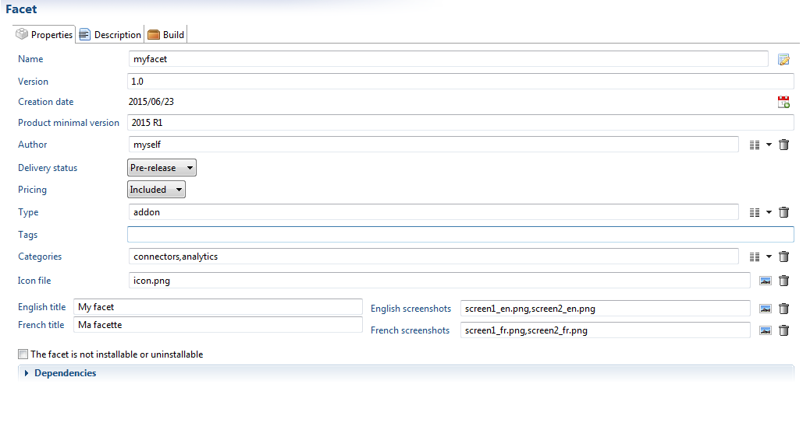

Here are the main attributes that are required :     

- a unique identifier
- a version number (in the format x.y). This is especially important as the user will be prompted for updates when a higher version is available  
- a creation date. This field is required, but you can very easily change it to the current date using the dedicated button
- a product minimal version on which the facet can be used. It is automatically filled with your current version, and it is strongly advised not to change it unless you known what you are doing.
- the facet author. That would be you (or your company) !  
- a delivery status. This is mainly to indicate the development stage of the facet, and mark obsolete facets as deprecated
- a pricing, which you don't really need to bother with
- a type between Add-on or App. Most facets will be considered Add-ons, as an App has to thoroughly adress a topic, from data collection to controls and restitution in reports and pages.  
- a list of tags (separated by commas) that will help reference your facet. Examples : Sharepoint, Microsoft, Server
- a category or list of categories (reports, connectors, etc)
- an icon file, which will be displayed in the facet store. It has to be placed somewhere in the \__resources_ folder  
- English and French titles for the facet. Those will be displayed on the store as well as in the facet installation list
- English and French screenshots, used in the facet store. It has to be placed somewhere in the \__resources_ folder

The option 'the facet is not installable or uninstallable' only concern facets that will be automatically included in projects, so should never be checked.     

In addition to these informations, nationalized description files have to be provided. Those files, in HTML format, will be used both in the facet store and the installation description of the facet. They are automatically created in the \__resources_ folder with a general canvas that will have to be kept ; clicking on a the button shown below will open the file in an HTML editor. Once modified, you can check the results by refreshing the view in the **Description** tab of the facet editor.  

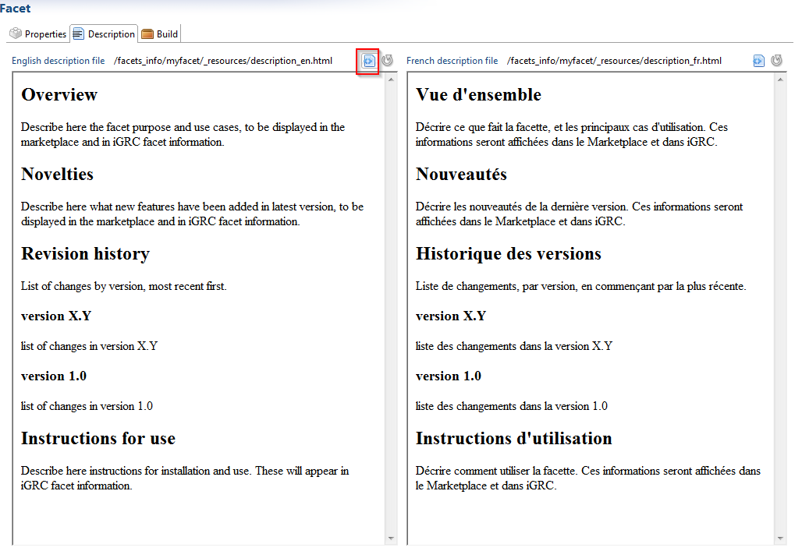

## Facet Files and Folders

You only need to drop files in a directory named after your facet to have them automatically included in the facet. The files do not need to be directly under the facet folder either, as all files and folders will be embedded in the facet.  

Moreover, you are not limited to the folders that are created by the wizard, which are there to help you save time. If, for any reason, you need to have a file inserted into _/library/components_, you just need to create the folder _/library/components/myfacet_ and put whatever you need inside.  

When building the facet, all the empty directories will be discarded, so you do not need to delete all your unused facet directories. Anyway, you can have them all deleted by using the dedicated action in the **Build** tab (see above for details).  

The **Build** tab offers an overview of all the files currently included in the facet. You can also open the file by clicking on it.  

NB: you can take advantage of the facet framework to manage your project, even if you don't intend to create a facet out of it. For instance, if you have a new application to integrate into your project, it might be a good idea to create a new facet for this application. You will then automatically have folders matching your application name, can track the files that relate to this application in the **Build** tab. And you still keep the option to create a facet out of it, be it to transfer it for testing purposes or to have it released on the facet store.  

## Extraction Files

Some data collection facets have to provide extraction means (scripts, librairies, documentation,...). Usually those files do not need to be installed in the project, but must be sent to the persons in charge of the data extraction on the physical systems.  

To this effect, a special treatment is reserved to a folder named **extractors** , which has to be created under the resources folder. The elements of this folder will not be deployed in the project, but instead can be retrieved in a zipped archive in the project facet tab.  

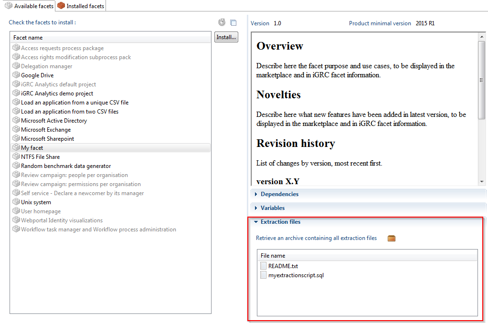

## Example Files

Is is possible to include optional example files in your facet. This can help provide an example of a data file, a report, a control, etc. Simply add those files in a directory called 'example' in any of the facet directories, and they will automatically be included in the facet, and the user will automatically be provided with a choice to include those example files when installing the facet.  

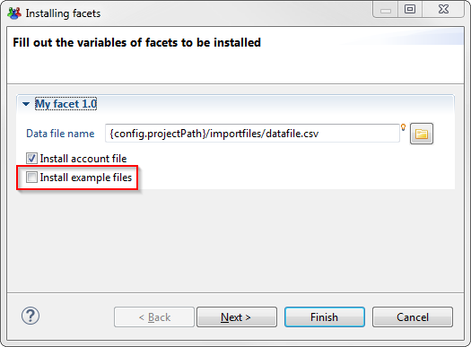

## Dependencies

Dependencies are facets that need to be installed for your facet to be functional. For example, you would need to have the Active Directory facet installed for Microsoft applications using the Active Directory accounts and groups to be correctly loaded, or you would require the task manager in order to be able to launch the new process contained in your facet.  

You can declare dependencies in the 'Dependencies' section of the editor main tab. The facets have to be selected in the project, but can be other facets still under construction as well as facets already packaged in a .facet file.  

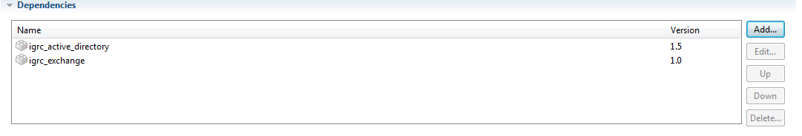

Declaring dependencies will make sure they will always be installed along with your facet, and will prevent facet installation if they are not available.  

# Add-on Creation

## Build your Facet

Once you are satisfied with the content of your facet, you can build the .facet file that can be installed in other iGRC projects. To do this, simply select the action **Build facet** in the **Build** tab. The files that will be included in this build are listed in the table at the bottom of the screen. The empty facet directories are not shown in this list and will be discarded.  

The build action will create a facet file with the correct name and version in the /_facets\_infos/facets\_outputs_ folder of the project. Beware that, it will overwrite the file if it already exists.  

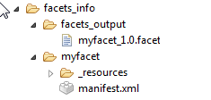

## Work with Variables

Some facets require user input to function properly (a file or folder path, a repository name, ...). The best way to deal with this is to define [configuration variables]({{site.baseurl}}).   
In a .configvariable file included in the facet, and to use them where this information is needed (a discovery file, a collector line, etc). This ensures that your facet project is running completely with the values inside you local configuration, and that, during facet installation, the user will be prompted for those values.     
Please note that your configuration variables will be automatically renamed in the user project, to avoid naming conflicts, so that you do not need to choose elaborate naming patterns juste for this purpose. In the configuration editor, the variables will be clearly stated as having the facet for origin. Also, the user will be able to change the choices he made initally having to reinstall the facet, by simply overriding those variable values.  

It is possible to have variables labels nationalized, allowing for the correct label to be displayed in the user interface when installing the facet. See our article on [Nationalisation of labels included in project files]({{site.baseurl}})

## Conditional File Installation

It is possible to have some of the files installed conditionally based on the values of the facet variables that the user inputs. This can help build complex facets that adapt to different situations.    
Let's say, for example, that you are building a facet for an application which extraction can come in CSV format as well as XML. You will then have a discovery file for each format, but only want to install the one relevant to the user. The simplest way to do this is to create a configuration variable that will hold the file format. Then you just need to add the condition _config.format == 'CSV'_ on your CSV discovery file in the **Files conditional installation** section of the **Build** tab, and likewise for the XML format file.   
During facet installation, the proper file will be selected based on what format value the user chooses to input.  

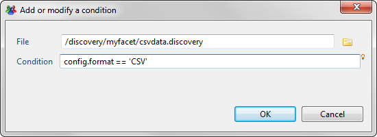

|**Compatibility**  This functionality is available as of version **2015 R2**|

A facet, otherwise called an add-on, for data collection should take advantage of the silos concept to be able to iterate over any number of data files.  
This way, adding a new data file into the project, being a new file system, a new server or a new domain, will be as easy as dropping the new file in an input folder.  

To achieve this, you have to create a silo for your application, and check the option 'Iterate on files within a folder' (please refere to the corresponding documentation for more information).     
The name of the file will have to carry the information you need (for instance the server name). You can also use the filter, with naming conventions, if you have more than one file to include in the collection. See the article on [Silo concept]({{site.baseurl}}).      

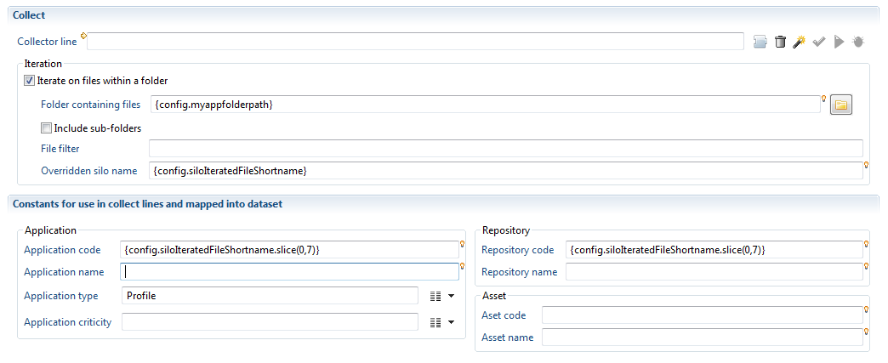

The global variable _config.siloIteratedFileShortname_ can be used to retrieve the server name for the repository or application, and also for the silo name.      

Basically, your collector lines must manage everything with the name of the current file being passed on in this variable. The only information that you need from the user is the directory where the files are dropped. This is the information that needs to be added to a configuration variable. These variables are declared in a `.configvariable` type file, and should be included to the add-on. To create this file you can click New... in the audit menu :  

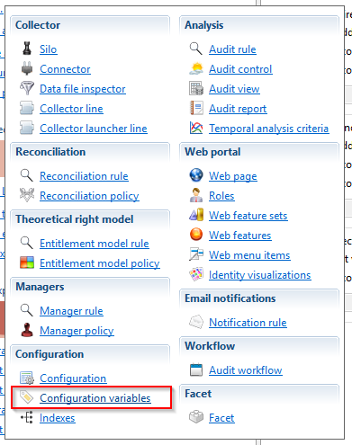

As a result, the user will only be asked for this directory location when installing the facet, and all the rest will be taken care of automatically. There will be no need to reinstall the facet when the number of files to load changes. 

# Facet Migration

## Overview

A dedicated facet management tool has been included in iGRC. It can be used to: 

- List all available facets
- List all installed facets
- View facet documentation, versions, dependencies, variables,...
- Manage facets and perform operations such as:  install, repair, upgrade, delete, etc.
- Upgrade facets using the dedicated migration tool 

## Prepare the Migration

First check the current version installed.  

Then download the lastest version of the facet fromt Brainwave's Marketplace [here](https://marketplace.brainwavegrc.com/).

Copy the facet file to the following folder of the project `<projectDirectory>\library\facets`

Check that the product has detected the new version, it might be necessary to refresh the list of available facets

## Launch the Migration

If a newer version of a facet is available the the upgrade button will be available. Clicking this button opens a wizard to help perform the migration of the facet.  
Please follow the steps in the wizard to update your facet.  

### Variable Configuration

This step is ignored if the facet has no variables to configured.  

This dialog lists the existing variables as read only and if there are new variables configured in the updated version of the facet you will be able to set their values:  

### Upgrade Summary

A summary of all actions that will be performed during the upgrade is listed. This details the list of created, updated and/or removed files within the updated facet:  

### Deleted Files

This step is shown on only if deleted files exist withing the upgrade.

In some cases files can be deleted when upgrading from one version of a facet to another. However these files can have been previously referenced in customizations performed in the project. 

It is recommended to delete these files after checking that they are obsolete. However, If they are referenced in the project, make sure there are no conflicts with the new add-on files by running a consistency check on the project.

If project customization have been made you can check the option "Delete all files". The migration tool will then automatically delete the listed files durning the upgrade otherwise.

> **Important** If you check the option "Do not delete files" then please export the list deleted files before proceding with the migration wizard. This is done by clicking the export tooltip button. 
> 
> The export button will generate a csv file containing the deprecated files
> 
> 

## Merge Tool

At the end of each add-on migration (except when no modification is done) a dialog box shows the results of the upgrade. This dialog displays statistics of the impact of the migration add-on files.  

After clicking "OK" you will be redirected to the **add-on migration merge tool** editor. This tool displays information on the migration actions of the add-on. Such as:

* The list of conflicting files
* The automatically merged files
* The list of modifications applied to the existing files
* ...  

A merging tool is provided to help resolve potential conflicts and finalize the migration by copying the manually merged files to your project. 

In the next caption we will explain the information displayed and the possible actions in this editor :

1. **Status of the migration:** Dispalys the general information on the migration and the current state (Migration has conflicts, is waiting for finalization or finished).  
2. **Conflicting files:** List of files that the product couldn't merge files automatically. The user must complete the operation manually (for example using merge tool see next option).  
3. **Merge tool:** This option will open the merge tool for the selected files. It displays the conflicts and allows the user to merge and commit the changes applied.  
4. **User Merged files:** List of files merged and validated by the user. Files are automatically added to the table when the user commits a modification to resolve conflict (committing from the option above).  
5. **Compare tool (editable):** This option a window that allows the user to compare the files with previous version. This allows the user to see the changes and resolve conflicts operation. Edition is allowed at this level.  
6. **Already merged files:** List of the files merged automatically and added in the project's folder. No operation is now allowed on these files using the compare tool (read-only).  
7. **Compare tool (read only):** This option opens a window to comparing files with thier previous versions. The changes to the files are displayed for selected file.  
8. **Added files:** List of new files added.  
9. **Finalize:** This option finalizes the migration process by copying the manually merged files to your project folders. This option is available only once all conflicts are resolved.  
10. **Clean:** This option is available only once migration has successfully finalized. Cleaning will delete the current merge informaiton and all temporary files and folders created during the migration.

### Technical Information

The add-on migration merge tool creates a temporary git repository in your project. This repository is automatically deleted when performing the cleanup. Step 10 above.    

The files displayed in section 2, the List of files having merge conflicts, and section 4, Files merged by the user, are stored in a hidden temporary directory under logs folder, please **don't** emply your `/logs` directory before finalizing the migration.  

The files displayed in section 6, List of successfully merged, and section 8, List of new files, are automatically added to your project.  

### Different Migration States

The add-on migration tool will end in one of the following states:  

1. **Migration has conflicts:** The migration is not finished as there are conficts.
2. **Migration awainting finalization:** This is an intermediate state where the user has resolved all conflicts but hasn't finalized the migration.
3. **Migration finished successfully:** No actions needed, the add-on migration merge tool is shown just for read-only purpose.

## Resolve Conflicts

Conflicts, which require user action, occure when files cannot be merged automatically.  

The add-on migration merge tool provides three technical ways to resolve conflicts. You are free to choose the action to perform according to your case:  

1. Resolve conflicts using merge tool
2. Keep current version in the project
3. Replace with generated version

### Resolve Conflicts Using Merge Tool

This is based on Eclipse Egit merge tool. The merge editor shows the current version of the file in the left pane and the version to be merged (version generated by the current migration) in the right pane.
  
You can edit the working tree version, the current version in the project, until you are satisfied. Once finish editing, you must commit the changes . The updated file will then automatically be moved to the section `File merged by the user`.  

In the next caption we will highlight the actions available in the merge tool. We will illustrate using a file having:  
* Conflicting changes
* Non conflicting changes
* Preserving user customization

1. The conlicting File name
2. The left pane displays the working tree version. The current version of the file in the project.
3. The right pane displays the content generated by the current migration.
4. When changes have not been merged as the user ustomized this line by adding new attributes for example. This customization will be kept, the merge tool highlights the line with grey color to show that there is a difference.
5. When non conflicting changes have been detected. Non conflicting changes,  highlighted in blue, are generally new content to add to your file. To automatically add all non conflicting changes, perform the option displayed in point 7
6. Conflicts: conflict occure when changes are applied to the same code when comparing with previous file content. The changes displayed in the left pane are done by the user and in the right pane are done by the migration engine. In this situation the user has to decide if he needs to keep the two versions by grabbing the differences from right to left, keep his version (left pane) or replace his version by the generated version (right pane).
7. The "copy of non conflicting changes" allows to copy all changes highlighted in blue from the right pane to the left.
8. The ancestor pane: This allows to Show/Hide Ancestor pane that contains the version of the file from the previous facet version before the user changed the file manually. Using this pane can be helpful to understand the difference between changes displayed in the left and right pane.
9. Commit: Use this button to validate your modifications, after this validation the file will be moved from the list of files having merge conflicts to Files merged by the user.

To copy the current selected change from right to left you can use the option shown below

> **Note:** When confronted with complicated conflicts, the best solution is to use **Replace with the version from the newest add-on** option and then use the comparison tool on the files merged by the user to only take the changes from current version of the workspace to the migration version. This minimizes the risk of conflicts on this file in the future add-on migration.

### Waiting to Finalize Migration

This is an intermediate state where all conflicts have been resolved and you can now copy the merged files to the project. When in this state files are stored in temporary directory.  

### Finalize Migration

This operation will copy files merged by the user and replace files in the project. At the end of this operation this list of files will be moved to the list of successfully merged files.  

No changes on files will then be possible. Changes are displayed in read only. Once done you can clean the temporary working directory.

### Clean Temporary Working Directory

The Add-on migration merge tool is still available for read-only purpose, to check easily the changes applied to your project files.  

If no longer necessary you can clean up files in the working directory to delete the migration result file and related temporary working directories and files. These files are all stored in the `/logs` directory of the project.  

The list of deleted files are:  

1. Migration result file `logs/ADD-ON-NAME_facet.migrationresults`
2. Working directories `logs/.ADD-ON-NAME_facet folder`
3. Temporary git repository

