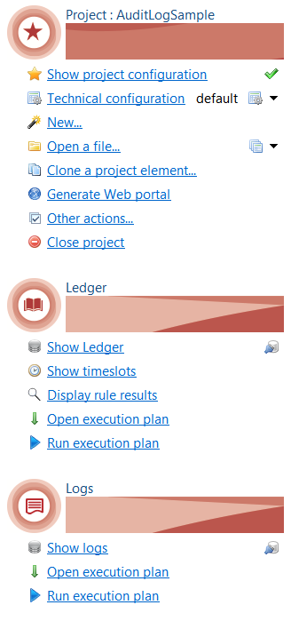
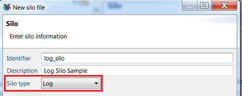
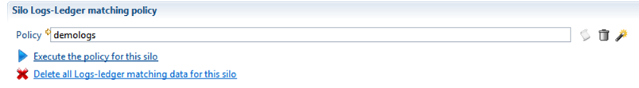
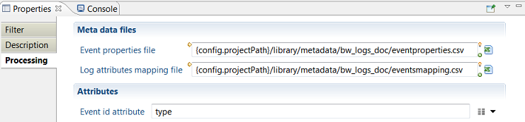
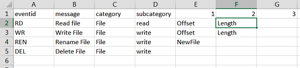
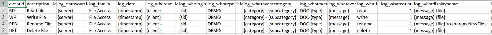
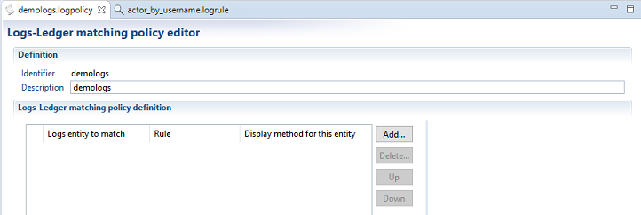
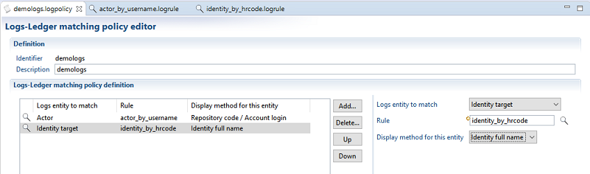
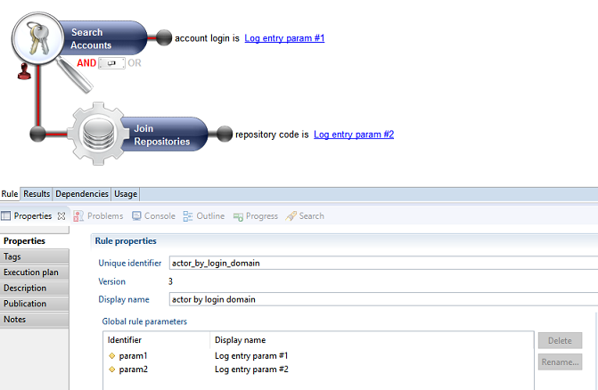

# How to Collect Audit Logs

The data collection chain for audit log data is different from that of Identity Ledger data. It uses specific silos, data collection lines, and a separate execution plan.


The main reason for this is that, contrary to Audit Ledger data (people, organizations, accounts, etc.), Audit Logs data are not bound to any given timeslot, therefore must be executed separately.

The **Audit Project View** has been reorganized to give easier access to Ledger and Logs features:



## Audit Log Silos

A new silo type named **auditlog** has been introduced to wrap around audit log collect lines and iterate over audit log data files.  

The auditlog silo also runs the logs-ledger matching policy.  

An **auditlog** silo differs from the other identity ledger silo types in the following ways:  

- An auditlog silo can only be included in and launched from an audit log execution plan
- An auditlog silo can only refer to a log-related collect line.  It can however link to any type of extraction connectors.
- An auditlog silo will run the Logs-Ledger matching policy at the end of the logs collect.
- An auditlog silo's execution is not related to any timeslot or sandbox.

### Create an Audit Log Silo

To create an auditlog silo, you need to select **Log** as the silo type in the silo creation box :  



Configure the silo the collect parameters by choosing an audit log collect line and file iteration parameters.  
You must then select the Logs-Ledger matching policy to use for that silo (cf. § **Logs-Ledger matching policy** ).  



> Running and debugging an audit log silo:  
> You run and debug an audit log silo the same way as you run and debug a regular ledger silo except that there is no dialog box for selecting/creating a sandbox or a timeslot, so the execution starts immediately after clicking the button.

## Audit Log Collection Lines

Audit Logs collection lines allows to collect data related to audit log targets and to insert it into the database.  

An audit log collection line differs from a regular ledger collect line in the following ways:  

- An audit log collection line can only be referenced in an audit log silo whereas a regular collect can only be referenced in non-audit log silos.
- An audit log collection line can only target Audit Logs whereas a regular collect can target all ledger resource types (identities, organizations, etc.). The target palette in the editor is updated accordingly.
- An audit log collection line (resp. ledger collect) can only reference other audit log (resp. ledger) sub-collects.

To collect audit log data, you do the following:  

- Create an audit log collection line
- Include some source or discovery component to load the log data extracted attributes
- Optionally add some postprocessing and logic to transform the extracted data to the expected format
- Add an audit log target component to gather the data and insert it into the database
- Map the extracted and computed attributes to the audit log target standard fields

### Create an Audit Log Collection Line

To create an audit log collect line, do the following:

- Check **The collect target logs** box in the collector creation dialog box


- The collect line editor is displayed with specific logs components:  
  - **Logs target** target component
  - **Logs Processing** filtering component


The logs collect line will typically include a source of data, one or more intermediary components to process and enrich the source data and a final audit log target component to insert the enriched data into the database.  

### Add an Audit Log Source

Audit logs source data can be any suitable source of logs data.  
This is typically a CSV file containing raw logs data, provided by a an external discovery component.

### Process Audit Logs

Audit logs source raw data must be enriched and processed before being inserted into the database.  
Processing typically consists of:

- Normalizing values (dates)
- Adding hard-coded values ( such as event family )
- Replacing event code-fields by readable labels (ie ActiveDirectory "4722" event code by: "An user account was enabled")
- Computing contextual labels describing the event (ie "a security-enabled group was created: "Finance" )
- Computing Formatted presentation of event custom properties

These processing can be achieved as usual using **Update** filter component with javascript expressions and/or **Join** processing with event tables.  
This approach is suited when working with small to medium volumes of logs data.

### Work with Log Processing Component

The recommended approach to process large volumes of log data is to use the " **Logs Processing**" filter component which is dedicated to the processing of logs data and ensures high-speed performance while offering enough flexibility.

To add a **Logs Processing** step to your collect, drag it from the Filters drawer of the palette, and insert it between the source and the target.  
Then select the component to configure it:



Logs Processing configuration consists of the following:  

- **Event Properties file** : path to a csv file describing the different events types and their properties
- **Log Attributes Mapping file** : path to another csv file defining the values of audit logs target  expected attributes
- **Event id attribute** : name of the attribute holding the event type in the source dataset.

Event Properties File format:  
The **Event Properties** file describes the events expected in the logs data files.  
It must follow the formatting rules below :  

- Input CSV file with semicolon separated fields.
- One row in the CSV file per event type
- Identifying columns:  
there are 4 mandatory columns describing the event :
  - **eventid** :  the identifier of the event "type". Values must match event id values in the source discovery. (eg. `SMB_RD`, 1248, etc. )
  - **message** :  a readable short sentence describing the event type (eg. "Read File", "User Logon", etc.)
  - **category** : category name of the event, to help organize hundreds of event types
  - **subcategory** : optional sub-category to help organize the event
- Event-specific columns:  
Each event may have a number of specific properties that are defined only for this event type (e.g. name of new file for "rename file" event, name of target group for "move account" event, etc.).  
If present, these specific properties are provided by an attribute of the dataset that must be named **properties** and formatted as pipe "|" separated list of values.  
In this case, the **Event Properties** file will have n columns for that event, each column defining the **name** of the specific property for that event.  
The Event Properties file being tabular, it will have at least N additional columns, numbered 1, 2, N where N is the maximum number of specific properties for any given event.  

The figure below shows an example of Event Properties file with 4 events:  



- event #1 has type "RD", label "Read File" and 2 specific properties named Offset and Length
- event #3 has type "REN", label "Renamed File" and 1 specific property named New File
- event #4 has type "DEL", label "Delete File" and no specific properties.

**Log Attributes Mapping file:**  
The **Log Attributes Mapping** file defines the values of all log target attributes for each event type.  
Each value can be either static , or based on the source dataset attributes and/or event-specific properties.  

The file must follow the formatting rules below:  

- CSV file with semicolon-separated values
- One row per event type
- Must have the following 49 columns ( case sensitive):

| eventid                  | id of the event, must match same entry in the Event Properties file                     |
| :----------------------- | :-------------------------------------------------------------------------------------- |
| description              | (optional) Description of the event, used by and for the designer                       |
| `log_mandant`            | value for the mandant attribute. See Audit Log target attributes below for the meaning. |
| `log_datasource`         | same as above                                                                           |
| `log_externalref`        | same as above                                                                           |
| `log_family`             | same as above                                                                           |
| `log_date`               | same as above                                                                           |
| `log_wheresource`        | same as above                                                                           |
| `log_wheredestination`   | same as above                                                                           |
| `log_whologin`           | same as above                                                                           |
| `log_whorepository`      | same as above                                                                           |
| `log_whoidentity`        | same as above                                                                           |
| `log_whosessionid`       | same as above                                                                           |
| `log_whateventcategory`  | same as above                                                                           |
| `log_whateventcode`      | same as above                                                                           |
| `log_whateventcodelabel` | same as above                                                                           |
| `log_whataction`         | same as above                                                                           |
| `log_whatpayload`        | same as above                                                                           |
| `log_whatstatus`         | same as above                                                                           |
| `log_whatcount`          | same as above                                                                           |
| `log_whatdisplayname`    | same as above                                                                           |
| `log_whattargettype`     | same as above                                                                           |
| `log_whattargetname`     | same as above                                                                           |
| `log_whattargetparent`   | same as above                                                                           |
| `log_whattarget2type`    | same as above                                                                           |
| `log_whattarget2name`    | same as above                                                                           |
| `log_whattarget2parent`  | same as above                                                                           |
| `log_whatoldvalue`       | same as above                                                                           |
| `log_whatnewvalue`       | same as above                                                                           |
| `log_whatdata`           | same as above                                                                           |
| `log_custom1`            | same as above                                                                           |
| `log_custom2`            | same as above                                                                           |
| `log_custom3`            | same as above                                                                           |
| `log_custom4`            | same as above                                                                           |
| `log_custom5`            | same as above                                                                           |
| `log_custom6`            | same as above                                                                           |
| `log_custom7`            | same as above                                                                           |
| `log_custom8`            | same as above                                                                           |
| `log_custom9`            | same as above                                                                           |
| `log_custom10`           | same as above                                                                           |
| `log_custom11`           | same as above                                                                           |
| `log_custom12`           | same as above                                                                           |
| `log_custom13`           | same as above                                                                           |
| `log_custom14`           | same as above                                                                           |
| `log_custom15`           | same as above                                                                           |
| `log_custom16`           | same as above                                                                           |
| `log_custom17`           | same as above                                                                           |
| `log_custom18`           | same as above                                                                           |
| `log_custom19`           | same as above                                                                           |

Each cell of the CSV file defines the value of a given log attribute ( column) for a given event type (line) using  syntax below. It can be left blank for no-value.  

| **Type of Content** | **Syntax** | **Example** |
|:--|:--|:--|
| static content | string | File Access |
| value of an attribute from <br> the source discovery | name of the attribute enclosed in braces | `{timestamp}` |
| value of a column from <br> the event properties file | `{category}`, `{subcategory}` or `{message}` |  `{category}`|
| value of an event-specific property | name of the specific property, prefixed by param. <br> and enclosed in braces | {param.NewFile} |
| formatted string of <br> all specific properties |  `{formattedRawData}` | Example of output:<br><br> Subject:<br> &emsp;Security ID:  SYSTEM <br> &emsp;Account Name:  WIN-R9H529RIO4Y$ <br><br> &emsp;Account Domain:  WORKGROUP <br> &emsp;Logon ID:  0x3e7 <br> &emsp;Logon Type:10 <br> &emsp;New Logon:<br> &emsp;Security ID:  WIN-R9H529RIO4Y\Administrator <br> &emsp;Account Name:  Administrator <br> &emsp;Account Domain:  WIN-R9H529RIO4Y <br> &emsp;Logon ID:  0x19f4c <br> ...|
| combination of the above |  mixing static and variable content |  {message} {file} to {param.NewFile} |

Below is a partial screenshot of the corresponding event mapping file from the previous example:  



The full event properties and event mapping files for this example can be found in the attached `bw_logs_doc_0.1.facet` file.  
Otherwise, you can copy/paste the text below to create template files:

eventproperties.csv:  

```csv
eventid;message;category;subcategory;1;2;3;4;5;6;7;8;9;10
```

eventmapping.csv:  

```csv
eventid;description;log_mandant;log_datasource;log_externalref;log_family;log_date;log_wheresource;log_wheredestination;log_whologin;log_whorepository;log_whoidentity;log_whosessionid;log_whateventcategory;log_whateventcode;log_whateventcodelabel;log_whataction;log_whatpayload;log_whatstatus;log_whatcount;log_whatdisplayname;log_whattargettype;log_whattargetname;log_whattargetparent;log_whattarget2type;log_whattarget2name;log_whattarget2parent;log_whatoldvalue;log_whatnewvalue;log_whatdata;log_custom1;log_custom2;log_custom3;log_custom4;log_custom5;log_custom6;log_custom7;log_custom8;log_custom9;log_custom10;log_custom11;log_custom12;log_custom13;log_custom14;log_custom15;log_custom16;log_custom17;log_custom18;log_custom19
```

### Add an Audit Log Target Component

The collect chain must end with a **Logs target** component so that the logs data are recorded in the database.

To insert a Logs Target in the collect line, drag the **Logs Target** item from the palette item to the collect editor area.

### Map Target Fields to Collected Attributes

To provide values to insert in the database, you must map fields of the Logs target to the available collected attributes.  
You don't need to map all fields, however some fields are mandatory.

To map target fields to attributes do the following:  

- Select the target component
- Open the properties view
- Select the Mapping tab
- Select an attribute in the **Collected Attributes** column for each field to be mapped.


An Audit Logs Target data consists of 28 standard fields that fit most common audit log use cases plus 19 custom fields for additional purposes.  
That table below lists the target standard fields, along with their meaning and example values.  
Mandatory fields are marked with an asterisk.  

**Audit Log target fields**

|**Attribut**|**Label**|**Meaning**|**Example**|
|:--|:--|:--|:--|
|mandant|Tenant|In a multitenancy architecture context, refers to the tenant the logs are associated to. Can be left blank otherwise|acme\_corp|
|datasource\*|Data source identifier|Data source unique identifier (connector address, etc.)|AD-cnx-ACME|
|externalref|external unique identifier|External identifier of the event , unique within its datasource, allowing to refer to the original event|45789|
|family\*|family|Event family that conditions the meaning of the other attributes|filer,securityadmin systemevent, etc|
| **when** |
|date\*|date|Event date and time in YYYYMMDDHHMMSS LDAP format|20151205121542|
| **where** |
|wheresource|source|DNS name or IP address where the user connected from|source.acme.com|
|wheredestination|destination|DNS name or IP address of the machine the user connected to|destination.acme.com|
| **who**|
|whologin\*|Initiator account|User account that initiated the event|`jdoe25`|
|whorepository\*|Initiator account domain|Repository or domain of the user account that initiated the event|ACME|
|whoidentity|Initiator identity|Identity associated to the account, if available eg. from an SSO|john doe|
|whosessionid|User session id|User session identifier during which the event occurred, useful for correlating events in the same user session.|0x45679|
| **what** |
|whateventcategory|category|Event category within a given family|Account Management|
|whateventcode\*|code|Event technical code, should be unique within a given event family|`MS-4770`|
|whateventcodelabel\*|code label|Event code generic label|New account created|
|whataction\*|action|Action taken, such as read, write, execute...|`read`|
|whatpayload|payload|Business payload of the event (eg. order amount)|75000|
|whatstatus|status|Action result code. Possible values are success/fail| `success` or `fail` |
|whatcount\*|count|Event number of occurrences if several events are consolidated as one. Set to 1 otherwise|10|
|whatdisplaylabel|Display label|Contextual label for the event|`New account created ACME\admin`|
|whattargetype|Target type|Resource type of the event's target. Allowed values are: **account, identity, group, organisation, asset,  application, permission, repository, perimeter**|`account`|
|whattargetname|Target name|Name of the event's target resource|`john_doe`|
|whattargetparent|Target parent|Name of the event parent if relevant. Depending on the target type, the parent may be a domain, a share, a repository, a parent organization, or whatever information allows to identify the target|`CORP`|
|whattarget2type|Secondary target type|Type of the secondary target, in case the event implies two resources. For example, adding a group to another. Allowed values are: **account, identity, group, organisation, asset,  application, permission, repository, perimeter**|`perimeter`|
|whattarget2name|Secondary target name|Name of the secondary target resource|`Sales division`|
|whattarget2parent|Secondary target parent|Name of the secondary target's parent, if relevant|`Sales division`|
|whatoldvalue|Old value|Previous value, when the event implies the change of some value|`Locked`|
|whatnewvalue|New value|New value set in the event|`Standard`|
|whatdata|data|Event additional information as a JSON structure.|`{"subject":{ "login":"jdoe", "name":"john doe"}}`|
|custom1... custom19|Custom fields 1 to 19|19 custom additional fields| |

\* mandatory items

## Logs-Ledger Matching Policy

In order to enable cross-linking in web pages between logs information and Ledger information, entities involved in the logs must be matched with their counterparts in the Ledger.  
This includes for example the log event initiator account (the "actor"), and logs targets such as account, groups, applications, etc.

The criteria to match logs and ledger entities depends on the way entities are represented in the logs.  
For example:  

- actors in ActiveDirectory admin events are represented as SIDs,
- groups and accounts targets in ActiveDirectory admin events are mapped as Domain/Name
- actors in ERP transaction logs may be mapped as HR codes
- etc...

A **Logs-Ledger matching policy** consists of a set of **Logs-Ledger matching rules** that must be applied in a given order to logs entities.  
The policy is then associated to one or more log silos so that it will be applied to the log entities computed in these silos.  

To create a **logs-Ledger matching policy** , do either of the following:  

- Select **New**... **Logs-Ledger matching policy** from the Audit Project panel
- right-click on the **logsmatching** directory and select **New Logs-Ledger matching policy**...



You can then add one or more entries to your policy.  
For each entry you must provide the following information:  

- **Log Entity to match** : the log entity typeto apply the rule on. Select one value of :
  - **actor** , if the rule must applies to log actor entries
  - **identity** , **account** , **permission** , or any allowed target entity type  
  - **Untermined type target**  if the log entity type to match is not known yet and is to be determined through matching. In this case, the eventual type of the log entity will the one of the first Ledger entity that matched.  
- **Rule** : the logs-Ledger matching rule to use. You must select an existing rule of the selected log entity type, or any rule if "undetermined type" is selected. If the rule does not exist, you must create one first.  

- **Display method for this entity** : select a method to compute a display name for the matched entity. This display name will be used when displaying logs entities, which is more readable that say the account SID.

  

To create a **logs-ledger matching rule** , do either of the following:  

- Select **New**... **Logs-Ledger matching rule** from the Audit Project panel  
- right-click on the **logsmatching** directory and select **New Logs-Ledger matching rule**...  

The Logs-Ledger matching rule creation resembles that of any other audit rule (eg. entitlement model rule, etc... ).  

The matching rule has 2 generic parameters.  The meaning of these parameters depend on the usage of the rule (actor vs target)  

- **log entry param #1** : this parameter will contain the login, when used with actors and the log target name when used with targets
- **log entry param #2** : this parameter will contain the repository name, when used with actors and the log target parent name when used with targets  

Below is an example of a rule that maches log actors to ledger accounts through their login and repository.  

  
