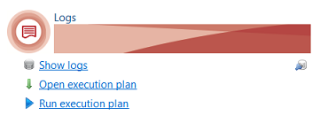
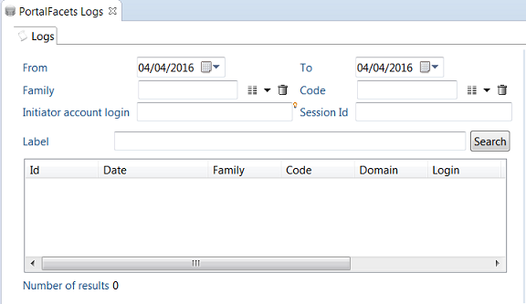
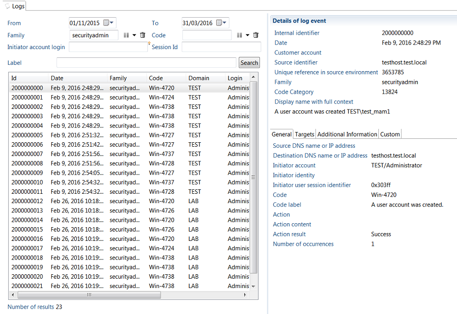

# Audit Log Execution Plan

You can execute audit log silos extractions and collect lines as a whole from the **Logs execution plan**.  

Only logs that have not been excluded from the configuration will be executed.  

You can run the audit log execution plan by clicking the **Run execution plan** link in the **Logs** section of the main project view.  

  

Alternatively, you can also view the execution plan to check its content before runnning it.  
To open the execution plan view, click **Open execution plan** in the Logs section of the project view.  
This will open the **Logs Execution plan** view.  

  

From this view, you can carry out the following tasks:  

**Run All Steps:**  

- click the question mark icon to check the list of logs silos to be executed, along with their dependencies
- click the arrow icon to run all log silos collects, then the associated logs-Ledger matching policies.

**Step 1: Silo Loading**  

- click the question mark icon to check the list of logs silos to be executed, along with their dependencies
- click the check icon to run a sanity check on logs silos
- click the arrow icon to run the logs silo collects only.

**Step 2: Finalization**  

- click the arrow icon to run the associated logs-Ledger matching policies only.
- click the cross icon to delete all logs-Ledger matching data previously computed and stored.  
This could be helpful if matching policies have changed and you would like to run the new policies over.

In production, you will preferably schedule the logs execution plan to run automatically on a regular basis from the command line.  

A new batch command have been provided for that purpose. It's located in iGRC installation root directory:  
`<igrc_home>\igrc_auditlog.cmd`  

The batch file excepts 3 parameters and works similarly to `igrc_batch.cmd`  

Example:  

```sh
./igrc-auditlog..md <project name> <config folder> <config name>
```

## Check Log Collect Results

You can check the data that have been recorded in the logs database directly from within iGRC using the **Logs viewer** tool.  
You can perform multi-criteria search on date interval, family, code, initiator account, user session id and display label, and access the details of each log event recorded.  
The results can be exported as a CSV file.

To use the Logs Viewer tool, do the following:  

- Make sure the project is opened
- Select or open the project view on the left side bar  
- Click the **Show Logs**  link in the **Logs**  section  

  

This will display the **Audit Logs view**  

  

- You can search for audit logs according to multiple criteria:
  - Date range:  type a date or select from the calendar. The range of the search is **From** date 00:00 until **To** date 23:59:59.  
  Try to select a date range as narrow as possible (one or two days) to have a good response time.
  - Family: family of the event, you can select one possible value from the drop down menu
  - Code:  code of the event, you can select one value from the drop down menu
  - Initiator account login:  type first letters of account , then ctrl-space to get possible values
  - Session Id: this is typically the windows session id where the action took place.  You can copy the value by right-clicking Session Id value in the detail panel.
  - Label:  search for a text pattern in the event display label.  Use "\*" as a joker.  For example type **"password"** to search for label containing the word "password".
  - Click **Search** to start the search.  The button will be grayed until the search is complete.  
- Once the search is complete, the result is displayed in the table:
  - Only the first 1000 rows are displayed.  The total count is also limited to 9,999 to save performance.
  - Right-click anywhere in the table and select **Export in CSV** to export to content of the table to a CSV file
  - You can click on a table row to display the event's details in the right panel.  
Note that only non null fields are displayed, so some fields may be missing if they don't have a value for that event.
  - Right-click a field value and select **Copy** to copy its value to the clipboard.

  

## Known Limitations

### Multi-Node not Supported

You cannot run multiple audit log batch commands in parallel.  
This may lead to unpredictable data loss where part of the logs data will not be inserted in the database!

### Event Uniqueness

Make sure that your log data does not reference two log event types with the same ID but different labels (for example "read"/ "Read File" and "read" / "Read Permission")  
To prevent this, you may have to prefix the event id to make sure it's unique.  
Would this ever happen, you would get an SQL error when inserting data into the database, something like:

```log
Cannot insert duplicate key row in object 'igrc.taudit_devent' with unique index 'IX_name_cat'
```  
