# Set up Audit Logs

## Prerequisites

Software versions:

- iGRC Platform 2017 R1 or later
- Microsoft SQL Server 2008 or later

## Create the Database in SQL Server

To ensure maximum storage efficiency and access performance, Audit Logs data should be stored on a database instance different than the main Audit Ledger database. In all cases, audit logs data must be contained in its own database schema which must be named `igrc`.

This is the procedure to create the database and the `igrc` schema in SQL Server Management Studio 2012 :

- Start SQL Server Management Studio and connect to database server
- First, Create a new database
  - Give it a name, eg. `igrc_logs`
  - Set the auto-growth and initial size parameters according to your needs (here 100 MB growth / 100MB initial size)
  - (Optional) In order to reduce the storage space used by the database you can choose to set the Recovery model parameter to **Simple** and the Auto-shrink parameter to **True**  

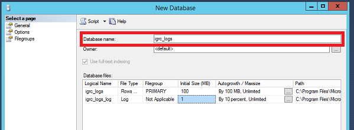

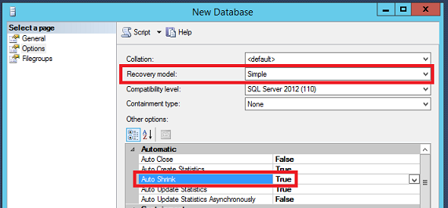

- Next, create a login to connect to the database:
  - Go to Root \> Security \> Logins
  - Select New Login...
  - Fill-in information regarding the login
    - Give it a name
    - Select **SQL Server Authentication** and enter password
    - Uncheck **Enforce password policy**
    - Set default database

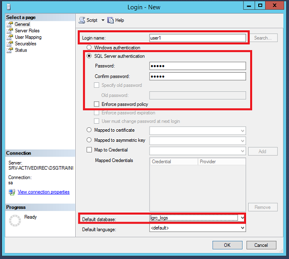

- Assign predefined Server Roles to the user
  - public
  - bulkadmin\*

> The **bulkadmin** role is optional but recommended. It is required to allow high-rate insertion in the database for very large volumes of data (See **Advanced database configuration**  section below for details).

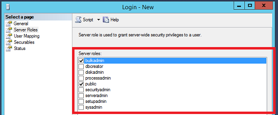

- Create `igrc` database schema and allow the login to use it
  - Check the **Map** box for the `igrc_logs` database to map the login
  - Type **igrc** in the Default Schema column to create and allow the igrc schema
  - Assign `db_owner` role to login for `igrc_logs` database  

> Alternatively, you can apply these steps to an existing login, for instance to use the one connecting to the Ledger database.

## Configure the Database Connection

You must now configure iGRC to connect to your newly created database.  

In order to do so, carry out the following steps:

- Make sure iGRC is started and your project is opened
- Open the technical configuration you wish to modify (here **default** )
- Select the new **Logs** tab to enter the configuration

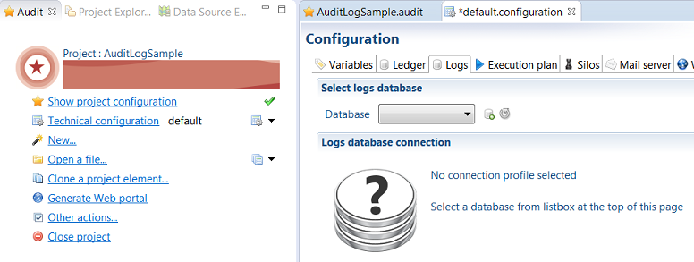

- To configure a new database profile that points to your database, do the following steps:

- click the  icon to the right of the Database menu to open the **New Connection Profile** wizard.
- Select **SQL Server** as the database type and give a name to the profile (eg.**AuditLogDB**)

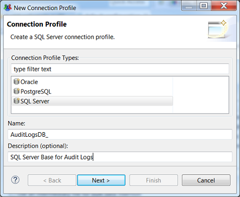

- Fill in the connection parameters to the database (database name, host, port number and credentials) to match the ones defined in the SQL Server database

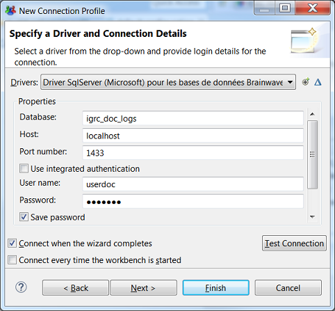

- Click **Test Connection** to check that the database can be actually reached.
- The message **Ping succeeded!** is displayed.
- Click **Finish** to create the connection profile and get back to the configuration
- The database is reachable and the newly created profile is selected.

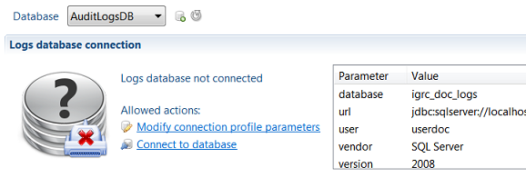

## Initialize the Database

The database must now be initialized for storing and managing your audit logs data.  

To initialize the database, do the following:  

- Make sure the correct database profile is selected in the menu
- Click **Connect to database** link
- Since the database structure is not present yet, the following options are displayed :

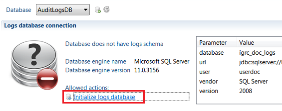

- Click the **Initialize logs database** link to display the initialization parameters dialog box:

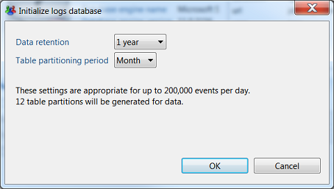

This dialog box allows you to set sizing parameters for the database.  
These parameters must be set carefully to ensure efficient storage and retrieval of data.  
Moreover, once set and data inserted, it is not possible to change the parameters without first deleting all database
Make sure to account for both your current and future needs when setting the values.

- **Data retention**: this parameter indicates for how long Logs data must be stored in the database. Data that exceed the retention period are replaced by newly inserted data.  
Available values and the corresponding retention period are the following:
  - 1 month: 30 days
  - 3 months: 90 days
  - 6 months: 180 days
  - One year: 365 days
  - 2 years: 730 days  

- **Table partitioning period**: this parameter determines how the data will be broken down between different tables to ensure optimal performance (this mechanism is called _data partitioning_). The appropriate partitioning period depends on the maximum number of daily events to be stored in the database according to your current and future needs.  
The following values are available:
  - **one month** period: appropriate for up to 200,000 events per day.
  - **one week** period: appropriate for between 200,000 events and 1,000,000 of events per day.
  - **one day** period: appropriate for 1,000,000 and above events per day.  

- Click OK to create the database structure.  

The database is now ready for storing collected logs data.

## Advanced Database Configuration

### Enable Bulk File Database Insertion

When dealing with millions of log events per day, the processing time of collected data is key to ensure timely availability of audit log information and analysis.

Using an intermediary file for bulk data insertion is a database mechanism that may speed up the overall collect time by a factor or 4.
When enabled, iGRC collect process will write the whole data to insert to a single huge file at a given location and the database process will read from this file the data to be inserted.

To enable this option, do the following:  

- check the **Use an intermediary file for bulk data insertion** box  

- In the **Bulk files folder's path** field, type the path, without the ending slash, of the directory where iGRC will write bulk files. This directory can be on a local disk or on a remote location, and the iGRC batch process must have **write** permission to it.  

- In the **Folder's path as seen from the database** field, type the path of this same directory, as seen from the database server. It can be on a local disk or a remote location, and the database process must have **read** permission to the directory.  

- Optionally, check the **Keep the bulk files upon insertion** box so that the bulk file is not automatically deleted once the insertion is complete. This option can be useful for debugging purposes, to check what has been inserted, but should not be enabled in production.

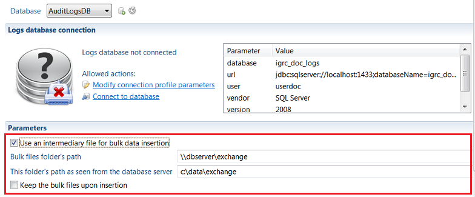