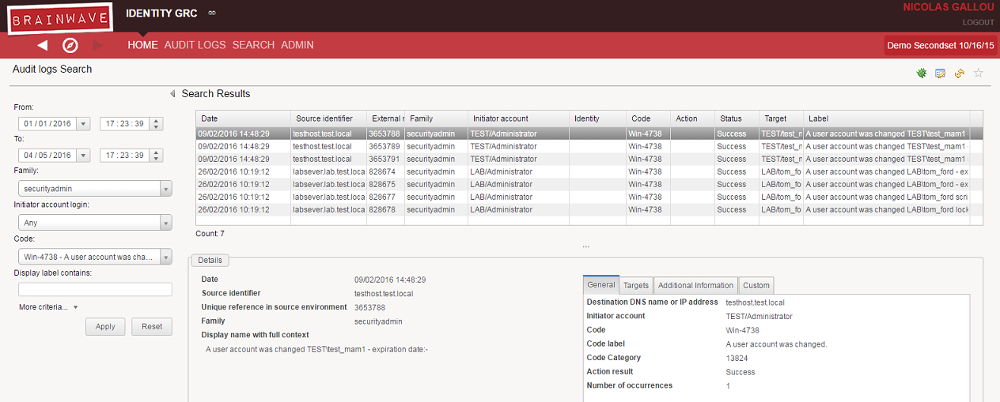
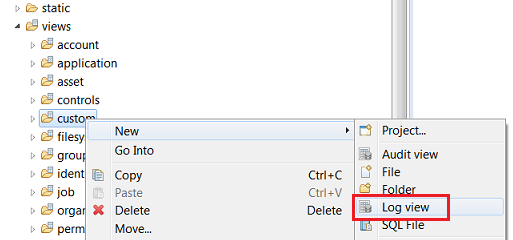
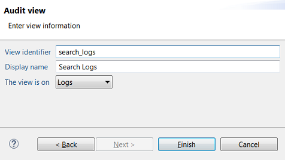
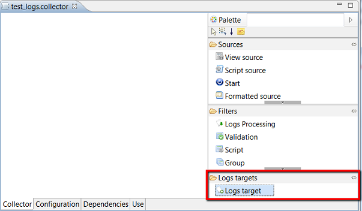
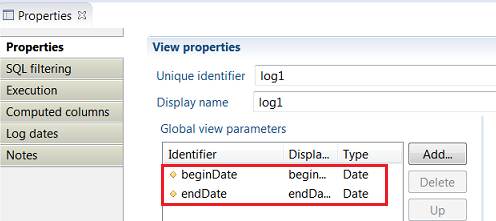
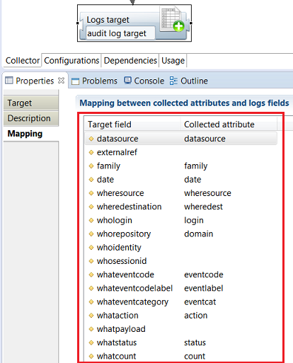
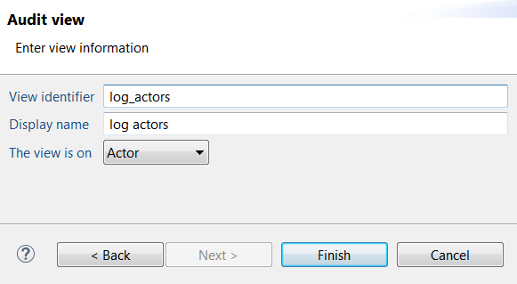
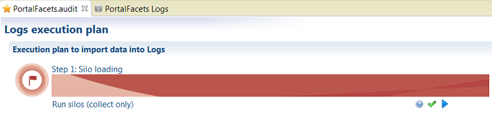

# Work with Audit Logs

You can use audit log data in various context and for different purposes:

- Multi-criteria search on audit logs to answer questions "who have done what and when":  
  - Who read/deleted this file ?
  - What files were accessed by J. Doe 3 months ago?
  - What transactions have been performed by J Doe on the payment system?
  - Who changed the CEO password ?
- Provide data to compute **Usage**  metrics and perform Analysis on User Behavior such as:  
  - Do I have people who are not part of the HR department and who accessed sensitive HR data on sharepoint?
- Ad-hoc reports to answer auditors requests

Whether it be displayed in web pages or PDF reports, or be used to compute Usage data, retrieving audit log data will use two different mechanisms:

- **Audit Logs View**  is used to load filtered logs data to be used in web pages, reports, and workflows.
- **Audit Logs Source** is used to retrieve filtered logs data within Usage collect line.

## Audit Log Views

An **Audit Logs View** is similar to a Ledger View: it wraps a given query on audit logs with a given set of result columns and parameters so that it can be used elsewhere (pages, reports or workflows).  
The query is designed graphically using the view editor.  

There are two different types of audit log views:

- **log view** :  view that loads audit logs events
- **log resource**  **view** : view that loads resources involved in audit logs events :
  - as an event's characteristic:  mandant, datasource, family, actor, action, code, host, status,
  - as an event's target: account, permission, repository, asset, application, perimeter, identity, organization,  group

A log view differs from a Ledger view in the following ways:  

- A log view has an \*.logview file extension
- A log view does not depend on timeslots. However it requires a date & time range parameter
- A log view is automatically sorted by date, ascending. It's not possible to sort on a different criteria
- You cannot join audit logs data with other ledger resources or log resources.  Instead, all external references are available as direct attributes of the view

A log resource view differs from a Ledger view in the following ways:  

- A log resource view has an \*.logview file extension
- A log resource view does not depend on timeslots or date ranges.  The view will load resources that ever existed in the database
- A log resource view cannot be mixed with other resources in the ledger although it may be the same

### Create an Audit Log View

To create an audit log or log dimension view, do the following:

- From the main **Project** panel, Click **New...** then select **Log View...** from the analysis section  

- Alternatively, from the **Project Explorer** panel, right-click the **views/** directory or one of its sub-directories, then select **New... \> Log View...**

- Select the location for the file, give it an appropriate file name,
- Fill in information on the view: identifier, display name and select **Logs** from the **View is on** menu  

- Click **Finish** to open the editor on the newly created log view  

- Drag and drop the attributes to include in the view from the **Attributes** palette to the Log(s) component:  there are 33 attributes and 19 custom attributes.  
Note that attributes of referenced resources (such as whologin , codelabel, targetparent, etc. ) are available _directly_ as attributes of the view.  
Here is a sample view:  

### How to Parameter an Audit Log View

The **Properties**  tab in the view's properties panel allows you to define external parameters for the view.  

Log views have two predefined mandatory parameters **beginDate** and **endDate** to control the log view's date range to load.  
These parameters are automatically mapped to the Log dates of the view and should not be deleted.  

You can add more parameters to the view to fit your needs.  

The **Log dates** tab allows you to map the view's date range to views actual parameters.  It's pre-configured to map beginDate and endDate parameters and should not be changed in normal use.  

### Display View Results

To test your view against the database, you need to provide test values for beginDate and endDate in the **Test values for selected parameter** field.  
Use **YYYYMMDD** format for date values and **YYYYMMDDHHMMSS** for date and time values.  

To display the view's results, click the **Results** tab:

- To refresh the view results, click back on **View** tab, then **Results** tab
- To export the view's results as CSV file, right click inside the table and select **Export in CSV...**

### Create a Log Resource View

To create an audit log resource view, do the following:  

- Create a new log view either from the project view or from the explorer view
- Select the location for the file, give it an appropriate file name,
- Fill in information on the view: identifier, display name and select log resource type from the **View is on** menu  

- Click **Finish** to open the editor on the newly created log resource view  

- Drag and drop the attributes to include in the view from the **Attributes** palette to the Log(s) component. The list of attributes depend on the log resource type
- You can set a different sorting order for rows from the **Sort** tab
- Click the **Results** tab to display the view contents  

### Include Audit Log Views in Pages

You can display the content of a view inside a page  as you would with a regular Audit view, using a DataSet.

## Audit Log Source

An **Audit Logs Source** is a collect source component that can be used to compute ledger resources based on audit logs data.  
This will typically be used to compute usage metrics.  
