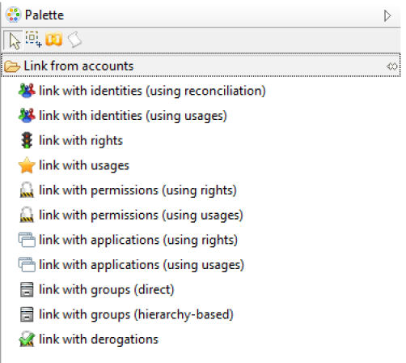
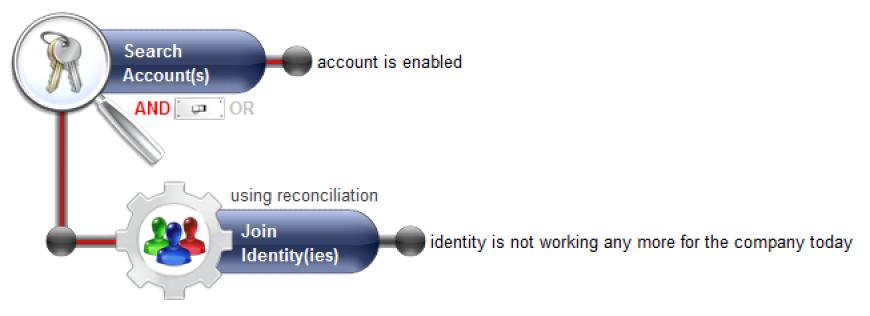
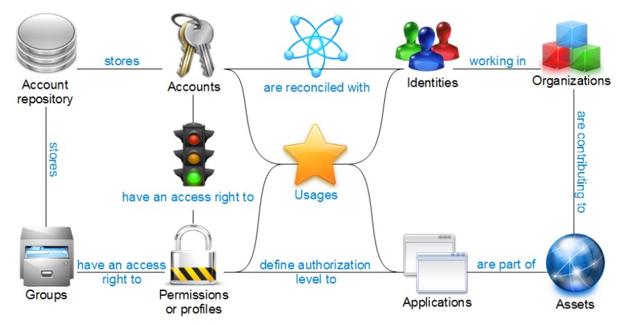
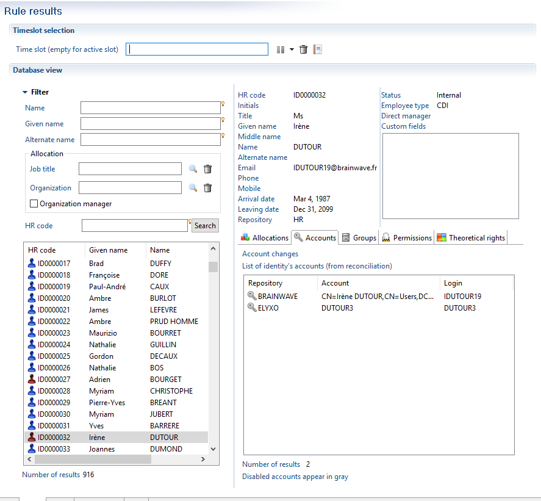
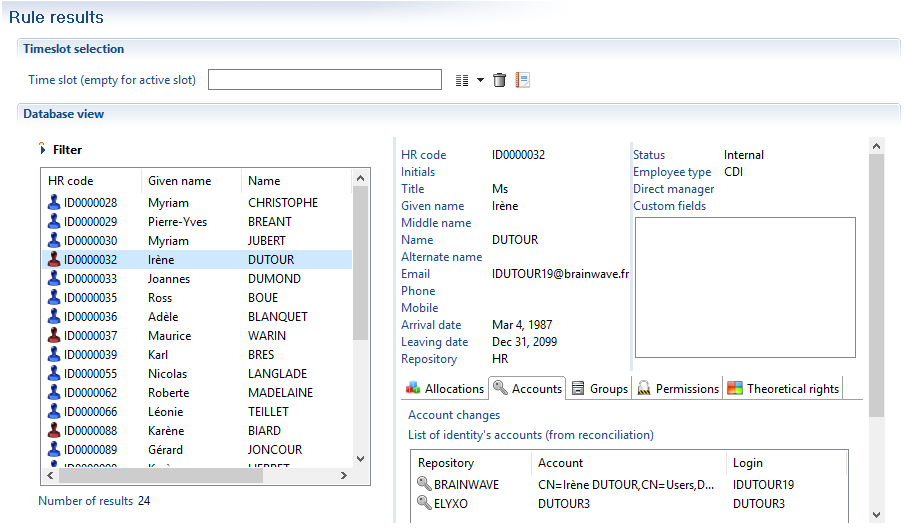
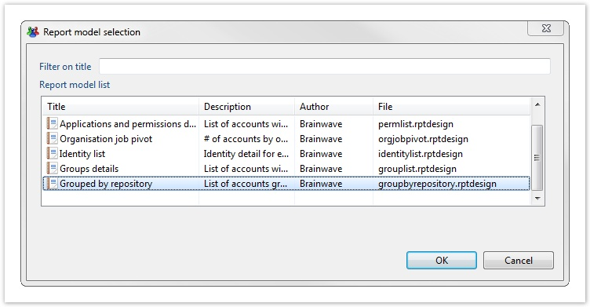
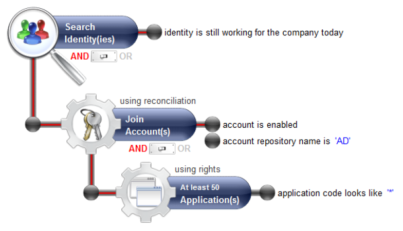
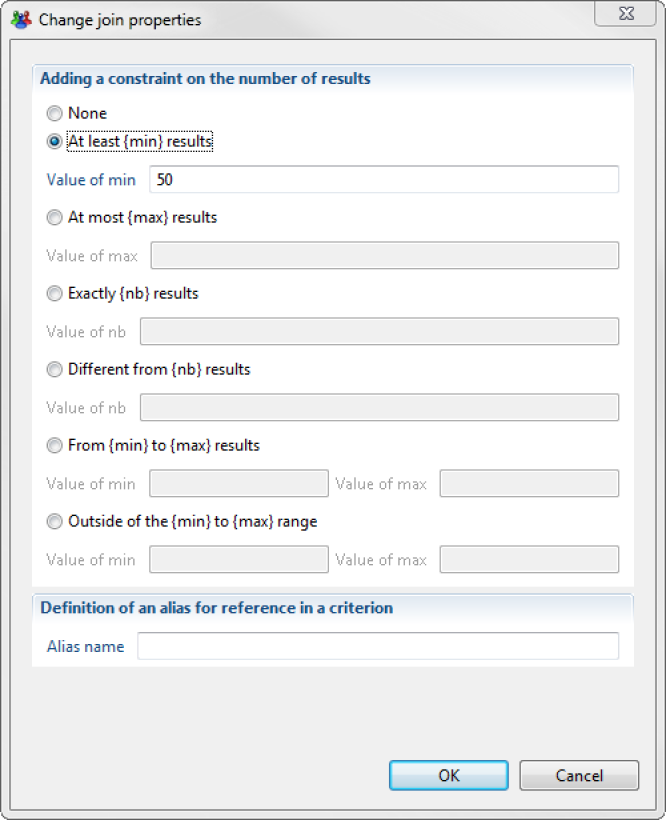

# Add Search Dimensions

The strength of the rule engine lies in its capacity to make use of all of the dimensions of the Ledger when the questions are being configured. This operation is performed by weaving links between the concepts of the Ledger in the graphic editor.  

The links available per concept in the Ledger are displayed in the 'Links from...' section of the palette. In cases where it is possible to reach a concept by several paths, the text in parenthesis specifies the path taken in the Ledger.

  

Using a link is performed by simply dragging and dropping the link to the graphic editor, followed by selection of the concept of the rule onto which you want to apply additional concepts.

  

This operation is recursive and it is not subject to limits. In this way it is possible to go through all of the concepts of the Ledger in order to answer a given question. For example:  

- _Which people are part of the computing department, outside of the department dealing with computing production, who have administrator type access to the production servers and who have made use of them over the past 90 days ?_  

We would encourage you at first to refer to the graphic representation of identities in the Ledger to identify the 'paths' to follow when configuring rules that contain links between concepts. If you have taken part in the training course, you will have received the Ledger in this way in the shape of a mouse mat.

  

We invite you to refer to the chapter _Available criteria per object in the Ledger_ in this guide to find the full list of relations available per concept in the Ledger.

# Results

## Visualize Search Results

You can visualize the results of your rule at any time by choosing the 'Results' tab of the graphic editor. The analysis is carried out on the last period loaded and the result is displayed in the form of a master/detail list : clicking on any element of the list displays its details on the right hand side of the screen.

> In the case of a concept of the 'Account' type, the detail interface of the result allows you to intervene actively on account reconciliation. In this way it is possible to perform search operations on accounts with the help of the rule engine in order to carry out manual reconciliation operations.  
>
> Only the first 1,000 results are displayed. If your audit rule returns more than 1,000 results, you have the option of filtering the results returned with the help of the 'Filter' banner. For this, you need to click on the 'Filter' text in order to display the filtering criteria that are available.

You can visualize the results on any period of time that has been loaded to the Ledger. To do this, simply select the desired time period in the 'Time base' dropdown menu.

## Export Results

It is possible to export the results of an audit rule in the form of a report in order to narrow down the analysis or simply in order to share the results with a third party. Several formats are available :

- HTML
- PDF
- Postscript
- Word
- Excel
- Powerpoint
- OpenOffice Writer
- OpenOffice Calc
- OpenOffice Draw
- Excel

Exporting in report format is performed by clicking on the 'Report' button in the 'Results' tab of the graphic editor: . The list of available reports will appear. The contents of this list depend on the main concept being handled by the audit rule.

Choosing a report will cause it to appear in the Web viewer. Please refer to the [Guide to the report editor](../reports) for more details about this viewer interface.

## Add Enumeration Constraints

It is possible to narrow down the questions asked by adding enumeration constraints to the links woven between the concepts of the Ledger. This allows questions of this sort to be answered:  

- _Which people have a Microsoft Active Directory account that gives access to more than 50 applications?_

  

This configuration is carried out at the sub-concept level of the rule either by double clicking on the text of the concept, or with the help of the contextual menu 'Modifying enumeration parameters'.  
The enumeration configuration box allows you to perform the following operations:  

- None
- At least {min} results
- At most {max} results
- Exactly {nb} results
- Different by {nb} results
- From {min} to {max} results
- Outside the limits of {min} to {max} results

The default operation performed is "at least 1 result" (when 'None' is selected).

  

Once configured, the enumeration appears in the upper area of the concept in the graphic editor. The enumeration is also taken into account in the 'text' version of the audit rule.
