# Deal with Time in Rule Editor

The view editor has the ability to query several timeslots. This feature is provided through a join which is called "join with the same entity in previous timeslot". But in the rule editor, this kind of join does not exist. The rule editor now offers a way to add criteria in the previous timeslot. Now you can answer these questions quite easily:  

- Which identities have changed of last name in the past ?
- Which accounts have been locked in 3 timeslots or more ?  
- Which identities were granted the "SageAdmin" permission in the past ?
- Which identities have never changed of organizations ?
- Which groups contained the "Guest" account at least once ?
- Which identities had more than 10 accounts in the past ?  

To answer these questions, you now have 2 new tools in the palette of the rule editor. Why 2 new tools? Each tool is used to answer a different kind of question. They both work on previous timeslots but the difference is on the way the criteria are applied.  

- The "**timeslots**" tool is used to keep entities by checking if the given criteria match in previous timeslots. This tool lets you count the number of timeslots matching some criteria.  
- The "**counters**" tool is used to keep entities by checking the count of distinct values in previous timeslots. This tools lets you count how many different values you have for a set of attributes in the past.  

The difference is tricky. A question concerning the organization of identities is used to analyze each tool.  

- "timeslots" tool: `Which identities have been in the "Sales Department" in at least 3 timeslots ?`  
This query counts the number of timeslots where the organization is "Sales Department". Note that you have no way to ask for 3 consecutive timeslots. You will get identities who keep changing of organization (one timeslot in Sales Department, the next timeslot in Marketing, then in Sales Department, then in Marketing,...). And also, you don't know if the identities have only worked in Sales Department or not. The way it works is by counting the timeslots where a criterion (identity belonging to Sales Department) is true.  
- "counters" tool: `Which identities have been in 3 different organizations in the past ?`  
This query counts the different distinct organization values. This is completely different from the previous example. Now you want to find identities which have worked in 3 different organizations without knowing each of them. In all the timeslots, the rule engine finds the organizations in which the identity has worked and the identity is kept if there are at least 3 different ones. It is important to note that the rule engine does not count events (a change of organization) but only different values. Maybe the identity has changed 5 times but going back and forth in 2 organizations (Sales and Marketing). We have 5 change events but only 2 distinct organizations so the identity does not match the criterion of "3 different organizations in the past".  

> [!warning] The most important thing to remember is that the rule always returns entities (identities, accounts,...) of the **current** timeslot. The time is just a constraint to select entities in the current timeslot. When you ask for identities who worked in the "Sales Department" in at least 3 timeslots, the result will be identities of the current timeslot but respecting the constraints about the organization in the previous timeslots. If an identity has worked in the "Sales Department" in at least 3 timeslots but has left the company in the previous timeslot, this identity will not appear in the output result. On the technical side, the rule always returns recordUid belonging to the current timeslot.

Two new buttons are found in the Palette of the rule editor. The first one is the "timeslots" tool and the second one is the "counters" tool.  

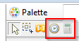  

Now, let's see how our example with identities and organizations is designed in the editor.

## The "timeslots" tool

The following snapshot illustrates the question "Which identities have been in the "Sales Department" in at least 3 timeslots ?".  

  

The "timeslots" tool adds a constraint on the identity. The identity is kept in the output result only if some criteria are true in at least 3 timeslots. The criteria can be a combination of any criterion and joins on identities. The important thing to note is that under the 'timeslots" tool (in red on the picture), you define some criteria without the time in mind. Here we want identities working in the Sales Department but the "timeslots" tool checks this constraint on every timeslot in the database.  
The "timeslots" tool has all the criteria and joins found in the parent entity (identity in our example). Of course you can also attach criteria on the root identity as shown in the following snapshot :  

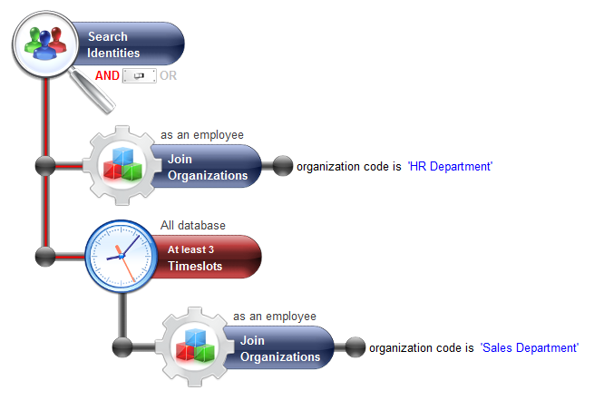  

The question behind this rule is : `Which identities are now working for the "HR Department" and have been in the "Sales Department" in at least 3 timeslots ?`  
By default, the "timeslots" tool only search in all the timeslots (excluding the current one) of the database. This is why the words "All database" are written above the "timeslots" tool. By double-clicking on the tool, you can change the scope of the search and the details on the constraints:  

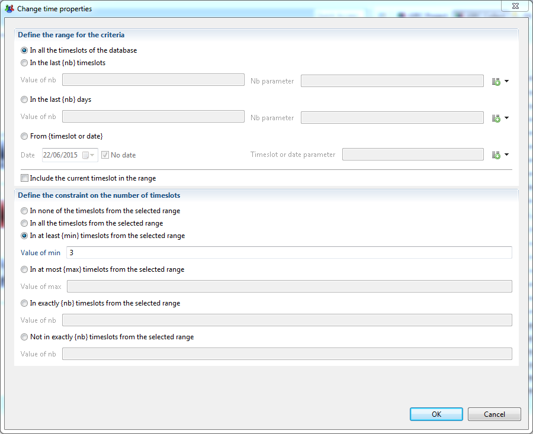  

The first section of the properties box defines the scope the rule engine should search on. You can use different units like the N last timeslots, the N last days or the timeslots since a specified date. Of course the value can be an input parameter of the rule.  
The second section is the constraint on the timeslot count matching the criteria (identity belonging to "Sales Department").  

## The "counters" tool

Now we want to build a rule answering the question: "Which identities have been in 3 different organizations in the past ?"  

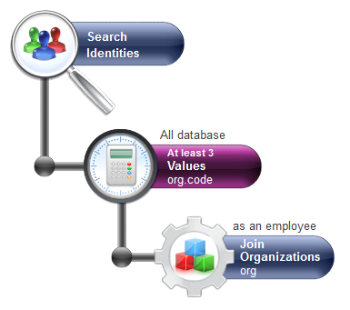  

The "counters" tool adds a constraint on attributes (not on timeslots). Here we want to search for 3 different values for the attribute org.code (org is the alias on organization). The default scope of the tool is "All database" but it can be changed by double-clicking on the tool to open a properties box shown below:  

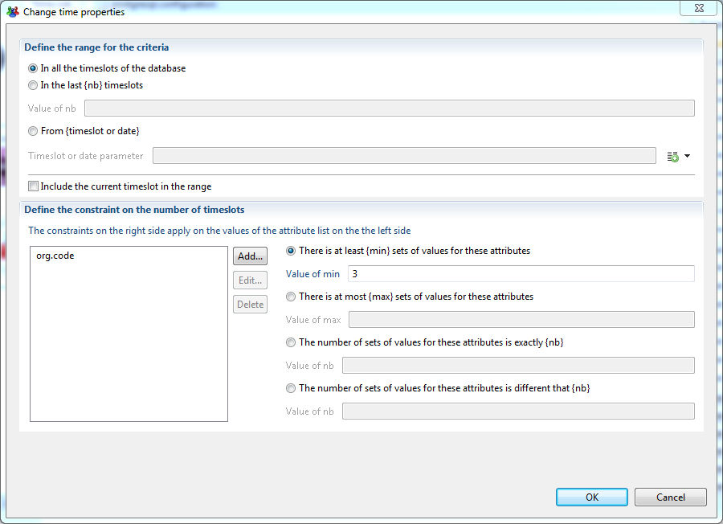  

In the second section, you define the list of attributes you want to check. On the right part you set the count constraint. If you select 2 attributes and a constraints "at least 3 sets of values", it means that the rule engine checks that there exist at least 3 different value pairs for the selected attributes. When you click on the "Add..." button on the left part to choose an attribute, do not choose an attribute which is a recordUid as this kind of attribute is different in each timeslot. This would have no meaning counting the distinct recordUid among all the timeslots because each recordUid is different in every timeslot.  

## Querying events

The 2 tools offered in the rule editor count either timeslots or attribute values but not events (value change). To count events, you can use the "timeslots" tool and set criteria on flags in the database.  

### Built-in flags

The activation step in the execution plan already computes several built-in flags like "organization changed" and "permission changed" for identities and some others on accounts and groups. For example the "organization changed" flag found on identity can be used to issue the following query :  
`Which identities have worked 2 times in the "Sales Department" ?`  
The question is about the identities who worked for the Sales Department, then for another department and then in the Sales Department again. We can not just count the number of timeslots where the identity was in the Sales Department. To answer this question, we need to use the "organization changed" flag as shown below :  

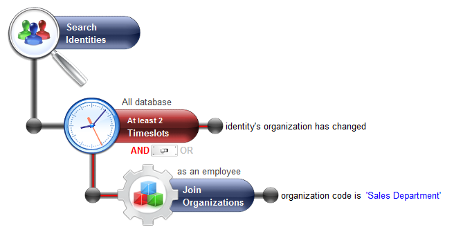  

To understand how it works, the following diagram shows a time-line of an identity changing of organization. The identity was working in HR Department in timeslot t1, then in Sales Department in timeslots t2 and t3, etc. A flag has been displayed above the name of the organization when this is a change from the previous timeslot (meaning that the flag "organisation changed" is true)  

  

You can see that there are two timeslots (t2 and t5) where the organization is "Sales" and the flag "organization changed" is true. This identity will appear in the output result of the rule because the constraint set in the tool was "at least 2 timeslots".  

## Custom flags

The product has only a few built-in flags. What about if you want to query something like : the identities having access to a new application at least 3 times in the past ?  
The problem is that we do not have a built-in flag to know if someone got a new application compared to the previous timeslot.  
But the product lets you define your own custom flags so that you can use them in the rule editor.  

Please, read the article [Creating temporal analysis rule criteria](#create-a-new-temporal-criterion) to know how to create custom flags.

# Create Temporal Analysis Rule Criteria

During data collection, a number of flags are automatically computed to provide information on important changes, for instance identities that have had their permission changed, or that have moved to another organisation, etc.  
It is possible to further extend the data model to include custom computed flags on any entity and use them as rule criteria. Here are some examples for criteria that you are able to define:  

- the organizations that have at least two new members
- the people that have access to new applications
- the people that have lost access to more than 3 applications
- the groups that have changed composition
- ...

## Criteria Definition

A criterion is defined by a set of characteristics that will allow to compute it during the execution plan and then make the results available in the rule editor as new criteria.  

Apart from a unique identifier and a description for the criterion, one needs to fill out two labels which will be displayed in the rule palette, one for the criterion and another for its negation.  

The actual definition of the criterion is based on a view that will give the data to be compared on different timeslots. More precisely, you need to define an attribute that will hold the uid of the entity (identity, account, repository, organization, etc) which the criteria applies to, and another attribute for the value used for comparison.  

Example: criteria 'people who have changed applications'  
To create this criteria, we only need to create the following view whose output are the identities and their respective applications :  

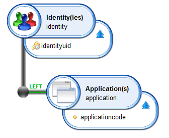  

The computation will automatically compute the difference in output between timeslots, and create the corresponding criteria in the rule palette of the identity element.  

But the system is actually a lot more flexible than just calculating the differences, allowing to create a great number of criteria using the same view. This is because, in addition to the view, you have to define :  

- the variation type you want to consider : differences, identical values, new values, values lost  
- an operator : greater than, equal to, different, ...
- a value to test against the operator  

Examples :  
For the previous example 'people who have changed applications', we would choose a number of differences strictly greater than 0, or to the same effect a number of differences greater than 1 or a number of differences different from 0.  
But we can as easily create other criteria like 'people who have received access to new applications' with a number of new values strictly greater than 0, 'people who have had more than 2 applications revoked' with a number a lost values greater than 2, ...  

Every criteria defined will automatically include its negation, so that in the rule editor, you can not only retrieve the population verifying the condition you set, but also the population that does not match the criterion.  

## Create a New Temporal Criterion

To define a criterion, choose **Temporal analysis criteria** in **New...** section of the main menu.  

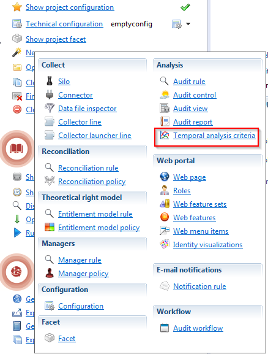  

You will then be prompted to fill in the information necessary to define the criterion, as shown below :  

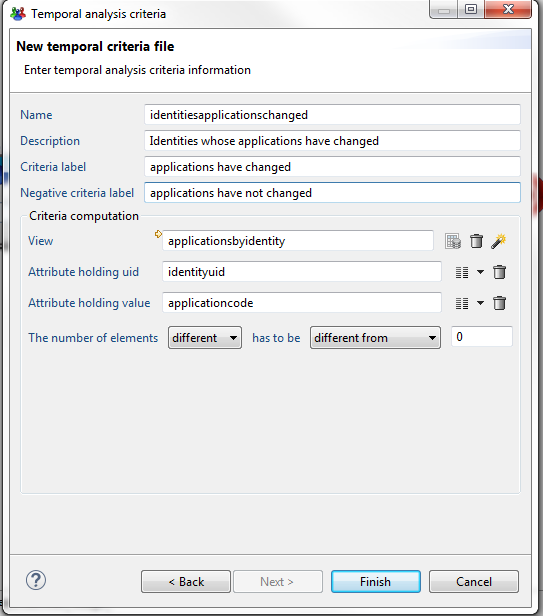  

The wizard will generate a `.temporalcriteria` file in the temporalcriteria sub-folder, that can be further modified in a dedicated editor :  

  

## Include in Execution Plan

To ensure that the temporal criteria that have been defined are computed and stored in database after data activation, two steps have to be taken :  

- ensuring that the option **Include in execution plan** is checked for all the relevant `.temporalcriteria` file (this option is activated by default, so if you haven't forced the exclusion all new criteria should be automatically included)
- checking the option **Run temporal analysis criteria automatically** in the execution plan tab of the configuration editor.

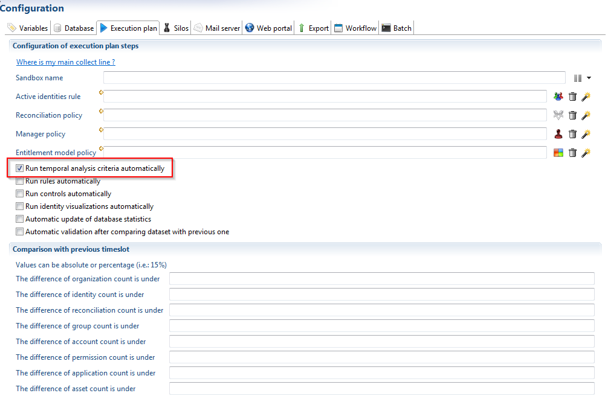  

Is is also possible to launch a manual computation on a given timeslot in the execution plan tab of the project. Note that if the timeslot already contained computed temporal criteria, these will be cleared at the start of new computation, to ensure that the database contains only the results for the latest version of a criterion.

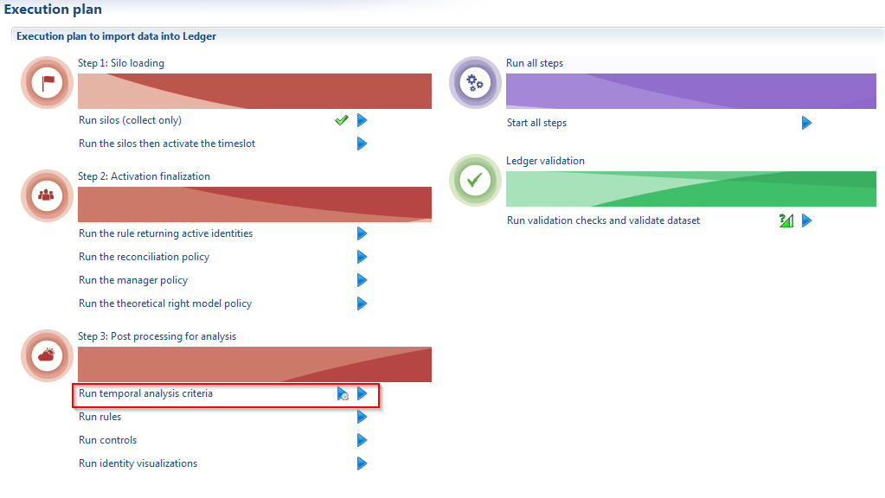  

## Compute Criteria on Older Timeslots

the criterion added to the project would normally only be available on the timeslots loaded after their creation. To provide analysis on previously archived timeslots, however, it is possible to launch a computation on all database timeslots. This step needs only be performed once in the project, and can be launched from the execution plan tab of the project.  

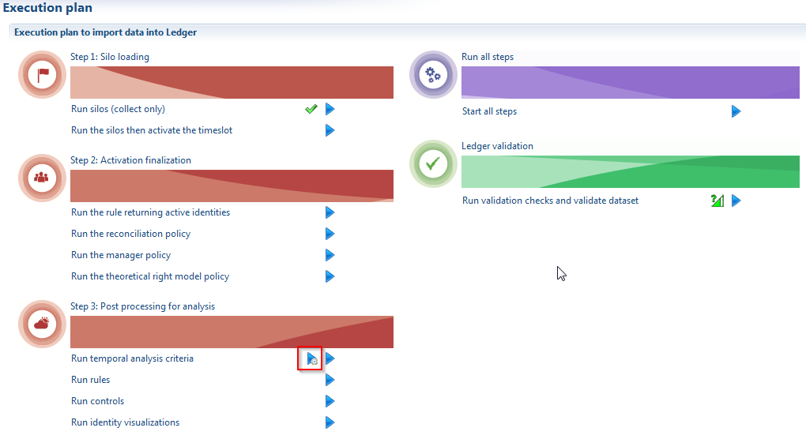  

## Use the Criterion in Rules

The criteria that are defined in `.temporalcriteria` files are available in the rule editor palette, under the category **Temporal criteria**.  
There will be two entries for the criteria, one for the positive version (e.g. when the condition is met) and another for the negative version (e.g. when the condition is not met). They can be used as any other rule criteria to filter the entity on which they apply.  
Please note that the criteria from all projects will be displayed in the rule palette, whether they are currently included in the execution plan or not.  

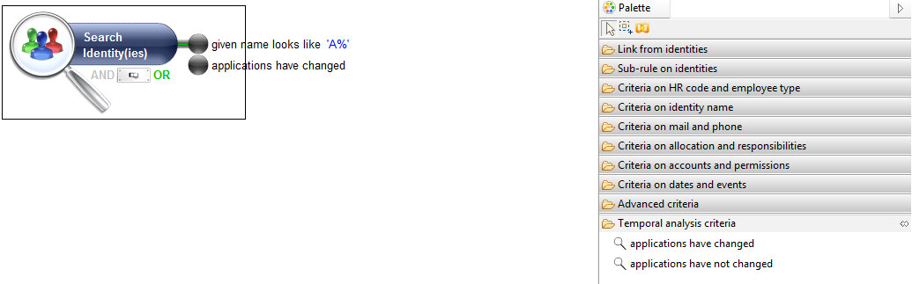  
