# Advanced Concepts

## Debug Rules and Display Intermediate Results

Debugging the rules can be facilitated by displaying the intermediate results of the rule. This operation is performed with the help of the contextual menu 'Hide/Show the result numbers'. Activating this option causes each criterion to be displayed with the number of results returned as well as the unit time taken to extract this information from the Ledger.  

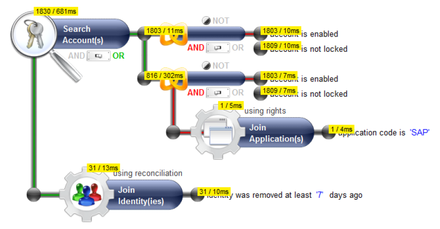

It is also possible to display the partial results of the criteria of sub-concepts of the audit rule by double clicking on the criteria text or by double clicking on the sub-concepts icon.  

Finally, it is possible to display the query carried out in pseudo SQL by double clicking on the icon located on the main concept handled by the audit rule. However, the analysis of this content necessitates intimate knowledge of the technical data model and is in practice reserved solely for use by Brainwave technical support.  

## Criteria

### Advanced Criteria

It is possible to create rule criteria that intervene directly on the attributes of the concepts of the Ledger. This can be performed with the help of the `Advanced criteria` section of the palette. Amongst other things, advanced criteria allow you to do the following :

- To handle `custom` attributes as well as the specific nomenclatures
- To test whether the attributes are valorized or not in the Ledger
- To handle the technical attributes (unique identifiers and timeless identifiers)
- To conduct attribute to attribute comparisons

Advanced criteria are used in the same way as standard criteria, however, they do necessitate finer knowledge of the data model because they are handled directly on the level of the attributes.

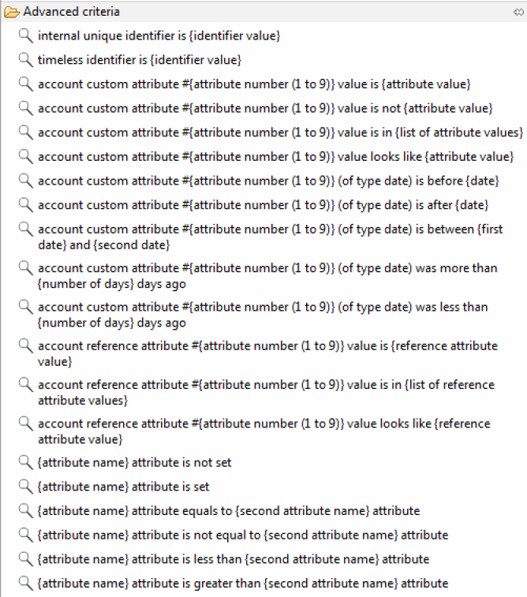

### Criteria Comparison

It is sometimes necessary to carry out comparisons between different elements of the same set within the framework quality or compliancy control. This is expressed, for example, in the form of a question such as:

- _Which people with an ActiveDirectory account have a login that is different to their human resource unique ID?_  

This question involves comparison of values between the different concepts of the Ledger for each of the entries to be tested.  
It is possible to configure the comparisons between the attributes within an audit rule with the help of the following 'advanced criteria':

- Attribute {name of attribute} is equal to attribute {name of second attribute}
- Attribute {name of attribute} is different to the attribute {name of second attribute}
- Attribute {name of attribute} is lower than attribute {name of second attribute}
- Attribute {name of attribute} is higher than attribute {name of second attribute}

Configuring the second attribute requires referencing on which concept the comparison is to be carried out. If your analysis rule contains concepts that are interlinked, you will absolutely have to define an alias name for your concept. This operation is carried out with the help of the editing link enumeration constraints box in the 'Definition of a reference alias in a criterion' section.

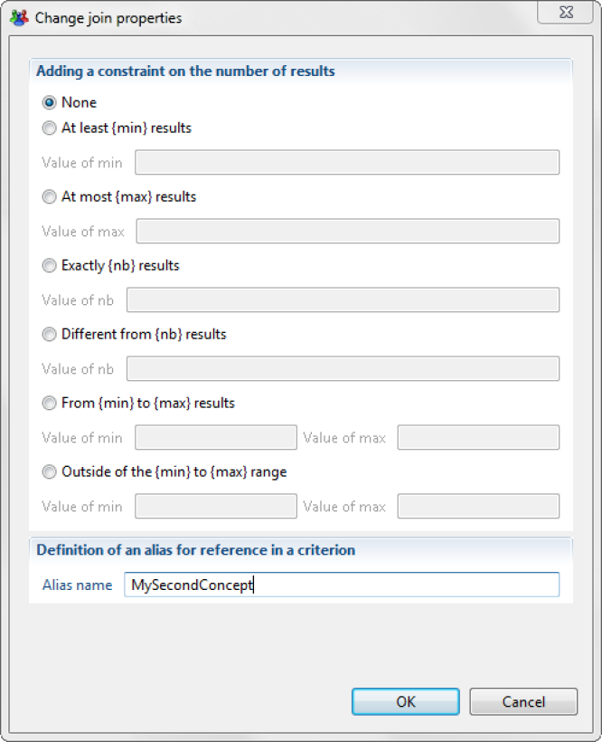

Please note that it is not possible to define an alias for the main concept rule which must have the name '_root_' as its alias.  
Configuration of the second parameter is facilitated by a dedicated assistant that will present you with all of the available attributes for the main concept per concept on which an alias has been positioned.

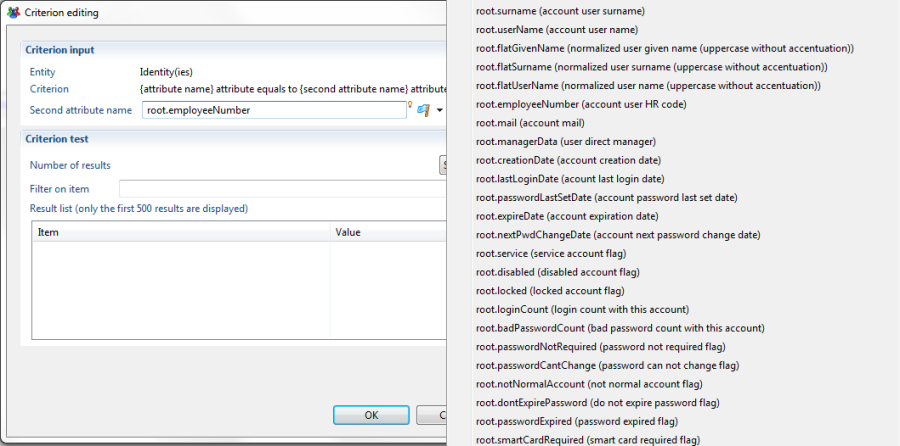

Once configured, the criterion will show the attributes handled in the attribute editor. A point notion is used to identify the second attribute in a unique way.

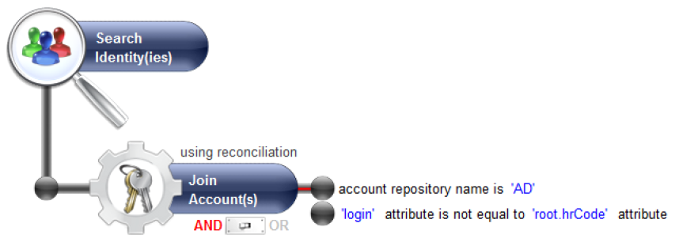

> [!warning] Putting this functionality to work does not support the joint use of advanced criteria combinations or tests on the same concepts level very well. Be sure to form simple rules and to respect the following principle: A secondary attribute should be in the same concept or in one of the criterion's parent concepts.

## Include Rules in Execution Plan

If you are interested in the result of a rule and you would like to follow its evolution over time or publish the results for the benefit of a third party, it is possible to include the rule in the execution plan.  

Once integrated into the execution plan, the rule will be automatically executed every time there is a new data load and the results will be accessible in the Web portal. All of the results remain accessible, even the results calculated on former time slots. This allows the evolution of the results of the rule to be displayed in the reports as well as its details for any period of time.  

Inserting a rule into the execution plan is carried out by checking the 'Include in the execution plan' box in the 'Execution plan' tab of the rule properties.

  

> For the rule to be taken into account by the Web portal results, its identifier must begin with `control_`.

You can force the re-valuation of all of the rules integrated into the execution plan for the current period of time with the help of the  button in the 'Execution Plan' tab of your audit project.

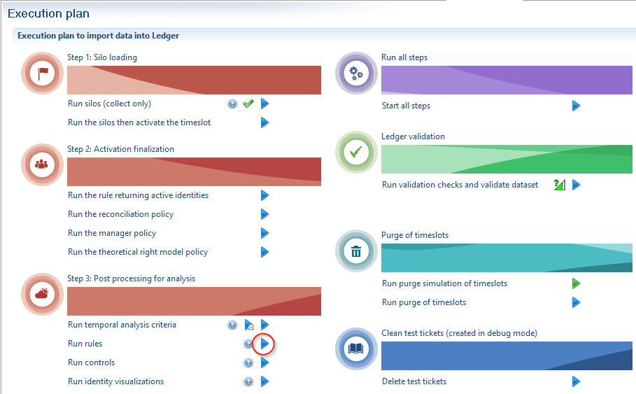  

## History of Rule Results

It is possible to manually publish the results of a rule in the Web portal or to manage the history of its results.

To do this, simply use the 'History' tab in the rules editor. The list of results that are accessible from the web portal will appear. It is possible to delete or to add periods of time or to export the given results in report format.

  

> For the rule to be taken into account by the Web portal reports its identifier must begin with `control_`.

## Tags

It is possible to add 'meta information' to the rules in order to simplify their use from the portal. This, for example, makes it possible to regroup reports by category or to filter the rules during the creation of a specific report...  
The 'meta information' is presented in the form of tags. These tags are configured in the 'Tags' tab of the rule properties editor.

### Rule tags

The following tag names are available :  

- type
- scope
- family
- application
- permission
- custom1
- custom2
- custom3
- custom4
- custom5
- custom6
- custom7
- custom8
- custom9

The values can only be static chains of characters.  
The tags are then accessible just like any attribute of the results of the rules in the audit view editor. We invite you to refer to the chapter [Data model](../views/views.md) in the Guide to the audit view editor to find a description of the different attributes available in the Ledger for the results of the rules.

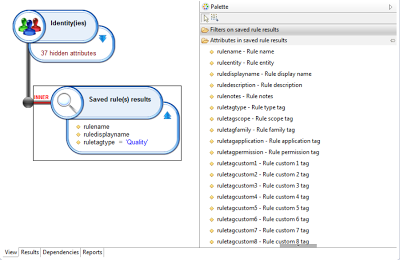  

## Rule Parameters

It is possible to externalize the value of the parameters of the criteria of an audit rule. In particular, this allows you:  

- To create a generic, customizable 'sub rule' that can be used in another rule
- To create a generic, customizable 'sub rule' that can be used in an audit view
- To extend the criteria available to a concept

This is carried out by creating parameters for a rule.  
Adding or using a rule parameter is completed directly in the Editing a rule parameter dialogue box. Simply click on 'Valorize the criterion with a global parameter rule' and click on the parameter. The  button allows you to add a new global parameter to the rule.

  

Please note that it is possible to quite simply ignore the criterion if the parameter is not valorized during the call. This makes it possible to create generic rules whose parameters are optional (for example a search rule with a number of criteria that are all optional). This operation is carried out by checking 'Ignore the criterion if the value is null or empty'.  

Management of the global parameters of the rule is carried out with the help of the 'Properties' tab in the properties editor of the audit rule. It is possible to delete outdated parameters and to assign them default values. Note that the parameters of rules are multi-valued. If the criterion depends on a single-valued value, then only the first value used will be taken into account.  

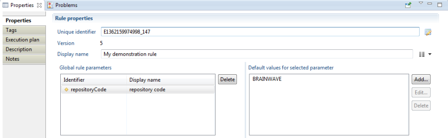  

For a parameter to be accessible from outside the rule (view, another rule ...) it is essential that its identifier appear in the display name of the rule. The naming rule is to have the identifier appear between {}. When the rule is used, the display name of the parameter will automatically appear in the form of a hyperlink that allows it to be edited.

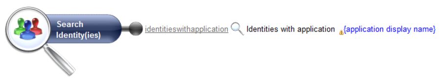  

## Calculated Rule Parameters

It is possible to take advantage of the integrated script language in the Analytics engine in order to automatically calculate the parameter values on the basis of the parameters given at the outset.  

This can be particularly useful when defining a generic rule that contains the entry parameters and when you want to adapt the query in relation to these parameters, for example carry out either a **value type search, or a \*value**  type search, or a **value\*** type search.  

To do this, simply create a new rule attribute (see the previous chapter), and then modify the value of this parameter with the help of the 'rule properties'.  

The syntax to use is described in the "Guide to collection" in the "Macros and scripts" chapter. The scripts are declared with the help of the `{` `}` symbols.

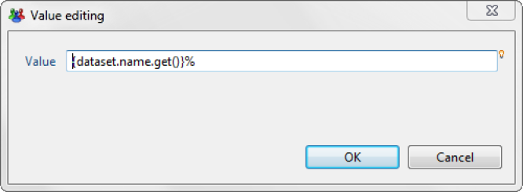

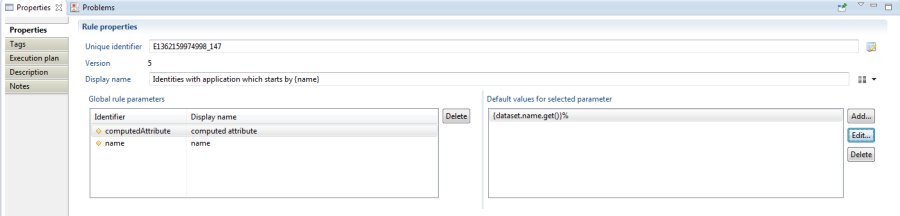  

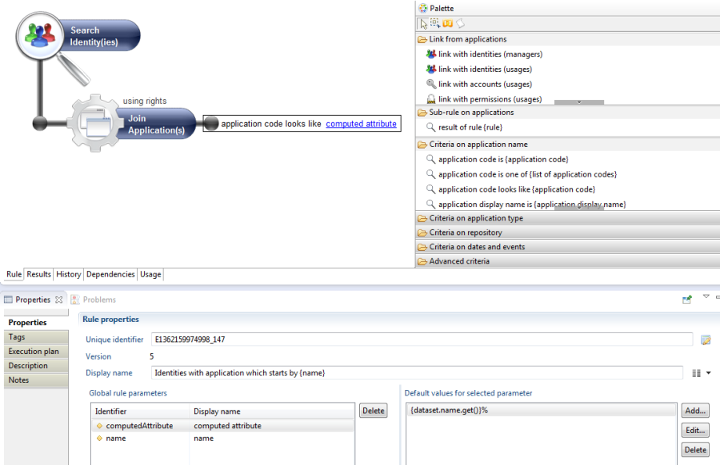  

## Analyze Dependencies and Rename Rules

Rules are used by a number of components of the audit project : Reports, Audit view, Other rules. Rules can also use other rules.  
Referencing a rule within a project is carried out with the help of its identifier. To do this, an identifier is unique to an audit project. Renaming the identifier of a rule is therefore a special operation and it can be completed with the help of the dedicated button in the rule properties editor.  

The 'Dependencies' and 'Usage' tabs in the rules editor allow you to manage the dependents of the rules.

- **Dependencies** : List of project rules on which the audit rule depends:  

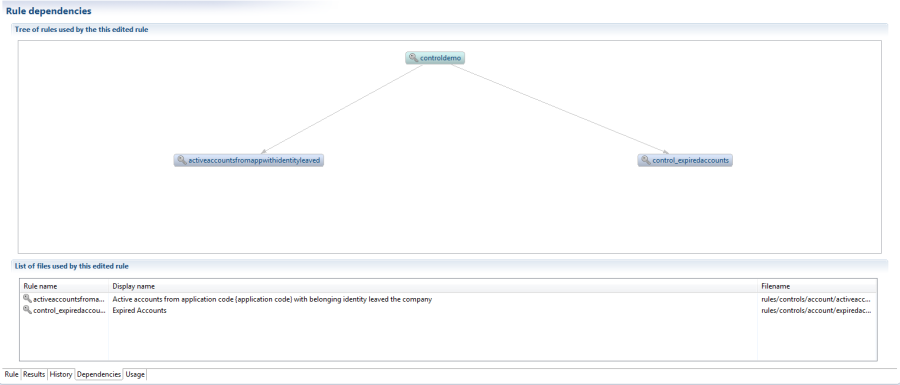

- **Usage** : List of the rules, views and reports from the project that uses this audit rule:  

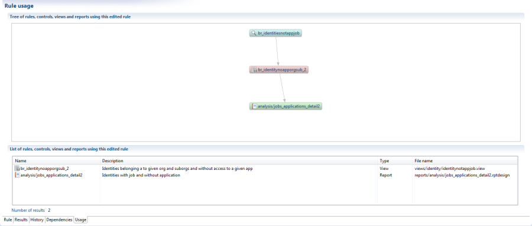

## Create Extra Rule Criteria

Within the framework of a project, it can often be useful to create extra rule criteria. In particular, they can allow you :  

- To render data stored in the 'custom' fields of the Ledger intelligible
- To format ready-to-use searches that are specific to client context ('The VIP partners who have access to SAP')

This operation is simple and is carried out by configuring a rule and publishing it in the form of a criterion. Please refer to the chapter [Using rule parameters](#advanced-concepts) to find out how to make it possible to configure your criteria.  

To publish a rule as a criterion, select the entry in the contextual menu 'Package as a criterion' in the graphic rules editor. A dialogue box will open. You will need to successively:

- Indicate the library file name that will contain your criterion
- Configure your criteria  
  - **Category** : Name of the category which will appear in the palette
  - **Criterion version** : Version of your criterion
  - **Author** : Name of the author of the criterion

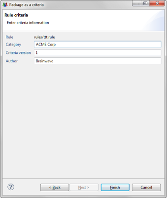  

Once your criterion has been created, it will appear in the form of a library file that has the extension '.criteria'. This is an autonomous file that you can use in an audit project simply by positioning the file in the 'libraries' directory of your project (it will carry all of the dependencies that may be associated with the rule).

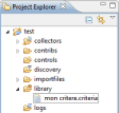  

> [!warning] The libraries are loaded when Brainwave Analytics is loaded. Therefore, you will need to restart Analytics before testing your criterion.|

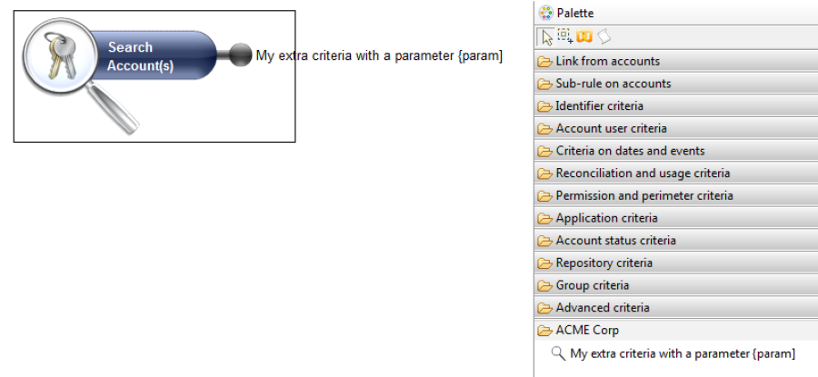  

## Add Rule Reports

When you click on the 'Report' button in the 'Results' tab of the graphic editor, a list of reports will appear. It is perfectly possible to create new reports or to modify the default reports that have been supplied. The rule reports are presented in the `/reports/rules/` sub-directory of your audit project.  

Next, the sub-directories correspond to the main concepts that are handled by the rules. These sub-directories contain the reports presented by the audit rule editor.

- **account**  : Reports on the account rules
- **application**  : Reports on the application rules
- **asset**  : Reports on the asset rules
- **group** : Reports on the group rules
- **identity**  : Reports on the identity rules
- **organisation**  : Reports on the organisation rules
- **permission**  : Reports on the permission rules
- **repository** : Reports on the repository rules
- **usage** : Reports on the usage rules

To create a new report, the easiest approach is to start from an existing report by carrying out a copy/paste of a report file. Please refer to the Guide to the report editor for more information about creating reports in Brainwave Identity GRC.

