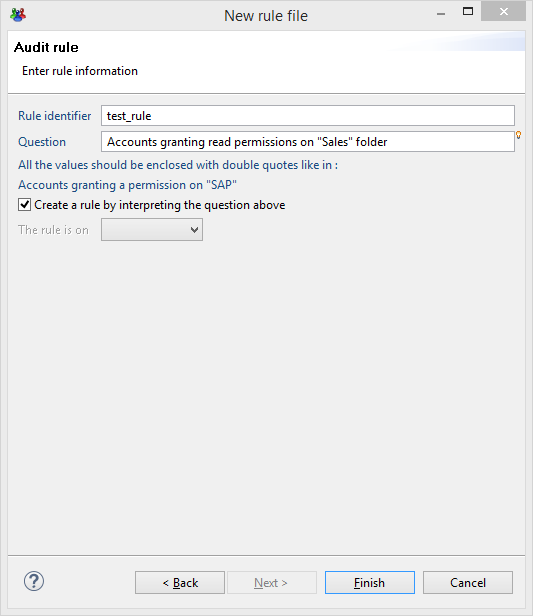

# Audit Rules

## Definition

The audit rule engine allows you to analyze the data contained within the Ledger. The principle of an audit rule is to find the elements in the Ledger that answer a given question. For example:  

- Which accounts are not reconciled?
- Which people are external to the company?
- Which people have permissions that are in violation of the segregation of duties constraints?
- Which permissions are allocated to a particular group of people?  

An audit rule is configured by combining a series of criteria with the concepts that made up the Ledger, a little like forming a question. The rule goes through the list of identifiers of the elements that are a match for the question asked. The question can be asked for any date on which the Identity Ledger was imported.  

The concepts of the Ledger that can be dated back by an audit rule are the following:  

- Identities
- Accounts
- Organizations
- Groups
- Applications
- Permissions
- Repositories
- Assets
- Usages

## Design

### Define Your Search Criteria

An audit rule is created by configuring search criteria on the concepts that are being handled by the rule. The available criteria will depend on the concept chosen in the rule editor. In order to facilitate the selection of criteria, they are sorted by category.  

Adding a criterion to the rule is carried out by effecting a drag and drop of the criterion from the palette to the rule graphic editor. In cases where the criterion gets a parameter it is represented by a hypertext link in the criterion text. Double clicking the hyperlink will highlight the parameter of the criterion.  

  

Note that at the top right position there is an input box where you can filter the list of criteria to show only matching labels. For example:  

  

It is possible to attach several search criteria to a given concept. This operation is performed directly at the concept level with the help of the AND/OR operator graphic , either by positioning the group operators  if you want to configure a precedence between the operators, or if you want to carry out a 'NO' operation to the criterion.

  

We invite you to refer to the chapter on available criteria for each Ledger object for the full list of the criteria that are available for each concept of the Ledger.  

Finally, it is possible to use the result of another rule as a criterion for a rule. This operation is performed by carrying out a drag and drop of the '_result of the rule {rule}_' in the '_Sub-rule of identities_' section of the palette. A dialogue box will appear, allowing you to select the rule to be applied as a criterion.

  

The graphic editor will show the criterion preceded by this icon :   
Double clicking the hyperlink allows the rule in question to be edited.

  

This can be useful when you have a rule (for example a list of highly privileged permissions) that you want to use to scope other audit rules (for example a list of identity that can access to highly privileged permissions).  

## Add Search Dimensions

The strength of the rule engine lies in its capacity to make use of all of the dimensions of the Ledger when the questions are being configured. This operation is performed by weaving links between the concepts of the Ledger in the graphic editor.  

The links available per concept in the Ledger are displayed in the 'Links from...' section of the palette. In cases where it is possible to reach a concept by several paths, the text in parenthesis specifies the path taken in the Ledger.

  

Using a link is performed by simply dragging and dropping the link to the graphic editor, followed by selection of the concept of the rule onto which you want to apply additional concepts.

  

This operation is recursive and it is not subject to limits. In this way it is possible to go through all of the concepts of the Ledger in order to answer a given question. For example:  

- _Which people are part of the computing department, outside of the department dealing with computing production, who have administrator type access to the production servers and who have made use of them over the past 90 days ?_  

We would encourage you at first to refer to the graphic representation of identities in the Ledger to identify the 'paths' to follow when configuring rules that contain links between concepts. If you have taken part in the training course, you will have received the Ledger in this way in the shape of a mouse mat.

  

We invite you to refer to the chapter _Available criteria per object in the Ledger_ in this guide to find the full list of relations available per concept in the Ledger.

## Results

### Visualize Search Results

You can visualize the results of your rule at any time by choosing the 'Results' tab of the graphic editor. The analysis is carried out on the last period loaded and the result is displayed in the form of a master/detail list : clicking on any element of the list displays its details on the right hand side of the screen.

> In the case of a concept of the 'Account' type, the detail interface of the result allows you to intervene actively on account reconciliation. In this way it is possible to perform search operations on accounts with the help of the rule engine in order to carry out manual reconciliation operations.  
>
> Only the first 1,000 results are displayed. If your audit rule returns more than 1,000 results, you have the option of filtering the results returned with the help of the 'Filter' banner. For this, you need to click on the 'Filter' text in order to display the filtering criteria that are available.

You can visualize the results on any period of time that has been loaded to the Ledger. To do this, simply select the desired time period in the 'Time base' dropdown menu.

### Export Results

It is possible to export the results of an audit rule in the form of a report in order to narrow down the analysis or simply in order to share the results with a third party. Several formats are available :

- HTML
- PDF
- Postscript
- Word
- Excel
- Powerpoint
- OpenOffice Writer
- OpenOffice Calc
- OpenOffice Draw
- Excel

Exporting in report format is performed by clicking on the 'Report' button in the 'Results' tab of the graphic editor: . The list of available reports will appear. The contents of this list depend on the main concept being handled by the audit rule.

Choosing a report will cause it to appear in the Web viewer. Please refer to the [Guide to the report editor](..\creating-reports\creating-reports) for more details about this viewer interface.

### Add Enumeration Constraints

It is possible to narrow down the questions asked by adding enumeration constraints to the links woven between the concepts of the Ledger. This allows questions of this sort to be answered:  

- _Which people have a Microsoft Active Directory account that gives access to more than 50 applications?_

  

This configuration is carried out at the sub-concept level of the rule either by double clicking on the text of the concept, or with the help of the contextual menu 'Modifying enumeration parameters'.  
The enumeration configuration box allows you to perform the following operations:  

- None
- At least {min} results
- At most {max} results
- Exactly {nb} results
- Different by {nb} results
- From {min} to {max} results
- Outside the limits of {min} to {max} results

The default operation performed is "at least 1 result" (when 'None' is selected).

  

Once configured, the enumeration appears in the upper area of the concept in the graphic editor. The enumeration is also taken into account in the 'text' version of the audit rule.

## Advanced Concepts

### Debug Rules and Display Intermediate Results

Debugging the rules can be facilitated by displaying the intermediate results of the rule. This operation is performed with the help of the contextual menu 'Hide/Show the result numbers'. Activating this option causes each criterion to be displayed with the number of results returned as well as the unit time taken to extract this information from the Ledger.  

It is also possible to display the partial results of the criteria of sub-concepts of the audit rule by double clicking on the criteria text or by double clicking on the sub-concepts icon.  

Finally, it is possible to display the query carried out in pseudo SQL by double clicking on the icon located on the main concept handled by the audit rule. However, the analysis of this content necessitates intimate knowledge of the technical data model and is in practice reserved solely for use by Brainwave technical support.  

### Criteria

#### Advanced Criteria

It is possible to create rule criteria that intervene directly on the attributes of the concepts of the Ledger. This can be performed with the help of the `Advanced criteria` section of the palette. Amongst other things, advanced criteria allow you to do the following :

- To handle `custom` attributes as well as the specific nomenclatures
- To test whether the attributes are valorized or not in the Ledger
- To handle the technical attributes (unique identifiers and timeless identifiers)
- To conduct attribute to attribute comparisons

Advanced criteria are used in the same way as standard criteria, however, they do necessitate finer knowledge of the data model because they are handled directly on the level of the attributes.

#### Criteria Comparison

It is sometimes necessary to carry out comparisons between different elements of the same set within the framework quality or compliancy control. This is expressed, for example, in the form of a question such as:

- _Which people with an ActiveDirectory account have a login that is different to their human resource unique ID?_  

This question involves comparison of values between the different concepts of the Ledger for each of the entries to be tested.  
It is possible to configure the comparisons between the attributes within an audit rule with the help of the following 'advanced criteria':

- Attribute {name of attribute} is equal to attribute {name of second attribute}
- Attribute {name of attribute} is different to the attribute {name of second attribute}
- Attribute {name of attribute} is lower than attribute {name of second attribute}
- Attribute {name of attribute} is higher than attribute {name of second attribute}

Configuring the second attribute requires referencing on which concept the comparison is to be carried out. If your analysis rule contains concepts that are interlinked, you will absolutely have to define an alias name for your concept. This operation is carried out with the help of the editing link enumeration constraints box in the 'Definition of a reference alias in a criterion' section.

Please note that it is not possible to define an alias for the main concept rule which must have the name '_root_' as its alias.  
Configuration of the second parameter is facilitated by a dedicated assistant that will present you with all of the available attributes for the main concept per concept on which an alias has been positioned.

Once configured, the criterion will show the attributes handled in the attribute editor. A point notion is used to identify the second attribute in a unique way.

> [!warning] Putting this functionality to work does not support the joint use of advanced criteria combinations or tests on the same concepts level very well. Be sure to form simple rules and to respect the following principle: A secondary attribute should be in the same concept or in one of the criterion's parent concepts.

### Include Rules in Execution Plan

If you are interested in the result of a rule and you would like to follow its evolution over time or publish the results for the benefit of a third party, it is possible to include the rule in the execution plan.  

Once integrated into the execution plan, the rule will be automatically executed every time there is a new data load and the results will be accessible in the Web portal. All of the results remain accessible, even the results calculated on former time slots. This allows the evolution of the results of the rule to be displayed in the reports as well as its details for any period of time.  

Inserting a rule into the execution plan is carried out by checking the 'Include in the execution plan' box in the 'Execution plan' tab of the rule properties.

  

> For the rule to be taken into account by the Web portal results, its identifier must begin with `control_`.

You can force the re-valuation of all of the rules integrated into the execution plan for the current period of time with the help of the  button in the 'Execution Plan' tab of your audit project.

  

### History of Rule Results

It is possible to manually publish the results of a rule in the Web portal or to manage the history of its results.

To do this, simply use the 'History' tab in the rules editor. The list of results that are accessible from the web portal will appear. It is possible to delete or to add periods of time or to export the given results in report format.

  

> For the rule to be taken into account by the Web portal reports its identifier must begin with `control_`.

### Tags

It is possible to add 'meta information' to the rules in order to simplify their use from the portal. This, for example, makes it possible to regroup reports by category or to filter the rules during the creation of a specific report...  
The 'meta information' is presented in the form of tags. These tags are configured in the 'Tags' tab of the rule properties editor.

#### Rule tags

The following tag names are available :  

- type
- scope
- family
- application
- permission
- custom1
- custom2
- custom3
- custom4
- custom5
- custom6
- custom7
- custom8
- custom9

The values can only be static chains of characters.  
The tags are then accessible just like any attribute of the results of the rules in the audit view editor. We invite you to refer to the chapter [Data model](../views/views.md) in the Guide to the audit view editor to find a description of the different attributes available in the Ledger for the results of the rules.

  

### Rule Parameters

It is possible to externalize the value of the parameters of the criteria of an audit rule. In particular, this allows you:  

- To create a generic, customizable 'sub rule' that can be used in another rule
- To create a generic, customizable 'sub rule' that can be used in an audit view
- To extend the criteria available to a concept

This is carried out by creating parameters for a rule.  
Adding or using a rule parameter is completed directly in the Editing a rule parameter dialogue box. Simply click on 'Valorize the criterion with a global parameter rule' and click on the parameter. The  button allows you to add a new global parameter to the rule.

  

Please note that it is possible to quite simply ignore the criterion if the parameter is not valorized during the call. This makes it possible to create generic rules whose parameters are optional (for example a search rule with a number of criteria that are all optional). This operation is carried out by checking 'Ignore the criterion if the value is null or empty'.  

Management of the global parameters of the rule is carried out with the help of the 'Properties' tab in the properties editor of the audit rule. It is possible to delete outdated parameters and to assign them default values. Note that the parameters of rules are multi-valued. If the criterion depends on a single-valued value, then only the first value used will be taken into account.  

  

For a parameter to be accessible from outside the rule (view, another rule ...) it is essential that its identifier appear in the display name of the rule. The naming rule is to have the identifier appear between {}. When the rule is used, the display name of the parameter will automatically appear in the form of a hyperlink that allows it to be edited.

  

### Calculated Rule Parameters

It is possible to take advantage of the integrated script language in the Analytics engine in order to automatically calculate the parameter values on the basis of the parameters given at the outset.  

This can be particularly useful when defining a generic rule that contains the entry parameters and when you want to adapt the query in relation to these parameters, for example carry out either a **value type search, or a \*value**  type search, or a **value\*** type search.  

To do this, simply create a new rule attribute (see the previous chapter), and then modify the value of this parameter with the help of the 'rule properties'.  

The syntax to use is described in the "Guide to collection" in the "Macros and scripts" chapter. The scripts are declared with the help of the `{` `}` symbols.

  

  

### Analyze Dependencies and Rename Rules

Rules are used by a number of components of the audit project : Reports, Audit view, Other rules. Rules can also use other rules.  
Referencing a rule within a project is carried out with the help of its identifier. To do this, an identifier is unique to an audit project. Renaming the identifier of a rule is therefore a special operation and it can be completed with the help of the dedicated button in the rule properties editor.  

The 'Dependencies' and 'Usage' tabs in the rules editor allow you to manage the dependents of the rules.

- **Dependencies** : List of project rules on which the audit rule depends:  

- **Usage** : List of the rules, views and reports from the project that uses this audit rule:  

### Create Extra Rule Criteria

Within the framework of a project, it can often be useful to create extra rule criteria. In particular, they can allow you :  

- To render data stored in the 'custom' fields of the Ledger intelligible
- To format ready-to-use searches that are specific to client context ('The VIP partners who have access to SAP')

This operation is simple and is carried out by configuring a rule and publishing it in the form of a criterion. Please refer to the chapter [Using rule parameters](#advanced-concepts) to find out how to make it possible to configure your criteria.  

To publish a rule as a criterion, select the entry in the contextual menu 'Package as a criterion' in the graphic rules editor. A dialogue box will open. You will need to successively:

- Indicate the library file name that will contain your criterion
- Configure your criteria  
  - **Category** : Name of the category which will appear in the palette
  - **Criterion version** : Version of your criterion
  - **Author** : Name of the author of the criterion

  

Once your criterion has been created, it will appear in the form of a library file that has the extension '.criteria'. This is an autonomous file that you can use in an audit project simply by positioning the file in the 'libraries' directory of your project (it will carry all of the dependencies that may be associated with the rule).

  

> [!warning] The libraries are loaded when Brainwave Analytics is loaded. Therefore, you will need to restart Analytics before testing your criterion.|

  

### Add Rule Reports

When you click on the 'Report' button in the 'Results' tab of the graphic editor, a list of reports will appear. It is perfectly possible to create new reports or to modify the default reports that have been supplied. The rule reports are presented in the `/reports/rules/` sub-directory of your audit project.  

Next, the sub-directories correspond to the main concepts that are handled by the rules. These sub-directories contain the reports presented by the audit rule editor.

- **account**  : Reports on the account rules
- **application**  : Reports on the application rules
- **asset**  : Reports on the asset rules
- **group** : Reports on the group rules
- **identity**  : Reports on the identity rules
- **organisation**  : Reports on the organisation rules
- **permission**  : Reports on the permission rules
- **repository** : Reports on the repository rules
- **usage** : Reports on the usage rules

To create a new report, the easiest approach is to start from an existing report by carrying out a copy/paste of a report file. Please refer to the Guide to the report editor for more information about creating reports in Brainwave Identity GRC.

## Deal with Time in Rule Editor

The view editor has the ability to query several timeslots. This feature is provided through a join which is called "join with the same entity in previous timeslot". But in the rule editor, this kind of join does not exist. The rule editor now offers a way to add criteria in the previous timeslot. Now you can answer these questions quite easily:  

- Which identities have changed of last name in the past ?
- Which accounts have been locked in 3 timeslots or more ?  
- Which identities were granted the "SageAdmin" permission in the past ?
- Which identities have never changed of organizations ?
- Which groups contained the "Guest" account at least once ?
- Which identities had more than 10 accounts in the past ?  

To answer these questions, you now have 2 new tools in the palette of the rule editor. Why 2 new tools? Each tool is used to answer a different kind of question. They both work on previous timeslots but the difference is on the way the criteria are applied.  

- The "**timeslots**" tool is used to keep entities by checking if the given criteria match in previous timeslots. This tool lets you count the number of timeslots matching some criteria.  
- The "**counters**" tool is used to keep entities by checking the count of distinct values in previous timeslots. This tools lets you count how many different values you have for a set of attributes in the past.  

The difference is tricky. A question concerning the organization of identities is used to analyze each tool.  

- "timeslots" tool: `Which identities have been in the "Sales Department" in at least 3 timeslots ?`  
This query counts the number of timeslots where the organization is "Sales Department". Note that you have no way to ask for 3 consecutive timeslots. You will get identities who keep changing of organization (one timeslot in Sales Department, the next timeslot in Marketing, then in Sales Department, then in Marketing,...). And also, you don't know if the identities have only worked in Sales Department or not. The way it works is by counting the timeslots where a criterion (identity belonging to Sales Department) is true.  
- "counters" tool: `Which identities have been in 3 different organizations in the past ?`  
This query counts the different distinct organization values. This is completely different from the previous example. Now you want to find identities which have worked in 3 different organizations without knowing each of them. In all the timeslots, the rule engine finds the organizations in which the identity has worked and the identity is kept if there are at least 3 different ones. It is important to note that the rule engine does not count events (a change of organization) but only different values. Maybe the identity has changed 5 times but going back and forth in 2 organizations (Sales and Marketing). We have 5 change events but only 2 distinct organizations so the identity does not match the criterion of "3 different organizations in the past".  

> [!warning] The most important thing to remember is that the rule always returns entities (identities, accounts,...) of the **current** timeslot. The time is just a constraint to select entities in the current timeslot. When you ask for identities who worked in the "Sales Department" in at least 3 timeslots, the result will be identities of the current timeslot but respecting the constraints about the organization in the previous timeslots. If an identity has worked in the "Sales Department" in at least 3 timeslots but has left the company in the previous timeslot, this identity will not appear in the output result. On the technical side, the rule always returns recordUid belonging to the current timeslot.

Two new buttons are found in the Palette of the rule editor. The first one is the "timeslots" tool and the second one is the "counters" tool.  

  

Now, let's see how our example with identities and organizations is designed in the editor.

### The "timeslots" tool

The following snapshot illustrates the question "Which identities have been in the "Sales Department" in at least 3 timeslots ?".  

  

The "timeslots" tool adds a constraint on the identity. The identity is kept in the output result only if some criteria are true in at least 3 timeslots. The criteria can be a combination of any criterion and joins on identities. The important thing to note is that under the 'timeslots" tool (in red on the picture), you define some criteria without the time in mind. Here we want identities working in the Sales Department but the "timeslots" tool checks this constraint on every timeslot in the database.  
The "timeslots" tool has all the criteria and joins found in the parent entity (identity in our example). Of course you can also attach criteria on the root identity as shown in the following snapshot :  

  

The question behind this rule is : `Which identities are now working for the "HR Department" and have been in the "Sales Department" in at least 3 timeslots ?`  
By default, the "timeslots" tool only search in all the timeslots (excluding the current one) of the database. This is why the words "All database" are written above the "timeslots" tool. By double-clicking on the tool, you can change the scope of the search and the details on the constraints:  

  

The first section of the properties box defines the scope the rule engine should search on. You can use different units like the N last timeslots, the N last days or the timeslots since a specified date. Of course the value can be an input parameter of the rule.  
The second section is the constraint on the timeslot count matching the criteria (identity belonging to "Sales Department").  

### The "counters" tool

Now we want to build a rule answering the question: "Which identities have been in 3 different organizations in the past ?"  

  

The "counters" tool adds a constraint on attributes (not on timeslots). Here we want to search for 3 different values for the attribute org.code (org is the alias on organization). The default scope of the tool is "All database" but it can be changed by double-clicking on the tool to open a properties box shown below:  

  

In the second section, you define the list of attributes you want to check. On the right part you set the count constraint. If you select 2 attributes and a constraints "at least 3 sets of values", it means that the rule engine checks that there exist at least 3 different value pairs for the selected attributes. When you click on the "Add..." button on the left part to choose an attribute, do not choose an attribute which is a recordUid as this kind of attribute is different in each timeslot. This would have no meaning counting the distinct recordUid among all the timeslots because each recordUid is different in every timeslot.  

### Querying events

The 2 tools offered in the rule editor count either timeslots or attribute values but not events (value change). To count events, you can use the "timeslots" tool and set criteria on flags in the database.  

#### Built-in flags

The activation step in the execution plan already computes several built-in flags like "organization changed" and "permission changed" for identities and some others on accounts and groups. For example the "organization changed" flag found on identity can be used to issue the following query :  
`Which identities have worked 2 times in the "Sales Department" ?`  
The question is about the identities who worked for the Sales Department, then for another department and then in the Sales Department again. We can not just count the number of timeslots where the identity was in the Sales Department. To answer this question, we need to use the "organization changed" flag as shown below :  

  

To understand how it works, the following diagram shows a time-line of an identity changing of organization. The identity was working in HR Department in timeslot t1, then in Sales Department in timeslots t2 and t3, etc. A flag has been displayed above the name of the organization when this is a change from the previous timeslot (meaning that the flag "organisation changed" is true)  

  

You can see that there are two timeslots (t2 and t5) where the organization is "Sales" and the flag "organization changed" is true. This identity will appear in the output result of the rule because the constraint set in the tool was "at least 2 timeslots".  

### Custom flags

The product has only a few built-in flags. What about if you want to query something like : the identities having access to a new application at least 3 times in the past ?  
The problem is that we do not have a built-in flag to know if someone got a new application compared to the previous timeslot.  
But the product lets you define your own custom flags so that you can use them in the rule editor.  

Please, read the article [Creating temporal analysis rule criteria](#create-a-new-temporal-criterion) to know how to create custom flags.

## Create Temporal Analysis Rule Criteria

During data collection, a number of flags are automatically computed to provide information on important changes, for instance identities that have had their permission changed, or that have moved to another organisation, etc.  
It is possible to further extend the data model to include custom computed flags on any entity and use them as rule criteria. Here are some examples for criteria that you are able to define:  

- the organizations that have at least two new members
- the people that have access to new applications
- the people that have lost access to more than 3 applications
- the groups that have changed composition
- ...

### Criteria Definition

A criterion is defined by a set of characteristics that will allow to compute it during the execution plan and then make the results available in the rule editor as new criteria.  

Apart from a unique identifier and a description for the criterion, one needs to fill out two labels which will be displayed in the rule palette, one for the criterion and another for its negation.  

The actual definition of the criterion is based on a view that will give the data to be compared on different timeslots. More precisely, you need to define an attribute that will hold the uid of the entity (identity, account, repository, organization, etc) which the criteria applies to, and another attribute for the value used for comparison.  

Example: criteria 'people who have changed applications'  
To create this criteria, we only need to create the following view whose output are the identities and their respective applications :  

  

The computation will automatically compute the difference in output between timeslots, and create the corresponding criteria in the rule palette of the identity element.  

But the system is actually a lot more flexible than just calculating the differences, allowing to create a great number of criteria using the same view. This is because, in addition to the view, you have to define :  

- the variation type you want to consider : differences, identical values, new values, values lost  
- an operator : greater than, equal to, different, ...
- a value to test against the operator  

Examples :  
For the previous example 'people who have changed applications', we would choose a number of differences strictly greater than 0, or to the same effect a number of differences greater than 1 or a number of differences different from 0.  
But we can as easily create other criteria like 'people who have received access to new applications' with a number of new values strictly greater than 0, 'people who have had more than 2 applications revoked' with a number a lost values greater than 2, ...  

Every criteria defined will automatically include its negation, so that in the rule editor, you can not only retrieve the population verifying the condition you set, but also the population that does not match the criterion.  

### Create a New Temporal Criterion

To define a criterion, choose **Temporal analysis criteria** in **New...** section of the main menu.  

  

You will then be prompted to fill in the information necessary to define the criterion, as shown below :  

  

The wizard will generate a `.temporalcriteria` file in the temporalcriteria sub-folder, that can be further modified in a dedicated editor :  

  

### Include in Execution Plan

To ensure that the temporal criteria that have been defined are computed and stored in database after data activation, two steps have to be taken :  

- ensuring that the option **Include in execution plan** is checked for all the relevant `.temporalcriteria` file (this option is activated by default, so if you haven't forced the exclusion all new criteria should be automatically included)
- checking the option **Run temporal analysis criteria automatically** in the execution plan tab of the configuration editor.

  

Is is also possible to launch a manual computation on a given timeslot in the execution plan tab of the project. Note that if the timeslot already contained computed temporal criteria, these will be cleared at the start of new computation, to ensure that the database contains only the results for the latest version of a criterion.

  

### Compute Criteria on Older Timeslots

the criterion added to the project would normally only be available on the timeslots loaded after their creation. To provide analysis on previously archived timeslots, however, it is possible to launch a computation on all database timeslots. This step needs only be performed once in the project, and can be launched from the execution plan tab of the project.  

  

### Use the Criterion in Rules

The criteria that are defined in `.temporalcriteria` files are available in the rule editor palette, under the category **Temporal criteria**.  
There will be two entries for the criteria, one for the positive version (e.g. when the condition is met) and another for the negative version (e.g. when the condition is not met). They can be used as any other rule criteria to filter the entity on which they apply.  
Please note that the criteria from all projects will be displayed in the rule palette, whether they are currently included in the execution plan or not.  

  

## Advice and Best Practices

### Tree Diagrams and Rule Naming

The rules are located in the `/rules` directory of your audit project. The rules carry the extension `.rule`

### Alias

Using an alias severely limits the capacities of the rule engine. Be careful not to use aliases unless absolutely necessary and to respect the following principles:

- Do not use sub-rules in your rule
- Limit the use of combination components
- So far as is possible, reference the attributes of the root concept as second attribute values (`root.xx x`)
- Do not reference other attributes to the concepts except those that are on the parent branch of your criterion.

### Reports

It is preferable to use rules dynamically in the reports by associating the rules in the reports rather than using the 'saved rule results'. This avoids having to store the rule results in the base.

## Create a Rule Using Natural Language Questions

During the rule creation wizard, you have the possibility to initialize the new rule by asking a natural language question.  

In the rule creation wizard, there is an input box where you can ask a question in a natural way:  

  

The created rule will be initialized with the asked question, for instance in the previous example it will be:  

  

Note that this functionality only applies to the initial creation of the rule. After that it can still be modified in any way applicable to a rule.  

### Example

Here are some examples of questions you may ask:  

- Accounts offering write privileges on the "Sales" folder
- Accounts created before March 2014 and belonging to no group
- People managing the "SAP" application
- Who are the active identities owning a disabled account  

### Known Limitations

Note that the values such as group names, organization names and so on, must be enclosed by double quotes ("). For instance, in Accounts granting a permission on "SAP" the double quotes around SAP are mandatory.  
