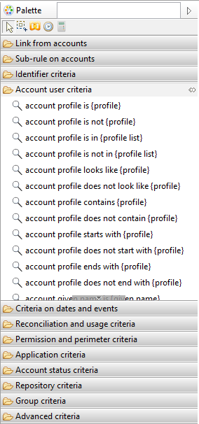
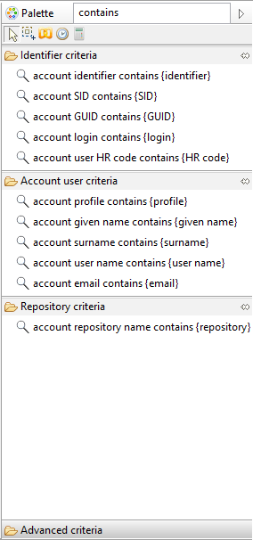
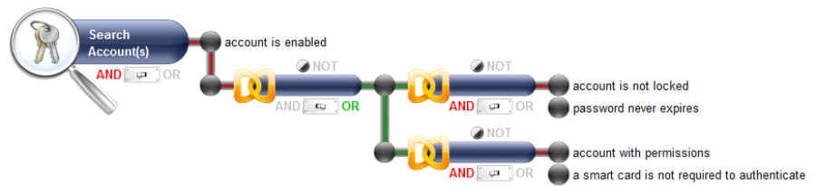
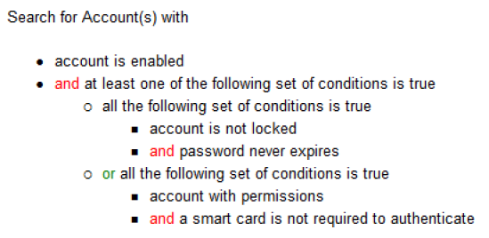
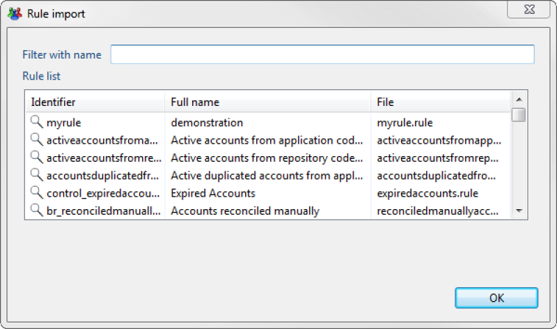
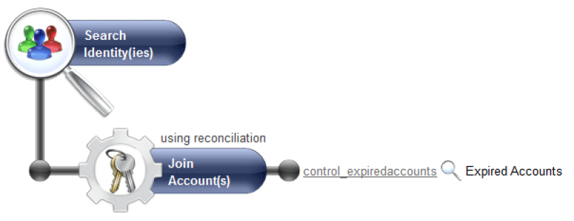

# Audit rules

## Definition

The audit rule engine allows you to analyze the data contained within the Ledger. The principle of an audit rule is to find the elements in the Ledger that answer a given question. For example:  

- Which accounts are not reconciled?
- Which people are external to the company?
- Which people have permissions that are in violation of the segregation of duties constraints?
- Which permissions are allocated to a particular group of people?  

An audit rule is configured by combining a series of criteria with the concepts that made up the Ledger, a little like forming a question. The rule goes through the list of identifiers of the elements that are a match for the question asked. The question can be asked for any date on which the Identity Ledger was imported.  

The concepts of the Ledger that can be dated back by an audit rule are the following:  

- Identities
- Accounts
- Organizations
- Groups
- Applications
- Permissions
- Repositories
- Assets
- Usages

## Design

### Define Your Search Criteria

An audit rule is created by configuring search criteria on the concepts that are being handled by the rule. The available criteria will depend on the concept chosen in the rule editor. In order to facilitate the selection of criteria, they are sorted by category.  

Adding a criterion to the rule is carried out by effecting a drag and drop of the criterion from the palette to the rule graphic editor. In cases where the criterion gets a parameter it is represented by a hypertext link in the criterion text. Double clicking the hyperlink will highlight the parameter of the criterion.  

  

Note that at the top right position there is an input box where you can filter the list of criteria to show only matching labels. For example:  

  

It is possible to attach several search criteria to a given concept. This operation is performed directly at the concept level with the help of the AND/OR operator graphic , either by positioning the group operators  if you want to configure a precedence between the operators, or if you want to carry out a 'NO' operation to the criterion.

  

We invite you to refer to the chapter on available criteria for each Ledger object for the full list of the criteria that are available for each concept of the Ledger.  

Finally, it is possible to use the result of another rule as a criterion for a rule. This operation is performed by carrying out a drag and drop of the '_result of the rule {rule}_' in the '_Sub-rule of identities_' section of the palette. A dialogue box will appear, allowing you to select the rule to be applied as a criterion.

  

The graphic editor will show the criterion preceded by this icon :   
Double clicking the hyperlink allows the rule in question to be edited.

  

This can be useful when you have a rule (for example a list of highly privileged permissions) that you want to use to scope other audit rules (for example a list of identity that can access to highly privileged permissions).  
