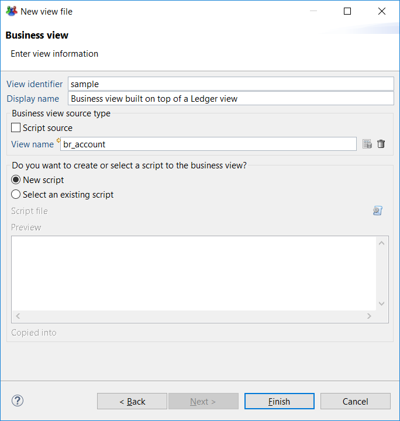

# Business View Editor

## Create a Business View

To create a business view you can either :

- In the audit menu, click on `New...` and select `Business view`.
- In the Project explorer right click on the `\view` folder or any sub-folder and select `New > Business view`  
These actions open a wizard where you must configure the name of the business view before clicking `Next >` .  

> Once created all business views and associated JavaScript files must be located in the `\views` folder or under any sub-folders.

This opens a new panel where you have to choose the kind of source to use. It can be :  

- A view source
- A script source

It is always necessary to attach a JavaScript file to your business view. A business view that uses a view source may contain a script component which needs a JavaScript file to store the functions called by the component. The best practice is to have the two files, `.businessview` file and it's associated `.javascript` file in the same folder. Of course, in the context of a project, several business views may share the same JavaScript file.  

## Use the Business View Editor

To describe the business view editor, we are going to create a business view based on a ledger view.  

In the creation wizard, select any ledger view in the view field and click on `Finish`. In the example below the business view is based on the ledger view `br_application`.  

The business view editor is built the same way as the other graphical editors in the product (see [here](../getting-started/05-studio-editors#using-the-editors) for more graphical editor descriptions). The editor contains the graphical part in the middle, the palette containing all the available components on the right and the Properties window at the bottom of the studio (see caption below).  

The business view always contains a source component, located at the top. This is the only component displayed when the view has just been created. The palette on the right is not contextual to the selection in the graphical area. The palette always shows all available components.

To add a component to the pipe, first, select the component just before the insertion point. Then drag & drop a component from the palette. The component will be inserted after the selected component.

> Cut, Copy & paste operations are available but when you cut a component, all the following components are also cut.

The configuration of a component is done in the Properties tab displayed on the bottom of the graphical editor. Clicking on the background of the graphical area will display the schema of the view in the Properties tab (see caption below). The schema of the view represents the list of attributes available for the report or the page once the view is executed.  
Additional important information such as the component in which the attribute has been defined or, if the attribute comes from a ledger view, the name of the view and the meaning of the attribute.  

When a component is selected, the Properties tab will displays a set of sub-tabs that depend on the component type. Some of these sub-tabs are common to all components :

- Filtering: that is used to filter records based on a JavaScript expression
- Computed columns: that is used to configure the attributes to be added from the output records
- Exclusion: that is used to configure the attributes to be removed from the output records
- Notes: that is used to add annotations on the configuration of the component if necessary.  
All the tabs of the Properties window for each components are reviewed in the next chapters.  

When the design is finished, the results of the business view are available in the "Results" Tab. This screen looks like the "Results" tab of a Ledger view. The table displays the columns corresponding to the view schema. You can select another timeslot at the top of the screen.

> If the layout of the columns in the result table is change; such as the column width and/or order, this layout is preserved until the editor is closed.
