# Common Features

## Global Configuration of Business Views  

The global configuration of a business view is located in the "Configuration" panel of the business view editor. This is where it is possible to configure global information, business view input parameters and sorting operations.

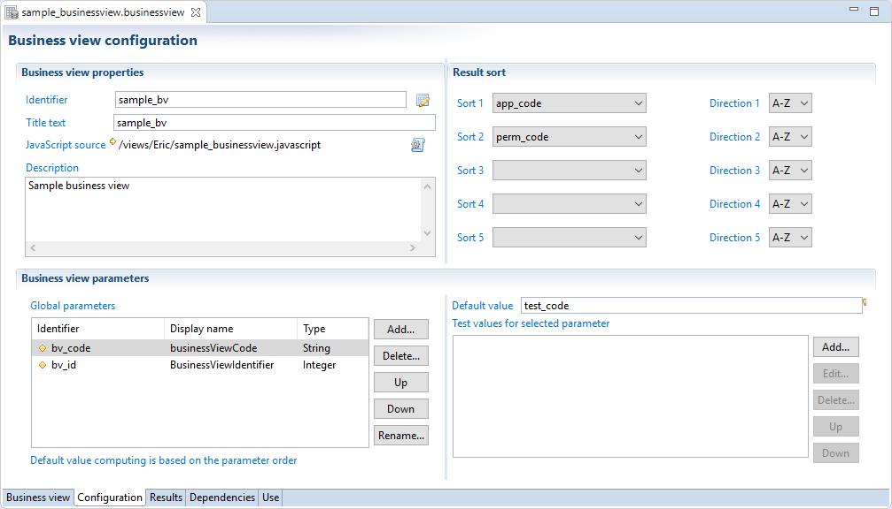

### Global Information  

In this section you can:

- Edit the business view unique identifier  
- Edit the business view displayname
- Choose the `.javascript` file that can be used by a JavaScript filter and/or a JavaScript source component
- Add a description

### Global Parameters  

The business view accepts input parameters used, for example, to filter output records. This is particularly useful when the business view is used in reports or pages: it adds context to the results of the business view by supplying parameters directly from the reports and/or pages.

View parameters are defined in the Configuration panel of the business view editor.

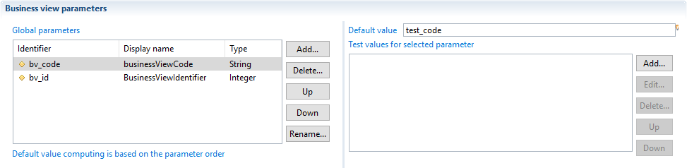

It is possible to use an expression in the default value: internal parameters can be computed based on input parameters.
As an example, let's say that in our Ledger, all application codes are stored in upper case. If the input parameter is the application code, it is possible to declare a second parameter which convert the application code to upper case. This second parameters will be useful to filter records in this particular case.  

### Multivalued parameters

When handling multivalued parameters in a businessview be careful to the way you map them in macro. In the following example we have a simple BV containing a view source component that calls a ledger view listing permissions by application. The ledger view has a global parameter mapped on application code attribute to filter results.  

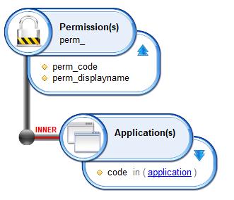

We will illustrate three cases:

#### Case 1

By default if you map the `param_application` businessview global parameter on ledger view parameter using `{param.param_application.get()}` as bellow, only the first value of the list will be mapped - in that case it will be 'HORIZ'.

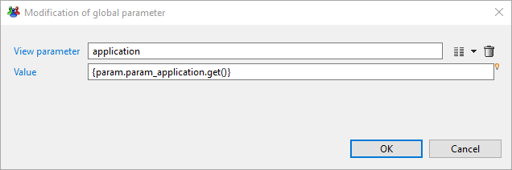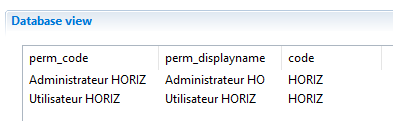

#### Case 2

To map all values to the ledger view parameter you have to use `{param.param_application}` without calling `.get()` method because by default `.get()` returns the first element if the attribute is a multivalued.

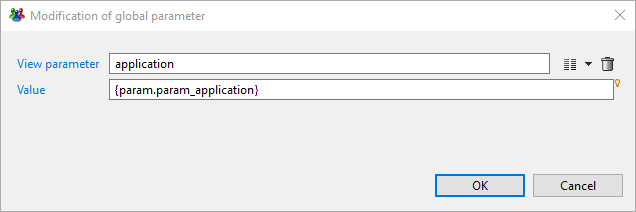
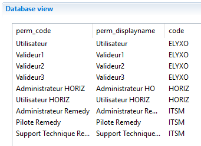

#### Case 3

To map a specific index value from the list of multivalued parameter you need to specify the index when calling `.get()` method ex: `{param.param_application.get(2)}` in that case it will return the last value 'ELYXO'.

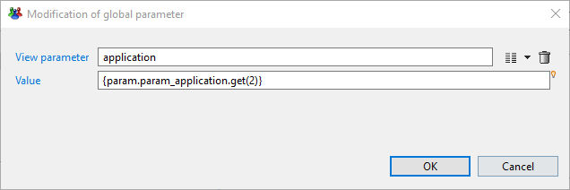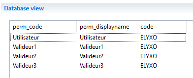

### Sort  

In this section, it is possible to configure a sort policy that will apply on your business view results. Up to five sorting criteria, which will be applied sequentially, are available, : 'Sort 2' enables a sub-sort to be carried out on lines for which 'Sort 1' returns the same value, etc. It is possible to choose the sort direction for each attribute. This order is applicable whatever the type of attribute (String, Number, Boolean, or Date).  

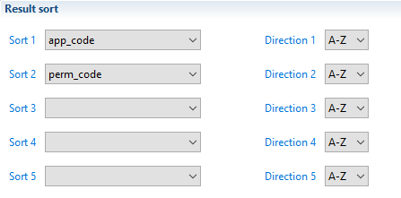

#### Optimizations

- The sort in business view is handle in memory, unlike the ledger view and log view where the sort is executed by the database.
- The sort policy will be carried out only after all components have finished data fetching (the entire results will be stored in memory).
- It it highly recommended to be careful when requiring sorting on huge data.

> [!warning] Even if the sort is not activate in the business view, the sort may be requested from the page when the user click on a column header of a table. In this case, the page re-executes the business view with a sort on this column and the sort is executed in memory.

## Common Operators

All available components in the business view editor implement some common operations:

- filtering  
- add computed attributes  
- exclude attributes from schema  

### Filters  

The filter policy allows to include, exclude or deduplicate data results returned by any component of a Business View.

A list of filters to be applied on all dataset resulting from the component can be specified, and several conditions can be combined. Filters are executed in the declaration order. If there are several filters, an AND operator is applied to ignore - or not - result lines.

The resulting dataset is validated (not excluded) only if all filters are valid:

- all include filters must return true,  
- all exclude filters must return false,  
- the dataset is not a duplicate according to the calculated key.

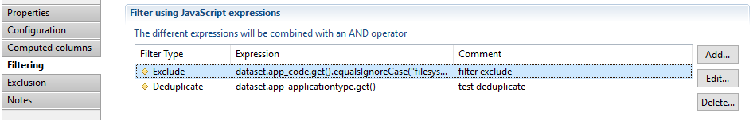

Three types of filters are available in business view components:

#### Include

Include filter is based on a JavaScript expression, if the expression returns false then the dataset will be ignored without evaluating remaining filters.

#### Exclude

Exclude filter is based on a JavaScript expression, if the expression returns true then the dataset will be ignored without evaluating remaining filters.

#### Deduplicate

Deduplicate filter is also based on a JavaScript expression: all the datasets that generate the same expression value are ignored except the first one.

> [!warning] As the deduplicate filter uses a memory cache containing the values of calculated expression, please beware when using several deduplicate filters. This can result in very high memory usage (RAM).

Below is an example using several filters (before and after filtering):

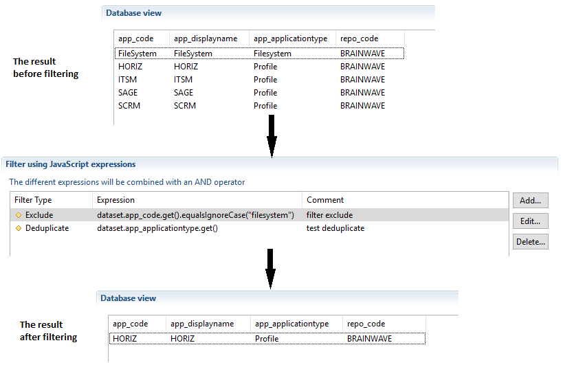

### Computed Columns

It is possible to define columns with a dynamically computed value based on the values of other columns in the Dataset.  
This is particularly useful when the user wishes to carry out pre-processing on data for layout or analysis in a report.  
Computed columns are added via the "Computed columns" properties tab of the Business View editor:

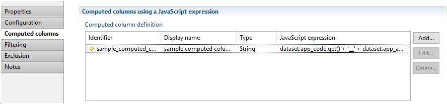

The dataset object provides access to current columns.
When adding a computed column definition, the following window is opened. In this windows the computed column can be configured:

The computed columns are then added to the displayed results:

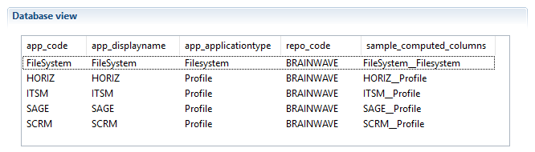

> It should be noted that the script is executed on each result line in the component to calculate the column value and therefore it is helpful to prepare scripts that take into account possible NULL values for columns by the `dataset.isEmpty('columnname')` expression.

### Exclude Attributes from Output Schema

The exclude operation filters the schema of each component result by selecting a list of attributes that will be removed from resulting datasets. This functionality is useful when several attributes are used, for example, in computed columns, filtering, ... and the users does not want to get them in the final result.

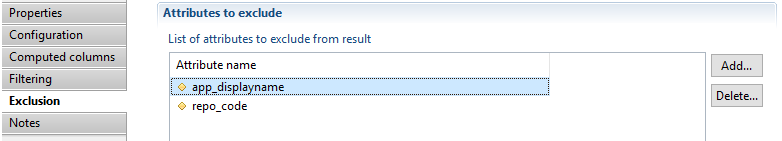

Below is an example of business view results before and after Exclusion:  

__  

 to exclude list")
