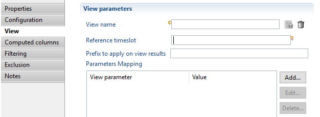
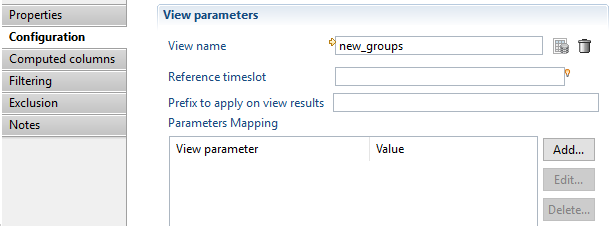
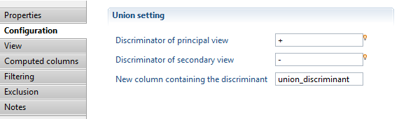
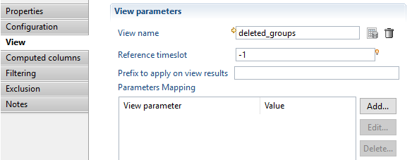
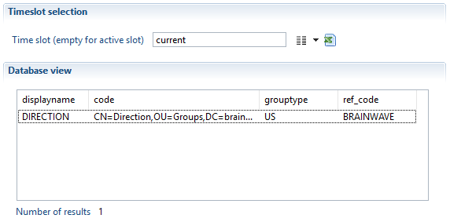
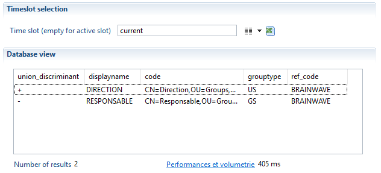
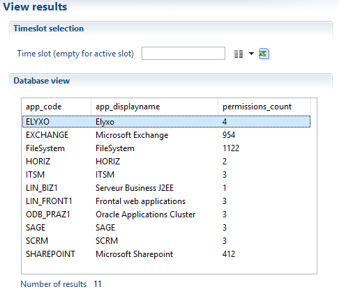
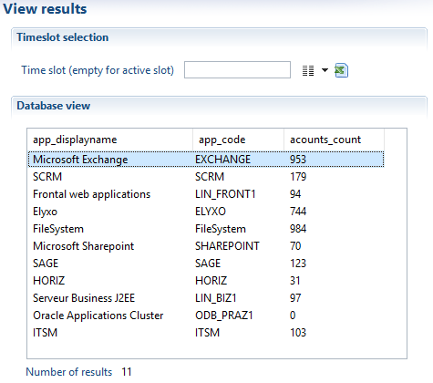
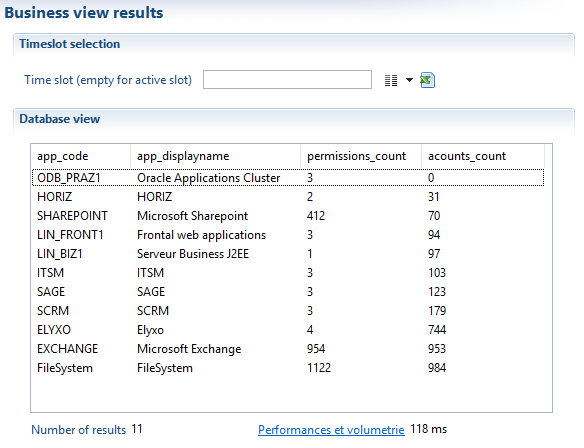
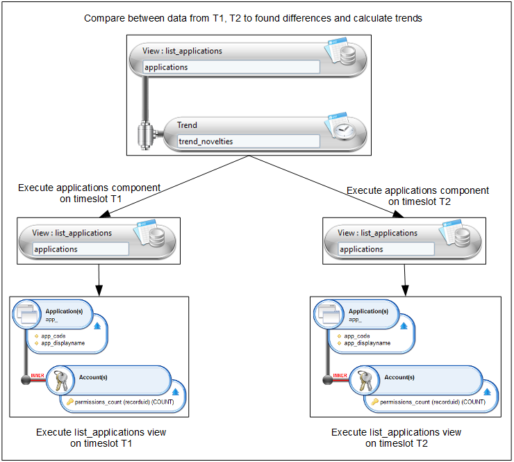

# Filter Components

Filters are components that receive records from a parent component (maybe a source) in the pipe, transform them or filter them and then send the resulting records to the next component in the pipe. Building a business view is just a matter of selecting and ordering the operations to apply to records coming from the source.  

### Union

#### Objective

The union component performs an union operation between records coming from a principal view those coming from a secondary view. The two views are configured in the union component sub-tab.

#### Specific Configuration


1. A string value to distinguish records coming from parent component (the pipe).
2. A string value to distinguish records coming from the configured view in the union component.
3. Name of the new column that will hold the discriminant value.

Both discriminators accept expressions so you can build a key composed of several columns from the current record.  

It is mandatory to configure a view in the union component to perform the union operation.
Please refer to the help of view source component for [how to configure the view](igrc-platform/business-view/components/components.md)


#### Examples

In this example, we are going to build a table that lists the group movements for a given ActiveDirectory domain: added groups and deleted groups.

- A string value ' **+**' is added at the beginning of the line for each group added
- A string ' **-**' is added at the beginning of the line for each deleted group

**<u>Definition:</u>**

The business view will perform union between two ledger views as illustrated in the caption bellow

- The new\_group ledger view lists the new groups (importaction = 'C')
- The deleted\_groups ledger view lists the deleted groups (deleteaction = '1')

The database contain only two timeslots:  

- The current timeslot display-name is: "current"
- The previous timeslot display-name is: "history" (history = current - 1)


**<u>Configuration:</u>**

Configuration of the source view component (new\_groups\_component)



Configuration of the Union component (removed\_groups\_component)  



Configuration of the view in the union component (removed\_groups\_component)
The deleted\_groups ledger view will be executed in BusinessView\_timeslot - 1.  



**<u>Results:</u>**

Results of a separate execution of "new\_groups" ledger view on "current" timeslot:  



Result of a separate execution of "deleted\_groups" ledger view on "history" timeslot (mean that groups will be deleted in next timeslot ("current")):  


Results of the business view execution on "current" timeslot:



### Join

#### Objective

The Join filter is used to link records from two different data source, the first data source is the parent component in the business view (pipe) and the second is the view set in join configuration.

The join types implemented in the component are (see caption below):

- Left
- Right
- Inner
- Full
- Difference
- Exclusion


#### Specific Configuration


1. joint type that will be performed. It can be: Left, Right, Inner, Full, Difference or Exclusion.  
2. An expression that will be calculated for records coming from parent component (pipe) to match with the "Join key of secondary view" expression.
3. An expression that will be calculated for records coming from the view in join configuration to match with the "Join key of principal view" expression.

Both keys accept expressions so you can build a key composed of several columns from the current record.

It is mandatory to configure a view in the join component to perform the join operation.
Please refer to the help of view source component for [how to configure the view](igrc-platform/business-view/components/components.md)


#### Examples

This example will illustrate how to perform multi-counts.
The concept is to list all applications and for each application display the associated number of permissions and accounts.

**<u>Definition:</u>**


**<u>Configuration:</u>**

It is necessary to Configure a join between data from the `permissions` component (the _permissions\_count_ ledger view) and the results of `accounts_count` ledger view.

The join is based on:

- The attribute `app_code` attribute of `permissions_count` ledger view
- The attribute `app_code`attribute of `acounts_count` ledger view


**<u>Result:</u>**

Results of a separate execution of `permissions_count` ledger view on current timeslot.  



Results of a separate execution of `accounts_count` ledger view on current timeslot:    



Results of Business View execution on current timeslot



**<u>Reducing the memory usage:</u>**

- The join filter (Left, Inner, Full, Difference or Exclusion) stores the data from secondary component in a memory cache, it is highly recommended to perform the necessary filtering in ledger view (_i.e._ performed by the database) before performing the join operation in the business view
- The join filter (Right) stores the data from the primary component in a memory cache, it is highly recommended to perform necessary filtering in ledger view (_i.e._ performed by the database) before performing the join operation in the business view

> [!warning] It is **not** recommended to use a generic Brainwave view, delivered with the default project when you require a limited number of attributs as input. These views return a large number of attributes that will be stored in a memory cache and greatly increase the memory usage, impacting performance.

### Trend

#### Objective

The trend filter allows the calculation of trends and/or differences by re-executing the same view in an other timeslot and comparing the results according to a join key and a comparison column.

#### Specific Configuration


1. The timeslot used as a baseline to compare results. Is can either be calculated relatively based on the business view timeslot,or using the uid.  
2. An expression used to match lines that must be compared.  
3. The column name in the source component of the data used to calculate trend. This parameter is to be set only if the a numerical calculation is needed in the configuration of the trend.
4. In the case of trend calculation, this parameter provides the name for the output column containing the numerical result of the trend calculation. That is the reference value substracted by the current value.This parameter is to be set only if the a numerical calculation is needed in the configuration of the trend. If the resulting output is non-numeric the returned result is then `null`.
5. In the case of trend calculation, this parameter provides the name for the output column containing the reference timeslot (see point 1.) value used for the comparison.
6. Name for the outputted column containing the trend status, can be (New, Identical, Modified, Removed, Invalid)  
7. Name for the outputted column containing the timeslot uid from where the data originated. This column is used to identify the origin of result lines.
8. If checked, new entries are excluded from component output.
9. If checked, unchanged or identical entries are excluded from component output.
10. If checked, removed entries will not appear in component output.

#### Examples

The aim is to list all applications present in the ledger and for each application:

- Show the status of the application if it is New, Modified (according to number of permissions), identical or Deleted comparing with previous timeslot
- Show number of permissions in current timeslot , previous timeslot, and the difference(current - previous)
- Show the timeslot of the line result

**<u>BusinessView definition</u>**



Configuration:


**<u>Results:</u>**

Result of `list_application` ledger view execution on current timeslot:  


Result of `list_application` ledger view execution on previous timeslot:


Result of BusinessView execution (trend operation):  


**<u>Reducing the memory usage</u>**

- The trend filter stores all the results of one of the two views a memory cache, it is highly recommended to perform necessary filtering in ledger view before performing the trend operation in the business view

> [!warning] It is **not** recommended to use ageneric Brainwave view, delivered with the default project when you require a limited number of attributs as input. These views return a large number of attributes that will be stored in a memory cache and greatly increase the memory usage, impacting performance.

### Script

#### Objective

When the predefined components offered in the business view are not enough to implement the desired business logic, then it is time to add a script filter. The Script filter will read all records as well as add the possibility to filter them or alter their contents.  

#### Specific Configuration

The configuration of a Script filter is the same as the script source. The 3 events (init, read and dispose) are mapped to 3 JavaScript functions. Please see the event table in the Script source section for a detailed description of each event.
The only difference between a source and a filter is that the filter must receive all the records from a source instead of generating them. The difference is in the function read where an API is offered to get the next record from the source.
A predefined global object called `businessview` is available in the script. The most important method in the `businessview` object is `getNextRecord()`.

The following example shows a filter that reads records from the source and feeds them to the next component. This filter does nothing but shows the minimum architecture of the Script filter.  

```javascript  
function init() {
}

function read() {
    var /*DataSet*/ record = businessview.getNextRecord();
    return record;
}

function dispose() {
}
```

The function `read()` calls the `getNextRecord()` method to get a record from the previous component (maybe a source). As in the Script source, the `read()` method of the Script filter is called repeatedly until it returns `null`.
In this example, the record from the source is returned directly without modifying it. If the source has no more records, the `getNextRecord()` method returns `null` and the `read()` function also returns `null`.  

When there are several scripts in a single business view (for example 2 Script filters or a Script source and a Script filter), then it is important to understand the life cycle of variables and how and when the two scripts are executed.  
To explain the script life cycle, let's take an example with a Script source and a Script filter. The functions of both components are located in the same JavaScript file which is shown here.  

```javascript  
var /*FileParser*/ csvParser = null;
var /*Array*/ header = null;
var /*Number*/ recordNumber = 0;

function sourceInit() {
    // create a CSV parser
    csvParser = businessview.getFileParser("CSV");
    csvParser.separator = ';';
    csvParser.textseparator = '"';
    csvParser.encoding = 'UTF-8';
    // read file specified in the business view input parameter csvFileName
    csvParser.open(dataset.csvFileName.get());
    // read header
    header = csvParser.readHeader();
}

function sourceRead() {
    var /*Array*/ line = csvParser.readLine();
    // check if no more record from CSV
    if (line == null) {
        return null;
    }
    // convert the CSV record into a DataSet
    var /*DataSet*/ record = new DataSet();
    for (var i = 0; i < line.length; i++) {
        var /*String*/ attrName = header[i];
        var /*String*/ attrValue = line[i];
        // all values are String except the 'logincount' column
        var /*String*/ type = (attrName == 'logincount') ? 'Number' : 'String';
        var /*Attribute<String>*/ attribute = record.add(attrName, type, false);
        attribute.set(attrValue);
    }
    return record;
}

function sourceDispose() {
    // close the parser if it exist
    if (csvParser != null) {
        csvParser.close();
    }
}

function filterInit() {
}

function filterRead() {
    var /*DataSet*/ record = businessview.getNextRecord();
    // check if a record is available
    if (record != null) {
        // increment the number of records and add the number into the dataset
        recordNumber++;
        record.num = recordNumber;
    }
    return record;
}

function filterDispose() {
}
```

> More information on the [file parser function](how-to/collectors/parsing-a-file-js.md)  

When the business view execution starts, the script is run. It means that all instructions or declarations outside functions are executed. In the above example, the 3 variables are initialised (csvParser, header, recordNumber). This execution is only executed once even if there are several Script components. What is important to know is that the global context of the JavaScript will be shared among all the components. As such, global variables may be used to share data between the different Script components.

Then, the business view engine calls the `init()` function of each component in the reverse order in the graphical editor. The `init()` function of the last component is called first and the `init()` function of the source is called last. If any `init()` function generates an error (an exception), then the execution is stopped, the other `init()` function will not be called but the `dispose()` function will still be called.

After that, the business view engine calls the `read()` function of the last component in the graphical editor. In the above example, the `filterRead()` function is called. The script gets the next available record from the source by calling the `businessview.getNextRecord()` method, Inside this call (we are still in the `filterRead()` function), the source is called and the `sourceRead()` function is executed which creates a record from a CSV file. It returns a record which is returned by the `businessview.getNextRecord()` method in the `filterRead()` function. A count number is added and then the record is returned to the business view engine.
When `null` is returned by the last component`, filterRead()` function, the business view engine understands that there is no records available. The `dispose()` methods of each component is then called to free resources.

The `businessview` global object contains other methods that can be helpful  

| name | description |
| executeRule | Execute a rule in the ledger on a specified timeslot |
| executeView | Execute a view in the ledger on a specified timeslot |
| getFileParser | Instantiate a new file parser for CSV,LDIF,XML or text with fixed column width|

As in the Script source, the `dataset` contains the list of input parameters of the business view. The Attributes tab must also be filled with the attributes added by the `read()` function in each record.  

#### Example 1: Aggregate

This code is an example of how to aggregate results using a key. In this example, the source uses a view returning identities along with their organization codes. If an identity belongs to 2 organizations, the result contains 2 lines for the same identity. The goal of this script is to return only one line per identity but change the `orgcode` attribute to list the organizations separated by a coma.  

```javascript  
var /*String*/ lastKey = null;
var /*DataSet*/ lastRecord = null;
var /*Array*/ orgList = new Array();
var /*boolean*/ noMoreRecord = false;

function init() {
}

function /*String*/ convertOrgListToString() {
    var /*String*/ fullList = '';
    for (var i = 0; i < orgList.length; i++) {
        if (i > 0) {
            fullList = fullList + ', ';
        }
        fullList = fullList + orgList[i];
    }
    orgList = new Array();
    return fullList;
}

function read() {
    // check if the source has no more record
    if (noMoreRecord) {
        return null;
    }
    else if (lastRecord == null) {
        // this is the first time a record is read to initiate the buffering
        lastRecord = businessview.getNextRecord();
        if (lastRecord == null) {
            noMoreRecord = true;
            return null;
        }
        lastKey = lastRecord.surname.get() + '$' + lastRecord.givenname.get() + '$' + lastRecord.hrcode.get();
        if (! lastRecord.isEmpty('orgcode')) {
            orgList[orgList.length] = lastRecord.orgcode.get();
        }
    }
    // read all the records with the same key
    record = businessview.getNextRecord();
    while (record != null) {
        // check the identity key
        var /*String*/ key = record.surname.get() + '$' + record.givenname.get() + '$' + record.hrcode.get();
        if (lastKey == key) {
            // keep the org code in the list
            if (! lastRecord.isEmpty('orgcode')) {
                orgList[orgList.length] = record.orgcode.get();
            }
        }
        else {
            // keep this new identity in the buffer
            var /*DataSet*/ previousRecord = lastRecord;
            lastRecord = record;
            lastKey = key;
            // the last buffered record is then returned with the org list
            previousRecord.orgcode = convertOrgListToString();
            if (! lastRecord.isEmpty('orgcode')) {
                orgList[orgList.length] = record.orgcode.get();
            }
            return previousRecord;
        }
        record = businessview.getNextRecord();
    }
    noMoreRecord = true;
    var /*DataSet*/ record = lastRecord;
    // the last buffered record is then returned with the org list
    if (lastRecord != null) {
        lastRecord = null;
        record.orgcode = convertOrgListToString();
    }
    return record;
}

function dispose() {
}
```

This example expects that the Ledger view is sorted using the same criteria as the ones used in the key in the code:  

1. surname
2. givenname
3. hrcode  

The algorithm uses a buffer for the last record seen. The `read()` function repeatedly gets records from the source and if this is the same identity as the previous identity, it stores the `orgcode`. When the identity is different, the previous identity is returned with the list of organizations and the last read identity is stored in the buffer.  

#### Example 2: Enumerate

The following code enumerates values in a field. It is similar to the Enumerate filter in the collect.

For example, with the following input data:  

| **column1** | **column2** |
|-------------|-------------|
|  a          | 1,2,3       |
|  b          | 4,5         |

the script will produce this result:

| **column1** | **column2** |
|-------------|-------------|
|  a          | 1           |
|  a          | 2           |
|  a          | 3           |
|  b          | 4           |
|  b          | 5           |

To use this code, create a new script filter and link the onScriptRead field to the onEnumRead fonction.
Then, set the variable "ATTR\_NAME" to specify the attribute name to enumerate, and set the "SEPARATOR" variable to specify the values separator.  

```javascript  
// name of the attribute to enumerate
var /*String*/ ATTR_NAME = "column2";

// separator of values in the attribute
var /*String*/ SEPARATOR = ",";


var /*Array*/ values = null;
var /*DataSet*/ dataSet = null

function onEnumRead() {
    if (values == null || values.length == 0) {
        // get a new dataSet
        dataSet = businessview.getNextRecord();
        if (dataSet == null) {
            // no data
            return null;
        }

        // read an split the attribute to enumerate
        var /*Attribute*/ attr = dataSet.get(ATTR_NAME);
        if (attr != null && ! dataSet.isEmpty(ATTR_NAME)) {
            values = attr.getAsString().split(SEPARATOR);
        }
    }

    if (values != null && values.length > 0) {
        // add next value to the dataset
        attr = dataSet.get(ATTR_NAME);
        var /*String*/ value = values.shift();
        attr.set(0, value);
    }

    return dataSet;
}
```

#### Example 3:

In this example, the script filter gets all values in an attribute for all records and produce one record by unique value.

For example, this input data:

| **column1** |
|-------------|
| a,b,c       |
| d,a,e       |
| c,b,f       |
| e,c,c       |

will produce this result:

| **column1** |
|-------------|
| a           |
| b           |
| c           |
| d           |
| e           |
| f           |

To use this code, create a new script filter and link the onScriptRead field to the onEnumRead fonction.
Then, set the variable "ATTR\_NAME" to specify the attribute name to enumerate, and set the "SEPARATOR" variable to specify the values separator.  

```javascript  
// name of the attribute to enumerate
var ATTR_NAME = "column1";

// separator of values in the attribute
var SEPARATOR = ",";


var set = null; // this will contains all the possible values
var it = null; // iterator over the set

function onEnumRead() {
    if (set == null) {
        // first call, enumerate all values
        set = new java.util.HashSet();
        var /*DataSet*/ dataSet = businessview.getNextRecord();
        if (dataSet == null) {
            // no data
            return null;
        }
        // iterate over all dataSets
        while (dataSet != null) {
            var /*Attribute*/ attr = dataSet.get(ATTR_NAME);
            if (attr != null && ! dataSet.isEmpty(ATTR_NAME)) {
                // split the attribute and add all values to the Set
                var /*Array*/ values = attr.getAsString().split(SEPARATOR);
                for (var /*int*/ index = 0; index < values.length; index++) {
                    var /*String*/ name = values[index];
                    set.add(name);
                }
            }
            dataSet = businessview.getNextRecord();
        }

        // get the set iterator
        it = set.iterator();
    }

    // if there is more values in the set, return the next value in a dataSet
    if (it.hasNext()) {
        dataSet = new DataSet();
        var /*Attribute<String>*/ attr1 = dataSet.add(ATTR_NAME, "String", false);
        var /*String*/ val = it.next().toString();
        attr1.set(0, val);
        return dataSet;
    } else {
        // no more values in the set
        return null;
    }
}
```
