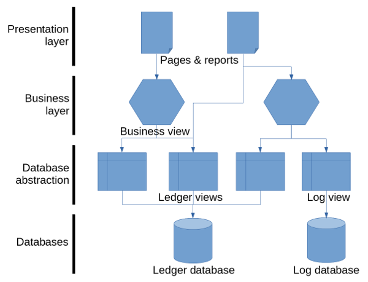
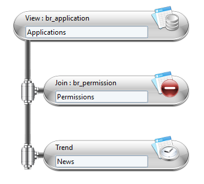
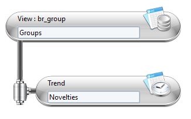
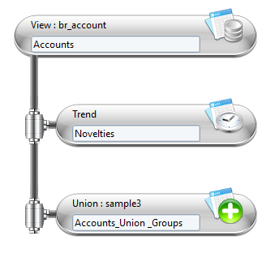

# Main Concepts

When used in a page or a report, a business view is no different than a ledger view or a log view. In other words, the type of view used is irrelevant for pages or reports; as in Pages a dataset can reference a view whatever its type; or in Birt it is possible to select any type of view from the Dataset configuration panel.

A business view, as all views, is identified by a unique ID. All types of views are included in the same identifier namespace. This means that an ID already assigned to a ledger view will not be re-used for a business view or a log view. A business view accepts parameters (String, Number, Boolean and Date) that can be monovalued or multivalued. It will return records with a set of attributes known as the view schema. Business views accept sorting options and are timeslot based.

## Architecture  

A business view is built on another view, usually a ledger view or a log view. But it is also possible for a business view to extend another business view. The following diagram shows the architecture of the different types of view in the product. Ledger views and log views are mapped to a database. It is important to understand that a business view will never submit request to a database directly. Instead, they call a ledger or log view to get records from these databases and then work on the data in memory.  

The best analogy to understand the business views is a pipe. The business view starts with a source component which sends records into the pipe. The source is usually a ledger view reading some records from the database and spilling them into the pipe. Along the pipe, components can be used to alter the records. The execution order of the components in the pipe starts from the source, at the top of the screen, towards the bottom of the pipe. The records exiting the pipe are then sent to the Pages or the Birt reports.  

## Available Components  

There are three different components available:

- Joins
- Unions
- Trends

### Joins  

Joins are used to aggregate the data from the secondary source as a function of the data from the primary source. As it is the case for the primary source, the secondary source can be any type of view (ledger, log or business).  
Joins work the same way as real database joins. The difference being that the join component in the business view can use any combination of columns as a key to match the two sources. The type of join (_e.g._ left, right, inner, full, difference, exclusion) is defined in the parameter tab.  

### Unions  

Unions are used to combine the output of two sources: the primary and the secondary source. As it is the case for Joins any type of view can be implicated in the union.  

### Trends  

The trend component is base on a single source. Trends execute the primary source twice on two different timeslots in order to compare the records.  
Attributes can be added to the outputted results to provide more information on the differences observed between the timeslots, such as added, removed or unchanged.  

## Available Operations

In addition to executing a type of component it is possible to apply post processing to the outputted results. Three types of post-processing are available for each component.

### Filter Attributes  

It is possible to filter the attributes outputted from the business views. If filtered, the record is ignored and will never be outputted from the business view.

### Add Computed Attributes

New attributes can be added to the outputted results. The computed attribute can be dynamically calculated using macros. The expression must then be written between curly brackets, for example `{dataset.attribute.get()}`.  

### Exclude Attributes  

It is possible to remove columns from the output. These columns will be ignored and will never outputted from the business view.  

> A script component is also available if the customer need is not covered by the stock components.

## Aggregate Results of Multiple Business Views  

Building business views on top of other business views is the recommended design pattern to use when dealing with complex use cases.  
For example, the method would be recommended to perform the union of the trends of two ledger views. This need can be expressed with business view using a Y design as shown in the following diagram:  

As a business view is always a single line, or a single pipe, of components. As a result having two main source lines in a single business view is not possible. The solution is to split the processing into two business views:  

- The first computing the trend on the first source
- The second initially computing the trend on the second source and then performing the the union first trend.
The an example of the two business views are shown and described below:

In this example, the first business view reads groups and computes trends. The view ID (not shown here) is sample3.

The second business view reads accounts, computes trends and then merge the results with the first business view using a union. The union calls the sample3 view.  

