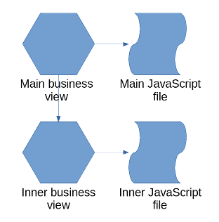
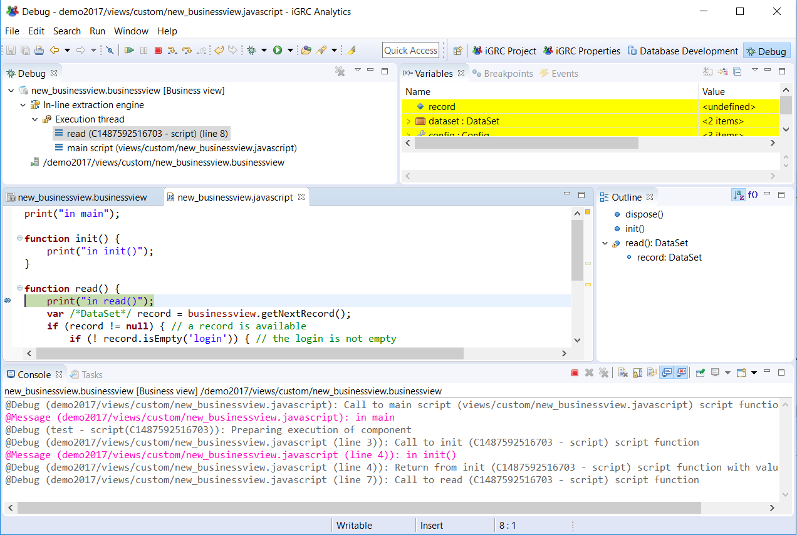
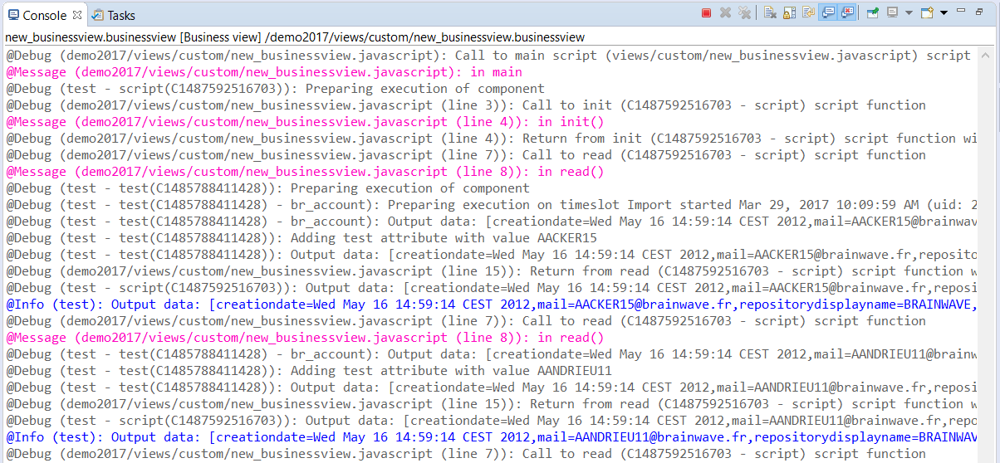

# Debugger

There are two reasons why you would use the debug feature of the business views.  

- to understand what the business view is doing during the execution : the console and logs will help you debug the component parameters.
- to debug a JavaScript component using breakpoints, step/resume and variable inspection.  

## Launch the Debug Mode  

When a JavaScript source or filter is added to the component pipe, it can be helpful to debug the script. The business views offers the possibility to debug the JavaScript execution. In order to do that, the option "Launch in Debug mode" is available in the context menu of the graphical editor.  

When this option is selected, the business view currently edited in memory is executed, meaning that there is no need to save it on disk before starting the debug session.
In a debug session, the execution is suspended when a breakpoint is reached. **In business views, breakpoints can only be set on JavaScript lines, not on components in the graphical editor**.
To set a breakpoint on a JavaScript line, double click on the left side of this line : a blue spot will be added there.  

Breakpoints can also be set on JavaScript lines of an inner business view. The execution will be suspended when the breakpoints are reached in the inner view. The following diagram shows the architectures of 2 business views.

In this example, a main business view is built on top of another view (called inner view in the diagram). It means that the source of the main view uses the inner business view. Both views have a JavaScript file. A breakpoint is set in the inner JavaScript file but the debug session is started on the main business view.  

## The debug perspective  

When a breakpoint is reached, it will be asked to switch to the debug perspective. You should accept to be able to see the variables, the stack and the console. The screen looks like this when the debug perspective is activated:  

In the upper left pane, the stack shows which JavaScript functions have been called. In the upper right pane, the variables are displayed. If the variables have changed since the last suspended state they appear in a yellow background. The content of the variable window is contextual to the selected function in the stack pane. The variables shown are the last known values of the selected stack level.

In debug mode, when the execution is suspended on a breakpoint, you can inspect the variables. The config variable contains the project global variables. The dataset variables contains the business view parameters. You can also execute the script step by step. You can also resume it by clicking on the yellow and green arrow  in the toolbar so that the execution continues until the end or until the next breakpoint is reached.

> Without any JavaScript the debug mode is still useful as the business engine displays every action in the console and writes them in a log file

The console looks like this:

Each blue line is a record getting out of the business view. This is the result of the business view. The purple lines are the messages sent by the print() function in the JavaScript file.  
If the number of output records is too big, then the log file will be easier to search for a specific line.
