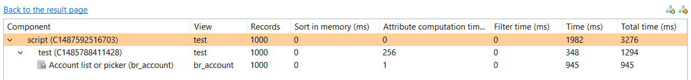

# Optimization

This section addresses performance topics. The business view is a concept that can be used to implement business logic, the use cases ranging from simple to complex. It is important to consider performance when configuring a new business view in order to avoid bad response times.   

A business view works in memory using data queried from the database using ledger or log views. To avoid bad response times it is necessary to:   

- Reduce the query time of the database by optimizing the performance of the ledger view
- Reduce the amount of information processes by the business view

## Optimize Performances for Ledger Views  

It is recommended to filter the results returned by ledger views using static values or input parameters. Indeed, the fewer records returned by the ledger view, the faster the business view will be. Reducing the data input also reduced the memory usage of the business view.  

| **Important**    Do **not** use the generic Brainwave ledger views included in the default project to build a business view. The generic nature of these ledger views results in returning a large number of attributes that are not all necessary for your use case. It is recommended to create a new ledger view designed to return the minimum number of records and attributes. |

As explained, business views always work in memory as opposed to Ledger views which delegates all the work to the underlying database.  
There are many ways to address the same need. As an example lets assume that we need to consolidate the results using many joins, perform a count and some apply some filters. We could :   

- Do everything in the same ledger view
- Create a ledger view without the count and count in a business view calling the Ledger view
- Join the results of several ledger views in a single business
What is the best practice to follow ?  

The best methodology is make the database work as much as possible. The database has some indexes that can speed up the search and is also optimized to perform various sort operations.   

| **Note**    Please remember that it is necessary to refresh or recalculate the indexes after each execution plan, to make the most of their performance benefits.   See [Rebuild the database indexes on SQL Server](how-to/database/sqlserver/rebuild-the-database-indexes-on-sql-server.md) or [Rebuild the database indexes on Oracle Server](how-to/database/oracle/orcl-rebuild-indexes.md) for more information on building indexes.|  

However, if the Ledger view is rich and complex it can generate a complex SQL query. The database is then not able to generate an efficient execution plan resulting in bad response times. In this case, splitting the complex Ledger view into 2 simplified ledger views and joining them in a business view can be a good idea. The sum of the execution times of the three resulting views being smaller than the execution time of the unique complex view.   

How to split a complex view ? There can be two issues in a Ledger view :   

- The criteria

The criteria can slow the request if the column is not indexed in the database. For example a 'like' operation on a custom attribute may require setting a project index. But beware to not add an index for each custom column in the database or it will dramatically slow the execution plan and the activation phase.

- The join   

Performance issues are often a problem of joins between table and the number of record that the database has to read. This can be the case even if the final result returns only 2 records. The joins may generate several millions records in database memory but, after filtering, only 2 records are returned as a result. This kind of request has a bad performance.   

The joins to focus on are joins done through rights. These joins make the database generate many records in memory. Almost all performance issues come from these joins. These joins take several forms :   

- The most obvious is if you have the "right" concept in the view for example : accounts -\> rights -\> permissions or the other way : permissions -\> rights -\> accounts. Same thing with the groups : groups -\> rights -\> permissions and the other way : permissions -\> rights -\> groups
- Beware of all the implicit joins through rights. In this case, the Right concept does not appear in the graphical area. For example : accounts -\> permissions, identities -\> permissions, groups -\> permissions, groups -\> applications and vice-versa.   

The Ledger views which have several joins through rights may be optimized by splitting the Ledger view into two Ledger views, each view having only one join through rights (implicit or explicit) and building a business view on top of both Ledger views. One Ledger view is used as a source in the business view and the other Ledger view is used in a join component.   

## Lower Memory Use  

The business view engine has been optimized to try to keep the least number of records in memory but some components, for performance reasons, keep records in memory. This is the case of a join component. The inner view is read in cache to then match all the records arriving from the source.   

The best practice when using a join between 2 views is to select the view which returns the more records as the source of the view.  
The exception is when you have a right join. In this case, the cache is filled with the view coming from the source and not the secondary source. It means that the source should have fewer records than the secondary source.  

## Sorting  

Sorting is another point to focus on when dealing with performance.  
Ledger views often include a default sort to be able to display results alphabetically in a page or a report. Sorting a Ledger view that will be used by a business view can be useless because the records will be shuffled. Using the previous example, the result of the secondary view of a join component is put into a cache. Sorting this Ledger view makes the database work for nothing.   

The business view also has a panel to configure the sort operations. By default, the business engine will try to use these settings via the database. For example, if the a sort is defined on the 'login' attribute and this attribute comes from the Ledger view of the source, then business engine forces the sort of the Ledger view to sort on the 'login' column and tries to keep the order of the records during the processing.  

The sort in the underlying Ledger view is also useless with the trend component if you want to keep the 'deleted' records from the previous timeslot.   

One last important point to keep in mind is that, even if you do not ask for a sort in the business view, a sort may still apply in the context of a Web page when the user clicks on the column header of a table. The portal then executes again the same business view but forces a sort option. The sort will probably be in memory. If the view outputs a huge number of records because almost no filtering is active, then the sort will be slow and will consume a lot of memory space.   

## Performance Investigation Tool  

In the result tab, a link under the table gives access to the timing statistics as well as the global execution time of the business view. This statistics page displays a tree showing the execution times of each component of the business view:  

The tree begins with the last component of the pipe as configured in the business view as this component delivers the requested records to the page and/or report.   
This last component reads records from the previous component which appears on the second line, and so on ...  
If a component aggregates 2 sources, such as a join which reads records from the previous component but also from the inner view (the secondary source), the this component has two children in the tree : the inner view and the previous component.  

The timing statistics are global, meaning that you will get all the timings even when the time is spent outside of the business view. For example, if a main business view is built on top of another business view, then the timing tree displays the timing of both business views and associated Ledger views if any.   

The columns of the tree split the time into component features. As a result, you can identify how mush time has been spent to sort the records, filter records or add computed attributes. Here is the description of each column :    

- Records : The number of records output by the component.
- Sort in memory (ms) : Indicated the time used to sort the results of the business view in memory. This value should only be filled for the first line of the tree as the sort is performed only once by the last component of the business view (the first displayed in the tree). However, If the business view is built on top of another business view, then another sort time can be displayed on the line corresponding to the last component of this second business view.
- Attribute computation time (ms) : Indicates the time spent to add computed attributes to the records.
- Filter time (ms) : Indicates the time used to evaluate the filtering expression and decide if each record is kept or removed from the output.
- Time (ms) : Indicates the time spent in the component. It includes the specific processing of the component (matching attributes for a join and merging records) and the time spent sorting, filtering and computing attributes. However, the time spent reading an inner view or getting records from the previous component is not part of this time. The formula is : Time = Sort time + Attribute computation time + Filter time + Component specific processing time.
- Total time (ms) : Indicates the cumulative time of this component and the time needed to read inner view or getting records from the previous component. The formula is : Total time = Time + Inner view time + Previous component total time.  
Using the example displayed above the total time for the component test is 1294 which is 348 + 945. The difference of one millisecond due to the fact that the time is measured in nanoseconds and then rounded when displayed in the table.  

| **Note**    &emsp;- The timings are displayed are for a maximum of 1000 output records.    The studio never display more than 1000 line in the result table. To get the actual timing information for the execution of a business view in the portal (returning more than 1000 results) you have the possibility to use a debug option `-Dbusinessviewtimings=true` in the `JAVA_OPTS` of parameters of the portal. Adding this option generates a .csv file in the portal logs folder containing all the sizing and performance information. This option should only be used when investigating business view performance issues.   &emsp;- The background of the lines are colored to highlight the component taking the most time. This is just a hint to help the user to focus on the "heavy" components or inner views.   By studying the timings you can identify if it is the business view or the underlying Ledger view that takes the most time. If it is the underlying Ledger view that takes 99 percent of the time, there is no need to optimize the business view settings. You should then try to optimize the Ledger view by redesign it, splitting it or adding an index.|

## Script Performance  

If the business view includes a Javascript source or a JavaScript filter, it is highly likely that most of the time will be spent in it. It's hard to give general tips for JavaScript but here are some advice to speed things up.  

| **Note**    Some of the following advice given to improve performance may lower the script quality in terms of architecture or maintainability.|

- Avoid using stacks in JavaScript. For example, using a loop and, inside it calling a function to perform the requested the job. By "inlining" the code inside the loop, you avoid loosing time pushing or poping records from the JavaScript stack.
- Use JavaScript global variables to keep intermediate results. The idea is to avoid re-executing multiple times the same processes each time your "read" method is called. It is more efficient to compute them once and store them in global variables so that they are available on the next "read" entry.
- Avoid Java calls as much as possible because calling Java from JavaScript is time-consuming. Try to use JavaScript concept instead of Java. For example, if you want to store a list of values, use an Array instead of a `java.util.List`.
