# Table of contents
{: .no_toc .text-delta }

1. TOC
{:toc}
---

# Introduction to Business Views

Business views are a new concept introduced in the product as of version 2017.

During the project lifecycle, the customer often wants to adapt pages or reports to his specific needs or asks for new reports. The work needed to produce these pages or reports is split into two technical parts :   

- The data query (_i.e._ the view in the Brainwave architecture). This phase is used to configure what data is shown.
- The presentation (_i.e._ the page or report in the Brainwave architecture). This phase is used to configure how data is shown.   

The best practice is to address the filtering and computation phases (what data to show) with views using criteria and computed attributes. Depending on the complexity of the customer need, views may not offer enough features to produce the data expected by the page or the report. In such cases, part of the filtering or computation must be done in the pages or in the reports. Both the Pages language and Birt support a type of dataset to make application joins (compared to database joins) or trends. Typically, this kind of dataset is an application logic which could be called business logic.   

Integrating business logic into the reports or the pages has some drawbacks. If both a page and a report are needed to display the same data, two implementations have to be done because reports and Pages offer incompatible tools to do the same thing.   

As a result, a new concept has been introduced to handle these use cases and keep the Pages and reports as simple as possible without application logic but only presentation. This new concept has been called **business views**.   

To differentiate the various types of views we will name the normal views **ledger views**.

- Ledger views are used to send queries to the database. In these views almost everything is handled by the database itself (joins, filtering, aggregations, sort,...)
- Business views are used to consolidate data, compute trends,.. in memory. This implementation detail is very important and will be covered in the optimization chapter.

| **Note** <br><br> A Business view can be based on a Ledger view, a log view or another Business view indifferently.|

Before dealing with the usage and configuration details of business views, let's review the typical use cases where they come in handy.

## Multiple counts  

Multiple counts can not be returned by a ledger view. For example if we want to get a list of identities and, for each one, get the number of accounts, the number of groups, the number of applications, the number of organizations,... A ledger view can only return one count.  
Business views can be used to call several ledger views, each one returning a counter (number of accounts, number of groups, ...). The business view joins the data queried from the database using ledger views on the application level. The output is a list of identities with several counters.

## Handling Duplicate entries  

Depending of the joins used in ledger views entries can be duplicated. For example, the list of identities with their organizations can generate several lines if an identity works in two different organizations.    
If the customer wants one and only one line for each identity and wants to display a list of organization in a column (organization codes separated by coma), then a business view can be used to consolidate the duplicated lines and build a string of the multiple organization codes.

## Trends  

Trends are another hot topic not covered by ledger views. It is possible to get trends using the Pages language but now business views bring this feature to both the Pages and the reports.   
Business views provide a way to compute several trends and add attributes to be used in the presentation layer.

## Timeslot comparisons  

Producing comparisons between timeslots is quite difficult to do when using ledger views. A typical example would be to list the accounts that have been granted access to a specific folder on a remote share and for each account display if it is new or if it has been deleted in the last timeslot.  
With Business views this is just a matter of specifying 2 timeslots. The view adds a new attribute containing the status for each account to know if it has been added, deleted or if it exists in both timeslots.

## Negative rights  

The only method to handle negative rights is to use application logic along with exclusions. Business views offer an exclusion feature so that you can compute positive rights (using a ledger view) and remove negative rights (read from another ledger view).

## Highlight changes  

Another example is to display a list of accounts with some attributes and show in bold the attribute values that has changed since the previous timeslot. Ledger views cannot automatically add flags for each attribute to know if it has changed. Using business views it is just a comparison of 2 timeslots of the same ledger view associated to computed attributes.   

| **Note** <br><br> All these examples show that business views use the output of the Ledger views to transform data or compute new information.|   

A number of features have been integrated in the business views but there is no limit to the number of use cases that can be addressed. When a feature is not available in the business views, you can still expand the business views with Javascript.

# Main Concepts


When used in a page or a report, a business view is no different than a ledger view or a log view. In other words, the type of view used is irrelevant for pages or reports; as in Pages a dataset can reference a view whatever its type; or in Birt it is possible to select any type of view from the Dataset configuration panel.   

A business view, as all views, is identified by a unique ID. All types of views are included in the same identifier namespace. This means that an ID already assigned to a ledger view will not be re-used for a business view or a log view. A business view accepts parameters (String, Number, Boolean and Date) that can be monovalued or multivalued. It will return records with a set of attributes known as the view schema. Business views accept sorting options and are timeslot based.   

## Architecture  

A business view is built on another view, usually a ledger view or a log view. But it is also possible for a business view to extend another business view. The following diagram shows the architecture of the different types of view in the product. Ledger views and log views are mapped to a database. It is important to understand that a business view will never submit request to a database directly. Instead, they call a ledger or log view to get records from these databases and then work on the data in memory.  


The best analogy to understand the business views is a pipe. The business view starts with a source component which sends records into the pipe. The source is usually a ledger view reading some records from the database and spilling them into the pipe. Along the pipe, components can be used to alter the records. The execution order of the components in the pipe starts from the source, at the top of the screen, towards the bottom of the pipe. The records exiting the pipe are then sent to the Pages or the Birt reports.  


## Available Components  

There are three different components available:   

- Joins
- Unions
- Trends

### Joins  

Joins are used to aggregate the data from the secondary source as a function of the data from the primary source. As it is the case for the primary source, the secondary source can be any type of view (ledger, log or business).  
Joins work the same way as real database joins. The difference being that the join component in the business view can use any combination of columns as a key to match the two sources. The type of join (_e.g._ left, right, inner, full, difference, exclusion) is defined in the parameter tab.  

### Unions  

Unions are used to combine the output of two sources: the primary and the secondary source. As it is the case for Joins any type of view can be implicated in the union.  

### Trends  

The trend component is base on a single source. Trends execute the primary source twice on two different timeslots in order to compare the records.  
Attributes can be added to the outputted results to provide more information on the differences observed between the timeslots, such as added, removed or unchanged.  

## Available Operations

In addition to executing a type of component it is possible to apply post processing to the outputted results. Three types of post-processing are available for each component.

### Filter Attributes  

It is possible to filter the attributes outputted from the business views. If filtered, the record is ignored and will never be outputted from the business view.

### Add Computed Attributes

New attributes can be added to the outputted results. The computed attribute can be dynamically calculated using macros. The expression must then be written between curly brackets, for example `{dataset.attrbut.get()}`.  

### Exclude Attributes  

It is possible to remove columns from the output. These columns will be ignored and will never outputted from the business view.  

| **Note** <br><br> A script component is also available if the customer need is not covered by the stock components.|   

## Aggregate Results of Multiple Business Views  

Building business views on top of other business views is the recommended design pattern to use when dealing with complex use cases.  
For example, the method would be recommended to perform the union of the trends of two ledger views. This need can be expressed with business view using a Y design as shown in the following diagram:  

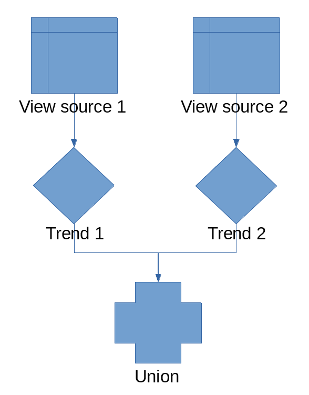

As a business view is always a single line, or a single pipe, of components. As a result having two main source lines in a single business view is not possible. The solution is to split the processing into two business views:  

- The first computing the trend on the first source
- The second initially computing the trend on the second source and then performing the the union first trend.
The an example of the two business views are shown and described below:   

In this example, the first business view reads groups and computes trends. The view ID (not shown here) is sample3.   


The second business view reads accounts, computes trends and then merge the results with the first business view using a union. The union calls the sample3 view.  


# Business View Editor
## Create a Business View

To create a business view you can either :   

- In the audit menu, click on `New...` and select `Business view`.
- In the Project explorer right click on the `\view` folder or any sub-folder and select `New > Business view`  
These actions open a wizard where you must configure the name of the business view before clicking `Next >` .  

| **Note** <br><br> Once created all business views and associated JavaScript files must be located in the `\views` folder or under any sub-folders.|

This opens a new panel where you have to choose the kind of source to use. It can be :  

- A view source
- A script source   

It is always necessary to attach a JavaScript file to your business view. A business view that uses a view source may contain a script component which needs a JavaScript file to store the functions called by the component. The best practice is to have the two files, `.businessview` file and it's associated `.javascript` file in the same folder. Of course, in the context of a project, several business views may share the same JavaScript file.  


## Use the Business View Editor

To describe the business view editor, we are going to create a business view based on a ledger view.  

In the creation wizard, select any ledger view in the view field and click on `Finish`. In the example below the business view is based on the ledger view `br_application`.  

The business view editor is built the same way as the other graphical editors in the product (see [here]({{site.baseurl}}) for more graphical editor descriptions). The editor contains the graphical part in the middle, the palette containing all the available components on the right and the Properties window at the bottom of the studio (see caption below).  

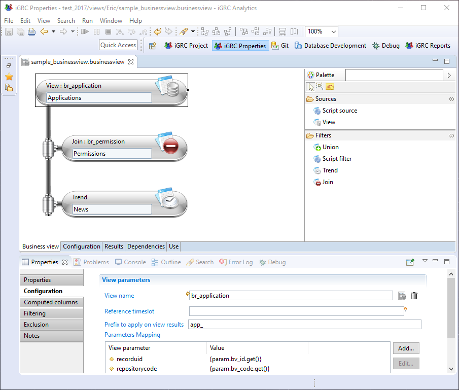

The business view always contains a source component, located at the top. This is the only component displayed when the view has just been created. The palette on the right is not contextual to the selection in the graphical area. The palette always shows all available components.    

To add a component to the pipe, first, select the component just before the insertion point. Then drag & drop a component from the palette. The component will be inserted after the selected component.    

| **Note** <br><br> Cut, Copy & paste operations are available but when you cut a component, all the following components are also cut.|

The configuration of a component is done in the Properties tab displayed on the bottom of the graphical editor. Clicking on the background of the graphical area will display the schema of the view in the Properties tab (see caption below). The schema of the view represents the list of attributes available for the report or the page once the view is executed.  
Additional important information such as the component in which the attribute has been defined or, if the attribute comes from a ledger view, the name of the view and the meaning of the attribute.  

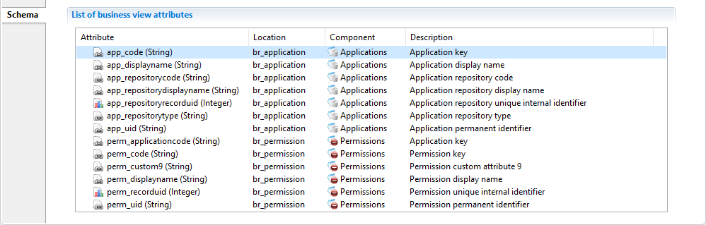

When a component is selected, the Properties tab will displays a set of sub-tabs that depend on the component type. Some of these sub-tabs are common to all components :    

- Filtering: that is used to filter records based on a JavaScript expression
- Computed columns: that is used to configure the attributes to be added from the output records
- Exclusion: that is used to configure the attributes to be removed from the output records
- Notes: that is used to add annotations on the configuration of the component if necessary.  
All the tabs of the Properties window for each components are reviewed in the next chapters.  

When the design is finished, the results of the business view are available in the "Results" Tab. This screen looks like the "Results" tab of a Ledger view. The table displays the columns corresponding to the view schema. You can select another timeslot at the top of the screen.   

| **Note** <br><br> If the layout of the columns in the result table is change; such as the column width and/or order, this layout is preserved until the editor is closed.|

# Common Features

## Global Configuration of Business Views  

The global configuration of a business view is located in the "Configuration" panel of the business view editor. This is where it is possible to configure global information, business view input parameters and sorting operations.


### Global Information  

In this section you can:

- Edit the business view unique identifier  
- Edit the business view displayname
- Choose the `.javascript` file that can be used by a JavaScript filter and/or a JavaScript source component
- Add a description

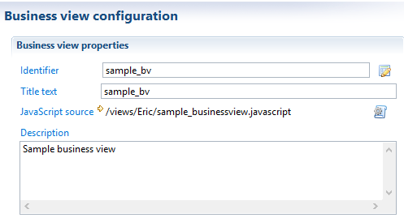

### Global Parameters  

The business view accepts input parameters used, for example, to filter output records. This is particularly useful when the business view is used in reports or pages: it adds context to the results of the business view by supplying parameters directly from the reports and/or pages.

View parameters are defined in the Configuration panel of the business view editor.


It is possible to use an expression in the default value: internal parameters can be computed based on input parameters.   
As an example, let's say that in our Ledger, all application codes are stored in upper case. If the input parameter is the application code, it is possible to declare a second parameter which convert the application code to upper case. This second parameters will be useful to filter records in this particular case.  

### Multivalued parameters

When handling multivalued parameters in a businessview be careful to the way you map them in macro. In the following example we have a simple BV containing a view source component that calls a ledger view listing permissions by application. The ledger view has a global parameter mapped on application code attribute to fillter results.  

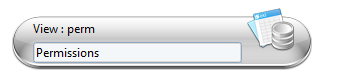
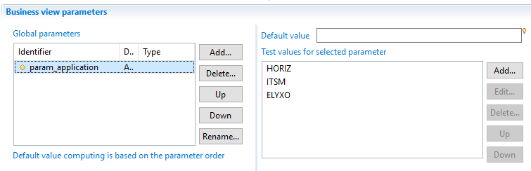   


We will illustrate three cases:   

**<u>Case1:</u>**: By default if you map the param\_application businessview global parameter on ledger view parameter using {param.param\_application.get()} as bellow, only the first value of the list will be mapped - in that case it will be 'HORIZ'.

   

**<u>Case2:</u>**: To map all values to the ledger view parameter you have to use {param.param\_application} without calling .get() method because by default .get() returns the first element if the attribute is a multivalued.


**<u>Case3:</u>**: To map a specific index value from the list of multivalued parameter you need to specify the index when calling .get() method ex: {param.param\_application.get(2)} in that case it will return the last value 'ELYXO'.


### Sort  

In this section, it is possible to configure a sort policy that will apply on your business view results. Up to five sorting criteria, which will be applied sequentially, are available, : 'Sort 2' enables a sub-sort to be carried out on lines for which 'Sort 1' returns the same value, etc. It is possible to choose the sort direction for each attribute. This order is applicable whatever the type of attribute (String, Number, Boolean, or Date).  


<u>Optimizations</u>:

- The sort in business view is handle in memory, unlike the ledger view and log view where the sort is executed by the database.
- The sort policy will be carried out only after all components have finished data fetching (the entire results will be stored in memory).
- It it highly recommended to be careful when requiring sorting on huge data.

| **Warning** <br><br> Even if the sort is not activate in the business view, the sort may be requested from the page when the user click on a column header of a table. In this case, the page re-executes the business view with a sort on this column and the sort is executed in memory.|

## Common Operators   

All available components in the business view editor implement some common operations:

- filtering  
- add computed attributes  
- exclude attributes from schema  

### Filters  

The filter policy allows to include, exclude or deduplicate data results returned by any component of a Business View.

A list of filters to be applied on all dataset resulting from the component can be specified, and several conditions can be combined. Filters are executed in the declaration order. If there are several filters, an AND operator is applied to ignore - or not - result lines.

The resulting dataset is validated (not excluded) only if all filters are valid:

- all include filters must return true,  
- all exclude filters must return false,  
- the dataset is not a duplicate according to the calculated key.


Three types of filters are available in business view components:

#### Include

Include filter is based on a JavaScript expression, if the expression returns false then the dataset will be ignored without evaluating remaining filters.

#### Exclude

Exclude filter is based on a JavaScript expression, if the expression returns true then the dataset will be ignored without evaluating remaining filters.

#### Deduplicate

Deduplicate filter is also based on a JavaScript expression: all the datasets that generate the same expression value are ignored except the first one.

| **Warning** <br><br> As the deduplicate filter uses a memory cache containing the values of calculated expression, please beware when using several deduplicate filters. This can result in very high memory usage (RAM).|

Below is an example using several filters (before and after filtering):


### Computed Columns

It is possible to define columns with a dynamically computed value based on the values of other columns in the Dataset.  
This is particularly useful when the user wishes to carry out pre-processing on data for layout or analysis in a report.  
Computed columns are added via the "Computed columns" properties tab of the Business View editor:


The dataset object provides access to current columns.   
When adding a computed column definition, the following window is opened. In this windows the computed column can be configured:


The computed columns are then added to the displayed results:


| **Note** <br><br> It should be noted that the script is executed on each result line in the component to calculate the column value and therefore it is helpful to prepare scripts that take into account possible NULL values for columns by the `dataset.isEmpty('columnname')` expression.|

### Exclude Attributes from Output Schema

The exclude operation filters the schema of each component result by selecting a list of attributes that will be removed from resulting datasets. This functionality is useful when several attributes are used, for example, in computed columns, filtering, ... and the users does not want to get them in the final result.


Below is an example of business view results before and after Exclusion:  


_Business View result before adding attributes to exclude list_  


_Business View result after adding two attributes (app\_displayname, repo\_code) to exclude list_  

# Components

## Common Operations

For more information on the common operators implemented in all components, please refer the the following documentation: [Common operators]({{site.baseurl}})

## Source Components

The source component provides the initial data to the other filter components. It is always placed in top of the business view. Only one source component is allowed per business view. There are two types of source component.

- View source (ledger, log or business)
- JavaScript source

### View

#### Objective

The initial data provided to the source component is based on data queried by another view. All typesof views are allowed

- Ledger views
- Log views
- Business views


#### Specific Configuration


1. It is mandatory to select a view from the view picker, any of type of view is allowed (Ledger view, log view or business view)
2. If the _`"Reference timeslot"`_ is empty the component will automatically execute the view in the same timeslot as the Business View, it is possible to overload the timeslot by providing a timeslot uid or a relative value according to the timeslot of the Business View , for example if the Business View is executed in the previous timeslot(current - 1), and the _`"Reference timeslot"`_ contain the value _`"``-1``"`_, then the source view component executes the view in the timeslot(current - 2)
3. A prefix can be specified. The prefix will be added to all the attributes of the view  
4. In this section you can configure parameters that will be given to the view.

#### Examples

In the flowing example we will show a sample business View that contain only a view source component, it will be based on _br\_application_ (standard brainwave view)

Here is the definition of the "_br\_application_" ledger view:

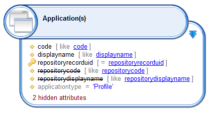

The image below show the result of "_br\_application"_ executed on the timeslot named _"demo2":_  


The business viewdefinition contains only one component (view source component)  


Illustration of the configuration:

- In this example no reference timeslot is provided, it means that the timeslot given to the business view will be used (demo2)
- A prefix "app\_" is configured to apply on results
- No parameters given to "_br\_application_"
- "Computed columns, Filtering and Exclusion" sections are left empty  


Business View execution results :  


We can observe that the two results (br\_applications, sample BusinessView) are the same, because no filter if configured, the source view component has executed "br\_application" on "demo2" timeslot, the only difference is the prefix, in the Business View  results we can see that all columns name are prefixed by "app\_".

### Script

#### Objective

The script source is used to generate records or read records from a source other than the Ledger database or the Log database. For example, a script source may connect to a WebService, read a file or generate static datasets.  

#### Specific Configuration

Through the creation wizard, a JavaScript file is attached to the business view file. All the components using scripts will share this file. Like any other script component in the product, the script is event driven. There are 3 events corresponding to the state of the business view engine :  

| Event | Comment |  
| init | the init event is triggered when the script source should initialize itself. It is called when the <br> business engine is initializing. This event should be used to allocate resources or prepare data <br> before the execution of the business view starts|  
| read | the read event is triggered each time the business engine requests the <br> next record from the source. This event will be called repeatedly until the script returns null meaning "no more record available"|
| dispose | the dispose event is triggered when the script should free resources allocated during the init <br> or the read events.|

The script component parameters are the name of the function found in the JavaScript file for each event. The following snapshot shows the corresponding Properties tab :  


Clicking on the link of one of the event name lets you enter a function name. The body of the function is then added at the end of the JavaScript file.   
Clicking on the yellow arrow located at the upper left of the field jumps to the function declaration in the JavaScript file.   
Clicking on the light bulb located at the upper right of the field lets you choose an already declared function in the JavaScript file.  

When using JavaScript it is highly recommended to fill out the Attribute tab. This tab is used to provide information concerning the schema, _i.e._ the attributes generated by JavaScript, to the business view engine (see caption below). When configuring or using a report or a page it is necessary to access the list of attributes returned by the business view. When using JavaScript it is necessary to declare the generated attributes as the product is not capable of automatically generating them:  


As in other modules of the product it is possible to directly call a Java library. To use classes from a third-party jar, the jar file(s) should be placed in the folder `/library/jars` of the project. The full package path must also be declared in the code when allocating object. For example :    
`var /*String*/ myObject = new com.acme.coffeeproject.PrepareCoffee();`

In the script you have access to a predefined global object called `dataset`. This contains all the input parameters for the business view. If a parameter contains an expression   
(_e.g._`{config.myVar.toUpperCase()}`), the value is already resolved and ready to use in the `dataset` object.  

#### Examples

In this example, a CSV file is opened and each line is returned as a record:  

```javascript  
var /*FileParser*/ csvParser = null;
var /*Array*/ header = null;

function init() {
    // create a CSV parser
    csvParser = businessview.getFileParser("CSV");
    csvParser.separator = ';';
    csvParser.textseparator = '"';
    csvParser.encoding = 'UTF-8';
    // read file specified in the business view input parameter csvFileName
    csvParser.open(dataset.csvFileName.get());
    // read header
    header = csvParser.readHeader();
}

function read() {
    var /*Array*/ line = csvParser.readLine();
    // check if no more record from CSV
    if (line == null) {
        return null;
    }
    // convert the CSV record into a DataSet
    var /*DataSet*/ record = new DataSet();
    for (var i = 0; i < line.length; i++) {
        var /*String*/ attrName = header[i];
        var /*String*/ attrValue = line[i];
        // all values are String except the 'logincount' column
        var /*String*/ type = (attrName == 'logincount') ? 'Number' : 'String';
        var /*Attribute<String>*/ attribute = record.add(attrName, type, false);
        attribute.set(attrValue);
    }
    return record;
}

function dispose() {
    // close the parser if it exist
    if (csvParser != null) {
        csvParser.close();
    }
}
```

The init function creates a CSV file parser on a file given as an input parameter of the business view. The header is read once.   

The read function reads the next CSV line and return null if no more record is available in the file. Otherwise, all the values of the line are copied into a DataSet which is returned to the business view engine.    

The dispose function closes the file. Note that even if an error occurs in the read function, the dispose function is called to allow freeing resources.  

> More information on the [file parser function]({{site.baseurl}})  

## Filter Components

Filters are components that receive records from a parent component (maybe a source) in the pipe, transform them or filter them and then send the resulting records to the next component in the pipe. Building a business view is just a matter of selecting and ordering the operations to apply to records coming from the source.  

### Union

#### Objective

The union component performs an union operation between records coming from a principal view those coming from a secondary view. The two views are configured in the union component sub-tab.

#### Specific Configuration


1. A string value to distinguish records coming from parent component (the pipe).
2. A string value to distinguish records coming from the configured view in the union component.
3. Name of the new column that will hold the discriminant value.

Both discriminators accept expressions so you can build a key composed of several columns from the current record.  

It is mandatory to configure a view in the union component to perform the union operation.   
Please refer to the help of view source component for [how to configure the view]({{site.baseurl}})    


#### Examples

In this example, we are going to build a table that lists the group movements for a given ActiveDirectory domain: added groups and deleted groups.

- A string value ' **+**' is added at the beginning of the line for each group added
- A string ' **-**' is added at the beginning of the line for each deleted group

**<u>Definition:</u>**   

The business view will perform union between two ledger views as illustrated in the caption bellow    

- The new\_group ledger view lists the new groups (importaction = 'C')
- The deleted\_groups ledger view lists the deleted groups (deleteaction = '1')   

The database contain only two timeslots:  

- The current timeslot display-name is: "current"
- The previous timeslot display-name is: "history" (history = current - 1)


**<u>Configuration:</u>**

Configuration of the source view component (new\_groups\_component)


Configuration of the Union component (removed\_groups\_component)  


Configuration of the view in the union component (removed\_groups\_component)   
The deleted\_groups ledger view will be executed in BusinessView\_timeslot - 1.  


**<u>Results:</u>**   

Results of a separate execution of "new\_groups" ledger view on "current" timeslot:  


Result of a separate execution of "deleted\_groups" ledger view on "history" timeslot (mean that groups will be deleted in next timeslot ("current"):  


Results of the business view execution on "current" timeslot:   


### Join

#### Objective

The Join filter is used to link records from two different data source, the first data source is the parent component in the business view (pipe) and the second is the view set in join configuration.   

The join types implemented in the component are (see caption below):    

- Left
- Right
- Inner
- Full
- Difference
- Exclusion

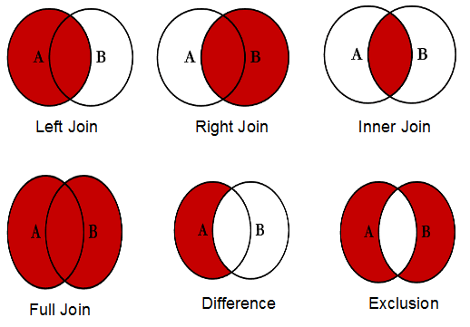

#### Specific Configuration

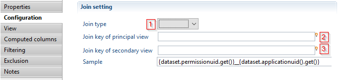

1. joint type that will be performed. It can be: Left, Right, Inner, Full, Difference or Exclusion.  
2. An expression that will be calculated for records coming from parent component (pipe) to match with the "Join key of secondary view" expression.
3. An expression that will be calculated for records coming from the view in join configuration to match with the "Join key of principal view" expression.   

Both keys accept expressions so you can build a key composed of several columns from the current record.   

It is mandatory to configure a view in the join component to perform the join operation.   
Please refer to the help of view source component for [how to configure the view]({{site.baseurl}})     


#### Examples

This example will illustrate how to perform multi-counts.   
The concept is to list all applications and for each application display the associated number of permissions and accounts.

**<u>Definition:</u>**


**<u>Configuration:</u>**

It is necessary to Configure a join between data from the `permissions` component (the _permissions\_count_ ledger view) and the results of `accounts_count` ledger view.   

The join is based on:

- The attribute `app_code` attribute of `permissions_count` ledger view
- The attribute `app_code`attribute of `acounts_count` ledger view

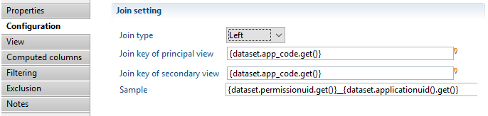

**<u>Result:</u>**   

Results of a separate execution of `permissions_count` ledger view on current timeslot.  


Results of a separate execution of `accounts_count` ledger view on current timeslot:    


Results of Business View execution on current timeslot


**<u>Reducing the memory usage:</u>**   

- The join filter (Left, Inner, Full, Difference or Exclusion) stores the data from secondary component in a memory cache, it is highly recommended to perform the necessary filtering in ledger view (_i.e._ performed by the database) before performing the join operation in the business view
- The join filter (Right) stores the data from the primary component in a memory cache, it is highly recommended to perform necessary filtering in ledger view (_i.e._ performed by the database) before performing the join operation in the business view

| **Important** <br><br> It is **not** recommended to use a generic Brainwave view, delivered with the default project when you require a limited number of attributs as input. These views return a large number of attributes that will be stored in a memory cache and greatly increase the memory usage, impacting performance.|

### Trend

#### Objective

The trend filter allows the calculation of trends and/or differences by re-executing the same view in an other timeslot and comparing the results according to a join key and a comparison column.

#### Specific Configuration


1. The timeslot used as a baseline to compare results. Is can either be calculated relatively based on the business view timeslot,or using the uid.  
2. An expression used to match lines that must be compared.  
3. The column name in the source component of the data used to calculate trend. This parameter is to be set only if the a numerical calculation is needed in the configuration of the trend.
4. In the case of trend calculation, this parameter provides the name for the output column containing the numerical result of the trend calculation. That is the reference value substracted by the current value.This parameter is to be set only if the a numerical calculation is needed in the configuration of the trend. If the resulting output is non-numeric the returned result is then `null`.
5. In the case of trend calculation, this parameter provides the name for the output column containing the reference timeslot (see point 1.) value used for the comparison.
6. Name for the outputted column containing the trend status, can be (New, Identical, Modified, Removed, Invalid)  
7. Name for the outputted column containing the timeslot uid from where the data originated. This column is used to identify the origin of result lines.
8. If checked, new entries are excluded from component output.
9. If checked, unchanged or identical entries are excluded from component output.
10. If checked, removed entries will not appear in component output.

#### Examples

The aim is to list all applications present in the ledger and for each application:   

- Show the status of the application if it is New, Modified (according to number of permissions), identical or Deleted comparing with previous timeslot
- Show number of permissions in current timeslot , previous timeslot, and the difference(current - previous)
- Show the timeslot of the line result

**<u>BusinessView definition</u>**


Configuration:


**<u>Results:</u>**   

Result of `list_application` ledger view execution on current timeslot:  


Result of `list_application` ledger view execution on previous timeslot:    


Result of BusinessView execution (trend operation):  


**<u>Reducing the memory usage</u>**   

- The trend filter stores all the results of one of the two views a memory cache, it is highly recommended to perform necessary filtering in ledger view before performing the trend operation in the business view

| **Important** <br><br> It is **not** recommended to use ageneric Brainwave view, delivered with the default project when you require a limited number of attributs as input. These views return a large number of attributes that will be stored in a memory cache and greatly increase the memory usage, impacting performance.|

### Script

#### Objective

When the predefined components offered in the business view are not enough to implement the desired business logic, then it is time to add a script filter. The Script filter will read all records as well as add the possibility to filter them or alter their contents.  

#### Specific Configuration

The configuration of a Script filter is the same as the script source. The 3 events (init, read and dispose) are mapped to 3 JavaScript functions. Please see the event table in the Script source section for a detailed description of each event.   
The only difference between a source and a filter is that the filter must receive all the records from a source instead of generating them. The difference is in the function read where an API is offered to get the next record from the source.   
A predefined global object called `businessview` is available in the script. The most important method in the `businessview` object is `getNextRecord()`.    

The following example shows a filter that reads records from the source and feeds them to the next component. This filter does nothing but shows the minimum architecture of the Script filter.  

```javascript  
function init() {
}

function read() {
    var /*DataSet*/ record = businessview.getNextRecord();
    return record;
}

function dispose() {
}
```

The function `read()` calls the `getNextRecord()` method to get a record from the previous component (maybe a source). As in the Script source, the `read()` method of the Script filter is called repeatedly until it returns `null`.    
In this example, the record from the source is returned directly without modifying it. If the source has no more records, the `getNextRecord()` method returns `null` and the `read()` function also returns `null`.  

When there are several scripts in a single business view (for example 2 Script filters or a Script source and a Script filter), then it is important to understand the life cycle of variables and how and when the two scripts are executed.  
To explain the script life cycle, let's take an example with a Script source and a Script filter. The functions of both components are located in the same JavaScript file which is shown here.  

```javascript  
var /*FileParser*/ csvParser = null;
var /*Array*/ header = null;
var /*Number*/ recordNumber = 0;

function sourceInit() {
    // create a CSV parser
    csvParser = businessview.getFileParser("CSV");
    csvParser.separator = ';';
    csvParser.textseparator = '"';
    csvParser.encoding = 'UTF-8';
    // read file specified in the business view input parameter csvFileName
    csvParser.open(dataset.csvFileName.get());
    // read header
    header = csvParser.readHeader();
}

function sourceRead() {
    var /*Array*/ line = csvParser.readLine();
    // check if no more record from CSV
    if (line == null) {
        return null;
    }
    // convert the CSV record into a DataSet
    var /*DataSet*/ record = new DataSet();
    for (var i = 0; i < line.length; i++) {
        var /*String*/ attrName = header[i];
        var /*String*/ attrValue = line[i];
        // all values are String except the 'logincount' column
        var /*String*/ type = (attrName == 'logincount') ? 'Number' : 'String';
        var /*Attribute<String>*/ attribute = record.add(attrName, type, false);
        attribute.set(attrValue);
    }
    return record;
}

function sourceDispose() {
    // close the parser if it exist
    if (csvParser != null) {
        csvParser.close();
    }
}

function filterInit() {
}

function filterRead() {
    var /*DataSet*/ record = businessview.getNextRecord();
    // check if a record is available
    if (record != null) {
        // increment the number of records and add the number into the dataset
        recordNumber++;
        record.num = recordNumber;
    }
    return record;
}

function filterDispose() {
}
```

> More information on the [file parser function]({{site.baseurl}})  

When the business view execution starts, the script is run. It means that all instructions or declarations outside functions are executed. In the above example, the 3 variables are initialised (csvParser, header, recordNumber). This execution is only executed once even if there are several Script components. What is important to know is that the global context of the JavaScript will be shared among all the components. As such, global variables may be used to share data between the different Script components.   

Then, the business view engine calls the `init()` function of each component in the reverse order in the graphical editor. The `init()` function of the last component is called first and the `init()` function of the source is called last. If any `init()` function generates an error (an exception), then the execution is stopped, the other `init()` function will not be called but the `dispose()` function will still be called.     

After that, the business view engine calls the `read()` function of the last component in the graphical editor. In the above example, the `filterRead()` function is called. The script gets the next available record from the source by calling the `businessview.getNextRecord()` method, Inside this call (we are still in the `filterRead()` function), the source is called and the `sourceRead()` function is executed which creates a record from a CSV file. It returns a record which is returned by the `businessview.getNextRecord()` method in the `filterRead()` function. A count number is added and then the record is returned to the business view engine.     
When `null` is returned by the last component`, filterRead()` function, the business view engine understands that there is no records available. The `dispose()` methods of each component is then called to free resources.   

The `businessview` global object contains other methods that can be helpful  

| name | description |
| executeRule | Execute a rule in the ledger on a specified timeslot |
| executeView | Execute a view in the ledger on a specified timeslot |
| getFileParser | Instantiate a new file parser for CSV,LDIF,XML or text with fixed column width|

As in the Script source, the `dataset` contains the list of input parameters of the business view. The Attributes tab must also be filled with the attributes added by the `read()` function in each record.  

#### Example 1: Aggregate

This code is an example of how to aggregate results using a key. In this example, the source uses a view returning identities along with their organization codes. If an identity belongs to 2 organizations, the result contains 2 lines for the same identity. The goal of this script is to return only one line per identity but change the `orgcode` attribute to list the organizations separated by a coma.  

```javascript  
var /*String*/ lastKey = null;
var /*DataSet*/ lastRecord = null;
var /*Array*/ orgList = new Array();
var /*boolean*/ noMoreRecord = false;

function init() {
}

function /*String*/ convertOrgListToString() {
    var /*String*/ fullList = '';
    for (var i = 0; i < orgList.length; i++) {
        if (i > 0) {
            fullList = fullList + ', ';
        }
        fullList = fullList + orgList[i];
    }
    orgList = new Array();
    return fullList;
}

function read() {
    // check if the source has no more record
    if (noMoreRecord) {
        return null;
    }
    else if (lastRecord == null) {
        // this is the first time a record is read to initiate the buffering
        lastRecord = businessview.getNextRecord();
        if (lastRecord == null) {
            noMoreRecord = true;
            return null;
        }
        lastKey = lastRecord.surname.get() + '$' + lastRecord.givenname.get() + '$' + lastRecord.hrcode.get();
        if (! lastRecord.isEmpty('orgcode')) {
            orgList[orgList.length] = lastRecord.orgcode.get();
        }
    }
    // read all the records with the same key
    record = businessview.getNextRecord();
    while (record != null) {
        // check the identity key
        var /*String*/ key = record.surname.get() + '$' + record.givenname.get() + '$' + record.hrcode.get();
        if (lastKey == key) {
            // keep the org code in the list
            if (! lastRecord.isEmpty('orgcode')) {
                orgList[orgList.length] = record.orgcode.get();
            }
        }
        else {
            // keep this new identity in the buffer
            var /*DataSet*/ previousRecord = lastRecord;
            lastRecord = record;
            lastKey = key;
            // the last buffered record is then returned with the org list
            previousRecord.orgcode = convertOrgListToString();
            if (! lastRecord.isEmpty('orgcode')) {
                orgList[orgList.length] = record.orgcode.get();
            }
            return previousRecord;
        }
        record = businessview.getNextRecord();
    }
    noMoreRecord = true;
    var /*DataSet*/ record = lastRecord;
    // the last buffered record is then returned with the org list
    if (lastRecord != null) {
        lastRecord = null;
        record.orgcode = convertOrgListToString();
    }
    return record;
}

function dispose() {
}
```

This example expects that the Ledger view is sorted using the same criteria as the ones used in the key in the code:  

1. surname,  
2. givenname,  
3. hrcode  

The algorithm uses a buffer for the last record seen. The `read()` function repeatedly gets records from the source and if this is the same identity as the previous identity, it stores the `orgcode`. When the identity is different, the previous identity is returned with the list of organizations and the last read identity is stored in the buffer.  

#### Example 2: Enumerate

The following code enumerates values in a field. It is similar to the Enumerate filter in the collect.   

For example, with the following input data:  

| **column1** | **column2** |
|  a | 1,2,3 |
|  b | 4,5 |

the script will produce this result:   

| **column1** | **column2** |
|  a | 1 |
|  a | 2 |
|  a | 3 |
|  b | 4 |
|  b | 5 |

To use this code, create a new script filter and link the onScriptRead field to the onEnumRead fonction.   
Then, set the variable "ATTR\_NAME" to specify the attribute name to enumerate, and set the "SEPARATOR" variable to specify the values separator.  

```javascript  
// name of the attribute to enumerate
var /*String*/ ATTR_NAME = "column2";

// separator of values in the attribute
var /*String*/ SEPARATOR = ",";


var /*Array*/ values = null;
var /*DataSet*/ dataSet = null

function onEnumRead() {
    if (values == null || values.length == 0) {
        // get a new dataSet
        dataSet = businessview.getNextRecord();
        if (dataSet == null) {
            // no data
            return null;
        }

        // read an split the attribute to enumerate
        var /*Attribute*/ attr = dataSet.get(ATTR_NAME);
        if (attr != null && ! dataSet.isEmpty(ATTR_NAME)) {
            values = attr.getAsString().split(SEPARATOR);
        }
    }

    if (values != null && values.length > 0) {
        // add next value to the dataset
        attr = dataSet.get(ATTR_NAME);
        var /*String*/ value = values.shift();
        attr.set(0, value);
    }

    return dataSet;
}
```

#### Example 3:

In this example, the script filter gets all values in an attribute for all records and produce one record by unique value.   

For example, this input data:    

| **column1** |
| a,b,c |
| d,a,e |
| c,b,f |
| e,c,c |

will produce this result:   

| **column1** |
| a |
| b |
| c |
| d |
| e |
| f |

To use this code, create a new script filter and link the onScriptRead field to the onEnumRead fonction.   
Then, set the variable "ATTR\_NAME" to specify the attribute name to enumerate, and set the "SEPARATOR" variable to specify the values separator.  

```javascript  
// name of the attribute to enumerate
var ATTR_NAME = "column1";

// separator of values in the attribute
var SEPARATOR = ",";


var set = null; // this will contains all the possible values
var it = null; // iterator over the set

function onEnumRead() {
    if (set == null) {
        // first call, enumerate all values
        set = new java.util.HashSet();
        var /*DataSet*/ dataSet = businessview.getNextRecord();
        if (dataSet == null) {
            // no data
            return null;
        }
        // iterate over all dataSets
        while (dataSet != null) {
            var /*Attribute*/ attr = dataSet.get(ATTR_NAME);
            if (attr != null && ! dataSet.isEmpty(ATTR_NAME)) {
                // split the attribute and add all values to the Set
                var /*Array*/ values = attr.getAsString().split(SEPARATOR);
                for (var /*int*/ index = 0; index < values.length; index++) {
                    var /*String*/ name = values[index];
                    set.add(name);
                }
            }
            dataSet = businessview.getNextRecord();
        }

        // get the set iterator
        it = set.iterator();
    }

    // if there is more values in the set, return the next value in a dataSet
    if (it.hasNext()) {
        dataSet = new DataSet();
        var /*Attribute<String>*/ attr1 = dataSet.add(ATTR_NAME, "String", false);
        var /*String*/ val = it.next().toString();
        attr1.set(0, val);
        return dataSet;
    } else {
        // no more values in the set
        return null;
    }
}
```

# Debugger


There are two reasons why you would use the debug feature of the business views.  

- to understand what the business view is doing during the execution : the console and logs will help you debug the component parameters.
- to debug a JavaScript component using breakpoints, step/resume and variable inspection.  

## Launch the Debug Mode  

When a JavaScript source or filter is added to the component pipe, it can be helpful to debug the script. The business views offers the possibility to debug the JavaScript execution. In order to do that, the option "Launch in Debug mode" is available in the context menu of the graphical editor.  

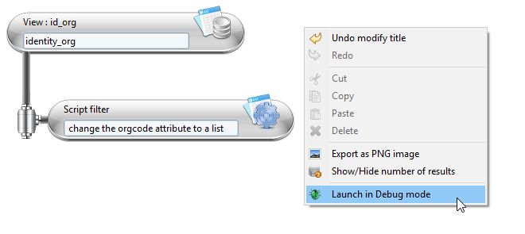

When this option is selected, the business view currently edited in memory is executed, meaning that there is no need to save it on disk before starting the debug session.   
In a debug session, the execution is suspended when a breakpoint is reached. **In business views, breakpoints can only be set on JavaScript lines, not on components in the graphical editor**.   
To set a breakpoint on a JavaScript line, double click on the left side of this line : a blue spot will be added there.  


Breakpoints can also be set on JavaScript lines of an inner business view. The execution will be suspended when the breakpoints are reached in the inner view. The following diagram shows the architectures of 2 business views.   


In this example, a main business view is built on top of another view (called inner view in the diagram). It means that the source of the main view uses the inner business view. Both views have a JavaScript file. A breakpoint is set in the inner JavaScript file but the debug session is started on the main business view.  

## The debug perspective  

When a breakpoint is reached, it will be asked to switch to the debug perspective. You should accept to be able to see the variables, the stack and the console. The screen looks like this when the debug perspective is activated:  


In the upper left pane, the stack shows which JavaScript functions have been called. In the upper right pane, the variables are displayed. If the variables have changed since the last suspended state they appear in a yellow background. The content of the variable window is contextual to the selected function in the stack pane. The variables shown are the last known values of the selected stack level.    

In debug mode, when the execution is suspended on a breakpoint, you can inspect the variables. The config variable contains the project global variables. The dataset variables contains the business view parameters. You can also execute the script step by step. You can also resume it by clicking on the yellow and green arrow  in the toolbar so that the execution continues until the end or until the next breakpoint is reached.    

| **Note** <br><br> Without any JavaScript the debug mode is still useful as the business engine displays every action in the console and writes them in a log file|

The console looks like this:   


Each blue line is a record getting out of the business view. This is the result of the business view. The purple lines are the messages sent by the print() function in the JavaScript file.  
If the number of output records is too big, then the log file will be easier to search for a specific line.  

# Optimization


This section addresses performance topics. The business view is a concept that can be used to implement business logic, the use cases ranging from simple to complex. It is important to consider performance when configuring a new business view in order to avoid bad response times.   

A business view works in memory using data queried from the database using ledger or log views. To avoid bad response times it is necessary to:   

- Reduce the query time of the database by optimizing the performance of the ledger view
- Reduce the amount of information processes by the business view

## Optimize Performances for Ledger Views  

It is recommended to filter the results returned by ledger views using static values or input parameters. Indeed, the fewer records returned by the ledger view, the faster the business view will be. Reducing the data input also reduced the memory usage of the business view.  

| **Important** <br><br> Do **not** use the generic Brainwave ledger views included in the default project to build a business view. The generic nature of these ledger views results in returning a large number of attributes that are not all necessary for your use case. It is recommended to create a new ledger view designed to return the minimum number of records and attributes. |

As explained, business views always work in memory as opposed to Ledger views which delegates all the work to the underlying database.  
There are many ways to address the same need. As an example lets assume that we need to consolidate the results using many joins, perform a count and some apply some filters. We could :   

- Do everything in the same ledger view
- Create a ledger view without the count and count in a business view calling the Ledger view
- Join the results of several ledger views in a single business
What is the best practice to follow ?  

The best methodology is make the database work as much as possible. The database has some indexes that can speed up the search and is also optimized to perform various sort operations.   


| **Note** <br><br> Please remember that it is necessary to refresh or recalculate the indexes after each execution plan, to make the most of their performance benefits. <br> See [Rebuild the database indexes on SQL Server]({{site.baseurl}}) or [Rebuild the database indexes on Oracle Server]({{site.baseurl}}) for more information on building indexes.|  

However, if the Ledger view is rich and complex it can generate a complex SQL query. The database is then not able to generate an efficient execution plan resulting in bad response times. In this case, splitting the complex Ledger view into 2 simplified ledger views and joining them in a business view can be a good idea. The sum of the execution times of the three resulting views being smaller than the execution time of the unique complex view.   

How to split a complex view ? There can be two issues in a Ledger view :   

- The criteria

The criteria can slow the request if the column is not indexed in the database. For example a 'like' operation on a custom attribute may require setting a project index. But beware to not add an index for each custom column in the database or it will dramatically slow the execution plan and the activation phase.

- The join   

Performance issues are often a problem of joins between table and the number of record that the database has to read. This can be the case even if the final result returns only 2 records. The joins may generate several millions records in database memory but, after filtering, only 2 records are returned as a result. This kind of request has a bad performance.   

The joins to focus on are joins done through rights. These joins make the database generate many records in memory. Almost all performance issues come from these joins. These joins take several forms :   

- The most obvious is if you have the "right" concept in the view for example : accounts -\> rights -\> permissions or the other way : permissions -\> rights -\> accounts. Same thing with the groups : groups -\> rights -\> permissions and the other way : permissions -\> rights -\> groups
- Beware of all the implicit joins through rights. In this case, the Right concept does not appear in the graphical area. For example : accounts -\> permissions, identities -\> permissions, groups -\> permissions, groups -\> applications and vice-versa.   

The Ledger views which have several joins through rights may be optimized by splitting the Ledger view into two Ledger views, each view having only one join through rights (implicit or explicit) and building a business view on top of both Ledger views. One Ledger view is used as a source in the business view and the other Ledger view is used in a join component.   

## Lower Memory Use  

The business view engine has been optimized to try to keep the least number of records in memory but some components, for performance reasons, keep records in memory. This is the case of a join component. The inner view is read in cache to then match all the records arriving from the source.   

The best practice when using a join between 2 views is to select the view which returns the more records as the source of the view.  
The exception is when you have a right join. In this case, the cache is filled with the view coming from the source and not the secondary source. It means that the source should have fewer records than the secondary source.  

## Sorting  

Sorting is another point to focus on when dealing with performance.  
Ledger views often include a default sort to be able to display results alphabetically in a page or a report. Sorting a Ledger view that will be used by a business view can be useless because the records will be shuffled. Using the previous example, the result of the secondary view of a join component is put into a cache. Sorting this Ledger view makes the database work for nothing.   

The business view also has a panel to configure the sort operations. By default, the business engine will try to use these settings via the database. For example, if the a sort is defined on the 'login' attribute and this attribute comes from the Ledger view of the source, then business engine forces the sort of the Ledger view to sort on the 'login' column and tries to keep the order of the records during the processing.  

The sort in the underlying Ledger view is also useless with the trend component if you want to keep the 'deleted' records from the previous timeslot.   

One last important point to keep in mind is that, even if you do not ask for a sort in the business view, a sort may still apply in the context of a Web page when the user clicks on the column header of a table. The portal then executes again the same business view but forces a sort option. The sort will probably be in memory. If the view outputs a huge number of records because almost no filtering is active, then the sort will be slow and will consume a lot of memory space.   

## Performance Investigation Tool  

In the result tab, a link under the table gives access to the timing statistics as well as the global execution time of the business view. This statistics page displays a tree showing the execution times of each component of the business view:  


The tree begins with the last component of the pipe as configured in the business view as this component delivers the requested records to the page and/or report.   
This last component reads records from the previous component which appears on the second line, and so on ...  
If a component aggregates 2 sources, such as a join which reads records from the previous component but also from the inner view (the secondary source), the this component has two children in the tree : the inner view and the previous component.  

The timing statistics are global, meaning that you will get all the timings even when the time is spent outside of the business view. For example, if a main business view is built on top of another business view, then the timing tree displays the timing of both business views and associated Ledger views if any.   

The columns of the tree split the time into component features. As a result, you can identify how mush time has been spent to sort the records, filter records or add computed attributes. Here is the description of each column :    

- Records : The number of records output by the component.
- Sort in memory (ms) : Indicated the time used to sort the results of the business view in memory. This value should only be filled for the first line of the tree as the sort is performed only once by the last component of the business view (the first displayed in the tree). However, If the business view is built on top of another business view, then another sort time can be displayed on the line corresponding to the last component of this second business view.
- Attribute computation time (ms) : Indicates the time spent to add computed attributes to the records.
- Filter time (ms) : Indicates the time used to evaluate the filtering expression and decide if each record is kept or removed from the output.
- Time (ms) : Indicates the time spent in the component. It includes the specific processing of the component (matching attributes for a join and merging records) and the time spent sorting, filtering and computing attributes. However, the time spent reading an inner view or getting records from the previous component is not part of this time. The formula is : Time = Sort time + Attribute computation time + Filter time + Component specific processing time.
- Total time (ms) : Indicates the cumulative time of this component and the time needed to read inner view or getting records from the previous component. The formula is : Total time = Time + Inner view time + Previous component total time.  
Using the example displayed above the total time for the component test is 1294 which is 348 + 945. The difference of one millisecond due to the fact that the time is measured in nanoseconds and then rounded when displayed in the table.  

| **Note** <br><br> &emsp;- The timings are displayed are for a maximum of 1000 output records. <br><br> The studio never display more than 1000 line in the result table. To get the actual timing information for the execution of a business view in the portal (returning more than 1000 results) you have the possibility to use a debug option `-Dbusinessviewtimings=true` in the `JAVA_OPTS` of parameters of the portal. Adding this option generates a .csv file in the portal logs folder containing all the sizing and performance information. This option should only be used when investigating business view performance issues.<br><br> &emsp;- The background of the lines are colored to highlight the component taking the most time. This is just a hint to help the user to focus on the "heavy" components or inner views.<br><br> By studying the timings you can identify if it is the business view or the underlying Ledger view that takes the most time. If it is the underlying Ledger view that takes 99 percent of the time, there is no need to optimize the business view settings. You should then try to optimize the Ledger view by redesign it, splitting it or adding an index.|

## Script Performance  

If the business view includes a Javascript source or a JavaScript filter, it is highly likely that most of the time will be spent in it. It's hard to give general tips for JavaScript but here are some advice to speed things up.  

| **Note** <br><br> Some of the following advice given to improve performance may lower the script quality in terms of architecture or maintainability.|

- Avoid using stacks in JavaScript. For example, using a loop and, inside it calling a function to perform the requested the job. By "inlining" the code inside the loop, you avoid loosing time pushing or poping records from the JavaScript stack.
- Use JavaScript global variables to keep intermediate results. The idea is to avoid re-executing multiple times the same processes each time your "read" method is called. It is more efficient to compute them once and store them in global variables so that they are available on the next "read" entry.
- Avoid Java calls as much as possible because calling Java from JavaScript is time-consuming. Try to use JavaScript concept instead of Java. For example, if you want to store a list of values, use an Array instead of a `java.util.List`.