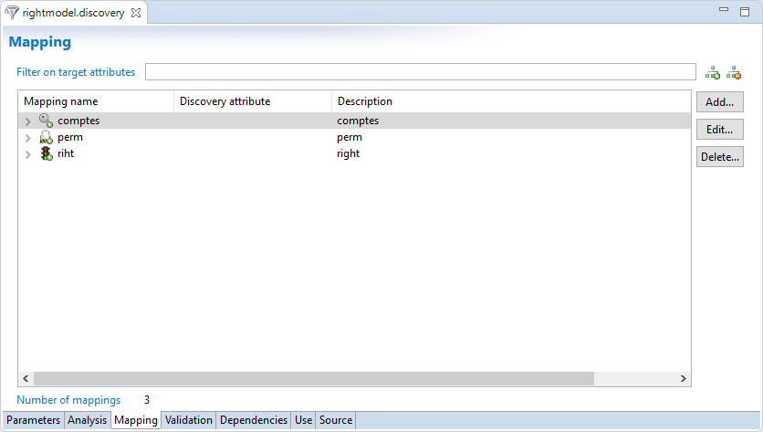
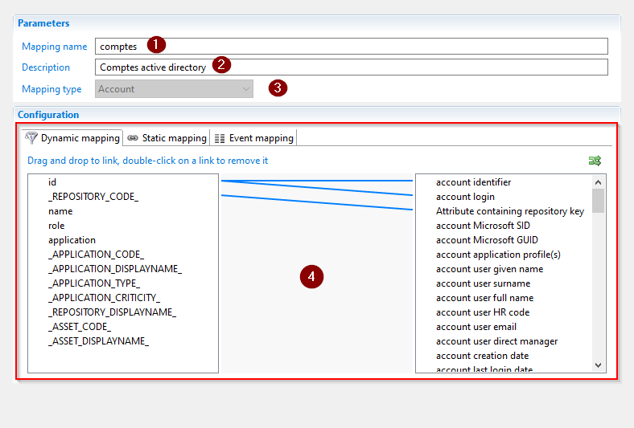
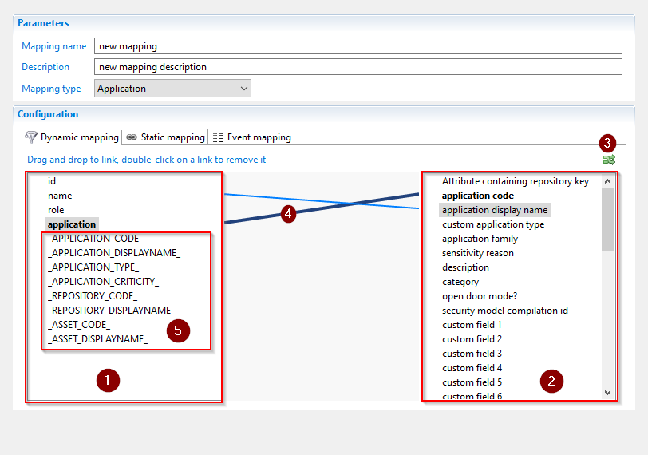
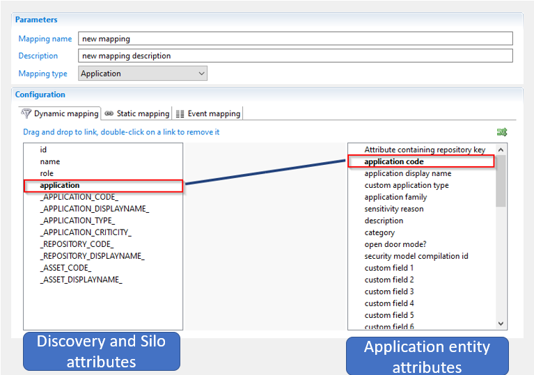
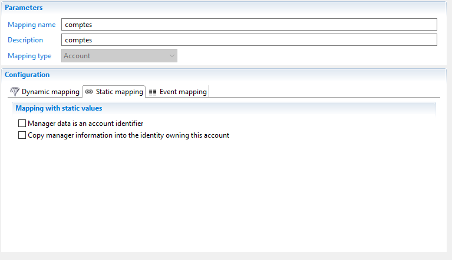
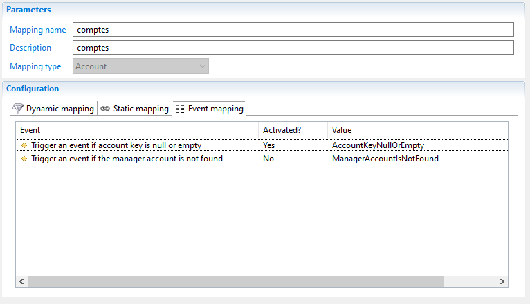
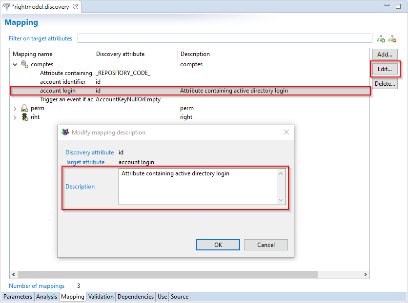

# Attribute Mapping in Discovery File

In order to configure the mapping between the data in the import files and Brainwave's data cube a new editor has been added:

- The Discovery editor

In the following chapter the configuration on this new tab is detailed.

## Discovery Mapping

As detailed a new concept has been added to discoveries: The discovery mapping. It allows the user to configure the links between the ledger entities and the attributes in the discovery.

This will then be used in the data collector wizard association tab to map the attributes with the application model entities.

A mapping is characterized by the following attributes:

1. Name: The identifier of the mapping
2. Description: To understand the goal of the mapping
3. Type: Contains entity type ex( Account, Applications, Repository...)
4. List of attributes mapping: list of links between discovery attributes and collect entity fields

## Tree mapping editor

The mapping component allows the definition of links between attributes in the discovery file and a attributes in the ledger graphically.

To create a link, simply drag and drop from left tab, representing the attributes in the import file, to right tab, attributes in the data model.

Clicking on a link highlights it and helps identify the source and the destination attributes.

To delete an attribute mapping double-click on the link.

The editor includes the following:

1. Discovery attributes: The list of import, calculated and silo attributes
2. Ledger attributes: list of attributes existing in the data cube corresponding to the selected entity
3. A Button that allows to sort the linked attributes
4. The graphical Link between left and right tabs attributes
5. List of silo attributes that is included with the discovery attributes in the left tab

## Attribute mapping

An attribute mapping is a link between a discovery attribute and a ledger entity attribute configured in the discovery mapping.
The list of ledger attributes displayed is dependent on the configuration of the mapping type.
For example when "Application" is selected then only attributes corresponding an application in the ledger is displayed:

In the configuration of the mappings different types are possible

### Dynamic Mapping

Dynamic mappings are created using the mapper component where the attribute in the ledger is linked to a value returned by the discovery.

### Static Mapping

Static mappings are ledger attributes that need a static value and can not be linked to attributes from the discovery.

Theses are dependent on the selected destination entity.

### Events

This section allow to activate and configure events related to ledger attributes. Theses are dependent on the selected destination entity.

### Attribute Mapping Description

It is recommended to fill out all attribute mapping descriptions. These descriptions will be used to populate the application model documentation that can be exported

Please see [here](collect-wizard-editor.md/#generate-documentation) for more information.
