# Application Model Editor

This chapter described the tabs of the application model editor. This allows better understanding of the settings and the impact of the different configurations on the generated collect files.

## Application Model Wizard Tab

This first tab displays a reminder of the information provided during the setup wizard dialogs.

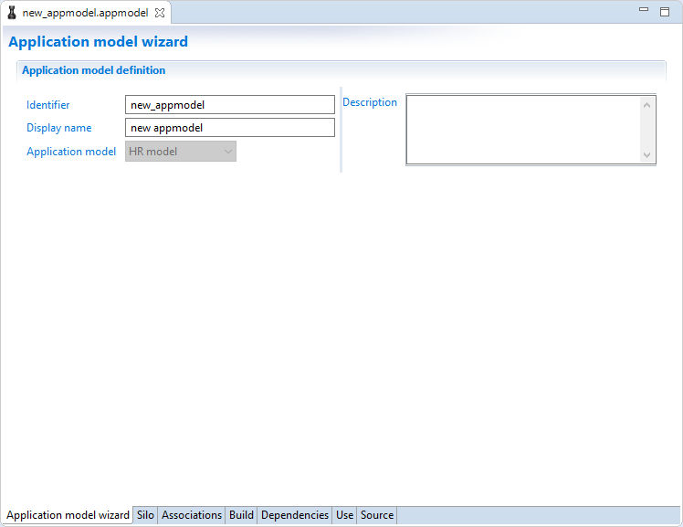

---

> [!warning] The identifier of the application model is **not** editable and must **not** be changed.
Once the setup wizard dialog has been validated, the identifier used to create folders, to patch files...

The only way to change the identifier to delete the application model and create a new one.

---

The `Description` field is used in the documentation that can be automatically generated. The best practice is to fill out this field with a description of the desired data model.

Please see [here](#generate-documentation) for more information.

## Silo tab

This tab is used to define the main silo settings:

Each application model will generate a silo file, called `identifier_master.silo`. The identifier used to create this file is the application model identifier.

In this tab you will find all fields that are in the standard silo editor including :

- The silo parameters: Identifier, Display name, Silo type and dependencies
- The importfile iteration parameters
- The silo constants

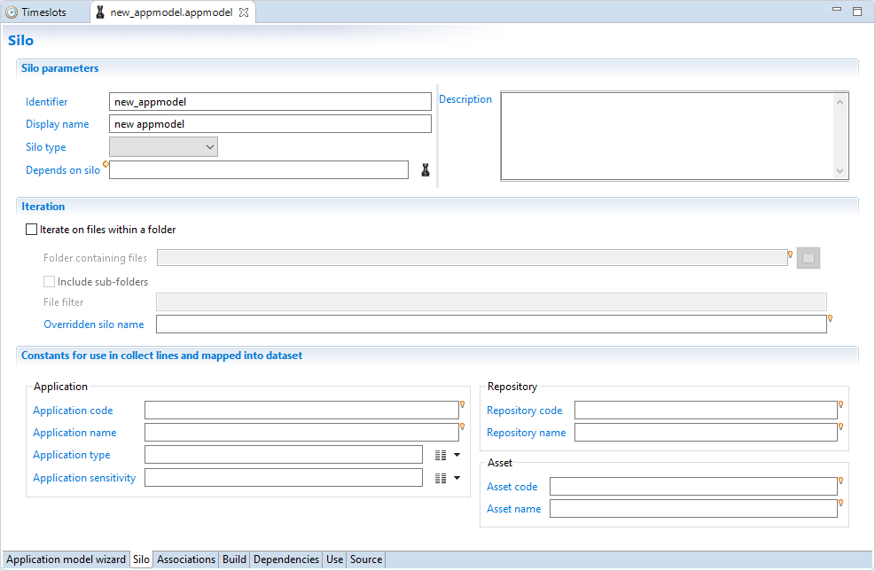

## Associations tab

This is the main tab and allows the user to configure the associations between the application model and the ledger identities loaded.

The editor is separated in fields that allow the user to:

- Associate all the pre-configured mappings to the application model
- Set the application model variables values
- Preview the data model schema
- Consult the user guide

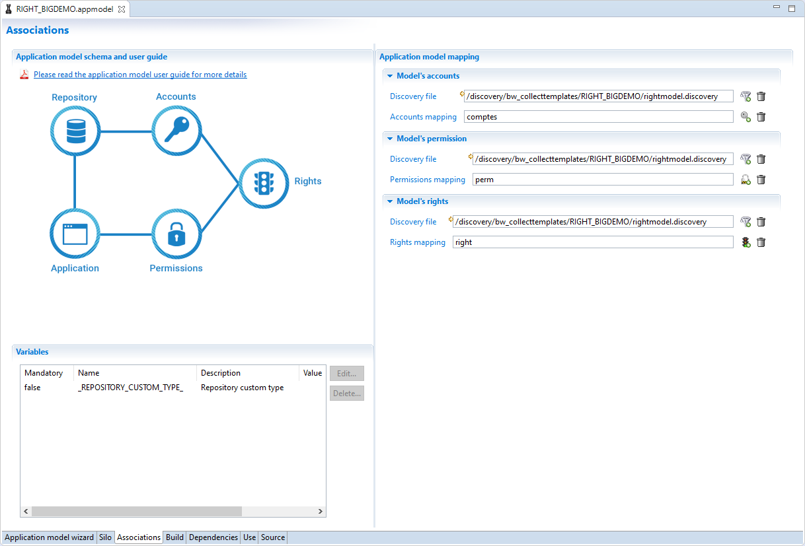

### Application Model Schema and User Guide

This field provides the user with documentation on the requirements of the application model.

It includes:

1. A PDF user guide to help configure the application model step by step
2. An illustration of the application model schema providing a global view of the data model and the different relations included in the application model

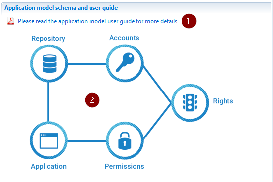

### Variables

In this section variables used in the application model are set.
These can be set to static values or a project variables.

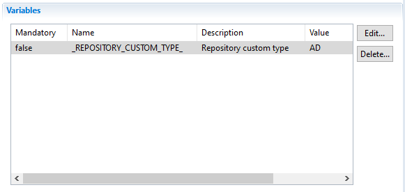

---

> [!warning] When using project variables (_ex:_ `config.fileName`), when exporting your application model after generation, the destination project may not have the same variable. If this is the case then it is recommended to use a facet variable instead of a project variable.

---

### Application Model Mapping

This section show the different discovery mappings that should be associated with the application model entities.
For each association section you have to:

- select the discovery file that contain the mapping
- choose the correct mapping type
  
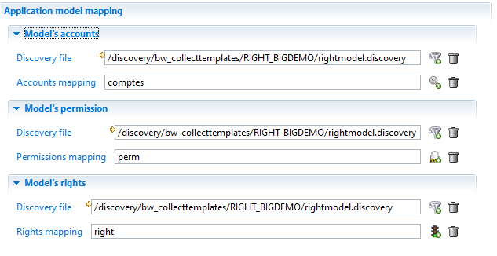

---

> [!warning] If there are missing mandatory attributes in a mapping an error is displayed on the mapping field.

---

## Build Tab

The build tab is to be used once all the configuration of the application model is finalized. This tab allow you to perform the following actions:

- Generate the application model files necessary to launch an execution plan.
- Generate a facet based on the configured application model
- Generate a html documentation of the configured application model

### Generate Application Model Files

This tab is used to build all files necessary to run the execution plan.
In the editor the following elements are displayed:

1. The list of files that will be generated by the product when building
2. The button used to generate and build all files
3. The button used to delete currently generated files
4. The button that is used to refresh files state

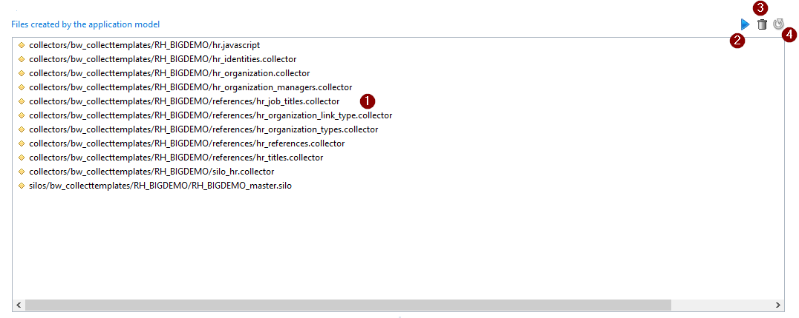

### Generate Facet Files

This section allows the user to generate the files necessary to build a facet based on the configures application model.

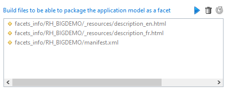

Once all files generated please refer to the following pages to build the facet:

[Creating add-ons](../add-ons/add-on-creation)

### Generate documentation

The possibility to automatically generate the documentation of the configured application model has been added to help the integrator. This generates an html file that includes the configuration of the mappings implemented through the application model.

The language in which the documentation is generated is dependent on the language of the Studio.

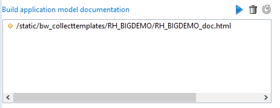

The documentation includes the discovery mappings and application model configuration used by the user.

To improved the quality of the generated documentation it is necessary to fill out the descriptions of the following items:

1. Discovery mapping name and description
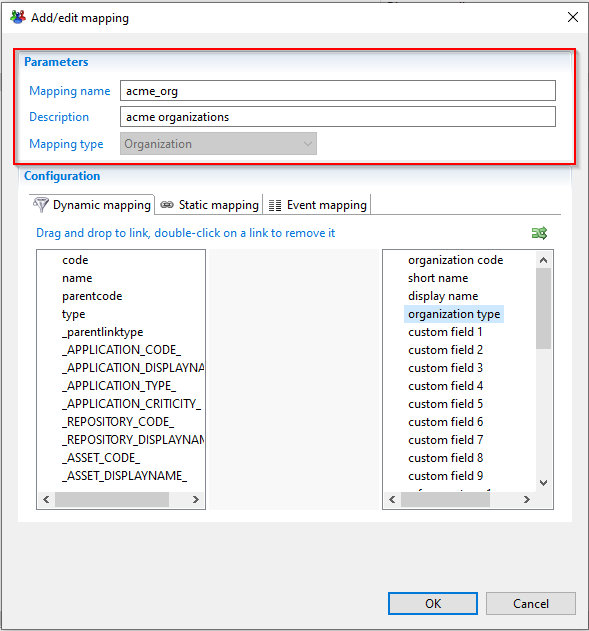

2. Attribute mapping description
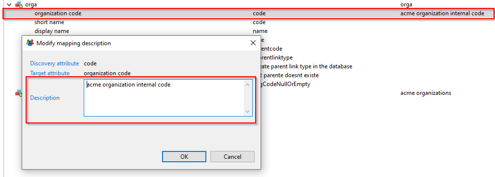

3. Application model description
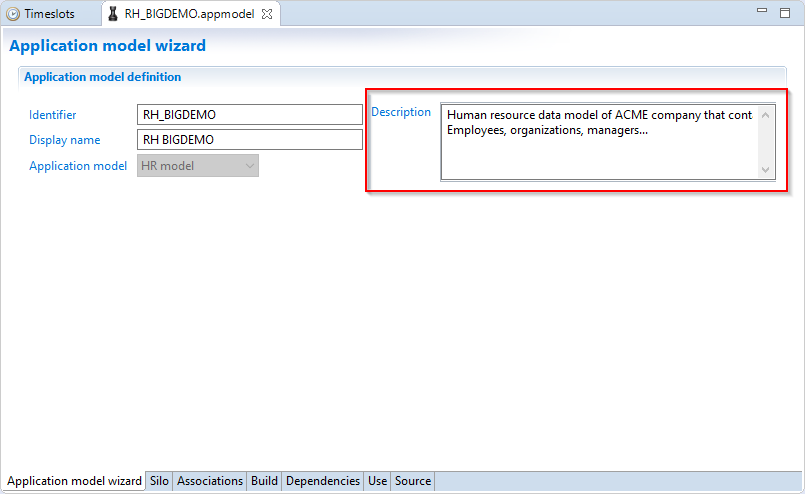
