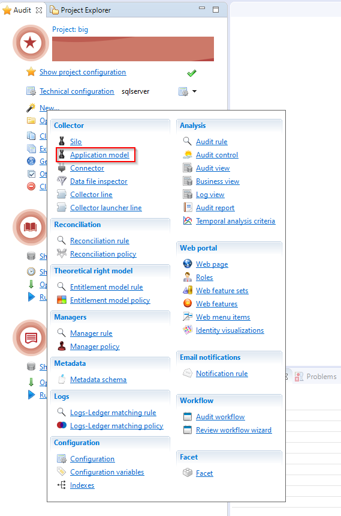
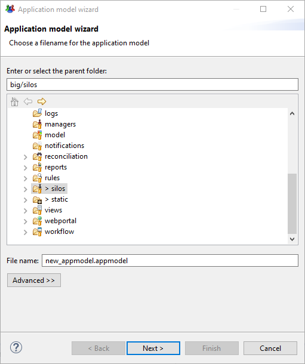
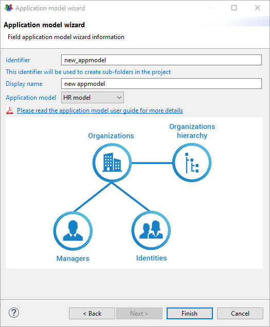
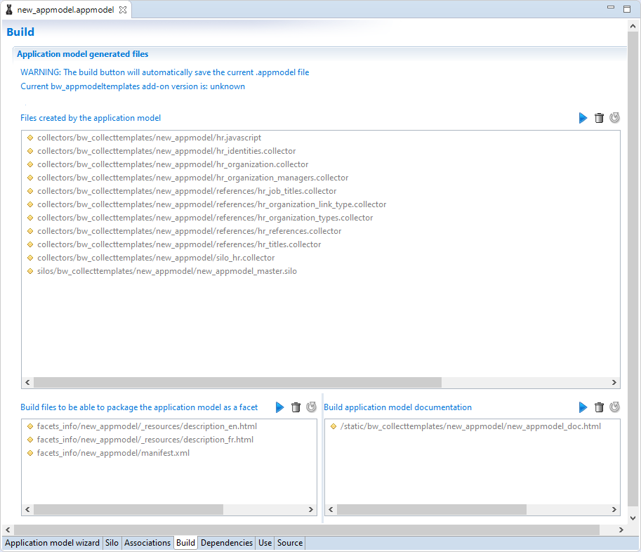

# Generation of a Collect Line

The data collection wizard provides the user with a dedicated interface to map the original import data to attributs in Brainwave's data cube. The product will then automatically generate the corresponding data collection lines.

The generated elements can then be used out of the box to run an execution plan. Further customizations to the generated files can be applied if needed, thanks to the high customization capabilities of Brainwave.

The following paragraphs detail the process from the design of the application model to the launch of generated collect:

* Step 1: Configure the mapping between the import data and the data cube

* Step 2: Generation of the data collection lines

* Step 3: Customize and/or adapt the generated data collection lines

* Step 4: running an execution plan

> [!note] In the following pages the terms **collect** and **application model** are used interchangeably and have the same meaning.

## Create a New Application Model

### Prerequisites

The data collection wizard is included in an add-on called `bw_appmodeltemplates`.

This add-on is not included by default in the product and must be downloaded from the marketplace [here](https://marketplace.brainwavegrc.com/).

The installation of the add-on provide the access to the data collection wizard.

### Application Model

Once the `bw_appmodeltemplates` add-on installed, you can access the wizard to generate an application model in the audit menu: "New..."

This menu opens a dialog box to create an application model file with the extention `.appmodel`. This file contains all informtaion relating to the application model.

The `.appmodel` file must be located in the 'silos' folder.

The next dialog allows the configuration of the application model, including:

* The application model identifier
* The selection of the Application model template

The application model identifier will be used as a silo identifier and, as such, it must be unique in the project. Please note that the identifier can not be changed once the wizard is finished.

The identifier is also used to create all necessary folders in the project (silos, collectors...).

### Templates

The application model include a series of templates that determine the structure of the generatied data collection lines.

The list of application models will increase as the `bw_appmodeltemplates` Add-On evolves in time. As is stands the add-on includes :

* An HR model to create data collection lines for HR information
* A Repository model to repositories, accounts, groups and groups members.
* A Right model template to load accounts, permissions and rights.

For more information on the included data models please refer to the following pages:

[Application model templates](igrc-platform/collect-wizard/templates.md){: .ref}

## Build

Once the creation wizard dialog completed the application model editor is opened.

This editor allows the collect designer to define the collect mappings, the configuration of the silo and so on.

For more information on the configuration of the application model editor please refer to the following page:

[Application model templates](igrc-platform/collect-wizard/editor.md){: .ref}

Once all configuration completed the Build tab allows the user to generate all data collection lines and the documentation.

The following screenshot shows the Build tab:

## Execution Plan

Once all the previously described steps have been completed it is possible to launch an execution plan to load the data to brainwave ledger.
