# Application Model Templates

The application model include a series of templates that determine the structure of the generated data collection lines.

## HR Model Templates

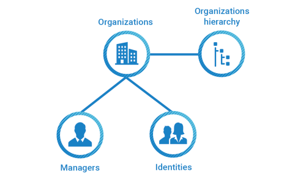

The Human Resource application model template allows the generation of collect lines and silos to load organizations hierarchy, identities and organizations managers.

Please follow the steps below to configure your human resources data model.

### Silo Settings

When creating the application model base on the HR template it is first necessary to configure the required elements in the **Silo** tab:

- The silo type
- The dependencies if needed
- The location of the importfiles and the iteration if Files iteration if you want to load several files
- The constants

#### Mandators silo settings

In order to correctly configure the following elements are mandatory:

- Repository code
- Repository name

> By default The HR model will create a default repository based on silo repository code and name.

### Discovery Mappings

When configuring a Human resource type template for an application mode the following attributes are necessary:

- Organization type reference: loads the organization type (_ex:_ Direction, Service...)
- Organization link type reference: loads the organization link type (_ex:_ Hierarchical...)
- Organization: loads the organization (_ex:_ DCOM, DSI, DRH...)
- Title reference: loads the civility (_ex:_ Mr, Mrs...)
- Job title reference: loads the job title code (_ex:_ RD-Ing, DirCom...)
- Identity: loads the identities (_ex:_ employees, contractors...)
- Manager (Organization): loads the organization managers

> If a discovery file mapping the desired importfile attributes does not exist it is necessary to create it.

#### Organization Type Reference

To create an organization type mapping go to the **Mapping** tab and add a mapping of type **Organization type reference**.

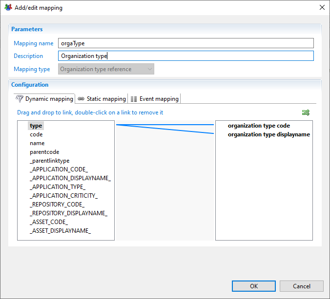

The mandatory attributes to map are:

- Organization type code
- Organization type displayname

#### Organization Link Type

To create an organization link type mapping go to the **Mapping** tab and add a mapping of type **Organization link type**.

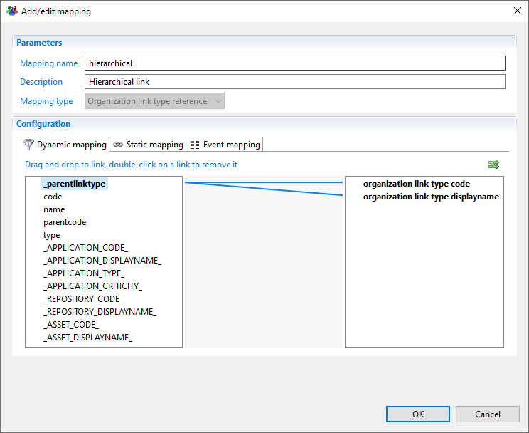

The mandatory attributes to map are:

- Organization link type code
- Organization link type displayname
  
#### Organization

To create an organization mapping go to the **Mapping** tab and add a mapping of type **Organization**.

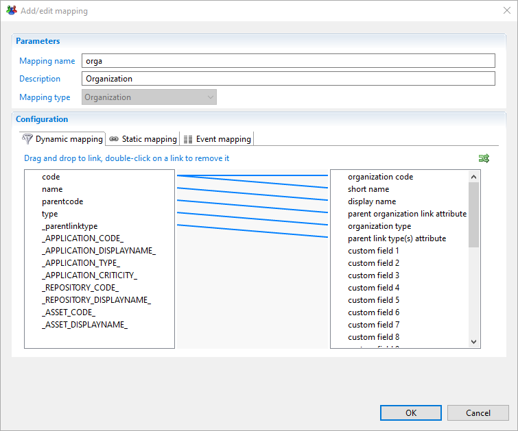

The mandatory attributes to map are:

- Organization code
- Organization displayname
- Organization type

#### Title Reference (Civility)

To create a title reference mapping go to the Mapping tab and add a mapping of type **Title reference**.

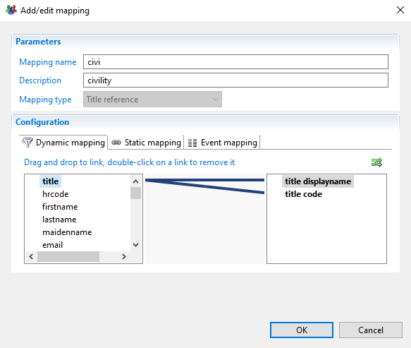

The mandatory attribute mapping to link are:

- Title code
- Title displayname

#### Job Title Reference

To create a job title reference mapping go to the Mapping tab and add a mapping of type **Job title reference**.

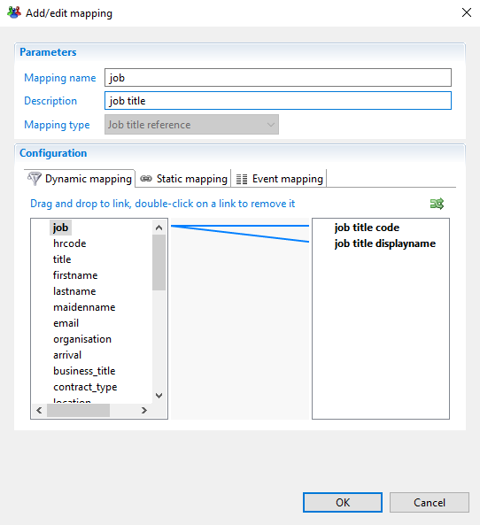

The mandatory attributes to map are:

- Job title code
- Job title displayname

#### Identity

To create a job title reference mapping go to the Mapping tab and add a mapping of type **Identity**.

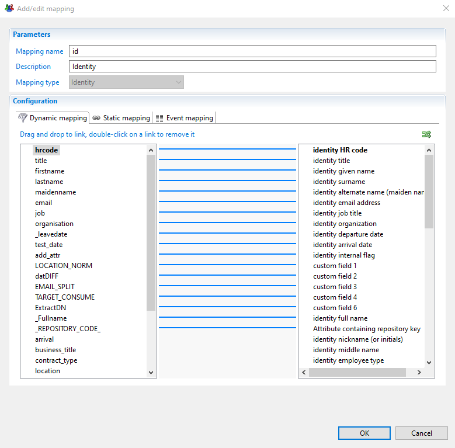

The mandatory attributes to map are:

- The repository code
- The identity HR code
- The identity surname
- The identity given name
- The identity internal flag

#### Manager (Organization)

To create an organization manager mapping go to the Mapping tab and add a mapping of type **Manager (Organization)**.

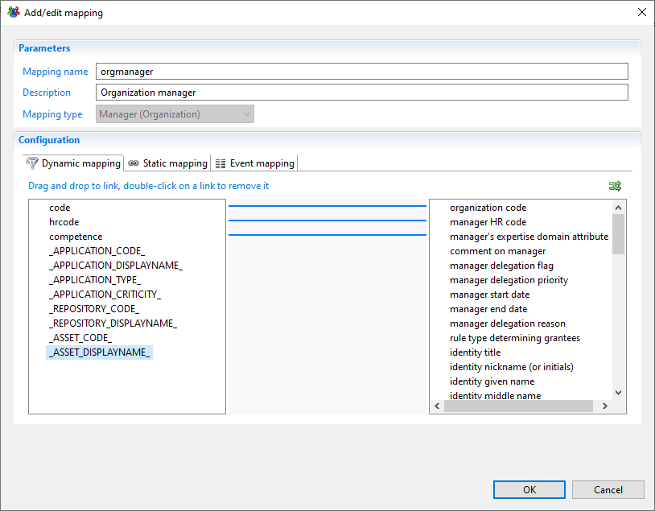

The mandatory attributes to map are:

In the dynamic mapping tab:

- Organization code
- Manager HR code
- Manager's expertise domain attribute

In the static mapping tab:

- Action to do if expertise domain does not exist: Add expertise domain in database

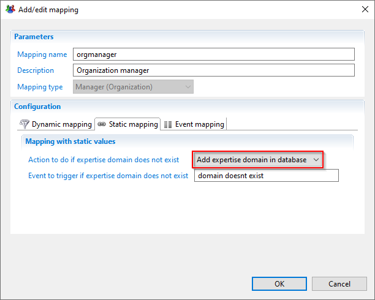

### Associations

After creating the needed mappings in the discoveries files the next step is to associate theses mappings with the application model entities.

For each application model entity you have to choose the discovery file that contains the mappings and choose the mapping corresponding to the entity type

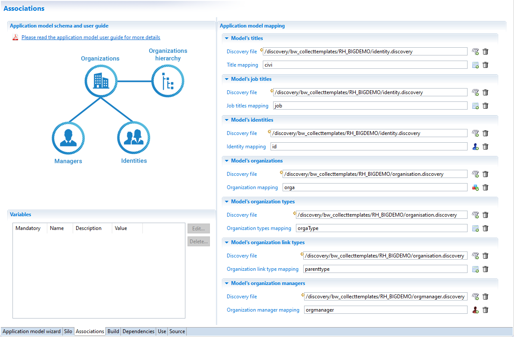

### Generate Files

The RH template model will generate the following files

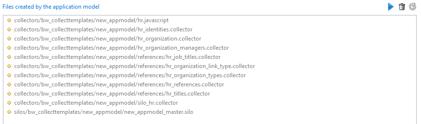

- `collectors/bw_collecttemplates/new_appmodel/hr.javascript`
- `collectors/bw_collecttemplates/new_appmodel/hr_identities.collector`
- `collectors/bw_collecttemplates/new_appmodel/hr_organization.collector`
- `collectors/bw_collecttemplates/new_appmodel/hr_organization_managers.collector`
- `collectors/bw_collecttemplates/new_appmodel/references/hr_job_titles.collector`
- `collectors/bw_collecttemplates/new_appmodel/references/hr_organization_link_type.collector`
- `collectors/bw_collecttemplates/new_appmodel/references/hr_organization_types.collector`
- `collectors/bw_collecttemplates/new_appmodel/references/hr_references.collector`
- `collectors/bw_collecttemplates/new_appmodel/references/hr_titles.collector`
- `collectors/bw_collecttemplates/new_appmodel/silo_hr.collector`
- `silos/bw_collecttemplates/new_appmodel/new_appmodel_master.silo`

## Repository Template

The repository template for the application model allows the generation of the necessary data collection lines and silos to load repositories, accounts, groups and groups members.

Please follow the steps below to configure your repository data model.

### Silo Settings

When creating the application model base on the HR template it is first necessary to configure the required elements in the **Silo** tab:

- The silo type
- The dependencies if needed
- The location of the importfiles and the iteration if Files iteration if you want to load several files
- The constants

#### Mandatory Silo Settings

In order to correctly configure the following elements are mandatory:

- Repository code
- Repository name

> By default The HR model will create a default repository based on silo repository code and name.

### Discovery Mappings

Repository application model require the following entity mappings

- Account : to load repository accounts
- Group : to load repository groups and groups membership

> If a discovery file mapping the desired importfile attributes does not exist it is necessary to create it.

#### Account

To create an account mapping go to the **Mapping** tab and add a mapping of type **Account**.

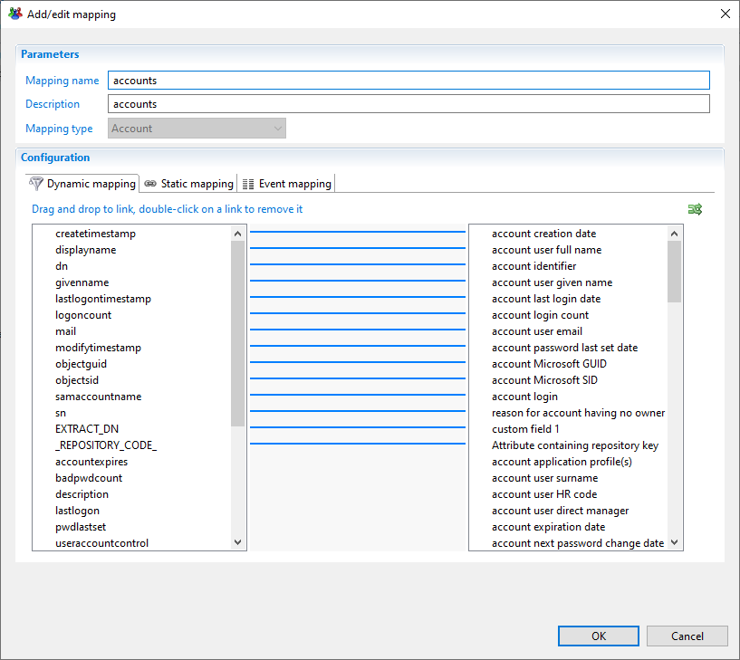

The mandatory attributes to map are:

- The attribute containing repository code
- The account identifier

#### Group

To create a group mapping go to the **Mapping** tab and add a mapping of type **Group**.

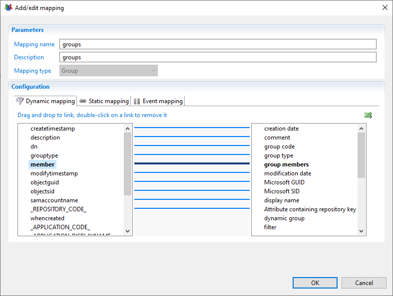

The mandatory attributes to map are:

- The attribute containing repository code
- The group code
- The group member

### Associations

After creating the needed mappings in the discoveries files the next step is to associate theses mappings with the application model entities.

For each application model entity you have to choose the discovery file that contains the mappings and choose the mapping corresponding to the entity type

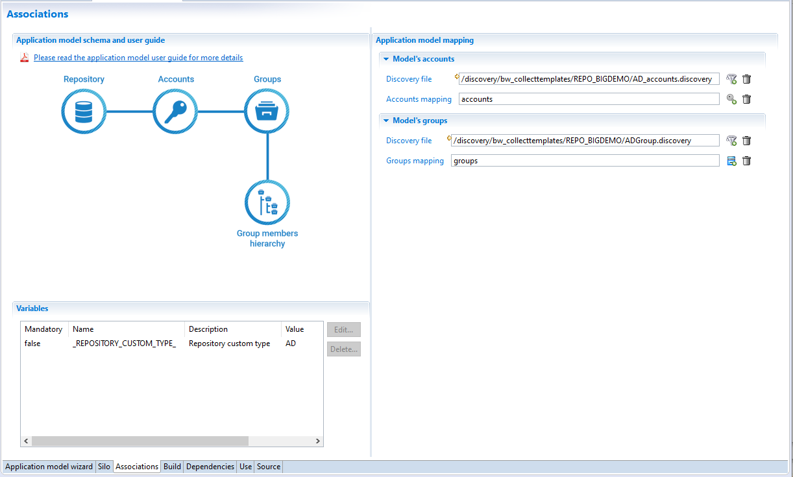

#### Variables

In addition it can be necessary to configure some variables specific to repositories.

- Repository custom type: To be configured when collecting data belong to the same type of application.

_Example:_ collecting active directory domains, this variable should have '**AD**' as value, it is mandatory to resolve multi domains groups membership

### Generate Files

The repository template model will generate the following files

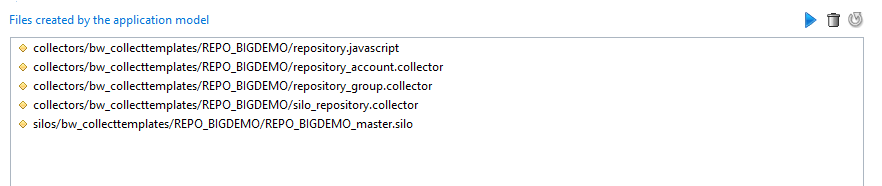

- `collectors/bw_collecttemplates/new_appmodel/repository.javascript`
- `collectors/bw_collecttemplates/new_appmodel/repository_account.collector`
- `collectors/bw_collecttemplates/new_appmodel/repository_group.collector`
- `collectors/bw_collecttemplates/new_appmodel/silo_repository.collector`
- `silos/bw_collecttemplates/new_appmodel/new_appmodel_master.silo`

## Rights Template

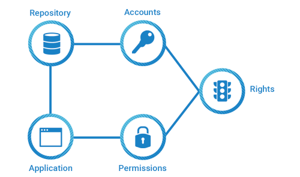

Right application model template allows you to generate collect lines and silo to be able to load accounts, permissions and rights.

Please follow the steps below to configure your human resources data model.

### Silo Settings

When creating the application model base on the HR template it is first necessary to configure the required elements in the **Silo** tab:

- The silo type
- The dependencies if needed
- The location of the importfiles and the iteration if Files iteration if you want to load several files
- The constants

#### Mandators silo settings

In order to correctly configure the following elements are mandatory:

- Repository code
- Repository name

> By default The HR model will create a default repository based on silo repository code and name.

### Discovery mappings

Right application model requires the following entity mappings:

- Accounts: to load repository accounts
- Permissions: to load application permissions
- Rights: to load rights

> If a discovery file mapping the desired importfile attributes does not exist it is necessary to create it.

#### Account

To create an account mapping go to the **Mapping** tab and add a mapping of type **Account**.

The mandatory attributes to map are:

- The attribute containing repository code
- The account identifier

### Permission

To create a permission mapping go to the **Mapping** tab and add a mapping of type **Permission**.

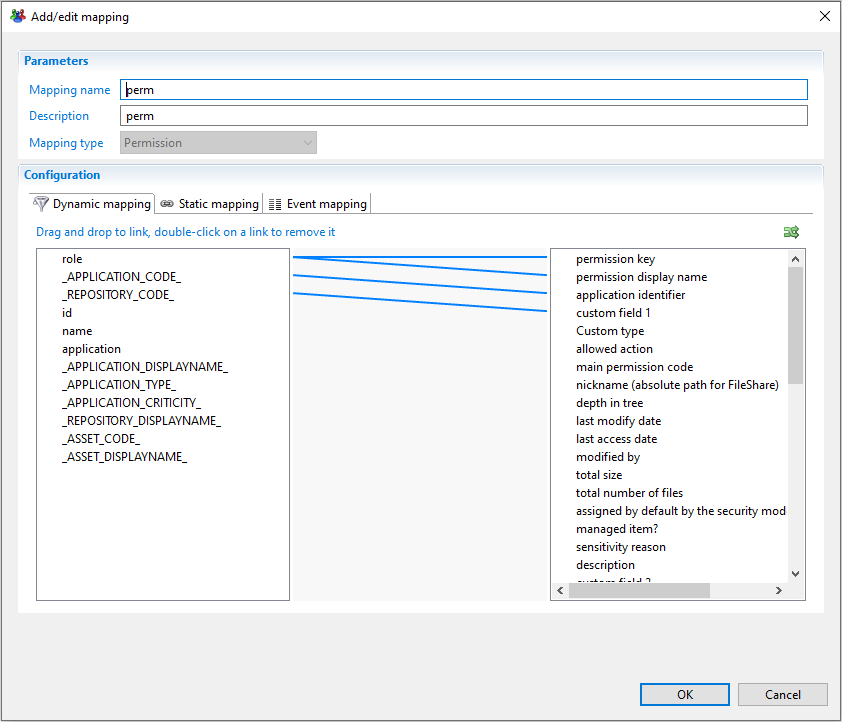

The mandatory attributes to map are:

- The application identifier
- The permission type
- The permission key

#### Right

To create a right mapping go to the **Mapping** tab and add a mapping of type **Right**.

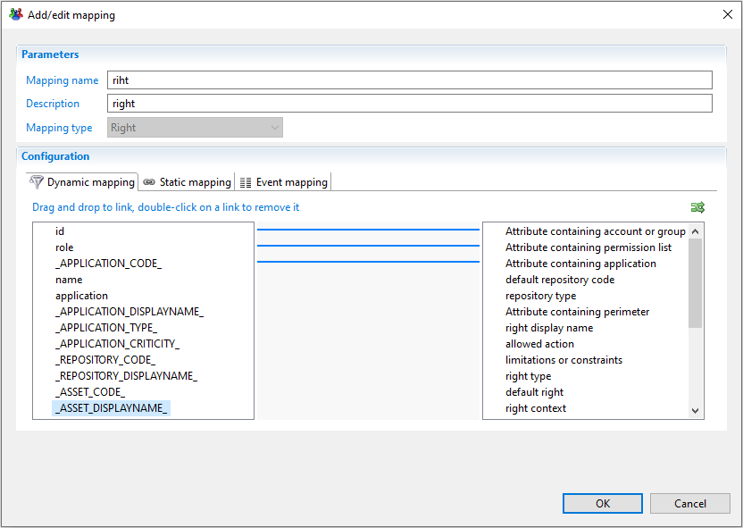

The mandatory attributes to map are:

- The attribute containing application code
- The attribute containing list of permission identifiers
- The attribute containing the account or group identifier
  
### Associations

After the creation of the needed discovery mappings in the discoveries files it is time to associate those mappings with the application model entities

For each application model entity you have to choose the discovery file that contain the mapping and after that choose the mapping corresponding to that entity type

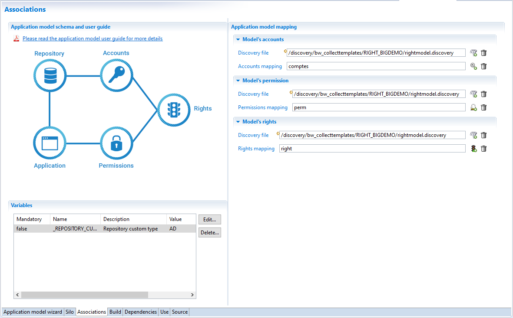

#### Variables

In addition it can be necessary to configure some variables specific to repositories.

- Repository custom type: To be configured when collecting data belong to the same type of application.

_Example:_ collecting active directory domains, this variable should have '**AD**' as value, it is mandatory to resolve multi domains groups membership

### Generate files

The right application model will generate the following files

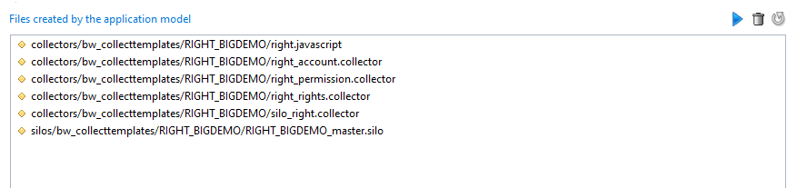

- `collectors/bw_collecttemplates/new_appmodel/right.javascript`
- `collectors/bw_collecttemplates/new_appmodel/right_account.collector`
- `collectors/bw_collecttemplates/new_appmodel/right_permission.collector`
- `collectors/bw_collecttemplates/new_appmodel/right_rights.collector`
- `collectors/bw_collecttemplates/new_appmodel/silo_right.collector`
- `silos/bw_collecttemplates/new_appmodel/new_appmodel_master.silo`
