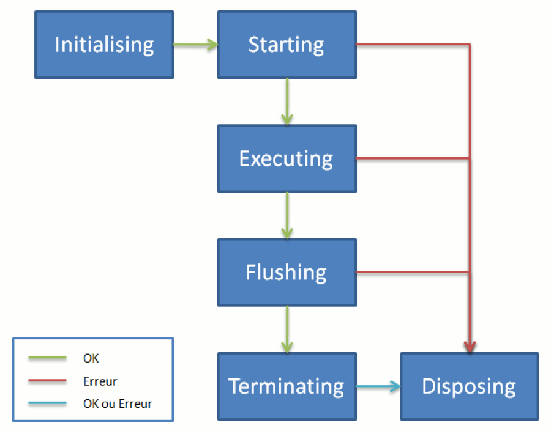

# Collector engine states  

The collector engine goes through several states as it is executed. The following diagram shows the sequence of the states:

The explanation of each state and of the transitions is given below:

- Initialising: This is the initial state of the collector line. In this state, the collector engine asks each component of the line to initialize itself. The boot order of the components is random. It is mainly a question of reading the configuration of the xml file, whose extension is .collect. If an error occurs, the engine stops the processes immediately without alerting any other component.

- Starting: In this state, the collector engine asks each component to prepare the environment allowing the processing of data. The notification order of the components is random. For example, for a file type source, the Starting state corresponds to opening the file, size, date, and first record starting point verifications. If an error occurs, the collector engine goes immediately into the Disposing state.

- Executing: This is the state in which all the data from the main source are read and processed by the different components, following the collector line transitions. When the collector engine goes into this state, it doesn't notify any component. It only asks the main source to constitute a dataset and to pass it to the following components through transitions. The call to the main source is repeated as long as the source produces a dataset. When the main source has no more datasets, the collector engine moves to the Flushing state. If an error occurs, the engine goes to the Disposing state which asks all the components to free up the allocated resources.

- Flushing: This is a state which allows components to handle the latest datasets which were pending or waiting for an event. This scenario happens for example with the grouping component which aggregates datasets into a single dataset. This component always keeps the last dataset in memory and only passes it along when the engine goes to the Flushing state. In this state, the engine notifies all the components so they may finish processing any retained datasets. Notification order of the components is random. If an error occurs, the engine goes to the Disposing state without finishing notifying the other components.

- Terminating: The collector engine goes into the Terminating state at the end of execution if no errors were encountered. All of the components are notified that the execution was successfully concluded. Notification order of the components is random. If an error occurs, the engine goes to the Disposing state.

- Disposing: This is the state in which all of the components are notified to free up the allotted resources. The notification order of the components is random. Unlike the other states, if an error occurs, the collector engine ignores the error and continues the notification of the other components so that all components may free up their resources.

## Components operating lifecycle

The notion of state relates to the collector engine. From the components' point of view, state changes are made evident by notifications sent by the collector engine to the components. The notifications received are identical regardless of the type of component (source, target or filter) except when the collector engine is in the Executing state. In this case, the source receives an OnRead notification while other types of components receive an OnWrite notification. The following table shows the correspondence between the changes of state of the collector engine and notifications received by the components:

|State of the collector engine|Notification of the components|
|:--|:--|
|Initialising|onInit|
|Starting|onStart|
|Executing|For each dataset: - onRead (main source)  - onWrite (other components) until there is no more data at the source|
|Flushing|onFlush|
|Terminating|onTerminate|
|Disposing|onDispose|

In the Executing state, the collector engine sends the OnRead notification to the main source so that it returns a dataset. As long as a dataset is available, the engine loops on the onRead notification to the same main source so it will list the records one by one in the form of datasets. Whenever a dataset is returned by the source, the collector engine sends it progressively to the following components, observing the path drawn by the transitions, through an OnWrite notification. When the main source has no more datasets, the collector engine goes into the Flushing state.  

## Lifecycle when a join is present

When the collector line contains a join to a secondary source, the kinematics are slightly different. Indeed, whenever the join sees a dataset pass, it asks the secondary source to list all the records. From a notification point of view, the join receives a dataset through the OnWrite notification. It then loops back to sending OnRead notifications to the source in order to retrieve all of the records until there is no more data.  

An additional notification exists to indicate to the source that it should start the list again from the beginning. The onReset notification is sent by the join to the source before each list of records. In the case of a file type source, this allows the source to reposition itself at the beginning of the file when it receives the onReset notification, then to return a record each time it receives the OnRead notification.
