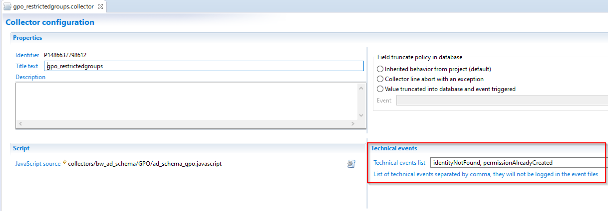

# Data collector logs

Running the collector engine generates two types of logs: a log about functional events and a detailed log file. Logs are generated in the logs directory of the project. Log content is localized.

## Events

Some components can generate events to which the designer of the collector line gives a name. The semantics of events is fixed for the standard components. However, it is possible to trigger an event with a JavaScript function. In this case, the semantics of the event are only known to the creator of the collector line.  

An event consists of a name chosen by the designer of the collector line and of a context (the reference of the component that issued the event and the dataset at the onset of the event). An example of an event is the failure to reconcile an account with an identity in the target account.  

Once an event is triggered, there are two immediate consequences:

- The event is added to the current dataset. This allows us, when the component exits, to test for the presence of the event in the transition to make the execution of the following components conditional.
- The event is saved in a log file whose prefix is event and whose suffix is csv.

This log file is in CSV format so it can be read in a spreadsheet-type tool. It contains at a minimum the name of the event given by the collector line's designer, a descriptive text generated by the component, the name of the component that triggered the event, and a dataset dump at the time the event was detected.  

The log file is only created in the log directory if at least one event is detected. If runtime concludes with no event being triggered, then the log file is not created in the log directory.

### Technical events

In some situation the designer of the data collection line will need to generate technical events that will be used as path conditions. In this case an option has been added to allow the designer to mark these events as technical and  avoid saving them in event the files. This action will reduce the logs I/O and it will allow you to optimize the data loading time.  

  

To set an event as technical open the **Configuration** tab of the collect line where you defined your event and add the event code in **Technical events list** text field, if you have more than one event you have to separate them by comma.

  

## Traces

The implementation of the collector line generates relatively verbose traces in a file. The purpose of these traces is to be able to find the context if a functional problem occurs in the collector line. For this, a turning file mechanism is used, with only two files. Once a file is full, it is renamed and a new file is created.  

With this mechanism, if the collector line processes many records during runtime, the traces from the beginning of runtime are lost. But the purpose of these traces is not to reconstruct everything that has happened since the beginning of runtime, but to have the traces of the latest processes performed on the latest datasets. This allows us to reconstruct the context if a problem occurs and to understand the causes.
