# Filters

## Collector line call

The collector line call component is used to call another collect line.  
It it useful to reuse generic collect line and simplify the presentation of collect lines  

### Collector line call filter

In this property you can see/modify general parameters of the component. You will find:

- the "Identifier" shown in Debug mode for example
- the "Display name" for the collector line source
- Collector line: collect line to call
- the "Follow just one link" option which sets the transition mode. If it is checked, only the first transition with an activation condition evaluated to true will be executed. If it is unchecked, all transitions with an activation evaluation evaluated to true will be executed.


### Collector line call description

Comment regarding actions done by this source component.


### Collector line call configuration

In this section you can override variables values declared in the collector line that the component will call.

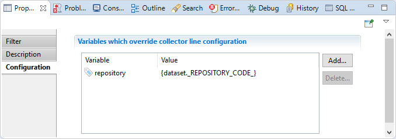

## Enumeration filter

Filter enumeration component is used to iterate on multivalued attributes.  
It is helpful when you have aggregate data in data source file and you need to enumerate before collecting this data in brainwave database.  

### Enumeration Filter Filter

In this section you can see/modify general parameters of the component. You will find:

- the "Identifier" shown in Debug mode for example
- the "Display name" for the discovery source
- the "Follow just one link" option which sets the transition mode. If it is checked, only the first transition with an activation condition evaluated to true will be executed. If it is unchecked, all transitions with an activation evaluation evaluated to true will be executed.

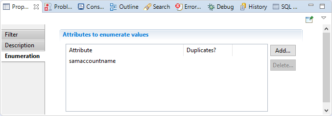

### Enumeration Filter Description

Comment regarding actions done by this component.

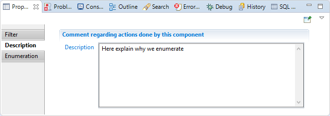

### Enumeration Filter Enumeration

In this section you have to choose multivalued attributes that the component will iterate on, you can also specify if you like to iterate on duplicate values or not.


Example with iterating on several multivalued attributes

Let suppose that the enumeration component will receive the following dataset.  

| Login            | Name      | Domain    | Localization |
|:-------------------- |:---------- |:--------- |:----------- |
| UA12B - UA15C - UA19K | Mark - Aldo | Alta.local | France     |

"Login" is a multivalued attribute having 3 elements.  
"Name" is a multivalued attribute having 2 elements.  
"Domain" is a monovalued attribute (1 element).  
"Localization" is a monovalued attribute (1 element).  

In the "Enumeration" section we will put "Login" and "Name" attributes in "Attribute to enumerate values" table.  

In this case enumeration component will iterate three times, three is the size of biggest multivalued attribute, in this example it is Login attribute.  
The enumeration will send to the next component three separated dataset as below.  

| DataSet  | Login | Name | Domain    | Localization |
|:------- |:---- |:--- |:--------- |:----------- |
| Dataset1 | UA12B | Mark | Alta.local | France     |
| Dataset2 | UA15C | Aldo | Alta.local | France     |
| Dataset3 | UA19K |    | Alta.local | France     |

## Group filter

The data grouping component is useful for gathering several values that were initially separated into several different records in a multivalued attribute. For example, a sharepoint group extraction can provide a CSV file with one line per group member. If a sharepoint group has several members, the group appears on multiple lines with all the information repeated and a different member on each line. To reconstitute a single dataset with a multivalued attribute member from multiple CSV records, you must use the grouping component.  

The grouping component works by detecting ruptures. An expression based on the content of the dataset is set in the component in order to allow it, during the execution of the collector line, to determine when a rupture occurs. In the example with the job, the rupture is when first name and last name change. In this case, enter the expression as follows:  
`{ dataset.GroupID.get() }`  

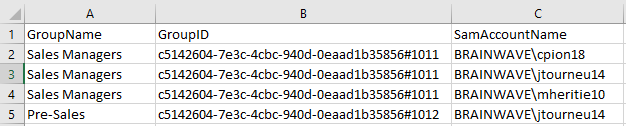

For each dataset arriving in the grouping component, the expression is evaluated. If the result is different from the result of the expression in the previous dataset, this means that the new dataset relates to a different group, otherwise the dataset completes the previous dataset as it is for the same group(same Group ID). This detection is called rupture detection.  

The algorithm used to group the attribute values is as follows:  

For each dataset received by the component

1. Calculate the rupture expression

- If no break is detected (same group in the above example)
  - Aggregation of values of this new dataset (member attribute in the example) in the previous dataset
  - Removal the new dataset to send nothing to the following components
- Otherwise (new group in the example)
  - Emission of the previous dataset towards the following components
  - Memorization of the new dataset as a starting point for the attributes aggregation

This mechanism introduces a desynchronization between the datasets received by the component and the datasets issued after grouping the job attribute to the following components. Indeed, while the second dataset arrives in the component group, the group outputs the first dataset to other components, and so on. With this mechanism, when the last dataset is received, the component emits the next-to-last dataset to the following components. It is only when the collector engine goes into the Flushing state that the grouping component can transmit the last dataset which was waiting for rupture detection.  

According to the example the group component will issue the following data sets to next components  

Dataset1  

| SamAccountName                                       | GroupID                       | GroupName    |
|:---------------------------------------------------------------------- |:--------------------------------------- |:------------- |
| `BRAINWAVE\cpion18` \| `BRAINWAVE\jtourneu14` \| `BRAINWAVE\mheritie10` | c5142604-7e3c-4cbc-940d0eaad1b35856#1011 | Sales Managers |

Dataset2

| SamAccountName      | GroupID                        | GroupName |
|:--------------------- |:---------------------------------------- |:-------- |
| `BRAINWAVE\jtourneu14` | c5142604-7e3c-4cbc-940d-0eaad1b35856#1012 | Pre-Sales |

### Group Filter properties tab

#### Group Filter tab

In this section you can see/modify general parameters of the component. You will find:

- the "Identifier" shown in Debug mode for example
- the "Display name" for the discovery source
- the "Follow just one link" option which sets the transition mode. If it is checked, only the first transition with an activation condition evaluated to true will be executed. If it is unchecked, all transitions with an activation evaluation evaluated to true will be executed.

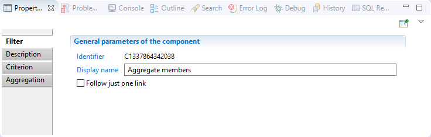

#### Group Filter  Description

Comment regarding actions done by this component.

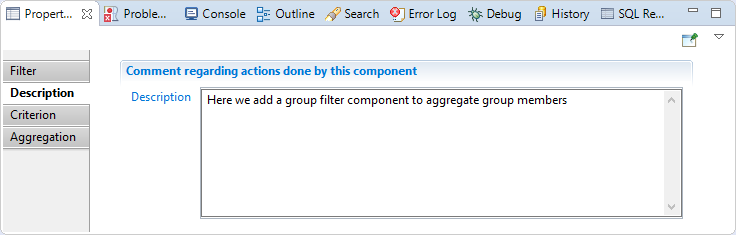

#### Group Filter  Criterion

In this section you can specify the expression that will be used to aggregate data


#### Group Filter  Aggregation

In this section you have to choose attributes where values will be grouped, attributes chosen must be multivalued.

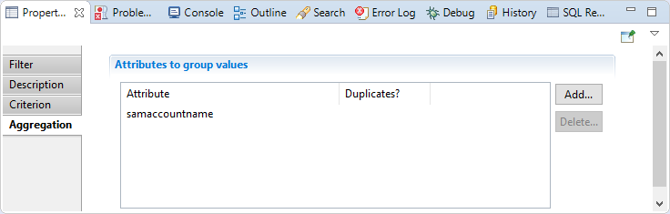

### Group Filter  Best practices

The data must be sorted by attributes used in the criterion, for example if your criterion is `{dataset.name().get()} + ' ' +dataset.surname().get()}`, you must order your source by name than by surname.

## Route filter

The route component does nothing, but it allows to add an ending point to follow the dataset content returned by the source collector line.

### Route filter The properties Tab

#### Route filter Filter

In this section you can see/modify general parameters of the component. You will find:

- the "Identifier" shown in Debug mode for example
- the "Display name" for the collector line source
- the "Follow just one link" option which sets the transition mode. If it is checked, only the first transition with an activation condition evaluated to true will be executed. If it is unchecked, all transitions with an activation evaluation evaluated to true will be executed.

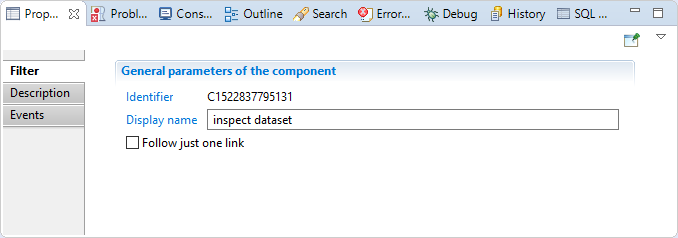

#### Route filter Description

Comment regarding this route component.

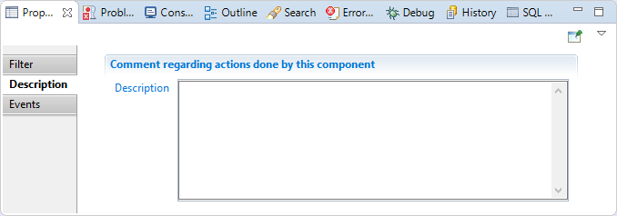

#### Route filter Events  

In this section you can configure the route component to trigger an event each time a dataset is transmitted and forward that event to the next component if desired  


## Join filter

This property allows to join two sources, in order to obtain a dataset containing information from both sources.  

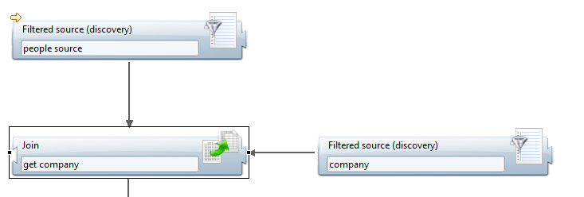  

It has two distinct modes of operation (cache is enabled or not) which are detailed in the section Operating mode below.  

### Join filter properties Tab

#### Join filter tab

In this tab you can see/modify general parameters of the component. You will find the following:

- Identifier (shown in Debug mode for example)
- Display name for the Join filter
- Follow just one link option which sets the transition mode. If it is checked, only the first transition with an activation condition evaluated to true will be executed. If it is unchecked, all transitions with an activation condition evaluated to true will be executed.

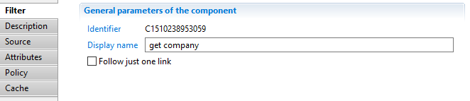  

#### Join filter Description

This property allows adding comment regarding actions done by this component.

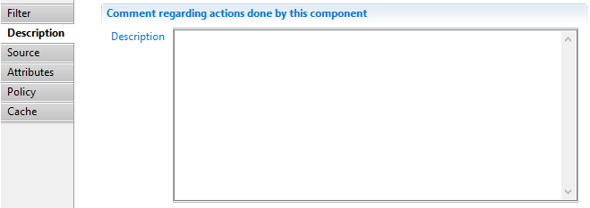  

#### Join filter Source

This property allows to select which one of the two attached sources is the secondary one, i.e. the source used to augment the dataset.  

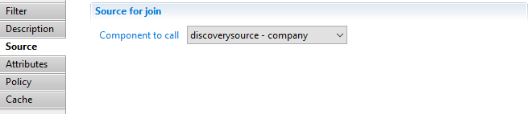  

#### Join filter Attributes

This property allows to map attributes of the secondary dataset to attributes of the main dataset.  

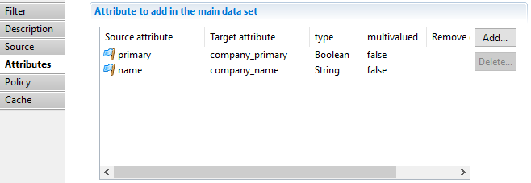  

For example, in this case, the name attribute of the secondary source (discoverysource - company_) will be added to the main dataset under the name company\name.  

#### Join filter Policy

This property allows to specify the behavior of the join when less than one or more than one records of the secondary dataset matches.  

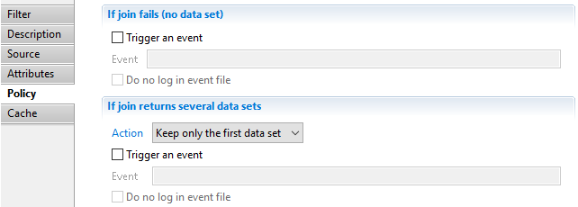  

#### Join filter Cache

This property allows to specify the behavior of the cache (see next section).

  

### Join filter Operating modes

#### Join filter with cache activated

When the cache is active, you need to specify both the Key attribute from main dataset and the Key attribute from secondary dataset whose values will then be matched by equality. The secondary source is iterated once and the key and corresponding dataset are kept in a cache. When the main source records are retrieved, the cache is examined to see if there exists a corresponding dataset (less than one or more than one matches are handled accordingly to the Policy property described above). If such a dataset is found, the main and secondary datasets are merged according to the Attributes property described above.  

#### Join filter with cache deactivated

When the cache is not active, for each record of the main source, the secondary source is fully iterated, each records being merged to the main dataset according to the Policy and Attributes property. In the secondary source, you should provide a SQL syntax request in the Request property. In this request, the attributes of the main dataset are available under the param namespace.  
For example, the request  
`SELECT * FROM dataset WHERE dataset.id LIKE UPPER(param.id) + '%'`

in the secondary source will match when the id attribute of the main source (param.id) is "acme" and the id attribute of the secondary source (dataset.id) is "ACME123".  

### Join filter Best practices

The cache should  **always** be enabled as the performance impact of its deactivation is severe (the secondary source is iterated for each dataset of the main source). If you have complex matching rules, for example matching on more than one attributes, it will always be more efficient to activate the cache and use computed attributes (either at the discovery level or using an update filter) as the matching attributes.

## Script filter

This source can be used to programmatically update datasets using JavaScript functions.

### Script Filter tab

In this tab you can see/modify general parameters of the component. You will find the following:

- Identifier (shown in Debug mode for example)
- Display name for the Support target
- onScriptInit is the initialization JavaScript function. It is called only once per collect line
- onScriptWrite is the function which will be called for each record of the main source. It can manipulate the dataset, adding or removing attributes, changing values
- onScriptFlush is a function which is called when no more record is available from the main source. It must return true if it populated the dataset, false otherwise  
- onScriptTerminate is the function called when the collect line ends successfully  
- onScriptDispose is the function called at the end of the collect line. It is always called, whether the line ends successfully or not, and should be used to free all the resources allocated during the initialization phase (close files, database connections and so on)  
- Follow just one link option which sets the transition mode. If it is checked, only the first transition with an activation condition evaluated to true will be executed. If it is unchecked, all transitions with an activation condition evaluated to true will be executed.

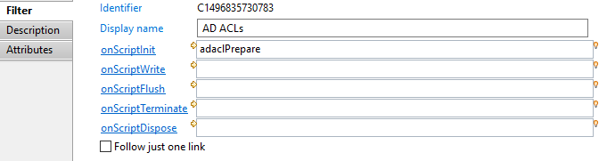  
Note that all the onScript... functions are optional.

### Script Filter Description

This property allows adding comment regarding actions done by this component.  

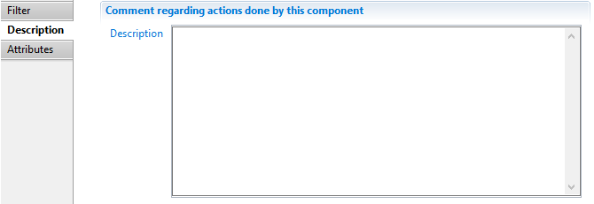  

### Script Filter Attributes

This property can be used to declare additional attributes to include in the collect line schema, for example when attributes are injected to the dataset by the JavaScript write function.  

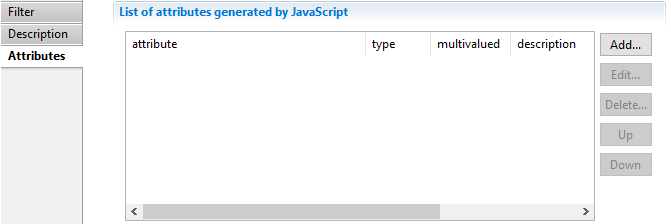

## Update filter

The **Update filter** component is an all-purpose collect component that allows to modify the collect current dataset in various ways.  
13 common tasks can be done directly by configuration only.  
More complex modifications can be achieved programatically using javascript.

The common tasks are the following:

- add new attribute, rename, duplicate or delete an attribute
- modify single-valued attribute: modify the value, replace all occurrences of one value with another, set default value if attribute is empty, convert a String attribute to a Date attribute
- manipulate multi-valued attributes: cleaning, adding values, filtering values, replacing values  
- change the silo name attribute

The update will be performed on each and every row of this collect.

### Update filter properties tab

#### Update filter Filter tab

The **Filter** property tab allows to view/modify basic parameters of the component:  

- **Identifier** displays the internal identifier of the component, useful in debug mode or for reading collect log files.
- **Display name**  for the **Update filter** , to be displayed in the collector editor.
- **Follow just one link**  option defines how multiple transition collects are being processed.  
If checked, only the first transition with an activation condition evaluated to true will be executed.  
If unchecked, all transitions with an activation condition evaluated to true will be executed.


#### Update filter Description tab

The **Description** property tab allows adding notes on the component, such as description of what the component is doing.

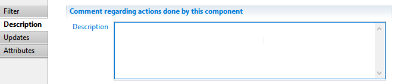

#### Update filter Updates tab

The Updates tab allows to display and modify the list of update operations in this component.  

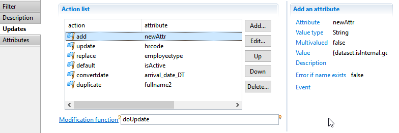  

You can carry out the following tasks:

- **Add** allows to add a new operation through configuration wizard.  
You can select from 13 different actions.  
The various actions are detailed in the following sections.  

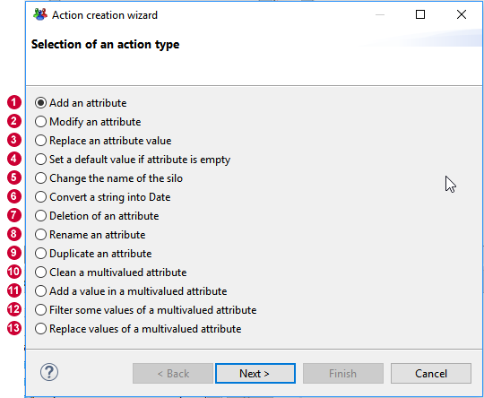  

- **Edit** allows modifying the currently selected operation
- **Up / Down** allows to reorganize actions processing order. First actions are executed first.
- **Delete** deletes the currently selected action from the list.  
- The right panel displays details on the selected action
- **Modification function** allows creating or selecting a javascript function to perform the modifications. See section below for details.

The sections below details the 13 operations plus javascript based update operation.

##### Add an attribute

This action allows to define a new named attribute in the dataset, with an initial computed value.  
The attribute can be used in further actions and in other components of the collect.  
The attribute will be added to the end of the list. It can be moved towards the beginning using **Up** button.

- **Attribute** defines the unique name of the attribute withing the current dataset.
- **Value Type** sets the type of the attribute. The following types are valid: String, Number, Boolean and Date.
- **This attribute can be multivalued** determines whether the attribute is single valued or multi-valued.  
Multi-valued attributes are like varying size lists.
- **Value** sets an initial computed Macro expression value for the new attribute. a Macro is a mix of static (string) and javascript expressions enclosed in braces.  
Read more on Macros: [03 Macros et scripts](../05-macros-and-scripts).
- **Description** is an optional description of the purpose of this attribute
- **Trigger an error if the attribute to add already exists**  option will trigger an error in the log event file if an attribute with the same name already exists in the dataset.  
If checked, **Event** lets you define the specific event name to trigger

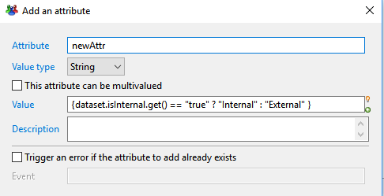  

##### Modify an attribute

This action allow you to set a new value for an existing attribute.

- **Attribute** selects the attribute to be modifed from the dataset. Use the right arrow menu to select an attribute
- **Value** defines the new value using a -Macro- expression. Read more on Macros: [Macros et scripts](../05-macros-and-scripts)  
- **Trigger an error if the attribute to modify does not exist**  option will trigger an error in the log event file if the attribute to select was dynamically removed without notice ( this should not normally occur)  
If checked, **Event** lets you define the specific event name to trigger

  

##### Replace an attribute value

This action allow you to replace an occurrence of a value for a given single-valued attribute by another value.  
If the attribute contains another value, its value is not modified.

- **Attribute** selects the attribute from the dataset for which values should be replaced. Use the right arrow menu to select an attribute
- **Old Value** sets the value to search and replace. This is a static value that will be interpreted based on the attribute type.
- **Value** defines the new value using a -Macro- expression. Read more on Macros: [Macros et scripts](../05-macros-and-scripts)  
- **Trigger an error if the attribute to modify does not exist**  option will trigger an error in the log event file if the attribute to select was dynamically removed without notice ( this should not normally occur)  
If checked, **Event** lets you define the specific event name to trigger

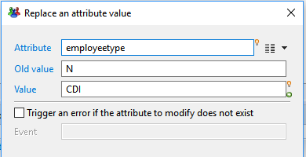  

##### Set a default value if an attribute is empty

This action allow you to set a default value for a given attribute if its current value is null or empty string.

If the attribute value is not null, it's not modified.

- **Attribute** selects the attribute to be modifed from the dataset. Use the right arrow menu to select an attribute
- **Value** defines the default value using a -Macro- expression. Read more on Macros: [Macros et scripts](../05-macros-and-scripts).
- **Trigger an error if the attribute to modify does not exist**  option will trigger an error in the log event file if the attribute to select was dynamically removed without notice ( this should not normally occur)  
If checked, **Event** lets you define the specific event name to trigger

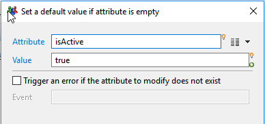  

##### Change the name of the silo

This actions allows to change  on-the-fly the dynamic name of the silo, that is the value of `config.siloName_variable`.  
This could be useful for example if several input files are gathered into one single source file and must be processed in the same collect line.  

- **Value** defines the value for the dynamic silo name as a -Macro- expression. Read more on Macros: [Macros et scripts](../05-macros-and-scripts).

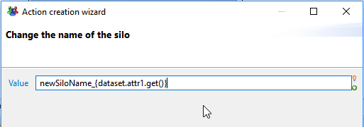  

##### Convert a string to a date

This action is a shortcut to create a new Date attribute based on the string value of another, and using a date-time conversion format.

- **Attribute to convert** lets you select the source attribute which value will be converted. The attribute can be of any type.
- **New name** lets you set the name for the newly created date attribute.
- **Format** lets you set the conversion format to use. You can either select a predefined format from the right list, or type a custom format using y M d H.
- **Description** lets you set an optional description for the new attribute stating its purpose.

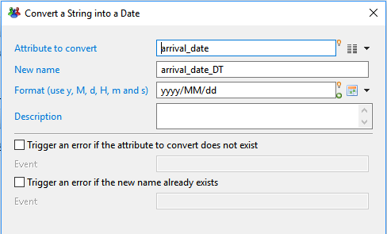  

##### Deletion of an attribute

This action allows you to dynamically remove an existing attribute from the current dataset.  
Once deleted, the attribute won't be available in further actions or collect components.

- **Attribute to delete** lets you select the attribute to delete from the dataset.  

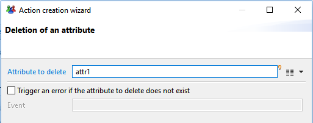  

##### Rename an attribute

This action allows you to give a new name to an existing attribute from the current dataset. Values are kepts unchanged but will be accessed through the new name.

- **Attribute to rename** lets you select the attribute to modify from the current dataset.
- **New name** is the new name for the attribute. This new name must not exist already in the dataset.

  

##### Duplicate an attribute

This action allows you to duplicate an attribute with a different name and the same initial values.

- **Attribute to duplicate** lets you select the attribute to duplicate from the current dataset.
- **New name**  is the name for the duplicate attribute. This new name must not exist already in the dataset.

  

##### Clean a multivalued attribute

This action allows you to clean up multivalued attributes by removing empty or null values and/or duplicate values.  
It can also synchronize other multivalued lists with the removed rows.

- **Attribute** lets you select the attribute to clean up. only multivalued attributes can be selected.
- **Remove empty of null values**  option determines if null or empty values should be removed from the list of values of the attribute
- **Remove duplicate values** option determines if duplicate values should be removed from the list, keeping only the first occurrence of each
- **Attribute1,Attribute2,Attribute 3**  lets you select up to 3 other multivalued attributes, of the same size, that should be kept in sync with the cleaned attribute.  
That is, for each row index that was removed from the list ( because it was null/duplicate), the same row index will be removed from the synchronized list.  

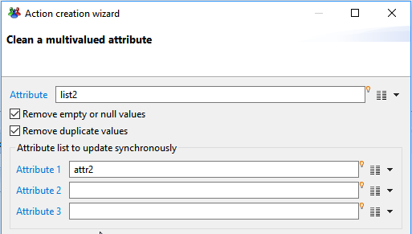  

##### Add a value in a multivalued attribute

This actions allows to add one or move values to a multivalued attributes, either from another single or multivalued attribute, or from a computed value.

- **Attribute**: lets you select the multivalued attribute to modify. Only multivalued attributes can be selected.
- **Add an attribute** : lets you optionally select another attribute ( single or multivalued) from which values should be copied. If empty, the attribute is ignored
- **Value**: optionally define an macro expression which value will be added to the list. the value computed by the macro expression must be of the same type as the list to modify.  
If empty, this field is ignored.  
- **Do not add values if they already exist**  option determines whether values that already exist in the list can be added. If checked, duplicates values are not added.

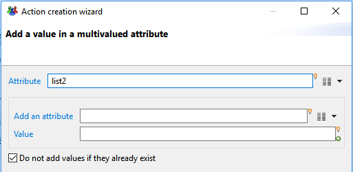  

##### Filter some values of a multivalued attribute

This action allows you to filter values from a list attribute, matching a given condition.  
It can also synchronize other multivalued lists with the removed rows.

- **Attribute** lets you select the multivalued attribute to filter. only multivalued attributes can be selected.
- **Keep matching values** option determines that the values in the list matching the condition will be kept and the values not matching will be removed from the list
- **Remove matching values** option on the opposite, that the values in the list not matching the condition will be kept and the values matching will be removed from the list  

There are 3 possible matching conditions:  

**Another attribute**: compares the elements in the list with the value(s) of another attribute

- If the attribute to match is single-valued, items that are equal to the matching attribute single value will be selected
- If the attribute to match is multi-valued, items that are equal to any value in the matching attribute values will be selected.

**Attribute**: select another attribute to match. This could be either a single-valued or multi-valued attribute  

**Computed expression**: compares the elements in the list with the value of a macro expression.

- Items in the list that are equal to the value of the computed expression will be selected

**Value**: type a macro expression , which value will be compared to each item in the list. Read more on Macros: [Macros et scripts](../05-macros-and-scripts).

**Pattern**: matches the elements in the list against a regular expression pattern.

- Items in the list that that match the pattern will be selected. Syntax of the regular expression pattern follows javascript RegExp syntax.  

**Regular Expression**: type a valid regular expression pattern

**Test Value**: helper field, to test your regular expression. If the test value does not match the regular expression, a message "Test value does not match the regular expression" is displayed

**Attribute1,Attribute2,Attribute3**  lets you select up to 3 other multivalued attributes, of the same size, that will be kept in sync with the filtered attribute. That is, for each row index that was removed from the list ( according to filtering conditions), the same row index will be removed from the synchronized lists.

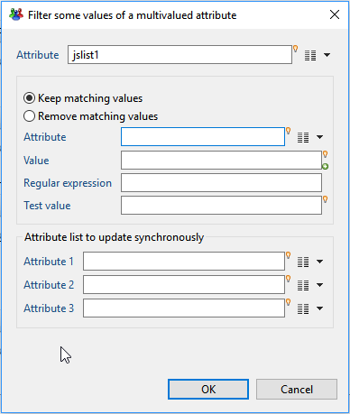  

##### Replace values of a multivalued attribute

This action allows you to replace all values from a list attribute with another static or computed value.

- **Attribute** lets you select the multivalued attribute to be processed. only multivalued attributes can be selected.
- **Value** defines the replacement value for each item using a -Macro- expression. Read more on Macros: [Macros et scripts](../05-macros-and-scripts).

> The replacement value can use the original value of each item in the list.  
> In this case, the original value will be available as a single-valued attribute with the same name.
> For example, to capitalize all values in a multivalued attribute called list1, you would use the following expression: `{dataset.list1.get().toUppercase()}`

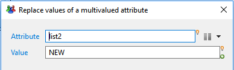  

##### Javascript modification

This fields allows you to use a javascript function to perform the modifications.

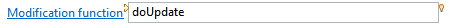  

**Modification function**: Name of the function that performs the modifications, without parentheses.  
This function must have an empty signature.

Here is an example of function:

```javascript
function doUpdate() {
 // add new attribute
  dataset.add("computedAttr" );

  var value = null;
  switch(dataset.type.get()) {
  case "A": value = "John"; break;
  case "B": value = "Michael"; break;
  case "C": value = "Eric" ; break;
  case "D": value = "La reponse D"; break;
  }
  dataset.get("computedAttr").set(value);
}
```

If both configuration actions and a javascript modification function are defined, the javascript function will be executed after the configuration actions.

#### Update filter Attributes Tab

The **Attributes** tab allows to declare dataset attributes that may have been created inside the javascript modify function.  
When using a javascript function to perform the modifications, you may have to create new attributes using **dataset.add()** API.  
In this case, you need to decleare them , so that they are known by the collector and can be used in further components.

  

### Update filter Best practices

Always try to perform your modifications using an existing predefined update, before using javascript. This will ensure the modifications are done in the most efficient way.

Data qualify modifications that apply directly to source attributes should be preferably be done in the discovery.

## Validation filter

This filter component allows to add validation rules to some dataset. When one of these rules fails for a dataset, it will be possible to emit an event (but will still pass the filter).

### Validation filter tab

In this tab you can see/modify general parameters of the component. You will find the following:

- Identifier (shown in Debug mode for example)
- Display name for the Validation filter
- Follow just one link option which sets the transition mode. If it is checked, only the first transition with an activation condition evaluated to true will be executed. If it is unchecked, all transitions with an activation condition evaluated to true will be executed.

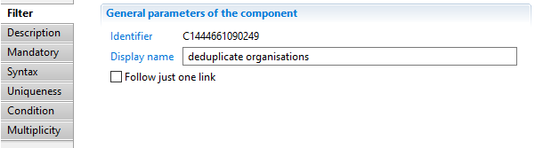

### Validation filter Description

This property allows adding comment regarding actions done by this component.  

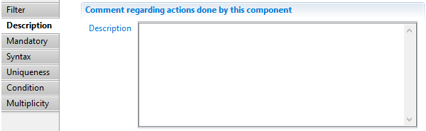

### Validation filter Mandatory

This property allows to specify that some given attributes of the dataset must be present and not empty.  

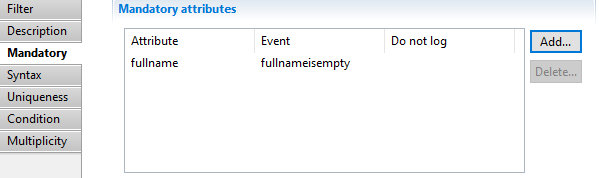  

An attribute can be added with the following dialog:  

  
Here you specify which attribute must not be empty, the name of the event (will default to "error" if not specified) and if the event should appear in the event file or not.  

### Validation filter Syntax

This property allows to specify that some attributes must match some regular expressions.  

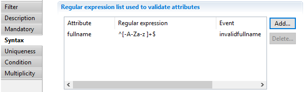  

A condition can be added with the following dialog:  

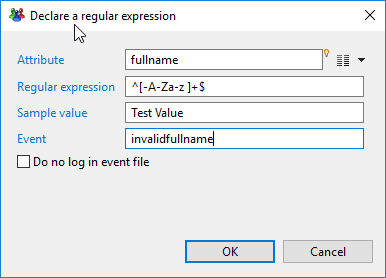  
Here you specify the attribute, the regular expression it must match, the name of the event (will default to "error" if not specified) and if the event should appear in the event file or not.  
The field Sample value can be used to test the regular expression.  

### Validation filter Uniqueness

In this property, you can specify up to 3 attributes whose values must be unique among the source.  

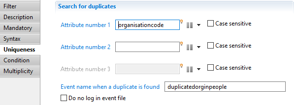  
You can also indicate the name of the event (will default to "error" if not specified) and if the event should appear in the event file or not.  

### Validation filter Condition

Here you can specify a condition on the dataset as a JavaScript function returning a boolean.  

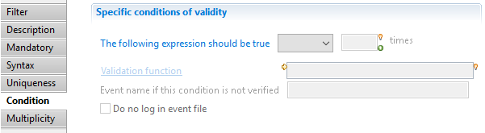  

Validation Function is the name of a JavaScript function written in the .javascript file associated with this collector line.  
You can also indicate the name of the event (will default to "error" if not specified) and if the event should appear in the event file or not.  

### Validation filter Multiplicity

Using this property, you can specify a maximum or minimum number of records propagated by this filter.  

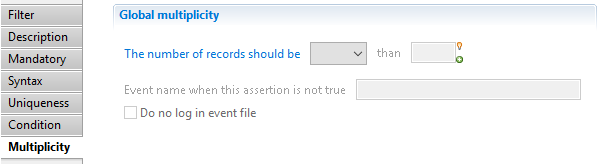
