# Sources

## Collector line source

The collector line source allows the product to read data that will be filtered by an existing collect line.

### Collector line source properties Tab

#### Collector line source tab

In this sub-tab it is possible to see/modify general parameters of the component. You will find:

- The "Identifier" shown in Debug mode for example
- The "Display name" for the collector line source
- Collector line: collect line to use as a data source
- The "Follow just one link" option which sets the transition mode. If it is checked, only the first transition with an activation condition evaluated to true will be executed. If it is unchecked, all transitions with an activation evaluation evaluated to true will be executed.

  

#### Collector line source Description

This section allow the configuration of comments regarding actions done by this source component.

  

#### Collector line source Configuration

This section allows the user to override variables defined in the collector line.

  

#### Collector line source Request

SQL syntax request: is an sql-like select query to filter source records.

The query may check values from current record by using dataset variable as if it was a table.

For example, `SELECT * FROM dataset WHERE dataset.hrcode <> 'VIP'` keeps only records which have a HR code attribute with a value different from 'VIP'.  

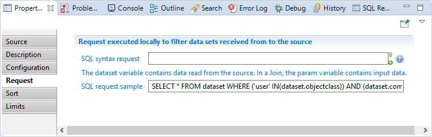

#### Collector line source Sort

In this section you can configure a multi-criteria sort. You will find:

- Sort number 1 (main sort criteria): Attribute name used to sort all source records before delivering them to the collector line in the right order.  
- Sort number 2 (Second sort criteria): Attribute name used to sort all source records before delivering them to the collector line in the right order.  
- Sort number 3 (Third sort criteria): Attribute name used to sort all source records before delivering them to the collector line in the right order.  

The sort direction can also be changed (A-Z for ascending or Z-A for descending).

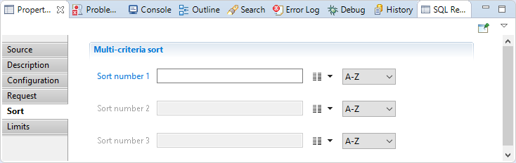

#### Collector line source Limits

In this section you can configure a limitation on the selected records from the source, You will find:

- Skip the `nb` first records: Used to select a subset of the records by skipping the first records.  
- Select a maximum of `max` records: Used to select a subset of the records by reading only a specified number of records.

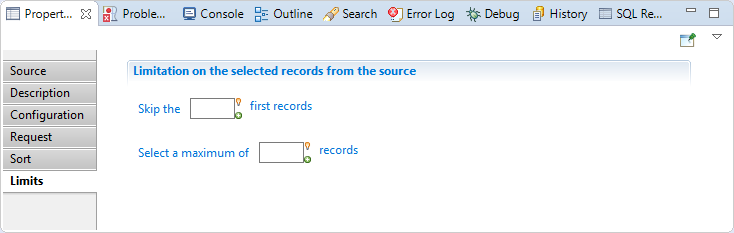

### Collector line source Best practices

You may have a performance issue when using a limit and/or a sort.

## Filtered source (Discovery)

The Filtered discovery source allows the product to read data that will be filtered by an existing discovery.  

This is the main source type to use when building your collector lines as the modification of the input data is done in the the discovery file, and the collector line can they simple be used to map the various imported data to the concepts of Brainwave GRC's model.  

### Discovery The properties Tab

#### Discovery Source

In this property you can see/modify general parameters of the component. You will find:

- The "Identifier" shown in Debug mode for example
- The "Display name" for the discovery source
- Discovery file: the discovery file to use as a data source
- Data file is the absolute path of data file to load. This parameter allow the use of macros such as `{config.projectPath}`. This parameter is optional, and if empty then the file defined in the discovery file is used.  
- The "Follow just one link" option which sets the transition mode. If it is checked, only the first transition with an activation condition evaluated to true will be executed. If it is unchecked, all transitions with an activation evaluation evaluated to true will be executed.

#### Discovery Description

This property allows adding comment regarding actions done by this component.

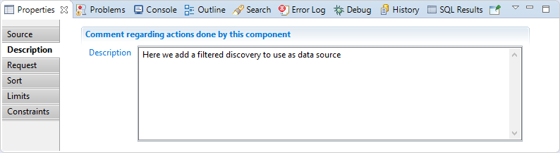

#### Discovery Request

SQL syntax request: is an sql-like select query to filter source records.

The query may check values from current record by using dataset variable as if it was a table.

For example, `SELECT * FROM dataset WHERE dataset.hrcode <> 'VIP'` keeps only records which have a HR code attribute with a value different from 'VIP'.

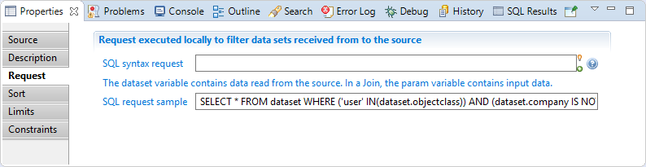

#### Discovery Sort

In this section you can configure a multi-criteria sort. You will find:  

- Sort number 1 (main sort criteria): is attribute name used to sort all source records before delivering them to the collector line in the right order.  
- Sort number 2 (Second sort criteria): is attribute name used to sort all source records before delivering them to the collector line in the right order.  
- Sort number 3 (Third sort criteria): is attribute name used to sort all source records before delivering them to the collector line in the right order.  

The sort direction can also be changed (A-Z for ascending or Z-A for descending).

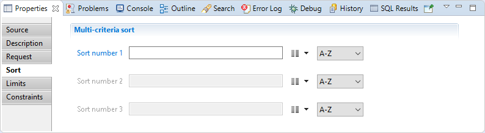

#### Discovery Limits

In this section you can configure a limitation on the selected records from the source, You will find:

- "Skip the `nb` first records": Used to select a subset of the records by skipping the first records.  
- "Select a maximum of `max` records": Used to select a subset of the records by reading only a specified number of records.

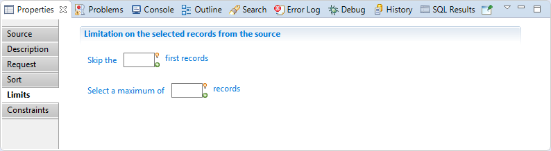

#### Discovery Constraints

In this section you can define constraints to not use the file, You will find:

- "If file size is less than `size` kilo bytes": Triggers an exception and stops collector line if the source file size is less than a specified number of kilo-bytes. Used to prevent from reading an incomplete file in automatic mode because of an error during a file transfer for example.  

- "If last modification date is older than `modifDate` hour(s)": Triggers an exception and stops collector line if the source file last modification date is older than a specified number of hours. Used to prevent from reading an obsolete file in automatic mode because of an error during the export process for example.  

- "If a column is missing in the file": Triggers an exception and stops collector line if the file schema is different from the schema defined in the source component. Used to prevent from reading a file with a bad format in automatic mode because of a format or layout change in the exported data for example.

### Discovery Best practices

You may have a performance issue when using a limit and/or a sort.

## Script source

This source can be used to programmatically generate datasets from JavaScript functions. It can be used to access external resources or parse files whose format is not supported by the discovery source.  

### Script source The properties Tab

#### Script source Source

In this tab you can see/modify general parameters of the component. You will find the following:

- Identifier (shown in Debug mode for example)
- Display name for the Support target
- File to analyze is an optional path to a file  
- onScriptInit is the initialization JavaScript function. It can take a parameter which will be the file specified just above. It is called only once per collect line  
- onScriptReset is a function which will only be called if this component is the secondary source of a join filter having its cache disabled. In this case, it will be called once for each record of the main source  
- onScriptRead is the function which will be called to get the next record. It can manipulate the dataset, adding or removing attributes, changing values. It must return true if there are more records to read, false otherwise  
- onScriptTerminate is the function called when the collect line ends successfully  
- onScriptDispose is the function called at the end of the collect line. It is always called, whether the line ends successfully or not, and should be used to free all the resources allocated during the initialization phase (close files, database connections and so on)  
- Follow just one link option which sets the transition mode. If it is checked, only the first transition with an activation condition evaluated to true will be executed. If it is unchecked, all transitions with an activation condition evaluated to true will be executed.

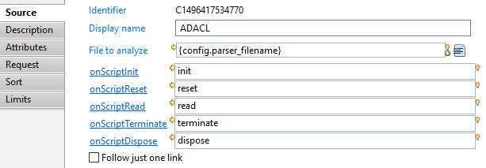  
Note that all the onScript... functions are optional.  

#### Script source Description

This property allows adding comment regarding actions done by this component.

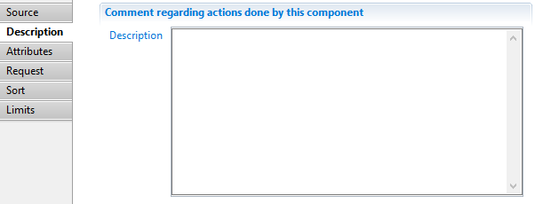

#### Script source Attributes

This property can be used to declare additional attributes to include in the collect line schema, for example when attributes are injected to the dataset by the JavaScript read function.

#### Script source Request

SQL syntax request: is an sql-like select query to filter source records.  

The query may check values from current record by using dataset variable as if it was a table.  

For example, `SELECT * FROM dataset WHERE dataset.hrcode <> 'VIP'` keeps only records which have a HR code attribute with a value different from 'VIP'.

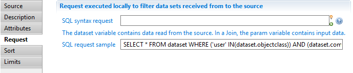

#### Script source Sort

In this section you can configure a multi-criteria sort. You will find:

- Sort number 1 (main sort criteria): Attribute name used to sort all source records before delivering them to the collector line in the right order.  
- Sort number 2 (Second sort criteria): Attribute name used to sort all source records before delivering them to the collector line in the right order.  
- Sort number 3 (Third sort criteria): Attribute name used to sort all source records before delivering them to the collector line in the right order.  

The sort direction can also be changed (A-Z for ascending or Z-A for descending).

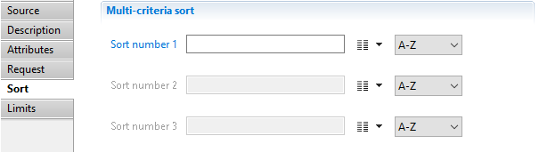

#### Script source Limits

In this section you can configure a limitation on the selected records from the source, You will find:

- Skip the `nb` first records: Used to select a subset of the records by skipping the first records.  
- Select a maximum of `max` records: Used to select a subset of the records by reading only a specified number of records.

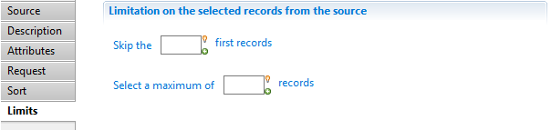

### Script source Best practices

This source should only be used in very specific cases where a discovery source is not suitable. These include (but are not limited to) external resources such as a REST API, a database connection or some "flat" XML files.

In the other cases, a filtered source (discovery) will be much more efficient and maintainable.

### Script source Error handling  

Any exception raised during the execution of one of the JavaScript functions will cause the collect engine to stop. The exception is logged in the collect log file.

## Sheet enumerator for Excel file source

This source component allows to enumerate the sheets belonging to an Excel workbook.  

Four attributes are added to the dataset:  

- filename will be the file name of the Excel file (string),  
- sheetname will contain the name of the current sheet (string),  
- sheetnumber will contain the index number of the current sheet (number),  
- totalnumberofsheets will contain the total number of sheets of the Excel workbook (number).  

### Sheet enumerator Source

In this tab you can see/modify general parameters of the component. You will find the following:

- Identifier (shown in Debug mode for example)
- Display name for the target
- Excel File (XLS, XLSX) is the path to the Excel file to use  
- Follow just one link option which sets the transition mode. If it is checked, only the first transition with an activation condition evaluated to true will be executed. If it is unchecked, all transitions with an activation condition evaluated to true will be executed.

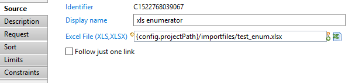

### Sheet enumerator Description

This property allows adding comment regarding actions done by this component.  

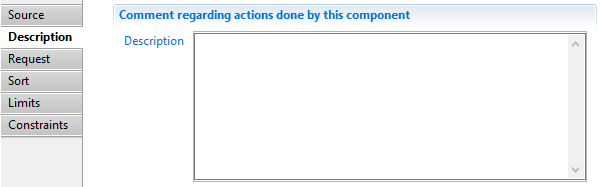

## Start

The Start component is used to start a collector line without necessarily having a data source, it is useful when using collection sequences.  

Example: to create model object, such as repositories, applications and so on, that are based on data declared in the project or in a silo and not in import files.  

### Start properties Tab

#### Start Source

In this sub-tab you can see/modify general parameters of the component. You will find:

- The "Identifier" shown in Debug mode for example
- The "Display name" for the discovery source
- The "Follow just one link" option which sets the transition mode. If it is checked, only the first transition with an activation condition evaluated to true will be executed. If it is unchecked, all transitions with an activation evaluation evaluated to true will be executed.

#### Start Description

Allows the addition of comments regarding actions done by this source component.

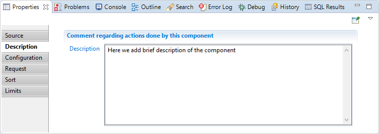

#### Start Configuration

In this section you can override the values of variables used in the collector line.

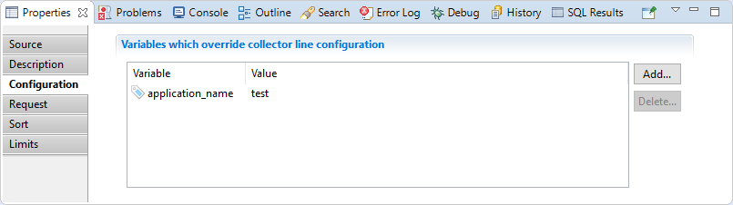

#### Start Request

SQL syntax request: is an sql-like select query to filter source records.

The query may check values from current record by using dataset variable as if it was a table.

For example, `SELECT * FROM dataset WHERE dataset.hrcode <> 'VIP'` keeps only records which have a HR code attribute with a value different from 'VIP'.

#### Start Sort

In this section you can configure a multi-criteria sort. You will find:

- Sort number 1 (main sort criteria): Attribute name used to sort all source records before delivering them to the collector line in the right order.  
- Sort number 2 (Second sort criteria): Attribute name used to sort all source records before delivering them to the collector line in the right order.  
- Sort number 3 (Third sort criteria): Attribute name used to sort all source records before delivering them to the collector line in the right order.  

The sort direction can also be changed (A-Z for ascending or Z-A for descending).

#### Start Limits

In this section you can configure a limitation on the selected records from the source, You will find:

- Skip the `nb` first records: Used to select a subset of the records by skipping the first records.  
- Select a maximum of `max` records: Used to select a subset of the records by reading only a specified number of records.

### Start best practices

You may have a performance issue when using a limit and/or a sort.

## View source 

The **View Source** component enables the use of view result as a input during the data collection phase. This component can be use to use data that is not related to the current timeslot.  
One use case is to inject Audit Logs data through a Logs Views source to compute Usage data.  
Another use case is to retrieve right reviews data (through a View source on Ticket Reviews) to collect theoretical rights.

> The view source should be used with caution on regular Ledger Entities, such as accounts, applications, and identities, as the underlying view retrieves data from the **previous** timeslot.

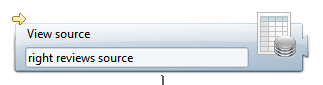

### View Source Properties tab

#### View Source tab

This tab lets you select the view to be used, and set parameters if needed.

- **Source view** : select the view to use as a source. This could be either an audit view, a business view or a logs view
- **Parameters** : you can set parameters to the view if needed.  
To set a parameter, click Add button, select a parameter for the list and set a view.

#### View Source Limits tab

This tab lets yous optionally set limits to the results of the view. You can skip rows and/or limit the maximum number of results returned by the view

- **Skip** : type a number to skip the first records of the view. If left blank, not records are skipped.
- **Select maximum** : type a number to limit the maximum number of records that will be returned by the view. Leave blank to return all records.

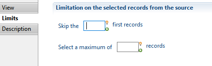

#### View Source Description tab

This tab lets you put a description on the purpose of this component.

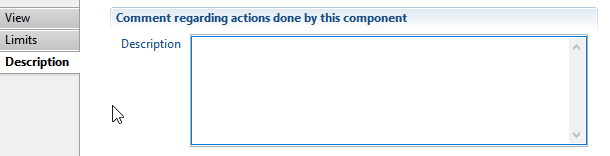

### View Source Best practices

- View Source should be used on data that is **not related** to a given timeslot, such as Audit Logs, Tickets, Ticket actions and Ticket Reviews,
- View Source should be used with caution on regular Ledger entities (such as accounts, applications, identities) because the view executes against the previous timeslot, which means the results will be inaccurate if entities have changed. View Sources do not retrieve data from the current sandbox.

### View Source Theoretical rights example

One approach to defining the theoretical rights of people in the Ledger (i.e. what rights people are expected possess in a given application) is through rights reviews: Basically, you use the manual reviews settings (set by the reviewers) to create the theoretical rights matrix.

Rights reviews (associations between a person or a group of persons and an application) end up as ticket reviews objects in the Ledger, with a specific type.  

The collector will consist of the following components:  

- a **View Source** referring to a view that will retrieve all ticket reviews of a specific type (e.g. PERMISSIOSNREVIEW) with the associated people/application information.
- An **Update Filter** component that will set various attributes (e.g. right type) to ensure the adequate Entitlement Model rules are executed
- A **Theoretical rights target**  component to store the rights matrix.
