# Data collector targets

## Account target

This target allows you to create accounts in the ledger

From collect editor select _Account target_ in _Ledger targets._


### Account target properties Tab

#### Account target tab

In this property you can view/edit general parameters of the component. You will find the _Identifier_ (shown in Debug mode for example), _Display name_ for the _Account target_ and the _Follow just one link_ option.  

This option sets the transition mode. If it is checked, only the first transition with an activation condition evaluated to true will be executed. If it is unchecked, all transitions with an activation evaluation assessed to true will be executed.

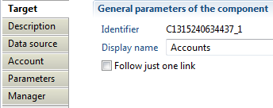

#### Account target Description

The description property permits a user to add comment regarding actions done by this component.

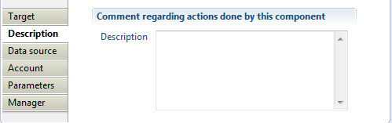

#### Account target Data source

In this property, you can select the attribute containing the repository key. This repository will hold collected accounts, repository must exist in database.

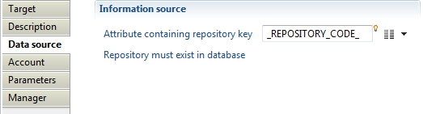

#### Account target Account

With this property, you will define the product behavior when importing account such as:

- _"Attribute containing account key"_ which must contain a unique identifier for the account in current used repository, for example _DistinguishedName_ in case of Active Directory accounts.
- _"Trigger an error if account key is null or empty"_ option to activate an event that will be generated when the attribute containing account key is null or empty (event shown in dedicated logs).

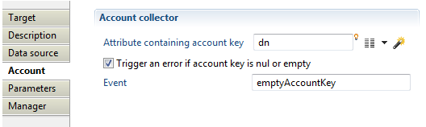

#### Account target Parameters

With this property you will define mapping between account properties (Ledger) and attributes from dataset.

- _Field:_  contains account attribute available in Ledger.
- _Attribute:_ contains account attributes in data set.

Available fields are login, guid, sid, profile, givenname, surname, username, employeenumber, mail, manager, creationdate, lastlogindate, passwordlastsetdate,expiredate, nextpwdchangedate, service, disabled, locked, logincount, badpasswordcount, passwordnotrequired, passwordcantchange, notnormalaccount, dontexpirepassword, passwordexpired, smartcardrequired, noownercode, noownerreason, custom 1--\>39, reference type 1 --\> 9, reference value 1--\>9

Below is presented an Example based on _ActiveDirectory_ account parameters:

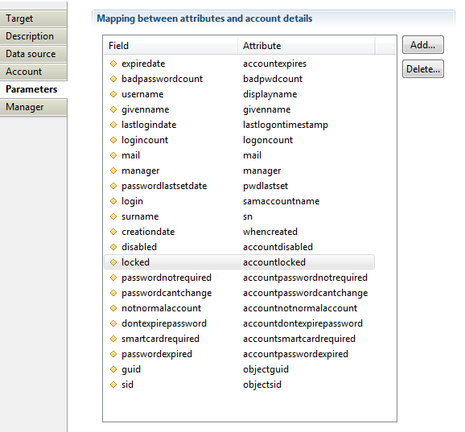

> [!warning] From **IGRC 2017 R3** the **notnormalaccount** attribute became **deprecated** and is replaced by the new attribute **privilegedaccount**.  
> For new projects under IGRC 2017R3 and higher It is recommended to use privilegedaccount instead of notnormalaccount attribute.

#### Account target Manager

Here you can indicate which attribute contains account manager. If enabled, the following options are available:

- "Manager data is an account identifier" : if enabled, a loaded manager will be assigned to the account
- "Copy manager information into the identity owning this account" : if additionally checked, the associated account manager will be also the manager of identity that owns the account identifier  
- _"Trigger an error if the manager account is not found"_ activates an event that will be generated when the attribute containing account manager does not exist in database (event shown in dedicated logs).

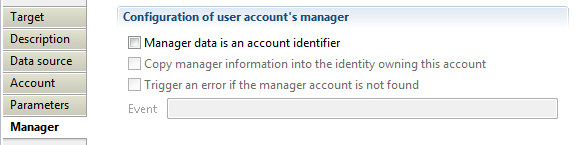

### Account target Example

Example of file, discovery and collect of account target are provided in attachment below.  
ActiveDirectory add-on is a good example too for collecting accounts, groups and groups members, it is available in brainwave store.

## Activity permission pair target

### What is an activity ?

This target defines business activities that can be used in the SOD matrix to detect model or identity discrepancies. Activities are a combination of real application permissions allowing a user to perform a particular business task. The list of activities depends on the company.  
This target is used to make a mapping between a business activity and the list of application's actions, screens or roles needed to perform this activity. For example, the activity "Send an invoice" is defined in a certain way in SAP (using a combination of transactions and authorisation objects) but it is defined in another way in PeopleSoft.  

### How activities are defined ?

In a given application, there can be several ways to perform a specific activity. Or maybe that an activity is composed of several consecutive actions. For example, emitting an invoice could be completed by using a menu (permission `MENU_INVOICE`, action CREATE or UPDATE) but is really done if the user has the ability to validate the screen (permission INVOICE, action COMMIT).  
In this example the "Emit an Invoice" is defined this way :  

```text
(permission MENU_INVOICE, action CREATE) or (permission INVOICE, action UPDATE)
and
  (permission MENU_INVOICE, action COMMIT)
```

The Brainwave product allows you to define an activity using several permission pairs. In the above example, a permission pair is (`MENU_INVOICE`, CREATE). Another one is (INVOICE, COMMIT).  
The target expects a permission pair and an operator. The operator is used to know if we have an AND or an OR operator. The previous example can be rewritten as follows:  

| permission1    | permission2 | operator |
| :------------- | :---------- | :------- |
| `MENU_INVOICE` | CREATE      | 1        |
| `MENU_INVOICE` | UPDATE      | 1        |
| `MENU_INVOICE` | COMMIT      | 2        |

The operator value has no particular meaning. To know how a line is combined with the previous line, we check if the value in the operator column has changed or not.  

```text
same operator:  apply an OR operator with the previous line
  operator changed: apply an AND operator with the previous line
```

The lines 1 and 2 are combined using an OR operator  
But there is a AND operator between line 3 and the first 2 lines because the operator value has changed (from 1 to 2).  
The target should be called for each line of this table.  

There are 2 important rules to keep in mind to understand how the product is using the operator.  

- the operator combines the current line with the result of all the previous lines.
- if the operator if AND and the result of all the previous line was false, the evaluation stops.

Lets take a more complex example and convert it into an expression to understand how it will be evaluated.  

| permission1  | permission2 | operator |
| :----------- | :---------- | :------- |
| MENU_INVOICE | CREATE      | 1        |
| MENU_INVOICE | UPDATE      | 1        |
| MENU_INVOICE | COMMIT      | 2        |
| MENU_INVOICE | VIEW        | 2        |
| MENU_INVOICE | AUDIT       | 1        |

The product evaluates the lines as if the following expression had been written:  
`((( CREATE OR UPDATE ) AND COMMIT ) OR VIEW ) AND AUDIT`  

If CREATE and UPDATE are both false (meaning the use has none of them), the result is false (meaning the user has not this Business Activity) and the remaining part is not evaluated.  
If CREATE or UPDATE is true then the product evaluates the AND operator with COMMIT and whatever the result, continues with the OR VIEW.  
If the result is false then the AND AUDIT is not performed. If the result is true, then the operation AND AUDIT is evaluated.  

As of version 2017 R2 SP6, you have the possibility to use the NOT operator in the activity definition - combined with the AND or OR. To use the NOT operator, in the data file, you have to use the minus '-' before the chosen operator.  
Let's take a few examples:  

| BusinessActivity | permission1 | permission2 | operator |
| :--------------- | :---------- | :---------- | :------- |
| A1               | CMR5        | CREATE      | -1       |
| A1               | CRM6        | UPDATE      | 2        |
| A1               | CRM5        | UPDATE      | 2        |

The A1 activity is defined as follow: `(NOT [CRM5 CREATE]) AND ([CRM6 UPDATE] OR [CRM5 UPDATE])`

| BusinessActivity | permission1 | permission2 | operator |
| :--------------- | :---------- | :---------- | :------- |
| A2               | Z1          |             | 1        |
| A2               | Z3          | DELETE      | 2        |
| A2               | X1          |             | -2       |

A2 activity is defined as follow : `[Z1] AND ([Z3 DELETE] OR (NOT [X1]))`

| BusinessActivity | permission1 | permission2 | operator |
| :--------------- | :---------- | :---------- | :------- |
| MA1              | A1          |             | 1        |
| MA1              | A2          |             | 1        |
| MA1              | B1          |             | -2       |

Definition of master activity MA1 : `([A1] OR [A2]) AND (NOT [B1])`

> [!warning] Be careful as the order in the definition data file is really important. Using an AND operator will do a shift in the definition: ie :( OR OR OR OR) AND (OR OR OR ....)

This target can be used to define an activity based on a combination of permission pairs but can also be used to defined macro-activities based on a combination of activities. The same way of specifying OR and AND operator applies using the trick of value change but only one permission (an activity) is given instead of two permissions.  

As of version 2017 R3 SP5, the ability to define complex expression has been added.  
An example can be any combination of parenthesis, AND operator, OR operator, NOT operator with a Javascript syntax.  
For example, you could write:  
`( CREATE || UPDATE ) && ( COMMIT || VIEW ) && ! AUDIT`  

In the collect line, you should call 5 times the Activity Pair target because there are 5 operands in your expression.  
But instead of using an operator (usually containing 1 or 2), you set the expression in the displayname of the Activity Pair and set 0 (zero) in the operator.  
With the previous expression, all 5 lines should have a 0 in the operator and the displayname of at least one line (or all if you prefer) should contain the expression.  
The expression must start with the '=' sign to distinguish between a normal displayname and an expression.  

```text
operator: 0
  displayname: =( CREATE || UPDATE ) && ( COMMIT || VIEW ) && ! AUDIT
```

The operator is not used anymore by the product because the expression with the parenthesis defines how the operands are combined.  

The name CREATE, UPDATE,... are not the permission codes or the Business Activities codes.
Instead, it is an alias on a line of the Activity Pair stored in the activity pair type in the collect line.  
The following table show how to fill the different activity pair target fields in the collect line.  

| **business activity** | **permission1** | **operator** | **type**  | **displayname**                                                    |
| :-------------------- | :-------------- | :----------- | :-------- | :----------------------------------------------------------------- |
| BA1                   | CREATE          | 0            | CREATE    |                                                                    |
| BA1                   | UPDATE          | 0            | UPDATE    |                                                                    |
| BA1                   | COMMIT          | 0            | COMMIT    |                                                                    |
| BA1                   | VIEW            | 0            | VIEWONLY  |                                                                    |
| BA1                   | AUDIT           | 0            | FULLAUDIT | =( CREATE \|\| UPDATE ) && ( COMMIT \|\| VIEWONLY ) && ! FULLAUDIT |

### Activity permission pair target properties Tab

#### The Activity tab

In this tab, the checkbox 'Definition of a macro-activity' should be checked to define macro-activities instead of normal activities. Depending on this checkbox, you have to enter either a permission pair or an activity.  
The first field called 'Parent permission' is the code of the business activity to define (either activity or macro-activity).  

#### Activity permission pair target parameters tab

This tab is mainly used to define the operator.

### Activity permission pair target best practices

It is recommended to have two layers of activities:  

- macro-activities are business activities which are referenced in the SOD matrix
- normal activities are application dependent activities to define how a single activity can be performed in the application  

Pay attention to the order of the permission pairs when defining an activity. For example, if a sort is applied on the first permission in the discovery, the 3 lines will look like this in the Ledger:  

| **permission1** | **permission2** | **operator** |
| :-------------- | :-------------- | :----------- |
| MENU_INVOICE    | COMMIT          | 2            |
| MENU_INVOICE    | CREATE          | 1            |
| MENU_INVOICE    | UPDATE          | 1            |

The meaning of this table is different (and wrong):  

```text
  (permission INVOICE, action COMMIT) and (permission MENU_INVOICE, action CREATE)
or
  (permission MENU_INVOICE, action UPDATE)
```

As the meaning of the operator is highly dependant on the order of the permission pair declaration, you should respect the original order of the file containing the activity definitions.  

As of version 2017 R3 SP5, the best practice is to use expressions so you can define real Business Activities only.  
Without expression, in previous versions, you could be forced to add intermediate Business Activities to be able to combine the different permissions as desired.  

### Activity permission pair target Error handling

Each permission pair is added to the activity definition. The only possible error is if the permission codes (or activity code when defining a macro-activity) are unknown in the Ledger. In such a case, an exception is raised.

## Actor target

Actor target allows creation of association between an asset and an organization.  

### Actor target The properties Tab

### Actor target tab

In this tab you can see/modify general parameters of the component. You will find the following:

- _Identifier_ (shown in Debug mode for example)
- _Display name_ for the _Support target_
- _Follow just one link_ option which sets the transition mode. If it is checked, only the first transition with an activation condition evaluated to true will be executed. If it is unchecked, all transitions with an activation condition evaluated to true will be executed.

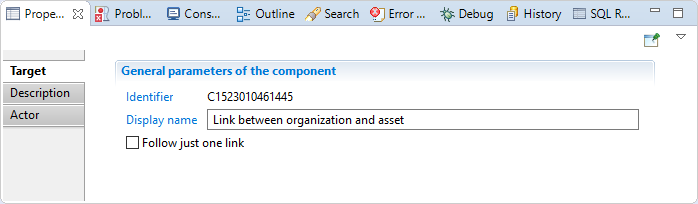

#### Actor target Description  

This property allows adding comment regarding actions done by this component.  


#### Actor

In this tab, you will specify:

_"Attribute containing organization"_ is the code of the organization (mandatory, mono-valued)
_"Attribute containing asset"_ is the code of the asset (mandatory, mono-valued)

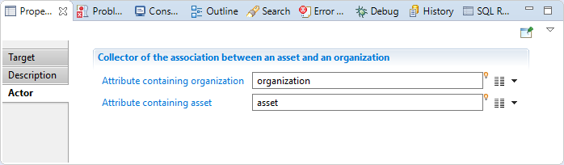

### Actor target Error handling

If one of the key attributes (organization or asset) cannot be found in the import tables, the creation of this actor object is silently cancelled and a line is written to the log file:  

```log
No writing of asset-organization link because one of the key attributes
(_organization_ or _asset_) contains an unknown value in the database
```

If one of the key attributes (organization or asset) is empty, the creation of this actor object is silently cancelled and a line is written to the log file:

```log
No writing of asset-organization link because one of
the key attributes is empty or missing in the target component configuration
```

## Application target

### Application target Usage

This target allows you to collect application in the ledger.  

### Application target Procedure

From collect editor select _Application target_ in _Ledger targets._

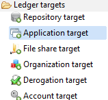

### Application target properties Tab

#### Application target tab

In this property you can view/edit general parameters of the application. You will find:

- the _Identifier_ (shown in Debug mode for example)
- the _Display name_ for the _Application target_  
- the _Follow just one link_ option

This option sets the transition mode. If it is checked, only the first transition with an activation condition evaluated to true will be executed. If it is unchecked, all transitions with an activation evaluation assessed to true will be executed.


#### Application target Description

Here you can add comments regarding actions done by this component.


#### Application target Repository

In this property, you can select the attribute that will contain the repository key. This repository will hold collected applications, repository must exist in database.


#### Application target Application

With this property, you will define product behavior when importing application. The following optionsare set :

- _"Attribute containing application key"_ which must contain a unique identifier for the application in current used repository.
- "Application type" with which you can define application type by choosing from role or profile based application, Fileshare, Sharepoint, ... or set it to custom type.
- _"Trigger an error if application is not found"_ option from which you can activate an event that will be generated when the attribute containing application code is null or empty (event shown in dedicated logs).


#### Application target Parameters

In this property you can define mapping between attributes from dataset and application properties (Ledger). Both définitions are relevant:

- _Field:_  contains application attribute available in Ledger.
- _Attribute:_ contains application attribute in data set.

Available fields are :

- displayname
- applicationtype
- applicationfamily  
- description  
- sensitivity reason
- category  
- custom1--\>9
- reference type 1--\>9
- reference value 1--\>9  

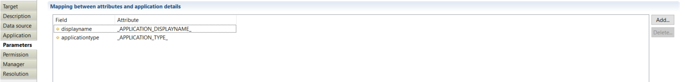

#### Application target Permission

With this property you can create generic permission for the import application by defining the "_Permission identifier_" and the "_Permission displayname_".

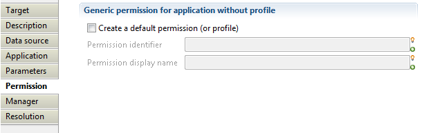

#### Application target Manager  

Here you can indicate which attribute contains application manager. For instance, you can indicate which "-attribute contains manager HR code-", the "-expertise domain-" as well as "-attribute containing comments-" related to application manager. You can as well fill delegation information such as the "_attribute containing the delegation flag_", the "_delegation priority_", the "_start date_", the "_end date_", and the "_reason_". More informations regarding manager property is available under the article: [Manager target](docs/igrc-platform/collector/components/targets/manager-target/manager-target.md)  


#### Application target Resolution  

This part enables you to set up attributes that will fetch direct manager of the import application whether the corresponding manager HR code is not available.


## Asset target

This target allows to create an asset and its manager in the ledger.

### Asset target properties Tab

#### Asset target tab

In this tab you can see/modify general parameters of the component. You will find the following:

- _Identifier_ (shown in Debug mode for example)
- _Display name_ for the _Usage target_
- _Follow just one link_ option which sets the transition mode. If it is checked, only the first transition with an activation condition evaluated to true will be executed. If it is unchecked, all transitions with an activation condition evaluated to true will be executed.

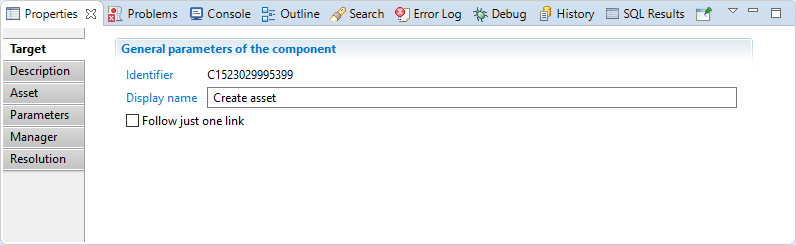

#### Asset target Description

This property allows adding comment regarding actions done by this component.  

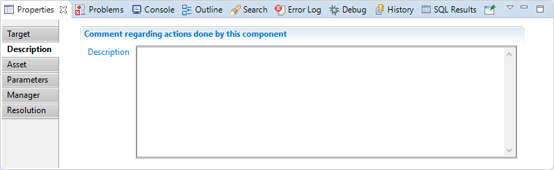

#### Asset

In this tab, you will specify:  

- _"Attribute containing asset"_ is the code of the asset (mandatory, mono-valued),
- _Trigger an error if asset is not found_ and indicate the event display name.

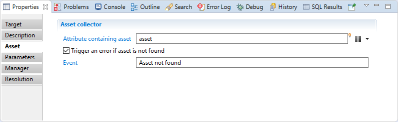

#### Asset target Parameters  

In this section you can define the mapping between attributes from the dataset and asset properties:

- displayename
- category  
- custom 1 --\> 9

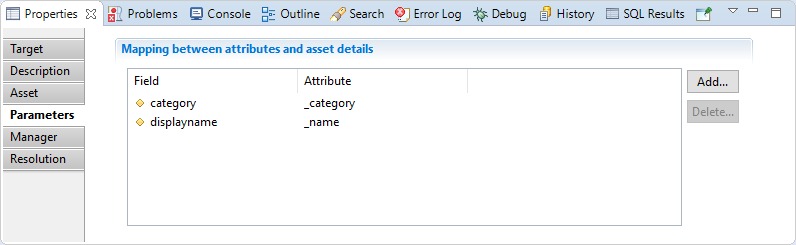

#### Asset target Manager

In this section, you can specify:

"Attribute containing manager HR code": is the attribute who hold the manager HR code of the asset.  

"Expertise domain attribute": is the attribute holding expertise domain of the manager, if the domain attribute is nt set or empty, a default domain 'owner' will be created.  

"Attribute containing comment": is the attribute holding comment for the manager.  

"Attribute containing delegation flag"  

"Attribute containing delegation priority"  

"Attribute containing the reason"  

"Attribute containing the start date"  

"Attribute containing the end date"  


#### Asset target Resolution

Here you can select attributes that will fetch manager identity for the asset if HR code is not available.


### Links with permissions and organisations

To create a link between an asset and a permission, you will need to use the Support Target;  

In order to create an association between an asset and an organization, you will need to use the Actor Target.

## Child permissions target

This target is used to add hierarchical links between permissions after their creation. It can be used for file share (or SharePoint) permissions or for standard hierarchical permissions.  

### Child permissions target properties Tab

#### Child permissions target tab

In this tab you can see/modify general parameters of the component. You will find the following:

- _Identifier_ (shown in Debug mode for example)
- _Display name_ for the _Support target_
- _Follow just one link_ option which sets the transition mode. If it is checked, only the first transition with an activation condition evaluated to true will be executed. If it is unchecked, all transitions with an activation condition evaluated to true will be executed.

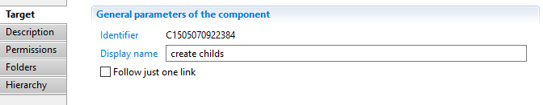

#### Child permissions target Description

This property allows adding comment regarding actions done by this component.

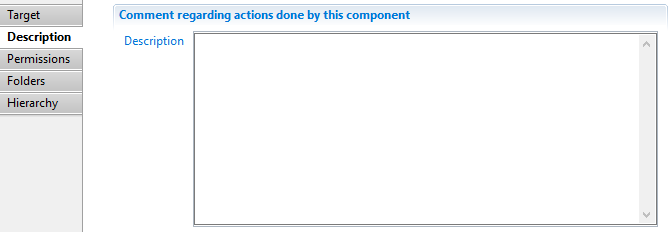

#### Child permissions target Permissions

This property allows to specify a permission code and application:  

- In the case of file share or SharePoint, this selected permission will be the child permission and its parent will be automatically constructed (for example for the /a/b permission, this target will create a link between /a and /a/b)
- In the case of permission hierarchy, this permission will be the parent permission of the ones specified in the Hierarchy tab.  

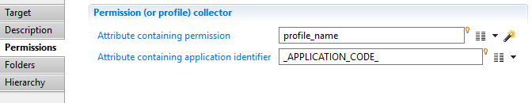

#### Child permissions target Folders

Check the _SharePoint or File share folder hierarchy collector_ checkbox to activate this mode. Here you can specify:  

- The separator between path components (/ for Unix file system paths and SharePoint URLs or \ for Windows file system paths),
- The event to be triggered when the parent permission code not part of the Ledger,
- The name of a boolean attribute indicating if the permission has some proper ACLs or if they are inherited from one of its ancestors,
- The event to be triggered when you specified that the ACLs of the permission are inherited but there does not exist an ancestor of the permission which has ACLs.  

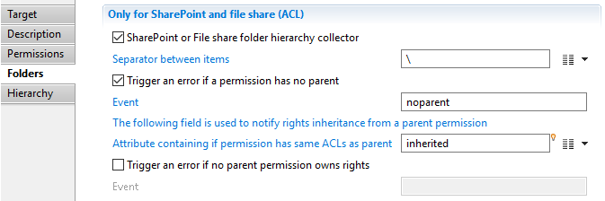

#### Child permissions target Hierarchy

Check the _Permission hierarchy collector_ checkbox when you want to activate this mode. Here you can specify:  

- "_Attribute containing direct children_" is the name of a (possibly multi valued) attribute containing the code(s) of the children permissions,
- The event to be triggered when one of the permission codes in the children attribute cannot be found in the Ledger.  


## CSV Output target

This **CSV Output** target component allows to write the result of a collect to a csv file, instead of writing to the database.  
A typical use is to process and pass data between different collectors that cannot communicate directly, on a distributed environment.  
It can also be used for debugging purposes to test the output of a collect without writing anything to the database.  
It is used internally by the Audit Log collector to write audit log data to a bulk file before sending them to the database.

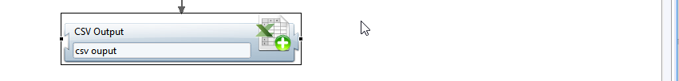

### CSV Output target tab

the **Target** property tab allows to view/modify general parameters of the component:

- **Identifier** internal identifier of the component, useful in debug mode or for reading collect log files.
- **Display name**  for the **CSV Output target** , to be displayed in the collector editor.
- **Follow just one link**  option defines how multiple transition collectors are processed.  
If checked, only the first transition with an activation condition evaluated to true will be executed.  
If unchecked, all transitions with an activation condition evaluated to true will be executed.


### CSV Output target Description

The **Description** property Tab allows adding notes on the component, such as description of what the component is doing.

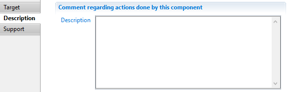

### CSV Output target File

The **File** property tab allows defining the path, name and CSV options of the output file

- **CSV File**  fully path and name of the csv output file. This path can contain javascript expressions enclosed in braces.  
The collector will try to create non-existing intermediate folders at runtime.
- **File encoding** for the CSV file. Use UTF-8 if no other constraints
- **Column separator**  between fields. You can use use comma, semi-colon, or tab as valid separators
- **Text field separator**  used to enclose file values for example if they contain special characters (column separator)
- **MultiValues separator** character used to separate values when outputing a multi-valued variable.  
You can leave this field blank if you only have single-valued variables to output.


### CSV Output target Columns

The **Columns** property tab allows to define the column names and content of the csv output file.

The columns are listed from left to right order in the csv file.

- **Add/Edit** buttons allows to add a column (attribute and name) and to modify an existing one (see below)
- **Delete** button allow to delete a column definition from the CSV file
- **Up / Down buttons** allow to reorder columns in the csv file.  

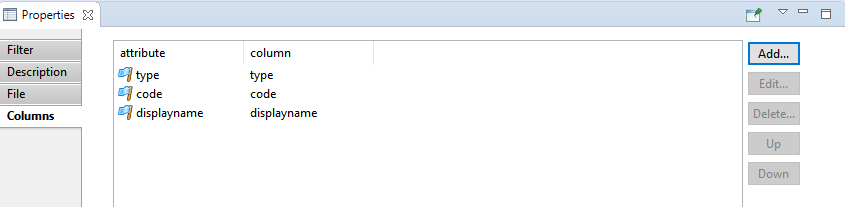

#### Adding/Editing a column

You can add any variable available at this point of the collect to the CSV file.

- **Attribute in collector** the variable to add. All variables than can be added can be selected from the right popup menu.
- **Column name or number** : name of the column in the header of the CSV file. It's preferable to not use spaces in the column name.

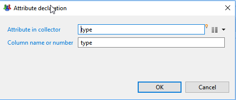

#### Sample output

The image below shows a sample CSV output generated by the CSV output target.

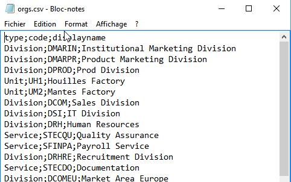

### CSV Output target best practices

The CSV output target can be very useful in some situations, typically to transfer data between collectors that cannot communicate with each other.  
However , if the collectors are in the same project and run in the same sequence, it's preferable to make them communicate directly (as sub-collectors calls for example).

### CSV Output target error handling

The collector will fail if no columns are defined or if the output CSV file cannot be created or written to.

## Derogation target

This component allow to create a derogation between an identity and a permission in the **theoretical rights** context.  
For the same concept in regards to **control discrepancies**, see [exceptions](../../workflow/exception-management).  

### Derogation target properties Tab

#### Derogation target tab

In this section you can see/modify general parameters of the component. You will find:

- the "_Identifier"_ shown in Debug mode for example
- _the "Display name_" for the _collector line source_
- the "_Follow just one link_" option which sets the transition mode. If it is checked, only the first transition with an activation condition evaluated to true will be executed. If it is unchecked, all transitions with an activation evaluation evaluated to true will be executed.

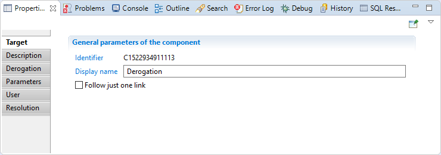

#### Derogation target Description

Comment regarding this route component.

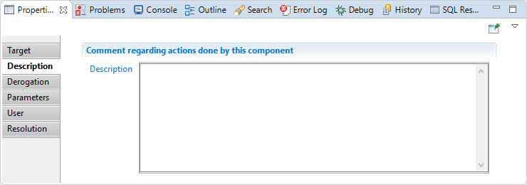

#### Derogation target Derogation

In this section you will find:

_"Attribute containing permission"_: here you have to map an attribute that containing the permission code (mandatory, mono-valued)  

_"Attribute containing application"_: here you need to map an attribute that contain an application code of the permission (mandatory, mono-valued)

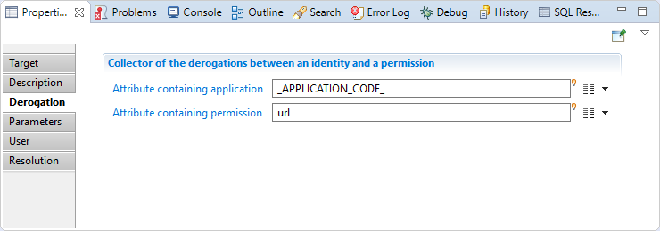

#### Derogation target Parameters

In this section you have to map derogation parameters, somme parameters are mandatory(issuername, validfromfate).  

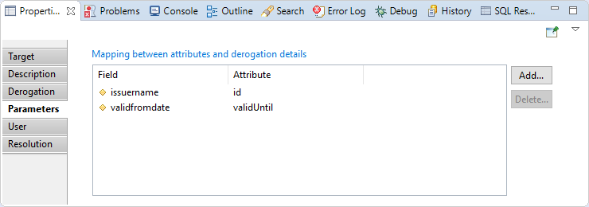

#### Derogation target User

In this section you have to map the attribute who hold the HR code of the identity.  

you can also configure event if identity is not found or several identities match

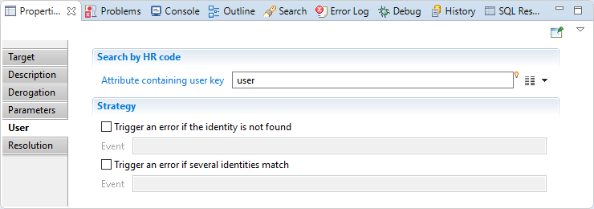

#### Derogation target Resolution

In this section you can map optional attributes that will be used to find the identity if no HRcode is provided.

Example: mail, full name,...  

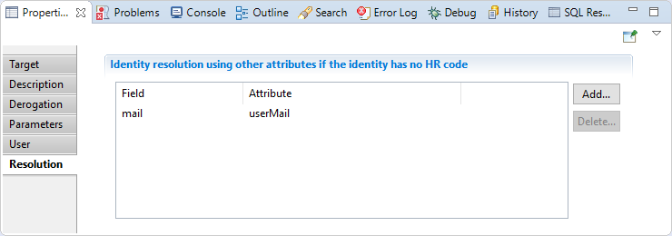

### Derogation target Error handling

If permission cannot be found in the import tables, the creation of derogation object is silently cancelled and a line is written to the log file:  

```log
No writing of derogation because the permission (...)
contains an unknown value in the database in the database
```

If one of the key attributes (application or permission) is empty, the creation of this derogation object is silently cancelled and a line is written to the log file:

```log
No writing of derogation because one of the key attributes
is empty or missing in the target component configuration
```

## File share target

File share rights also known as ACLs (_Access Control Lists_) are collected in the ledger using the "_File share target_" component. It is recomanded to use this target for collecting file share ACLs like (Windows shares, Google Drive, NetApp shares, ...)_._

From collect editor select _File share target_ in _Ledger targets._  

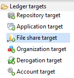

### File share target properties Tab

#### File share target tab

In this property you can view/edit general parameters of the ACLs. You will find :

- the _Identifier_ (shown in Debug mode for example)
- the _Display name_ for the _File share target_  
- the _Follow just one link_ option to set the transition mode. If it is checked, only the first transition with an activation condition evaluated to true will be executed. If it is unchecked, all transitions with an activation condition evaluated to true will be executed.

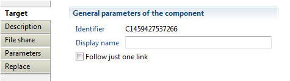

#### File share target Description

This property allows user to add comment regarding actions done by this component.

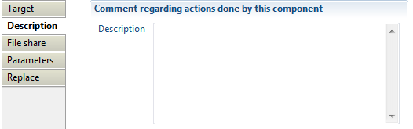

#### File share

Here you can made the association between a permission (folder or file) and an account or group. The following options are available:  

- "Attribute containing recipient (account or group)" to specify an attribute who will contain account or group identifier (DN, Domain\Login, ...).
- "Attribute containing application" to indicate the application containing permissions related to the collected ACL.
- "Attribute containing folder or file" to set an attribute that contains permission code (file path) having the collected ACL .
- "Trigger an error if account or group does not exist" option to activate an event that will be generated when a group or account having this ACL does not exist in database. Such event is shown in dedicated logs.
- "Trigger an error if domain does not exist" option to activate an event that will be generated when the repository used to search group or account does not exist in database (event shown in dedicated logs).


#### File share target Parameters

With this property you will define mapping between attributes (from dataset) and account properties (Ledger).

- _Field:_  contains file share attribute available in Ledger.
- _Attribute:_ contains file share attribute in data set.

Available fields are :  

- Action: must contain windows access mask; for more detail see [Microsoft Documentation](https://msdn.microsoft.com/en-us/library/windows/desktop/aa374896(v=vs.85).aspx).
- Negative: Boolean value, if true is mean that ACL represent deny access, otherwise it represent allow access.

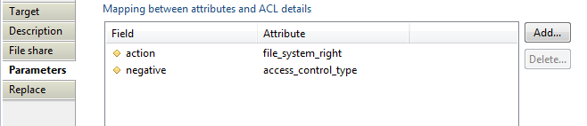

#### File share target Replace

Here you can define a mapping of ACL recipient to a list of replacement recipient. For instance, for windows file share, we can map "_Tout le monde","Everyone",_ windows group on known SID "_S-1-1-0_" to found associated group in the ledger. SID known as Security Identifiers is a unique identifier but group name can change according to system language, case of windows default groups. Below is presented an example _from FileShare Facet replace._  

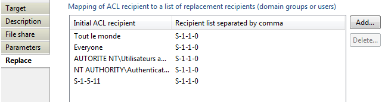

### File share target Example

FileShare add-on is a good example for collecting files and folders, it is available in brainwave store.  

## Group target

This target allow you to create groups in the ledger.

From collect editor select _Group target_ in _Ledger targets._  


### Group target properties Tab

#### Group target tab

In this property you can view/edit general parameters of the Group. You will find the _following:_

- _Identifier_ (shown in Debug mode for example),
- _Display name_ for the _Group target_
- _Follow just one link_ option for setting the transition mode. If it is checked, only the first transition with an activation condition evaluated to true will be executed. If it is unchecked, all transitions with an activation evaluation assessed to true will be executed.

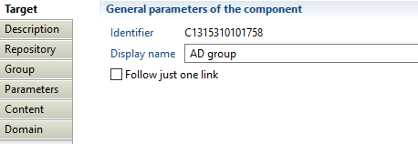

#### Group target description

This property allows adding comments regarding actions done by this component.

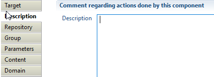

#### Group target Repository

In this property, you can select the attribute that will contain the repository key. This repository will hold collected groups and must exist in database.

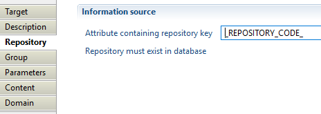

#### Group target Group tab

With this property, you will define product behavior when importing groups, such as:  

- _"Attribute containing group key"_ which must contain a unique identifier for the group in current used repository, for example _DistinguishedName_ in case of Active Directory groups.
- _"Trigger an error if groupkey is null or empty"_ option to activate an event that will be generated when the attribute containing group key is null or empty (event shown in dedicated logs).

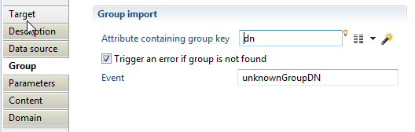

#### Group target parameters

With this property you will define mapping between attributes from dataset and group properties (Ledger).

- _Field:_ contains group attribute available in Ledger.
- _Attribute:_ contains group attribute in data set.

Available fields are :  

- guid
- sid
- displayname
- comment
- grouptype
- dynamic
- filter
- manageraccount
- creationdate
- modificationdate
- custom 1--\>9

Example of an ActiveDirectory group parameters:  


#### Group target Content

With this property, you will define group content such as:  

- -"Attribute containing group member"- to specify attribute that contain list of accounts and groups identifiers that are members of collected group. For performance reasons, we advise using group member target to collect group members separately from collecting groups, see -[Group Members target](docs/igrc-platform/collector/components/targets/group-members-target/group-members-target.md)_ documentation for more details.
- "_Group containing all accounts_" this option is deprecated.
- _"Trigger an error if one of the children is not found"_ option to activate an event that will be generated when a group member is not found in database (event shown in dedicated logs).


#### Group target Domain

Here you can define how to find accounts and groups who are members of a group. The following options are available:

- "_Separator in account_" with which you can specify a repository where the account or group member is located, this option is useful for FileShare, Sharepoint, Exchange,...,. For example using separator "\"  to retrieve repository from "INTRA\Administrator", in this case "INTRA" is the repository used to found an account having as login Administrator.
- "_Default repository code_" which specifies a repository that will be used to found accounts and groups who are members of collected group.
- "_Account or group identifier is unique among repositories of identical type_" in which ou can specify a repository type reference to expand accounts and groups searching (search on all repositories having specified type). Note that, it is mandatory to configure type when collecting _ActiveDirectory_ with multi-domain architecture (a group containing members from external domains, files shared with users from external domains, ...). You can set repository type when creating the repository.

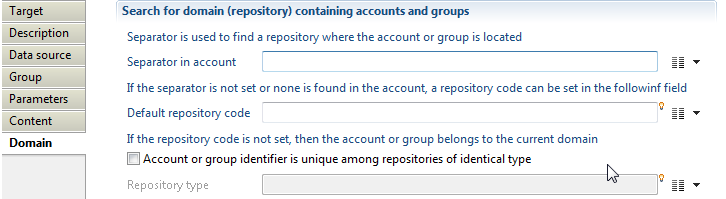

### Group target Example

ActiveDirectory add-on is a good example for collecting accounts, groups and groups members, it is available in brainwave store.

## Group members target

This target allow you to collect group members.

From collect editor select _Group members target_ in _Data set targets._  


### Group members target properties Tab

Below is the detailed information of each property of the Group members target.

#### Group members target tab

In this property you can view/edit general parameters of the Group members. The following items are availables:

- the _Identifier_ (shown in Debug mode for example)
- the _Display name_ for the _Group target_
- the _Follow just one link_ option to set the transition mode. If it is checked, only the first transition with an activation condition evaluated to true will be executed. If it is unchecked, all transitions with an activation evaluation evaluated to true will be executed.

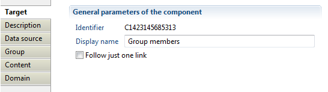

#### Group members target Description

Here you can add comments regarding actions done by this component.


#### Group members target Repository

In this property, you can select the attribute containing the repository key. This repository holds group that we want to collect its members. Note that repository must exist in database.

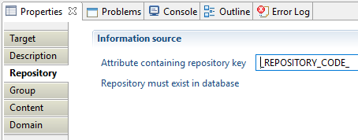

#### Group members target Group

With this property, you will define group identifier and the following two definitions are available:

- _"Attribute containing group key"_ which must contain a unique identifier for the group, for example _DistinguishedName_ in case of Active Directory groups.
- With _"Trigger an error if groupkey is null or empty"_ option to activate an event that will be generated when the attribute containing group key is null or empty (event shown in dedicated logs).

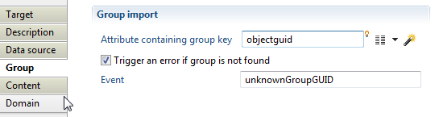

#### Group members target Content

With this property, you will define group content with the below options:

- "_Attribute containing group members_" to specify attribute that contain list of accounts identifiers who are members of this group, for performance reason we advise using "group member" target to collect group members separately from collecting groups.
- "_Group containing all accounts_": this option is deprecated.
- "_Trigger an error if one of the children is not found_" is an option you can activate for an event to be generated when a group member is not found in database (event shown in dedicated logs).

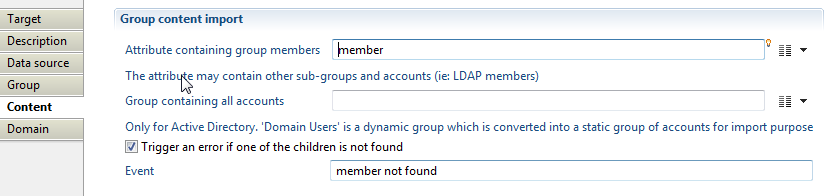

#### Group members target Domain

Here you can define how to found accounts and groups who are member of a group by using the following options:

- "_Separator in account_" to specify repository where the account or group member is located, this option is useful for (FileShare, Sharepoint, Exchange, ...), for example using separator "\"  to retrieve repository from "INTRA\Administrator", in this case "INTRA" is the repository used to found an account having as login "Administrator".
- "_Default repository code_" to indicate a repository that will be used to found accounts and groups who are members of collected group.
- "_Account or group identifier is unique among repositories of identical type_" to determine a repository type reference to expand accounts and groups searching (search on all repositories having specified type). It is mandatory to configure type when collecting _ActiveDirectory_ with multi-domain architecture (AD group contains members from external AD domains, files shared with accounts and groups from external AD domains, ...). You can specify repository type option when creating a repository using repository target.

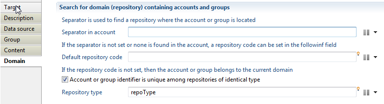

### Group members target Example

Active Directory add-on is a good example for collecting accounts, groups and groups members, it is available in Brainwave store.  

### Resolution of groups and accounts during data collection

When assigning rights to groups or accounts, the information available on those groups and accounts can come from a wide range of situations, and it is not always possible to provide a straight repository / identifier pair which should normally identify the element. This is the reason why a series of fallbacks has been implemented in the collection targets managing references to groups and accounts, namely for rights as well as group members. The present article will describe the strategies that are used to resolve an unknown group or account in those two targets.  

### Resolving groups and accounts in the rights target

The rights target is used to insert both account and group rights. The entity is described by a repository and a unique identifier. To resolve the account or group that will hold the right, the following checks are made, in order. The first check that returns an object present in the current sandbox will decide what this object (account, group) will be, no matter the output of the further tests. An important consequence is that, as the tests for accounts take precedence over the ones for groups, if an account and a group have the exact same identifier and repository, only the account will receive the corresponding right.
Here are the successive tests that are performed:  

- if repository type is not set
  - the identifier in target is matched across the **account GUIDs**
- the identifier is matched across all account repositories against the **SID**;  
- the identifier is matched across the **account identifiers** for the given repository;  
- if repository type is not set
  - the identifier is matched across all **group** repositories against the **group GUIDs**;  
- the identifier is matched across all **group** repositories against the **SID**;
- the identifier is matched across the **group codes** for the given repository;
- if repository type is set:
  - the identifier is matched across the **account identifiers** for the given repository type;  
  - the identifier is matched across the **group codes** for the given repository type.
- if repository type is set:
  - the identifier in target is matched across the **account GUIDs** for the given repository type.
  - the identifier is matched across the **group GUIDs** for the given repository type.
- the identifier is matched across the **account logins** for the given repository;  
- the identifier is matched across the **group displaynames** for the given repository.

If all those tests fail, then no right is inserted in the database for the given input.  

> If the repository name for the account/group is not set, the repository of the permission's application will be used.

### Resolving groups and accounts as members, in the group and group members target

The group target and group members target collect the group members in a similar way, although it is strongly recommended to use the group members target to this effect for better performance (you can read more on [optimize collector patterns](https://documentation.brainwavegrc.com/latest/docs/how-to/collectors/optimize-collector-patterns/)).  
The collection of group members is a bit more complex as it integrates particular cases, like the fact that the member can be given in the form `DOMAIN` (separator) `LOGIN`, which is typically the case for Microsoft `DOMAIN\LOGIN` format.  

There are thus two different series of tests, depending on whether the repository domain is provided for the member or not.  

#### 1 Group members with domain

In that case the product will try to tests:  

1. the identifier is matched across the **account logins** for the given repository;  
2. the identifier is matched across the **group displaynames** for the given repository.  

if those tests fail the pair (repository/identifier) is added to the unresolved links.  

#### 2 Group members with domain type

When no domain for the group member is set and a domain type is configured the product does the following tests:

1. the identifier is matched across the **account identifiers** for the given repository type;
2. the identifier in target is matched across the **account GUIDs** for the given repository type.
3. the identifier is matched across all account repositories against the **SID**;
4. the identifier is matched across the **group codes** for the given repository type.
5. the identifier is matched across the **group GUIDs** for the given repository type.
6. the identifier is matched across all **group** repositories against the **SID**;

Once again, if all those tests fail, no member is inserted, but the pair (parent repository/identifier) is written as an unresolved link and will be tried upon again once all the collector line is done processing.

> **NOTA**: the repository type helps to find an account/group belonging to a forest of repositories when you don't have repository code. A good use case is LDAP group members: in such situation the identifier you have is the `Distinguished name`. The product will search in all repositories having the same type, in the same forest we assume that the `DN` is unique.

#### 3 Group members without domain

When no domain for the group member is set in the target, it is supposed that it belongs to the same repository as the parent group.  
The following tests are then performed:  

1. the identifier in target is matched across the **account GUIDs**;
2. the identifier in target is matched across the **account SIDs**;
3. the identifier is matched across the **account identifiers** for the given parent group repository;  
4. the identifier is matched across the **group GUIDs** for the given parent group repository;  
5. the identifier is matched across the **group SIDs** for the given parent group repository;  
6. the identifier is matched across the **group codes** for the given  parent group repository.  

If all those tests fail, no member is inserted, but the pair (parent repository/identifier) is written as an unresolved link and will be tried upon again once all the collector line is done processing.

#### 4 Unresolved links

Only groups are tested against the unresolved links (the supposition being that all accounts have been imported prior to groups, so there can be no unresolved link between an account and its parent group). Here are the tests performed to resolve those links:  

1. the identifier is matched across all **group** repositories against the **group GUIDs**;  
2. the identifier is matched across all **group** repositories against the **SID**;  
3. the identifier is matched across the **group codes** for the given repository;  
4. the identifier is matched across the **group displaynames** for the given repository.

## Identity target

With this target you will add identities to the Ledger  

When editing a collect, select _Identity target_ in the _Ledger targets_ (previously _Data set targets_).  


### Identity target Properties

#### Identity target tab

In this tab you can see/modify general parameters of the component. You will find the following:

- _Identifier_ (shown in Debug mode for example)
- _Display name_ for the _Identity target_
- _Follow just one link_ option which sets the transition mode. If it is checked, only the first transition with an activation condition evaluated to true will be executed. If it is unchecked, all transitions with an activation condition evaluated to true will be executed.


#### Identity target Description

This property allows adding comment regarding actions done by this component.


#### Identity target Data source

In this property, you select the attribute name that contains the repository key. This repository will hold added identities. Note that the mentioned repository must exist in database.


#### Identity target Identity tab

With this property, you will define product behaviour when importing identity such as:

- _"Attribute containing HR code"_ option which must contain the unique identifier for the identity to add if available.  
- _"Trigger an error if HR code is nul or empty"_ option with which you can activate an event that will be generated when the attribute containing HR code is null or empty (event shown in dedicated logs).
- _"Trigger an error if several identities match when no HR code is given"_ option to activate an event that will be generated when several identities are found in database. If no HR code is given, the product use identity parameters (described in below section) with a _key_ flag positionned to True to search an existing identity in order to keep the same _uid_ (unique and intemporal identifier) between timeslots.
- _"Do not create identities who left the company if they exist in a previous timeslot"_ is the last option you should use if both conditions are achieved: the current and archived identities are always available in extracted files and archived identities are not filtered in Discovery.

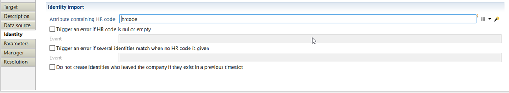

#### Identity target Parameters

This property allows you to define mapping between attributes from dataset and identity properties (Ledger). The available columns include "_Field_", "_Attribute_", "_Key_" and "_Override_".  

- _"Field_" contains identity attribute available in Ledger
- _"Attribute"_ contains identity attribute in data set
-  _"Key"_ is used to fetch identity in database if none HR code is available (for example you can use surname and givenname to define a matching key)
- _"Override"_ option is used if you want to override the given attribute when several data sets are available for a given identity.  

Available fields are :  

- alternate name
- departure date
- arrival date
- email address
- employee type
- expertise domain
- fullname
- given name
- internal identity flag
- job title (must exist in reference tables to see allocation in Ledger : see dedicated page)
- middle name
- mobile number
- nickname
- organization (must exist in database to see allocation in Ledger : allocation is the combination of job and organization)
- phone number
- surname
- title
- custom 1 --\> 19
- reference type 1 --\> 9
- reference value 1 --\> 9


#### Identity target Manager

Here you can indicate wich attribute contains direct manager HR code. You can also select two behaviours:  

- _Trigger an error if the identity is not found_ and indicate the event display name.
- _Trigger an error if several identities match_ and indicate the event display name.


If manager HR code is not available (but you can access other manager attribute like mail, fullname,...) you can use the property below (_cf. Resolution section_)

#### Identity target Resolution

Here you can select attributes that will fetch direct manager for the import identity if HR code is not available.

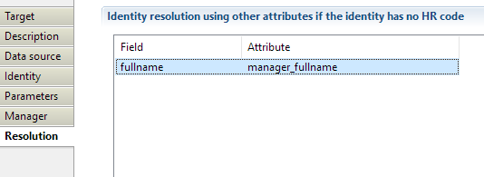

### Identity target Example

Example of file, discovery and collect of identity target are provided in attachments below.  

## Manager target

With this target you will add management information to the Ledger

The concepts (Identity, application, organization for example) on which you want to add on management information must exist in database. For more information, please refer to the article [Understanding the Brainwave Identity GRC data model](../../getting-started/index#brainwaves-data-model).  

When editing a collect, select _Manager target_ in _Ledger targets_.  

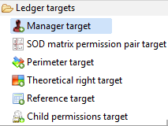

### Manager target properties tab

#### Manager target tab

In this property you can see/modify general parameters of the component. You will find :

- the _Identifier_ (shown in Debug mode for example)
- the _Display name_ for the _Manager target_  
- the _Follow just one link_ option which sets the transition mode. If it is checked, only the first transition with an activation condition evaluated to true will be executed. If it is unchecked, all transitions with an activation evaluation assessed to true will be executed.


#### Manager target Description

This property allows adding comment regarding actions done by this component.


#### Manager target Management

Here you can select the _"Managed entity type"_ between _"Organization", "Repository", "Account", "Group", "Permission", "Application"_ or _"Asset"._

> [!warning] In order to improve the collect consistency, as of version 2017 R3 SP3, the collect will stop on error if an entity code/identifier is not found in the current collect. If you don't want the Execution Plan to stop, please check the box "Trigger an error if `<entity>` is not found". Thus, an event will be added to the collector event file, and the collect will go on.

##### Manager target Organization selection

When selecting -"Organization" as managed entity type- you will have to define the "-Attribute containing organization code".- The latter must be the same identifier than the one given in the -Organization- target (see [Organization target](docs/igrc-platform/collector/components/targets/organization-target/organization-target.md) for detail).  

You can also "_Trigger an error if organization is not found_" and define a customised event.


##### Manager target Repository selection

When selecting _"Repository_" as managed entity type, you will have to define the "_Attribute containing repository code"._ It must be the same identifier than the one given in the _Repository_ target (see dedicated page for detail).  

You can also "_Trigger an error if repository is not found_" and even define a customised event.


##### Manager target Account selection

When selecting _"Account_" as managed entity type, you will have to define "_Attribute containing account identifier"_ as well as "_Attribute containing repository code"_. Both mentioned information must be respectively in the same identifiers than those given in the _"Account target_" and in the "_Repository target_" (see dedicated pages for detail).  

You can additionally "_Trigger an error if account is not found_".


##### Manager target Group selection

When selecting _Group_ you will have to define "_Attribute containing group identifier"_ and _"Attribute containing repository code"_. Both highlighted information must be respectively in the same identifiers than those given in the _"Group target"_ and in the _"Repository target"_ (see dedicated pages for detail).  

You can also "_Trigger an error if group is not found_".


##### Manager target Permission selection

When selecting _"Permission"_ you will have to define _"Attribute containing permission code"_ and _"Attribute containing application code"_. Both information must be properly in the same identifiers than those given in the _"Permission target"_ and in the _"Application target"_ (see dedicated pages for detail).  

You can additionally "_Trigger an error if permission is not found_".


##### Manager target Application selection

When selecting _"Application"_ you will have to define the _"Attribute containing application code"._ Both information must be properly in the same identifiers than those given in the _"Application" target_ (see dedicated page for detail).  

You can also "_Trigger an error if application is not found_".


##### Manager target Asset selection

When selecting _"Asset"_ you will have to define the _""Attribute containing asset code"_. It must be in the same identifier than the one given in the _"Asset target"_ (see dedicated page for detail).  

You can also "_Trigger an error if asset is not found_".


##### Manager target Identity selection

When selecting _"Identity"_ you will have to define the _""Attribute containing managed Identity HR code"_. It must be the same identifier than the one given in the _"Identity target"_ (see dedicated page for detail).  

You can also "_Trigger an error if identity is not found_".

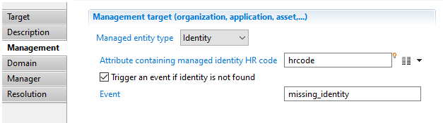

#### Manager target Domain

In this property you will select the _"Expertise domain attribute"_. Note that the expertise domain must exist in reference tables. Such expertise domain describes the link between _Identity_ and the managed concept (_Organization_, _Application_,...). For an application, it can be "Technical owner", "Business owner"...

> On an IAP or IAS project, use the defaults `technicalowner` or `businessowner` expertise domains for best compatibily  


#### Manager target Manager

Here you can indicate which attribute contains direct manager HR code to fetch Identity in database. You can also add comment with _"Attribute containing comment"_.  

_"Delegation information"_ can additionally be configured. This property is very **useful** when several identities can be considered manager of the concept (identity, account, organisation, application, etc.) : principal manager and delegates. This delegation feature enables the product to represent for example an application review where the principal manager is accountable and delegates are responsible.  

You can set several informations about the delagation :  

- _Attribute containing delegation flag_ : this is useful when delegation information comes from HR system and not all delegation are active  
- _Attribute containin delegation priority :_ this is useful when you want to import several delegates for the same concept (same application for example) while ordering them
- _Attribute containing the start date_
- _Attribute containing the end date_
- _Attribute containing the reason_  


#### Manager target Resolution

Here you can select attributes that will fetch manager for the managed concept if HR code is not available.  

You can define two types of attributes :  

- One that can fetch an identity directly (through fullname, mail,...)
- One that can be used by the _manager policy_ (see [dedicated page](../../manager-policy)) to fetch corresponding identies; for example to represent the case : business managers of application ELYXO are people who are accountants for the Financial Division.  


## Organization target

With this target you will add organizations to the Ledger

When editing a collect, select _Organization target_ in _Ledger targets_ (previously DataSet targets).  

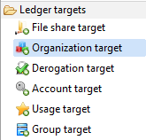

### Organization target properties tab

## ## Organization target tab

In this property you can see/modify general parameters of the component. You will find:

- the "_Identifier"_ shown in Debug mode for example
- _the "Display name_" for the _Organization target_  
- the "_Follow just one link_" option which sets the transition mode. If it is checked, only the first transition with an activation condition evaluated to true will be executed. If it is unchecked, all transitions with an activation evaluation evaluated to true will be executed.


#### Organization target Description

Comment regarding actions done by this component.


#### Organization target Organization

With this property, you will define product behaviour when importing organization such as:  

- _"Attribute containing code"_ must contain the unique identifier for the organization to add.  
- _"Trigger an error if organization code is null or empty"_ option you can activate an event that will be generated when the attribute containing organization code is null or empty (event shown in dedicated logs).

#### Organization target Parameters

With this property you will define mapping between attributes (from dataset) and organization properties (Ledger).  

_Field_ contains organization attribute available in Ledger, _Attribute_ contains organization attribute in data set.  

Available fields are :

- displayname
- organisationType (must exist in reference tables : see dedicated page)
- shortname
- custom field 1--\>9
- reference type 1 --\> 9
- reference value 1 --\> 9


#### Organization target Parent links

With this property you will define elements that enable product to build organizational model (hierarchical, financial,..). The below options are configured with respect of:

- _"Parent organization link attribute_" must contain identifier of the parent organization. Parent organization has not to be already in database.
- _"Parent link type(s) attribute"_ must contain the link type between organizations. Most of the time, the link type is hierarchical. Link type must exist in reference tables and this can be done within this property.  

Product behaviour can as well be defined "_If the parent link does not exist_" in database. You can choose between "_Do nothing_", "_Trigger an error_" while choosing the event that will be generated or "_Create parent link type in the database_".


Note that parent links are effectively resolved during activation, so that no event will be generated in the collect phase if the parent does not exist.  

### Organization target Example

Example of file, discovery and collect of organization target are provided in below attachment.  

## Perimeter target

With this target you will add _Perimeter_ to the Ledger.  

_Right_ plays the role of link between the access account and the permission. It can carry the information linked to the instantiation of the permission (for example, access to the directory type permission in a single reading, access to the transaction type payment permission with a limit of 10,000€ and on the _Perimeter_ (transaction authorised with regard to Europe clients only etc).  

When editing a collect, select _Perimeter target_ in _Ledger targets_ (previously DataSet targets).  


### Perimeter target properties tab

#### Perimeter target tab

In this property you can see/modify general parameters of the component. You will find:

- the "_Identifier"_ shown in Debug mode for example
- the "_Display name_" for the _Perimeter target_  
- the "_Follow just one link_" option which sets the transition mode. If it is checked, only the first transition with an activation condition evaluated to true will be executed. If it is unchecked, all transitions with an activation evaluation evaluated to true will be executed.


#### Perimeter target Description

Comment regarding actions done by this component.


#### Perimeter target Perimeters

With this property, you will define product behaviour when importing _perimeter_ such as:

- _"Attribute containing perimeter"_ must contain the unique identifier for the _perimeter_ to add.
- _"Attribute containing application identifier"_ must contain the unique identifier for the _application_ on wich the _perimeter_ relies on.
- _"Trigger an error if perimeter code is null or empty"_ option you can activate an event that will be generated when the attribute containing _perimeter_ code is null or empty (event shown in dedicated logs).


#### Perimeter target Parameters

With this property you will define mapping between attributes (from dataset) and _perimeter_ properties (Ledger).

_Field_ contains _perimeter_ attribute available in Ledger, _Attribute_ contains _perimeter_ attribute in data set.

Available fields are :

- displayname
- custom field 1--\>9


## Permission target

This target allow you to collect permissions in the ledger.  

From collect editor select _Permission target_ in _Ledger targets._


### Permission target properties tab

#### Permission target tab

In this property you can view/edit general parameters of the permission. Such features are:

- the _Identifier_ ; shown in Debug mode too.
- the _Display name_ for the _Permission target_  
- the _Follow just one link option to_ set the transition mode. If it is checked, only the first transition with an activation condition evaluated to true will be executed. If it is unchecked, all transitions with an activation evaluation assessed to true will be executed.


#### Permission target Description

Here you can add comment regarding actions done by this component.


#### Permission target Permissions

With this property, you will define product behavior when importing permission. The following options are available:  

- _"Attribute containing permission key"_ which must contain the unique identifier for the permission to add.
- _"Attribute containing application identifier"_ which must contain an application identifier existing in database.
- "_Permission type_" with which you can define permission type like "profile", "transaction" or even set it to "custom type". The type field could then mapped in parameters tab presented in below section.  
- _"Trigger an error if permission code is null or empty"_ allows you to activate an event that will be generated when the attribute containing permission code is null or empty (event shown in dedicated logs).


#### Permission target Parameters

The "Parameters" property is used to define mapping between attributes from dataset and permission properties (Ledger). Both definitions are relevant:  

- _Field:_  contains permission attribute available in Ledger.
- _Attribute:_ contains permission attribute in data set.

Available fields are :

- displayname
- permissiontype
- action
- nickname
- depth in three
- lastmodifydate
- lastaccessdate
- totalsize
- numberoffiles
- managed
- sensitivityreason
- description
- custom 1--\>9
- reference type 1--\>9
- refernece value 1--\>9


#### Permission target Folders

With this property you will define relations between the permissions and parent permissions to create hierarchy. Those only concern SharePoint and file share (ACL).  

To use this option you must check "_SharePoint or File share folder hierarchy collector_" option. You additionally can configure:

- "Separator between items" with which you can specify separator that will be used to build links between the permission and parents permissions.
- "_Trigger an error if a permission has no parent_" option which allows you to activate an event that will be generated when the permission has no parent (event shown in dedicated logs).
- "_Attribute containing inheritance flag_" is a boolean attribute to notify that the permission rights are inherited from a parent permission (parent can be direct or indirect).
- "_Trigger an error if no parent permission owns rights_" option with which you can activate an event that will be generated when the permission is marked as inherited and no parent permission owning rights is found (event shown in dedicated logs).  


#### Permission target Hierarchy

With this property you will define the hierarchy of roles, profiles or transactions. Note that this configuration does not concern SharePoint or File share (ACL) import. To use this option you must check the box "_Concerns the hierarchy of roles, profiles or transactions. Do NOT fill for Sharepoint or File share (ACL)_". Additional setting includes configuring:  

- "_Attribute containing direct children_" with which you can specify an attribute containing direct child.
- "_Trigger an error if one of the children is not found_" option which allows activating an event that will be generated when the one of the children permission is not found (event shown in dedicated logs).


## Raw child permissions target

The raw child permission target is used to establish a link between 2 permissions in the raw security model. To understand the concepts behind the raw security model, please read the documentation for the raw right target.  
To define a raw security model the product provides the concepts of raw rights and raw permission links. Compared to rights, raw rights allows to define negative rights. Compared to permission links, raw permission links add several concepts like:  

- links between permissions of different applications are allowed  
- a perimeter can be attached to the link
- the link can be positive or negative
- a wave number (sort of link priority)

The behaviour of the raw permission link target is the same as the permission link target except that this target only accept monovalued attributes. If a permission has several children, you must enumerate the values containing the child permission codes and enter this target once per child.  

### Raw child permissions target properties Tab

The properties are almost identical to the permission link target. Only the 'Hierarchy' tab is different to be able to specify the following attributes:  

- Attribute containing the application: it is the application to which the child permission belongs to. The product allows the link between a permission from application A to a child permission from application B. The application must exist in the Ledger otherwise the target will throw an exception  
- Attribute containing the direct sons: This is the attribute containing the child permission code. Beware that even if you give a multivalued attribute, only the first one will be used. The permission must exist in the Ledger otherwise no link is created (no error is thrown)  
- Permission perimeter: a perimeter code can be given to make a link with 3 concept (permission - permission - perimeter). The perimeter must exist otherwise the target throws an exception. Several links with the same permission pair may exist in the Ledger with a different perimeter.
- Negative links?: a boolean attribute containing true or false. This attribute is part of the link key. It means that the same permission pair can be store in the Ledger, one with a negative flag to true, one with a positive flag.
- Wave number: this is a number (no constraint on values) which can be used as a priority.  

It is important to understand that the product does not interpret, compile or analyse the raw rights and the raw permission links. Filling these information at collect time is for display purpose to show root cause or a real raw right.  

### Raw child permissions target best practices

The raw permission link target can be used anytime, not only when there are negative rights in the application. Each time the compile model looses information, the raw rights and ram permission links can be used to store the complete application security model to display the most accurate information as root cause in the portal.

### Raw child permissions target error handling

There are two situations where the target throws an error:  

- when the application code is not found
- when the perimeter code is not found  

If the permission codes are not found, the target exists without inserting any data in the Ledger.

## Raw right target

Each software vendor has designed a different security model for their applications. And even if looking at a single vendor, all applications do not share the same security model. For example, Microsot Sharepoint security model is completely different than the Share folder security model which is based on ACL with positive and negative rights and inheritance. Microsoft Exchange uses another security model, etc.  

The Brainwave model incorporates all application security models into a unique and generic model using the concepts of repository, accounts, groups, permissions, applications and rights. You can consider that these rights are part of the 'compiled' model. It means that these rights are the results of what people have. But in the real application, the rights may appear differently. To illustrate this difference, we can have a look at ACL for Fileshare.  

The security model for a Fileshare is to set ACL on folders. An ACL is a list of allowed or denied rights. Each right is an allowed or denied action for a given account or group. ACL are collected in Brainwave model using the FIleshare taget and goes into ACL tables. This is the exact snapshot of the fileshare security model with positive and negative rights, propagation, inheritance flags, etc. During the activation step, the Brainwave product examine all the ACL and compile them to produce positive rights between groups or accounts and folders. This is useful to answer quickly to the following question; What are the folders readable by John Doe. When answering this question, the product reads the rights in the Leger, not the ACL. ACL are only used and displayed when the user wants to understand the root cause (why John Doe has an access to the "Billing" folder). In the compiled version, there are no more negative rights. The other difference is that the goal of the right is to have a link between an account and a permission regardless how this link was in the original security model. For example, in the Fileshare, John Doe may belong to several groups giving access to the "Billing" folder. But this information is the root cause (stored in ACL tables). The right table contains a single link which is enough to display in a page or a report that he has access to the folder.  

In the world of data (for example FileShare) ACL are raw rights used for root cause to display the exact information found in the application and rights are the Brainwave compile rights used in views, rules and controls. Raw rights are like ACL in the world of role based application. When an application has a complex security model, this model is stored without any modification in the raw right table using this target. But using this target does not populate automatically the 'compiled' rights because the product does not know how to transform the raw right model into a compiled right model. So, in any case, the standard right target should be used to store the compiled and simplified version of the rights.  

### Raw right target properties Tab

The properties of a raw right target are exactly the same as the right target. The only difference is that the raw right target accepts a new property called 'negative right' which is a boolean (true for negative and false for positive).  

Like in the right target, the perimeter is optional.  

### Raw right target best practices

The raw right target can be used anytime, not only when there are negative rights in the application. Each time the compile model looses information, the raw rights can be used to store the complete application security model to display the most accurate information as root cause in the portal.  

### Raw right target error handling

An error is raised if the application code is not found.  
If the permission is not found or the account is not found, the target does nothing.

## Reference target

With this target you will add reference values to the Ledger

When editing a collect, select _Reference target_ in _Ledger targets_ (previously DataSet targets).  


### Reference target properties

#### Reference target tab

In this property you can see/modify general parameters of the component. You will find:

- the "_Identifier_" shown in Debug mode for example
- the "_Display name_" for the _Reference target_  
- the "_Follow just one link_" option which sets the transition mode. If it is checked, only the first transition with an activation condition evaluated to true will be executed. If it is unchecked, all transitions with an activation evaluation evaluated to true will be executed.


#### Reference target Description

Comment regarding actions done by this component


#### Reference target Title

Here you can add values referring to _title_ to the Ledger.  

When activated you will have to provide an attribute containing the _title_ code and an attribute containing the _title_ displayname.  

Also you can activate an option that triggers an error if the title is _null_ or _empty._  


#### Reference target Employee type

Here you can add values referring to _employee type_ to the Ledger  

When activated you will have to provide an attribute containing the _employee type_ code and an attribute containing the _employee type_ displayname.  

Also you can activate an option that triggers an error if the _employee type_ is _null_ or _empty._  


#### Reference target Job title

Here you can add values referring to _job title_ to the Ledger.  

When activated you will have to provide an attribute containing the _job title_ code and an attribute containing the _job title_ displayname.  

Also you can activate an option that triggers an error if the _job title_ is _null_ or _empty._  

#### Reference target Expertise domain

Here you can add values referring to _expertise domain_ to the Ledger.

When activated you will have to provide an attribute containing the _expertise domain_ code and an attribute containing the _expertise domain_ displayname.  

Also you can activate an option that triggers an error if the _expertise domain_ is _null_ or _empty._  


#### Reference target Organization type

Here you can add values referring to _organization type_ to the Ledger.  

When activated you will have to provide an attribute containing the _organization type_ code and an attribute containing the _organization type_ displayname.  

Also you can activate an option that triggers an error if the _organization type_ is _null_ or _empty._


#### Reference target Organization link type

Here you can add values referring to _organization link type_ to the Ledger.

When activated you will have to provide an attribute containing the _organization link type_ code and an attribute containing the _organization link type_ displayname.  

Also you can activate an option that triggers an error if the _organization link type_ is _null_ or _empty._


#### Reference target Asset category  

Here you can add values referring to _asset category_ to the Ledger.

When activated you will have to provide an attribute containing the _asset_ _category_ code and an attribute containing the _asset_ _category_ displayname.  

Also you can activate an option that triggers an error if the _asset_ _category_ is _null_ or _empty._  


#### Reference target Reference type

If none of the above reference category meet needs of your project, you can add new reference type and value to the Ledger.  

When activated you will have to provide an attribute containing the _reference type_ code and an attribute containing the _reference type_ displayname.  

Also you can activate an option that triggers an error if the _reference type_ is _null_ or _empty._  


#### Reference target Reference value

When activated you will have to provide an attribute containing the _reference value_ code, the attribute containing the _reference type code_ and an attribute containing the _reference value_ displayname.

Also you can activate an option that triggers an error if the _reference value_ is _null_ or _empty._  


## Repository target

With this target you will add Repository to the Ledger.

When editing a collect, select _Repository target_ in _Ledger targets_ (previously DataSet targets).  


### Repository target Properties

#### Repository target tab

In this property you can see/modify general parameters of the component. You will find:

- the "_Identifier"_ shown in Debug mode for example
- the "_Display name_" for the _Repository target_  
- the "_Follow just one link_" option which sets the transition mode. If it is checked, only the first transition with an activation condition evaluated to true will be executed. If it is unchecked, all transitions with an activation evaluation evaluated to true will be executed.


#### Repository target Description

Comment regarding actions done by this component.


#### Repository target Repository

With this property, you will define product behaviour when importing repository such as:

- _"Repository type"_ which can be set to _Identity repository_ or _Account repository_.
- _"Attribute containing repository key"_ must contain the unique identifier for the _repository_.
- _"Attribute containing repository displayname"_ where you can add a displayname for the repository
- _"Repository custom type"_ where you can define a custom type to the _repository_ (different than the _Repository type_ attribute above)
- _"Trigger an error if repository is not found"_ option you can activate an event that will be generated when the attribute containing _repository_ code is null or empty (event shown in dedicated logs).


#### Repository target Parameters

With this property you will define mapping between attributes (from dataset) and _perimeter_ properties (Ledger).  

_Field_ contains _perimeter_ attribute available in Ledger, _Attribute_ contains _perimeter_ attribute in data set.

Available fields are :

- custom field 1--\>9


## Right target

The Right target allows to collect right information into the ledger.  

From the collect editor select _Right target_ in _Data set targets._


### Right target properties Tab

#### Right target tab

In this property tab of the _Right target_ you can view/edit general parameters of the rights. You will find the following definition:

- the _Identifier_ (shown in Debug mode for example)
- the _Display name_  
- the _Follow just one link_ option to set the transition mode
  - If it is checked, only the first transition with an activation condition evaluated to true will be executed.  
  - If it is unchecked, all transitions with an activation evaluation evaluated to true will be executed.


#### Right target Description

This property allows to add Comments regarding actions done by this component.


#### Right target Domain

Here you can define information about repository holding accounts or even groups having access to the collected rights. This property enables three options:

- "_Separator in account_" specifies repository where the account or group member is located, this option is useful for FileShare, Sharepoint, Exchange, .... For example using separator "\\"  to retrieve repository from "INTRA\\Administrator", in this case "INTRA" is the repository used to found an account having as login Administrator.
- "_Default repository code_" specifies a repository that will be used to found accounts and groups having access to the collected rights.
- "_Account or group identifier" is unique among repositories of identical type_" specifies a repository type reference to expand accounts and groups search. For instance, searching all repositories having specified type. Note that, it is mandatory to configure type when collecting _"Active Directory"_ with multi-domain architecture likeSharepoint site shared with accounts and groups from external AD domains,  MailBox delegated to external account in case of Microsoft Exchange,.... One can specify repository type option when creating a repository using repository target.


#### Right target Right

Here you can made the association between a permission and an account or group.

- With "Attribute containing account or group" you can specify an attribute who will contain account or group identifier (DN, Domain\\Login, ...)
- With "Attribute containing application" you can indicate the application that contain permissions related to the collected right
- With "Attribute containing permission list" you can specify permissions having the collected right (sites in case of Sharepoint, MailBox in case of Exchange)
- With "Attribute containing perimeter" you can define perimeter
- With "Attribute containing the propagation flag" you can specify that the right group will not be propagated to child group members, only direct members accounts will inherit the right, mapped variable can be a boolean or a string with 'true'/'false' value
- With "Trigger an event if account or group does not exist" option you can activate an event that will be generated when a group or account having this right don't exist in database (event shown in dedicated logs).
- With "Trigger an event if a permission is not found" option you can activate an event that will be generated when a permissions is not found in the mapped application, if not activated an error will be thrown
- With "Trigger an event if application is not found" option you can activate an event that will be generated if the application is not found in the ledger, if not activated an error will be thrown


#### Right target Parameters

With this property you will define mapping between attributes from dataset and account properties (Ledger).

- _Field:_  contains right attribute available into the Ledger.
- _Attribute:_ contains right attribute from the data set.

Available fields are :

- displayname
- action
- limit
- custom 1 --\>9


## SOD matrix permission pair target

The SOD target matrix is composed of cells where some of them are toxic if one single identity owns both permissions. This target is used to define a cell in the SOD matrix. Only cells corresponding to toxic permission pairs should be defined.  
Each cell is considered a a SOD control in the Brainwave terminology. During the activation step, the discrepancies are computed by examining the identity rights. If an identity owns a toxic pair, a discrepancy is stored in the Ledger as a control result. It means that a toxic permission pair is defined not only by the permission pair but also by many attributes related to risk and remediation.  
The permission pair can be composed of real application permissions (like roles or transactions in SAP) or business ativities. Activities are defined using the Activity permission pair target. It is recommended to use only one kind of permission in the whole matrix.

### SOD matrix permission pair target properties Tab

#### The SOD control tab

Attribute containing matrix name should be filled with the matrix identifier given in the SAD matrix target.  
Attribute containing control identifier is where you define a unique ID for this control. A cell containing a permission pair is saved by the product as a control. Each control must have a unique ID among all the project controls. It means that the control ID given in this field must not collide with a project control defined using .control files or with another SOD control of another matrix. This field has a maximum size of 64 bytes.  
Result type is the kind of results which will be stored as discrepancies. Allowed values are Account and Identity but Identity is the recommended choice as it allows the SOD controls to detect problems with identity having toxic permissions in different applications.  
Model validation is used to find model discrepancies (not related to a specific user). Such discrepancies can occur when a role contains toxic permissions. Giving this role to an identity will automatically show this identity in the discrepancy list for this control, whoever is the identity. Choose the model validation according to the kind of permission pairs in the matrix: Permission type validation if the matrix is composed of real application permissions or Activity type validation if the matrix is composed of activities  
The reamining fields are used to point to the first and the second permission and select a behaviour if one permission is not found in th Ledger. All permissions (or activities) should have been collected in the Ledger before starting to collect the matrix permission pairs.  

#### SOD matrix permission pair target Parameters tab

This tab contains all the attributes found in a control (same fields and same meaning as in the control editor). These fields are only used by the product to display information to the user when a discrepancy is found.  
The risk level should be a number between 1 and 5, 5 being the highest risk level.  
None of these fields are mandatory but it is recommended to fill them if available to help the user in the remediation.  

#### The Tags tag

This tab contains information used to filter control discrepancies when displaying them in the portal. It allows the users to filter the discrepancies on different categories like type, application, or custom criteria.  
None of these fields are mandatory.

### SOD matrix permission pair target best practices

Use both the SOD matrix target and SOD matrix permission pair target instead of the deprecated SOD control target. This deprecated target was used to generate a project file (a .control) for each matrix cell. The SOD matrix targets share the same goal but the matrix cells are stored in the Ledger.  
You should use only one kind of permission in the SOD matrix (real application permissions or activities).  
It is recommended to activate the model validation. It allows the cleaning of the model before cleaning the discrepancies identity per identity.

### SOD matrix permission pair target error handling

The attribute containing the control identifier is used to determine if this is a new control or if it is already in the database and an update should be performed. If 2 controls have the same control identifier, the database will only keep one as the identifier is the key for each control.  
The only possible error is if the permission codes (or activity codes) are unknown in the Ledger. In such a case, an exception is raised.

## SOD matrix target

This target is used to save a SOD matrix in the Ledger. This matrix can be seen as a table with permissions in rows and columns. Each cell is an SOD control between the permission in row and the permission in column. If this cell is filled with all the SOD details, it means that an identity can not have both permissions. All identities having both permissions are considered as discrepancies.  
This target can be used to create a matrix and then, for each pair of toxic permissions, the SOD matrix permission pair target sould be called.  

### SOD matrix target properties Tab

Creating a SOD matrix is very easy. The name (a unique identifier) and the display name are enough to build a SOD matrix in the Ledger.  
Optionally, you can add some 9 custom values and a type of matrix used only in application views (the product does not read this attribute to generate SOD discrepancies).  

### SOD matrix target Best practices

Use both the SOD matrix target and SOD matrix permission pair target instead of the deprecated SOD control target. This deprecated target was used to generate a project file (a .control) for each matrix cell. The SOD matrix targets share the same goal but the matrix cells are stored in the Ledger.

### SOD matrix target Error handling

If the matrix already exists, the target does nothing.

## Support target

With this target you can create a link between an asset and a permission.

### Support target tab

In this tab you can see/modify general parameters of the component. You will find the following:

- _Identifier_ (shown in Debug mode for example)
- _Display name_ for the _Support target_
- _Follow just one link_ option which sets the transition mode. If it is checked, only the first transition with an activation condition evaluated to true will be executed. If it is unchecked, all transitions with an activation condition evaluated to true will be executed.


### Support target Description

This property allows adding comment regarding actions done by this component.


### Support target Support

In this tab, you will specify:  

- _"Attribute containing asset"_ is the code of the asset (mandatory, mono-valued),
- _"Attribute containing application"_ is the code of the application to which the permission specified below belong to (mandatory, mono-valued),
- _"Attribute containing permission_" is the code of the permission (mandatory, mono-valued),
- "_Attribute containing displayname_" is the display name of this support object (optional, mono-valued),
- "_Attribute containing comment_" is a comment associated to this support object (optional, mono-valued).


## Support target Error handling

If one of the key attributes (asset, application or permission) cannot be found in the import tables, the creation of this support object is silently cancelled and a line is written to the log file:  

```log
No writing of asset-permission link because one of the key attributes (..., ... or ...) contains an unknown value in the database
```

## Theoretical rights target

Theoretical rights define the entitlements of identities or group of identities (eg. by job or by organization) regarding permissions and applications.  
The **Theoretical Rights** target component allows to write a matrix of theoretical rights to the Ledger database.  
The rights data can come directly from a spreadsheet file, or be based on manual right reviews.  
Theoretical rights are then resolved to individual theoretical identity-permission rights, through _Entitlement model policies and rules._  
Theoretical rights data can then be compared against actual permissions and rights to detect over or under allocations and perform other controls.


### Theoretical rights target tab

the **Target** property tab allows to view/modify general parameters of the component:

- **Identifier** internal identifier of the component, useful in debug mode or for reading collect log files.
- **Display name**  for the **Theoretical rights**  **target** , to be displayed in the collector editor.
- **Follow just one link**  option defines how multiple transition collects are being processed.  
If checked, only the first transition with an activation condition evaluated to true will be executed.  
If unchecked, all transitions with an activation condition evaluated to true will be executed.


### Theoretical rights target tab Description

The **Description** property Tab allows adding notes on the component, such as description of what the component is doing.


### Theoretical rights target tab Theoretical rights

The **Theoretical Rights** tab allows to define mandatory attributes of the theoretical  rights.

- **Attribute containing application** defines the collect attribute that will hold the **application code**.  
This is usually an attribute from the discovery or source of the collect.  
The application code must correspond to an existing application code in the Ledger or no right will be written for this entry.  
- **Attribute containing permission** defines the collect attribute that will hold the **permission code**.  
This is usually an attribute from the discovery or source of the collect.  
The application code must correspond to an existing permission code in the Ledger or no right will be written for this entry.  
- **Trigger an error if permission or application does not exist / Event**  : option to log an error to the event file whever an application code or permission code referenced in the rights target cannot be found in the Ledger.  
If the option is checked, you have to specify an id for the event to trigger.  
If the option is unchecked , any missing permission or application will be logged to the general collect log files.


### Theoretical rights target tab Parameters

The **Parameters** tab allow to define secondary fields for the theoretical rights.

There are 4 secondary fields or category of fields

- **rule type** : This is a selector determining the type of theoretical rights to be written in this target. It determines the semantics of the generic parameter fields. The type is also used to determine which _Entitlement Model rule_ to apply to resolve the rights.  
This is usually a computed attribute in the collect with a static value, such as "byhrcode".
- **role** : optional field to define precisely the kind of profile / role for this right permission/identity pair. It could be something like read,modify,admin,etc..
- **comment** : optional description of the theoretical right to be written
- **param1 - param9** : these generic fields will hold secondary references of the theoretical right, such as account login, identity hrcode, job title, organization code.  
There is no semantic attached to these fields, so no check will be done against the Ledger database.
- **custom1 - custom9** : optional additional custom fields, if needed.


## Theoretical rights target tab Best practices

- Always set ruletype for theoretical rights in Entitlement model policy must be applied and to help determine the semantics of the rights, if there are more than one.  
- If the Theoretical rights source is a manually produced spreadsheet ( that may contain spelling errors on permission or application codes), it's recommended to turn on the _trigger an error if permission or application do not exist_ option so that any errors can easily be tracked.  

## Theoretical rights target tab Error handling

As stated above, it's recommanded to turn on the **Trigger error** option.  
For each missing application or permission, an event will be written to an event file in the logs directory.

## Theoretical rights target tab Examples

Download theoretical rights examples from Brainwave Marketplace at the following location:

[Theoretical rights examples - collect](https://marketplace.brainwavegrc.com/package/bw_theoreticalrights/)  

(You must be a registered user to download)

## Usage target

This target allows to register that a given account has used a resource, be it a permission, an application or a project specific tag.  

### Usage target tab

In this tab you can see/modify general parameters of the component. You will find the following:

- _Identifier_ (shown in Debug mode for example)
- _Display name_ for the _Usage target_
- _Follow just one link_ option which sets the transition mode. If it is checked, only the first transition with an activation condition evaluated to true will be executed. If it is unchecked, all transitions with an activation condition evaluated to true will be executed.


### Usage target Description

This property allows adding comment regarding actions done by this component.  


### Usage target Repository

This tab allows to specify the code of the (account) repository which contains the account specified in the next tab.  


### Usage target Usage

In this tab, you will specify:  

- "_Attribute containing account(s)_" is either the identifier or the login of an account in the repository specified earlier (mandatory, mono-valued),
- "_Attribute containing application_" is the code of an application (optional, mono-valued),
- "_Attribute containing permission_" is the code of a permission (optional, mono-valued), if specified the application must also be specified
- "_Attribute containing aggregate key_" is a project specific key identifying this particular set of usages, for example "Access".


### Usage target Parameters  

This property allows you to define mapping between attributes from dataset and usage properties. The available columns include "_Field_" and "_Attribute_".

- _"Field_" contains identity attribute available in Ledger
- _"Attribute"_ contains identity attribute in data set  

Available fields are :  

- first date
- last date  
- counter
- usage display name  
- custom 1 --\> 9


### Usage target User  

When you want to directly rattach an identity to this usage, you can indicate which attribute contains the identity HR code. You can also select two behaviors :  

- _Trigger an error if the identity is not found_ and indicate the event display name.
- _Trigger an error if several identities match_ and indicate the event display name.


If the HR code is not available (but you can access other identity attributes like mail, fullname,...) you can use the property below.

### Usage target Resolution  

Here you can select attributes that will fetch an identity for the import usage if HR code is not available.  


## Usage target Best practices

During the activation phase, if multiple usages are found with the same tuple (account, permission, application, aggregation key), they are merged in a single usage with the same tuple key, the minimum of their first date, the maximum of their last date and the sum of their counter. It is much more efficient to let the activation do this kind of merge than to do this in the collect line (for example using a Group filter).
