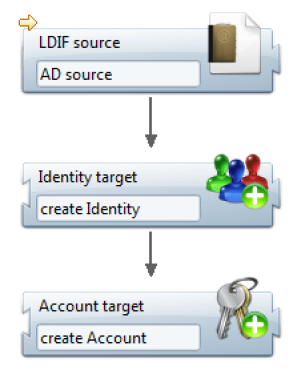
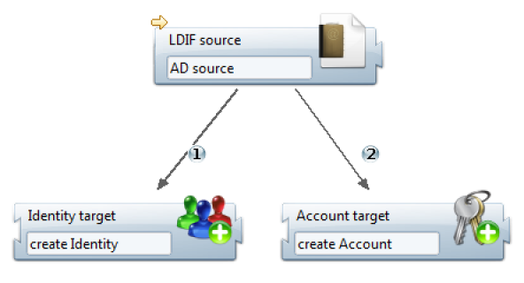

# Collector Engine Operations

A collector line consists of a sequence of components. A component is a processing unit in charge of performing a specific task. The product provides about twenty components as standard, but it is possible to add others without any programming to extend the features of the collector engine.  
The components are interconnected through directed transitions which signal the direction of data flow. The collector engine behaves like a sequencer which requires the source to read a record from the file and passes the record to the next component in accordance with the transitions, until the last component, which has no outgoing transition.  
A collector line always consists of a primary source. If we need to aggregate data from multiple sources, secondary sources may be implemented with joins but their operation is controlled by the primary source.  
Since the objective of the collector is to provide data to the ledger, a collector line generally includes one or more target components, each dedicated to providing a concept. It is quite normal to include multiple targets in a collector line. For example, if the LDIF export of the Active Directory is used as the source for accounts and identities, the collector line can serialize a target identity and target account.

## Principles of Operations

### Source Type Component

A source type component's objective is to list the records from a repository. The components available as standard in the product process only file type sources. The extraction of data from client repositories in the form of files is not supported by the product and must be addressed in integration mode.  
The general principle of operation of a file type source component is to read a record and transmit it to the next component. The notion of record depends on the type of file. This is a set of attributes constituting a single object. For example, for a CSV file, it is a line in the file. For an LDIF file, it is an entry consisting of several lines, each giving the value of an attribute. This record goes through all components according to the transitions established in the collector line. When the record has been processed by the last component, the source reads the next record, and so on until the end of the file.  
Source type components read the records and convert them into a Dataset type structure in order for data to be transmitted in a common format and standardized throughout the collector line. This data structure is called 'dataset' (DataSet). A dataset is a list of attributes. Each attribute is named and may contain multiple values.  
File type sources offer the following specific options:

- File characteristics: File name and file encoding are the options common to all types of files. Specific characteristics like the separator and columns for a CSV file or the root to process (lower DN) for an LDIF file are present according to the file format.
- Verification of file size: Some verifications may be carried out on file size, date of the file, and the file pattern. These options are useful to avoid processing a file that would be too short (probably truncated), too old (maybe obsolete), or incomplete in terms of pattern (missing column in a CSV file, for example).

All of the sources offer the following options:

- Selection of a subset of records: This option provides the possibility of selecting certain records by their numbers. The settings allow you to ignore the X first records and process only the Y following records. This filtering doesn't take into account the content of the records. For a filter related to content, use the SQL query.
- Filtering records by SQL query: The objective of filtering by SQL query is to filter the records according to their content. This type of filtering works no matter what the source type is, because the SQL filter is applied once the source has retrieved the data and transformed them into a DataSet. Only SELECT queries are authorized and the main table name must be 'dataset'. The 'where' clause allows you to test the values of the dataset attributes. All the standard SQL functions are present, such as upper, lower, trim, substring, left, concat...
- Sorting records: The purpose of sorting records is to present the records in a collector line in a certain order. This option is especially useful when a source is used in association with a grouping component.  

Source type components mainly contribute to the establishment of the database pattern. The pattern is the definition of the set of attributes handled in the different components of the collector line. The definition includes the name and attribute type (String, Number, Date, or Boolean) and multivalued indicator. Each source defines the attributes corresponding to the columns or tags present in the input file, which automatically fill in the pattern of the collector line. On the other hand, the source script adds no attribute declaration to the pattern. Attributes generated in JavaScript must be declared manually in the component's properties.  

> [!warning] the declaration of an attribute in the pattern does not guarantee the presence of the attribute in the dataset during the execution of the collector line. Only columns or tags having a value will create an attribute in the dataset.

### Filter Type and Target Type Components

Filter type components are used to modify the contents of the current dataset while the target type components provide data to the ledger from the current dataset without modifying anything. In both cases, components accept a dataset as input, process it, and then go to the next component according to the transitions.  
It is important to note that a target type component is not a terminal element in the collector line, but it may have one or more outgoing transitions to other filter or target type components as shown in the following example:

Only filter type components are involved in the formation of the data pattern. For example, adding an attribute calculated from another one in the modification component automatically declares the new attribute in the collector line pattern. Target type components never modify the dataset and, therefore, have no effect on the pattern.

### Transitions, Events and Conditions

The components of a collector line are connected to each other by transitions. If several transitions start from a component, each of them is numbered in order to follow them in ascending order of their numbers.

A transition may carry a condition authorizing or preventing crossing the link to reach the next component. This condition is always expressed in the form of a JavaScript function call. In the graphical editor, text may be displayed expressing the condition clearly for an easier understanding of the collector line.

The general principle of operation of the transitions is the following when there is at least one outgoing transition:

- Evaluation of all the JavaScript conditions: If a transition has no condition, we consider that it must be crossed to move to the next component. This step allows us to determine the entire list of transitions which must be performed before following a particular transition.
- If at least one transition remains in the list:
- Passing the first transition: The transition is performed and the next component is executed as well as all the following sub-components.
- Taking into account the 'Follow only one link' option: When the first following component and all the sub-components have finished running, the collector engine verifies the 'Follow only one link' option. This option, when activated, allows you to ignore other transitions after running the first one.
- If the 'Follow only one link' option is not activated:
- Passing all other transitions: Following the number order of the transitions, each transition is performed and the next component and all subcomponents are executed.  

The condition associated with a transition is a JavaScript activation expression which must return a Boolean to allow or prevent access to the next component. This macro is referenced in the transition in the 'activation function' field as shown in the following screenshot:  

It is important to note that the transition conditions are all evaluated before being performed, and not as the following components are running.  

  

The return value of the activation expression is true if the transition can be performed, false otherwise. If the activation expression returns true, the next component is executed.  
In most cases, the activation expression tests the dataset contents as in the example above. However, in some cases, the passage of a transition must be made conditional upon the detection of a particular event. Indeed, some components generate events generally corresponding to working errors. For example, the modifying component of an attribute may generate an event if the attribute does not exist. The name of the event may be freely chosen. It becomes possible to pass on a particular transition when the event has been detected. The following code does the opposite as it prevents the transition from passing if the '_unknown attribute'_ event is detected:  
{dataset.hasEvent('unknown attribute')}  

It can be useful to combine a transition condition with the 'Follow only one link' option to make a connection of the 'if ... then ... else' type. If we take the previous example with the _'unknown attribute'_ event, it is possible to create two different paths depending on the detection or not of this event. The first transition should be crossed if the event has not been detected while the second transition should be crossed if the event is detected. Both transitions (and associated components) are exclusive. To achieve this conditional fork, just put a condition on the first transition and enable 'Follow only one link'. No condition is required for the second transition since it is performed only if the condition of the first transition is not verified.

### Starting and Ending Points

A collector line must define the primary source as a starting point. Otherwise, the collector line cannot be run. A collector line can only contain one starting point, and this starting point is always a source.  
A collector line may consist of several paths, each ending with a filter or a target. It is quite normal to have multiple terminals components (without outgoing transitions) in a collector line. A single ending point is not necessary.  
An ending point should only be defined in two cases:  

- when the collector line is called by another collector line.
- when the collector line is packaged as a source component or filter.

A single ending point may be defined in a collector line. The ending point does not mean that the collector stops when the component with the ending point is reached. The collector engine totally ignores the ending point when it is running the line. The ending point is only useful when a collector line is called by another collector line, packaged as a component or not. In this case, the datasets of the sub-collector line must go back to the main collector line. The ending point designates the component which gives its datasets to the calling line. Another way to understand the ending point is to imagine a virtual transition starting from the component and carrying the ending point towards the component of the calling collector line.

## Collector Engine States and its Components

The collector engine goes through several states as it is executed. The following diagram shows the sequence of the states:

  

The explanation of each state and of the transitions is given below:

- Initialising: This is the initial state of the collector line. In this state, the collector engine asks each component of the line to initialize itself. The boot order of the components is random. It is mainly a question of reading the configuration of the xml file, whose extension is .collect. If an error occurs, the engine stops the processes immediately without alerting any other component.

- Starting: In this state, the collector engine asks each component to prepare the environment allowing the processing of data. The notification order of the components is random. For example, for a file type source, the Starting state corresponds to opening the file, size, date, and first record starting point verifications. If an error occurs, the collector engine goes immediately into the Disposing state.

- Executing: This is the state in which all the data from the main source are read and processed by the different components, following the collector line transitions. When the collector engine goes into this state, it doesn't notify any component. It only asks the main source to constitute a dataset and to pass it to the following components through transitions. The call to the main source is repeated as long as the source produces a dataset. When the main source has no more datasets, the collector engine moves to the Flushing state. If an error occurs, the engine goes to the Disposing state which asks all the components to free up the allocated resources.

- Flushing: This is a state which allows components to handle the latest datasets which were pending or waiting for an event. This scenario happens for example with the grouping component which aggregates datasets into a single dataset. This component always keeps the last dataset in memory and only passes it along when the engine goes to the Flushing state. In this state, the engine notifies all the components so they may finish processing any retained datasets. Notification order of the components is random. If an error occurs, the engine goes to the Disposing state without finishing notifying the other components.

- Terminating: The collector engine goes into the Terminating state at the end of execution if no errors were encountered. All of the components are notified that the execution was successfully concluded. Notification order of the components is random. If an error occurs, the engine goes to the Disposing state.

- Disposing: This is the state in which all of the components are notified to free up the allotted resources. The notification order of the components is random. Unlike the other states, if an error occurs, the collector engine ignores the error and continues the notification of the other components so that all components may free up their resources.

### Components Operating Lifecycle

The notion of state relates to the collector engine. From the components' point of view, state changes are made evident by notifications sent by the collector engine to the components. The notifications received are identical regardless of the type of component (source, target or filter) except when the collector engine is in the Executing state. In this case, the source receives an OnRead notification while other types of components receive an OnWrite notification. The following table shows the correspondence between the changes of state of the collector engine and notifications received by the components:

|**State of the collector engine**|**Notification of the components**|
|-|-|
|Initialising|onInit|
|Starting|onStart|
|Executing|For each dataset:  - onRead (main source)  - onWrite (other components) until there is no more data at the source|
|Flushing|onFlush|
|Terminating|onTerminate|
|Disposing|onDispose|

In the Executing state, the collector engine sends the OnRead notification to the main source so that it returns a dataset. As long as a dataset is available, the engine loops on the onRead notification to the same main source so it will list the records one by one in the form of datasets. Whenever a dataset is returned by the source, the collector engine sends it progressively to the following components, observing the path drawn by the transitions, through an OnWrite notification. When the main source has no more datasets, the collector engine goes into the Flushing state.

### Lifecycle with Join

When the collector line contains a join to a secondary source, the kinematics are slightly different. Indeed, whenever the join sees a dataset pass, it asks the secondary source to list all the records. From a notification point of view, the join receives a dataset through the OnWrite notification. It then loops back to sending OnRead notifications to the source in order to retrieve all of the records until there is no more data.  
An additional notification exists to indicate to the source that it should start the list again from the beginning. The onReset notification is sent by the join to the source before each list of records. In the case of a file type source, this allows the source to reposition itself at the beginning of the file when it receives the onReset notification, then to return a record each time it receives the OnRead notification.

## Data Flow

### Dataset and Data Pattern

In a collector line, some components declare attributes. This is particularly the case of source components (CSV, LDIF, ...) in which a correspondence is established between the columns of the file and the attributes of the dataset which runs in memory. The modifying component also declares attributes. All these declarations are involved in the formation of the collector's data pattern. The data pattern is the inventory of all the attributes handled during the execution of the collector line. An attribute in the pattern is characterized by a name, a type (String, Number, Date, or Boolean) and a multivalued indicator. Attributes thus declared cannot change type or multivalued indicator when running.  
When running, a JavaScript function may dynamically declare a new attribute by specifying its name, type and multivalued indicator. The pattern is then completed with this new definition.  
A dataset is the element that is transmitted from one component to another by following transitions of the collector line. The dataset contains a set of attributes, where each attribute may contain one or more values as declared in the pattern (multivalued indicator). It is important to note that all the attributes declared in the collector line may not be present at all times in the dataset at runtime. Indeed, the source components only add attributes corresponding to a non-empty column in the file to the dataset. The following diagram shows the structure of a data set:

It is important to understand this structure if you want to manipulate the dataset in a JavaScript function or a macro. There are APIs that allow you to list out each nesting level and alter the dataset or the content of a particular attribute.

### Transmit a Dataset

While the collector line runs, a dataset is created by the main source and then transmitted to other components following the various transitions. There is a variable called 'dataset' which always contains the current dataset.  
In reality, the same dataset does not flow between components. Whenever a component must pass the dataset to another component through a transition, the dataset is duplicated and the next component receives a copy of the dataset. This copy becomes the current dataset available through the 'dataset' variable.  
The impact of this relates to the forks when two transitions start from the same component. For example, component A has two outgoing transitions to components B and C. When running, component A is executed and has a dataset. The dataset is duplicated and transmitted to component B. Once B has been processed, component A duplicates the dataset a second time and sends it to component C. It is important to understand in this example that component C receives dataset from component A and not from component B even if component B was run before it. If component B modifies the dataset by adding an 'attrb' attribute, component C receives a dataset that does not contain the 'attrb' attribute. For component C to receive the component B's changes in the dataset, we must review the design of the collector line to bind A to B and B to C.

### Join with a Secondary Source

The presence of a join in a collector line means that there are two data flows, one from the main source and the other from the secondary source. The secondary source is triggered by the join. The join is the synchronization point of two data flows that never mix.

The principle of the join is to reread the entire file from the secondary source for each primary record. This type of component is used to enrich a main record with information found in another file. Once a record goes through the join, the join component asks the secondary source to list all the secondary records. It is possible to match a main record with a specific secondary record on a join criterion such as a unique ID or an ID found in both data flows (in both files).  
To do this, the join passes the main dataset to the secondary source so that it can serve as a filter in the selection of records of the second file. In the secondary source component, a 'param' variable contains the main current dataset while the dataset variable denotes, as usual, the secondary dataset that has just been formed with the columns in the file.  
Records in the secondary source are selected by placing a filter that uses the SQL 'param' variable. In the following example, the main dataset contains the unique ID. The number is used to fetch the _email_ found in a second file that contains only two columns: _userid_ (the number) and _email_. At the secondary source level, the following SQL filter is set to find the record which matches the desired number (number present in the main dataset and designated by the 'param' variable):  

`SELECT * FROM dataset WHERE param.unique_ID = dataset.userid`

In the example above, the join component asks the secondary source to list all the records. But the SQL filter only retains the records whose userid column in the secondary file is equal to the unique ID in the main file. Thus, only a record corresponding to the requested registration number and containing the email and userid is returned to the join. We note that the join is the component that calls a secondary source but it is the secondary source itself that performs the join operation by selecting the correct record.  
This operating principle offers the advantage of being generic. It applies regardless of the nature of the primary and secondary sources (file, script or other). However, in the case of a source file, the secondary file is reread for each record in the main dataset which degrades the overall performance of the collector line. It is possible to implement a cache for the join component in order to accelerate processing.  
Activating the cache means that the join component retrieves and keeps all the records from the secondary source in memory. The direct consequence is that the secondary source must, this time, provide all records without filtering because it is now the join component that performs the join operation between the two datasets. To do this, a setting in the join component allows the calculation of a key from each secondary record to compare it to a key derived from the main record. The algorithm used is as follows:  

- During the first pass in the join component
- Request the secondary source list out all the records
- For each secondary record, the join component
- Calculates a key from each secondary record
- Saves the key, records the pair in an association table (hashmap)
- During each main dataset pass, the join component
- Calculates a key from a main record
- Searches for the secondary record in the association table with the primary key  

 `SELECT * FROM dataset WHERE dataset.unique_ID LIKE 'A%'  

Note that all references to the 'param' variable have disappeared because the secondary source is no longer joined with the unique ID of the primary dataset.  

Note that the cache is a memory cache, so it is not recommended to implement it if the number of records is too large. The memory size used is directly related to the size of the secondary source file. One way to reduce the memory size is to only cache the information useful for processing. If we take the example above with the columns _userid_ and _email_, it is possible that the file read by the source contains other columns that should be ignored. In addition, if the unique IDs to be taken into account must begin with the letter 'A', there is no need to save all of the records the cache, particularly including unique IDs not starting with 'A'. To minimize the memory used in this case, you must first ensure you select only the _userid_ and _email_ columns in the source component and add an SQL filter which returns only records with a unique ID starting with 'A':

### Data Grouping

The data grouping component is useful for gathering several values that were initially separated into several different records in a multivalued attribute. For example, an HR extraction can provide a CSV file with one line per identity. If an identity has several jobs, the identity appears on multiple lines with all the information repeated and a different job on each line. To reconstitute a single dataset with a multivalued attribute _job_ from multiple CSV records, you must use the grouping component.  

The grouping component works by detecting ruptures. An expression based on the content of the dataset is set in the component in order to allow it, during the execution of the collector line, to determine when a rupture occurs. In the example with the job, the rupture happens when first name and last name change. In this case, enter the expression as follows:  

{ dataset.first_name.get() + ' ' + dataset.last_name.get() }  

For each dataset arriving in the grouping component, the expression is evaluated. If the result is different from the result of the expression in the previous dataset, this means that the new dataset relates to a different identity, otherwise the dataset completes the previous dataset as it is for the same identity (same first and last name). This detection is called rupture detection.  
The algorithm used to group the attribute values is as follows:  

- For each dataset received by the component
- Calculate the rupture expression
- If no break is detected (same identity in the above example)
- Aggregation of values of this new dataset (_job_ attribute in the example) in the previous dataset
- Removal the new dataset to send nothing to the following components
- Otherwise (new identity in the example)
- Emission of the previous dataset towards the following components
- Memorization of the new dataset as a starting point for the attributes aggregation

This mechanism introduces a desynchronization between the datasets received by the component and the datasets issued after grouping the _job_ attribute to the following components. Indeed, while the second dataset arrives in the component group, the group outputs the first dataset to other components, and so on. With this mechanism, when the last dataset is received, the component emits the next-to-last dataset to the following components. It is only when the collector engine goes into the Flushing state that the grouping component can transmit the last dataset which was waiting for rupture detection.

### Call a Collector Line

A collector line may be called from another collector line. Hiding behind this feature are two different objectives:  

- Create a data source functionally richer than the source components provided as standard.
- Run one collector line from another.

From a more technical point of view, a sub-collector line is a normal collector line with a primary source and target or filter components. In the main collector line, the sub-line can be used as a source or as a filter. Depending on the option chosen, the kinematics of dataset movement is different:

|**Type of call**|**Operation**|**Datasets returned**|
|-|-|-|
|Source|The Sub-collector line replaces a source type component and behaves in exactly the same way. The sub-collector line should list the records and return them to the calling line collector in the form of datasets. The only difference is in the wealth of processes able to be performed by the sub-line because it may include as many components as necessary to shape the dataset to return to the main line.|The datasets generated by the sub-collector line are returned to the main collector line. An ending point must be defined in the sub-line to specify the component that will give its datasets to the calling line.|
|Filter|The sub-collector line is called each time a dataset is transmitted in the main collector line. However, the sub-line is not part of the main line with, for example, some filters which are linked but it is a complete line with a source type component. Overall, this means that the called collector line is not a sub-line but is an autonomous collector line in terms of data. It does not receive the dataset from the main line and it does not return a dataset. It simply triggers another collector line.|The Sub-collector line does not return any dataset. Therefore, the definition of an ending point in the sub-line is not useful.|

In general, the sub-collector lines in source mode are designed to create source component libraries with verticalized semantics. This is the best way to add repository support applications such as HR databases or business application accounts database exports to the product. The consultant can thus, through the various projects, compile a whole collection of reusable lines. When the collector line is stable, it becomes interesting to consider it as a black box by packaging it as a source component. The collector line and all its dependencies are then transformed into a file component in the library directory of the project. All the components packaged in this way appear in the palette of the source component of the collector line editor just like the standard components of the product.  
The collector lines in filter mode have a very different purpose. It is actually a question of making a main collector line which links all the lines created during a project. This allows us to launch a single line that runs all the lines in the desired order. This mode of operation is similar to a batch (in DOS mode) or a shell script (in Unix mode) that would call each collector line one by one.  

## Logs

Running the collector engine generates two types of logs: a log about functional events and a detailed log file. Logs are generated in the logs directory of the project. Log content is localized.

### Events

Some components can generate events to which the designer of the collector line gives a name. The semantics of events is fixed for the standard components. However, it is possible to trigger an event with a JavaScript function. In this case, the semantics of the event are only known to the creator of the collector line.  
An event consists of a name chosen by the designer of the collector line and of a context (the reference of the component that issued the event and the dataset at the onset of the event). An example of an event is the failure to reconcile an account with an identity in the target account.  
Once an event is triggered, there are two immediate consequences:

- The event is added to the current dataset. This allows us, when the component exits, to test for the presence of the event in the transition to make the execution of the following components conditional.
- The event is saved in a log file whose prefix is event and whose suffix is csv.

This log file is in CSV format so it can be read in a spreadsheet-type tool. It contains at a minimum the name of the event given by the collector line's designer, a descriptive text generated by the component, the name of the component that triggered the event, and a dataset dump at the time the event was detected.  
The log file is only created in the log directory if at least one event is detected. If runtime concludes with no event being triggered, then the log file is not created in the log directory.

### Traces

The implementation of the collector line generates relatively verbose traces in a file. The purpose of these traces is to be able to find the context if a functional problem occurs in the collector line. For this, a turning file mechanism is used, with only two files. Once a file is full, it is renamed and a new file is created.  
With this mechanism, if the collector line processes many records during runtime, the traces from the beginning of runtime are lost. But the purpose of these traces is not to reconstruct everything that has happened since the beginning of runtime, but to have the traces of the latest processes performed on the latest datasets. This allows us to reconstruct the context if a problem occurs and to understand the causes.
