# Collector Engine Operations


A collector line consists of a sequence of components. A component is a processing unit in charge of performing a specific task. The product provides about twenty components as standard, but it is possible to add others without any programming to extend the features of the collector engine.   
The components are interconnected through directed transitions which signal the direction of data flow. The collector engine behaves like a sequencer which requires the source to read a record from the file and passes the record to the next component in accordance with the transitions, until the last component, which has no outgoing transition.   
A collector line always consists of a primary source. If we need to aggregate data from multiple sources, secondary sources may be implemented with joins but their operation is controlled by the primary source.   
Since the objective of the collector is to provide data to the ledger, a collector line generally includes one or more target components, each dedicated to providing a concept. It is quite normal to include multiple targets in a collector line. For example, if the LDIF export of the Active Directory is used as the source for accounts and identities, the collector line can serialize a target identity and target account.

## Principles of Operations
### Source Type Component

A source type component's objective is to list the records from a repository. The components available as standard in the product process only file type sources. The extraction of data from client repositories in the form of files is not supported by the product and must be addressed in integration mode.   
The general principle of operation of a file type source component is to read a record and transmit it to the next component. The notion of record depends on the type of file. This is a set of attributes constituting a single object. For example, for a CSV file, it is a line in the file. For an LDIF file, it is an entry consisting of several lines, each giving the value of an attribute. This record goes through all components according to the transitions established in the collector line. When the record has been processed by the last component, the source reads the next record, and so on until the end of the file.   
Source type components read the records and convert them into a Dataset type structure in order for data to be transmitted in a common format and standardized throughout the collector line. This data structure is called 'dataset' (DataSet). A dataset is a list of attributes. Each attribute is named and may contain multiple values.   
File type sources offer the following specific options:

- File characteristics: File name and file encoding are the options common to all types of files. Specific characteristics like the separator and columns for a CSV file or the root to process (lower DN) for an LDIF file are present according to the file format.
- Verification of file size: Some verifications may be carried out on file size, date of the file, and the file pattern. These options are useful to avoid processing a file that would be too short (probably truncated), too old (maybe obsolete), or incomplete in terms of pattern (missing column in a CSV file, for example).

All of the sources offer the following options:

- Selection of a subset of records: This option provides the possibility of selecting certain records by their numbers. The settings allow you to ignore the X first records and process only the Y following records. This filtering doesn't take into account the content of the records. For a filter related to content, use the SQL query.
- Filtering records by SQL query: The objective of filtering by SQL query is to filter the records according to their content. This type of filtering works no matter what the source type is, because the SQL filter is applied once the source has retrieved the data and transformed them into a DataSet. Only SELECT queries are authorized and the main table name must be 'dataset'. The 'where' clause allows you to test the values of the dataset attributes. All the standard SQL functions are present, such as upper, lower, trim, substring, left, concat...
- Sorting records: The purpose of sorting records is to present the records in a collector line in a certain order. This option is especially useful when a source is used in association with a grouping component.   

Source type components mainly contribute to the establishment of the database pattern. The pattern is the definition of the set of attributes handled in the different components of the collector line. The definition includes the name and attribute type (String, Number, Date, or Boolean) and multivalued indicator. Each source defines the attributes corresponding to the columns or tags present in the input file, which automatically fill in the pattern of the collector line. On the other hand, the source script adds no attribute declaration to the pattern. Attributes generated in JavaScript must be declared manually in the component's properties.   

| **Important:** <br><br> the declaration of an attribute in the pattern does not guarantee the presence of the attribute in the dataset during the execution of the collector line. Only columns or tags having a value will create an attribute in the dataset.

### Filter Type and Target Type Components

Filter type components are used to modify the contents of the current dataset while the target type components provide data to the ledger from the current dataset without modifying anything. In both cases, components accept a dataset as input, process it, and then go to the next component according to the transitions.   
It is important to note that a target type component is not a terminal element in the collector line, but it may have one or more outgoing transitions to other filter or target type components as shown in the following example:

   

**_Sequencing several targets_**

Only filter type components are involved in the formation of the data pattern. For example, adding an attribute calculated from another one in the modification component automatically declares the new attribute in the collector line pattern. Target type components never modify the dataset and, therefore, have no effect on the pattern.

### Transitions, Events and Conditions

The components of a collector line are connected to each other by transitions. If several transitions start from a component, each of them is numbered in order to follow them in ascending order of their numbers.

   
**_Numbered transitions_**

A transition may carry a condition authorizing or preventing crossing the link to reach the next component. This condition is always expressed in the form of a JavaScript function call. In the graphical editor, text may be displayed expressing the condition clearly for an easier understanding of the collector line.

   
**_Conditioned transitions_**

The general principle of operation of the transitions is the following when there is at least one outgoing transition:

- Evaluation of all the JavaScript conditions: If a transition has no condition, we consider that it must be crossed to move to the next component. This step allows us to determine the entire list of transitions which must be performed before following a particular transition.
- If at least one transition remains in the list:
- Passing the first transition: The transition is performed and the next component is executed as well as all the following sub-components.
- Taking into account the 'Follow only one link' option: When the first following component and all the sub-components have finished running, the collector engine verifies the 'Follow only one link' option. This option, when activated, allows you to ignore other transitions after running the first one.
- If the 'Follow only one link' option is not activated:
- Passing all other transitions: Following the number order of the transitions, each transition is performed and the next component and all subcomponents are executed.   

The condition associated with a transition is a JavaScript activation expression which must return a Boolean to allow or prevent access to the next component. This macro is referenced in the transition in the 'activation function' field as shown in the following screenshot:   

It is important to note that the transition conditions are all evaluated before being performed, and not as the following components are running.   

   
**_Activation expression in a transition_**  

The return value of the activation expression is true if the transition can be performed, false otherwise. If the activation expression returns true, the next component is executed.   
In most cases, the activation expression tests the dataset contents as in the example above. However, in some cases, the passage of a transition must be made conditional upon the detection of a particular event. Indeed, some components generate events generally corresponding to working errors. For example, the modifying component of an attribute may generate an event if the attribute does not exist. The name of the event may be freely chosen. It becomes possible to pass on a particular transition when the event has been detected. The following code does the opposite as it prevents the transition from passing if the '_unknown attribute'_ event is detected:    
{dataset.hasEvent('unknown attribute')}   

It can be useful to combine a transition condition with the 'Follow only one link' option to make a connection of the 'if ... then ... else' type. If we take the previous example with the _'unknown attribute'_ event, it is possible to create two different paths depending on the detection or not of this event. The first transition should be crossed if the event has not been detected while the second transition should be crossed if the event is detected. Both transitions (and associated components) are exclusive. To achieve this conditional fork, just put a condition on the first transition and enable 'Follow only one link'. No condition is required for the second transition since it is performed only if the condition of the first transition is not verified.

### Starting and Ending Points

A collector line must define the primary source as a starting point. Otherwise, the collector line cannot be run. A collector line can only contain one starting point, and this starting point is always a source.   
A collector line may consist of several paths, each ending with a filter or a target. It is quite normal to have multiple terminals components (without outgoing transitions) in a collector line. A single ending point is not necessary.   
An ending point should only be defined in two cases:   

- when the collector line is called by another collector line.
- when the collector line is packaged as a source component or filter.

A single ending point may be defined in a collector line. The ending point does not mean that the collector stops when the component with the ending point is reached. The collector engine totally ignores the ending point when it is running the line. The ending point is only useful when a collector line is called by another collector line, packaged as a component or not. In this case, the datasets of the sub-collector line must go back to the main collector line. The ending point designates the component which gives its datasets to the calling line. Another way to understand the ending point is to imagine a virtual transition starting from the component and carrying the ending point towards the component of the calling collector line.

## Collector Engine States and its Components

The collector engine goes through several states as it is executed. The following diagram shows the sequence of the states:


**_Collector engine states_**  

The explanation of each state and of the transitions is given below:

- Initialising: This is the initial state of the collector line. In this state, the collector engine asks each component of the line to initialize itself. The boot order of the components is random. It is mainly a question of reading the configuration of the xml file, whose extension is .collect. If an error occurs, the engine stops the processes immediately without alerting any other component.

- Starting: In this state, the collector engine asks each component to prepare the environment allowing the processing of data. The notification order of the components is random. For example, for a file type source, the Starting state corresponds to opening the file, size, date, and first record starting point verifications. If an error occurs, the collector engine goes immediately into the Disposing state.

- Executing: This is the state in which all the data from the main source are read and processed by the different components, following the collector line transitions. When the collector engine goes into this state, it doesn't notify any component. It only asks the main source to constitute a dataset and to pass it to the following components through transitions. The call to the main source is repeated as long as the source produces a dataset. When the main source has no more datasets, the collector engine moves to the Flushing state. If an error occurs, the engine goes to the Disposing state which asks all the components to free up the allocated resources.

- Flushing: This is a state which allows components to handle the latest datasets which were pending or waiting for an event. This scenario happens for example with the grouping component which aggregates datasets into a single dataset. This component always keeps the last dataset in memory and only passes it along when the engine goes to the Flushing state. In this state, the engine notifies all the components so they may finish processing any retained datasets. Notification order of the components is random. If an error occurs, the engine goes to the Disposing state without finishing notifying the other components.

- Terminating: The collector engine goes into the Terminating state at the end of execution if no errors were encountered. All of the components are notified that the execution was successfully concluded. Notification order of the components is random. If an error occurs, the engine goes to the Disposing state.

- Disposing: This is the state in which all of the components are notified to free up the allotted resources. The notification order of the components is random. Unlike the other states, if an error occurs, the collector engine ignores the error and continues the notification of the other components so that all components may free up their resources.

### Components Operating Lifecycle


The notion of state relates to the collector engine. From the components' point of view, state changes are made evident by notifications sent by the collector engine to the components. The notifications received are identical regardless of the type of component (source, target or filter) except when the collector engine is in the Executing state. In this case, the source receives an OnRead notification while other types of components receive an OnWrite notification. The following table shows the correspondence between the changes of state of the collector engine and notifications received by the components:

|**State of the collector engine**|**Notification of the components**|
|Initialising|onInit|
|Starting|onStart|
|Executing|For each dataset:<br><br>- onRead (main source) <br>- onWrite (other components) until there is no more data at the source|
|Flushing|onFlush|
|Terminating|onTerminate|
|Disposing|onDispose|

In the Executing state, the collector engine sends the OnRead notification to the main source so that it returns a dataset. As long as a dataset is available, the engine loops on the onRead notification to the same main source so it will list the records one by one in the form of datasets. Whenever a dataset is returned by the source, the collector engine sends it progressively to the following components, observing the path drawn by the transitions, through an OnWrite notification. When the main source has no more datasets, the collector engine goes into the Flushing state.

### Lifecycle with Join


When the collector line contains a join to a secondary source, the kinematics are slightly different. Indeed, whenever the join sees a dataset pass, it asks the secondary source to list all the records. From a notification point of view, the join receives a dataset through the OnWrite notification. It then loops back to sending OnRead notifications to the source in order to retrieve all of the records until there is no more data.   
An additional notification exists to indicate to the source that it should start the list again from the beginning. The onReset notification is sent by the join to the source before each list of records. In the case of a file type source, this allows the source to reposition itself at the beginning of the file when it receives the onReset notification, then to return a record each time it receives the OnRead notification.

## Data Flow

### Dataset and Data Pattern

In a collector line, some components declare attributes. This is particularly the case of source components (CSV, LDIF, ...) in which a correspondence is established between the columns of the file and the attributes of the dataset which runs in memory. The modifying component also declares attributes. All these declarations are involved in the formation of the collector's data pattern. The data pattern is the inventory of all the attributes handled during the execution of the collector line. An attribute in the pattern is characterized by a name, a type (String, Number, Date, or Boolean) and a multivalued indicator. Attributes thus declared cannot change type or multivalued indicator when running.   
When running, a JavaScript function may dynamically declare a new attribute by specifying its name, type and multivalued indicator. The pattern is then completed with this new definition.   
A dataset is the element that is transmitted from one component to another by following transitions of the collector line. The dataset contains a set of attributes, where each attribute may contain one or more values as declared in the pattern (multivalued indicator). It is important to note that all the attributes declared in the collector line may not be present at all times in the dataset at runtime. Indeed, the source components only add attributes corresponding to a non-empty column in the file to the dataset. The following diagram shows the structure of a data set:

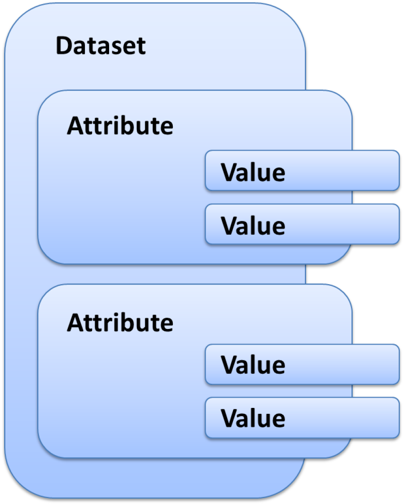
**_Structure of a dataset_**

It is important to understand this structure if you want to manipulate the dataset in a JavaScript function or a macro. There are APIs that allow you to list out each nesting level and alter the dataset or the content of a particular attribute.

### Transmit a Dataset


While the collector line runs, a dataset is created by the main source and then transmitted to other components following the various transitions. There is a variable called 'dataset' which always contains the current dataset.   
In reality, the same dataset does not flow between components. Whenever a component must pass the dataset to another component through a transition, the dataset is duplicated and the next component receives a copy of the dataset. This copy becomes the current dataset available through the 'dataset' variable.   
The impact of this relates to the forks when two transitions start from the same component. For example, component A has two outgoing transitions to components B and C. When running, component A is executed and has a dataset. The dataset is duplicated and transmitted to component B. Once B has been processed, component A duplicates the dataset a second time and sends it to component C. It is important to understand in this example that component C receives dataset from component A and not from component B even if component B was run before it. If component B modifies the dataset by adding an 'attrb' attribute, component C receives a dataset that does not contain the 'attrb' attribute. For component C to receive the component B's changes in the dataset, we must review the design of the collector line to bind A to B and B to C.

### Join with a Secondary Source


The presence of a join in a collector line means that there are two data flows, one from the main source and the other from the secondary source. The secondary source is triggered by the join. The join is the synchronization point of two data flows that never mix.

The principle of the join is to reread the entire file from the secondary source for each primary record. This type of component is used to enrich a main record with information found in another file. Once a record goes through the join, the join component asks the secondary source to list all the secondary records. It is possible to match a main record with a specific secondary record on a join criterion such as a unique ID or an ID found in both data flows (in both files).   
To do this, the join passes the main dataset to the secondary source so that it can serve as a filter in the selection of records of the second file. In the secondary source component, a 'param' variable contains the main current dataset while the dataset variable denotes, as usual, the secondary dataset that has just been formed with the columns in the file.   
Records in the secondary source are selected by placing a filter that uses the SQL 'param' variable. In the following example, the main dataset contains the unique ID. The number is used to fetch the _email_ found in a second file that contains only two columns: _userid_ (the number) and _email_. At the secondary source level, the following SQL filter is set to find the record which matches the desired number (number present in the main dataset and designated by the 'param' variable):   

> > SELECT \* FROM dataset WHERE param.unique\_ID = dataset.userid   

In the example above, the join component asks the secondary source to list all the records. But the SQL filter only retains the records whose userid column in the secondary file is equal to the unique ID in the main file. Thus, only a record corresponding to the requested registration number and containing the email and userid is returned to the join. We note that the join is the component that calls a secondary source but it is the secondary source itself that performs the join operation by selecting the correct record.   
This operating principle offers the advantage of being generic. It applies regardless of the nature of the primary and secondary sources (file, script or other). However, in the case of a source file, the secondary file is reread for each record in the main dataset which degrades the overall performance of the collector line. It is possible to implement a cache for the join component in order to accelerate processing.   
Activating the cache means that the join component retrieves and keeps all the records from the secondary source in memory. The direct consequence is that the secondary source must, this time, provide all records without filtering because it is now the join component that performs the join operation between the two datasets. To do this, a setting in the join component allows the calculation of a key from each secondary record to compare it to a key derived from the main record. The algorithm used is as follows:   

- During the first pass in the join component
- Request the secondary source list out all the records
- For each secondary record, the join component
- Calculates a key from each secondary record
- Saves the key, records the pair in an association table (hashmap)
- During each main dataset pass, the join component
- Calculates a key from a main record
- Searches for the secondary record in the association table with the primary key   

> > SELECT \* FROM dataset WHERE dataset.unique\_ID LIKE 'A%'   

Note that all references to the 'param' variable have disappeared because the secondary source is no longer joined with the unique ID of the primary dataset.   

Note that the cache is a memory cache, so it is not recommended to implement it if the number of records is too large. The memory size used is directly related to the size of the secondary source file. One way to reduce the memory size is to only cache the information useful for processing. If we take the example above with the columns _userid_ and _email_, it is possible that the file read by the source contains other columns that should be ignored. In addition, if the unique IDs to be taken into account must begin with the letter 'A', there is no need to save all of the records the cache, particularly including unique IDs not starting with 'A'. To minimize the memory used in this case, you must first ensure you select only the _userid_ and _email_ columns in the source component and add an SQL filter which returns only records with a unique ID starting with 'A':

### Data Grouping


The data grouping component is useful for gathering several values that were initially separated into several different records in a multivalued attribute. For example, an HR extraction can provide a CSV file with one line per identity. If an identity has several jobs, the identity appears on multiple lines with all the information repeated and a different job on each line. To reconstitute a single dataset with a multivalued attribute _job_ from multiple CSV records, you must use the grouping component.   

The grouping component works by detecting ruptures. An expression based on the content of the dataset is set in the component in order to allow it, during the execution of the collector line, to determine when a rupture occurs. In the example with the job, the rupture happens when first name and last name change. In this case, enter the expression as follows:   

{ dataset.first\_name.get() + ' ' + dataset.last\_name.get() }   

For each dataset arriving in the grouping component, the expression is evaluated. If the result is different from the result of the expression in the previous dataset, this means that the new dataset relates to a different identity, otherwise the dataset completes the previous dataset as it is for the same identity (same first and last name). This detection is called rupture detection.   
The algorithm used to group the attribute values is as follows:   

- For each dataset received by the component
- Calculate the rupture expression
- If no break is detected (same identity in the above example)
- Aggregation of values of this new dataset (_job_ attribute in the example) in the previous dataset
- Removal the new dataset to send nothing to the following components
- Otherwise (new identity in the example)
- Emission of the previous dataset towards the following components
- Memorization of the new dataset as a starting point for the attributes aggregation

This mechanism introduces a desynchronization between the datasets received by the component and the datasets issued after grouping the _job_ attribute to the following components. Indeed, while the second dataset arrives in the component group, the group outputs the first dataset to other components, and so on. With this mechanism, when the last dataset is received, the component emits the next-to-last dataset to the following components. It is only when the collector engine goes into the Flushing state that the grouping component can transmit the last dataset which was waiting for rupture detection.

### Call a Collector Line


A collector line may be called from another collector line. Hiding behind this feature are two different objectives:   

- Create a data source functionally richer than the source components provided as standard.
- Run one collector line from another.

From a more technical point of view, a sub-collector line is a normal collector line with a primary source and target or filter components. In the main collector line, the sub-line can be used as a source or as a filter. Depending on the option chosen, the kinematics of dataset movement is different:

|**Type of call**|**Operation**|**Datasets returned**|
|Source|The Sub-collector line replaces a source type component and behaves in exactly the same way. The sub-collector line should list the records and return them to the calling line collector in the form of datasets. The only difference is in the wealth of processes able to be performed by the sub-line because it may include as many components as necessary to shape the dataset to return to the main line.|The datasets generated by the sub-collector line are returned to the main collector line. An ending point must be defined in the sub-line to specify the component that will give its datasets to the calling line.|
|Filter|The sub-collector line is called each time a dataset is transmitted in the main collector line. However, the sub-line is not part of the main line with, for example, some filters which are linked but it is a complete line with a source type component. Overall, this means that the called collector line is not a sub-line but is an autonomous collector line in terms of data. It does not receive the dataset from the main line and it does not return a dataset. It simply triggers another collector line.|The Sub-collector line does not return any dataset. Therefore, the definition of an ending point in the sub-line is not useful.|

In general, the sub-collector lines in source mode are designed to create source component libraries with verticalized semantics. This is the best way to add repository support applications such as HR databases or business application accounts database exports to the product. The consultant can thus, through the various projects, compile a whole collection of reusable lines. When the collector line is stable, it becomes interesting to consider it as a black box by packaging it as a source component. The collector line and all its dependencies are then transformed into a file component in the library directory of the project. All the components packaged in this way appear in the palette of the source component of the collector line editor just like the standard components of the product.   
The collector lines in filter mode have a very different purpose. It is actually a question of making a main collector line which links all the lines created during a project. This allows us to launch a single line that runs all the lines in the desired order. This mode of operation is similar to a batch (in DOS mode) or a shell script (in Unix mode) that would call each collector line one by one.   

## Logs

Running the collector engine generates two types of logs: a log about functional events and a detailed log file. Logs are generated in the logs directory of the project. Log content is localized.
### Events


Some components can generate events to which the designer of the collector line gives a name. The semantics of events is fixed for the standard components. However, it is possible to trigger an event with a JavaScript function. In this case, the semantics of the event are only known to the creator of the collector line.   
An event consists of a name chosen by the designer of the collector line and of a context (the reference of the component that issued the event and the dataset at the onset of the event). An example of an event is the failure to reconcile an account with an identity in the target account.   
Once an event is triggered, there are two immediate consequences:

- The event is added to the current dataset. This allows us, when the component exits, to test for the presence of the event in the transition to make the execution of the following components conditional.
- The event is saved in a log file whose prefix is event and whose suffix is csv.

This log file is in CSV format so it can be read in a spreadsheet-type tool. It contains at a minimum the name of the event given by the collector line's designer, a descriptive text generated by the component, the name of the component that triggered the event, and a dataset dump at the time the event was detected.   
The log file is only created in the log directory if at least one event is detected. If runtime concludes with no event being triggered, then the log file is not created in the log directory.

### Traces

The implementation of the collector line generates relatively verbose traces in a file. The purpose of these traces is to be able to find the context if a functional problem occurs in the collector line. For this, a turning file mechanism is used, with only two files. Once a file is full, it is renamed and a new file is created.   
With this mechanism, if the collector line processes many records during runtime, the traces from the beginning of runtime are lost. But the purpose of these traces is not to reconstruct everything that has happened since the beginning of runtime, but to have the traces of the latest processes performed on the latest datasets. This allows us to reconstruct the context if a problem occurs and to understand the causes.

# Collector Components

## Sources

### Collector Line Source


#### Usage  

The collector line source allows the product to read data that will be filtered by an existing collect line.

#### The Properties Tab

###### Source

In this sub-tab it is possible to see/modify general parameters of the component. You will find:

- The "_Identifier"_ shown in Debug mode for example
- The _"Display name_" for the collector line source
- _Collector line:_ collect line to use as a data source
- The "_Follow just one link_" option which sets the transition mode. If it is checked, only the first transition with an activation condition evaluated to true will be executed. If it is unchecked, all transitions with an activation evaluation evaluated to true will be executed.

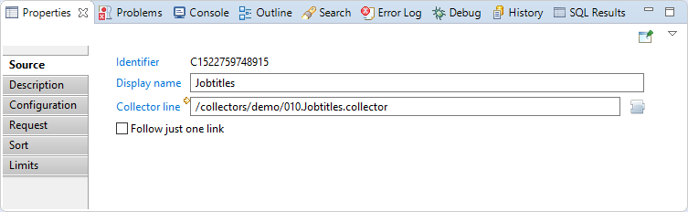   

###### Description

This section allow the configuration of comments regarding actions done by this source component.

   

##### Configuration

This section allows the user to override variables defined in the collector line.

   

##### Request

_SQL syntax request_: is an sql-like select query to filter source records.

The query may check values from current record by using dataset variable as if it was a table.

For example, `SELECT * FROM dataset WHERE dataset.hrcode <> 'VIP'` keeps only records which have a HR code attribute with a value different from 'VIP'.   


##### Sort

In this section you can configure a multi-criteria sort. You will find:

- Sort number 1 (main sort criteria): Attribute name used to sort all source records before delivering them to the collector line in the right order.  
- Sort number 2 (Second sort criteria): Attribute name used to sort all source records before delivering them to the collector line in the right order.  
- Sort number 3 (Third sort criteria): Attribute name used to sort all source records before delivering them to the collector line in the right order.  

The sort direction can also be changed (A-Z for ascending or Z-A for descending).


##### Limits

In this section you can configure a limitation on the selected records from the source, You will find:

- Skip the <u><i>nb</i></u> first records: Used to select a subset of the records by skipping the first records.  
- Select a maximum of <u><i>max</i></u> records: Used to select a subset of the records by reading only a specified number of records.


#### Best Practices

You may have a performance issue when using a limit and/or a sort.
### Filtered Source

#### Usage

The Filtered discovery source allows the product to read data that will be filtered by an existing discovery.   
This is the main source type to use when building your collector lines as the modification of the input data is done in the the discovery file, and the collector line can they simple be used to map the various imported data to the concepts of Brainwave GRC's model.  

#### The Properties Tab

##### Source

In this property you can see/modify general parameters of the component. You will find:

- The "_Identifier"_ shown in Debug mode for example
- The _"Display name_" for the discovery source
- _Discovery file:_ the discovery file to use as a data source
- _Data file_ is the absolute path of data file to load. This parameter allow the use of macros such as `{config.projectPath}`. This parameter is optional, and if empty then the file defined in the discovery file is used.  
- The "_Follow just one link_" option which sets the transition mode. If it is checked, only the first transition with an activation condition evaluated to true will be executed. If it is unchecked, all transitions with an activation evaluation evaluated to true will be executed.


##### Description

This property allows adding comment regarding actions done by this component.


##### Request

_SQL syntax request_: is an sql-like select query to filter source records.

The query may check values from current record by using dataset variable as if it was a table.

For example, `SELECT * FROM dataset WHERE dataset.hrcode <> 'VIP'` keeps only records which have a HR code attribute with a value different from 'VIP'.


##### Sort

In this section you can configure a multi-criteria sort. You will find:   

- _Sort number 1_ (main sort criteria): is attribute name used to sort all source records before delivering them to the collector line in the right order.  
- _Sort number 2_ (Second sort criteria): is attribute name used to sort all source records before delivering them to the collector line in the right order.  
- _Sort number 3_ (Third sort criteria): is attribute name used to sort all source records before delivering them to the collector line in the right order.  

The sort direction can also be changed (A-Z for ascending or Z-A for descending).


##### Limits

In this section you can configure a limitation on the selected records from the source, You will find:

- _"Skip the <u>nb</u> first records"_: Used to select a subset of the records by skipping the first records.  
- _"Select a maximum of <u>max</u> records"_: Used to select a subset of the records by reading only a specified number of records.


##### Constraints

In this section you can define contraintes to not use the file, You will find:

- _"If file size is less than <u>size</u> kilo bytes_": Triggers an exception and stops collector line if the source file size is less than a specified number of kilo-bytes. Used to prevent from reading an incomplete file in automatic mode because of an error during a file transfer for example.  

- _"If last modification date is older than <u>modifDate</u> hour(s)_": Triggers an exception and stops collector line if the source file last modification date is older than a specified number of hours. Used to prevent from reading an obsolete file in automatic mode because of an error during the export process for example.  

- _"If a column is missing in the file"_: Triggers an exception and stops collector line if the file schema is diferent from the schema defined in the source component. Used to prevent from reading a file with a bad format in automatic mode because of a format or layout change in the exported data for example.


#### Best practices

You may have a performance issue when using a limit and/or a sort.  

### Script Source
#### Usage

This source can be used to programmatically generate datasets from JavaScript functions. It can be used to access external resources or parse files whose format is not supported by the discovery source.  

#### The Properties Tab

##### Source

In this tab you can see/modify general parameters of the component. You will find the following:

- _Identifier_ (shown in Debug mode for example)
- _Display name_ for the _Support target_
- _File to analyze_ is an optional path to a file  
- _onScriptInit_ is the initialization JavaScript function. It can take a parameter which will be the file specified just above. It is called only once per collect line  
- _onScriptReset_ is a function which will only be called if this component is the secondary source of a join filter having its cache disabled. In this case, it will be called once for each record of the main source  
- _onScriptRead_ is the function which will be called to get the next record. It can manipulate the dataset, adding or removing attributes, changing values. It must return true if there are more records to read, false otherwise  
- _onScriptTerminate_ is the function called when the collect line ends successfully  
- _onScriptDispose_ is the function called at the end of the collect line. It is always called, whether the line ends successfully or not, and should be used to free all the resources allocated during the initialization phase (close files, database connections and so on)  
- _Follow just one link_ option which sets the transition mode. If it is checked, only the first transition with an activation condition evaluated to true will be executed. If it is unchecked, all transitions with an activation condition evaluated to true will be executed.

   
Note that all the _onScript..._ functions are optional.  

#### Description

This property allows adding comment regarding actions done by this component.


##### Attributes

This property can be used to declare additional attributes to include in the collect line schema, for example when attributes are injected to the dataset by the JavaScript read function.

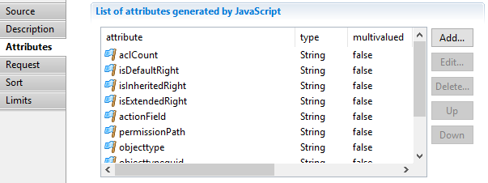

##### Request

_SQL syntax request_: is an sql-like select query to filter source records.   

The query may check values from current record by using dataset variable as if it was a table.   

For example, `SELECT * FROM dataset WHERE dataset.hrcode <> 'VIP'` keeps only records which have a HR code attribute with a value different from 'VIP'.


##### Sort

In this section you can configure a multi-criteria sort. You will find:

- _Sort number 1_ (main sort criteria): Attribute name used to sort all source records before delivering them to the collector line in the right order.  
- _Sort number 2_ (Second sort criteria): Attribute name used to sort all source records before delivering them to the collector line in the right order.  
- _Sort number 3_ (Third sort criteria): Attribute name used to sort all source records before delivering them to the collector line in the right order.  

The sort direction can also be changed (A-Z for ascending or Z-A for descending).


##### Limits

In this section you can configure a limitation on the selected records from the source, You will find:

- Skip the <u>_nb_</u> first records: Used to select a subset of the records by skipping the first records.  
- Select a maximum of <u>_max_</u> records: Used to select a subset of the records by reading only a specified number of records.


#### Best practices

This source should only be used in very specific cases where a discovery source is not suitable. These include (but are not limited to) external resources such as a REST API, a database connection or some "flat" XML files.

In the other cases, a filtered source (discovery) will be much more efficient and maintainable.

#### Error handling  

Any exception raised during the execution of one of the JavaScript functions will cause the collect engine to stop. The exception is logged in the collect log file. 


### Sheet Enumerator for Excel Files
#### Usage

This source component allows to enumerate the sheets belonging to an Excel workbook.  

Four attributes are added to the dataset:  

- _filename_ will be the file name of the Excel file (string),  
- _sheetname_ will contain the name of the current sheet (string),  
- _sheetnumber_ will contain the index number of the current sheet (number),  
- _totalnumberofsheets_ will contain the total number of sheets of the Excel workbook (number).  

#### The Properties Tab

##### Source

In this tab you can see/modify general parameters of the component. You will find the following:

- _Identifier_ (shown in Debug mode for example)
- _Display name_ for the _target_
- _Excel File (XLS, XLSX)_ is the path to the Excel file to use  
- _Follow just one link_ option which sets the transition mode. If it is checked, only the first transition with an activation condition evaluated to true will be executed. If it is unchecked, all transitions with an activation condition evaluated to true will be executed.


##### Description
This property allows adding comment regarding actions done by this component.  


### Start

#### Usage

The Start component is used to start a collector line without necessarily having a data source, it is useful when using collection sequences.   

Example: to create model object, such as repositories, applications and so on, that are based on data declared in the project or in a silo and not in import files.  

#### The properties Tab

##### Source

In this sub-tab you can see/modify general parameters of the component. You will find:

- The "_Identifier"_ shown in Debug mode for example
- The _"Display name_" for the discovery source
- The "_Follow just one link_" option which sets the transition mode. If it is checked, only the first transition with an activation condition evaluated to true will be executed. If it is unchecked, all transitions with an activation evaluation evaluated to true will be executed.

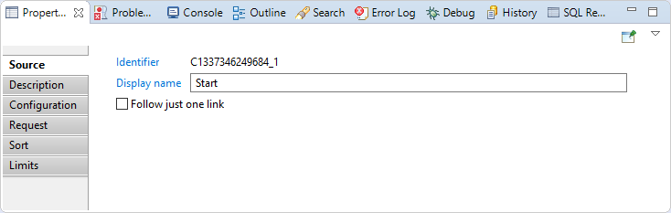

##### Description

Allows the addition of comments regarding actions done by this source component.


##### Configuration

In this section you can override the values of variables used in the collector line.


##### Request

_SQL syntax request_: is an sql-like select query to filter source records.

The query may check values from current record by using dataset variable as if it was a table.

For example, `SELECT * FROM dataset WHERE dataset.hrcode <> 'VIP'` keeps only records which have a HR code attribute with a value different from 'VIP'.


##### Sort

In this section you can configure a multi-criteria sort. You will find:

- Sort number 1 (main sort criteria): Attribute name used to sort all source records before delivering them to the collector line in the right order.  
- Sort number 2 (Second sort criteria): Attribute name used to sort all source records before delivering them to the collector line in the right order.  
- Sort number 3 (Third sort criteria): Attribute name used to sort all source records before delivering them to the collector line in the right order.  

The sort direction can also be changed (A-Z for ascending or Z-A for descending).

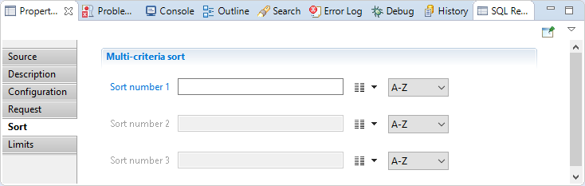

##### Limits

In this section you can configure a limitation on the selected records from the source, You will find:

- Skip the <u>_nb_</u> first records: Used to select a subset of the records by skipping the first records.  
- Select a maximum of <u>_max_</u> records: Used to select a subset of the records by reading only a specified number of records.

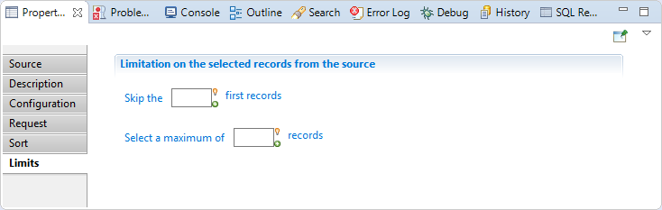

#### Best practices

You may have a performance issue when using a limit and/or a sort.

### View Source

#### Usage

The **View Source** component enables the use of view result as a input during the data collection phase. This component can be use to use data that is not related to the current timeslot.   
One use case is to inject Audit Logs data through a Logs Views source to compute Usage data.   
Another use case is to retrieve right reviews data (through a View source on Ticket Reviews) to collect theoretical rights.

| **Note** <br><br> The view source should be used with caution on regular Ledger Entities, such as accounts, applications, and identities, as the underlying view retrieves data from the **_previous_** timeslot.|


#### The Properties tab

##### View tab

This tab lets you select the view to be used, and set parameters if needed.

- **Source view** : select the view to use as a source. This could be either an audit view, a business view or a logs view
- **Parameters** : you can set parameters to the view if needed.   
To set a parameter, click Add button, select a parameter for the list and set a view.

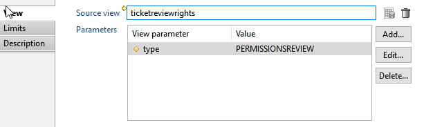

##### Limits tab

This tab lets yous optionally set limits to the results of the view. You can skip rows and/or limit the maximum number of results returned by the view

- **Skip** : type a number to skip the first records of the view. If left blank, not records are skipped.
- **Select maximum** : type a number to limit the maximum number of records that will be returned by the view. Leave blank to return all records.


##### Description tab

This tab lets you put a description on the purpose of this component.


#### Best practices

- View Source should be used on data that is **not related** to a given timeslot, such as Audit Logs, Tickets, Ticket actions and Ticket Reviews,
- View Source should be used with caution on regular Ledger entities (such as accounts, applications, identities) because the view executes against the previous timeslot, which means the results will be inaccurate if entities have changed. View Sources do not retrieve data from the current sandbox.

##### Theoretical rights example

One approach to defining the theoretical rights of people in the Ledger (_i.e._ what rights people are expected possess in a given application) is through rights reviews: Basically, you use the manual reviews settings (set by the reviewers) to create the theoretical rights matrix.

Rights reviews (associations between a person or a group of persons and an application) end up as ticket reviews objects in the Ledger, with a specific type.   

The collector will consist of the following components:   

- a **View Source** referring to a view that will retrieve all ticket reviews of a specific type (_e.g._ PERMISSIOSNREVIEW) with the associated people/application information.
- An **Update Filter** component that will set various attributes (_e.g._ right type) to ensure the adequate _Entitlement Model rules_ are executed
- A **Theoretical rights target**  component to store the rights matrix.

## Filters

### Collector Line Call


#### Usage

The collector line call componant is used to call another collect line.   
It it useful to reuse generic collect line and simplify the presentation of collect lines  

#### The properties Tab

##### Filter

In this property you can see/modify general parameters of the component. You will find:

- the "_Identifier"_ shown in Debug mode for example
- _the "Display name_" for the _collector line source_
- _Collector line: collect line to call_
- the "_Follow just one link_" option which sets the transition mode. If it is checked, only the first transition with an activation condition evaluated to true will be executed. If it is unchecked, all transitions with an activation evaluation evaluated to true will be executed.

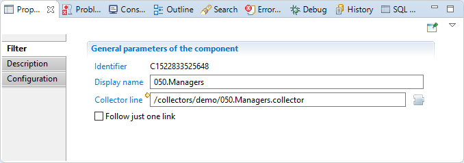

##### Description

Comment regarding actions done by this source component.


##### Configuration

In this section you can override variables values declared in the collector line that the component will call.


### Enumeration Filter

#### Usage

Filtrer enumerate component is used to iterate on multivalued attributes.   
It is helpful when you have aggregate data in data source file and you need to enumerate before collecting this data in brainwave database.  

#### The properties Tab

##### Filter

In this section you can see/modify general parameters of the component. You will find:

- the "_Identifier"_ shown in Debug mode for example
- _the "Display name_" for the _discovery source_
- _the "Follow just one link" option which sets the transition mode. If it is checked, only the first transition with an activation condition evaluated to true will be executed. If it is unchecked, all transitions with an activation evaluation evaluated to true will be executed._


##### Description

Comment regarding actions done by this component.


##### Enumeration

In this section you have to choose multivalued attributes that the component will iterate on, you can also specify if you like to iterate on duplicate values or not.


**<u>Example with iterating on several multivalued attributes:</u>**  

Let suppose that the enumeration component will receive the following dataset.   

| Login | Name | Domain | Localization |
|  UA12B \| UA15C \| UA19K |  Mark \| Aldo | Alta.local | France |

_"Login_" is a multivalued attribute having 3 elements.  
_"Name"_ is a multivalued attribute having 2 elements.  
_"Domain"_ is a monovalued attribute (1 element).  
_"Localization"_ is a monovalued attribute (1 element).  

In the _"Enumeration"_ section we will put _"Login"_ and _"Name"_ attributes in "_Attribute to enumerate values_" table.   

In this case enumeration component will iterate three times, three is the size of biggest multivalued attribute, in this example it is Login attribute.   
The enumeration will send to the next component three separated dataset as below.  

Dataset1  

| UA12B | Mark | Alta.local | France |

Dataset2  

| UA15C | Aldo |  Alta.local | France |

Dataset3  

| UA19K |  |  Alta.local | France |


### Group Filter
#### Usage

The data grouping component is useful for gathering several values that were initially separated into several different records in a multivalued attribute. For example, a sharepoint group extraction can provide a CSV file with one line per group member. If a sharepoint group has several members, the group appears on multiple lines with all the information repeated and a different member on each line. To reconstitute a single dataset with a multivalued attribute member from multiple CSV records, you must use the grouping component.   

The grouping component works by detecting ruptures. An expression based on the content of the dataset is set in the component in order to allow it, during the execution of the collector line, to determine when a rupture occurs. In the example with the job, the rupture is when first name and last name change. In this case, enter the expression as follows:  
{ dataset.GroupID.get() }  


For each dataset arriving in the grouping component, the expression is evaluated. If the result is different from the result of the expression in the previous dataset, this means that the new dataset relates to a different group, otherwise the dataset completes the previous dataset as it is for the same group(same Group ID). This detection is called rupture detection.     

The algorithm used to group the attribute values is as follows:   

-  For each dataset received by the component
> -  Calculate the rupture expression
> -  If no break is detected (same group in the above example)
>> -  Aggregation of values of this new dataset (member attribute in the example) in the previous dataset
>> -  Removal the new dataset to send nothing to the following components
> -  Otherwise (new group in the example)
>> -  Emission of the previous dataset towards the following components
>> -  Memorization of the new dataset as a starting point for the attributes aggregation

This mechanism introduces a desynchronization between the datasets received by the component and the datasets issued after grouping the job attribute to the following components. Indeed, while the second dataset arrives in the component group, the group outputs the first dataset to other components, and so on. With this mechanism, when the last dataset is received, the component emits the next-to-last dataset to the following components. It is only when the collector engine goes into the Flushing state that the grouping component can transmit the last dataset which was waiting for rupture detection.  

According to the example the group component will issue the following data sets to next components  

Dataset1  

| SamAccountName  | GroupID |  GroupName |
|  BRAINWAVE\cpion18 \| BRAINWAVE\jtourneu14 \| BRAINWAVE\mheritie10 |  c5142604-7e3c-4cbc-940d0eaad1b35856#1011 | Sales Managers |

Dataset2

|SamAccountName | GroupID |  GroupName |
| BRAINWAVE\jtourneu14 | c5142604-7e3c-4cbc-940d-0eaad1b35856#1012 |Pre-Sales |

#### The properties Tab

##### Filter

In this section you can see/modify general parameters of the component. You will find:

- the "_Identifier"_ shown in Debug mode for example
- _the "Display name_" for the _discovery source_
- _the "Follow just one link" option which sets the transition mode. If it is checked, only the first transition with an activation condition evaluated to true will be executed. If it is unchecked, all transitions with an activation evaluation evaluated to true will be executed._


##### Description

Comment regarding actions done by this component.


##### Criterion

In this section you can specify the expression that will be used to agreggate data

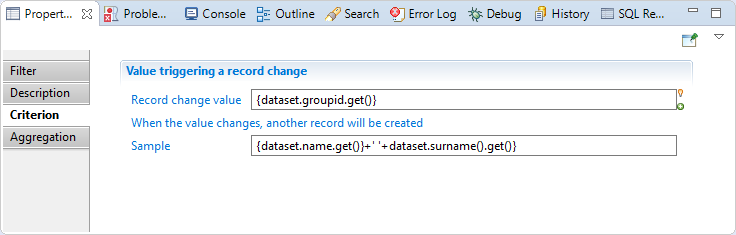

##### Aggregation

In this section you have to choose attributes where values will be grouped, attributes chosen must be multivalued.


#### Best practices

The data must be sorted by attributes used in the creterion, for example if your creterion is _{dataset.name().get()} + ' ' +dataset.surname().get()}_, you must order your source by name than by surname.  

### Join Filter

#### Usage

This property allows to join two sources, in order to obtain a dataset containing information from both sources.  

   

It has two distinct modes of operation (cache is enabled or not) which are detailed in the section Operating mode below.  

#### The properties Tab

##### Filter

In this tab you can see/modify general parameters of the component. You will find the following:

- _Identifier_ (shown in Debug mode for example)
- _Display name_ for the _Join filter_
- _Follow just one link_ option which sets the transition mode. If it is checked, only the first transition with an activation condition evaluated to true will be executed. If it is unchecked, all transitions with an activation condition evaluated to true will be executed.

   

##### Description

This property allows adding comment regarding actions done by this component.

   

##### Source

This property allows to select which one of the two attached sources is the secondary one, i.e. the source used to augment the dataset.  

   

##### Attributes

This property allows to map attributes of the secondary dataset to attributes of the main dataset.  

   

For example, in this case, the _name_ attribute of the secondary source (_discoverysource - company_) will be added to the main dataset under the name _company\_name_.  

##### Policy

This property allows to specify the behavior of the join when less than one or more than one records of the secondary dataset matches.  

   

##### Cache

This property allows to specify the behavior of the cache (see next section).

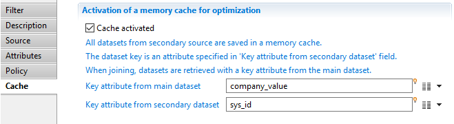   

#### Operating modes

##### With cache activated

When the cache is active, you need to specify both the _Key attribute from main dataset_ and the _Key attribute from secondary dataset_ whose values will then be matched by equality. The secondary source is iterated once and the key and corresponding dataset are kept in a cache. When the main source records are retrieved, the cache is examined to see if there exists a corresponding dataset (less than one or more than one matches are handled accordingly to the _Policy_ property described above). If such a dataset is found, the main and secondary datasets are merged according to the _Attributes_ property described above.  

##### With cache deactivated

When the cache is not active, for each record of the main source, the secondary source is fully iterated, each records being merged to the main dataset according to the _Policy_ and _Attributes_ property. In the secondary source, you should provide a _SQL syntax request_ in the _Request_ property. In this request, the attributes of the main dataset are available under the _param_ namespace.  
For example, the request    
`SELECT * FROM dataset WHERE dataset.id LIKE UPPER(param.id) + '%'`

in the secondary source will match when the _id_ attribute of the main source (_param.id_) is "_acme"_ and the _id_ attribute of the secondary source (_dataset.id_) is _"ACME123_".  

#### Best practices

The cache should <u>always</u> be enabled as the performance impact of its deactivation is severe (the secondary source is iterated for each dataset of the main source). If you have complex matching rules, for example matching on more than one attributes, it will always be more efficient to activate the cache and use computed attributes (either at the discovery level or using an update filter) as the matching attributes.  

### Route Filter


#### Usage
The route component does nothing, but it allows to add an ending point to follow the dataset content returned by the source collector line.

#### The properties Tab

##### Filter

In this section you can see/modify general parameters of the component. You will find:

- the "_Identifier"_ shown in Debug mode for example
- _the "Display name_" for the _collector line source_
- the "_Follow just one link_" option which sets the transition mode. If it is checked, only the first transition with an activation condition evaluated to true will be executed. If it is unchecked, all transitions with an activation evaluation evaluated to true will be executed.


##### Description

Comment regarding this route component.


##### Events  

In this section you can configure the route component to trigger an event each time a dataset is transmitted and forward that event to the next component if desired  


### Script Filter


#### Usage

This source can be used to programmatically update datasets using JavaScript functions.

#### The properties Tab

##### Filter

In this tab you can see/modify general parameters of the component. You will find the following:

- _Identifier_ (shown in Debug mode for example)
- _Display name_ for the _Support target_
- _onScriptInit_ is the initialization JavaScript function. It is called only once per collect line
- _onScriptWrite_ is the function which will be called for each record of the main source. It can manipulate the dataset, adding or removing attributes, changing values
- _onScriptFlush_ is a function which is called when no more record is available from the main source. It must return true if it populated the dataset, false otherwise  
- _onScriptTerminate_ is the function called when the collect line ends successfully  
- _onScriptDispose_ is the function called at the end of the collect line. It is always called, whether the line ends successfully or not, and should be used to free all the resources allocated during the initialization phase (close files, database connections and so on)  
- _Follow just one link_ option which sets the transition mode. If it is checked, only the first transition with an activation condition evaluated to true will be executed. If it is unchecked, all transitions with an activation condition evaluated to true will be executed.

   
Note that all the _onScript..._ functions are optional.

##### Description

This property allows adding comment regarding actions done by this component.  

   

##### Attributes

This property can be used to declare additional attributes to include in the collect line schema, for example when attributes are injected to the dataset by the JavaScript write function.  

   

### Update Filter

#### Usage

The **Update filter** component is an all-purpose collect component that allows to modify the collect current dataset in various ways.   
13 common tasks can be done directly by configuration only.   
More complex modifications can be achieved programatically using javascript.

The common tasks are the following:

- add new attribute, rename, duplicate or delete an attribute
- modify single-valued attribute: modify the value, replace all occurrences of one value with another, set default value if attribute is empty, convert a String attribute to a Date attribute
- manipulate multi-valued attributes: cleaning, adding values, filtering values, replacing values  
- change the silo name attribute

The update will be performed on each and every row of this collect.

#### The properties tab folder

##### Filter tab

The **Filter** property tab allows to view/modify basic parameters of the component:   

- **Identifier** displays the internal identifier of the component, useful in debug mode or for reading collect log files.
- **Display name**  for the **Update filter** , to be displayed in the collector editor.
- **Follow just one link**  option defines how multiple transition collects are being processed.   
If checked, only the first transition with an activation condition evaluated to true will be executed.   
If unchecked, all transitions with an activation condition evaluated to true will be executed.

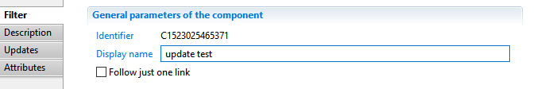

##### Description tab

The **Description** property tab allows adding notes on the component, such as description of what the component is doing.


##### Updates tab

The Updates tab allows to display and modify the list of update operations in this component.  

   

You can carry out the following tasks:

- **Add** allows to add a new operation through configuration wizard.  
You can select from 13 differents actions.  
The various actions are detailed in the following sections.  

   

- **Edit** allows modifying the currently selected operation
- **Up / Down** allows to reorganize actions processing order. First actions are executed first.
- **Delete** deletes the currently selected action from the list.  
- The right panel displays details on the selected action
- **Modification function** allows creating or selecting a javascript function to perform the modifications. See section below for details.

The sections below details the 13 operations plus javascript based update operation.

###### 1 Add an attribute

This action allows to define a new named attribute in the dataset, with an initial computed value.   
The attribute can be used in further actions and in other components of the collect.   
The attribute will be added to the end of the list. It can be moved towards the beginning using **Up** button.

- **Attribute** defines the unique name of the attribute withing the current dataset.
- **Value Type** sets the type of the attribute. The following types are valid: String, Number, Boolean and Date.
- **This attribute can be multivalued** determines whether the attribute is single valued or multi-valued.   
Multi-valued attributes are like varying size lists.
- **Value** sets an initial computed _Macro_ expression value for the new attribute. a Macro is a mix of static (string) and javascript expressions enclosed in braces.  
Read more on Macros : [03 Macros et scripts](/docs/igrc-platform/collector/macros-and-scripts/).
- **Description** is an optional description of the purpose of this attribute
- **Trigger an error if the attribute to add already exists**  option will trigger an error in the log event file if an attribute with the same name already exists in the dataset.  
If checked, **Event** lets you define the specific event name to trigger

   

###### 2 Modify an attribute

This action allow you to set a new value for an existing attribute.

- **Attribute** selects the attribute to be modifed from the dataset. Use the right arrow menu to select an attribute
- **Value** defines the new value using a -Macro- expression. Read more on Macros : [Macros et scripts]({{site.baseurl}})   
- **Trigger an error if the attribute to modify does not exist**  option will trigger an error in the log event file if the attribute to select was dynamically removed without notice ( this should not normally occur)   
If checked, **Event** lets you define the specific event name to trigger

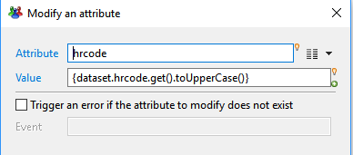   

###### 3 Replace an attribute value

This action allow you to replace an occurrence of a value for a given single-valued attribute by another value.   
If the attribute contains another value, its value is not modified.

- **Attribute** selects the attribute from the dataset for which values should be replaced. Use the right arrow menu to select an attribute
- **Old Value** sets the value to search and replace. This is a static value that will be interpreted based on the attribute type.
- **Value** defines the new value using a -Macro- expression. Read more on Macros : [Macros et scripts]({{site.baseurl}})   
- **Trigger an error if the attribute to modify does not exist**  option will trigger an error in the log event file if the attribute to select was dynamically removed without notice ( this should not normally occur)   
If checked, **Event** lets you define the specific event name to trigger

   

###### 4 Set a default value if an attribute is empty

This action allow you to set a default value for a given attribute if its current value is null or empty string.

If the attribute value is not null, it's not modified.

- **Attribute** selects the attribute to be modifed from the dataset. Use the right arrow menu to select an attribute
- **Value** defines the default value using a -Macro- expression. Read more on Macros : [Macros et scripts]({{site.baseurl}}).
- **Trigger an error if the attribute to modify does not exist**  option will trigger an error in the log event file if the attribute to select was dynamically removed without notice ( this should not normally occur)   
If checked, **Event** lets you define the specific event name to trigger

   

###### 5 Change the name of the silo

This actions allows to change  on-the-fly the dynamic name of the silo, that is the value of _config.siloName_variable._   
This could be useful for example if several input files are gathered into one single source file and must be processed in the same collect line.    

- **Value** defines the value for the dynamic silo name as a -Macro- expression. Read more on Macros : [Macros et scripts]({{site.baseurl}}).

   

###### 6 Convert a string to a date

This action is a shortcut to create a new _Date_ attribute based on the string value of another, and using a date-time conversion format.

- **Attribute to convert** lets you select the source attribute which value will be converted. The attribute can be of any type.
- **New name** lets you set the name for the newly created date attribute.
- **Format** lets you set the conversion format to use. You can either select a predefined format from the right list, or type a custom format using y M d H.
- **Description** lets you set an optional description for the new attribute stating its purpose.

   

###### 7 Deletion of an attribute

This action allows you to dynamically remove an existing attribute from the current dataset.  
Once deleted, the attribute won't be available in further actions or collect components.

- **Attribute to delete** lets you select the attribute to delete from the dataset.  

   

###### 8 Rename an attribute

This action allows you to give a new name to an existing attribute from the current dataset. Values are kepts unchanged but will be accessed through the new name.

- **Attribute to rename** lets you select the attribute to modify from the current dataset.
- **New name** is the new name for the attribute. This new name must not exist already in the dataset.

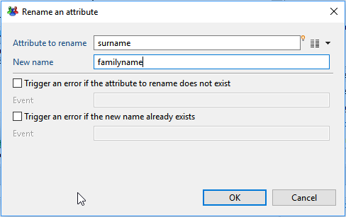   

###### 9 Duplicate an attribute

This action allows you to duplicate an attribute with a different name and the same initial values.

- **Attribute to duplicate** lets you select the attribute to duplicate from the current dataset.
- **New name**  is the name for the duplicate attribute. This new name must not exist already in the dataset.

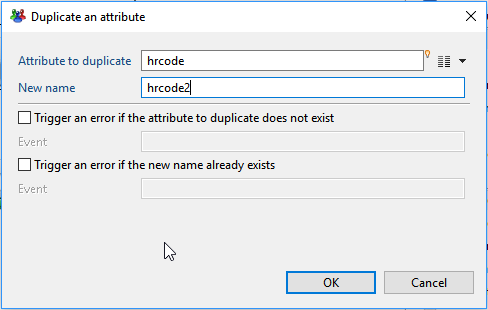   

###### 10 Clean a multivalued attribute

This action allows you to clean up multivalued attributes by removing empty or null values and/or duplicate values.  
It can also synchronize other multivalued lists with the removed rows.

- **Attribute** lets you select the attribute to clean up. only multivalued attributes can be selected.
- **Remove empty of null values**  option determines if null or empty values should be removed from the list of values of the attribute
- **Remove duplicate values** option determines if duplicate values should be removed from the list, keeping only the first occurrence of each
- **Attribute1,Attribute2,Attribute 3**  lets you select up to 3 other multivalued attributes, of the same size, that should be kept in sync with the cleaned attribute.  
That is, for each row index that was removed from the list ( because it was null/duplicate), the same row index will be removed from the synchronized list.   

   

###### 11 Add a value in a multivalued attribute

This actions allows to add one or move values to a multivalued attributes, either from another single or multivalued attribute, or from a computed value.

- **Attribute** : lets you select the multivalued attribute to modify. Only multivalued attributes can be selected.
- **Add an attribute**  : lets you optionally select another attribute ( single or multivalued) from which values should be copied. If empty, the attribute is ignored
- **Value** : optionally define an macro expression which value will be added to the list. the value computed by the macro expression must be of the same type as the list to modify.  
If empty, this field is ignored.  
- **Do not add values if they already exist**  option determines whether values that already exist in the list can be added. If checked, duplicates values are not added.

   

###### 12 Filter some values of a multivalued attribute

This action allows you to filter values from a list attribute, matching a given condition.  
It can also synchronize other multivalued lists with the removed rows.

- **Attribute** lets you select the multivalued attribute to filter. only multivalued attributes can be selected.
- **Keep matching values** option determines that the values in the list matching the condition will be kept and the values not matching will be removed from the list
- **Remove matching values** option on the opposite, that the values in the list _not_ matching the condition will be kept and the values matching will be removed from the list   

There are 3 possible matching conditions:   

> **1.**  **Another attribute** : compares the elements in the list with the value(s) of another attribute
>> - If the attribute to match is single-valued, items that are equal to the matching attribute single value will be selected
>> - if the attribute to match is multi-valued, items that are equal to_any_ value in the maching attribute values will be selected.

- **Attribute** : select another attribute to match. This could be either a single-valued or multi-valued attribute   

> **2.**  **Computed expression** : compares the elements in the list with the value of a macro expression.
> > - Items in the list that are equal to the value of the computed expression will be selected

- **Value** : type a macro expression , which value will be compared to each item in the list. Read more on Macros : [Macros et scripts]({{site.baseurl}}).

> **3.**  **Pattern** : matches the elements in the list against a regular expression pattern.
> > - Items in the list that that match the pattern will be selected. Syntax of the regular expression pattern follows javascript RegExp syntax.   

- **Regular Expression** : type a valid regular expression pattern
- **Test Value** : helper field, to test your regular expression. If the test value does not match the regular expression, a message "Test value does not match the regular expression" is displayed

- **Attribute1,Attribute2,Attribute3**  lets you select up to 3 other multivalued attributes, of the same size, that will be kept in sync with the filtered attribute.  
That is, for each row index that was removed from the list ( according to filtering conditions), the same row index will be removed from the synchronized lists.

   

###### 13 Replace values of a multivalued attribute

This action allows you to replace all values from a list attribute with another static or computed value.

- **Attribute** lets you select the multivalued attribute to be processed. only multivalued attributes can be selected.
- **Value** defines the replacement value for each item using a -Macro- expression. Read more on Macros : [Macros et scripts]({{site.baseurl}}).

| **Note:** <br><br> The replacement value can use the original value of each item in the list.  
In this case, the original value will be available as a single-valued attribute with the same name.<br> For example, to capitalize all values in a multivalued attribute called _list1_, you would use the following expression:  {dataset.list1.get().toUppercase()}|

   

###### Javascript modification

This fields allows you to use a javascript function to perform the modifications.

   

**Modification function** : Name of the function that performs the modifications, without parentheses.   
This function must have an empty signature.

Here is an example of function:
```
function doUpdate() {
 // add new attribute
    dataset.add("computedAttr" );

    var value = null;
    switch(dataset.type.get()) {
     case "A": value = "John"; break;
     case "B": value = "Michael"; break;
     case "C": value = "Eric" ; break;
        case "D" : value = "La reponse D"; break;
    }
    dataset.get("computedAttr").set(value);
}
```

If both configuration actions and a javascript modification function are defined, the javascript function will be executed _after_ the configuration actions.

##### Attributes Tab

The **Attributes** tab allows to declare dataset attributes that may have been created inside the javascript modify function.   
When using a javascript function to perform the modifications, you may have to create new attributes using **dataset.add()** API.   
In this case, you need to decleare them , so that they are known by the collector and can be used in further components.

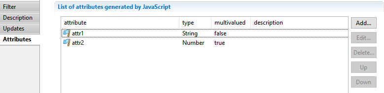   

#### Best practices

- Always try to perform your modifications using an existing predefined update, before using javascript. This will ensure the modifications are done in the most efficient way.
- Data qualify modifications that apply directly to source attributes should be preferably be done in the discovery.

### Validation Filter
#### Usage

This filter component allows to add validation rules to some dataset. When one of these rules fails for a dataset, it will be possible to emit an event (but will still pass the filter).

#### The properties Tab

##### Filter

In this tab you can see/modify general parameters of the component. You will find the following:

- _Identifier_ (shown in Debug mode for example)
- _Display name_ for the _Validation filter_
- _Follow just one link_ option which sets the transition mode. If it is checked, only the first transition with an activation condition evaluated to true will be executed. If it is unchecked, all transitions with an activation condition evaluated to true will be executed.


##### Description

This property allows adding comment regarding actions done by this component.  


##### Mandatory

This property allows to specify that some given attributes of the dataset must be present and not empty.  

   

An attribute can be added with the following dialog:  

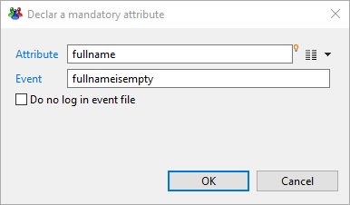   
Here you specify which attribute must not be empty, the name of the event (will default to "_error_" if not specified) and if the event should appear in the event file or not.  

##### Syntax

This property allows to specify that some attributes must match some regular expressions.  

   

A condition can be added with the following dialog:  

      
Here you specify the attribute, the regular expression it must match, the name of the event (will default to "_error_" if not specified) and if the event should appear in the event file or not.   
The field _Sample value_ can be used to test the regular expression.  

##### Uniqueness

In this property, you can specify up to 3 attributes whose values must be unique among the source.  

      
You can also indicate the name of the event (will default to "_error_" if not specified) and if the event should appear in the event file or not.  

##### Condition

Here you can specify a condition on the dataset as a JavaScript function returning a boolean.  

      

Validation Function is the name of a JavaScript function written in the .javascript file associated with this collector line.   
You can also indicate the name of the event (will default to "_error_" if not specified) and if the event should appear in the event file or not.  

##### Multiplicity

Using this property, you can specify a maximum or minimum number of records propagated by this filter.  

      

## Targets


## SoD Matrix Collect

### Context

This section describes how SoD Matrix are collected in Brainwave iGRC. Usually, SoD matrix are maintained in organization in different Excel sheets in specific format where each SoD rules is relative to an incompatibility of a rights/permission vs another one.

The traditional format for such matrix in external Excel sheets usually use pivot table:

   
> > > > > > Figure 1: SoD Pivot table example

Brainwave iGRC data model concept integrates the two following SoD concepts:   

- SoD Matrix (with a identifier, a name, a description)  
- SoD permission pair (attached to an existing SoD Matrix, and referencing a pair of two incompatible permissions).

The SoD Matrix and permission pair generates standard control discrepancies.

### Prerequisites

Brainwave iGRC 2016 R2 or higher

### Process

In order to define SoD Matrix, an additional target is available in collector palette:

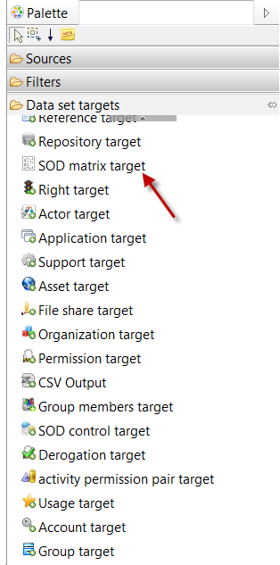   

The SOD matrix target creates a new matrix in Brainwave data model:

   


   

In order to define SoD rules, an additional target is available in collector palette:

   

This target add new SoD rules in an existing SoD matrix:

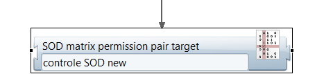   

A rule has to be inserted in an existing SoD Matrix. This rule references first permission incompatible with a second one:

   

Additional information can be added for each risk:

   

Some SoD componants can be used in views to list information regarding collected SoD Matrix and SoD rules (permission pairs):

   

### Example

The attached SODsample.facet includes an example of SoD rules collect, and SoD matrix report.

- importfiles/SOD/SOD\_example.xlsx (excel sheet including some sample SoD rules)
- discovery/SOD/SOD.discovery (excel sheet discovery)
- collectors/SOD/SOD.collector (SoD Matrix and rules collect)
- collectors/SOD/SOD.javascript
- views/custom/SOD/SOD\_matrix.view (view to retrieve SoD matrix information)
- reports/custom/SOD/SOD\_matrix.rptdesign (sample SoD matrix report)


# Macros and Scripts

## JavaScript Syntax

The APIs described in this chapter can be used in both macros in JavaScript.

A macro is a JavaScript expression inserted into a component property field. For example, the CSV source component asks for the name of a CSV file to be processed. An absolute path may be entered in this field. However, it is possible to insert a JavaScript expression to make the constitution of the file path dynamic. The expression must be enclosed in brackets to be identified as such by the collector engine when running. Everything between these brackets is executed and the result replaces the JavaScript expression as shown in the following example:   

`{config.my_directory}\rh.csv`

In the example above, the my\_directory configuration variable contains `C:\Users\Paul`. At runtime, the collector engine replaces the expression in brackets with the result, which gives the following path:   

`C:\Users\Paul\rh.csv`

A JavaScript script is a file with the extension `.javascript`. This file is associated with the collector line and may contain all the functions called by components, for example, from a source script, a filter script, or a transition, to make its transfer conditional.   

The major difference in syntax between a macro and a JavaScript script is that the macro can only contain an expression, not an entire script. This means that all the keywords such as `for,while, if` ... are forbidden in macros.

JavaScript syntax is not described in this document because it is standard, since the product uses the Mozilla Foundation's Rhino scripting engine. Note that ternary expressions may be used in macros and in JavaScript. The syntax is:    

`condition ? expression_if_true: expression_if_false`

The following example shows how to test if my\_directory variable is not empty. If the variable is empty, it is replaced by a default path in Windows. Ternary expressions are very useful in macros as they allow you to test without the if keyword, which is forbidden:   
```
{config.my_directory.length != 0 ? config.my_directory:
"C:\\Windows\\Temp"}\rh.csv
```

Ternary expressions may be nested. It is therefore important to use parentheses to clearly delimit each part and avoid any ambiguity during runtime.

## Configuration Variable


The `config` variable is available when running the collector line, and contains all the configuration values of the line and of the project configuration. All the configuration settings are present in the `config` object and accessible as properties. Values are always `String` types.   

These settings affect the behavior of the collector line. They allow us to avoid the presence of hard-coded values such as file names in the collector line settings. For example, for a CSV source, the `CSVfile` field may be filled with a macro instead of hard-coding `C:\data.csv`, as shown in the following example:   

`{config.csvfile}`   

The `csvfile` setting is declared in the collector line with `C:\data.csv` as its value.   

A configuration setting may be declared at the project level or at the collector line level. If a setting with the same name is declared on both levels, the collector level setting is used. This allows you to set a default value at the project level and override it in a collector line.   

The `config` variable is also present in scripting:  

`print(config.csvfile);`

There are two properties automatically filled in in the `config` variable:

- `projectPath`: is the absolute path of the project.
- `databaseName`: is the name of the database configuration.

## Dataset Variable

A dataset is a collector of attributes, where each attribute may contain multiple values. The dataset is the element which is passed between the components of a collector line. It may be altered or completed by each component.   

When a collector line runs, the `dataset` variable is implicitly declared and contains the current dataset. It is thus possible to reach the content of the dataset within a component (for example, in the modifying component in the form of a macro) or in JavaScript.   

A collector line has a data pattern. The pattern lists all the attribute names declared in each component and their characteristics (type of attribute and multivalued indicator). The pattern helps to offer completion of the attributes in the collector line editor. It is also used when the collector line runs to performing implicit operations of data conversion. For example, when an attribute is declared by a source component as `date` type, it can be upgraded or modified by another component by passing a string. The collector engine converts the value according to the declaration in the pattern.   

The pattern is shown in the collector line editor in the Properties view when no component is selected.   

You cannot bypass the pattern while the line collector is running. An attribute can only receive values of the type declared in the pattern (after implicit conversion if needed). On the other hand, it is quite possible at runtime to dynamically add new attributes whose characteristics you specify (type of attribute and multivalued indicator) in the constructor of the `Attribute` class.

**Warning** : Having declared an attribute in the pattern (for example, in a source type component) does not add the attribute in the dataset at runtime. The attribute is only present if it is added by component or a script. The standard behavior of the source type components (for example, CSV) is to create the attribute in the dataset only if a value is present in the file. In the case of a CSV file, if the `uniqueID` column is empty for some records, the dataset will not contain the `uniqueID` attribute for records that have no value in this column. When trying to read an attribute not present in the dataset, `null` is returned. Therefore, we have to test this value before manipulating the data, as shown in the following code:
```
var attr = dataset.get("unique_ID");
if (attr != null) {
  print(attr);
}
```

This test should also be done in macros, for example, in the modifying component. The following code is a macro component set in the modifying component in order to capitalize the `unique_ID`. Since the unique ID may be absent, you must use a ternary expression to process the case of a `null` attribute:   

`{dataset.unique_ID != null ? dataset.unique_ID.get().toUpperCase(): ''}`   

This macro tests whether the attribute exists in the dataset. If it does, it returns the contents of the unique ID, capitalized. Otherwise, it returns an empty string.   

Let's take the example of an attribute called `myAttribute`, declared in a modifying component and valuated by a script. The following code allows us to add the attribute to the dataset with a value:
```
var attr = new Attribute("myAttribute");
attr.set("Paul");
dataset.add(attr);
```

In the example above, the first line creates an attribute without specifying the type of data or the multivalued indicator, because with the name of the attribute, the collector engine finds this information in the pattern.   

In the case of an attribute missing from the pattern, you must specify all the information as shown in the following example. The pattern is then completed dynamically with a new attribute.   
```
var attr = new Attribute("myAttribute", "String", false);
attr.set("Paul");
dataset.add(attr);
```

In the example above, the first line creates an attribute that does not exist in the pattern. The attribute is declared as being a `String` type and single-valued (multivalued parameter set to `false`).   

A dataset also contains a list of events. These events contribute to the identification of rejects or records with an anomaly. These events can be used in transitions between components to create conditional forking. Writing a JavaScript function is necessary to test for the presence of an event and to allow the transition to the next component or not. The following code shows a function that prevents it from moving to the next component if the `empty_unique_ID` event is detected:   
```
function testUniqueID() {
  return ! dataset.hasEvent("empty unique ID");
}
```

The `testUniqueID` function is configured in the transaction. When the dataset contains an `empty_unique_ID` event, the JavaScript function returns `false` which prohibits from moving on to the next component.   

It is important to note that the events present in the dataset have a very limited lifespan because they are deleted upon entering each component to avoid their accumulation while running through the dataset of the whole collector line.

## Dataset Class API

The DataSet class contains the APIs to manipulate both the dataset (the attributes) and the events. It provides access to the attributes in the form of methods and properties.

### Properties Corresponding to the Pattern

All the attributes of the dataset are available in the form of properties. This allows syntax like `dataset.attribute` as shown in the following example for the _first\_name_ attribute:   

`var attr =dataset.first_name;`

Note that the returned value is an `Attribute`type object, not the value of the attribute. So to retrieve the first name, you must use the `get`method like this:
```
var attr = dataset.first_name;

if (attr != null) {
  print(attr.get());

```

| **Important** <br><br> If the attribute does not exist in the dataset, the value returned is `null`. It is therefore necessary to test whether the returned value is a valid attribute (not null) before using the `get` method.|   

Properties are read- and write-accessible. In write mode, the attribute is replaced by the new attribute. If the attribute does not exist in the dataset, it is added. The following example shows how to add a new single-valued `String` type attribute to the data set:   
```
var attr = new Attribute("myAttribute", "String", false);

attr.set("Paul");
dataset.myAttribute = attr;
```

The first line creates a new attribute called _myAttribute_ but which is not yet added to the dataset. The second line sets the value of the attribute. The third line adds the attribute to the dataset. Note that the attribute name is repeated in the third line. This syntax allows you to replace or add an attribute regardless of whether the dataset contained an attribute with the same name or not.   

Syntax using the `dataset` APIs allows you to obtain the same result, as shown in the following code:   
```
var attr = new Attribute("myAttribute", "String", false);

attr.set("Paul");
dataset.remove("myAttribute");
dataset.add(attr);
```

The `add` method of the `dataset` object adds an attribute to the dataset only if it does not already exist. You must therefore remove the attribute with the `remove` method before adding it to process a replacement.    

It is also possible to add or replace an attribute by just providing a value, like this:   

`dataset.myAttribute = "Paul";`

Note that this is only a shortcut. In reality, the value is not added directly to the dataset. An attribute is created with the name `myAttribute`, then the value is stored in the attribute, then the attribute is added to the dataset.

### Length Property

The length property returns the number of attributes present in the dataset. An attribute can be empty or contain one or more values.     
This property may be used to list the attributes of the dataset using a for loop as in the following example:  
    
```javascript
for (var i = 0; i < dataset.length; i++) {
  var attr = dataset.get(i);
  print(attr);
}
```

An easier way to list the attributes of the dataset is to use another variant of the for loop like this:    

```javascript
for (var attr in dataset) {
  print(attr);
}
```

### Add Method

Adds an attribute in the dataset. The dataset does not accept duplicate attribute names. If an attribute with the same name already exists, the operation fails. To replace an attribute with the same name, you must first delete the data set with the `remove` method. The `add` method accepts either an `Attribute` type object or an attribute name. In the case of a call with an attribute name, the attribute will be created with the type declared in the pattern. If the pattern does not know the name, the created attribute is a `String` type, and single-valued. To change these characteristics, it is possible to pass two additional parameters.   

**Signature** :   

- add(name\_or\_attribute, [type], [multivalued]): Attribute

**Return value** :   

- The attribute added or null if the add failed

**Parameters** :   

- `name_or_attribute`: `Attribute` or `String.
                `Name of the attribute or `Attribute` type object. If this parameter is a string, two additional parameters can specify the type and whether the attribute is multivalued.
- `type`: `String` (optional) Attribute type (`String, Boolean,
                Number` or `Date`). Ignored if the parameter name\_or\_attribute is an `Attribute` type.
- `multivalued: Boolean` (optional). Indicates whether the attribute to be created should be multivalued. Ignored if the parameter name\_or\_attribute is an `Attribute` type.   

**Example call** :

```
var attr = new Attribute("myAttribute", "String", false);

attr.set("Paul");
dataset.add(attr);
```

### Duplicate Method

Duplicates an attribute present in the dataset under a new name.
The new name must be unique. The set of values is duplicated so that the two do not share any attribute value. Note that both attributes are now considered different by the equals method because of their name.  

**Signature:**   

- duplicate(oldName, newName): Attribute

**Return value:**   

- The duplicated attribute or null if the duplication failed

**Parameters:**   

- oldName: String. Name of attribute to be duplicated.
- newName: String. New name of duplicated attribute.

**Example call:**   

```
var newAttr = dataset.duplicate("old", "new");

if (newAttr == null) {
  print("Error: the dataset does not contain the attribute 'old' or
  it already contains an attribute 'new'");
}
```

### Equals Method

Checks equality with another object. A dataset is considered equal to another if the two datasets have the same attributes (characteristics and list of values)  

**Signature:**   

- equals(object): Boolean   

**Return value:**   

- true if the object passed as a parameter is a dataset with the same attributes

**Parameters:**     

- object: Object The object to compare with the dataset.

**Example call:**

```
var same = dataset.equals(otherDataset);

if (! same) {
  print("The two datasets are different");
}
```


### Get Method

Retrieves an attribute by its name.  

**Signature:**   

- get(name): Attribute   

**Return value:**   

- The attribute or null if no attribute corresponds to the name sent as a parameter

**Parameters:**    

- name: String Name of the attribute sought.

**Example call:**   

```
var attr = dataset.get("myAttribute");

if (attr == null) {
  print("The attribute 'myAttribute' does not exist in the dataset");
}
```

### Remove Method

Deletes an attribute from the dataset by its name.  

**Signature:**   

- remove(name): Attribute

**Return value:**   

- The deleted attribute, or null if the deletion failed

**Parameters:**    

- name: String Name of the attribute to delete.

**Example call:**    

```
var attr = dataset.remove("myAttribute");

if (attr == null) {
  print("The attribute 'myAttribute' does not exist in the dataset");
}
```

### Rename Method

Renames an attribute. The new name must be unique.  

**Signature:**   

- `rename(oldName, newName): Attribute`

**Return value:**   

- The renamed attribute or null if the renaming failed

**Parameters:**    

- oldName: String Name of the attribute to rename.
- newName: String New attribute name.

**Example call:**    

```
var attr = dataset.rename("old", "new");

if (attr == null) {
  print("Error: the dataset does not contain the attribute 'old' or
  it already contains an attribute 'new'");
}
```


### IsEmpty Method

Verifies if the attribute contains a non-empty value   

**Signature:**   

- `isEmpty(name_or_attribute): Boolean`

**Return value:**   

- `true` if the attribute contains at least non-empty value

**Parameters:**    

- name\_or\_attribute: String or Attribute. Name of the attribute or Attribute type object.

**Example call:**   

```
var vide = dataset.isEmpty("myAttribute");

if (vide) {
  print("The attribute 'myAttribute' of the dataset is empty");
}
```
### ClearEvents Method

Erases all the events detected  

**Signature:**

- clearEvents(): Void

**Return value:**   

- none

**Parameters:**

- none

**Example call:**  

`dataset.clearEvents();`

### AddEvent Method

Adds an event to the list    

**Signature:**   

- addEvent(name): Void

**Return value:**   

- none

**Parameters:**    

- name: String Name of the event to add.

**Example call:**  

`dataset.addEvent("no unique ID");`

### RemoveEvent Method

Deletes an event from the list.     

**Signature:**   

- removeEvent(name): Void   

**Return value:**   

- none   

**Parameters:**  

- name: String Name of the event to delete   

**Example call:**  

`dataset.removeEvent("no unique ID");`

### HasEvent Method

Verifies the presence of an event in the list   

**Signature:**   

- hasEvent(name): Boolean    

**Return value:**   

- true if the event is present in the list   

**Parameters:**    

- name: String Name of the event to verify.   

**Example call:**   

```
var EmptyUniqueID = dataset.hasEvent("no unique ID");

if (EmptyUniqueID) {
  print("Error: Identity has no unique ID");
}
```

### EventCount Method

Retrieves the number of events present in the list.    

**Signature:**   

- eventCount(): Number   

**Return value:**   

- The number of events in the list   

**Parameters:**   

- none   

**Example call:**     

 ```
 var nb = dataset.eventCount();

 if (nb == 0) {
   print("No event detected");
 }
 ```

### ToString Method

Constructs a string giving the content of the dataset.   

**Signature** :  

- toString(): String   

**Return value** :   

- String containing the list of attribute names separated by commas   

**Parameters** :   

- none   

Example call:   

`print``("Content of dataset: " +` `dataset``.toString());`


### GetEvents Method


Retrieves the list of events.    

**Signature:**   

- getEvents(): Array   

**Return value:**   

- A table containing the events   

**Parameters:**   

- none   

**Example call:**   

```
var events = dataset.getEvents();
if (events != null) {
    for (var event in events) {
    print("Event " + event + " detected");
    }
}
```
# SQL Filtering

## Context

The data sources in a collector line offer filtering of datasets with an SQL query. SQL filtering provides a simple way to select datasets on criteria using standard syntax. This syntax can also handle multivalued attributes, called 'lists of values,' later in this chapter.

The operating principle of the SQL query is to consider the dataset that has just been created (for example, from a file) as a table containing a single row of data. The query is executed on each dataset. The query returns either the same dataset or no dataset which means that the values present do not meet the criteria expressed in the query.   

```
SELECT * FROM dataset WHERE dataset.unique_ID <> 'VIP'
```

In the example above, the query is executed on each dataset created by the source. If the registration number contains the value 'VIP', the dataset is rejected because the criteria in the WHERE clause specifies that the registration number must not contain 'VIP'.

Note that it is possible to address configuration variables of the project or of the collector line by prefixing their name with config as shown in the following example for the reject variable:   

```
SELECT * FROM dataset WHERE dataset.unique_ID <> config.reject
```

## Query Syntax

Only SELECT queries are authorized for SQL filtering. When the query is executed, the current dataset is considered as an SQL table whose columns are the dataset attributes. This table contains only one line consisting of attribute values. The main difference with a real SQL table is that each column may contain a list of values (corresponding to a multivalued attribute of the dataset).

### Main Source

In the FROM clause of the SQL query, the only allowed table name is 'dataset'. The `*` character in the projection part returns all of the attributes of the dataset. However, it is possible to return only a part of the attributes of the dataset as shown in the following example:   

```
SELECT unique_ID, first_name, last_name FROM dataset
```

The source, when reading the file, creates a dataset with a certain number of attributes and then the SQL query is executed and only the unique ID, first and last name attributes are retained in the dataset transmitted to the next component.   

It is also possible to create a brand new attribute in the projection area as shown in the following example with the new attribute full\_name:   

```
SELECT unique_ID, first_name, last_name, concat(first_name, ' ', last_name) AS full_name FROM dataset
```

This method for adding a calculated attribute to the dataset, however, is not recommended because it bypasses the attribute declaration in the pattern. The direct consequence is that the collector editor will not suggest this name in the attribute selectors.

### Secondary Source

In a source activated through a join component, two sets of data are handled:   

- dataset: dataset created by the secondary source
- param: dataset passed as a parameter by the join component

In a secondary source, the tables listed in the FROM clause may be dataset, param, or both. As before, it is also possible to restrict the attributes returned but they may come from dataset or from param as shown in the following query:   

```
SELECT unique_ID, first_name, last_name, param.date_arrival, param.date_departure FROM dataset
```

The attribute names without a table name (`unique_ID`, `first_name`, `last_name`) come from the table mentioned in the FROM clause (dataset) whereas the two attributes `date_arrival` and `date_departure` come explicitly from the param dataset. It is possible to retrieve the entire dataset and some attributes of param as shown in the following query:   

```
SELECT *, param.date_arrival, param.date_departure FROM dataset
```

Finally, if you wish to retrieve all of the attributes (dataset and param), both of the following syntaxes work:   

```
SELECT * FROM dataset, param
SELECT *, param.* FROM dataset
```
## Operators

### Arithmetic Operators

The list of supported arithmetic operators is:  

- \+ for addition
- \- for subtraction
- \* for multiplication
- / for division

These operators only work on numerical operands. Lists of values are not supported. To ensure the order of operations, it is possible to use parentheses in the expression. Here are some examples using these operators:
```
SELECT * FROM dataset WHERE len(dataset.unique_ID) - 1 < 3
SELECT * FROM dataset WHERE 2 + (dataset.counter / 10) > 5
```
### Comparison Operators

The comparison operators are:  

- =: true if both operands are equal
- \<\> or !=: true if both operands are different
- \<: true if the first operand is strictly less than the second operand
- \<=: true if the first operand is less than or equal to the second operand
- \>: true if the first operand is strictly greater than the second operand
- \>=: true if the first operand is greater than or equal to the second operand   

The first two operators (= and \<\>) operate on values or lists of values. These strict comparisons return true only if the values of two operands are identical (for the = operator) or all different (for the \<\> operator).  

The other operators do not work on lists of values. Both operands must be simple values. If the comparison involves two values of different types, the second operand is automatically converted to the type of the first operand during the comparison. Here are some examples using these operators:    
```
SELECT * FROM dataset WHERE dataset.unique_ID = 'INT0001'
SELECT * FROM dataset WHERE dataset.date_departure < now()
```


### Logical Operators

The supported logical operators are:  

- AND: true if both operands are true
- OR: true if one of the two operands is true
- NOT: true if the operand is false    

These operators only work on Boolean operands. Lists of values are not supported. These operators all return a Boolean result. Here are some examples using these operators:  
```
SELECT * FROM dataset WHERE len(dataset.unique_ID) > 3 AND dataset.unique_ID LIKE 'I%'
SELECT * FROM dataset WHERE NOT (upper(dataset.unique_ID) LIKE 'EXT%' OR dataset.unique_ID= 'VIP')
```


### IS NULL Operator

Tests whether a value is null.  

**Syntax:**   

- \<value\_or\_list\> IS NULL   

**Result:**

- true if value\_or\_list is null, false otherwise. If value\_or\_list is a list, the result is true if the list is empty or if the list only contains null values.   

**Operand**   

- value\_or\_list: String or Number or Boolean or Date or List The operand may be a simple value or a list of values.

**Example calls:**   
```
SELECT * FROM dataset WHERE dataset.unique_ID IS NULL
SELECT * FROM dataset WHERE dataset.unique_ID IS NOT NULL and trim(upper(dataset.unique_ID)) = 'EXT0001'
```


### LIKE Operator

Tests whether a value respects a regular expression.    

**Syntax:**   

- `<left_value_or_list>``LIKE <right_value_or_list> [ESCAPE <escape_value>]`   

**Result:**

- `true` if the `left_value_or_list` respects the regular expression present in `right_value_or_list`, otherwise` false`. If `left_value_or_list` is a list, the result is true if at least one value in the list respects this regular expression in `right_value_or_list`. If `right_value_or_list` is also a list, the result is true if at least one value in the `left_value_or_list` respects one of the regular expressions present in `right_value_or_list`.   

**Operand:**    

- `left_value_or_list`: String or Number or Boolean or Date or List Single value or list of values which must respect the regular expression. If the operand is a list of values, the result is true if at least one value respects the regular expression.
- `right_value_or_list`: String or Number or Boolean or Date or List Regular expression using wildcards `_`, `%` and `[]`. If the operand is a list of regular expressions, the result is true if at least one of the values of the `left_value_or_list` operand respects one of the regular expressions of the list. The meaning of the wildcards is as follows:
  - `_` character: corresponds to any single character. For example, the value `'EXT0001'` respects the regular expressions `'EX_0001'` and `'EXT___1'`
  - `%` character: matches any sequence of characters. For example, the value `'EXT0001'` respects the regular expressions `'EXT%'`, `'EXT%1'`, `'EXT0001%'`, `'%000%'` and `'EXT000%1'`
  - `[]` characters: correspond to a list of characters. For example, the value `'EXT0001'` respects the regular expressions `'[AEIOU]XT0001'`, `'EXT000[0123456789]'`. Warning, syntax designating a range of characters, such as `'[0-9]'` is not supported.   

It is of course possible to combine different wildcards in the same regular expression. For example, the value `'EXT0001'` respects the regular expressions `'_XT000[0123456789]' and 'EXT___1%'`  
- `escape_value`: String String containing the escape character if one of the wildcards of the regular expression must be interpreted as a simple character. For example, if the `left_value_or_list` operand contains the value `'jean_pierre'` and you need to test for the presence of the `'_'` character, you must indicate to the `LIKE` operator that it should consider the `'_'` character as a simple character and not as a wildcard. For this, the `'_'` character is preceded by an escape character (like `'\'`) which you must mark as such to the `LIKE` operator with the keyword `ESCAPE` followed by the escape character.  

**Example calls:**    
```
SELECT * FROM dataset WHERE lower(dataset.unique_ID) LIKE 'ext%'
SELECT * FROM dataset WHERE dataset.unique_ID LIKE '\_' ESCAPE '\'
SELECT * FROM dataset WHERE dataset.unique_ID NOT LIKE 'EXT000[0123456789]'
```


### BETWEEN Operator

Test whether a value is in a range.   

**Syntax** :

- \<value\> `BETWEEN`\<low\_limit\>`AND` \<high\_limit\>   

**Result** :   

- true if the value is greater than or equal to low\_limit and less than or equal to high\_limit, false otherwise. The BETWEEN operator does not support lists of values in any of the operands. If the data type is different between one value and one of the limits, an implicit conversion of the limit is performed in order to perform the comparison.

**Operands**:  

- `value: String` or `Number` or `Boolean` or `Date. `The value to be compared.
- `low_limit: String` or `Number` or `Boolean` or `Date`. The lowest authorized limit for the value. If this value is not the same type as the value, an implicit conversion of the low\_limit is performed before the comparison.
- `high_limit: String` or `Number` or `Boolean` or `Date`. The highest authorized limit for the value. If this value is not of the same type as the value, an implicit conversion of the high\_limit is performed before the comparison.

**Example calls:**  
```
SELECT * FROM dataset WHERE dataset.arrival BETWEEN '20080101000000' AND now()
SELECT * FROM dataset WHERE len(dataset.unique_ID) NOT BETWEEN 6 AND 10
```


### IN Operator

Tests whether a value is present in a list of values.    

**Syntax:**  

- `<value_or_list> IN (<value_set>)`

**Result:**    

- `true` if the value of `value_or_list` is present in `value_set`, false otherwise. If `value_or_list` is a list, the Result is `true` if all the values in the list are present in `value_set`.   

**Operands:**  

- `value_or_list`: String or Number or Boolean or Date or List. Single value or list of values that must be present in `value_set`. If the operand is a list of values, the Result is true if all of the values are present in `value_set`.

- `value_set`: String or Number or Boolean or Date or List. List of values separated by commas. Each value may be a single value or a list of values.

**Example calls:**  
```
SELECT * FROM dataset WHERE dataset.unique_ID IN ('EXT0001', 'EXT0002', 'EXT0003')
SELECT * FROM dataset WHERE dataset.unique_ID NOT IN ('EXT0001', dataset.userid)
SELECT * FROM dataset WHERE 'EXT0001 IN (dataset.userid)
```

## Functions

In some cases, filtering records requires a calculation, conversion or data transformation. The functions in this chapter are mainly used in the where clause. They may be combined in order to combine several operations. The following example shows the transformation of a string to uppercase and the removal of spaces from beginning and end:    

`SELECT * FROM dataset WHERE trim(upper(dataset.unique_ID)) = 'EXT0001'`  

An important point to watch is the processing of null values. In the example above, if the unique ID may be null (not given in the input file), then it becomes imperative to test the nullity in the where clause before calling a function, as shown in the following example:    

`SELECT * FROM dataset WHERE dataset.unique_ID is not null and trim(upper(dataset. unique_ID)) = 'EXT0001'`  

Without the test of nullity, the line collector stops running with an exception caused by calling a function on a null value.  

Also note that most functions treat single values as well as lists. If a unique ID is declared as multivalued, the previous query does not work because of the strict equality comparison. If the unique ID is a list of three values, the equality operator returns false because it would have to have two list type operands with the same values to return true. To pass the test successfully if the value '`EXT0001`' is part of the list, the request must be transformed as follows:    

`SELECT * FROM dataset WHERE dataset.unique_ID is not null and 'EXT0001' in (trim(upper(dataset.unique_ID)))`  

In this example, if the unique ID is a list of three values, they are transformed to uppercase by the upper function which returns the list of three values, then the trim function removes the spaces from the three values and returns the list of three values, and finally the 'in' operator searches for the '`EXT0001`' value.    

The LIKE operator also works on a list of values. Another way to formulate the query to obtain the same Result is as follows:     

`SELECT * FROM dataset WHERE dataset.unique_ID is not null and trim(upper(dataset.unique_ID)) LIKE 'EXT0001'`  

If the desired value is any unique ID starting with EXT, the previous query may be transformed as follows to use wildcards:    

`SELECT * FROM dataset WHERE dataset.unique_ID is not null and trim(upper(dataset.unique_ID)) LIKE 'EXT%'`  

### Ascii Function

Returns the Unicode code of the first character of the string passed as parameter.   

**Signature:**   

- `ascii(value): Number`   

**Return value:**  

- a string consisting of only one character whose code is the value   

**Parameters:**  

- value: String. String whose first character must be transformed into Unicode.   

**Example call:**    
```
SELECT * FROM dataset WHERE ascii('A') = 65
SELECT * FROM dataset WHERE left(dataset.unique_ID, 1) = ascii('E')
```

### Char Function

Returns a string consisting of only one character whose Unicode code is passed as a parameter.  

**Signature:**  

- `char(value)`: String

**Other signature:**  

- `chr(value)`: String

**Return value:**  

- a string consisting of only one character whose code is the value

**Parameters:**  

- value: Number. Numerical value corresponding to the Unicode code of the character to be transformed into a string.

**Example call:**  
```
SELECT * FROM dataset WHERE char(65) = 'A'
SELECT * FROM dataset WHERE left(dataset.unique_ID, 1) = char(69)
```


### Concat Function

Concatenates one or more strings to another string or to a list.  

**Signature:**  

- `concat(value_or_list, str[, ...])`: String or List

**Return value:**  

- The string with the concatenated values if the `value_or_list` parameter is a string. If the `value_or_list` parameter is a list of strings, a new list is returned, after the concat function has been applied to each value.

**Parameters:**  

- `value_or_list`: String or List. String to be modified. If the parameter is a list of strings, all the values of the list undergo the application of the concat function.

- `str`: String (varying number of parameters). String(s) to be concatenated.


**Example call:**  

`SELECT * FROM dataset WHERE concat(dataset.unique_ID, 'ab', 'cd') LIKE '%abcd'`


### Format Function

Converts a date to a string, respecting the format given as a parameter.

**Signature** :

- `format(value, pattern): String`

**Return value** :

- a string containing the date in the requested format

**Parameters**:

- `value: Date.` Date to be transformed into a string.
- `pattern: String.` String of characters giving the conversion format. The format respects the specification of the Java java.text.SimpleDateFormat class. The most frequently used characters are:
  - y: year
  - M: month
  - d: day of the month
  - H: hours
  - m: minutes
  - s: seconds

Examples of formats:  
```
'dd/MM/yy HH:mm:ss' gives '23/05/11 15:40:12'
'dd MMM yyyy' gives '23 May 2011'
```

**Example call:**  

`SELECT * FROM dataset WHERE format(dataset.arrival, 'yyyy') = '2011'`  


### Insert Function

Inserts a string into another string or into a list.

**Signature** :

- `insert(value_or_list, start, len, str): String or List`

**Return value** :

- The string completed with the string to be inserted if the value\_or\_list parameter is a string. If the value\_or\_list parameter is a list of strings, a new list is returned after the insert function has been applied to each value.

**Parameters**:

- `value_or_list: String` or `List. `String to be completed. If the parameter is a list of strings, all the values of the list undergo the application of the insert function.
- `start: Number.` Starting index of the insertion in the value\_or\_list string. Index 1 corresponds to the first character. If this value is greater than or equal to the length of the value\_or\_list string, the two strings are concatenated.
- `len: Number.` Number of characters to replace in the value\_or\_list string. The value 0 allows the insertion of the string. A value greater than 0 performs a replacement in the value\_or\_list string.
- `str: String.` String to be inserted.

**Example call:**  

`SELECT * FROM dataset WHERE insert(dataset.unique_ID, 4, 0, 'xx') LIKE 'intxx%'`  


### Instr Function

Looks for the index of a certain occurrence of the specified value in a string.  

**Signature:**  

- `instr(full, search[, start[, repeat]])`: Number

**Return value:**  

- The index of the occurrence of the specified value or 0 if it is not found

**Parameters:**  

- `full`: String. String in which the search is carried out.
- `search`: String. String of characters to search for.
- `start`: Number (optional). Starting index of the search. Index 1 corresponds to the first character.
- `repeat`: Number (optional). Number of the occurrence. Numbering starts at 1 to obtain the first occurrence.

**Example call:**  

`SELECT * FROM dataset WHERE instr(dataset.unique_ID, 'xt') = 2`  

### Left Function

Extracts a certain number of characters from a string or list of strings starting with the first position.  

**Signature:**  

- left(value\_or\_list, len): String or List

**Return value:**  

- A string containing the number of characters requested starting from the first position if the value\_or\_list parameter is a string. If the value\_or\_list parameter is a list of strings, a new list is returned after the left function has been applied to each value.

**Parameters:**  

- value\_or\_list: String or List. String, of which a part is extracted. If the parameter is a list of strings, all the values of the list undergo the left function.
- len: Number. A whole number between 0 and the length of the string.

**Example call:**

`SELECT * FROM dataset WHERE left(dataset.unique_ID, 3) = 'Ext'`  


### Len Function

Returns the number of characters in a string.  

**Signature:**  

- `len(value)`: Number

**Other signature:**  

- `character_length(value)`: Number

**Other signature:**  

- `char_length(value)`: Number

**Return value:**  

- The number of characters in the string

**Parameters:**  

- `value`: String. String whose size is to be calculated.

**Example call:**  

`SELECT * FROM dataset WHERE len(dataset.unique_ID) > 3`


### Listget Function

Extracts an element from a list of values.  

**Signature:**  

- `listget(value_or_list, index)`: String or Number or Boolean or Date

**Return value:**  

- The value in the list at the specified index. The type of the return value is the same as the type of the list elements.

**Parameters:**  

- `value_or_list`: String or Number or Boolean or Date or List. If the parameter is a list of values, the value present at the specified index is returned. If the value is a single value, it is returned if the index passed as a second parameter is 1.
- `index`: Number. Index of the desired value in the list. The first value is located at index 1.

**Example call:**  

`SELECT * FROM dataset WHERE listget(dataset.unique_ID, 1) = 'EXT0001'`


### Listgetstring Function

Extracts an element from a list of values and converts it to a string.  

**Signature:**  

- `listgetstring(value_or_list, index)`: String

**Return value:**  

- The value in the list at the specified index, converted into a string.

**Parameters:**  

- `value_or_list:` String or Number or Boolean or Date or List. If the parameter is a list of values, the value at the specified index is returned after string conversion. If the value is a single value, it is converted into a string and returned if the index passed as a second parameter is 1.

- `index:` Number. Index of the desired value in the list. The first value is located at index 1.

**Example call:**  

`SELECT * FROM dataset WHERE listgetstring(dataset.unique_ID, 1) = 'EXT0001'`


### Listsize Function

Returns the number of elements in a list of values.  

**Signature:**  

- `listsize(value_or_list)`: Number

**Return value:**  

- The number of elements if the `value_or_list parameter` is a list. If the `value_or_list` parameter is not a list, the function returns 1 if the value is not null or 0 if the value is null.

**Parameters:**  

- `value_or_list`: String or Number or Boolean or Date or List. Parameter whose size is to be calculated. The function is especially useful if the parameter is a list of values (attribute declared as multivalued) but it also works with single or null values.

**Example call:**  

`SELECT * FROM dataset WHERE listsize(dataset.unique_ID) = 2`  


### Lower Function

Converts a string or a list of strings to lowercase.  

**Signature:**  

- `lower(value_or_list)`: String or List

**Other signature:**  

- `lcase(value_or_list)`: String or List

**Return value:**  

- The string in lowercase if the value\_or\_list parameter is a string. If the value\_or\_list parameter is a list of strings, a new list is returned with all values converted to lowercase

**Parameters:**  

- `value_or_list`: String or List. String to be converted to lowercase. If the parameter is a list of strings, all the values of the list are converted to lowercase.

**Example call:**  

`SELECT * FROM dataset WHERE lower(dataset.unique_ID) LIKE 'ext%'`  


### Lpad Function

Adds a repetition of characters to the beginning of a string or list of strings.  

**Signature:**  

- `lpad(value_or_list, num[, pattern])`: String or List

**Return value:**  

- string complemented with a repetition of characters at the beginning if the `value_or_list` parameter is a string. If the `value_or_list` parameter is a list of strings, a new list is returned, after the `lpad` function has been applied to each value.

**Parameters:**  

- `value_or_list`: String or List. String to be completed at the beginning. If the parameter is a list of strings, all the values of the list undergo the `lpad` function.
- `num`: Number. Number of repetitions of the pattern string or of a space if the pattern is not specified.
- `pattern`: String (optional). String to be repeated in the beginning. If the parameter is omitted, the repeated pattern is the space character.  

**Example call:**  

`SELECT * FROM dataset WHERE lpad(dataset.unique_ID, 3, 'Z') LIKE 'ZZZint%'`  


### Ltrim Function

Returns a string or a list of string without leading spaces.  

**Signature:**  

- `ltrim(value_or_list)`: String or List

**Return value:**  

- The string without leading spaces if the `value_or_list` parameter is a string. If the `value_or_list` parameter is a list of strings, a new list is returned after the `ltrim` function is applied to each value.

**Parameters:**  

- `value_or_list`: String or List. String from which leading spaces must be removed. If the parameter is a list of strings, all the values of the list undergo the `ltrim` function.

**Example call:**  

`SELECT * FROM dataset WHERE ltrim(dataset.unique_ID) LIKE 'int%'`  


### Now Function

Returns the current date.  

**Signature:**  

- `now()`: Date

**Other signature:**  

- `localtimestamp()`: Date

**Return value:**  

- The current date

**Parameters:**  

- none

**Example call:**  

`SELECT * FROM dataset WHERE dataset.departure is null or dataset.departure > now()`  


### Number Function

Converts Boolean, date or string data into a number.  

**Signature:**  

- `number(value_or_list)`: Number or List

**Return value:**  

- A number representing the converted data if the `value_or_list` parameter is not a list. If the `value_or_list` parameter is a list, a new list is returned after the number function has been applied to each value.

**Parameters:**  

- `value_or_list`: String or Number or Boolean or Date or List. Data of any type to be converted to a number. If the parameter is a list, all the values of the list undergo the number function.

**Example call:**  

`SELECT * FROM dataset WHERE number('123') = 123`  


### Position Function

Looks for the index of the first occurrence of the specified value within a string.  

**Signature:**  

- `position(search, full[, start])`: Number

**Other signature:**  

- `locate(search, full[, start])`: Number

**Return value:**  

- The index of the first occurrence of the specified value, or 0 if it is not found

**Parameters:**  

- `search`: String. String of characters to look for.
- `full`: String. String of characters in which to look.
- `start`: Number (optional). Starting index of the search. Index 1 corresponds to the first character.

**Example call:**  

`SELECT * FROM dataset WHERE position('xt', dataset.unique_ID) = 2`  


### Repeat Function

Creates a string by repeating another string several times.  

**Signature:**  

- `repeat(value, num)`: String

**Return value:**  

- The string constituted by a repetition of the value parameter

**Parameters**  

- `value`: String. String to be repeated several times.
- `num`: Number. Number of repetition of the value string.

**Example call:**  

`SELECT * FROM dataset WHERE repeat(dataset.unique_ID, 3) = 'int123int123int123'`  


### Replace Function

Replaces all occurrences of a string within another string or in a list.  

**Signature:**  

- `replace(value_or_list, search, str)`: String or List

**Return value:**  

- The string with the values replaced if the `value_or_list` parameter is a string. If the `value_or_list` parameter is a list of strings, a new list is returned after the replace function has been applied to each value.

**Parameters:**  

- `value_or_list`: String or List. String to be modified. If the parameter is a list of strings, all the values of the list under the replace function.
- `search`: String. String to search for.
- `str`: String. Replacement string.

**Example call:**  

`SELECT * FROM dataset WHERE replace(dataset.unique_ID, 'int', 'xx') LIKE 'xx%'`  


### Right Function

Extracts a certain number of characters from a string or a list of strings starting from the last position.  

**Signature:**  

- `right(value_or_list, len)`: String or List

**Return value:**  

- A string containing the number of characters requested starting from the last position if the `value_or_list` parameter is a string. If the `value_or_list` parameter is a list of strings, a new list is returned after the right function has been applied to each value.

**Parameters:**  

- `value_or_list`: String or List. String from which a part is extracted. If the parameter is a list of strings, all the values of the list undergo the right function.
- `len`: Number. A whole number between 0 and the length of the chain.

**Example call:**  

`SELECT * FROM dataset WHERE right(dataset.unique_ID, 2) = '00'`


### Rpad Function

Adds a repetition of characters at the end of a string or a list of strings.  

**Signature:**  

- `rpad(value_or_list, num[, pattern])`: String

**Return value:**  

- The string completed with a repetition of characters at the end if the `value_or_list` parameter is a string. If the `value_or_list` parameter is a list of strings, a new list is returned after the `rpad` function has been applied to each value.

**Parameters:**  

- `value_or_list`: String or List. String to be completed at the end. If the parameter is a list of strings, all the values of the list undergo the rpad function.
- `num`: Number. Number of repetitions of the pattern string or of a space if the pattern is not specified.
- `value`: String (optional). String to be repeated at the beginning. If this parameter is omitted, the repeated pattern is the space character.

**Example call:**  

`SELECT * FROM dataset WHERE rpad(dataset.unique_ID, 3, 'Z') LIKE '%00ZZZ'`


### Rtrim Function

Returns a string or a list of strings without trailing spaces.  

**Signature:**  

- `rtrim(value_or_list)`: String or List

**Return value:**  

- The string without trailing spaces if the `value_or_list` parameter is a string. If the `value_or_list` parameter is a list of strings, a new list is returned after the `rtrim` function has been applied to each value.

**Parameters**  

- `value_or_list`: String or List. String from which trailing spaces must be removed. If the parameter is a list of strings, all the values of the list undergo the `rtrim` function.

**Example call:**

`SELECT * FROM dataset WHERE rtrim(dataset.unique_ID) LIKE '%00'`


### Space Function

Create a string consisting of spaces.  

**Signature:**  

- `space(num)`: String

**Return value:**  

- The string consisting of spaces

**Parameters:**  

- `num`: Number. Number of spaces in the string.

**Example call:**

`SELECT * FROM dataset WHERE space(3) = ' '`  


### String Function

Converts numerical, Boolean or date data into a string.  

**Signature:**  

- `string(value_or_list)`: String or List

**Return value:**  

- A string containing the converted data if the `value_or_list` parameter is not a list. If the `value_or_list` parameter is a list, a new list is returned after the string function has been applied to each value.

**Parameters:**  

- `value_or_list`: String or Number or Boolean or Date or List. Data of any type to be converted into a string. If the parameter is a list, the string function is applied to all the values of the list.

**Example call:**  

`SELECT * FROM dataset WHERE string(123) = '123'`


### Substring Function


Extracts a certain number of characters from a string or from a list of strings starting from a certain position.  

**Signature:**  

- `substring(value_or_list, start[, len])`: String or List

**Other signatures:**  

- `mid(value_or_list, start[, len])`: String or List
- `substr(value_or_list, start[, len])`: String or List

**Return value:**  

- A string containing the requested number of characters starting from the start position if the `value_or_list` parameter is a string. If the `value_or_list` parameter is a list of strings, a new list is returned after the substring function has been applied to each value.

**Parameters:**  

- `value_or_list`: String or List. String from which a part must be extracted. If the parameter is a list of strings, the substring function is applied to all the values in the list.
- `start`: Number. A whole number between 1 and the string length.
- `len`: Number (optional). A whole number between 0 and the string length. If this value is not provided, all the characters from the start position and up until the end of the string are returned.

**Example call:**  

`SELECT * FROM dataset WHERE substring(dataset.unique_ID, 1, 2) = 'xt'`  

| **Note**: <br><br> The signature of the substring function is very different from the signature of the substring method of JavaScript or of Java. The last parameter is the length of the substring, whereas in JavaScript or Java, the last parameter is the index of the end of the substring. In addition, the position of the first character in the string is 1 in SQL, unlike Java or JavaScript where numbering starts at 0. |

### Trim Function

Returns a string or a list of strings without leading or trailing spaces.  

**Signature:**  

- `trim(value_or_list)`: String or List

**Return value:**  

- The string without leading or trailing spaces if the `value_or_list` parameter is a string. If the `value_or_list` parameter is a list of strings, a new list is returned after the trim function has been applied to each value.

**Parameters**  

- `value_or_list`: String or List. String from which leading and trailing spaces are to be removed. If the parameter is a list of strings, the trim function is applied to all the values of the list.

**Example call:**  

`SELECT * FROM dataset WHERE trim(dataset.unique_ID) LIKE 'int%00'`


### Upper Function

Converts a string or list of strings to uppercase.  

**Signature:**  

- `upper(value_or_list)`: String or List

**Other signature:**  

- `ucase(value_or_list)`: String or List

**Return value:**  

- The string in uppercase if the `value_or_list` parameter is a string. If the `value_or_list` parameter is a list of strings, a new list is returned with all values converted to uppercase

**Parameters:**  

- `value_or_list`: String or List. String to be converted to uppercase. If the parameter is a list of strings, all the values of the list are converted to uppercase.

**Example call:**  

`SELECT * FROM dataset WHERE upper(dataset.unique_ID) LIKE 'INT%'`

## JavaScript Calls

# Deprecated Components


## Depreciated Sources

Historically when developing a data collector line the only sources available were the following.

- Formatted source
- LDIF source
- Excel Source
- XML source
- CSV source

These sources only allowed the user to collect the raw data from the source file. All post processing actions had to be done in the collector line.   
In order to bypass this limitation a new source was created to replace all above mentioned sources: the filtered source (discovery).   

As a result, these sources remain in the product for compatibility reasons, however it is **highly** recommended to use a Filtered source.   

Please see the Filtered source description for more details.

## File Enumerator (facette)

The files enumerator source is delivered with the files enumerator facette.   
This facette allows the user to iterate on a number of input files in a collector line, different LDIF files corresponding to different domains, for example.   
This facette was developed before the addition of silos in the version 2015 that included this functionality by default in the product.   
As a result, this source remains in the product for compatibility reasons, however if you wish to iterate over input files it is highly recommended to use the iteration capabilities of silos :  


## SOD Control Target

This target is deprecated. It is recommended to use both SOD matrix target and SOD matrix permission pair target to create SOD controls.   
This deprecated target was used to generate a project file (a .control) for each matrix cell. The new SOD matrix targets share the same goal but the matrix cells are stored in the Ledger.  
