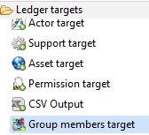

# Table of contents
{: .no_toc .text-delta }

1. TOC
{:toc}
---

# Usage

This target allow you to collect group members.

# Procedure

From collect editor select _Group members target_ in _Data set targets._  

# The properties Tab

Below is the detailed information of each property of the Group members target.

## Target

In this property you can view/edit general parameters of the Group members. The following items are availables:

- the _Identifier_ (shown in Debug mode for example)
- the _Display name_ for the _Group target_
- the _Follow just one link_ option to set the transition mode. If it is checked, only the first transition with an activation condition evaluated to true will be executed. If it is unchecked, all transitions with an activation evaluation evaluated to true will be executed.

## Description

Here you can add comments regarding actions done by this component.

## Repository

In this property, you can select the attribute containing the repository key. This repository holds group that we want to collect its members. Note that repository must exist in database.

## Group

With this property, you will define group identifier and the following two definitions are available:

- _"Attribute containing group key"_ which must contain a unique identifier for the group, for example _DistinguishedName_ in case of Active Directory groups.
- With _"Trigger an error if groupkey is null or empty"_ option to activate an event that will be generated when the attribute containing group key is null or empty (event shown in dedicated logs).

## Content

With this property, you will define group content with the below options:

- "_Attribute containing group members_" to specify attribute that contain list of accounts identifiers who are members of this group, for performance reason we advise using "group member" target to collect group members separately from collecting groups.
- "_Group containing all accounts_": this option is deprecated.
- "_Trigger an error if one of the children is not found_" is an option you can activate for an event to be generated when a group member is not found in database (event shown in dedicated logs).

## Domain

Here you can define how to found accounts and groups who are member of a group by using the following options:

- "_Separator in account_" to specify repository where the account or group member is located, this option is useful for (FileShare, Sharepoint, Exchange, ...), for example using separator "\"  to retrieve repository from "INTRA\Administrator", in this case "INTRA" is the repository used to found an account having as login "Administrator".
- "_Default repository code_" to indicate a repository that will be used to found accounts and groups who are members of collected group.
- "_Account or group identifier is unique among repositories of identical type_" to determine a repository type reference to expand accounts and groups searching (search on all repositories having specified type). It is mandatory to configure type when collecting _ActiveDirectory_ with multi-domain architecture (AD group contains members from external AD domains, files shared with accounts and groups from external AD domains, ...). You can specify repository type option when creating a repository using repository target.

# Example

Active Directory add-on is a good example for collecting accounts, groups and groups members, it is available in Brainwave store.  

# Resolution of groups and accounts during data collection

> Versions: All supported versions  

When assigning rights to groups or accounts, the information available on those groups and accounts can come from a wide range of situations, and it is not always possible to provide a straight repository / identifier pair which should normally identify the element. This is the reason why a series of fallbacks has been implemented in the collection targets managing references to groups and accounts, namely for rights as well as group members. The present article will describe the strategies that are used to resolve an unknown group or account in those two targets.  

## Resolving groups and accounts in the rights target

The rights target is used to insert both account and group rights. The entity is described by a repository and a unique identifier. To resolve the account or group that will hold the right, the following checks are made, in order. The first check that returns an object present in the current sandbox will decide what this object (account, group) will be, no matter the output of the further tests. An important consequence is that, as the tests for accounts take precedence over the ones for groups, if an account and a group have the exact same identifier and repository, only the account will receive the corresponding right.
Here are the successive tests that are performed:  

1. if repository type is not set
      1. the identifier in target is matched across the __account GUIDs__
2. the identifier is matched across all account repositories against the __SID__;  
3. the identifier is matched across the __account identifiers__ for the given repository;  
4. if repository type is not set
      1. the identifier is matched across all __group__ repositories against the __group GUIDs__;  
5. the identifier is matched across all __group__ repositories against the __SID__;
6. the identifier is matched across the __group codes__ for the given repository;
7. if repository type is set:
      1. the identifier is matched across the __account identifiers__ for the given repository type;  
      2. the identifier is matched across the __group codes__ for the given repository type.
8. if repository type is set:
      1. the identifier in target is matched across the __account GUIDs__ for the given repository type.
      2. the identifier is matched across the __group GUIDs__ for the given repository type.
9. the identifier is matched across the __account logins__ for the given repository;  
10. the identifier is matched across the __group displaynames__ for the given repository.

If all those tests fail, then no right is inserted in the database for the given input.  

> __NOTA__: if the repository name for the account/group is not set, the repository of the permission's application will be used.

## Resolving groups and accounts as members, in the group and group members target

The group target and group members target collect the group members in a similar way, although it is strongly recommended to use the group members target to this effect for better performance (you can read more on [optimize collector patterns](https://documentation.brainwavegrc.com/latest/docs/how-to/collectors/optimize-collector-patterns/)).  
The collection of group members is a bit more complex as it integrates particular cases, like the fact that the member can be given in the form `DOMAIN` (separator) `LOGIN`, which is typically the case for Microsoft `DOMAIN\LOGIN` format.  

There are thus two different series of tests, depending on whether the repository domain is provided for the member or not.  

### 1 Group members with domain

In that case the product will try to tests:  

1. the identifier is matched across the __account logins__ for the given repository;  
2. the identifier is matched across the __group displaynames__ for the given repository.  

if those tests fail the pair (repository/identifier) is added to the unresolved links.  

### 2 Group members with domain type

When no domain for the group member is set and a domain type is configured the product does the following tests:

1. the identifier is matched across the __account identifiers__ for the given repository type;
2. the identifier in target is matched across the __account GUIDs__ for the given repository type.
3. the identifier is matched across all account repositories against the __SID__;
4. the identifier is matched across the __group codes__ for the given repository type.
5. the identifier is matched across the __group GUIDs__ for the given repository type.
6. the identifier is matched across all __group__ repositories against the __SID__;

Once again, if all those tests fail, no member is inserted, but the pair (parent repository/identifier) is written as an unresolved link and will be tried upon again once all the collector line is done processing.

> __NOTA__: the repository type helps to find an account/group belonging to a forest of repositories when you don't have repository code. A good use case is LDAP group members: in such situation the identifier you have is the `Distinguished name`. The product will search in all repositories having the same type, in the same forest we assume that the `DN` is unique.

### 3 Group members without domain

When no domain for the group member is set in the target, it is supposed that it belongs to the same repository as the parent group.  
The following tests are then performed:  

1. the identifier in target is matched across the __account GUIDs__;
2. the identifier in target is matched across the __account SIDs__;
3. the identifier is matched across the __account identifiers__ for the given parent group repository;  
4. the identifier is matched across the __group GUIDs__ for the given parent group repository;  
5. the identifier is matched across the __group SIDs__ for the given parent group repository;  
6. the identifier is matched across the __group codes__ for the given  parent group repository.  

If all those tests fail, no member is inserted, but the pair (parent repository/identifier) is written as an unresolved link and will be tried upon again once all the collector line is done processing.

### 4 Unresolved links

Only groups are tested against the unresolved links (the supposition being that all accounts have been imported prior to groups, so there can be no unresolved link between an account and its parent group). Here are the tests performed to resolve those links:  

1. the identifier is matched across all __group__ repositories against the __group GUIDs__;  
2. the identifier is matched across all __group__ repositories against the __SID__;  
3. the identifier is matched across the __group codes__ for the given repository;  
4. the identifier is matched across the __group displaynames__ for the given repository.

# Known limitations

Not applicable  
