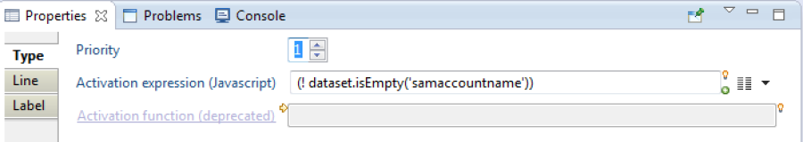

# Data collector lines

## Introduction

A collector line consists of a sequence of components. A component is a processing unit in charge of performing a specific task. The product provides about twenty components as standard, but it is possible to add others without any programming to extend the features of the collector engine.

The components are interconnected through directed transitions which signal the direction of data flow. The collector engine behaves like a sequencer which requires the source to read a record from the file and passes the record to the next component in accordance with the transitions, until the last component, which has no outgoing transition.  

A collector line always consists of a primary source. If we need to aggregate data from multiple sources, secondary sources may be implemented with joins but their operation is controlled by the primary source.  

Since the objective of the collector is to provide data to the ledger, a collector line generally includes one or more target components, each dedicated to providing a concept. It is quite normal to include multiple targets in a collector line. For example, if the LDIF export of the Active Directory is used as the source for accounts and identities, the collector line can serialize a target identity and target account.  

## Source type components

A source type component's objective is to list the records from a repository. The components available as standard in the product process only file type sources. The extraction of data from client repositories in the form of files is not supported by the product and must be addressed in integration mode.  

The general principle of operation of a file type source component is to read a record and transmit it to the next component. The notion of record depends on the type of file. This is a set of attributes constituting a single object. For example, for a CSV file, it is a line in the file. For an LDIF file, it is an entry consisting of several lines, each giving the value of an attribute. This record goes through all components according to the transitions established in the collector line. When the record has been processed by the last component, the source reads the next record, and so on until the end of the file.  

Source type components read the records and convert them into a Dataset type structure in order for data to be transmitted in a common format and standardized throughout the collector line. This data structure is called 'dataset' (DataSet). A dataset is a list of attributes. Each attribute is named and may contain multiple values.  
File type sources offer the following specific options:

- File characteristics: File name and file encoding are the options common to all types of files. Specific characteristics like the separator and columns for a CSV file or the root to process (lower DN) for an LDIF file are present according to the file format.
- Verification of file size: Some verifications may be carried out on file size, date of the file, and the file pattern. These options are useful to avoid processing a file that would be too short (probably truncated), too old (maybe obsolete), or incomplete in terms of pattern (missing column in a CSV file, for example).

All of the sources offer the following options:

- Selection of a subset of records: This option provides the possibility of selecting certain records by their numbers. The settings allow you to ignore the X first records and process only the Y following records. This filtering doesn't take into account the content of the records. For a filter related to content, use the SQL query.
- Filtering records by SQL query: The objective of filtering by SQL query is to filter the records according to their content. This type of filtering works no matter what the source type is, because the SQL filter is applied once the source has retrieved the data and transformed them into a DataSet. Only SELECT queries are authorized and the main table name must be 'dataset'. The 'where' clause allows you to test the values of the dataset attributes. All the standard SQL functions are present, such as upper, lower, trim, substring, left, concat...
- Sorting records: The purpose of sorting records is to present the records in a collector line in a certain order. This option is especially useful when a source is used in association with a grouping component.  

Source type components mainly contribute to the establishment of the database pattern. The pattern is the definition of the set of attributes handled in the different components of the collector line. The definition includes the name and attribute type (String, Number, Date, or Boolean) and multivalued indicator. Each source defines the attributes corresponding to the columns or tags present in the input file, which automatically fill in the pattern of the collector line. On the other hand, the source script adds no attribute declaration to the pattern. Attributes generated in JavaScript must be declared manually in the component's properties.  

> [!warning] The declaration of an attribute in the pattern does not guarantee the presence of the attribute in the dataset during the execution of the collector line. Only columns or tags having a value will create an attribute in the dataset.

## Filter type component and target type component

Filter type components are used to modify the contents of the current dataset while the target type components provide data to the ledger from the current dataset without modifying anything. In both cases, components accept a dataset as input, process it, and then go to the next component according to the transitions.  

It is important to note that a target type component is not a terminal element in the collector line, but it may have one or more outgoing transitions to other filter or target type components as shown in the following example:

  

Only filter type components are involved in the formation of the data pattern. For example, adding an attribute calculated from another one in the modification component automatically declares the new attribute in the collector line pattern. Target type components never modify the dataset and, therefore, have no effect on the pattern.  

## Transitions events and conditions

The components of a collector line are connected to each other by transitions. If several transitions start from a component, each of them is numbered in order to follow them in ascending order of their numbers.

A transition may carry a condition authorizing or preventing crossing the link to reach the next component. This condition is always expressed in the form of a JavaScript function call. In the graphical editor, text may be displayed expressing the condition clearly for an easier understanding of the collector line.

The general principle of operation of the transitions is the following when there is at least one outgoing transition:

- Evaluation of all the JavaScript conditions: If a transition has no condition, we consider that it must be crossed to move to the next component. This step allows us to determine the entire list of transitions which must be performed before following a particular transition.
- If at least one transition remains in the list:
- Passing the first transition: The transition is performed and the next component is executed as well as all the following sub-components.
- Taking into account the 'Follow only one link' option: When the first following component and all the sub-components have finished running, the collector engine verifies the 'Follow only one link' option. This option, when activated, allows you to ignore other transitions after running the first one.
- If the 'Follow only one link' option is not activated:
- Passing all other transitions: Following the number order of the transitions, each transition is performed and the next component and all subcomponents are executed.  

The condition associated with a transition is a JavaScript activation expression which must return a Boolean to allow or prevent access to the next component. This macro is referenced in the transition in the 'activation function' field as shown in the following screenshot:  

It is important to note that the transition conditions are all evaluated before being performed, and not as the following components are running.  

  

The return value of the activation expression is true if the transition can be performed, false otherwise. If the activation expression returns true, the next component is executed.  

In most cases, the activation expression tests the dataset contents as in the example above. However, in some cases, the passage of a transition must be made conditional upon the detection of a particular event. Indeed, some components generate events generally corresponding to working errors. For example, the modifying component of an attribute may generate an event if the attribute does not exist. The name of the event may be freely chosen. It becomes possible to pass on a particular transition when the event has been detected. The following code does the opposite as it prevents the transition from passing if the '_unknown attribute'_ event is detected: `{dataset.hasEvent('unknown attribute')}`  

It can be useful to combine a transition condition with the 'Follow only one link' option to make a connection of the 'if ... then ... else' type. If we take the previous example with the _'unknown attribute'_ event, it is possible to create two different paths depending on the detection or not of this event. The first transition should be crossed if the event has not been detected while the second transition should be crossed if the event is detected. Both transitions (and associated components) are exclusive. To achieve this conditional fork, just put a condition on the first transition and enable 'Follow only one link'. No condition is required for the second transition since it is performed only if the condition of the first transition is not verified.

## Starting and ending points

A collector line must define the primary source as a starting point. Otherwise, the collector line cannot be run. A collector line can only contain one starting point, and this starting point is always a source.  

A collector line may consist of several paths, each ending with a filter or a target. It is quite normal to have multiple terminals components (without outgoing transitions) in a collector line. A single ending point is not necessary.  

An ending point should only be defined in two cases:  

- when the collector line is called by another collector line.
- when the collector line is packaged as a source component or filter.

A single ending point may be defined in a collector line. The ending point does not mean that the collector stops when the component with the ending point is reached. The collector engine totally ignores the ending point when it is running the line. The ending point is only useful when a collector line is called by another collector line, packaged as a component or not. In this case, the datasets of the sub-collector line must go back to the main collector line. The ending point designates the component which gives its datasets to the calling line. Another way to understand the ending point is to imagine a virtual transition starting from the component and carrying the ending point towards the component of the calling collector line.