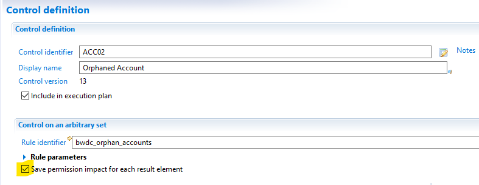
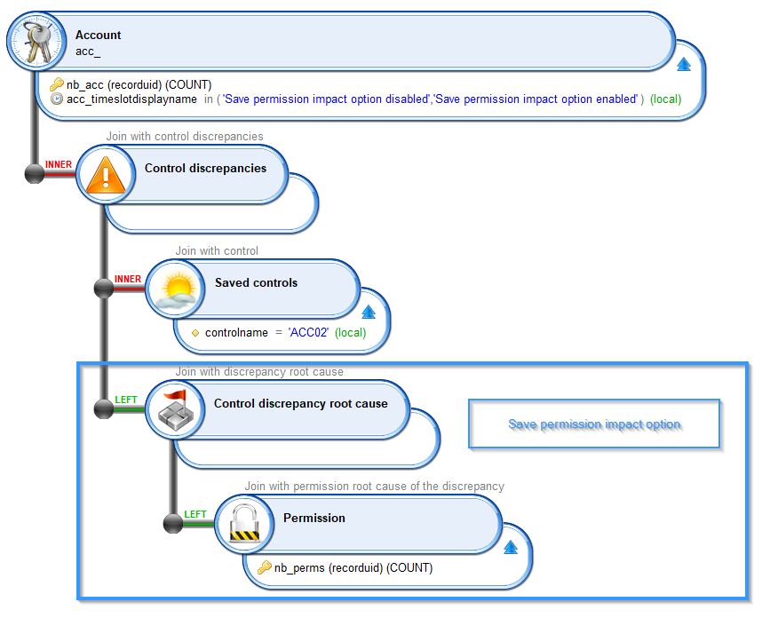

# Control's Save Permission Impact

## Overview

In the controls definition (assuming the control type allows it), there is a `Save permission impact for each result element` checkbox:  
  

> This option has a negative impact on performance, so use it wisely  

## What does it do

If this option is enabled, it will save all the permissions the entity (`Account`, `Identity`) has access to as `Control discrepancy root cause`.  
If the option is disabled, only the entity (`Account`, `Identity`) will be saved as `Control discrepancy`; but there will be no root cause.  

> This is why on large projects it is better to not check this option as this will add entries in the database for all permissions of each entity

## How to Retrieve the Results

Here is an example view that returns the control results for `Accounts` on the default control `ACC_02` and the `Control discrepancy root cause` if any:  
  

We ran one execution plan with the `Save permission impact for each result element` disabled then enabled to illustrate the difference:  
  
