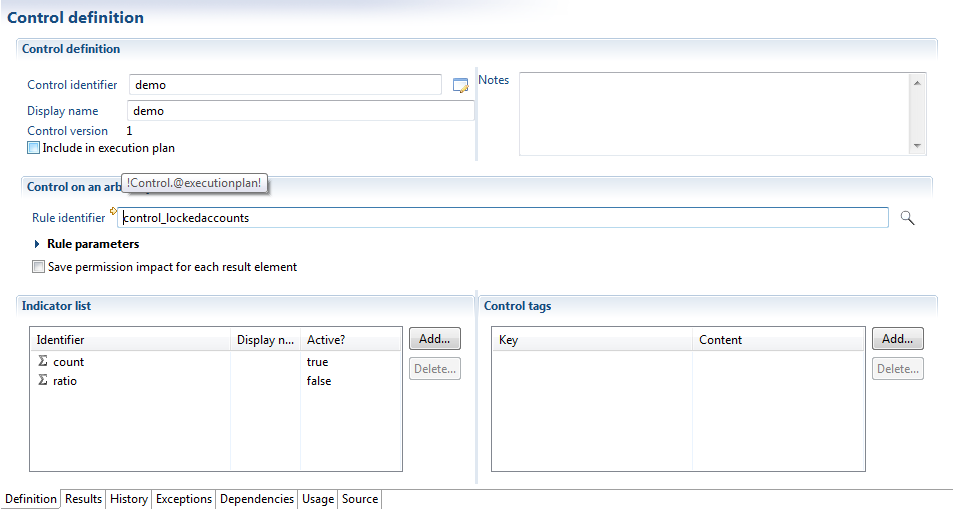
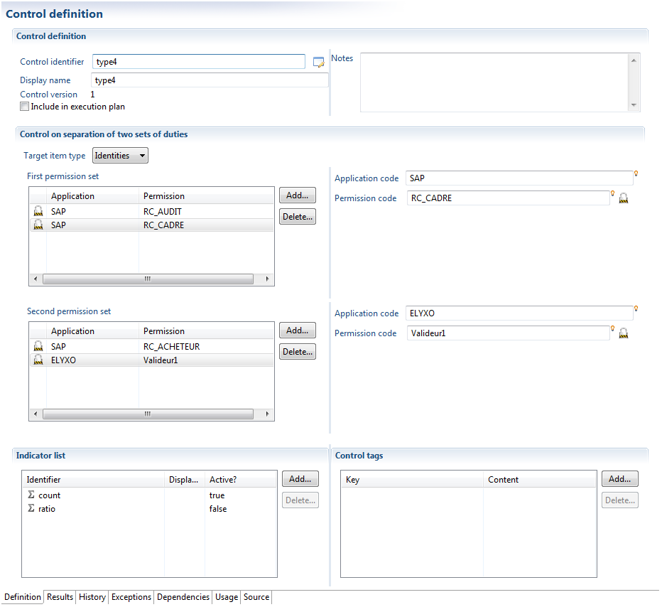
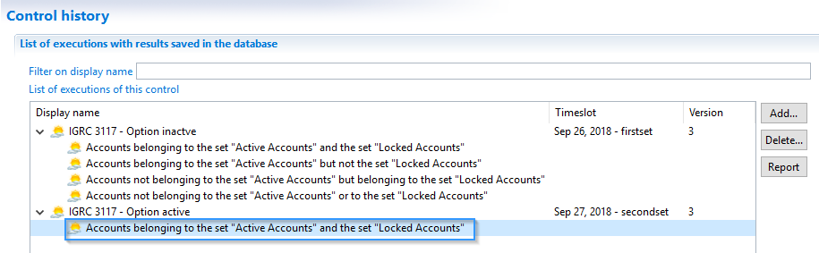
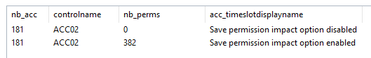

# Control Methods Present in Analytics

There are different types of control methods within Brainwave Identity GRC. You will find below a succinct description of each.  

##  Arbitrary Set

This type of control allows one to directly refer to answers from a rule as a set of deviations.  
This type of control is primarily used in order to set quality checks on data.    
For example:   

- Orphan accounts
- Dormant accounts
- Unused groups/permissions   

Or, moreover, macroscopic controls, such as which persons in a department X have access to an application (regardless of associated authorizations).   
Setting this control returns a reference to a rule. Click here for documents related to setting up rules within Brainwave Identity GRC.   

Note also that there are already a number of rules available under the section "controls" when you select a control rule, thus saving you from having to set up all the ground rules from scratch.   

In case you wish to use the information relating to the impact of a control, it is necessary to select "Append the impact on authorizations to every result". This has the effect of appending this deviation to all the authorizations that can be accessed by an account or identity.  

This is useful if, for example, you wish to highlight the deviations associated with authorizations, as well as issues with data quality (for example: is authorization X granted to orphan accounts, dormant accounts, etc...)  

## Assigning Authorizations

This type of control allows one to identify populations that have legitimate access to a given authorization.  
This type of control therefore allows one to automate the verification of rules for the management of allocation of authorizations in place within the company.  

These populations are identified thanks to a rule that returns a set of identities or accounts.  
A large number of rules are rules available under the section "controls" when you select a control rule, thus saving you from having to set up all the ground rules from scratch.  

Controls of the type "Assigning authorizations" allow one to identify different populations:    

- Populations (results obtained from a rule)
- People or accounts that have a given authorization (authorization found)
- A population that provides the authorization (case rights)
- Over-allocation of rights : people or accounts that are granted authorizations but are not part of the target population.
- Under-allocation of rights : people or accounts that are not granted the authorizations, but are part of the target population.

Controls of type "Assigning authorizations" automatically calculate the impact on the referred authorization. This means that it is then possible to identify, for a given authorization, the accounts/identities that are missing from this control.   

Each control of this type is considered a complet entity, that is to say, if you define different controls of type "Assigning authorizations" on the same authorization, there will be no set logic between the two populations of controls. It is your responsibility to define a rule that aggregates the different populations.  

## Separation of Tasks

Controls of the type "Separation of tasks" allow one to identify authorizations incompatible with one another.  

All identified authorizations are considered as being incompatible, which signifies that all the identified authorizations in the list are to be disposed of. If you wish to execute controls in pairs, you must use a control of the type "separation of two sets of tasks".  
These calculations may be carried out at the level of accounts or identities. Note that when the calculations are carried out at the level of identities, only the "reconciled" accounts are taken into account while the control is evaluated.  
It should be noted that this control is not limited to an application silo, and it is in fact possible to test incompatibilities between different applications.  
Controls of the type "separation of tasks" automatically calculate the impact on the selected authorization. That is to say that it is then possible to identify, for a given authorization, the accounts and identities that are missing for this control.  

## Separation of Two Sets of Tasks

Controls of the type "separation of tasks" allow the identification of sets of authorizations incompatible with one another.  

This control is used when authorizations are grouped by lots (activities) and one when one wants to verify the correct separation of activities. It is therefore necessary to execute comparisons in pairs between the sets, in order to identify if incompatibilities are present within the authorizations: for a given account or identity, there must be at least one clear authorization in Set 1 and one authorization in Set 2.    

It should be noted that this control is not limited to an application silo, and it is in fact possible to test incompatibilities between different applications.   

Controls of the type "separation of two sets of tasks" automatically calculate the impact on the selected authorization. That is to say that it is then possible to identify, for a given authorization, the accounts and identities that are missing for this control.  

## Separation of Roles

Controls of the type "separation of roles" allow the identification of groups incompatible with one another.   

All identified groups are considered to be incompatible, meaning that all the groups identified in the list must be disposed of. If you wish to execute controls in pairs, you must use a control of the type "separation of two sets of roles".

These calculations may be carried out at the level of accounts or identities. Note that when the calculations are carried out at the level of identities, only the "reconciled" accounts are taken into account while the control is evaluated.   

It should be noted that this control is not limited to an application silo, and it is in fact possible to test incompatibilities between groups in different repositories.   

This control is particularly useful when faced with a complex network of authorizations. The easiest way is then to load these authorizations one at a time as "authorizations" and as "groups in the template in order to manage the inheritance of rights. Controls of the type "Separation of roles" thus allow one to reassign groups (roles) that have provided authorizations, and enter groups/authorizations that this role gives access to.  

## Separation of Two Sets of Roles

Controls of the type "separation of roles" allow the identification of sets of groups that are incompatible with one another.  

This control is used when authorizations are grouped by lots (activities) and one when one wants to verify the correct separation of activities. It is therefore necessary to execute comparisons in pairs between the sets, in order to identify if incompatibilities are present within the authorizations: for a given account or identity, there must be at least one clear authorization in Set 1 and one authorization in Set 2.   

It should be noted that this control is not limited to an application silo, and it is in fact possible to test incompatibilities between groups in different repositories.   

## Theoretical Clearances

This type of control allows one to compare clearances actually granted with clearances granted via a system of clearance management (workflow), or a theoretical data model derived from a consolidation of clearances in roles.  

The implementation of this type of control requires one to have previously loaded within data models, the "theoretical" clearances of users.   

The configuration of a theoretical clearances control requires one to specify the parameter on which the control must be applied, both in terms of the target populations and authorizations.  
This requires setting up two rules:    
- An identity rule to identify the identities to which this control has been applied.
- An authorization rule in order to identify the authorizations to which this control has been applied.   

The control will compare, according to the given perimeter, the authorizations that have been actually granted to the "theoretical" authorizations, and will highlight the lists of results:   
- The target population (result from the identity rule)
- The over-allocation of rights : the persons or accounts that have access to the authorizations, but appear to not have been granted them, within the theoretical data model of rights.
- The under-allocation of rights : the persons or accounts that are not granted authorizations, but appear to have access to them within the theoretical data model of rights.   

The implementation of this type of control requires authorizations referenced in the theoretical model of rights to have the same identfiers as those in the target systems. In this sense, this type of control is very selective of the quality of data supply required in the theoretical model of rights.  

## Advanced Control

This type of control allows the identification of deviations using arbitrary sets of accounts or identities.      

This control is used when configuring two sets (either identities or accounts). The control then calculates the overlap between the two sets and considers this overlap as a set of deviations.    

For example, to verify that administrators are not connected to operational departments, it is enough to set up two rules:   
- List of persons that have "administrator" priviledges
- List of persons who are not part of the DSI
In case you wish to use the information relating to the impact of a control, it is necessary to select "Append the impact on authorizations to every result" This has the effect of appending this deviation to all the authorizations that can be accessed by an account or identity.  

This is useful if, for example, you wish to highlight the deviations associated with authorizations.   

Note that it is advisable to use this control only when it is not possible to use any of the previous controls.   

By default the advanced control will save four types of results, as shown here:   

Or if shown independently:   

But you might not need all these combinations, just the intersection of the two control rule.   

There is an option just for that, that will improve performance:   

You can see here that when this option is activated, there is only one saved result instead of the usual four:   

# Control's Save Permission Impact

## Overview

In the controls definition (assuming the control type allows it), there is a `Save permission impact for each result element` checkbox:  
  

> This option has a negative impact on performance, so use it wisely  

## What does it do

If this option is enabled, it will save all the permissions the entity (`Account`, `Identity`) has access to as `Control discrepancy root cause`.  
If the option is disabled, only the entity (`Account`, `Identity`) will be saved as `Control discrepancy`; but there will be no root cause.  

> This is why on large projects it is better to not check this option as this will add entries in the database for all permissions of each entity

## How to Retrieve the Results

Here is an example view that returns the control results for `Accounts` on the default control `ACC_02` and the `Control discrepancy root cause` if any:  
  

We ran one execution plan with the `Save permission impact for each result element` disabled then enabled to illustrate the difference:  
  

# Theoretical Rights and Segregation of Duties

## Context

This document functionally describes the different types of controls provided with iGRC. The technical functionalities are described in the following article available [Control Methods present in Analytics]({{site.baseurl}})    

Brainwave Identity GRC incorporates the concept of control. Controls are of several types including:   

- Segregation of Duties (SoD sontrols). This is the principle of verification of the incompatibility between two tasks or activities.
- Jurisdictional control based on permission in relation to an organizational unit, or depending on the characteristics of a person. This type of control can be defined as the verification of the implementation of a business rule or a security policy. In other words, a control = a rule +context + a semantic.

A control allows identifying such problems:   

- data Quality; _e.g._ identification of orphan accounts,
- the principle of least privilege, typically on the allocation of rights,
- the separation of tasks also known as Segregation of Duties (SoD) to characterize tasks as being incompatibles between them or carrying a risk if they are performed by the same person.

## iGRC Analytics Types of Controls

Among the defined controls under the mentioned article: [Control Methods present in Analytics]({{site.baseurl}}), and depending on the type of parameter, such results can be obtained:   

- Arbitrary set: The control result is the result of a rule. It is useful in the case of data quality issues. Examples of concepts of the iGRC ledger that can be titled by a control discrepancy are account, identity, etc.; setting such type of control comes to implement a rule of type:
  - list of the orphan, dormant accounts,
  - list of identities without HR code (employee identification)
- Ensemblist approach: Those are perimeter controls at the application level through the type of control like "Assigning permission". This type of control informs on people who likely have the permission in exhaustive manner. Thus, the management rules of authorizations allocation being implemented within a company can be automated.   

_Example:_ Only the people of the department "My Department" have the rights to access to permission "α" of the application "β". Therefore, it is necessary to define a rule that reference identities and fill in the parameter on the department: "My\_department". "α" and "β" parameters can be user-entered information.   

In addition of returning the discrepancies, control can also check:   

- The over-allocations rights: Persons or accounts that are not entitled to have the right on permissions but have them.
- The sub-allocations rights: Persons or accounts that should have the rights to permission and do not have them.

This control on assigning permissioncan show multiple results as mentioned above. This control is different from the control of thearbitrary setthat references a single type of result.   

## Segregation of Duties Controls

The SoD type of control identifies incompatible tasks between them. It is configurable through the separation of tasks,the separating of two sets of tasks. A task is a set of couples permission / application. There is one type of SoD control result: "the inconsistencies". The SoD controls are based on accounts or identifiers. It is also possible to perform inter-application SoD.    
Example, being Accountant (Task 1) is incompatible with the payer function (Task 2).

Brainwave iGRC analytics includes a "SoD target" for creating SoD controls. The controls are automatically generated in the subdirectory "controls / generated" of the associated project during the data loading process.

## Theoretical Rights Controls

This can be access request verification via an authorization management system. For example, some rights can be awarded to some users and not to others. Such controls can then compare the actually granted authorizations to those granted through a workflow process for example.   

Configuring a theoretical right control involves specifying the perimeter on which this control is applied, both in terms of population (identities) and permissions covered by associated applications. The control will thereby compare on the given perimeter the actually granted permissions to the "theoretical" ones in order to highlight the results lists. The technical documentation on configuring the theoretical rights controls into iGRC Analytics is available [here]({{site.baseurl}})   

<u> A theoretical right can be:</u>

1. An access request workflow with a beneficiary ID, a couple of applications/ permissions.

2. The description of the tasks by perimeters: such loading can be done in two steps. The conditions for granting application/permission is loaded during the first data loading process (cf. collector line under the theoretical right target). There may be several applications / permissions couples on which the theoretical rights will be built. Then, once the table of theoretical rights loaded, loading the reconciliation of theoretical rights can be done: it is the research of the targeted population on which are based the granting conditions :

- Verification of theoretical access workflows. The over and under right-allocations can be displayed using the information such as the list of identities, applications/permissions as well as the theoretical rights.
  - However, in the access request workflow we do not have the information which permits to verify the sub-allocations of rights.
  - When performing a control, the results are recorded in the iGRC ledger. Within the meaning of the database, controls results are stored in an object called "control result".   

- "Root cause (Impacts)"": It identifies for a given permission, the accounts or identities deviation regarding a control.   
Example: Is there's orphan accounts that have rights to applications =\> iGRC automatically calculates the impact in terms of permissions attached to an orphan account.   

Remark: It is not only to characterize the deviation/inconsistency but also the results to be used for reporting purposes. For SoD and theoretical right types of controls, it is necessary to fill-in these attributes (required) in order to use them into a report.   

- Control code : Control identifier
- Control type: Control family on which the work is done: from 1 to 6. "Control result = 6" for SoD and "control result = 5" for the theoretical rights.
- It provides information on the type of result that is over-allocation (“Control result type = 1") or "under/sub-allocation rights (" Control result type = 2 ").
- Control entity takes a value of "string" type that provides information on the family of objects that the control refers: accounts or identities.
- This type of control can identify people who have legitimate access to a given permission.
- This type of control allows automating the audit of management rules of granting authorizations being in place within the company.

# Controls Default Tag

When creating controls, it is possible to assign to the controls a set of tags. The main tag fields are:   

- type
- scope
- family
- custom1 to custom9

All the fields can store String values, the content is let open. The owner of the control can decide which tags to use and which values to write.     

## What are these tags for?

The values stored in these tags have no impact for calculating the controls results. Content on this fields are not parsed nor interpreted, they are not checked for consistency or to avoid collision.      

However, these tags can become very useful to clearly identify a set or group of controls. For example, it can be useful to classify the controls into two groups: risk and quality. This will make it easy to query the results controls filtering by the value of the tags. It will be easy to answer to the question: "What are the controls that represent a risk ?".   

## What values are already used?

Some of the Brainwave facets deliver their own rules and controls. When these facets deliver views, pages or reports to display the results of the controls , it is common to use control tags in order to search, filter and classify.   

If the value of the tags for the delivered controls is modified, then the views and pages associated may stop working correctly.   

Some of the facets that use control tags: bw\_ad\_controls, bw\_ad\_schema, bw\_controlsdashboard, bw\_controls\_browser, bw\_groupsandaccounts\_analytics.

| **Tag Field** | **Values already used** |
| **type**   **family**   **scope**   **custom1**| Entities keywords : **account, group, identity, organisation, application, permission, repository, control, right, rights, manager, owner, owners**    AD keywords: **securitygroup, localadmin, gporights, gpo, AD**   Categories keywords : **risk, quality, privileged**   Other keywords: **onallaccounts, perroganisation, perrepository, perapplication, WAB, AWS, SoD** |

## In which Add-Ons are these tags used?

Here you will find a non-exhaustive list of the main add-ons or facets that include controls and the tags that are used in their latest versions.    

> **bw\_ad\_controls**

This facet is used mainly by the AD Booster and some other facets like bw\_groupsandaccounts\_analytics. It includes around a dozen of controls designed to find problems in Active Directory. The controls use the following tags:    

family:AD   
scope: quality, risk   
type: securitygroup, account, group   
custom1: onallaccounts     

> **bw\_ad\_schema**

This facet is only used by the AD Booster. It extends bw\_ad\_controls by introducing advanced controls on Active Directory. The following tags are used:   

family: AD
scope: privileged, quality, risk, localadmin, gporights
type: account, securitygroup, group   

> **bw\_controlsdashboard**

This facet include some controls and some pages to display the results? The following tags are used:   

type: control
scope: repository, application, perroganisation

> **bw\_mashup\_bastion**

This add-on provides ready-to-use mashup dashboards. It includes some controls that use the following tags:   

family: WAB

> **bw\_mashup\_amazonaws**

This add-on provides support for Amazon AWS services.The following tags are used:   

family: AWS

> **bw\_segregationofduties**

Thiss add-ons generates SoD controls based on an SoD matrix received as input. The tags used for the controls are to be defined for each project. However, the most commonly used tags:   

family: SoD

## Best Practices

If you want to tag your controls in order to filter them:   

- Avoid using the keywords mentioned above. Creating new controls with those tags might impact the functionalities of some existing facets
- Think of making your tags unique, for example by adding a prefix like xx\_risk
- Combine multiple tags. For example family=AD AND scope=risk

## Downloads

[Control Ensembles.pptx ](https://download.brainwavegrc.com/index.php/s/AL5cs9oTKWoR3sT)
