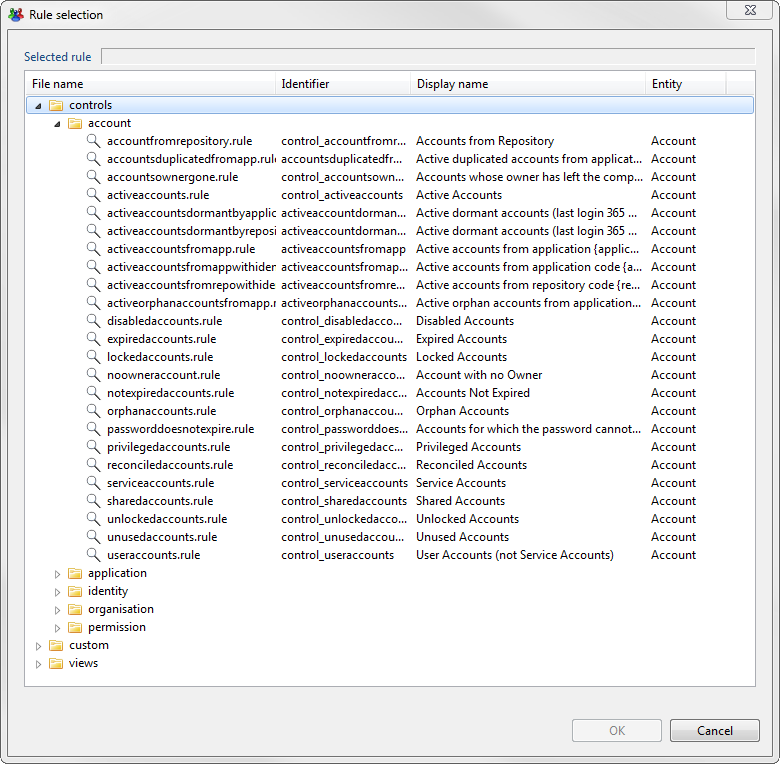
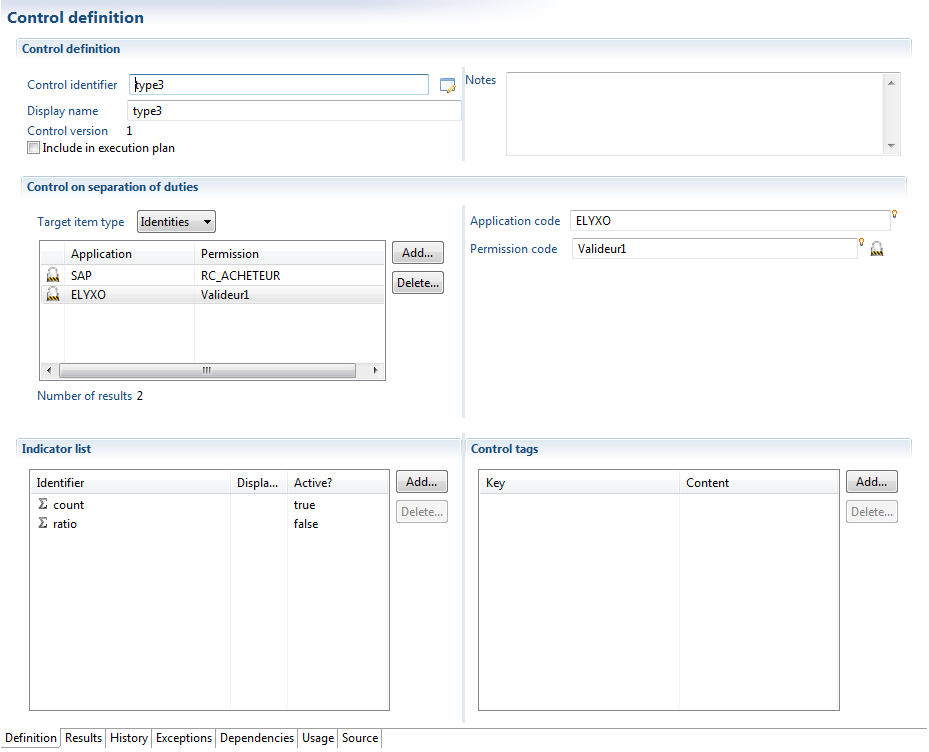
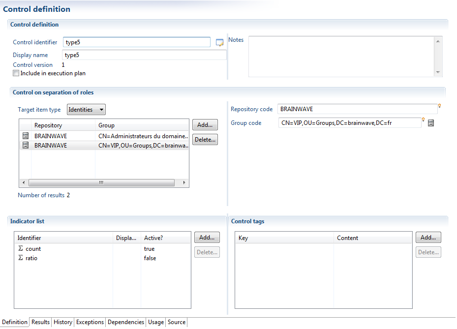
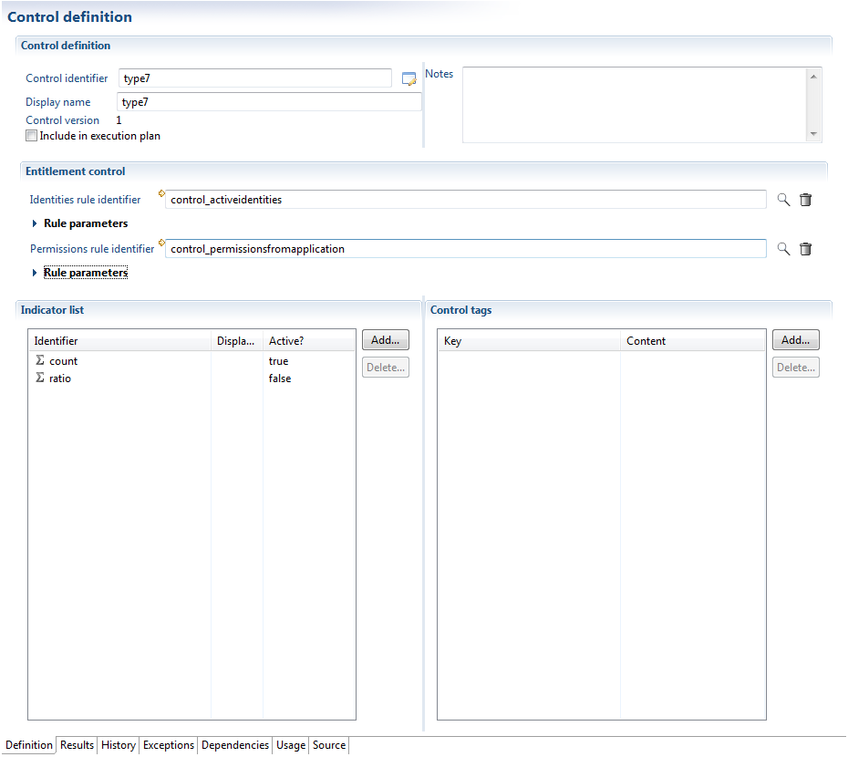
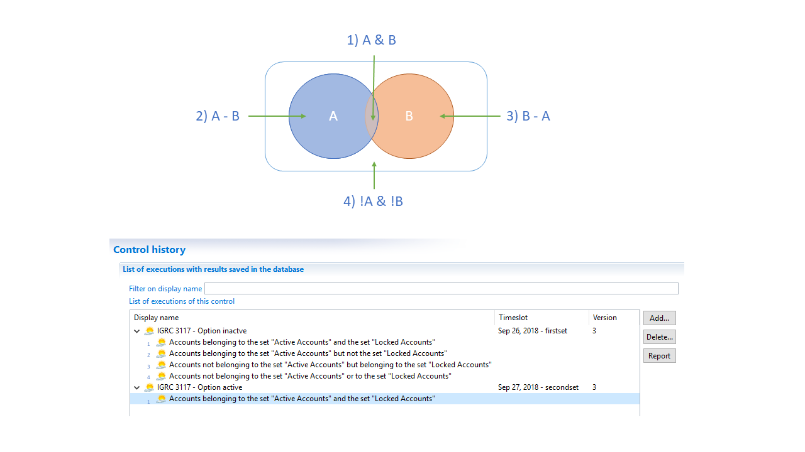
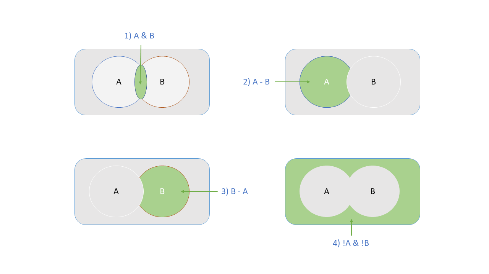

# Controls

## Control Methods Present in Analytics

There are different types of control methods within Brainwave Identity GRC. You will find below a succinct description of each.  

## Arbitrary Set

This type of control allows one to directly refer to answers from a rule as a set of deviations.  
This type of control is primarily used in order to set quality checks on data.
For example:

- Orphan accounts
- Dormant accounts
- Unused groups/permissions

Or, moreover, macroscopic controls, such as which persons in a department X have access to an application (regardless of associated authorizations).
Setting this control returns a reference to a rule. Click here for documents related to setting up rules within Brainwave Identity GRC.

Note also that there are already a number of rules available under the section "controls" when you select a control rule, thus saving you from having to set up all the ground rules from scratch.

In case you wish to use the information relating to the impact of a control, it is necessary to select "Append the impact on authorizations to every result". This has the effect of appending this deviation to all the authorizations that can be accessed by an account or identity.  

This is useful if, for example, you wish to highlight the deviations associated with authorizations, as well as issues with data quality (for example: is authorization X granted to orphan accounts, dormant accounts, etc...)  

## Assigning Authorizations

This type of control allows one to identify populations that have legitimate access to a given authorization.  
This type of control therefore allows one to automate the verification of rules for the management of allocation of authorizations in place within the company.  

These populations are identified thanks to a rule that returns a set of identities or accounts.  
A large number of rules are rules available under the section "controls" when you select a control rule, thus saving you from having to set up all the ground rules from scratch.  

Controls of the type "Assigning authorizations" allow one to identify different populations:

- Populations (results obtained from a rule)
- People or accounts that have a given authorization (authorization found)
- A population that provides the authorization (case rights)
- Over-allocation of rights : people or accounts that are granted authorizations but are not part of the target population.
- Under-allocation of rights : people or accounts that are not granted the authorizations, but are part of the target population.

Controls of type "Assigning authorizations" automatically calculate the impact on the referred authorization. This means that it is then possible to identify, for a given authorization, the accounts/identities that are missing from this control.

Each control of this type is considered a complete entity, that is to say, if you define different controls of type "Assigning authorizations" on the same authorization, there will be no set logic between the two populations of controls. It is your responsibility to define a rule that aggregates the different populations.  

## Separation of Tasks

Controls of the type "Separation of tasks" allow one to identify authorizations incompatible with one another.  

All identified authorizations are considered as being incompatible, which signifies that all the identified authorizations in the list are to be disposed of. If you wish to execute controls in pairs, you must use a control of the type "separation of two sets of tasks".  
These calculations may be carried out at the level of accounts or identities. Note that when the calculations are carried out at the level of identities, only the "reconciled" accounts are taken into account while the control is evaluated.  
It should be noted that this control is not limited to an application silo, and it is in fact possible to test incompatibilities between different applications.  
Controls of the type "separation of tasks" automatically calculate the impact on the selected authorization. That is to say that it is then possible to identify, for a given authorization, the accounts and identities that are missing for this control.  

## Separation of Two Sets of Tasks

Controls of the type "separation of tasks" allow the identification of sets of authorizations incompatible with one another.  

This control is used when authorizations are grouped by lots (activities) and one when one wants to verify the correct separation of activities. It is therefore necessary to execute comparisons in pairs between the sets, in order to identify if incompatibilities are present within the authorizations: for a given account or identity, there must be at least one clear authorization in Set 1 and one authorization in Set 2.

It should be noted that this control is not limited to an application silo, and it is in fact possible to test incompatibilities between different applications.

Controls of the type "separation of two sets of tasks" automatically calculate the impact on the selected authorization. That is to say that it is then possible to identify, for a given authorization, the accounts and identities that are missing for this control.  

## Separation of Roles

Controls of the type "separation of roles" allow the identification of groups incompatible with one another.

All identified groups are considered to be incompatible, meaning that all the groups identified in the list must be disposed of. If you wish to execute controls in pairs, you must use a control of the type "separation of two sets of roles".

These calculations may be carried out at the level of accounts or identities. Note that when the calculations are carried out at the level of identities, only the "reconciled" accounts are taken into account while the control is evaluated.

It should be noted that this control is not limited to an application silo, and it is in fact possible to test incompatibilities between groups in different repositories.

This control is particularly useful when faced with a complex network of authorizations. The easiest way is then to load these authorizations one at a time as "authorizations" and as "groups in the template in order to manage the inheritance of rights. Controls of the type "Separation of roles" thus allow one to reassign groups (roles) that have provided authorizations, and enter groups/authorizations that this role gives access to.  

## Separation of Two Sets of Roles

Controls of the type "separation of roles" allow the identification of sets of groups that are incompatible with one another.  

This control is used when authorizations are grouped by lots (activities) and one when one wants to verify the correct separation of activities. It is therefore necessary to execute comparisons in pairs between the sets, in order to identify if incompatibilities are present within the authorizations: for a given account or identity, there must be at least one clear authorization in Set 1 and one authorization in Set 2.

It should be noted that this control is not limited to an application silo, and it is in fact possible to test incompatibilities between groups in different repositories.

## Theoretical Clearances

This type of control allows one to compare clearances actually granted with clearances granted via a system of clearance management (workflow), or a theoretical data model derived from a consolidation of clearances in roles.  

The implementation of this type of control requires one to have previously loaded within data models, the "theoretical" clearances of users.

The configuration of a theoretical clearances control requires one to specify the parameter on which the control must be applied, both in terms of the target populations and authorizations.  
This requires setting up two rules:

- An identity rule to identify the identities to which this control has been applied.
- An authorization rule in order to identify the authorizations to which this control has been applied.

The control will compare, according to the given perimeter, the authorizations that have been actually granted to the "theoretical" authorizations, and will highlight the lists of results:

- The target population (result from the identity rule)
- The over-allocation of rights : the persons or accounts that have access to the authorizations, but appear to not have been granted them, within the theoretical data model of rights.
- The under-allocation of rights : the persons or accounts that are not granted authorizations, but appear to have access to them within the theoretical data model of rights.

The implementation of this type of control requires authorizations referenced in the theoretical model of rights to have the same identifiers as those in the target systems. In this sense, this type of control is very selective of the quality of data supply required in the theoretical model of rights.  

## Advanced Control

This type of control allows the identification of deviations using arbitrary sets of accounts or identities.

This control is used when configuring two sets (either identities or accounts). The control then calculates the overlap between the two sets and considers this overlap as a set of deviations.

For example, to verify that administrators are not connected to operational departments, it is enough to set up two rules:

- List of persons that have "administrator" privileges
- List of persons who are not part of the DSI
In case you wish to use the information relating to the impact of a control, it is necessary to select "Append the impact on authorizations to every result" This has the effect of appending this deviation to all the authorizations that can be accessed by an account or identity.  

This is useful if, for example, you wish to highlight the deviations associated with authorizations.

Note that it is advisable to use this control only when it is not possible to use any of the previous controls.

By default the advanced control will save four types of results, as shown here:

Or if shown independently:

But you might not need all these combinations, just the intersection of the two control rule.

There is an option just for that, that will improve performance:

You can see here that when this option is activated, there is only one saved result instead of the usual four:

