# General Concepts

The Brainwave Identity GRC report editor relies on the Open Source BIRT solution maintained by the Eclipse community. Many books about this solution are available; we invite you to refer to the first chapter of this guide for a list of these books.
 Brainwave Identity GRC brings many improvements to the standard version of BIRT, particularly in how reports are configured to access the data. If you are already familiar with the BIRT reporting solution, we suggest you read at least the chapter 'Datasets' to get an overview of the unique features of the solution.
 The reporting engine is a solution which allows you to dynamically generate reports based on data stored in repositories (files, SQL, ...). Reports may be generated in multiple formats. Reports are generated dynamically upon the user's request; as a result, reports can be dynamic and their content can depend on the context of use (e.g., to restrict the data displayed to a subset depending on the role of the user who generates the report). Reports may contain hyperlinks so that you can navigate between reports and thus create Web applications.
 Reports are generated on the basis of report templates. These models are XML files with the .rptdesign suffix. There are numerous ready-to-use reports in the 'reports' subdirectory of your audit project. The reports are separated there in subdirectories according to their primary use (browsing, analysis, monitoring, rules' outcomes, ...). Report templates files (.rptdesign) are editable with a dedicated graphical editor in Brainwave Identity GRC. To use all the features of the editor, we recommend that you switch to the 'iGRC Reports' perspective when you publish a report.
 When generating a report, the sequence of operation is always the same:

1. Load the report template
2. Retrieve the report settings if necessary
3. Run the different queries in order to retrieve the data to lay out in the report
4. Layout and display the report in the desired format

The runtime phase of the various queries to retrieve data to be listed in the report results in a temporary .rptdocument file; this file is then used by the renderer during the generation phase. This allows you to generate multiple reports based on the same data (for example, for a paginated display in HTML format).
 A report must use configured datasets to retrieve the data to list out. This concept is called 'Data Set' in the report editor. The 'Data Sets' are configured in the 'Data Explorer' view in the report editor. A parameterized query in the data set corresponds to each 'Data Set', and results in a list of results (like a CSV table or an SQL SELECT query, for example). The 'Data Set' may receive parameters, so the 'Data Set' may be dynamic, or even nested.

The display of data in a report amounts to positioning a chart component (table, graph, …) in the report and configuring the way this component uses data from a 'Data Set' of the report. Many components exist in the reporting engine, allowing you to display the data in various formats, to perform various analyses on the data (statistics, pivot tables, ...), to use the data in a chart format, ...
The creation of a report always follows the following steps:

1. Functional analysis of data to be returned. It is imperative to ask yourself the following questions before starting to create the report:
    - What is the purpose of my report
    - Who will use it
    - What data are necessary to allow the users of this report to conduct the appropriate actions

2. Creation of a new report in the reports/custom subdirectory by selecting a report template using the reports wizard
3. Creation of report parameters if necessary
4. Creation and configuration of the 'Data Sets' allowing data retrieval from the general identities ledger
5. First pass of the report layout by adding the main graphical components (lists, tables, charts, PivotTables)
6. Association of chart components: Table, List, Chart, and PivotTable with the corresponding 'Data Sets' to display the data
7. Second pass of the report layout, performing label layout, grouping, sorting, data aggregation operations...
8. Creation of hyperlinks if necessary to allow contextual navigation from this report
9. Localization of labels if necessary
10. Report testing, and addition of the report to the web portal if necessary

The following chapters will allow you to discover, step by step, how to configure the data sets and the different graphical components available in the report editor. We also invite you to refer to the guide, BIRT Report Developer Guide' in the Brainwave Identity GRC for more details about using the report editor.

## Datasets

Datasets (Data Sets) allow us to query the Identity Ledger in order to extract data for reporting purposes. The BIRT solution natively provides many ways to extract data: From SQL databases, CSV files, XML files, to BigTable Cloud computing-type systems (Hadoop, ...). Brainwave Identity GRC extends the native features of the BIRT solution by adding a new means to access the Ledger data: The Audit Views (subdirectory 'views' in your audit project). The audit views allow us to extract information from the Identity Ledger without prior knowledge of a technical language like SQL, and without technical knowledge of the Identity Ledger data model. It is thus possible to simply configure Ledger data retrievals queries for reporting or analysis purposes. Over 80 audit views are provided as standard in the product, allowing you to take advantage of the information stored in the Identity Ledger from the very beginning of your audit project.
 We invite you to refer to the 'Audit Views Editor Guide' for more information on setting up audit views in the Brainwave Identity GRC product.

### Create a Dataset

The creation of a new Dataset in the current report is performed by placing the cursor on the 'Data Explorer' view and right-clicking on the 'Data Sets' entry, then on 'New Data Set'.  

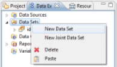 
**_Creating a dataset_**

A wizard opens, and it lets you choose the name of your Dataset, the next panel lets you select the Audit View on which the Dataset will rely in order to dynamically retrieve data in the identities ledger. Select an audit view by clicking the 'folder' button; this will display the sub-tree of the corresponding in the 'views' subdirectory of your audit project. Each audit view is presented with a description of the operations it performs. Do not hesitate to open the corresponding audit view in your audit project if you have any doubt about the operations performed by an audit view.

 
**_Selecting an audit view_**

When the audit view is selected, the Dataset editor opens. It allows you to perform the following operations:

- Selecting the Dataset's Audit View
- Previewing the output columns (Audit View columns) and their type. Modification of their name, their aliases, ...
- Configuring additional columns whose values are calculated dynamically
- Providing specific parameters for the audit view to be used
- Dynamic filtering of the audit view results
- Set the number of result rows to retrieve from the Audit View (This parameter is dynamically passed to the audit view, it is therefore involved in optimizing the queries' performance)
- Preview the results of the Dataset

Once the Dataset has been created, it is present in the 'Data Sets' tree of the 'Data Explorer' view. Opening the section related to the Dataset makes the various columns that make up the Dataset appear. Simply drag/drop items from this dataset into the report elements (list, table) to display the data.

 
**_Previewing a Dataset in the tree_**

### Configure a Dataset

To configure a Dataset, double-click the corresponding Dataset in the 'Data Explorer' view of the editor. A dialog box opens, allowing you to edit the basic properties of your Dataset and test your Dataset.

#### Select the Audit View of the Dataset

Allows you to select the Brainwave Identity GRC Audit View to be used by this Dataset. The Audit View formalizes the way in which the Identity Ledger will be queried in order to make data available to the Dataset. The Audit View concept allows us to completely free ourselves from the notion of SQL language during the design phase of specific reports, allowing us, on one hand, to greatly increase productivity during the report creation or modification phase, and on the other hand, to free ourselves from detailed knowledge of the underlying data model, in particular regarding security constraints, time management, ... Many Audit Views are present by default in your project in the 'views' subdirectory. We also invite you to consult the 'Audit Views Editor Guide' for more information about creating and configuring an audit view.  

 
**_Selecting the Dataset's Audit View_**  

#### Preview Output Columns

Once the audit view has been selected, it is possible to confirm the output columns returned by the audit view in the Dataset. It is also possible to rename some columns in the Dataset if their titles do not suit you. However, we encourage you to perform naming operations at the source when creating your audit views.  

 
**_Previewing output columns_**

#### Configure Additional Columns

The Dataset editor allows you to configure the dynamic creation of additional data when the data are extracted. These data are then presented in the form of standard columns in the report editor.
Creating dynamic columns meets two needs:

- Formatting data for display, for example, the concatenation or canonization of information from multiple columns in order to create a new column
- The calculation of aggregate data. Indeed, it is possible to not limit the calculation of data sources to the current row of the Dataset, but to use the entire dataset through aggregation mechanisms. This is useful, for example , for calculating the number of elements having certain characteristics, averages, medians, percentiles, ... the available aggregation functions are:
  - **count** : count the number of elements
  - **sum** : sum of the elements
  - **max** : maximum of the elements
  - **min** : minimum of the elements
  - **ave** : average of the elements
  - **weightedave** : weighted average of the elements
  - **movingave** : moving average of the elements
  - **median** : median of the elements
  - **mode** : value that appears the most often
  - **stddev** : standard deviation
  - **variance** : variance
  - **first** : first value of the sequence
  - **last** : last value of the sequence
  - **runningsum** : running sum of the elements
  - **irr** : financial function ([Internal Rate of Return](http://en.wikipedia.org/wiki/Internal_rate_of_return) of a series of periodic Cash Flow)
  - **mirr** : financial function [(Modified Internal Rate of Return](http://en.wikipedia.org/wiki/Modified_internal_rate_of_return) of a series of periodic Cash Flow)
  - **npv** : financial function ([Net Present Value](http://en.wikipedia.org/wiki/Net_present_value) of a varying series of periodic cash)
  - **runningnpv** : financial function (Running [Net Present Value](http://en.wikipedia.org/wiki/Net_present_value) of a varying series of periodic cash)
  - **countdistinct** : count the number of unique elements
  - **rank** : element rank
  - **is-top-n** : Boolean expression indicating whether a value is one of the higher n values
  - **is-top-n-percent** : Boolean expression indicating whether a value is in the higher n percentage
  - **is-bottom-n** :: Boolean expression indicating whether a value is one of the lower n values
  - **is-bottom-n-percent** :: Boolean expression indicating whether a value is in the lower n percentage
  - **percentrank** : value's rank as a percentage of the file
  - **percentile** : Centile of the sequence of elements
  - **quartile** : Quartile of the sequence of elements
  - **percentsum** : Percentage of a total
  - **runningcount** : Number of elements fitting a condition
  - **concatenate** : concatenation of element values

 
**_Configuring additional columns_**

Creating dynamic column opens a specific editor. The syntax to be used in this editor is JavaScript syntax. A value from the current line of the dataset is recovered using the JavaScript function 'row["column name"]'.
 For example, to concatenate the first and last name in a new attribute, you must enter the following string:
 row["first\_name"].toLowerCase()+' '+row["last\_name"].toLowerCase()
 The basic part of the editor offers options for data auto-completion, particularly in the current dataset. Simply select the information and double-click on the right side of the list displayed to automatically add the corresponding script. In our example:
 'Available Data Sets' -\> 'MyDataSet' -\> 'first\_name'

 **_Javascript editor_**

#### Provide Specific Parameters

Datasets are able to take settings dynamically from the report to customize the results; these parameters can be positioned either in the report or in the master views/detail (sub-reports). Using parameters allows you to produce specific reports such as research views or detailed reports (an identity's display ratio, for example).
The parameters that can be positioned in a Dataset are located in the 'Parameters' tab. The list and the type of these parameters are directly inherited from the Audit View on which the Dataset relies.
The parameters are typed and can be single-valued or multivalued. It is also possible to associate a report parameter directly with a Dataset parameter by double-clicking on a dataset parameter and selecting the report parameter.

> [!note] Brainwave Identity GRC extends the standard features of BIRT by integrating the management of multivalued parameters. To do this, it is imperative that you force the parameter type to 'String' when the parameter is multivalued.

 
**_Providing specific parameters_**

#### Dynamic Filtering of Results

It is possible to dynamically filter the results returned by a Dataset by placing a series of conditions on the values of the columns. If multiple conditions are set, then all conditions must apply for the current row of Dataset to not be filtered.
 The possible conditions are:

- **Between** : The value must be between two terminals
- **Bottom n** : The value must be part of the lower n values
- **Bottom Percent** : The value must be part of the n lower n percentage values
- **Equal to** : The value must be equal to
- **Greater than** : The value must be greater than
- **Greater than or Equal** : The value must be greater than or equal to
- **In** : The value must be inside a set of values
- **Is False** : The Boolean value must be NO
- **Is Not Null** : The value may not be NULL
- **Is Null** : The value must be NULL
- **Is True** : The Boolean value must be **YES**
- **Less than** : The value must be less than
- **Less than or Equal** : The value must be less than or equal to
- **Like** : The value of a string looks like (syntax similar to SQL LIKE syntax, wildcards are % and \_)
- **Match** : The value of a string must correspond to a regular expression
- **Not Between** : The value must not be between two terminals
- **Not Equal to** : The value must not be equal to
- **Not In** : The value must not be part of a set of values
- **Not Like** : The value of a string does not look like (syntax similar to SQL LIKE syntax, wildcards are % and \_)
- **Not Match** : The value of a string must not correspond to a regular expression
- **Top n** : The value must be part of upper n values
- **Top Percent** : The value must be part of upper n percentages

The value to be tested can be static or dynamic. In this second case, the value to be tested may take the form of a JavaScript script.
 Filtering can be based on any column, including calculated columns.

> [!note] The filtering is performed locally when the report is generated following the execution of the Audit View query. It is advisable to use Audit View settings whenever possible, which has the effect of moving the filtering to the database server level and hence optimizes the processing time significantly.

 **_Dynamic result filtering_**

#### Set the Number of Results Returned

It is possible to limit the number of results returned by the Dataset by setting a fixed value. This value is passed dynamically to the Audit View engine when the query is executed, and is transmitted to the database engine. The use of this parameter is recommended for optimum performance wherever possible.
In general, it is advisable to avoid generating reports that are too large when this is unnecessary; a good practice is rather to make the report customizable in order to display only the relevant results.
For example, choose an identity research report that limits the number of results to 500 and which is paired with many search parameters rather than an identity search report that returns 100,000 entries and is long to generate and unusable ...

 
**_Setting the number of results to be returned_**

#### Preview Results

The last tab of the Dataset editor allows you to display a preview of the results of this Dataset. This feature is particularly useful for developing parameters to be passed, calculated columns and filtering features of your Dataset.
The number of results returned is limited to 500.

 
**_Previewing results_**

## Graphical Components

Many graphical components are available in the report editor palette. These allow you to display data from the Identity Ledger. These components are used by dragging/dropping them into the editing area of the report. The basic portion of the editor allows you to edit the properties of each element. This chapter explains each of the graphical components.

 
**_Graphical components_**  

We can classify the available components into several categories:
Layout:  

- Grid Component

Components associated with a Dataset (component having the ability to query the Identity Ledger to retrieve information):

- List
- Table

Representation and display of information:

- Label
- Text
- Dynamic Text
- Data
- DotBar
- RotatedText

Graphical representation of the data:

- Chart

Consolidated display of the information (OLAP data cube):

- Cross Tab

Among all the available components, three components may contain other components: Grid, List, and Table. These components are also called containers. The Grid component is mainly used for layout, the logic being for it to work with nested tables. Table and List components are Dataset recipients, which means that these components are associated with a Dataset (Binding), and therefore their subcomponents have access to the Dataset in order to display the data. It is possible to include these components recursively, for example: A Grid contains a Grid which contains a List which contains a Table which contains a Table, ... The child component has access to all of the Datasets contained in the List and Table components in which it is contained.
Report layout always follows the same logic:

- Create the general report structure with the help of nested tables
- Place the components associated with the Datasets (Table, List)
- Place other components inside these components to allow the representation and display of information of the Datasets

### Label

Display static text in the report. The text is formatted and localized through its properties.

 
**_Label component properties_**

### Text

Display formatted or dynamic text in the report. A dedicated editor allows you to edit the text field. The text can have several formats: plain text or HTML. In the second case, HTML tags should be used to format the text.
 If this component is located within a List or Table component, it is also possible to recover data from the underlying Dataset(s). This is done with the 'VALUE-OF' tag. If the value retrieved is itself in HTML, the 'format' attribute set to 'HTML' in the 'VALUE-OF' tag may take this formatting into account during report generation.
  example, to type the content of a text field with the first and last name of an identity, you must set the field with the value:
\<H3\>Hello \<B\>  
\<VALUE-OF\>row["first\_name"]\</VALUE-OF/>
\<VALUE-OF\>row["last\_name"]\</VALUE-OF/>\</B\>,
please review the following accounts\</H3\>  

 
**_Text editor_**

### Dynamic Text

The 'Dynamic Text' component allows you to format an arbitrary text using JavaScript. The script can rely on the data contained in the Datasets referenced by the Table and List components that incorporate this component.
 Selecting this component makes the JavaScript editor of the report editor appear. The lower part of the editor allows you to dynamically select the Datasets and the columns you wish to use in your JavaScript expression.

 
**_Dynamic text editor_**

### Data

The Data component allows you to add an element in the 'Binding' settings of your List or Table component. This allows you to add new columns, whose result is automatically calculated by the Table or List, based on available Datasets. Unlike a layout made using the above components, here it is also possible to rely on data aggregation functions.

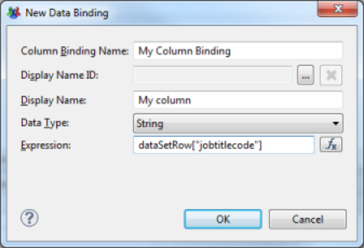 
**_Data editor_**  

An alternative is to place the cursor on the parent List or Table component and create this new column with the 'Binding' tab in the properties editor.

 
**_Data editor in the Binding tab of the parent Table or List_**

### Image

The image component allows you to display an image in the report. Images can be referenced in several ways:

- **URI** : Complete URL path to the image. The URL may be static, or dynamically calculated with a JavaScript expression
- **Image file in shared resources** : Image located in the audit project directory. Many images are available in the /reports/icons/ subdirectory of your audit project
- **Embedded image** : Image embedded in the report or the report template. Reports generated with the wizard's help include the standard icons of the product. We advise you to use this option by default and select an icon corresponding to the concept being used whenever possible
- **Dynamic Image** : Image located in a binary data block in the database. In this case, you must select an accessible Dataset and the column containing the image

 
**_Selecting an embedded image in the report template_**

### Grid

The Grid component is a graphical layout component. The Grid component allows you to create tables. Many layout options are available, and tables can also be nested. We suggest that you use this component to product the section layout of your reports.

 
**_Creating a table_**

### List

The List component is a data container. This component has no default rendering interface; it allows you to reference a Dataset and contains data display components (Data, Text, ...).
 The List component is composed of 3 areas:

- **Header** : The components in this area are displayed once as headers, no matter how many elements are in the list
- **Detail** : The components in this area are displayed as many times as there are lines in the Dataset referenced by the List component. The components are displayed one after the other
- **Footer** : The components in this zone are displayed one time at the end of the list, no matter how many elements are in the list

In order to use a List component, you must first associate a Dataset with it. Then you simply place graphic components in the areas (header, detail, footer). You associate a Dataset with a List component with the 'Binding' tab in the component properties editor. Selecting a Dataset in the 'Data Set' selection list automatically associates the Dataset component columns to the List ('Binding' operation). These columns are available in the lower part of the 'Binding' tab. Note that it is possible to add new calculated columns here. The scope of these calculated columns will then be limited to the components present in the List component areas.
 To take a Dataset column into consideration in the list, simply drag/drop the corresponding column of the Dataset in one of the three areas of the list. To do this, expand your Dataset at the 'Data Explorer' view and drag/drop the corresponding column in the list. Note that the Header and Footer areas will only retrieve columns corresponding to aggregate data (# of elements, sum, ...).

 
**_Configuring the Dataset associated with a List component_**

It is also possible to enter the parameters of the Dataset if it accepts parameters. To edit parameters, click on the 'Data Set Parameter Binding ...' button. Parameter values can be static or dynamically calculated using a JavaScript expression. Parameter values will be dynamically passed to the Audits Views on which the List component relies upon report generation.  

 
**_Configuring the Dataset settings associated with a List component_**

### Table

The Table component is a data container. Unlike the List component, which has no rendering interface by default, the Table component displays the results in table format. Many layout options are available (styles, merging cells, ...). It is also possible to create groups of values within the table.  

 
**_Creating a table_**  

The Table component is made up of 3 areas:

- **Header row** : The components in this area are displayed once as headers, no matter how many elements are in the list
- **Detail row** : The components in this area are displayed as many times as there are lines in the Dataset referenced by the List component. The components are displayed one after the other
- **Footer row** : The components in this zone are displayed one time at the end of the list, no matter how many elements are in the list

In order to use a Table component, you must first associate a Dataset with it, and then simply place graphics components in the areas (header, detail, footer). You may associate a Dataset with a Table component with the 'Binding' tab in the component properties editor. Selecting a Dataset in the 'Data Set' selection list automatically associates the Dataset columns with the Table component ('Binding' operation). These columns are then available in the lower part of the 'Binding' tab. Note that it is possible to add new calculated columns here. The scope of these calculated columns will then be limited to components present in the Table component areas.
 To take a Dataset column into consideration in the list, simply drag/drop the corresponding column of the Dataset in one of the three areas of the table. To do this, expand your Dataset at the 'Data Explorer' view and drag/drop the corresponding column into the list. Note that the Header and Footer areas will only retrieve columns corresponding to groups of data or aggregates of data (# of elements, sum, ...). If no data is present in the Header column, dragging/dropping a column from the Dataset into the Detail area of the table will automatically add the name of the corresponding column in the table header.

 
**_Configuring settings of the Dataset associated with a Table component_**

### Chart

The Chart component allows you to display data graphically. The configuration of this component is very rich and is the subject of a dedicated chapter of the documentation.

 
**_Creating a chart_**

### Cross Tab

The Cross Tab component allows you to create a data cube and to display its data as a pivot table. The representation of information in the form of pivot tables facilitates the detection of anomalies.
 The configuration of this component is very rich and is the subject of a dedicated chapter of the documentation.

 
**_Creating a data cube_**

### DotBar

The DotBar component allows you to create visual indicators on the basis of data contained in your Datasets. This component accepts JavaScript scripts, which may be edited in the 'expression' area of the editor. The script must return an integer value between 0 and the maximum value, set in the 'Designer Display Value'. When the report is generated, the number of items that match the expression will appear. The items' graphics are set in the 'Dot' part of the editor.
 The full documentation for this component can be found on the website [http://code.google.com/a/eclipselabs.org/p/birt-controls-lib/](http://code.google.com/a/eclipselabs.org/p/birt-controls-lib/)  

 
**_Representation of a series of indicators_**  

 
**_Creating an indicator_**

### Rotated Text

This component allows you to display a static or dynamic text whose angle of orientation can be selected. This feature is especially useful when creating pivot tables; it allows you to optimize the display space of the table's columns.
 The text to be displayed is a JavaScript expression, configured in the 'Expression' field of the properties editor. The angle of rotation is located in the 'Angle' property. The angle of rotation must be indicated in degrees. It is also possible to associate a hyperlink to the text using a JavaScript expression which is configurable in the 'Link URL' field.
 The full documentation for this component can be found on the website [http://code.google.com/a/eclipselabs.org/p/birt-controls-lib/](http://code.google.com/a/eclipselabs.org/p/birt-controls-lib/)  

 
**_Creating rotated text_**

## Formatting

This chapter introduces the main principles of report formatting in the report editor.

### Arrange Components

As you saw in the previous chapter, among the many available graphical components, only one is specifically related to the report components layout: this is the Grid component. The report layout follows the same principle as the layout of simple HTML pages: nesting tables in which formatting criteria have been applied to the cells. An alternative, of course, is to use the Table and List components when the areas in question must display the data. It is also possible to work from tables on which formatting options have been applied, and then insert tables in some cells to refine the layout.
 The Table and Grid components have many contextual options when you select a column, row, or a set of cells: Grouping/ungrouping cells, adding rows/columns, ...  

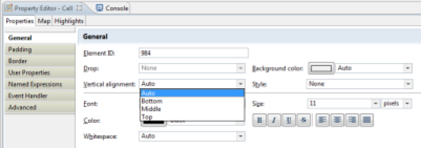 
**_Formatting properties of a Grid cell_**

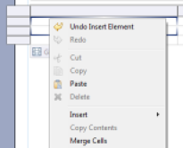 
**_Merging cells in a table_**

It is possible to insert new rows on each area of the List and Table components (header, detail, footer). This simplifies element formatting. Note that the styles are automatically applied to the area.

### Layout of Text Components

The text components (Label, Text, Dynamic Text, Label) have properties for their layout. These properties are present in the following tabs:

- **General** : General text layout
- **Padding** : Configuration of component's padding (margin inside the border)
- **Border** : Configuration of the component's borders
- **Margin** : Configuration of the component's margin (margin outside the border)

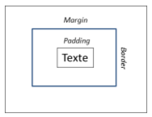 
**_Padding, Margin, Border_**

The general layout settings allow you to choose the font, its size, its attributes, its indentation, ... It is also possible to configure the component placement when several components are positioned adjacent to one another; the layout rules follow the principles of the CSS 'Display' attribute. It can take three values:

- **Block** : The components are placed one beneath the other no matter what their respective dimensions are
- **Inline** : The components are placed adjacent to one another, with a line break if the different elements' dimensions make it necessary
- **No Display** : The component is not displayed

It is also possible to apply a CSS style to a component in order to apply the style layout automatically.

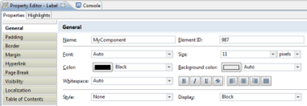 
**_Text formatting_**

### Manag Visibility of Report areas

It is possible to dynamically manage the visibility of report areas. This operation is performed when the report is generated. The visibility of the report area may depend on the output format (html, pdf, ...), and may be static or dynamic. If visibility is dynamically determined, a JavaScript script can determine if the area will be visible or not. This script can be based on the Datasets available in the relevant area.
 The management of visibility of a report area is performed by selecting the relevant area (component, a component element (line of a Grid, ...)) and selecting the "Visibility" tab of the component's properties editor. It is then possible to define either globally or by output format whether the area will be visible or not.

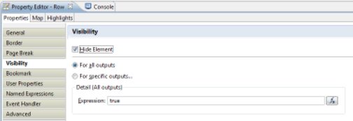 
**_Management of report area's visibility_**  

It is possible to determine whether the area will be visible or not using a JavaScript script. The script must return a Boolean value: true if the area should be hidden, false if the area should be visible. The script can rely on the Datasets available to the selected area to determine its status.

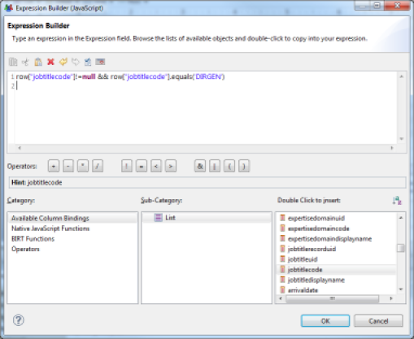 
**_Management of visibility with a Javascript script_**

### Manage Pagination

To improve the usability of the report, it is possible to paginate it by inserting line breaks at key locations. A report laid out in this fashion will be formatted as multiple pages in a 'paper' format (PDF, Word, ...) It will also be several pages in the report web viewing interface. The navigation toolbar on the report pages will then be used to browse through the pages of the report.
You may add pagination in any graphical component using the 'Page Break' tab of the properties editor.

 
**_Managing pagination_**

### Associate Labels with Column Values

In some cases, it may be useful to dynamically substitute values from your Datasets for labels to facilitate understanding of the information displayed. This is the case of Boolean attributes, for example.
Let's look at the example of the 'Internal' attribute of the identities ledger. The 'raw' display of the value of this attribute will display the values 'true' and 'false' in your report. It makes more sense to replace these values by 'internal' and 'provider'. To do this, place the column in your report (for example, in a Table), then select the 'Map' section in the properties editor. You may then define the conditions leading to the substitution of values of the column.  

 
**_General configuration of value substitution_**

Setting up a substitution of values makes a dialog box appear, which allows you to define the conditions of substitution. Many comparison operators are available. The test value may be either static or dynamic via a JavaScript script taking advantage of the Datasets available to the relevant component. Possible conditions are:

- **Between** : The value must be between two terminals
- **Bottom n** : The value must be part of the lower n values
- **Bottom Percent** : The value must be part of the n lower n percentage values
- **Equal to** : The value must be equal to
- **Greater than** : The value must be greater than
- **Greater than or Equal** : The value must be greater than or equal to
- **In** : The value must be inside a set of values
- **Is False** : The Boolean value must be NO
- **Is Not Null** : The value may not be NULL
- **Is Null** : The value must be NULL
- **Is True** : The Boolean value must be **YES**
- **Less than** : The value must be less than
- **Less than or Equal** : The value must be less than or equal to
- **Like** : The value of a string looks like (syntax similar to SQL LIKE syntax, wildcards are % and \_)
- **Match** : The value of a string must correspond to a regular expression
- **Not Between** : The value must not be between two terminals
- **Not Equal to** : The value must not be equal to
- **Not In** : The value must not be part of a set of values
- **Not Like** : The value of a string does not look like (syntax similar to SQL LIKE syntax, wildcards are % and \_)
- **Not Match** : The value of a string must not correspond to a regular expression
- **Top n** : The value must be part of upper n values
- **Top Percent** : The value must be part of upper n percentages

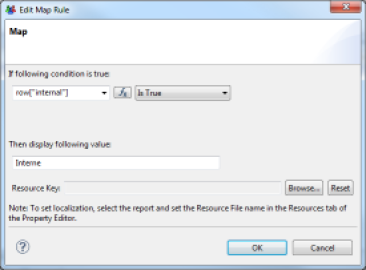 
**_Configuring value substitution_**

Substitution is not limited to the value, it is also possible to apply a conditional layout to the component (for example, force a red background for values that show differences). Substituted values may be localized via the resource editor.

> [!warning] All the conditions are systematically tested. The last condition that has a result is the one that will apply. So if your conditions relate to sets that are not disjointed, be careful to sort them from least restrictive to most restrictive.  

 
**_Example of substitution of values of the 'Internal' attribute_**

### Conditional Formatting of Components

It is possible to apply conditional formatting to the components, to highlight differences in the set of values, for example. To apply conditional formatting, select the relevant component or component area (detail row of the table, for example), and select the 'Highlights' section in the properties editor.
 Conditional formatting settings are very similar to the settings for associating labels with columns.

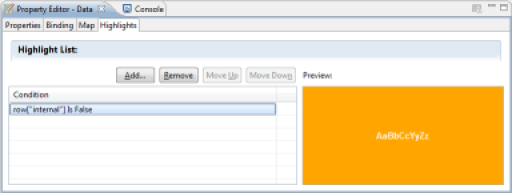 
**_General settings of conditional layout_**

Setting up conditional formatting makes a dialog box appear, allowing you to define the conditions of the formatting. Many comparison operators are available. The test value may be static or dynamic via a JavaScript script taking advantage of the Datasets available to the relevant component. The possible conditions are:

- **Between** : The value must be between two limits
- **Bottom n** : The value must be part of the n lower values
- **Bottom Percent** : The value must be part of the n lower percentages
- **Equal to** : The value must be equal to
- **Greater than** : The value must be greater than
- **Greater than or Equal** : The value must be greater than or equal to
- **In** : The value must be contained within a set of values
- **Is False** : The Boolean value must be NO
- **Is Not Null** : The value must not be NULL
- **Is Null** : The value must be NULL
- **Is True** : The Boolean value must be YES
- **Less than** : The value must be less than
- **Less than or Equal** : The value must be less than or equal to
- **Like** : The value of a string looks like (similar syntax to the SQL LIKE syntax, wildcards are % and \_)
- **Match** : The value of a string must correspond to a regular expression
- **Not Between** : The value must not be between two limits
- **Not Equal to** : The value must not be equal to
- **Not In** : The value must not be found within a set of values
- **Not Like** : The value of a string does not looks like (similar syntax to SQL LIKE syntax, wildcards are % and \_)
- **Not Match** : The value of a strong must not correspond to a regular expression
- **Top n** : The value must be part of the n higher values
- **Top Percent** : The value must be part of the n higher percentages

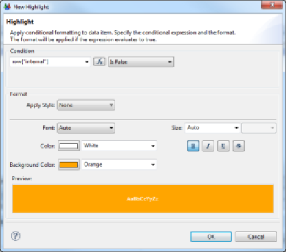 
**_Configuring conditional formatting_**  

> [!warning] All of the conditions are systematically tested. The last condition that has a result will apply. So if your conditions are for sets that are not disjointed, be sure to sort them from least restrictive to most restrictive.

 
**_Example of conditional formatting_**

### Table of Contents

To facilitate navigation in the report it is possible to automatically generate a table of contents. This table of contents is available from the Web Report Viewer as well as in PDF output format. You may place a new item in the table of contents using the 'Table Of Contents' tab of the properties editor. Simply select the component which will result in the generation of a new entry in the table of contents.

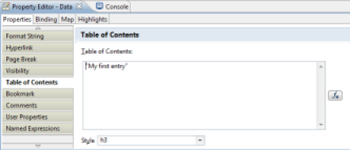 
**_Configuring an entry in the table of contents_**  

The value may be static or dynamic. In the case of a dynamic value, a JavaScript expression allows you to determine the label to be inserted in the table of contents. The script may be based on the values of Datasets available to the selected component.

It is also possible to select the CSS style to apply to the table of contents entry. This style will be used by the reports Web viewer when it displays the table of contents.
The table of contents is accessible from the Web viewer by clicking on the first button in the toolbar.

 
**_Web Viewer_**

### Stylesheets

It is possible to use CSS stylesheets in order to standardize the presentation of data in the various reports. Brainwave Identity GRC includes a stylesheet for this purpose. This stylesheet is available at the following location in your project: 'reports/style/default/brainwave - blue.css'. This stylesheet is referenced by the report libraries and is applied automatically when you create a new report via the wizard.
 We invite you to refer to the 'Formatting Report Content' chapter of the reference documentation, 'BIRT Report Developer Guide' in Brainwave Analytics if you want more information about the use of CSS in reports.

## Sorting and Grouping in Tables

### Sort Data

The List and Table components can automatically sort their data during their layout. This operation is performed by selecting the 'Sorting' section of the relevant List or Table component properties editor.

 
**_Sorting data_**

Sorting may be done on several successive criteria (last name, then first name, then job, ...). Adding a new sorting criterion makes a dialog box appear, allowing you to select the column or combination of columns to use in the sort. Note: Clicking on the 'Fx' button makes the JavaScript editor appear, allowing you to combine several columns for the data sort.

> [!warning] Sort operations configured in the report editor in the List and Table components are performed locally when the report is generated. We suggest that you focus on setting the sort in the Audit View rather than in the report editor whenever possible. Setting the sort data in the Audit View performs the sort in the database and therefore strongly increases system performance.|

 
**_Sorting data_**

### Group Data in Tables

Tables offer many options for layout. One of the most useful is the ability to create groups of data. Grouping data makes reading and using data easier by organizing them into sections. It is possible to define an infinite number of groupings, and to make sub-groups of data.
You can configure data grouping settings by selecting the detail line of the table in which you want to group data. Then you select the 'Insert Group' contextual menu. An editor opens, allowing you to set the grouping key as well as various options for layout, filtering and sorting data.

 
**_Settings for grouping data in a table_**

After the group settings are created, the table display changes with the appearance of a new line for the detail of the grouped data, and a new line for the footer of the grouped data. Simply drag/drop the columns from the Dataset corresponding to the 'Data Explorer' view in the table cells to display the data.

> [!note] It is possible to associate table of contents entries with groups of data. These table of contents entries appear with an indentation in tree form when the report is generated in HTML or PDF format.

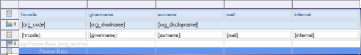 
**_Table with grouped data_**

 
**_Example of table with grouped data_**

## Data Aggregation and Analysis

Many aggregate and analysis functions are present in the report editor, allowing you to construct analyses on the Identity Ledger database.
 The aggregation and analysis of data means creating a new calculated column, either directly in the Dataset or at the 'Binding' level of a List or table component. We invite you to consult the Setting up additional columns in the Datasets chapter of the documentation for more information about configuring calculated columns in the Dataset.
 An aggregation calculation is done by dragging/dropping the 'Aggregation' component from the Component Palette to a sub-area of a List or Table component in the report editor. A wizard opens, allowing you to configure your new calculated column. The calculated column will be automatically created in the 'Binding' of the immediate parent List or Table component of aggregation  

 
**_Data aggregation and analysis component_**

The wizard allows you to define the conditions for calculating your aggregate data. Available aggregate functions are:

- **count** : count the number of elements
- **sum:**  sum of the elements
- **max:**  maximum of the elements
- **min:**  minimum of the elements
- **ave:**  average of the elements
- **weightedave:**  weighted average of the elements
- **movingave:**  moving average of the elements
- **median:**  median of the elements
- **mode:**  value that appears the most often
- **stddev:**  standard deviation
- **variance:**  variance
- **first:**  first value of the sequence
- **last:**  last value of the sequence
- **runningsum:**  running sum of the elements
- **irr:**  financial function ([Internal Rate of Return](http://en.wikipedia.org/wiki/Internal_rate_of_return) of a series of periodic Cash Flow)
- **mirr:**  financial function [(Modified Internal Rate of Return](http://en.wikipedia.org/wiki/Modified_internal_rate_of_return) of a series of periodic Cash Flow)
- **npv:**  financial function ([Net Present Value](http://en.wikipedia.org/wiki/Net_present_value) of a varying series of periodic cash)
- **runningnpv:**  financial function (Running [Net Present Value](http://en.wikipedia.org/wiki/Net_present_value) of a varying series of periodic cash)
- **countdistinct:**  count the number of unique elements
- **rank:**  element rank
- **is-top-n:**  Boolean expression indicating whether a value is one of the higher n values
- **is-top-n-percent:**  Boolean expression indicating whether a value is in the higher n percentage
- **is-bottom-n:**  Boolean expression indicating whether a value is one of the lower n values
- **is-bottom-n-percent:**  Boolean expression indicating whether a value is in the lower n percentage
- **percentrank:**  value's rank as a percentage of the file
- **percentile:**  Centile of the sequence of elements
- **quartile:**  Quartile of the sequence of elements
- **percentsum:**  Percentage of a total
- **runningcount:**  Number of elements fitting a condition
- **concatenate:**  concatenation of element values

The value to use for aggregation may be static or dynamic. If the value is dynamic, it can be determined with a JavaScript expression, taking advantage of Datasets available to this component.
It is also possible to take advantage of groups/sub-groups of data in the tables in order to perform partial calculations (for example, the number of people present by organization within the company).

 
**_Data aggregation settings_**  

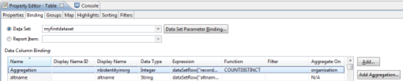 
**_Aggregation settings at the Binding level of the Table component_**

## Filtering Data

It is possible to configure the filtering of data at different places in your report in order to restrict the display to only the useful data of your dataset. The ability to filter data is available at the following locations:

- **Audit View** : By creating parameters in the Audit View, and by using these parameters as filtering conditions when you create the Audit View.
- **Dataset** : By configuring the filter directly in the Dataset
- **Components** : By configuring the filter in the List and Table component, or at the data grouping level in Tables

For details about configuring data filtering at the dataset level, please refer to the Dynamic filtering results chapter of the documentation.
 Finally, note that there is an alternative to filtering at the component level: The use of the management visibility areas of the report functionality.
 To configure filtering in the Component, select the 'Filters' section of the Table or List component properties editor. It is then possible to dynamically filter the results returned by the component's Dataset by setting a series of conditions on the values of the columns. If multiple conditions are set, then all of the conditions must apply for the current row of the Dataset to not be filtered.
Possible conditions are:

- **Between** : The value must be between two terminals
- **Bottom n** : The value must be part of the lower n values
- **Bottom Percent** : The value must be part of the n lower n percentage values
- **Equal to** : The value must be equal to
- **Greater than** : The value must be greater than
- **Greater than or Equal** : The value must be greater than or equal to
- **In** : The value must be inside a set of values
- **Is False** : The Boolean value must be NO
- **Is Not Null** : The value may not be NULL
- **Is Null** : The value must be NULL
- **Is True** : The Boolean value must be **YES**
- **Less than** : The value must be less than
- **Less than or Equal** : The value must be less than or equal to
- **Like** : The value of a string looks like (syntax similar to SQL LIKE syntax, wildcards are % and \_)
- **Match** : The value of a string must correspond to a regular expression
- **Not Between** : The value must not be between two terminals
- **Not Equal to** : The value must not be equal to
- **Not In** : The value must not be part of a set of values
- **Not Like** : The value of a string does not look like (syntax similar to SQL LIKE syntax, wildcards are % and \_)
- **Not Match** : The value of a string must not correspond to a regular expression
- **Top n** : The value must be part of upper n values
- **Top Percent** : The value must be part of upper n percentages

The value to be tested may be static or dynamic. If it is dynamic, the value to be tested may take the form of a JavaScript script.
Filtering can be based on any column, including calculated columns

> [!note] The filtering is performed locally when the report is generated, following the execution of the Audit View query. It is recommended that you use the Audit View settings whenever possible, as this processes the filtering at the database server level and thus optimizes the processing time significantly.

 
**_Configuring filters in a Table component_**

## Report Parameters

Reports can accept parameters and thus dynamically adapt the content presented based on external information, which can be transmitted by other HTML pages (when browsing, for example), or entered by the user via a dedicated interface.
The report parameters are basically dynamic views (particularly searches) and are essential to navigation between reports.
From the point of view of the report, report parameters are Components that may be dragged/dropped in the editing area of the report. It is also possible to use these parameters in various dialog boxes, as well as in the scripting language, using the directive:
params["_PARAMETER NAME_"].value  
It is also possible to directly assign report parameters to Dataset parameters in order to restrict the information returned by external information functions or parameters entered by the user.

 
**_Using report settings in a Dataset setting_**  

You can create a report parameter by right-clicking on the 'Report Parameters' entry in the 'Data Explorer' View, and then selecting 'New Parameter'.

 
**_Creating a report parameter_**  

Clicking on 'New Parameter' opens the parameter creation wizard. A parameter is defined by a name, a label, a data type, a way to edit its value, and attributes (visible to the user, required, ...). Several methods of editing values are available:

- Text Box
- Combo Box
- List Box
- Radio Button

A parameter may receive a default value, which may be static or dynamic. In the case of a dynamic value, it must reference a Dataset allowing the editor to display a choice of values to the user.

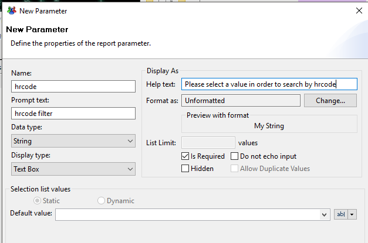 
**_Creating a report parameter_**  

> [!note] The values of report parameters are evaluated during the initial phase of report generation, even before loading the report template. So unlike other editing areas of the report, it is not possible to directly exploit the reports' concepts here. It is only possible to refer to a Dataset when you want to suggest dynamic values in the editing box of the parameter values.

Users may edit report settings through the web viewer if the parameters do not have the 'Hidden' attribute set. A web dialog box opens when the report is opened in order to allow the user to enter values for the required parameters. Note that this box only opens if no value was automatically passed for the required parameters when the report was opened.

 
**_Example of web interface generated by the web viewer_**  

It is possible to modify the parameter values available in the report at any time using the 'Report Settings' button in the report viewer's toolbar. Updating report parameters causes the report to be regenerated.

 
**_Web Viewer_**

## Navigating Between Reports

It is possible to place hyperlinks on some components in order to add interactivity in reports. The components which allow you to add links are:

- Label
- Data
- Image
- Chart Elements

You can insert a hyperlink by selecting the 'Hyperlink' tab in the properties editor of the selected component, then click the 'Edit ...' button. A wizard opens to help you set up your hyperlink.
There are different types of hyperlinks in the report editor:

- **URI** : Creation of an external link
- **Internal Bookmark** : Creation of a link to another part of the report
- **Drill-through** : Creation of a link to another report

### External Link

An external hyperlink allows you to reference an arbitrary external website. Several options are available to either replace the current window or open a new window when clicking on the hyperlink. The hyperlink can be either static or dynamically defined using a JavaScript expression. In the second case, the JavaScript may rely on the values of Datasets available to the component.

 
**_Inserting an external link_**

### Hyperlink to Another Part of the Report

It is possible to define internal hyperlinks in your reports, for example, to make a table of contents at the beginning of a lengthy report and facilitate the navigation between parts of the report by simply clicking on the text of your table of contents.
To do this, you must define 'Bookmarks' in your report. Define bookmarks by selecting Components of the report and using the 'Bookmarks' tab of the component's properties editor.
Then you create an internal hyperlink by selecting the bookmark to which the user should be redirected.
Bookmarks may be static or dynamic. If they are dynamic, bookmarks may be generated by Javascript, and the script may be based on data from the Datasets available to the component.

 
**_Configuring a hyperlink to another part of the report_**

### Hyperlink to Another Report

Setting up a hyperlink to another report of the project is by far the richest and most interesting feature. It allows automatic navigation between the different reports that make up the web portal of Brainwave Identity GRC, thus making a complete and detailed rights management application available to portal users.
It is quite possible to configure your particular reports so that they redirect the user to the portal reports, for example, to access detailed views of objects in the model (detail of an identity, ...). Please refer to the "Reports provided as standard" chapter in order to access to the list of standard reports provided in the portal and the parameters required per report.
To set up a hyperlink to another report in the project, perform the following steps in the configuration dialog box:

1. **Select the report to which the user should be redirected.**  The project's reports are available in the sub-tree /reports
2. **Use**  **report parameters**  Depending on the report selected, some parameters may be required. Click on the 'Add...' button in order to use these parameters. The value of a parameter may be static or dynamic. If the value is dynamic, it may use Javascript. Dataset data available to the component are available via the Javascript directive _row['COLUMN\_NAME']_
3. **Select a bookmark or table of contents entry if necessary in the target report**  This allows a section of the target report to be displayed directly, if the report is lengthy. See the Table of Contents and Configuring a hyperlink to another part of the report sections for more information about setting internal links in reports.
4. **Select a display window for the report**  This window may be the current window, a part of the current window, or a new window. When integrating your report with the Identity GRC web portal, you need to choose Same Frame
5. **Configure the output format**  You can force the output format of your report to a different one than the current format, for example, automatically generate PDFs, Word files, ... **Configure the tooltip**  This text will be displayed when the cursor of the mouse hovers over the hyperlink

 
**_Configuring a hyperlink to another report_**
