# General Concepts

The Brainwave Identity GRC report editor relies on the Open Source BIRT solution maintained by the Eclipse community. Many books about this solution are available; we invite you to refer to the first chapter of this guide for a list of these books.    
Brainwave Identity GRC brings many improvements to the standard version of BIRT, particularly in how reports are configured to access the data. If you are already familiar with the BIRT reporting solution, we suggest you read at least the chapter 'Datasets' to get an overview of the unique features of the solution.
The reporting engine is a solution which allows you to dynamically generate reports based on data stored in repositories (files, SQL, ...). Reports may be generated in multiple formats. Reports are generated dynamically upon the user's request; as a result, reports can be dynamic and their content can depend on the context of use (e.g., to restrict the data displayed to a subset depending on the role of the user who generates the report). Reports may contain hyperlinks so that you can navigate between reports and thus create Web applications.
Reports are generated on the basis of report templates. These models are XML files with the .rptdesign suffix. There are numerous ready-to-use reports in the 'reports' subdirectory of your audit project. The reports are separated there in subdirectories according to their primary use (browsing, analysis, monitoring, rules' outcomes, ...). Report templates files (.rptdesign) are editable with a dedicated graphical editor in Brainwave Identity GRC. To use all the features of the editor, we recommend that you switch to the 'iGRC Reports' perspective when you publish a report.
When generating a report, the sequence of operation is always the same:   

1. Load the report template
2. Retrieve the report settings if necessary
3. Run the different queries in order to retrieve the data to lay out in the report
4. Layout and display the report in the desired format   

The runtime phase of the various queries to retrieve data to be listed in the report results in a temporary .rptdocument file; this file is then used by the renderer during the generation phase. This allows you to generate multiple reports based on the same data (for example, for a paginated display in HTML format).    
A report must use configured datasets to retrieve the data to list out. This concept is called 'Data Set' in the report editor. The 'Data Sets' are configured in the 'Data Explorer' view in the report editor. A parameterized query in the data set corresponds to each 'Data Set', and results in a list of results (like a CSV table or an SQL SELECT query, for example). The 'Data Set' may receive parameters, so the 'Data Set' may be dynamic, or even nested.    
   

The display of data in a report amounts to positioning a chart component (table, graph, …) in the report and configuring the way this component uses data from a 'Data Set' of the report. Many components exist in the reporting engine, allowing you to display the data in various formats, to perform various analyses on the data (statistics, pivot tables, ...), to use the data in a chart format, ...     
The creation of a report always follows the following steps:    

1. Functional analysis of data to be returned. It is imperative to ask yourself the following questions before starting to create the report:
- What is the purpose of my report
- Who will use it
- What data are necessary to allow the users of this report to conduct the appropriate actions
2. Creation of a new report in the reports/custom subdirectory by selecting a report template using the reports wizard
3. Creation of report parameters if necessary
4. Creation and configuration of the 'Data Sets' allowing data retrieval from the general identities ledger
5. First pass of the report layout by adding the main graphical components (lists, tables, charts, PivotTables)
6. Association of chart components: Table, List, Chart, and PivotTable with the corresponding 'Data Sets' to display the data
7. Second pass of the report layout, performing label layout, grouping, sorting, data aggregation operations...
8. Creation of hyperlinks if necessary to allow contextual navigation from this report
9.  Localization of labels if necessary
10. Report testing, and addition of the report to the web portal if necessary    

The following chapters will allow you to discover, step by step, how to configure the data sets and the different graphical components available in the report editor. We also invite you to refer to the guide, BIRT Report Developer Guide' in the Brainwave Identity GRC for more details about using the report editor.

## Datasets

Datasets (Data Sets) allow us to query the Identity Ledger in order to extract data for reporting purposes. The BIRT solution natively provides many ways to extract data: From SQL databases, CSV files, XML files, to BigTable Cloud computing-type systems (Hadoop, ...). Brainwave Identity GRC extends the native features of the BIRT solution by adding a new means to access the Ledger data: The Audit Views (subdirectory 'views' in your audit project). The audit views allow us to extract information from the Identity Ledger without prior knowledge of a technical language like SQL, and without technical knowledge of the Identity Ledger data model. It is thus possible to simply configure Ledger data retrievals queries for reporting or analysis purposes. Over 80 audit views are provided as standard in the product, allowing you to take advantage of the information stored in the Identity Ledger from the very beginning of your audit project.    
We invite you to refer to the 'Audit Views Editor Guide' for more information on setting up audit views in the Brainwave Identity GRC product.

### Create a Dataset

The creation of a new Dataset in the current report is performed by placing the cursor on the 'Data Explorer' view and right-clicking on the 'Data Sets' entry, then on 'New Data Set'.  

   
**_Creating a dataset_**

A wizard opens, and it lets you choose the name of your Dataset, the next panel lets you select the Audit View on which the Dataset will rely in order to dynamically retrieve data in the identities ledger. Select an audit view by clicking the 'folder' button; this will display the sub-tree of the corresponding in the 'views' subdirectory of your audit project. Each audit view is presented with a description of the operations it performs. Do not hesitate to open the corresponding audit view in your audit project if you have any doubt about the operations performed by an audit view.

   
**_Selecting an audit view_**

When the audit view is selected, the Dataset editor opens. It allows you to perform the following operations:   

- Selecting the Dataset's Audit View
- Previewing the output columns (Audit View columns) and their type. Modification of their name, their aliases, ...
- Configuring additional columns whose values are calculated dynamically
- Providing specific parameters for the audit view to be used
- Dynamic filtering of the audit view results
- Set the number of result rows to retrieve from the Audit View (This parameter is dynamically passed to the audit view, it is therefore involved in optimizing the queries' performance)
- Preview the results of the Dataset    

Once the Dataset has been created, it is present in the 'Data Sets' tree of the 'Data Explorer' view. Opening the section related to the Dataset makes the various columns that make up the Dataset appear. Simply drag/drop items from this dataset into the report elements (list, table) to display the data.

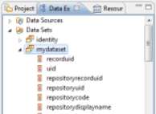   
**_Previewing a Dataset in the tree_**

### Configure a Dataset

To configure a Dataset, double-click the corresponding Dataset in the 'Data Explorer' view of the editor. A dialog box opens, allowing you to edit the basic properties of your Dataset and test your Dataset.

#### Select the Audit View of the Dataset

Allows you to select the Brainwave Identity GRC Audit View to be used by this Dataset. The Audit View formalizes the way in which the Identity Ledger will be queried in order to make data available to the Dataset. The Audit View concept allows us to completely free ourselves from the notion of SQL language during the design phase of specific reports, allowing us, on one hand, to greatly increase productivity during the report creation or modification phase, and on the other hand, to free ourselves from detailed knowledge of the underlying data model, in particular regarding security constraints, time management, ... Many Audit Views are present by default in your project in the 'views' subdirectory. We also invite you to consult the 'Audit Views Editor Guide' for more information about creating and configuring an audit view.  

   
**_Selecting the Dataset's Audit View_**  

#### Preview Output Columns

Once the audit view has been selected, it is possible to confirm the output columns returned by the audit view in the Dataset. It is also possible to rename some columns in the Dataset if their titles do not suit you. However, we encourage you to perform naming operations at the source when creating your audit views.  

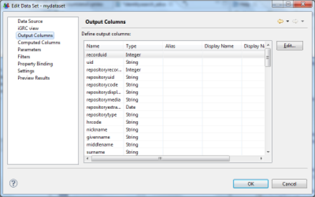   
**_Previewing output columns_**

#### Configure Additional Columns

The Dataset editor allows you to configure the dynamic creation of additional data when the data are extracted. These data are then presented in the form of standard columns in the report editor.   
Creating dynamic columns meets two needs:   

- Formatting data for display, for example, the concatenation or canonization of information from multiple columns in order to create a new column
- The calculation of aggregate data. Indeed, it is possible to not limit the calculation of data sources to the current row of the Dataset, but to use the entire dataset through aggregation mechanisms. This is useful, for example , for calculating the number of elements having certain characteristics, averages, medians, percentiles, ... the available aggregation functions are:
  - **count** : count the number of elements
  - **sum** : sum of the elements
  - **max** : maximum of the elements
  - **min** : minimum of the elements
  - **ave** : average of the elements
  - **weightedave** : weighted average of the elements
  - **movingave** : moving average of the elements
  - **median** : median of the elements
  - **mode** : value that appears the most often
  - **stddev** : standard deviation
  - **variance** : variance
  - **first** : first value of the sequence
  - **last** : last value of the sequence
  - **runningsum** : running sum of the elements
  - **irr** : financial function ([Internal Rate of Return](http://en.wikipedia.org/wiki/Internal_rate_of_return) of a series of periodic Cash Flow)
  - **mirr** : financial function [(Modified Internal Rate of Return](http://en.wikipedia.org/wiki/Modified_internal_rate_of_return) of a series of periodic Cash Flow)
  - **npv** : financial function ([Net Present Value](http://en.wikipedia.org/wiki/Net_present_value) of a varying series of periodic cash)
  - **runningnpv** : financial function (Running [Net Present Value](http://en.wikipedia.org/wiki/Net_present_value) of a varying series of periodic cash)
  - **countdistinct** : count the number of unique elements
  - **rank** : element rank
  - **is-top-n** : Boolean expression indicating whether a value is one of the higher n values
  - **is-top-n-percent** : Boolean expression indicating whether a value is in the higher n percentage
  - **is-bottom-n** :: Boolean expression indicating whether a value is one of the lower n values
  - **is-bottom-n-percent** :: Boolean expression indicating whether a value is in the lower n percentage
  - **percentrank** : value's rank as a percentage of the file
  - **percentile** : Centile of the sequence of elements
  - **quartile** : Quartile of the sequence of elements
  - **percentsum** : Percentage of a total
  - **runningcount** : Number of elements fitting a condition
  - **concatenate** : concatenation of element values

   
**_Configuring additional columns_**

Creating dynamic column opens a specific editor. The syntax to be used in this editor is JavaScript syntax. A value from the current line of the dataset is recovered using the JavaScript function 'row["column name"]'.   
For example, to concatenate the first and last name in a new attribute, you must enter the following string:    
row["first\_name"].toLowerCase()+' '+row["last\_name"].toLowerCase()   
The basic part of the editor offers options for data auto-completion, particularly in the current dataset. Simply select the information and double-click on the right side of the list displayed to automatically add the corresponding script. In our example:   
'Available Data Sets' -\> 'MyDataSet' -\> 'first\_name'

   
**_Javascript editor_**

#### Provide Specific Parameters

Datasets are able to take settings dynamically from the report to customize the results; these parameters can be positioned either in the report or in the master views/detail (sub-reports). Using parameters allows you to produce specific reports such as research views or detailed reports (an identity's display ratio, for example).    
The parameters that can be positioned in a Dataset are located in the 'Parameters' tab. The list and the type of these parameters are directly inherited from the Audit View on which the Dataset relies.   
The parameters are typed and can be single-valued or multivalued. It is also possible to associate a report parameter directly with a Dataset parameter by double-clicking on a dataset parameter and selecting the report parameter.

| **Note**:    Brainwave Identity GRC extends the standard features of BIRT by integrating the management of multivalued parameters. To do this, it is imperative that you force the parameter type to 'String' when the parameter is multivalued.|

   
**_Providing specific parameters_**

#### Dynamic Filtering of Results

It is possible to dynamically filter the results returned by a Dataset by placing a series of conditions on the values of the columns. If multiple conditions are set, then all conditions must apply for the current row of Dataset to not be filtered.   
The possible conditions are:   

- **Between** : The value must be between two terminals
- **Bottom n** : The value must be part of the lower n values
- **Bottom Percent** : The value must be part of the n lower n percentage values
- **Equal to** : The value must be equal to
- **Greater than** : The value must be greater than
- **Greater than or Equal** : The value must be greater than or equal to
- **In** : The value must be inside a set of values
- **Is False** : The Boolean value must be NO
- **Is Not Null** : The value may not be NULL
- **Is Null** : The value must be NULL
- **Is True** : The Boolean value must be **YES**
- **Less than** : The value must be less than
- **Less than or Equal** : The value must be less than or equal to
- **Like** : The value of a string looks like (syntax similar to SQL LIKE syntax, wildcards are % and \_)
- **Match** : The value of a string must correspond to a regular expression
- **Not Between** : The value must not be between two terminals
- **Not Equal to** : The value must not be equal to
- **Not In** : The value must not be part of a set of values
- **Not Like** : The value of a string does not look like (syntax similar to SQL LIKE syntax, wildcards are % and \_)
- **Not Match** : The value of a string must not correspond to a regular expression
- **Top n** : The value must be part of upper n values
- **Top Percent** : The value must be part of upper n percentages

The value to be tested can be static or dynamic. In this second case, the value to be tested may take the form of a JavaScript script.   
Filtering can be based on any column, including calculated columns.

| **Note**:    The filtering is performed locally when the report is generated following the execution of the Audit View query. It is advisable to use Audit View settings whenever possible, which has the effect of moving the filtering to the database server level and hence optimizes the processing time significantly.|

   
**_Dynamic result filtering_**

#### Set the Number of Results Returned

It is possible to limit the number of results returned by the Dataset by setting a fixed value. This value is passed dynamically to the Audit View engine when the query is executed, and is transmitted to the database engine. The use of this parameter is recommended for optimum performance wherever possible.    
In general, it is advisable to avoid generating reports that are too large when this is unnecessary; a good practice is rather to make the report customizable in order to display only the relevant results.    
For example, choose an identity research report that limits the number of results to 500 and which is paired with many search parameters rather than an identity search report that returns 100,000 entries and is long to generate and unusable ...   

    
**_Setting the number of results to be returned_**

#### Preview Results

The last tab of the Dataset editor allows you to display a preview of the results of this Dataset. This feature is particularly useful for developing parameters to be passed, calculated columns and filtering features of your Dataset.      
The number of results returned is limited to 500.   

   
**_Previewing results_**

## Graphical Components

Many graphical components are available in the report editor palette. These allow you to display data from the Identity Ledger. These components are used by dragging/dropping them into the editing area of the report. The basic portion of the editor allows you to edit the properties of each element. This chapter explains each of the graphical components.   

   
**_Graphical components_**  

We can classify the available components into several categories:   
Layout:  

- Grid Component

Components associated with a Dataset (component having the ability to query the Identity Ledger to retrieve information):

- List
- Table

Representation and display of information:

- Label
- Text
- Dynamic Text
- Data
- DotBar
- RotatedText

Graphical representation of the data:

- Chart

Consolidated display of the information (OLAP data cube):

- Cross Tab

Among all the available components, three components may contain other components: Grid, List, and Table. These components are also called containers. The Grid component is mainly used for layout, the logic being for it to work with nested tables. Table and List components are Dataset recipients, which means that these components are associated with a Dataset (Binding), and therefore their subcomponents have access to the Dataset in order to display the data. It is possible to include these components recursively, for example: A Grid contains a Grid which contains a List which contains a Table which contains a Table, ... The child component has access to all of the Datasets contained in the List and Table components in which it is contained.   
Report layout always follows the same logic:

- Create the general report structure with the help of nested tables
- Place the components associated with the Datasets (Table, List)
- Place other components inside these components to allow the representation and display of information of the Datasets

### Label

Display static text in the report. The text is formatted and localized through its properties.   

   
**_Label component properties_**

### Text

Display formatted or dynamic text in the report. A dedicated editor allows you to edit the text field. The text can have several formats: plain text or HTML. In the second case, HTML tags should be used to format the text.   
If this component is located within a List or Table component, it is also possible to recover data from the underlying Dataset(s). This is done with the 'VALUE-OF' tag. If the value retrieved is itself in HTML, the 'format' attribute set to 'HTML' in the 'VALUE-OF' tag may take this formatting into account during report generation.   
For example, to type the content of a text field with the first and last name of an identity, you must set the field with the value:     
\<H3\>Hello \<B\>  
\<VALUE-OF\>row["first\_name"]\</VALUE-OF/>   
\<VALUE-OF\>row["last\_name"]\</VALUE-OF/>\</B\>,   
please review the following accounts\</H3\>  

   
**_Text editor_**

### Dynamic Text

The 'Dynamic Text' component allows you to format an arbitrary text using JavaScript. The script can rely on the data contained in the Datasets referenced by the Table and List components that incorporate this component.   
Selecting this component makes the JavaScript editor of the report editor appear. The lower part of the editor allows you to dynamically select the Datasets and the columns you wish to use in your JavaScript expression.   

   
**_Dynamic text editor_**

### Data

The Data component allows you to add an element in the 'Binding' settings of your List or Table component. This allows you to add new columns, whose result is automatically calculated by the Table or List, based on available Datasets. Unlike a layout made using the above components, here it is also possible to rely on data aggregation functions.   

   
**_Data editor_**  

An alternative is to place the cursor on the parent List or Table component and create this new column with the 'Binding' tab in the properties editor.

   
**_Data editor in the Binding tab of the parent Table or List_**

### Image

The image component allows you to display an image in the report. Images can be referenced in several ways:

- **URI** : Complete URL path to the image. The URL may be static, or dynamically calculated with a JavaScript expression
- **Image file in shared resources** : Image located in the audit project directory. Many images are available in the /reports/icons/ subdirectory of your audit project
- **Embedded image** : Image embedded in the report or the report template. Reports generated with the wizard's help include the standard icons of the product. We advise you to use this option by default and select an icon corresponding to the concept being used whenever possible
- **Dynamic Image** : Image located in a binary data block in the database. In this case, you must select an accessible Dataset and the column containing the image

   
**_Selecting an embedded image in the report template_**

### Grid

The Grid component is a graphical layout component. The Grid component allows you to create tables. Many layout options are available, and tables can also be nested. We suggest that you use this component to product the section layout of your reports.   

   
**_Creating a table_**

### List

The List component is a data container. This component has no default rendering interface; it allows you to reference a Dataset and contains data display components (Data, Text, ...).   
The List component is composed of 3 areas:

- **Header** : The components in this area are displayed once as headers, no matter how many elements are in the list
- **Detail** : The components in this area are displayed as many times as there are lines in the Dataset referenced by the List component. The components are displayed one after the other
- **Footer** : The components in this zone are displayed one time at the end of the list, no matter how many elements are in the list

In order to use a List component, you must first associate a Dataset with it. Then you simply place graphic components in the areas (header, detail, footer). You associate a Dataset with a List component with the 'Binding' tab in the component properties editor. Selecting a Dataset in the 'Data Set' selection list automatically associates the Dataset component columns to the List ('Binding' operation). These columns are available in the lower part of the 'Binding' tab. Note that it is possible to add new calculated columns here. The scope of these calculated columns will then be limited to the components present in the List component areas.   
To take a Dataset column into consideration in the list, simply drag/drop the corresponding column of the Dataset in one of the three areas of the list. To do this, expand your Dataset at the 'Data Explorer' view and drag/drop the corresponding column in the list. Note that the Header and Footer areas will only retrieve columns corresponding to aggregate data (# of elements, sum, ...).   

   
**_Configuring the Dataset associated with a List component_**

It is also possible to enter the parameters of the Dataset if it accepts parameters. To edit parameters, click on the 'Data Set Parameter Binding ...' button. Parameter values can be static or dynamically calculated using a JavaScript expression. Parameter values will be dynamically passed to the Audits Views on which the List component relies upon report generation.  

   
**_Configuring the Dataset settings associated with a List component_**

### Table

The Table component is a data container. Unlike the List component, which has no rendering interface by default, the Table component displays the results in table format. Many layout options are available (styles, merging cells, ...). It is also possible to create groups of values within the table.  

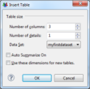   
**_Creating a table_**  

The Table component is made up of 3 areas:

- **Header row** : The components in this area are displayed once as headers, no matter how many elements are in the list
- **Detail row** : The components in this area are displayed as many times as there are lines in the Dataset referenced by the List component. The components are displayed one after the other
- **Footer row** : The components in this zone are displayed one time at the end of the list, no matter how many elements are in the list

In order to use a Table component, you must first associate a Dataset with it, and then simply place graphics components in the areas (header, detail, footer). You may associate a Dataset with a Table component with the 'Binding' tab in the component properties editor. Selecting a Dataset in the 'Data Set' selection list automatically associates the Dataset columns with the Table component ('Binding' operation). These columns are then available in the lower part of the 'Binding' tab. Note that it is possible to add new calculated columns here. The scope of these calculated columns will then be limited to components present in the Table component areas.   
To take a Dataset column into consideration in the list, simply drag/drop the corresponding column of the Dataset in one of the three areas of the table. To do this, expand your Dataset at the 'Data Explorer' view and drag/drop the corresponding column into the list. Note that the Header and Footer areas will only retrieve columns corresponding to groups of data or aggregates of data (# of elements, sum, ...). If no data is present in the Header column, dragging/dropping a column from the Dataset into the Detail area of the table will automatically add the name of the corresponding column in the table header.   

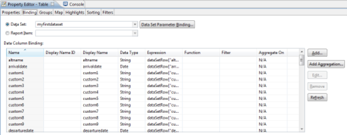   
**_Configuring settings of the Dataset associated with a Table component_**

### Chart

The Chart component allows you to display data graphically. The configuration of this component is very rich and is the subject of a dedicated chapter of the documentation.   

   
**_Creating a chart_**

### Cross Tab

The Cross Tab component allows you to create a data cube and to display its data as a pivot table. The representation of information in the form of pivot tables facilitates the detection of anomalies.   
The configuration of this component is very rich and is the subject of a dedicated chapter of the documentation.   

   
**_Creating a data cube_**

### DotBar

The DotBar component allows you to create visual indicators on the basis of data contained in your Datasets. This component accepts JavaScript scripts, which may be edited in the 'expression' area of the editor. The script must return an integer value between 0 and the maximum value, set in the 'Designer Display Value'. When the report is generated, the number of items that match the expression will appear. The items' graphics are set in the 'Dot' part of the editor.   
The full documentation for this component can be found on the website [http://code.google.com/a/eclipselabs.org/p/birt-controls-lib/](http://code.google.com/a/eclipselabs.org/p/birt-controls-lib/)  

   
**_Representation of a series of indicators_**  

   
**_Creating an indicator_**

### Rotated Text

This component allows you to display a static or dynamic text whose angle of orientation can be selected. This feature is especially useful when creating pivot tables; it allows you to optimize the display space of the table's columns.   
The text to be displayed is a JavaScript expression, configured in the 'Expression' field of the properties editor. The angle of rotation is located in the 'Angle' property. The angle of rotation must be indicated in degrees. It is also possible to associate a hyperlink to the text using a JavaScript expression which is configurable in the 'Link URL' field.   
The full documentation for this component can be found on the website [http://code.google.com/a/eclipselabs.org/p/birt-controls-lib/](http://code.google.com/a/eclipselabs.org/p/birt-controls-lib/)  

   
**_Creating rotated text_**

## Formatting

This chapter introduces the main principles of report formatting in the report editor.

### Arrange Components

As you saw in the previous chapter, among the many available graphical components, only one is specifically related to the report components layout: this is the Grid component. The report layout follows the same principle as the layout of simple HTML pages: nesting tables in which formatting criteria have been applied to the cells. An alternative, of course, is to use the Table and List components when the areas in question must display the data. It is also possible to work from tables on which formatting options have been applied, and then insert tables in some cells to refine the layout.   
The Table and Grid components have many contextual options when you select a column, row, or a set of cells: Grouping/ungrouping cells, adding rows/columns, ...  

     
**_Formatting properties of a Grid cell_**

   
**_Merging cells in a table_**

It is possible to insert new rows on each area of the List and Table components (header, detail, footer). This simplifies element formatting. Note that the styles are automatically applied to the area.

### Layout of Text Components

The text components (Label, Text, Dynamic Text, Label) have properties for their layout. These properties are present in the following tabs:

- **General** : General text layout
- **Padding** : Configuration of component's padding (margin inside the border)
- **Border** : Configuration of the component's borders
- **Margin** : Configuration of the component's margin (margin outside the border)

   
**_Padding, Margin, Border_**

The general layout settings allow you to choose the font, its size, its attributes, its indentation, ... It is also possible to configure the component placement when several components are positioned adjacent to one another; the layout rules follow the principles of the CSS 'Display' attribute. It can take three values:

- **Block** : The components are placed one beneath the other no matter what their respective dimensions are
- **Inline** : The components are placed adjacent to one another, with a line break if the different elements' dimensions make it necessary
- **No Display** : The component is not displayed

It is also possible to apply a CSS style to a component in order to apply the style layout automatically.   

   
**_Text formatting_**

### Manag Visibility of Report areas

It is possible to dynamically manage the visibility of report areas. This operation is performed when the report is generated. The visibility of the report area may depend on the output format (html, pdf, ...), and may be static or dynamic. If visibility is dynamically determined, a JavaScript script can determine if the area will be visible or not. This script can be based on the Datasets available in the relevant area.   
The management of visibility of a report area is performed by selecting the relevant area (component, a component element (line of a Grid, ...)) and selecting the "Visibility" tab of the component's properties editor. It is then possible to define either globally or by output format whether the area will be visible or not.   

    
**_Management of report area's visibility_**  

It is possible to determine whether the area will be visible or not using a JavaScript script. The script must return a Boolean value: true if the area should be hidden, false if the area should be visible. The script can rely on the Datasets available to the selected area to determine its status.

     
**_Management of visibility with a Javascript script_**

### Manage Pagination

To improve the usability of the report, it is possible to paginate it by inserting line breaks at key locations. A report laid out in this fashion will be formatted as multiple pages in a 'paper' format (PDF, Word, ...) It will also be several pages in the report web viewing interface. The navigation toolbar on the report pages will then be used to browse through the pages of the report.   
You may add pagination in any graphical component using the 'Page Break' tab of the properties editor.   

     
**_Managing pagination_**

### Associate Labels with Column Values

In some cases, it may be useful to dynamically substitute values from your Datasets for labels to facilitate understanding of the information displayed. This is the case of Boolean attributes, for example.   
Let's look at the example of the 'Internal' attribute of the identities ledger. The 'raw' display of the value of this attribute will display the values 'true' and 'false' in your report. It makes more sense to replace these values by 'internal' and 'provider'. To do this, place the column in your report (for example, in a Table), then select the 'Map' section in the properties editor. You may then define the conditions leading to the substitution of values of the column.  

     
**_General configuration of value substitution_**

Setting up a substitution of values makes a dialog box appear, which allows you to define the conditions of substitution. Many comparison operators are available. The test value may be either static or dynamic via a JavaScript script taking advantage of the Datasets available to the relevant component. Possible conditions are:

- **Between** : The value must be between two terminals
- **Bottom n** : The value must be part of the lower n values
- **Bottom Percent** : The value must be part of the n lower n percentage values
- **Equal to** : The value must be equal to
- **Greater than** : The value must be greater than
- **Greater than or Equal** : The value must be greater than or equal to
- **In** : The value must be inside a set of values
- **Is False** : The Boolean value must be NO
- **Is Not Null** : The value may not be NULL
- **Is Null** : The value must be NULL
- **Is True** : The Boolean value must be **YES**
- **Less than** : The value must be less than
- **Less than or Equal** : The value must be less than or equal to
- **Like** : The value of a string looks like (syntax similar to SQL LIKE syntax, wildcards are % and \_)
- **Match** : The value of a string must correspond to a regular expression
- **Not Between** : The value must not be between two terminals
- **Not Equal to** : The value must not be equal to
- **Not In** : The value must not be part of a set of values
- **Not Like** : The value of a string does not look like (syntax similar to SQL LIKE syntax, wildcards are % and \_)
- **Not Match** : The value of a string must not correspond to a regular expression
- **Top n** : The value must be part of upper n values
- **Top Percent** : The value must be part of upper n percentages

     
**_Configuring value substitution_**

Substitution is not limited to the value, it is also possible to apply a conditional layout to the component (for example, force a red background for values that show differences). Substituted values may be localized via the resource editor.    

<u>Warning</u>: All the conditions are systematically tested. The last condition that has a result is the one that will apply. So if your conditions relate to sets that are not disjointed, be careful to sort them from least restrictive to most restrictive.  

     
**_Example of substitution of values of the 'Internal' attribute_**

### Conditional Formatting of Components

It is possible to apply conditional formatting to the components, to highlight differences in the set of values, for example. To apply conditional formatting, select the relevant component or component area (detail row of the table, for example), and select the 'Highlights' section in the properties editor.   
Conditional formatting settings are very similar to the settings for associating labels with columns.   

     
**_General settings of conditional layout_**

Setting up conditional formatting makes a dialog box appear, allowing you to define the conditions of the formatting. Many comparison operators are available. The test value may be static or dynamic via a JavaScript script taking advantage of the Datasets available to the relevant component. The possible conditions are:

- **Between** : The value must be between two limits
- **Bottom n** : The value must be part of the n lower values
- **Bottom Percent** : The value must be part of the n lower percentages
- **Equal to** : The value must be equal to
- **Greater than** : The value must be greater than
- **Greater than or Equal** : The value must be greater than or equal to
- **In** : The value must be contained within a set of values
- **Is False** : The Boolean value must be NO
- **Is Not Null** : The value must not be NULL
- **Is Null** : The value must be NULL
- **Is True** : The Boolean value must be YES
- **Less than** : The value must be less than
- **Less than or Equal** : The value must be less than or equal to
- **Like** : The value of a string looks like (similar syntax to the SQL LIKE syntax, wildcards are % and \_)
- **Match** : The value of a string must correspond to a regular expression
- **Not Between** : The value must not be between two limits
- **Not Equal to** : The value must not be equal to
- **Not In** : The value must not be found within a set of values
- **Not Like** : The value of a string does not looks like (similar syntax to SQL LIKE syntax, wildcards are % and \_)
- **Not Match** : The value of a strong must not correspond to a regular expression
- **Top n** : The value must be part of the n higher values
- **Top Percent** : The value must be part of the n higher percentages

     
**_Configuring conditional formatting_**  

<u>Warning</u>: All of the conditions are systematically tested. The last condition that has a result will apply. So if your conditions are for sets that are not disjointed, be sure to sort them from least restrictive to most restrictive.

     
**_Example of conditional formatting_**

### Table of Contents

To facilitate navigation in the report it is possible to automatically generate a table of contents. This table of contents is available from the Web Report Viewer as well as in PDF output format. You may place a new item in the table of contents using the 'Table Of Contents' tab of the properties editor. Simply select the component which will result in the generation of a new entry in the table of contents.   

     
**_Configuring an entry in the table of contents_**  

The value may be static or dynamic. In the case of a dynamic value, a JavaScript expression allows you to determine the label to be inserted in the table of contents. The script may be based on the values of Datasets available to the selected component.   

It is also possible to select the CSS style to apply to the table of contents entry. This style will be used by the reports Web viewer when it displays the table of contents.   
The table of contents is accessible from the Web viewer by clicking on the first button in the toolbar.   

     
**_Web Viewer_**

### Stylesheets

It is possible to use CSS stylesheets in order to standardize the presentation of data in the various reports. Brainwave Identity GRC includes a stylesheet for this purpose. This stylesheet is available at the following location in your project: 'reports/style/default/brainwave - blue.css'. This stylesheet is referenced by the report libraries and is applied automatically when you create a new report via the wizard.   
We invite you to refer to the 'Formatting Report Content' chapter of the reference documentation, 'BIRT Report Developer Guide' in Brainwave Analytics if you want more information about the use of CSS in reports.

## Sorting and Grouping in Tables

### Sort Data

The List and Table components can automatically sort their data during their layout. This operation is performed by selecting the 'Sorting' section of the relevant List or Table component properties editor.   

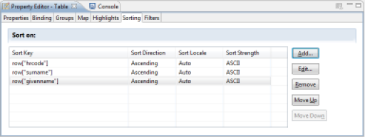   
**_Sorting data_**

Sorting may be done on several successive criteria (last name, then first name, then job, ...). Adding a new sorting criterion makes a dialog box appear, allowing you to select the column or combination of columns to use in the sort. Note: Clicking on the 'Fx' button makes the JavaScript editor appear, allowing you to combine several columns for the data sort.

| **Warning**:    Sort operations configured in the report editor in the List and Table components are performed locally when the report is generated. We suggest that you focus on setting the sort in the Audit View rather than in the report editor whenever possible. Setting the sort data in the Audit View performs the sort in the database and therefore strongly increases system performance.|

   
**_Sorting data_**

### Group Data in Tables

Tables offer many options for layout. One of the most useful is the ability to create groups of data. Grouping data makes reading and using data easier by organizing them into sections. It is possible to define an infinite number of groupings, and to make sub-groups of data.   
You can configure data grouping settings by selecting the detail line of the table in which you want to group data. Then you select the 'Insert Group' contextual menu. An editor opens, allowing you to set the grouping key as well as various options for layout, filtering and sorting data.   

   
**_Settings for grouping data in a table_**

After the group settings are created, the table display changes with the appearance of a new line for the detail of the grouped data, and a new line for the footer of the grouped data. Simply drag/drop the columns from the Dataset corresponding to the 'Data Explorer' view in the table cells to display the data.   

| **Note**:    It is possible to associate table of contents entries with groups of data. These table of contents entries appear with an indentation in tree form when the report is generated in HTML or PDF format.|

   
**_Table with grouped data_**

   
**_Example of table with grouped data_**

## Data Aggregation and Analysis

Many aggregate and analysis functions are present in the report editor, allowing you to construct analyses on the Identity Ledger database.   
The aggregation and analysis of data means creating a new calculated column, either directly in the Dataset or at the 'Binding' level of a List or table component. We invite you to consult the Setting up additional columns in the Datasets chapter of the documentation for more information about configuring calculated columns in the Dataset.   
An aggregation calculation is done by dragging/dropping the 'Aggregation' component from the Component Palette to a sub-area of a List or Table component in the report editor. A wizard opens, allowing you to configure your new calculated column. The calculated column will be automatically created in the 'Binding' of the immediate parent List or Table component of aggregation  

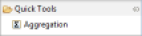   
**_Data aggregation and analysis component_**

The wizard allows you to define the conditions for calculating your aggregate data. Available aggregate functions are:   

- **count** : count the number of elements
- **sum:**  sum of the elements
- **max:**  maximum of the elements
- **min:**  minimum of the elements
- **ave:**  average of the elements
- **weightedave:**  weighted average of the elements
- **movingave:**  moving average of the elements
- **median:**  median of the elements
- **mode:**  value that appears the most often
- **stddev:**  standard deviation
- **variance:**  variance
- **first:**  first value of the sequence
- **last:**  last value of the sequence
- **runningsum:**  running sum of the elements
- **irr:**  financial function ([Internal Rate of Return](http://en.wikipedia.org/wiki/Internal_rate_of_return) of a series of periodic Cash Flow)
- **mirr:**  financial function [(Modified Internal Rate of Return](http://en.wikipedia.org/wiki/Modified_internal_rate_of_return) of a series of periodic Cash Flow)
- **npv:**  financial function ([Net Present Value](http://en.wikipedia.org/wiki/Net_present_value) of a varying series of periodic cash)
- **runningnpv:**  financial function (Running [Net Present Value](http://en.wikipedia.org/wiki/Net_present_value) of a varying series of periodic cash)
- **countdistinct:**  count the number of unique elements
- **rank:**  element rank
- **is-top-n:**  Boolean expression indicating whether a value is one of the higher n values
- **is-top-n-percent:**  Boolean expression indicating whether a value is in the higher n percentage
- **is-bottom-n:**  Boolean expression indicating whether a value is one of the lower n values
- **is-bottom-n-percent:**  Boolean expression indicating whether a value is in the lower n percentage
- **percentrank:**  value's rank as a percentage of the file
- **percentile:**  Centile of the sequence of elements
- **quartile:**  Quartile of the sequence of elements
- **percentsum:**  Percentage of a total
- **runningcount:**  Number of elements fitting a condition
- **concatenate:**  concatenation of element values

The value to use for aggregation may be static or dynamic. If the value is dynamic, it can be determined with a JavaScript expression, taking advantage of Datasets available to this component.   
It is also possible to take advantage of groups/sub-groups of data in the tables in order to perform partial calculations (for example, the number of people present by organization within the company).   

   
**_Data aggregation settings_**  

   
**_Aggregation settings at the Binding level of the Table component_**

## Filtering Data

It is possible to configure the filtering of data at different places in your report in order to restrict the display to only the useful data of your dataset. The ability to filter data is available at the following locations:

- **Audit View** : By creating parameters in the Audit View, and by using these parameters as filtering conditions when you create the Audit View.
- **Dataset** : By configuring the filter directly in the Dataset
- **Components** : By configuring the filter in the List and Table component, or at the data grouping level in Tables   

For details about configuring data filtering at the dataset level, please refer to the Dynamic filtering results chapter of the documentation.   
Finally, note that there is an alternative to filtering at the component level: The use of the management visibility areas of the report functionality.   
To configure filtering in the Component, select the 'Filters' section of the Table or List component properties editor. It is then possible to dynamically filter the results returned by the component's Dataset by setting a series of conditions on the values of the columns. If multiple conditions are set, then all of the conditions must apply for the current row of the Dataset to not be filtered.    
Possible conditions are:   

- **Between** : The value must be between two terminals
- **Bottom n** : The value must be part of the lower n values
- **Bottom Percent** : The value must be part of the n lower n percentage values
- **Equal to** : The value must be equal to
- **Greater than** : The value must be greater than
- **Greater than or Equal** : The value must be greater than or equal to
- **In** : The value must be inside a set of values
- **Is False** : The Boolean value must be NO
- **Is Not Null** : The value may not be NULL
- **Is Null** : The value must be NULL
- **Is True** : The Boolean value must be **YES**
- **Less than** : The value must be less than
- **Less than or Equal** : The value must be less than or equal to
- **Like** : The value of a string looks like (syntax similar to SQL LIKE syntax, wildcards are % and \_)
- **Match** : The value of a string must correspond to a regular expression
- **Not Between** : The value must not be between two terminals
- **Not Equal to** : The value must not be equal to
- **Not In** : The value must not be part of a set of values
- **Not Like** : The value of a string does not look like (syntax similar to SQL LIKE syntax, wildcards are % and \_)
- **Not Match** : The value of a string must not correspond to a regular expression
- **Top n** : The value must be part of upper n values
- **Top Percent** : The value must be part of upper n percentages   

The value to be tested may be static or dynamic. If it is dynamic, the value to be tested may take the form of a JavaScript script.   
Filtering can be based on any column, including calculated columns

| **Note**:    The filtering is performed locally when the report is generated, following the execution of the Audit View query. It is recommended that you use the Audit View settings whenever possible, as this processes the filtering at the database server level and thus optimizes the processing time significantly.|

**_Configuring filters in a Table component_**

## Report Parameters

Reports can accept parameters and thus dynamically adapt the content presented based on external information, which can be transmitted by other HTML pages (when browsing, for example), or entered by the user via a dedicated interface.   
The report parameters are basically dynamic views (particularly searches) and are essential to navigation between reports.   
From the point of view of the report, report parameters are Components that may be dragged/dropped in the editing area of the report. It is also possible to use these parameters in various dialog boxes, as well as in the scripting language, using the directive:    
params["_PARAMETER NAME_"].value  
It is also possible to directly assign report parameters to Dataset parameters in order to restrict the information returned by external information functions or parameters entered by the user.   

   
**_Using report settings in a Dataset setting_**  

You can create a report parameter by right-clicking on the 'Report Parameters' entry in the 'Data Explorer' View, and then selecting 'New Parameter'.

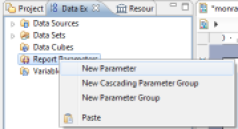   
**_Creating a report parameter_**  

Clicking on 'New Parameter' opens the parameter creation wizard. A parameter is defined by a name, a label, a data type, a way to edit its value, and attributes (visible to the user, required, ...). Several methods of editing values are available:   

- Text Box
- Combo Box
- List Box
- Radio Button

A parameter may receive a default value, which may be static or dynamic. In the case of a dynamic value, it must reference a Dataset allowing the editor to display a choice of values to the user.

   
**_Creating a report parameter_**  

| **Note**:    The values of report parameters are evaluated during the initial phase of report generation, even before loading the report template. So unlike other editing areas of the report, it is not possible to directly exploit the reports' concepts here. It is only possible to refer to a Dataset when you want to suggest dynamic values in the editing box of the parameter values.|   

Users may edit report settings through the web viewer if the parameters do not have the 'Hidden' attribute set. A web dialog box opens when the report is opened in order to allow the user to enter values for the required parameters. Note that this box only opens if no value was automatically passed for the required parameters when the report was opened.   

   
**_Example of web interface generated by the web viewer_**  

It is possible to modify the parameter values available in the report at any time using the 'Report Settings' button in the report viewer's toolbar. Updating report parameters causes the report to be regenerated.

   
**_Web Viewer_**

## Navigating Between Reports

It is possible to place hyperlinks on some components in order to add interactivity in reports. The components which allow you to add links are:   

- Label
- Data
- Image
- Chart Elements

You can insert a hyperlink by selecting the 'Hyperlink' tab in the properties editor of the selected component, then click the 'Edit ...' button. A wizard opens to help you set up your hyperlink.    
There are different types of hyperlinks in the report editor:

- **URI** : Creation of an external link
- **Internal Bookmark** : Creation of a link to another part of the report
- **Drill-through** : Creation of a link to another report

### External Link

An external hyperlink allows you to reference an arbitrary external website. Several options are available to either replace the current window or open a new window when clicking on the hyperlink. The hyperlink can be either static or dynamically defined using a JavaScript expression. In the second case, the JavaScript may rely on the values of Datasets available to the component.   

   
**_Inserting an external link_**

### Hyperlink to Another Part of the Report

It is possible to define internal hyperlinks in your reports, for example, to make a table of contents at the beginning of a lengthy report and facilitate the navigation between parts of the report by simply clicking on the text of your table of contents.   
To do this, you must define 'Bookmarks' in your report. Define bookmarks by selecting Components of the report and using the 'Bookmarks' tab of the component's properties editor.   
Then you create an internal hyperlink by selecting the bookmark to which the user should be redirected.   
Bookmarks may be static or dynamic. If they are dynamic, bookmarks may be generated by Javascript, and the script may be based on data from the Datasets available to the component.   

   
**_Configuring a hyperlink to another part of the report_**

### Hyperlink to Another Report

Setting up a hyperlink to another report of the project is by far the richest and most interesting feature. It allows automatic navigation between the different reports that make up the web portal of Brainwave Identity GRC, thus making a complete and detailed rights management application available to portal users.   
It is quite possible to configure your particular reports so that they redirect the user to the portal reports, for example, to access detailed views of objects in the model (detail of an identity, ...). Please refer to the "Reports provided as standard" chapter in order to access to the list of standard reports provided in the portal and the parameters required per report.   
To set up a hyperlink to another report in the project, perform the following steps in the configuration dialog box:

1. **Select the report to which the user should be redirected.**  The project's reports are available in the sub-tree /reports
2. **Use**  **report parameters**  Depending on the report selected, some parameters may be required. Click on the 'Add...' button in order to use these parameters. The value of a parameter may be static or dynamic. If the value is dynamic, it may use Javascript. Dataset data available to the component are available via the Javascript directive _row['COLUMN\_NAME']_
3. **Select a bookmark or table of contents entry if necessary in the target report**  This allows a section of the target report to be displayed directly, if the report is lengthy. See the Table of Contents and Configuring a hyperlink to another part of the report sections for more information about setting internal links in reports.
4. **Select a display window for the report**  This window may be the current window, a part of the current window, or a new window. When integrating your report with the Identity GRC web portal, you need to choose Same Frame
5. **Configure the output format**  You can force the output format of your report to a different one than the current format, for example, automatically generate PDFs, Word files, ... **Configure the tooltip**  This text will be displayed when the cursor of the mouse hovers over the hyperlink

   
**_Configuring a hyperlink to another report_**

# Advanced Concepts

## Subreports

When formatting complex reports, it can sometimes be useful to present the information by following a master/detail type logic: For each main element listed (for example, each identity from the ledger), display a set of characteristics of this element (for example, its organizations, groups, ...).   
If the concept of grouping in the table allows you to handle the simplest cases, it quickly becomes impossible to limit yourself to this functionality because information retrieval requires running multiple queries on the identity ledger (usually n + 1: A query to list the master elements, followed by n queries to retrieve additional information for each of the master elements listed).   
The report editor allows you to contextualize queries run on the ledger, and thus handle the constraints related to master/detail type displays. Many reports available as standard in Brainwave Identity GRC use this feature. We suggest that after reading this chapter, you edit these reports in order to access examples of implementation (templateanalysis.rptdesign, ...).   
The set-up of subreports is based on the nesting of List and Table type components, as well as the dynamic configuration of Datasets referenced by the sub-components.   
Let's look at the example of a report that lists the applications for each identity. We will create this report not by relying on a grouping of rows in a table, but by configuring a subreport.   
To do this, we will insert a Table in our report and associate a Dataset which is based on the audit view 'br\_identity' to this Table. This component displays the ordered list of all the identities in the ledger.   
We then insert a List component into the 'Detail Row' line of our Table component, then we associate a Dataset that relies on the 'br\_applicationsbyidentity' Audit View with this List component.   

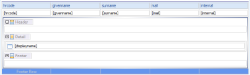   
**_Table with nested List_**  

At this stage, for each identity, we list all the applications present in the ledger. However, we wish to list only those applications to which each identity has access. To do this, we are going to configure our Dataset at the List component level. This involves selecting the 'Binding' section of the List component properties editor, and clicking on the 'Data Set Parameter Binding...' button. A dialog box opens, allowing us to pass parameters to the Dataset dynamically each time the list is displayed.  
We wish to pass the unique identifier for each identity as a parameter to our 'applicationsbyidentity' Dataset, so that the List component displays only the applications available for a given identity. So we develop the 'identityrecorduid' parameter of the Dataset with the value retrieved from the Dataset of the parent Table component (the Dataset which lists out the identities). This means configuring the following script: row["recorduid"]

   
**_Retrieving the identification number in the master component_**

Our List component is now controlled by a datum of the Table component in which it is contained. We have just created a master/detail type report.

   
**_Example of subreport_**  

| **Note**:    Rely on the naming convention of the Audit Views to select the views consistent with the retrieval of details about a Ledger concept. Audit Views that accept a unique concept identifier from the ledger as a parameter have a name like'detailsbymaster'. For example, if you want to retrieve the list of applications for a given identity, you need to select the 'applicationsbyidentity' view.|

Master/detail type queries are particularly resource intensive because at a minimum, it means performing n +1 queries to the Ledger. So do not forget to limit the number of master query results, and it's better to use tables with groupings whenever possible.

## Charts

The report editor includes a chart generation engine. This engine is able to represent the data from the Ledger in many different ways. It is also possible to overlay different charts, perform aggregation and analysis operations of the data displayed, ...

### Available Charts

The available types of charts are:

#### Bar

Serial or stacked histogram... ability to overlay any other type of charts (curve, ...)   

   
**_Bar_**

#### Line

Serial or stacked line... ability to overlay any other type of charts (curve, ...)   

   
**_Line_**

#### Area

Serial or stacked area... ability to overlay any other type of charts (curve, ...)   

   
**_Area_**

#### Pie

Pie chart ([Pie Chart](http://en.wikipedia.org/wiki/Pie_chart))  

   
**_Pie_**

#### Meter

View-meter  

   
**_Meter_**

#### Scatter

Scatter plot ([Scatter plot](http://en.wikipedia.org/wiki/Scatter_plot))   

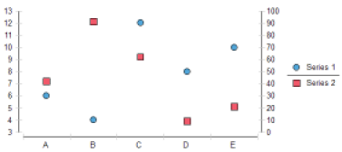   
**_Scatter_**

#### Stock

Candlestick chart ([Candlestick chart](http://en.wikipedia.org/wiki/Candlestick_chart))   

   
**_Stock_**

#### Bubble

Bubble chart ([Bubble chart](http://en.wikipedia.org/wiki/Bubble_chart))   

   
**_Bubble_**

#### Difference

Difference between series of values   

   
**_Difference_**

#### Gantt

Gantt Chart ([Gantt chart](http://en.wikipedia.org/wiki/Gantt_chart))   

   
**_Gantt_**

#### Tube

Serial or stacked tube histogram... ability to overlay any other type of charts (curve, ...)   

   
**_Tube_**

#### Cone

Serial or stacked cone histogram... ability to overlay any other type of charts (curve, ...)   

   
**_Cone_**

#### Pyramid

Serial or stacked pyramid histogram... ability to overlay any other type of charts (curve, ...)   

   
**_Pyramid_**

#### Radar

Radar ([Radar chart](http://en.wikipedia.org/wiki/Radar_chart))   

   
**_Radar_**

#### Treemap

Treemap ([Treemapping](https://en.wikipedia.org/wiki/Treemapping))

   
**_Treemap_**

### General Principles about Creating Charts

Creating a chart in the report is based on the 'Chart' Component present in the Components Palette. Dragging/dropping this component in the editing area of the report makes the graphics wizard appear.   

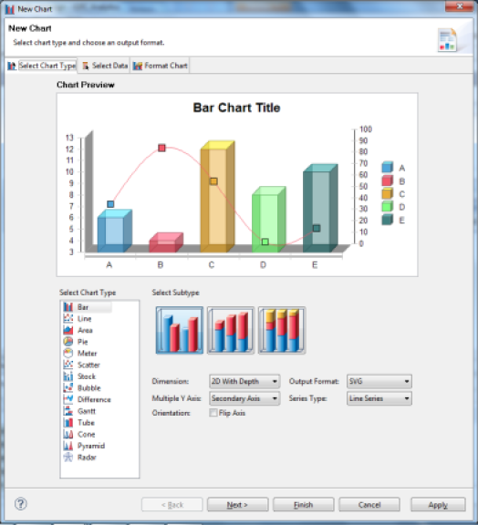    
**_Graphics creation wizard_**  

Creating a chart always follows the following steps:   

1. Select the type of chart
2. Configure the extraction of useful data for the chart
  - From a Dataset
  - From a Table or List type Component
3. Configuring chart layout options
  - Colors
  - Display options : axes, legends, ...
  - Chart interactivity
4. Configuration of the chart size in the report

The first three steps of creating a chart are based on the three tabs of the Chart Settings wizard of the editor:   

- Select Chart Type
- Select Data
- Format Chart

The contents of the 'Select Data' and 'Format Data' tabs may vary depending on the type of chart you selected. Therefore, in this documentation, we will focus on describing the general configuration logic and we invite you to play around with the settings on each type of chart by relying directly on the Brainwave Identity GRC report editor.

### Retrieve the Chart Data

Once you have chosen the type of chart, the second tab of the wizard allows you to select the data to display in your chart. The appearance of this dialog box may change slightly depending on the type of chart used, but the configuration principles are identical.  

   
**_Configuring the Dataset data retrieval_**   

The data used for a chart can be located either in a Dataset or in a Component in which the chart is contained (List, Table).   

| **Note**:    when data is retrieved from a List or Table component, the Chart component will be based not on the Dataset referenced by the Component, but on the data Binding performed at the component level. This allows you to use the calculated columns locally at the component level as well as the table groupings, aggregations, ... |

Once the data source for the chart is selected, simply drag/drop the columns present in the 'Data Preview' wizard in the corresponding boxes of the 'Chart Preview' area of the wizard. Most of the time the 'category (X)' will consist of a string. The values axis ( Value (Y)) can accept a numerical value directly, or accept an arbitrary value on which to perform an aggregation operation in order to deduce a value.   
It is possible to rely on a Dataset that sends a single list of identities, for example, each with his job, in order to create a chart that represents the number of persons per job. This involves choosing a unique identifier of the identity (for example, the code RH) as a series value (Y), and set on this field an aggregate function like counting elements (Count).   

   
**_Configuring the aggregation function_**

The available aggregation functions are:   

- **Sum** : sum of the elements
- **Average** : average of the elements
- **Count** : count the number of elements
- **Distinct Count** : count the number of unique elements
- **First** : first value of the sequence
- **Last** : last value of the sequence
- **Minimum** : minimum of elements
- **Maximum** : maximum of elements
- **weighted Average** : weighted average of elements
- **Median** : median of elements
- **Mode** : value that appears the most often
- **STDDEV** : typical gap
- **Variance** : variance
- **Irr** : financial function ([Internal Rate of Return](http://en.wikipedia.org/wiki/Internal_rate_of_return) of a series of periodic Cash Flow)
- **Mirr** : financial function [(Modified Internal Rate of Return](http://en.wikipedia.org/wiki/Modified_internal_rate_of_return) of a series of periodic Cash Flow)
- **NPV** : financial function ([Net Present Value](http://en.wikipedia.org/wiki/Net_present_value) of a varying series of periodic cash)
- **Percentile** : Centile of the sequence of elements
- **Quartile** : Quartile of the sequence of elements
- **Moving Average** : moving average of elements
- **Running Sum** : running sum of elements
- **Running NPV** : financial function (Running net present value of a varying series of periodic cash)
- **Rank** : element rank
- **Is-Top-N** : Boolean expression indicating whether a value is one of the higher n values
- **Is-Top-N-Percent** : Boolean expression indicating whether a value is in the higher n percentage
- **Is-Bottom-N** : Boolean expression indicating whether a value is one of the lower n values
- **Is-Bottom-N-Percent** : an expression indicating whether a value is in the lower n percentage
- **Percent Rank** : value's rank as a percentage of the file
- **Percent Sum** : Percentage of a total
- **Running Count** : Number of elements fitting a condition

| **Note**:    he 'Sum' aggregation function is selected by default in the wizard; this requires that the value to be set be numerical. If you set a Text type value the chart will not display anything. You must change the aggregation function to the 'Count' or 'Distinct Count' function to count the number of elements instead.   It is also possible to sort the category data (X-axis) according to arbitrary criteria. Do this by clicking the button to the right of the category column setting.|

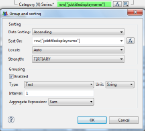   
**_Sorting category data_**

It is also possible to pass parameters to the Dataset used by the chart component. This can be achieved in two ways:   

- By clicking on the 'Parameters...' button in the chart creation wizard
- By selecting the 'Chart' component in the chart editor, then selecting the 'Binding' section in the component's editor properties.   

This setting is identical to that of the Table and List components. We invite you to refer to the documentation section detailing the use of parameters in the Table and List components for more information on this subject ([Subreports]({{site.baseurl}})   

   
**_Editing parameters of the chart Dataset_**

### Chart Formating

Charts may be formatted with the help of the third tab of the chart wizard: 'Format Chart'.   

   
**_Editing chart formatting parameters_**   

The available functions depend on the type of chart selected. It is possible to perform the following operations:   

- Choice of output format (bitmap, vector)
- Chart representation (simple, translucent, ...)
- Chart colors
- Complementary chart parameters (type of point, ...)
- 2D axes/2D depth/3D formatting
- Chart area formatting (perspective lines, ...)
- Chart title formatting
- Legend formatting
- Interactivity configuration by clicking on a chart area

We invite you to discover these features directly by using the Chart Editor. See also the chapter "Laying Out and Formatting a Chart' in the 'BIRT Report Developer Guide' Brainwave Analytics documentation.

## Pivot Tables

The report editor offers advanced analysis capabilities allowing the dynamic generation of [OLAP data cubes](https://en.wikipedia.org/wiki/OLAP_cube) which can then be represented in the form of multi-dimensional pivot tables.   
PivotTables are indispensable when it comes to analyzing mass data, for example, to highlight common characteristics or anomalies.   
In our context, the representation in the form of pivot tables allows us, for example, to display the number of people who have access to a set of permissions in a table (for example, the shared/audit subdirectory) by the organization a person belongs to. Anomalies appear immediately: here, people who have access to the audit directories though they are not part of the audit organization.   
The report editor and the pivot table chart component can display multi-dimensional cubes. Here we focus on the configuration of a two-dimensional cube. Adding new dimensions follows the same principle of configuration.   
The easiest way to create a data cube based on a Dataset is to position a 'Cross Tab' type component in the graphical editor, then drag/drop one of the columns from the Dataset on which we want to create a data cube.   

   
**_Empty Pivot Table component_**

This opens the data cube wizard. The wizard allows you to define the dimensions and measurements of your data cube. To do this, in the editor, simply drag/drop columns corresponding to the dimensions in the field '(Drop a field here to create a group), and the columns corresponding to the measurements in the field' (Drop a field here to create a summary field). '

| **Note**:    It is possible to create sub-dimensions by dragging/dropping columns in already configured dimension fields.|

The measurement field can either directly accept a numerical value or perform an aggregation operation on a numerical/text value. To do this, select your measurement field in the editor and click on 'Edit'. You can then select an aggregation operation. Available aggregation operations are:   

- **SUM** : Sum of numerical values
- **MAX** : Maximum value among the set of values
- **MIN** : Minimum value among the set of values
- **FIRST** : First value displayed
- **LAST** : Last value displayed
- **COUNT** : Count the number of elements
- **COUNTDISTINCT** : Count the number of unique elements

| **Note**:    If your dataset presents information in a format that is directly compatible with the analysis you wish to conduct, it is possible to optimize system performance by selecting the 'Check this option if the data in the primary dataset has been grouped and aggregated in a way that matches the cube definition' option in the 'Data Set' tab of the data cube creation wizard. |

   
**_Data cube creation wizard_**

Once your data cube has been configured, it is accessible in the 'Data Explorer' view under the 'Data Cubes' entry.

   
**_Configured data cube_**   

Simply drag/drop the dimensions into the rows and columns of your pivot table, as well as measurements in the detail field.   

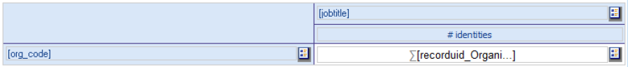   
**_Configured pivot table_**

Once formatted, your pivot table will appear as follows in your reports:   

   
**_Example of pivot table_**

## Localization

Brainwave Identity GRC supports the configuration of multiple languages. English and French are standard throughout the product, including in the reports. 

It is also possible to add new languages in the web portal and reports. This chapter describes the method used to localize your reports.   

It is possible to add properties files (`.properties` extension) to your reports to outsource label management.  

If multiple languages are present, we recommend you create a file for each language. The report engine will then dynamically select the correct file based on the current language.  

The naming convention for properties files follows the i18n java language standard: properties files must be suffixed with `_` followed by the language code (standard [ISO 639](http://fr.wikipedia.org/wiki/ISO_639)). A file without a suffix must also be present; this is the language used by default.   

> **Note:** The default language of the report engine is English. The localization file without a suffix must have content in English.

> Only the file without a suffix is set in the report, other files are automatically deducted by the report engine by appending the language code to the default file.  

Configure a properties file in a report by selecting the 'Resources' tab in the report properties editor (_tip:_ First click on an area outside the report in the report editor in order to access this properties editor). Then simply add a reference to the files by clicking the 'Add File...' button from the 'Properties files' area.  

     

**Note:** There is a properties file referenced by default in reports created with the Brainwave Identity GRC wizard. This is the 'concepts.properties' file.

This file has a localized version of all the concepts present in the product, including all the columns for all the Identity Ledger items. The use of these properties is to be preferred in order to ensure the consistency of all reports. This file is located in the '/reports/resources' subdirectory of your audit project. To localize text, select the component in question in the editor and select the 'Localization' tab of the properties editor.   

    

It is then possible to select existing text in the properties file, or create new text.

     

A dedicated localization editor is also present when setting up the association of text to a column value ('Map' function in most of the components).   

**Note:** The properties file that will be modified is the one corresponding to the working language of Brainwave Analytics; this language is the default language of the operating system. If the file corresponding to the language does not exist, then the default will be changed.

A dedicated properties editor is available to you in Brainwave Analytics; it allows you to handle the batch translation of a report by creating a new properties file and comparing values ​​in pairs with reference values while editing. Simply edit a properties file in the editor. Brainwave Analytics deduces the default file and all the language files present from your file. It allows you to choose the language with which to perform the pairs comparison when editing.   
We recommend that you only translate your reports once they are finalized using the dedicated localization files editor.   

     

## Scripting

The reporting engine includes the Mozilla Rhino foundation's JavaScript language. BIRT has many events on which scripts may be triggered to customize data presentation or the report layout.   
A detailed presentation of this functionality is beyond the scope of this guide. We invite you to consult the 'Scripting Reference' chapter of the 'BIRT Report Developer Guide' documentation available in Brainwave Analytics as well as online documentation of the Eclipse foundation: [documentation](http://www.eclipse.org/birt/documentation/integrating/scripting.php) for more information about the scripting capabilities offered by the solution.

## Assigning a Reliability Index to a Reconciliation Rule

See "Reconciliation Policies"

# Advice and Best Practices

## Arborescence and Naming Conventions

Reports are present in the '/reports' subtree of your audit project. Several subdirectories are present depending on the primary purpose of the report.   

- **/reports/analysis/** : Analytical reports. Most of these reports launch an analysis on an element of the Ledger
- **/reports/browsing/** : Navigation report
- **/reports/controls/** : Dashboards and control summaries
- **/reports/custom/** : Project's custom reports
- **/reports/icons/** : Images library
- **/reports/dashboard/**  : Dashboard's summaries
- **/reports/library/** : Library on which all the standard reports rely. Do not modify the content of this directory
- **/reports/resources/** : Localization reports of the Ledger concepts
- **/reports/rules/** : Reports used by the rule engine when you click on the 'Report' button in the 'Results' tab
- **/reports/scripts/** : Scripts on which all the standard reports rely. Do not modify the content of this directory
- **/reports/style/** : Stylesheet used by standard reports

You must create your own reports in the '/reports/custom' subdirectory; this will facilitate the reversibility and the migration of your reports to a new version of Brainwave Identity GRC.   
We recommend that you rely on existing reports to help create your own reports. Feel free to copy/paste reports or report elements.   
You can modify existing reports entirely, for example, to add or change detail texts in identity reports, account reports ... We advise you to keep track of the reports you have modified in order to facilitate upgrading the Brainwave Identity GRC software. Brainwave Analytics supports the majority of version control managers. The best way to keep track of changes is fork your audit project in a version control manager such as SVN.   
We recommend that you give your reports simple names that remind you of the concept presented by the report as well as the primary purpose of the report.   
Standard Brainwave Identity GRC reports adopt the following naming convention:   

- The reports bear the name of their main concept
- **_[concept name]_search** for search reports
- **_[concept name]_detail** for detail reports
- The report parameters used by the Datasets bear the name of the Dataset column with which they are associated

We recommend that you keep those conventions, and also suggest you place your localization files in the same place as your report and that you name your default localization file with the same name as your report.

The _/reports/rules/_ subdirectory contains a series of reports used by the rules engine. The rules engine dynamically lists the reports available for the main concept of the rule when you click on the 'Report' button. It then presents this list to the user, retrieving the title and description information entered in the report (General/Title and Description fields in the report's properties editor). The reports are classified according to the concept to which they apply:

- **/reports/rules/account** : Account rules results reports
- **/reports/rules/application** : Application rules results reports
- **/reports/rules/asset** : Assets rules results reports
- **/reports/rules/identity** : Identities rules results reports
- **/reports/rules/organization** : Organizations rules results reports
- **/reports/rules/permission** : Permissions rules results reports

You can add your own rules reports in these directories to extend the standard Brainwave Identity GRC functionalities. To do so, copy/paste an existing rules report, and use it as a model or use the following report templates: _Rule results, landscape report, Rule results report._

| **Note**:    Do not forget to read the _/reports/README FIRST.txt_ file before using Brainwave Identity GRC reports.|

## Audit Views

Audit views are able to automatically skip parameters that are not valuated from the Datasets. Many audit views are available, all having several parameters in order to facilitate reuse; we recommend that whenever possible, you use a standard audit view.   
We <u>strongly</u> discourage you from modifying a standard audit view to extend its functionalities in order to meet a specific report's needs. The audit views are used by many reports, editing an audit view would introduce malfunctions in your audit reports. If no audit view meets your needs, we suggest that you duplicate an existing audit view or to create a new audit view.

## Performances

The following features induce a significant decrease in performance when generating reports:   

- Filtering data in a Dataset or a Container
- Sorting in a Dataset or a Container
- Setting up subreports
- Generating data cubes without preparing the data beforehand

We recommend that you perform data filtering and sorting operations in audit views, the corresponding operations are then delegated to the database.   
We recommend that you use the grouping functionality in the tables rather than the subreport functionality, which allows you to go from N +1 queries to a single query.   
We recommend that you create dedicated audit views leveraging the audit view aggregation features to optimize data cube creation.   
And lastly, we recommend that whenever possible, you set a limit on the number of rows to retrieve in your Dataset, in order to limit your reports to a reasonable size and optimize report generation time.

## Standard Reports

Many reports are available as standard in Brainwave Identity GRC. These reports allow you to navigate in the Identity Ledger as soon as you have loaded a first dataset. Many analyses are also available.   
Reports allow you to focus on your immediate control and audit activities. In this chapter you will find a brief description of the various reports that comprise Brainwave Identity GRC.   

   
**_Sample of standard analysis reports available_**
