# Dashboard Components

## Introduction

The following section details the available components and variations for use in dashboard and how to configure them:

- Tables
- Indicators (gauge or numeric)
- Basic charts ( bars, horizontal bars, pies, and doughnuts)
- Indicator groups ( gauge, numeric and rows)
- Multi-series charts ( bars and horizontal bars, stacked or side by side series)
- Historical charts (single or multi-series, bar, line and stacked areas )

 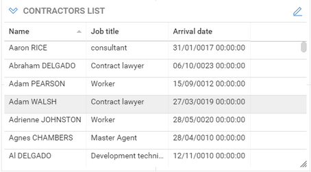
 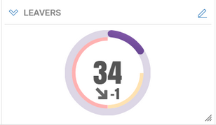
 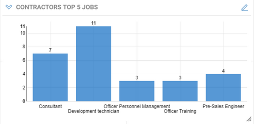
 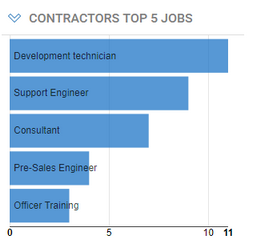
 
 

### Data Management in Components

Except for indicators, dashboards components determine the data to display based on the combination of two factors:

- **Search Rule** : determines which are the ledger entities (identities, accounts, etc.) involved in the component
- **Data View** : determine what parts or computations of the entities retrieved from the search to display.
Depending on the component, this could be:
  - Table: selection of attributes
  - Chart : aggregated attributes as the values, and attributes as the categories / series of the chart

For indicators and indicator groups, only search rules are used, and the count of entities from the search will make the value to display.

Both search rules and data views can have parameters (see below for details).

### Component Configuration

The following pages detail the configuration of each of the components:

[Table Component](#table-component)
[Indicator Component](#indicator-component)
[Basic Chart Component](#basic-chart-components)
[Indicator Groups](#indicator-groups)
[Multi series charts components](#multi-series-chart-components)
[Single series history charts](#single-series-history-charts)
[Multi-series history chart](#multi-series-history-chart)

Don't forget to **Save** the dashboard when you are satisfied with the arrangement of components, or **Discard** changes to revert to the previous layout.

### Search Rules Parameters

Search rules used in dashboards Tables, Charts and Gauges may have parameters. These are called **secondary parameters** as opposed to the dashboard's main parameters.
Rule parameters must be used to filter the entities that are displayed or accounted for in the widget (the widget's scope).
These secondary parameters are configured by clicking the **Params...** button.  
This opens the **Edit Rule Parameters** dialog box which allow to define values for each of the rule parameters.

For each rule secondary parameter, you can set the parameter **Source** and **Value.**

- **Value** : the rule parameter value is a fixed value that must set at design-time (typed or selected from a list of possible values)
- **Dashboard Parameter** : the rule parameter value will be taken from one of the dashboard's main parameters runtime values
- **User Attributes** : the rule parameter will take its value from one of the currently connected user attributes

You can also select **None** as the source, to leave the parameter empty, if it's not mandatory.

See [Secondary Parameter Configuration](./03-advanced-configation) for detailed explanations on the different sources.

### Data View Parameters

Views used in dashboards' tables and charts may have parameters. These are called **secondary parameters**  as opposed to the dashboard's main parameters.

View parameters must be used to filter secondary entities or information retrieved by the widget's view only, to ensure optimal execution performance.
Consider for example, a table that displays accounts and groups the accounts belong to, for a given repository. Here the main entity is the account, and should be filtered by its repository in the table's rule. The groups are secondary entities and should be filtered using view parameters.
Using view parameters to filter the main widget's entity (_i.e._ the search rule's entity) in the view or both in the rule and in the view may result in slow downs.

## Table Component

The table component displays information from the Identity Ledger in columns and rows. The table can be re-sorted by clicking on the headers and can be exported as CSV or Excel file by clicking on the downward arrowhead icon.

### Table Configuration

- **Basic** tab : sets the table general characteristics
  - **Title** : Sets the text to be displayed in the table's title bar
  - **Size** : Sets the table's display size, expressed in columns and rows. See **Dashboard layout**  section for more information

- **Search**  tab : allows to select a **rule**  that will determine the entities from the Identity Ledger that will be in the scope of the component. For example "All active entities", or "Orphaned Accounts".
See **dashboard data access components**  section below to understand what rules are displayed and how to add your own.
  - **Search on** : Allows to select the kind of entities to be displayed in the table (Accounts, Application, Asset, Group, Identity, Organization, Permission, Repository or Usage) and will filter the list of rules accordingly.
  - **Rule** : lists and allows to select a rule for the selected entity kind. The rule may have parameters which can be set by clicking the **Params...**  button.  
See **Rule parameters** for details
  - **Test**  allows to check the result of the rule , using the configured parameter values if any.  

- **Table View Settings**  tab: Used to select of the columns to be displayed in the table, and a default sort order for the table rows.
  - To select the columns to display do the following:
    - Select one of the presentation views. Please note that only views that targets the rule's entity kind will be displayed.
The View may have parameters which can be set by clicking the **Params...**  button (See **View parameters** for details)  
The list of columns below display the columns that are defined in the view  
    - Select one or more columns and add them to the table by clicking on the **\>**  button
    - Your can reorder the columns using the **Up**  and **Down**  buttons
  - Select a item from the **Sort By**  list to define the default sort column order for the table rows, and select **Ascending** / **Descending** sort direction.

- **Customization**  tab: Used to customize column labels, width and alignment.
  - To change the width, label or alignment of a column , select the column and click on the **Edit...**  button
  - The **Auto**  width corresponds to a 150 pixel width
  - You can also set a column width directly by clicking between two column headers and dragging to a specific position. The column width will be preserved when saving the dashboard.

## Indicator Component

The Indicator component displays a numerical value as a radial gauge or in text format. The displayed value can be absolute or percentage.
The gauge may also display a trend (comparison with the previous timeslot) and thresholds markers if enabled.

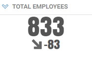

### Indicator Configuration

- **Basic** tab : sets the gauge general characteristics
  - **Title** : Sets the text to be displayed in the component's title bar
  - **Display as:** to set whether the gauge will be displayed as a radial chart or as a text value.
  - If **Display value as a percentage**  is checked, you will have to define the maximum value from which the percentage is computed (value / maximum value).
  - **Style:**  to define the color scheme for the main gauge dial, either as a flat or gradient color, from a list of available color schemes.
  - **Size** : the size of a gauge cannot be configured. It always covers one cell of the grid layout (1 column and 1 row)

- **Value**  tab : defines how the displayed value is computed.
The computation consists of two parts:
  - **Scope** of the gauge, that is the entities from the Identity Ledger that will be part of the figure. For example "All active entities", or "Orphaned Accounts".
  The scope can be defined in two ways:  
    - **Simple mode** :  directly select your criteria in free search mode.
      - select the entity to search on
      - then select your criteria in assisted mode
    - **Advanced mode** : selecting an existing rule from the project.
    (See **dashboard data access components**  section below to understand what rules are displayed and how to add your own ones).
      - **Search on**  list allows to select the kind of entities to search for (Accounts, Application, Asset, Group, Identity, Organization, Permission, Repository or Usage) and will filter the list of rules accordingly.
      - **Select Rule**  lists and allows to select a rule for the selected entity kind. The rule may have parameters which can be set by clicking the **Params...**  button. (See § _Rule parameters_ for details)  
  - Click on **Test**  to check the result of the search or selected rule.

- **Aggregation function** of the gauge. There are  5 aggregation functions:  
  - **Count** : the displayed value will be the number of items returned by the search or rule defined in the scope.
  - **Sum** :  the displayed value will be the sum of the numerical attribute selected in the **Value attribute** menu for all items returned by the search.  
   The available attributes are either numerical metadata attributes on the entity or default numerical attributes for this concept, as defined in the mashup chart views.
   If you don't find the attribute you are looking for, you can build you own view and select it in the **Advanced** mode.
  - **Average** :  the displayed value will be the average value of the numerical attribute selected in the **Value attribute** menu for all items returned by the search.
  - **Maximum** :  the displayed value will be the maximum value of the numerical attribute selected in the **Value attribute** menu for all items returned by the search.
  - **Minimum** :  the displayed value will be the minimum value of the numerical attribute selected in the **Value attribute** menu for all items returned by the search.

- **Maximum Value**  tab: allows to define a maximum value for computing a percentage value for the gauge.  
This tab is only available if **Display value as a percentage**  has been checked
  - Select **Fixed Value**  and type in a value, to use a static value as the denominator for the percentage
  - Select **From another search and value**  to have the percentage denominator dynamically computed based on another rule, search and aggregation function.  
For example to compute the _rate of contractors_ in the company, you would select "_contractors_" as the main search for the gauge, and "_total employees_" as the maximum search.

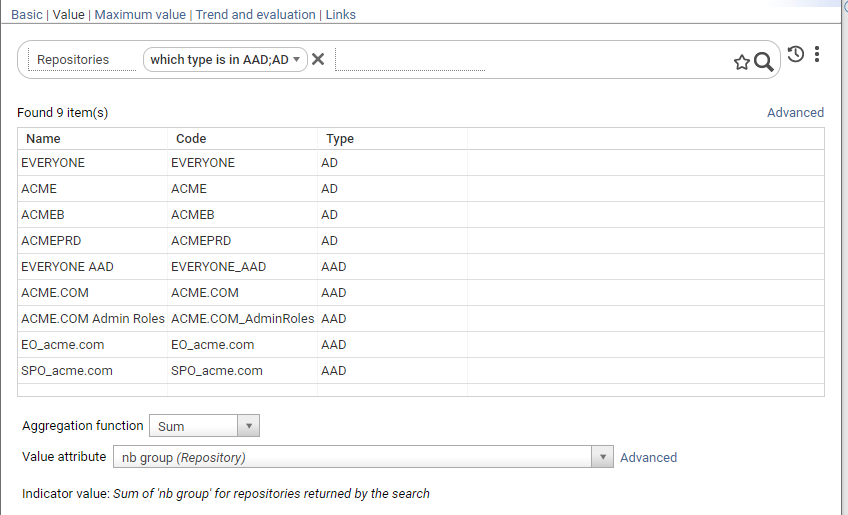

- **Trend and evaluation**  tab
  - Check **Display trend**  to display a trend value and icon ( see below for explanations on options and how the trend is computed)
  - Check **Enable evaluation of value**  to enable evaluation and coloring of the value depending on thresholds ( red / orange if the value exceeds the thresholds)
    - Select **High Thresholds**  / **Low Threshold**  evaluation mode to set how evaluation is computed ( see **Threshold evaluation section** below, for computation details)
    - Enter values for **warning threshold** and **critical thresholds**  

### Displayed Indicator Values

**Current main value**  - the following value will be displayed, depending on the gauge setting:

- if **Display as percentage** is not checked : current main value  
  ( = count of entities in the main search , for the current time slot)
- if **Display as percentage** is checked : current main value / current maximum value
  (= count of entities in the main search for the current time slot / maximum value , fixed or count from another rule)

**Trend value**  - the following trend value will be displayed :

- If **Display as percentage**  is not checked: current main value / current maximum value
( = the difference between the count of items of the main search for the current time slot and count of items of the main search, for the previous time slot )  
- if **Display as percentage** is checked: ( current main value / current maximum value) - ( previous main value / previous maximum value)

The previous value used for computing the trend is determined as follows:

- if **Use comparison timeslot** is checked: use the previous reference timeslot , if there is one, or the previous timeslot if no reference timeslots have been defined.
- if **Use comparison timeslot** is not checked: always use the previous timeslot and ignore reference timeslots.

**Threshold values**  are expressed as absolute values or percentages, depending on **display as percentage**  option.

**Threshold evaluation**  is computed as follows:

- In **High thresholds**  evaluation mode:
  - Value is at critical level if higher or equal than (\>=) critical threshold
  - Value is at warning level if higher or equal than (\>=) warning threshold
  - Value is normal, otherwise ( if lower than warning threshold)
- In **Low thresholds**  evaluation mode:
  - Value is at critical level if lower than (\<=) critical threshold
  - Value is at warning level if lower than (\<=) warning threshold
  - Value is normal, otherwise ( higher than warning threshold)

## Basic Chart Components

The chart component displays a set of labelled values as a graphical chart.
Four chart types are available:  **bar** , **horizontal bar** , **doughnut**  and **pie**.

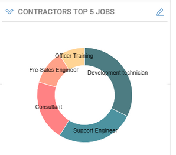

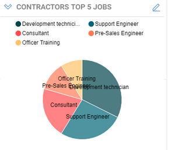

### Chart configuration

Tabbed wizard configuration

#### Basic tab

This page sets the chart general characteristics

- **Title** : Sets the text to be displayed in the chart's title bar
- **Type :** defines the type of the chart among the four available types (**bar** , **horizontal bar** , **doughnut**  and **pie**)
- **Style :** allows to define the color scheme to use for the charts bars or wedges, from a list of available color scheme.
If the number of values in the chart exceeds the number of colors defined in the scheme, colors are cycled.
- **Display options:**  for various chart flags depending on the chart's type
  - **Show legend** : (pie and doughnut charts)  allows to display a separate legend above the chart .
  - **Display series labels inside bars**  (horizontal bar) **:** displays the value labels inside the bars, to cope with long labels and screen space, or to the left or bars, for short labels.
  - **Stagger series labels**  (bar chart) to display bar labels on two lines.
- **Size** : Sets the chart's display size, expressed in columns and rows. See **Dashboard layout**  section for more information

#### Search tab

This page allows to define a **free search** or select a **rule**  that will determine the entities from the Identity Ledger that will be in the scope of the chart.
For example "All active entities", or "Orphaned Accounts".  
The search can be defined in two ways:  
    - **Simple mode** :  directly select your criteria in free search mode.
      - select the entity to search on
      - then select your criteria in assisted mode
      - click apply button to test the search
      - optionally click **Advanced** to switch to advanced mode.
    - **Advanced mode** : selecting an existing rule from the project.  
See **dashboard data access components**  section below to understand what rules are displayed and how to add your own ones.
      - **Search on**  list allows to select the kind of entities to search for (Accounts, Application, Asset, Group, Identity, Organization, Permission, Repository or Usage) and will filter the list of rules accordingly.
      - **Rule** : lists and allows to select a rule for the selected entity kind.
      - **Params...**  button allows to defines rule parameters if any.  (See § _Rule parameters_ for details)
      - **Test**  allows to check the result of the rule , using the parameter values if any.  

#### Chart data settings

This page defines chart values, chart category labels, and optional sorting/limiting data options.  
There are two ways of defining chart data:

- **Simple mode**: simply select attributes for value and category from a predefined list that covers common cases:
  - **Chart value** select the attribute to use as a value for chart points. The following attributes are available by default for selection:
    - one **computed from search** aggregate attribute computed by counting items matching the search criteria in each category
    - all **metadata numerical attributes** associated to the chart entity as defined in the project metadata.
  - Select **Category label** from a list of predefined category labels that cover common cases for the chart entity

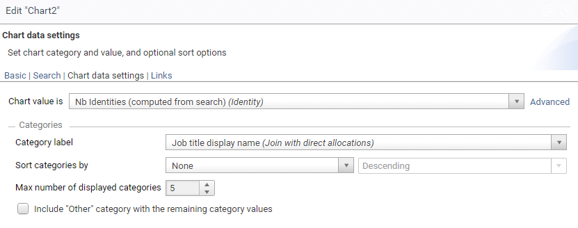

- **Advanced mode** : select value and label attribute from a custom-defined **view**
  - **View** drop down list allows to select the view to produce values and labels for the chart.
    Only views that target the same entities ( account, people, organization, etc.) as the selected search rule are displayed.  
    The selected view may have parameters which can be set by clicking the **Params...**  button (See § _View parameters_ for details)
  - **Chart value** :  select an attribute from the view to use as the chart value points.  Numerical and aggregate attributes from the view are available for selection.
  - Select **Category label**  column from the view to use be used as the chart category label

- You can optionally **Sort categories**  by count value, label or not sorted (natural order)
- For readability matters, you must limit the number of items in the chart ( default 5, maximum 50)
- Check **Include other category with the remainders**  to gather the rest of the values into a single category labelled _Other_.

## Indicator Groups

The purpose of **Indicator groups**  is to simplify the layout of numerous inline indicators, and provide a more readable output.
Moreover, a new **text line** layout displays many indicators vertically in a compact manner.

**Radial Gauge** layout  
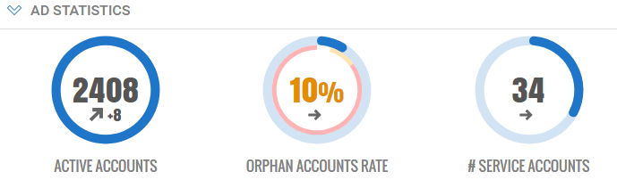  
**Text Line** layout  

Create an indicator group using the     icon in the mashup edition toolbar.  

### Configure Indicator Groups

- **Basic** tab:
  - **Title** : sets a global title for the indicator group. This title can include parameters
  - **Display as** : selects the type of indicators in the group. All indicators in a group share the same type.  
There are three different types :
    - **Radial Gauge** : indicators are displayed in a horizontal row of circular gauges
    - **Numeric** : indicators are displayed in a horizontal row of numeric indicators
    - **Text line** : indicators are displayed in a vertical row of lines of text.
  - **Size** : Sets the chart's display size, expressed in columns and rows. See **Dashboard layout**  section for more information

- **Indicators** tab: allows to add, edit, delete and reorder indicators in the group.
  - **Add** to create a new indicator to the group
  - **Edit** to edit the selected indicator
  - **Delete** : to remove the selected indicator from the group
  - **Up / Down** : to move the selected indicator up and down in the list ( left/right on the display)

For convenience, it's also possible to add, edit and delete indicators directly using icon buttons (you must use the **Indicators** tab to reorder indicators).
Move the mouse over the indicators while editing a dashboard to have the buttons appear.

## Multi Series Chart Components

Multi series charts display horizontal or vertical bars charts with more than one series.
series bars can be side by side, stacked or stacked to 100%.

### Multi-chart Configuration

- **Basic** tab : sets the chart general characteristics
  - **Title** : Sets the text to be displayed in the chart's title bar
  - **Type :** defines the type of the chart among the two available types ( **bar** and  **horizontal bar****)**
  - **Style :** allows to define the color scheme to use for the charts bars, from a list of available color scheme.
If the number of values in the chart exceeds the number of colors defined in the scheme, colors are cycled.
  - **Display options:**  various chart flags depending on the chart's type
    - **Show legend** :  allows to display a separate legend above the chart .
    - **Stagger series labels**  ( bar chart) to display bar labels on two lines.
    - **Grouping mode** : how the series bars in each category should be grouped:  **Side by side** , **Stacked** or **Stacked at 100%**
  - **Size** : Sets the chart's display size, expressed in columns and rows. See **Dashboard layout**  section for more information

- **Search**  tab : allows to select a **rule**  that will determine the entities from the Identity Ledger that will be in the scope of the chart. For example "All active entities", or "Orphaned Accounts".
See **dashboard data access components**  section to understand what rules are displayed and how to add your own ones.
  - **Search on**  list allows to select the kind of entities to search for (Accounts, Application, Asset, Group, Identity, Organization, Permission, Repository or Usage) and will filter the list of rules accordingly.
  - **Rule** : lists and allows to select a rule for the selected entity kind.
  - **Params...**  button allows to defines rule parameters if any.  (See § _Rule parameters_ for details)
  - **Test**  allows to check the result of the rule , using the parameter values if any.

- **Chart data settings** : define a source view for the chart values, categories and series, and optional sorting/limiting data options.  
  - **View** drop down list allows to select the view to produce values and categories/series labels for the chart.
Only views that target the same entities ( account, people, organization, etc.) as the selected search rule are displayed.
These views must also provide exactly one numerical value.  
The selected view may have parameters which can be set by clicking the **Params...**  button (See § _View parameters_ for details)
  - **Chart value** : read/only field automatically set to the single numerical value of the view.
  - **Categories** configuration
    - Select **Category label**  column from the view to use be used as the chart category label
    - You can optionally **Sort categories**  by value, label or not sorted (natural order).
Sorting by value means the total values of all the series in each category
    - For readability matters, you must limit the number of categories in the chart ( default 5, maximum 50)
    - Check **Include other category with the remainders**  to gather the rest of the values into a single category labelled _Other_.
    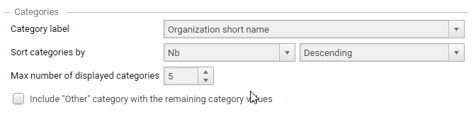

  - **Series** configuration
    - Select **series label**  column from the view to use be used as the chart category label
    - You can optionally **Sort series** by value, label or not sorted (natural order).
    - For readability matters, you must limit the number of series in the chart ( default 5, maximum 50)
    - Check **Include other with the remainders**  to gather the rest of the series into one single series labelled _Other_.  
    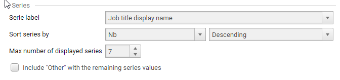

### Notes on Multi-chart Data

The view for a multi series chart must provide values for the chart in the following way:

- Each row of the view provide data for one category and series combination , with at least 3 columns for the category label, the series label and the value. (see example below)
- Additional columns may be needed for linking information (such as internal ids)

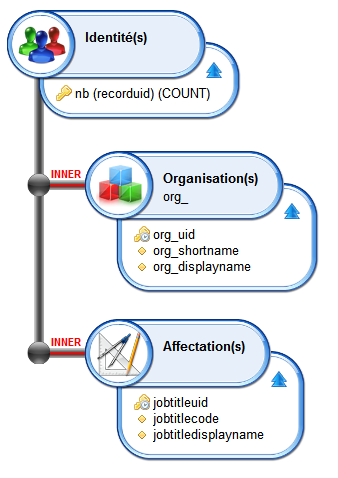

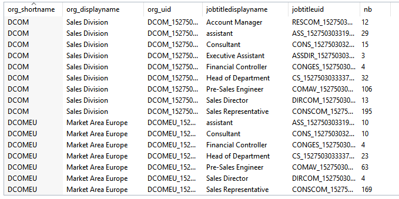

## Single series History Charts

History chart display one value evolution over a number of time periods, either as a line or bar chart.

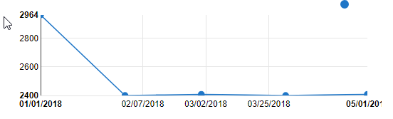

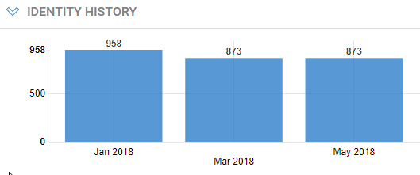

You create a single-series history chart using the  icon in the dashboard toolbar.

### Single-series History Chart Configuration

- **Basic** tab : sets the chart general characteristics
  - **Title** : Sets the text to be displayed in the chart's title bar
  - **Type :** defines the type of the chart among the two available types ( **line** or **bar**)
  - **Style :** allows to define the color scheme to use for the charts bars, from a list of available color scheme.
If the number of values in the chart exceeds the number of colors defined in the scheme, colors are cycled.
  - **Display options:**  various chart flags depending on the chart's type
    - **Show legend** :  allows to display a separate legend above the chart .
    - **Stagger series labels**  ( bar chart) to display bar labels on two lines.
  - **Size** : Sets the chart's display size, expressed in columns and rows. See **Dashboard layout**  section for more information

- **Search**  tab : allows to select a **rule**  that will determine the entities from the Identity Ledger that will be in the scope of the chart. For example "All active entities", or "Orphaned Accounts".
See **dashboard data access components**  section to understand what rules are displayed and how to add your own ones.
  - **Search on**  list allows to select the kind of entities to search for (Accounts, Application, Asset, Group, Identity, Organization, Permission, Repository or Usage) and will filter the list of rules accordingly.
  - **Rule** : lists and allows to select a rule for the selected entity kind.
  - **Params...**  button allows to defines rule parameters if any.  (See § _Rule parameters_ for details)
  - **Test**  allows to check the result of the rule , using the parameter values if any.  

- **Chart data settings** : define a source view for the chart value to display, date formatting and optional sorting/limiting data options.  
  - **View** drop down list allows to select the view to produce values for the chart.
Only views that target the same entity ( account, people, organization, etc.) as the selected search rule are displayed.
These views must also provide exactly one numerical value.  
The selected view may have parameters which can be set by clicking the **Params...**  button (See § _View parameters_ for details)
  - **Chart value** : read/only field automatically set to the single numerical value column of the view.
  - **Time slots** configuration :
    - **Date Format** : allow to select or type a custom format to use for displaying time slot dates on the x axis. see Formatting Dates section below.
    - **Max displayed time slots** : limits the number of time slots to display. For example, typing 5 will display the last 5 timeslots, including the current one.
    - **Reference time slots only** : displays only the last _reference_ time slots.
This is typically useful when the period of data collection is more frequent than the period of analysis (_e.g._ daily vs. weekly or monthly).  
Time slots can be marked as -Reference- through a post-collect workflow. See [How to define and use Reference Timeslots](../../how-to/workflow/reference-timeslots)

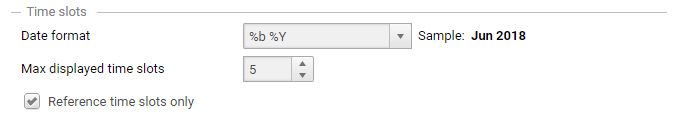

#### Date Formatting

You can format dates on the y axis using the following localized tokens:

| Token | Description                                                 | Example                  |
| :---- | :---------------------------------------------------------- | :----------------------- |
| %a    | abbreviated weekday name                                    | Mon                      |
| %A    | full weekday name                                           | Monday                   |
| %b    | abbreviated month name.                                     | Nov                      |
| %B    | full month name.                                            | November                 |
| %d    | zero-padded day of the month as a decimal number `[01,31]`  | 01 for 2018/07/01        |
| %e    | space-padded day of the month as a decimal number `[1,31]`  | 1 for 2017/07/01         |
| %j    | day of the year as a decimal number `[001,366]`             |                          |
| %m    | month as a decimal number `[01,12]`                         | 07 for July              |
| %U    | Sunday-based week of the year as a decimal number `[00,53]` | 26 for Sunday 2018/07/01 |
| %w    | Sunday-based weekday as a decimal number `[0,6]`            | 0 for Sunday 2018/07/01  |
| %W    | Monday-based week of the year as a decimal number `[00,53]` | 25 for Sunday 2018/07/01 |
| %x    | the locale's date, such as `%-m/%-d/%Y.*`                   | 07/01/2018               |
| %y    | year without century as a decimal number `[00,99]`          | 18 for 07/01/2018        |
| %Y    | year with century as a decimal number.                      | 2018                     |

For example, %b - %Y will format 07/01/2018 as Jul - 2018.

You can also select from predefined formats:

- Short date : equivalent to %x
- Month number / Year : equivalent to %m/%y
- Abbreviated month / Year : equivalent to %d-%y
- Month / day : equivalent to %m/%e

#### Data for Single-series History Chart

The view for a single series history chart must provide only one column with the numerical value to display.
related attributes and any link-related attributes.
The view must return only one value when executed in the studio.

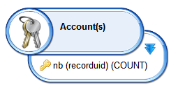
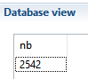

## Multi-Series History Chart

History chart display series values evolution over a number of time periods, either as stacked areas, multi-bar or multi-line chart.
It could be for example, evolution of #employee per job, #accounts per repository, etc.

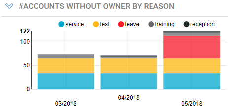

You create a multi-series history chart using the  icon in the dashboard toolbar.

### Multi-series History Chart Configuration

- **Basic** tab : sets the chart general characteristics
  - **Title** : Sets the text to be displayed in the chart's title bar
  - **Type :** defines the type of the chart among the two available types ( **line** or **bar**)
  - **Style :** allows to define the color scheme to use for the charts bars, from a list of available color scheme.
If the number of values in the chart exceeds the number of colors defined in the scheme, colors are cycled.
  - **Display options:**  various chart flags depending on the chart's type
    - **Show legend** :  allows to display a separate legend above the chart .
    - **Stagger series labels**  ( bar chart) to display bar labels on two lines.
    - **Grouping mode** : how the series bars in each category should be grouped:  **Side by side**  , **Stacked** or **Stacked at 100%.**  
In line mode, stacked mode display the series as stacked areas, not lines.
  - **Size** : Sets the chart's display size, expressed in columns and rows. See **Dashboard layout**  section for more information

- **Search**  tab : allows to select a **rule**  that will determine the entities from the Identity Ledger that will be in the scope of the chart. For example "All active entities", or "Orphaned Accounts".
See **dashboard data access components**  section to understand what rules are displayed and how to add your own ones.
  - **Search on**  list allows to select the kind of entities to search for (Accounts, Application, Asset, Group, Identity, Organization, Permission, Repository or Usage) and will filter the list of rules accordingly.
  - **Rule** : lists and allows to select a rule for the selected entity kind.
  - **Params...**  button allows to defines rule parameters if any.  (See § _Rule parameters_ for details)
  - **Test**  allows to check the result of the rule , using the parameter values if any.  

- **Chart data settings** : define a source view for the chart values and series to display, date formatting and optional sorting/limiting data options.
  - **View** drop down list allows to select the view to produce values for the chart.
Only views that target the same entity ( account, people, organization, etc.) as the selected search rule are displayed.
These views must also provide exactly one numerical value.
The selected view may have parameters which can be set by clicking the **Params...**  button (See § _View parameters_ for details)
  - **Chart value** : read/only field automatically set to the single numerical value column of the view.
  - **Time slots** configuration
    - **Date Format**  : allow to select or type a custom format to use for displaying time slot dates on the x axis. see Formatting Dates section below.
    - **Max displayed time slots**  : limits the number of time slots to display. For example, typing 5 will display the last 5 timeslots, including the current one.
    - **Reference time slots only** : displays only the time slots that are labelled as _Reference_. This is typical useful when the period of data collection is more frequent than the period of analysis.  

  

- **Series** configuration:
  - Select **series label**  column from the view to be used as the chart series label
  - You can optionally **Sort series** by value, label or not sorted (natural order).
  - For readability matters, you must limit the number of series in the chart ( default 5, maximum 50)
  - Check **Include other with the remainders**  to gather the rest of the series into one single series labelled _Other_.

see [here](#date-formatting) for more information on the date formatting

#### Data for Multi-series History Charts

The view for a multi-series history chart must provide one column with the numerical value to display and one or more columns for the series (series label, series unique id, etc..)
It need not contain timeslot related attributes and any link-related attributes.
The view must return one row per series.

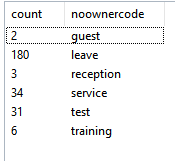
