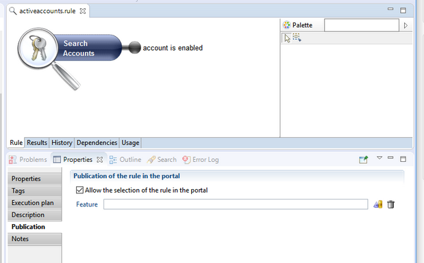
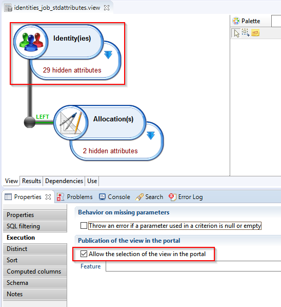
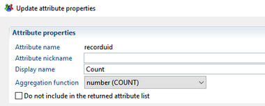
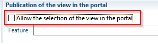
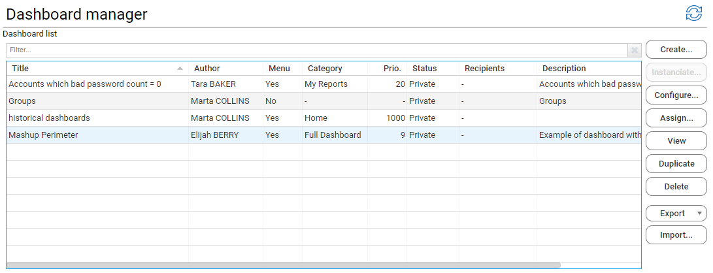
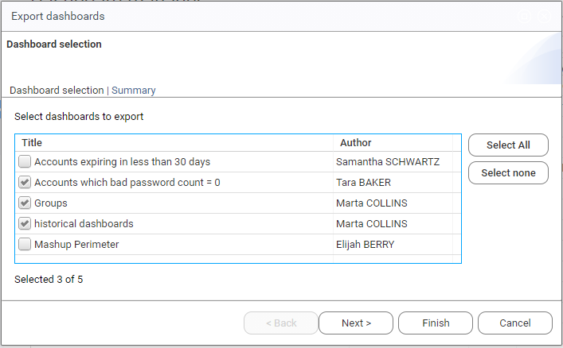
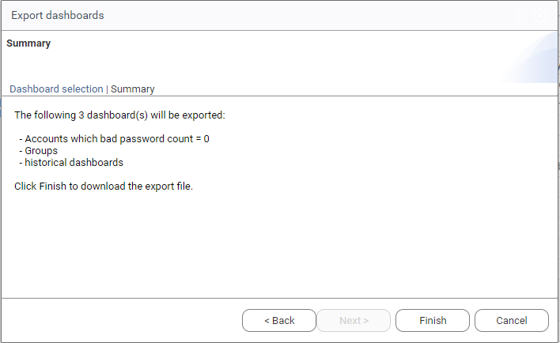
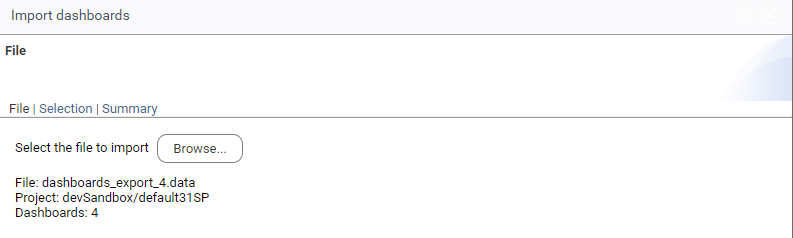
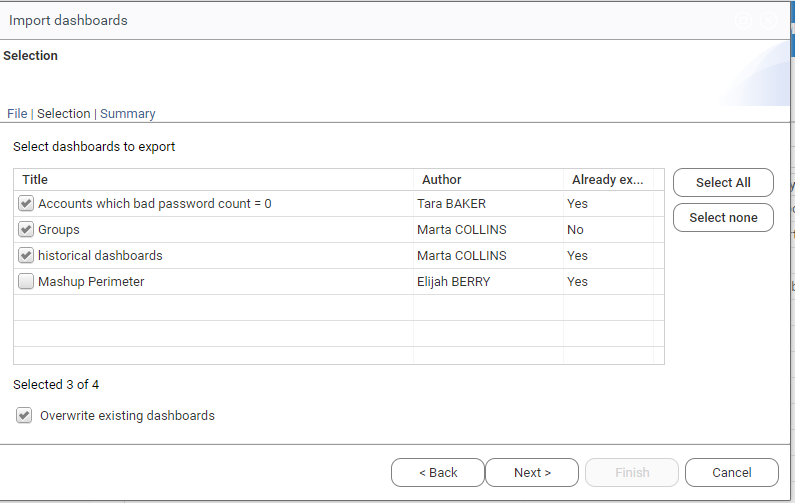

# Dashboard customization

## Add Custom Data Accesses

### Create Specific Data Access Components

Dashboards need two data components to access data from the Identity Ledger:

- **Rules** determine the scope of entities in the Identity Ledger that will be displayed in the dashboard. For example "Active accounts", or "people in the Finance department" . Dashboard rules can have parameters.
- **Views** determine how the entities selected in the rules will be displayed. The view provides a set of columns to access direct attributes of the entity (_e.g._ email or an account) , attributes of related entities (_e.g._ job title of an identity) or count entities according to some criteria (_e.g._ number of accounts by organization ).

The standard **Mashup Dashboards Support** add-on that you have included in your project comes with a number of predefined views and rules that gives access to common identity data, in nine categories:

- Accounts
- Application
- Asset
- Group
- Identity
- Organization
- Permission
- Repository
- Usage

These views and rules cover the most common use cases. However, you can also build your own rules and views for more specific needs, using the Studio.

### Create a Rule for Dashboards

To create a rule to be used in your dashboard like any regular rule, using the Studio rule editor.
Some options are needed to be set for the rule to be available for selection in the dashboards:

- Check **Allow the selection of the rule in the portal**  in the **Publication** tab in the rule's **Properties**  panel  

Dashboard rules can have any number of parameters. It is recommended to place the rules available for use in a dashboard in the folder `rules/webportal/dashboard` sub-directory. This will facilitate maintenance of said rules.  

#### Rule Design Feature

By default, a rule will be available to all dashboard designers. However, if you want your rule to be available only to a sub-set of designers, for example because it's costly to compute, or because it's not relevant to others, you can associate a **design feature**  to this rule. The rule will then be visible in the design editor to all designers that are authorized for this feature.

> The end-users that will use the dashboard do not need to be authorized for the feature.

The best practice is to declare a different feature for each rule, then grouping them using feature sets that are then associated to specific users.

### Create a View for Dashboards

Views determine how entities retrieved by rules will be displayed in the dashboards.  
The view provides a set of columns to access, the direct attributes of the entity (_e.g._ email or an account), attributes of related entities (_e.g._ job title of an identity) or count entities according to some criteria (_e.g._ number of accounts by organization ).  
Views to be used in dashboards are built as any regular view, using the Studio view editor. All view types can be used: audit view, business View or audit Logs view.

For the view to be available to dashboard designers, you must do the following:

- Check **Allow the selection of the view in the portal**  in the **Execution** tab in the views **Properties**  panel

This view will then be available for dashboard components that target its main entity.  
The view's main entity is the top level entity of the view, Identity in the above example.  
It can be changed to target any other entity in the view using **Toggle web portal search anchor** menu item.

It's recommended to set labels on each attribute of the view to something readable for the end-user. This also avoids the systematic re-labeling of the attributes by the dashboard designer.For example, when defining an aggregate column, it should be labelled "Count" or something similar. Nationalized labels can be set using the small flag icon.

#### Using Business Views in Dashboards

Business Views can be used to feed dashboard components like any other views.

- Make sure the business view's **Allow the selection of the view in the portal** option in the configuration tab is checked,
- Make sure the business view's inner view's **Allow selection in portal** option is **NOT CHECKED**.
- the business view will be available for dashboard components that target the business view's inner view main entity.

#### View Design Feature

By default, a view will be available to all dashboard designers. However, if you want your view to be restricted to some designers, for example because it's costly to compute, or because it's not relevant to others, you can associate a **design feature**  to this view. The view will then be visible in the design editor to all designers that are authorized for this feature.

## Dashboard Management Page

The **Dashboard Management** page allows **dashboard designers** to create, configure and delete dashboards. The **platform administrators** are in addition authorized to export and import dashboards in the same environment or across different environments. This page is not available to regular users of the web portal.

Select **Manage Dashboards** from the top left portal menu to open the dashboard management page.

The page presents a list of dashboards and a set of action buttons.

The dashboard list allows single or multiple selection of dashboards, using standard keys and mouse operations:

- **mouse click** to select one dashboard
- **shift+mouse click** to extend multiple selection range
- **shift+up/down** arrows to extend multiple selection range
- **ctrl+mouse click** to toggle item selection status

The list of dashboards displays the following information for each dashboards:

- **Dashboard title**
- **Dashboard author** (for platform administrators)
- **Menu**: whether the dashboard is listed in the navigation menu bar
- **Category** : in which case , the menu category which includes the dashboard
- **Prio.**": priority of the menu in its parent category.  The higher priorities are the end of the list
- **Status** : Sharing status of the dashboard ( could be Private or Shared)
- **Recipients** : when shared, the sharing criteria for the dashboard
- **Description** : dashboard description if provided.

You can sort dashboards in the list according to each column by clicking on the column header.  
You can also filter the displayed dashboards by title or description by entering a filtering pattern in the filter box above the list. For instance, typing "stats" will display only the dashboards that have the word stats in their title or description.

The displayed dashboards and set of actions are the following , depending on user's profile:

**Dashboard designer** profile:

- **Dashboard List** : list of dashboards created by the current user.
- **Create** button : allows to create a new dashboard. This is the only place where a dashboard can be created.
- **Instanciate** button : allows to instanciate the selected template dashboard. This button is disabled if the selected dashboard is not a template or if more than one dashboard is selected.
- **Configure** button: allows to change the characteristics of the selected dashboard (_e.g._ title, category) and its publication state, but not to edit its content.  Disabled if not exactly one dashboard is selected.
- **Assign** button: allows to reassign one or more selected dashboards to another designer, so that he can take over.
- **View** button: navigates to the dashboard page, to view or edit the dashboard content. Disabled if not exactly one dashboard is selected.
- **Duplicate** button: creates a copy of the selected dashboard.  Disabled if not exactly one dashboard is selected.
- **Delete** button : permanently deletes one or more selected dashboards.

**Platform administrator** profile:

- **Dashboard List**  : List of all dashboards present in the current environment, whoever the creator.
- **Create** ,**Instanciate**, **Configure** , **Assign**, **View** , **Duplicate** and **Delete** buttons with the same behavior.  
Note that the _platform administrator_ can only edit the content of dashboards he has created, granted that he also has the _designer_ role.
- **Export** menu button : allows to export either the whole list of dashboards or the currently selected dashboards.
See section below for details.
- **Import** button: allows to import an exported set of dashboard from a file to the current environment.  
The import merges the imported dashboard with the existing one as follows:
  - The imported dashboards are added to the existing one (no dashboard is deleted)
  - If a dashboard already exists in the current configuration (because it was imported before, not because it has the same title), the imported dashboard will replace the existing one.
  - If the dashboard creator cannot be identified, the dashboard will be assigned to the current user (that is, the **platform administrator** )

### Export Dashboards

The Export menu button allows platform administrators to export either the whole list of dashboards or a selection of dashboards to a file on their local computer.  
This file can then be used for backup purposes, to copy the dashboards from an environment to another (_e.g._ from test to production) or to share specific dashboards between designers.  
Selecting either menu item will open the dashboard export wizard, which consists of 2 pages:

- **Dashboard selection** : allows to select the dashboards that will be actually included in the export file.

- **Summary** : list the dashboards that will actually be includes in the export file.
Click Finish to create the export file and download it to your computer.  
The export file is named **dashboards_export.data** by default.

### Import dashboards

You can import all or part of exported dashboards through the dashboard import wizard

The wizard consists of 3 pages:

- **file selection** :  this page allows to select a file to import with .data extension.  
After the file content has been analyzed, either information on the file with be displayed if the content is valid, or an error message will be displayed if the file is not valid and cannot be imported, typically if a required project resource, such as a view or a rule, is missing in the current environment.  
Note that only the first error is displayed and needs to be fixed (_i.e._ add to missing view or rule) before starting over to import the file.

- **dashboard selection** : this page displays the list of dashboards contained in the import file, and allows to select which dashboards to import.  
This list indicates for each dashboard whether it already exists in the current configuration (because it was imported before, not because it has the same title).  
In which case, you have to either uncheck the dashboard to exclude it from the import or check the "Overwrite existing dashboards" option to force all existing dashboards to be replaced.  
The list also displays the author of each dashboard, as found in the export file. If the author cannot be found in the current configuration, it is replaced by the current user (_i.e._ platform administrator). You will have to manually reassign the dashboard to an alternate valid designer.

- **Summary** : This page recaps the list of dashboards selected for import, and if they are going to replace existing ones.
Click on Finish to perform the actual import, or Cancel to abort and get back to the management page.

## Dashboard Tips & Tricks

### Optimize Performances

If you observe that one of your component takes time to be executed, try to :

1. In the search property, use a non filtering rule (_e.g._ search all accounts instead of search all active accounts)
2. Apply previous filtering criteria into the view/business view (_e.g._ accounts with disabled attribute value equals to false or null)
