# Table of contents
{: .no_toc .text-delta }

1. TOC
{:toc}
---

# Dashboards: an Introduction
## Audience

This documentation is intended for the following personas:   

- _Dashboard Designers_ that are functional users in charge of designing dashboards and sharing them with other users, directly from a web browser. They must have the **designer** role.
- _Technical consultants_ that have access to the iGRC platform to perform technical tasks such as installing components, creating or modifying views and rules, managing roles ...
- _Platform Administrators_: administrators of the iGRC platform or users with the **igrc_administrator** role.

## Brainwave Context

As of Brainwave iGRC 2017 a new functionality has been implemented that allows functional users to design their own dashboards directly from the web portal and share them with selected users.   

Dashboards include tables, charts (bar, horizontal bar, pies and doughnuts) and gauges. They will display in various formats any data coming from Audit Views (including  Business Views, and Audit Logs Views). Furthermore the displayed data can be optionally filtered to target a given population (e.g. people in Finance department, accounts with system privileges, etc.) , leveraging all the richness of iGRC Identity Ledger.   

Following is a example of a Dashboard:   

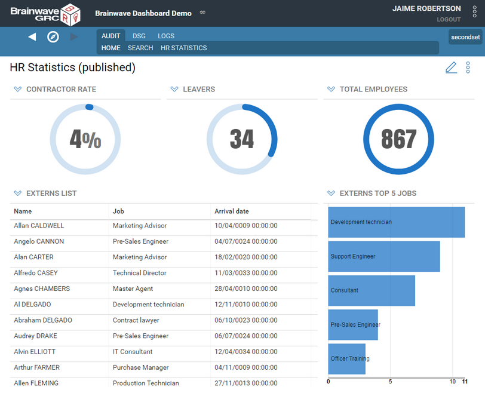   

Creating dashboards requires 4 steps:   

1. Preparing your environment for dashboard design. This action is performed only once.
2. Creating dashboards using the web portal.
3. Creating specific data access components for your dashboards using the Studio.
4. Publishing the dashboards to other users.

These steps will be detailed in the next pages.

# Installation


To enable the use and creation of dashboards in the webportal it is required to install some components in the studio and to perform a series of configuration operations before deploying the webportal.

1. Install Brainwave IGRC Platform 2017 R2 (see installation instructions)
2. Launch IGRC Studio and open or create an Audit project
3. Install the required "Mashup Dashboards Support" facet:
    1. Click on the link [Mashup dashboards support](http://marketplace.brainwavegrc.com/package/bw_dashboard/) to Download the Add-on from the **Brainwave MarketPlace**  
This add-on includes a large set of predefined views and rules for commonly used data and two predefined resource templates (default and flatcolors) to be used in your dashboard.
    2. Install the facet file in your project
4. Declare the dashboard resource templates to be used in your dashboards. Resource templates include chart styles and dashboard layout templates.
    1. Open the **technical configuration**  of your project, **web portal**  tab, **dashboard resource templates** and make sure at least **default** dashboard resources template is selected.  
You can select more than one resource templates using the button to the right.   
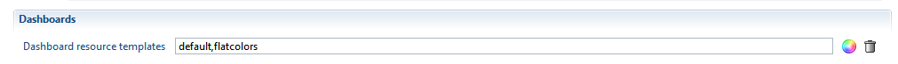

5. Grant the **designer** role to the Dashboard Designers to allow them to **design** and share dashboards. This is done in the `.role` files located in the `webportal\features` folder  
6. Export the web portal and deploy it to your web application server.

| **Note**: <br><br> Users do not need any specific role to access dashboards that have been shared with them|

# Create a Dashboard


The following steps show how a designer can create a dashboard in the web portal:

- Log in to the web portal as a dashboard designer ( with '**designer**' role)  
- Select **Manage dashboards**  from the menu to the top right corner of the page

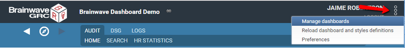   

- The **Manage dashboards**  page displays the complete list of dashboards created by the current user. Please see the **Managing dashboards** section for more information.

| **Note**: <br><br> Users that do not have the dashboard design role will not see this menu item.|

- Click **Create** button to create a new dashboard
- Give the newly created dashboard a title using the **Title** box. It is recommended to use short titles to save screen space
- Fill in the dashboard description if necessary. This field is used to explain the purpose of the dashboard.
- To display the dashboard in a different top-level menu use the **Category** box.
  - If the category is left empty, the dashboard will be displayed in the first top-level menu: **Audit**  
  - Menus are sorted alphabetically.  

>> 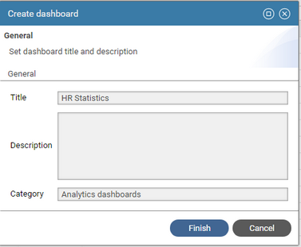   

- Click **Finish** to create the dashboard with no content.
- The new dashboard appears in the **Dashboard list,**  as well as in the portal menu bar, at the specified position.

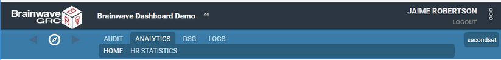   

- Select the dashboard from the list and click **View** to open the dashboard page.   

Alternatively, you can also select it from the menu bar.

# Add Content

To modify a dashboard's contents:

- Display the dashboard (either by selecting it in the menu, or from the dashboard manager list)
- Click on the pencil icon to the right of the dashboard title,     

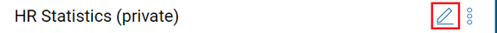    

- Alternatively, select the **Edit...** menu item from the dashboard menu
- The dashboard design toolbar is displayed:  

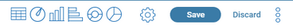    


The table below describes the purpose of the toolbar's buttons:

|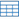 | Inserts a table component at the end of the dashboard |
| | Inserts a gauge component at the end of the dashboard |
|| Inserts a vertical bar char component at the end of the dashboard |
|| Inserts a horizontal bar chart component at the end of the dashboard |
|| Inserts a doughnut chart component at the end of the dashboard |
|| Inserts a pie chart component at the end of the dashboard |
|| Allows to configure the dashboard properties (title, layout scheme, publication options) |
| **Save** | Saves the dashboard changes to the database. If the dashboard is published, this will make the changes available to the dashboard audience |
|  **Discard** | Discards all the changes since the last save. |

To add components to your dashboard, click on one of the first icons in the toolbar.   
This will display the components configuration wizard.

Before adding content to your dashboard, It's recommended to think of the overall design of the dashboard (number and type of components) then to define its layout scheme.

# Configure the Dashboard Layout

Dashboard components are arranged according to a **grid layout** , where the display space is divided in a fixed number of columns and a varying number of rows.   
Grid layouts are commonly used in web design to ensure clarity and readability of the displayed content whatever the size of the display and because it's easy to put in place (no pixel headaches).   
Each component of the dashboard can span one or more columns and one or more rows of the grid, but it cannot cover a fractional part of a grid cell.   

To define the layout of your dashboard, do the following:   

- Click the configuration icon or select the **Configure** menu item from the dashboard menu to open the dashboard configuration wizard
- Select the Layout tab  

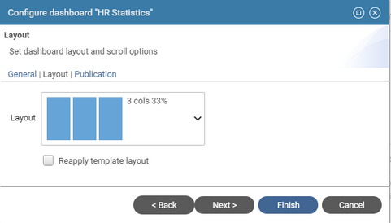

- Select one **Layout** scheme from the list of predefined layouts.    
You can select either a simple columnar scheme (_e.g._ 1 column, 2 columns, 3 columns, 4 columns) or a more complex scheme (_e.g._ 3 columns + full ).
- Check **Re-apply template layout**  to force arranging the dashboard content according to the selected layout , in case the components have been moved or resized manually.   
Dashboard content is automatically arranged if another layout scheme is selected.
- Click **Finish** to set the layout scheme to use when components are added.   

Each new component will be added to the end of the dashboard, following the currently selected layout scheme.   
You can modify the position and size of a component while in edition mode using either ways:    

- **Resize** through component **Edit** \> **Basic** tab \> **Size** fields (except for gauges which are always 1x1 )
  - type a number for **Columns**  ( up to the number of columns in the dashboard layout scheme)
  - type a number of **Rows** ( unlimited)
- **Move**  a component by holding down the mouse over the component title bar (the cursor will change to a cross hair) and dragging around until its correct place.
- **Resize** a component by holding down the mouse over the resize corner (the cursor will change to an oblique double arrow) and dragging around to resize the component.
- A light grid outline is displayed to materialized the current grid layout setting. You can turn it off by unchecking **Display Grid**  option in the dashboard menu.

Once the layout is set, you can add widgets to your dashboard, they will automatically be placed and sized according to the selected layout.


# Dashboard Components

## Introduction

### Dashboard Components
---

The following section details the available components and variations for use in dashboard and how to configure them:    

- Tables
- Indicators (gauge or numeric)
- Basic charts ( bars, horizontal bars, pies, and doughnuts)
- Indicator groups ( gauge, numeric and rows)
- Multi-serie charts ( bars and horizontal bars, stacked or side by side series)
- Historical charts (single or mult-serie, bar, line and stacked areas )

|  |  |
| | |
|  |  |

### Data Management in Components

Except for indicators, dashboards components determine the data to display based on the combination of two factors:   

- **Search Rule** : determines which are the ledger entities (identities, accounts, etc.) involved in the component
- **Data View** : determine what parts or computations of the entities retrieved from the search to display.   
Depending on the component, this could be:
  - Table: selection of attributes
  - Chart : aggregated attributes as the values, and attributes as the categories / series of the chart   

For indicators and indicator groups, only search rules are used, and the count of entities from the search will make the value to display.   

Both search rules and data views can have parameters ( see below for details).

### Component Configuration

The following pages detail the configuration of each of the components:

[Table Component]({{site.baseurl}})   
[Indicator Component]({{site.baseurl}})   
[Basic Chart Component]({{site.baseurl}})    
[Indicator Groups]({{site.baseurl}})   
[Multi series charts components]({{site.baseurl}})   
[Single serie history charts]({{site.baseurl}})   
[Multi-series history chart]({{site.baseurl}})    

Don't forget to **Save** the dashboard when you are satisfied with the arrangement of components, or **Discard** changes to revert to the previous layout.

### Search Rules Parameters

Search rules used in dashboards Tables, Charts and Gauges may have parameters. These are called **secondary parameters** as opposed to the dashboard's main parameters.   
Rule parameters must be used to filter the entities that are displayed or accounted for in the widget ( the widget's scope).    
These seconday parameters are configured by clicking the **Params...** button.  
This opens the **Edit Rule Parameters** dialog box which allow to define values for each of the rule parameters.   

For each rule secondary parameter, you can set the parameter **Source** and **Value.**   

- **Value** : the rule parameter value is a fixed value that must set at design-time (typed or selected from a list of possible values)
- **Dashboard Parameter** : the rule parameter value will be taken from one of the dashboard's main parameters runtime values
- **User Attributes** : the rule parameter will take its value from one of the currently connected user attributes   

You can also select **None** as the source, to leave the parameter empty, if it's not mandatory.   

See [Secondary Parameter Configuration]({{site.baseurl}}) for detailed explanations on the different sources.

### Data View Parameters

Views used in dashboards' tables and charts may have parameters. These are called **secondary parameters**  as opposed to the dashboard's main parameters.    

View parameters must be used to filter secondary entities or information retrieved by the widget's view only, to ensure optimal execution performance.    
Consider for example, a table that displays accounts and groups the accounts belong to, for a given repository. Here the main entity is the account, and should be filtered by its repository in the table's rule. The groups are secondary entities and should be filtered using view parameters.    
Using view parameters to filter the main widget's entity (ie the search rule's entity) in the view or both in the rule and in the view may result in slow downs.


## Table Component

The table component displays information from the Identity Ledger in columns and rows. The table can be re-sorted by clicking on the headers and can be exported as CSV or Excel file by clicking on the downward arrowhead icon.


### Table Configuration

- **Basic** tab : sets the table general characteristics
  - **Title** : Sets the text to be displayed in the table's title bar
  - **Size** : Sets the table's display size, expressed in columns and rows. See **Dashboard layout**  section for more information   

- **Search**  tab : allows to select a **rule**  that will determine the entities from the Identity Ledger that will be in the scope of the component. For example "All active entities", or "Orphaned Accounts".   
See **dashboard data access components**  section below to understand what rules are displayed and how to add your own.
  - **Search on** : Allows to select the kind of entities to be displayed in the table (Accounts, Application, Asset, Group, Identity, Organization, Permission, Repository or Usage) and will filter the list of rules accordingly.
  - **Rule** : lists and allows to select a rule for the selected entity kind. The rule may have parameters which can be set by clicking the **Params...**  button.  
See § _Rule parameters_ for details
  - **Test**  allows to check the result of the rule , using the configured parameter values if any.  

- **Table View Settings**  tab: Used to select of the columns to be displayed in the table, and a default sort order for the table rows.
  - To select the columns to display do the following:
    - Select one of the presentation views. Please note that only views that targets the rule's entity kind will be displayed.    
The View may have parameters which can be set by clicking the **Params...**  button (See § _View parameters_ for details)  
The list of columns below display the columns that are defined in the view  
    - Select one or more columns and add them to the table by clicking on the **\>**  button
    - Your can reorder the columns using the **Up**  and **Down**  buttons
  - Select a item from the **Sort By**  list to define the default sort column order for the table rows, and select **Ascending** / **Descending** sort direction.

- **Customization**  tab: Used to customize column labels, width and alignment.
  - To change the width, label or alignment of a column , select the column and click on the **Edit...**  button
  -  The **Auto**  width corresponds to a 150 pixel width
  - You can also set a column width directly by clicking between two column headers and dragging to a specific position. The column width will be preserved when saving the dashboard.

## Indicator Component

The Indicator component displays a numerical value as a radial gauge or in text format. The displayed value can be absolute or percentage.   
The gauge may also display a trend (comparison with the previous timeslot) and thresholds markers if enabled.

]
]

### Indicator Configuration

- **Basic** tab : sets the gauge general characteristics
  - **Title** : Sets the text to be displayed in the component's title bar
  - **Display as:** to set whether the gauge will be displayed as a radial chart or as a text value.
  - If **Display value as a percentage**  is checked, you will have to define the maximum value from which the percentage is computed ( value / maximum value).
  - **Style:**  to define the color scheme for the main gauge dial, either as a flat or gradient color, from a list of available color schemes.
  - **Size** : the size of a gauge cannot be configured. It always covers one cell of the grid layout ( 1 column and 1 row)     
  <br>


- **Value**  tab : defines how the displayed value is computed.
The computation consists of two parts:
  - **1 -** the **Scope** of the gauge, that is the entities from the Identity Ledger that will be part of the figure. For example "All active entities", or "Orphaned Accounts".
  The scope can be defined in two ways:  
    - **Simple mode** :  directly select your criteria in free search mode.
      - select the entity to search on
      - then select your criteria in assisted mode
    - **Advanced mode** : selecting an existing rule from the project.
    (See **dashboard data access components**  section below to understand what rules are displayed and how to add your own ones).
      - **Search on**  list allows to select the kind of entities to search for (Accounts, Application, Asset, Group, Identity, Organization, Permission, Repository or Usage) and will filter the list of rules accordingly.
      - **Select Rule**  lists and allows to select a rule for the selected entity kind. The rule may have parameters which can be set by clicking the **Params...**  button. (See § _Rule parameters_ for details)  
  - Click on **Test**  to check the result of the search or selected rule.   
   
 - **2** - the **Aggregation function** of the gauge. There are  5 aggregation functions:  
   - **Count** : the displayed value will be the number of items returned by the search or rule defined in the scope.
   - **Sum** :  the displayed value will be the sum of the numerical attribute selected in the **Value attribute** menu for all items returned by the search.  
   The available attributes are either numerical metadata attributes on the entity or default numerical attributes for this concept, as defined in the mashup chart views.   
   If you don't find the attribute you are looking for, you can build you own view and select it in the **Advanced** mode.
    - **Average** :  the displayed value will be the average value of the numerical attribute selected in the **Value attribute** menu for all items returned by the search.   
    - **Maximum** :  the displayed value will be the maximum value of the numerical attribute selected in the **Value attribute** menu for all items returned by the search.   
     - **Minimum** :  the displayed value will be the minimum value of the numerical attribute selected in the **Value attribute** menu for all items returned by the search.    

- **Maximum Value**  tab: allows to define a maximum value for computing a percentage value for the gauge.  
This tab is only available if **Display value as a percentage**  has been checked
  - Select **Fixed Value**  and type in a value, to use a static value as the denominator for the percentage
  - Select **From another search and value**  to have the percentage denominator dynamically computed based on another rule, search and aggregration function.  
For example to compute the _rate of contractors_ in the company, you would select "_contractors_" as the main search for the gauge, and "_total employees_" as the maximum search.   
<br>

]

- **Trend and evaluation**  tab
  - Check **Display trend**  to display a trend value and icon ( see below for explanations on options and how the trend is computed)
  - Check **Enable evaluation of value**  to enable evaluation and coloring of the value depending on thresholds ( red / orange if the value exceeds the thresholds)
    - Select **High Thresholds**  / **Low Threshold**  evaluation mode to set how evaluation is computed ( see **Threshold evaluation section** below, for computation details)
    - Enter values for **warning threshold** and **critical thresholds**  

### Displayed Indicator Values

**Current main value**  - the following value will be displayed, depending on the gauge setting:

- if **Display as percentage** is not checked : current main value  
  ( = count of entities in the main search , for the current time slot)
- if **Display as percentage** is checked : current main value / current maximum value   
  (= count of entities in the main search for the current time slot / maximum value , fixed or count from another rule)   

**Trend value**  - the following trend value will be displayed :   

-  If **Display as percentage**  is not checked: current main value / current maximum value    
( = the difference between the count of items of the main search for the current time slot and count of items of the main search, for the previous time slot )  
- if **Display as percentage** is checked: ( current main value / current maximum value) - ( previous main value / previous maximum value)

The previous value used for computing the trend is determined as follows:
- if **Use comparison timeslot** is checked: use the previous reference timeslot , if there is one, or the previous timeslot if no reference timeslots have been defined.
- if **Use comparison timeslot** is not checked: always use the previous timeslot and ignore reference timeslots.

**Threshold values**  are expressed as absolute values or percentages, depending on **display as percentage**  option.

**Threshold evaluation**  is computed as follows:   

- In **High thresholds**  evaluation mode:
  - Value is at critical level if higher or equal than (\>=) critical threshold
  - Value is at warning level if higher or equal than (\>=) warning threshold
  - Value is normal, otherwise ( if lower than warning threshold)
- In **Low thresholds**  evaluation mode:
  - Value is at critical level if lower than (\<=) critical threshold
  - Value is at warning level if lower than (\<=) warning threshold
  - Value is normal, otherwise ( higher than warning threshold)


## Basic Chart Components

The chart component displays a set of labelled values as a graphical chart.   
Four chart types are available:  **bar** , **horizontal bar** , **doughnut**  and **pie**.

   

   

### Chart configuration

Tabbed wizard configuration

#### Basic tab
This page sets the chart general characteristics
  - **Title** : Sets the text to be displayed in the chart's title bar
  - **Type :** defines the type of the chart among the four available types ( **bar** , **horizontal bar** , **doughnut**  and **pie)**
  - **Style :** allows to define the color scheme to use for the charts bars or wedges, from a list of available color scheme.
If the number of values in the chart exceeds the number of colors defined in the scheme, colors are cycled.
  - **Display options:**  for various chart flags depending on the chart's type
    - **Show legend** : (pie and doughnut charts)  allows to display a separate legend above the chart .
    - **Display serie labels inside bars**  (horizontal bar) **:** displays the value labels inside the bars, to cope with long labels and screen space, or to the left or bars, for short labels.
    - **Stagger serie labels**  ( bar chart) to display bar labels on two lines.
  - **Size** : Sets the chart's display size, expressed in columns and rows. See **Dashboard layout**  section for more information

#### Search tab
This page allows to define a **free search** or select a **rule**  that will determine the entities from the Identity Ledger that will be in the scope of the chart.
For example "All active entities", or "Orphaned Accounts".  
The search can be defined in two ways:  
    - **Simple mode** :  directly select your criteria in free search mode.
      - select the entity to search on
      - then select your criteria in assisted mode
      - click apply button to test the search
      - optionally click **Advanced** to switch to advanced mode.
    - **Advanced mode** : selecting an existing rule from the project.  
See **dashboard data access components**  section below to understand what rules are displayed and how to add your own ones.
      - **Search on**  list allows to select the kind of entities to search for (Accounts, Application, Asset, Group, Identity, Organization, Permission, Repository or Usage) and will filter the list of rules accordingly.
      - **Rule** : lists and allows to select a rule for the selected entity kind.   
      - **Params...**  button allows to defines rule parameters if any.  (See § _Rule parameters_ for details)
      - **Test**  allows to check the result of the rule , using the parameter values if any.  

#### Chart data settings
This page defines chart values, chart category labels, and optional sorting/limiting data options.  
There are two ways of defining chart data:
- **Simple mode**: simply select attributes for value and category from a predefined list that covers common cases:
   - **Chart value** select the attribute to use as a value for chart points. The following attributes are available by default for selection:
       - one **computed from search** agregate attribute computed by counting items matching the search criteria in each category
       - all **metadata numerical attributes** associated to the chart entity as defined in the project metadata.
  - Select **Category label** from a list of predefined category labels that cover common cases for the chart entity   


 - **Advanced mode** : select value and label attribute from a custom-defined **view**
      - **View** drop down list allows to select the view to produce values and labels for the chart.    
    Only views that target the same entities ( account, people, organization, etc.) as the selected search rule are displayed.  
    The selected view may have parameters which can be set by clicking the **Params...**  button (See § _View parameters_ for details)
      - **Chart value** :  select an attribute from the view to use as the chart value points.  Numerical and agregate attributes from the view are available for selection.
      - Select **Category label**  column from the view to use be used as the chart category label

- You can optionally **Sort categories**  by count value, label or not sorted (natural order)
- For readability matters, you must limit the number of items in the chart ( default 5, maximum 50)
- Check **Include other category with the remainders**  to gather the rest of the values into a single category labelled _Other_.


## Indicator Groups

The purpose of **Indicator groups**  is to simplify the layout of numerous inline indicators, and provide a more readable output.   
Moreover, a new **text line** layout displays many indicators vertically in a compact manner.

|**Radial Gauge** layout <br> ]|
| **Text Line**  layout <br>  |

Create an indicator group using the     icon in the mashup edition toolbar.  

### Configure Indicator Groups

- **Basic** tab:
  - **Title** : sets a global title for the indicator group. This title can include parameters
  - **Display as** : selects the type of indicators in the group. All indicators in a group share the same type.  
There are three different types :
    - **Radial Gauge** : indicators are displayed in a horizontal row of circular gauges
    - **Numeric** : indicaotrs are displayed in a horizontal row of numeric indicators
    - **Text line** : indicators are displayed in a vertical row of lines of text.   
  - **Size** : Sets the chart's display size, expressed in columns and rows. See **Dashboard layout**  section for more information   


- **Indicators** tab: allows to add, edit, delete and reorder indicators in the group.
  - **Add** to create a new indicator to the group
  - **Edit** to edit the selected indicator
  - **Delete** : to remove the selected indicator from the group
  - **Up / Down** : to move the selected indicator up and down in the list ( left/right on the display)

For conveniency, it's also possible to add, edit and delete indicators directly using icon buttons (you must use the **Indicators** tab to reorder indicators).    
Move the mouse over the indicators while editing a dashboard to have the buttons appear.    


## Multi Series Chart Components


Multi series charts display horizontal or vertical bars charts with more than one serie.   
Serie bars can be side by side, stacked or stacked to 100%.


### Multichart Configuration

- **Basic** tab : sets the chart general characteristics
  - **Title** : Sets the text to be displayed in the chart's title bar
  - **Type :** defines the type of the chart among the two available types ( **bar** and  **horizontal bar**** )**
  - **Style :** allows to define the color scheme to use for the charts bars, from a list of available color scheme.   
If the number of values in the chart exceeds the number of colors defined in the scheme, colors are cycled.
  - **Display options:**  various chart flags depending on the chart's type
    - **Show legend** :  allows to display a separate legend above the chart .
    - **Stagger serie labels**  ( bar chart) to display bar labels on two lines.
    - **Grouping mode** : how the series bars in each category should be grouped:  **Side by side** , **Stacked** or **Stacked at 100%**
  - **Size** : Sets the chart's display size, expressed in columns and rows. See **Dashboard layout**  section for more information     
  <br>


- **Search**  tab : allows to select a **rule**  that will determine the entities from the Identity Ledger that will be in the scope of the chart. For example "All active entities", or "Orphaned Accounts".   
See **dashboard data access components**  section to understand what rules are displayed and how to add your own ones.
  - **Search on**  list allows to select the kind of entities to search for (Accounts, Application, Asset, Group, Identity, Organization, Permission, Repository or Usage) and will filter the list of rules accordingly.
  - **Rule** : lists and allows to select a rule for the selected entity kind.   
  - **Params...**  button allows to defines rule parameters if any.  (See § _Rule parameters_ for details)
  - **Test**  allows to check the result of the rule , using the parameter values if any.    
  <br>


- **Chart data settings** : define a source view for the chart values, categories and series, and optional sorting/limiting data options.  
  - **View** drop down list allows to select the view to produce values and categories/series labels for the chart.    
Only views that target the same entities ( account, people, organization, etc.) as the selected search rule are displayed.   
These views must also provide exactly one numerical value.  
The selected view may have parameters which can be set by clicking the **Params...**  button (See § _View parameters_ for details)
  - **Chart value** : read/only field automatically set to the single numerical value of the view.
  - **Categories** configuration
    - Select **Category label**  column from the view to use be used as the chart category label
    - You can optionally **Sort categories**  by value, label or not sorted (natural order).   
Sorting by value means the total values of all the series in each category
    - For readability matters, you must limit the number of categories in the chart ( default 5, maximum 50)
    - Check **Include other category with the remainders**  to gather the rest of the values into a single category labelled _Other_.   
        
    <br>


  - **Series** configuration
    - Select **Serie label**  column from the view to use be used as the chart category label
    - You can optionally **Sort series** by value, label or not sorted (natural order).    
    - For readability matters, you must limit the number of series in the chart ( default 5, maximum 50)
    - Check **Include other with the remainders**  to gather the rest of the series into one single serie labelled _Other_.  
    

### Notes on Multichart Data

The view for a multiseries chart must provide values for the chart in the following way:

- Each row of the view provide data for one category and serie combination , with at least 3 columns for the category label, the serie label and the value. (see example below)
- Additional columns may be needed for linking information (such as internal ids)


## Single Serie History Charts


History chart display one value evolution over a number of time periods, either as a line or bar chart.

   

    

You create a single-serie history chart using the  icon in the dashboard toolbar.    

### Single-Serie History Chart Configuration

- **Basic** tab : sets the chart general characteristics
  - **Title** : Sets the text to be displayed in the chart's title bar
  - **Type :** defines the type of the chart among the two available types ( **line** or **bar**)
  - **Style :** allows to define the color scheme to use for the charts bars, from a list of available color scheme.   
If the number of values in the chart exceeds the number of colors defined in the scheme, colors are cycled.
  - **Display options:**  various chart flags depending on the chart's type
    - **Show legend** :  allows to display a separate legend above the chart .
    - **Stagger serie labels**  ( bar chart) to display bar labels on two lines.
  - **Size** : Sets the chart's display size, expressed in columns and rows. See **Dashboard layout**  section for more information   
  <br>


- **Search**  tab : allows to select a **rule**  that will determine the entities from the Identity Ledger that will be in the scope of the chart. For example "All active entities", or "Orphaned Accounts".   
See **dashboard data access components**  section to understand what rules are displayed and how to add your own ones.
  - **Search on**  list allows to select the kind of entities to search for (Accounts, Application, Asset, Group, Identity, Organization, Permission, Repository or Usage) and will filter the list of rules accordingly.
  - **Rule** : lists and allows to select a rule for the selected entity kind.   
  - **Params...**  button allows to defines rule parameters if any.  (See § _Rule parameters_ for details)
  - **Test**  allows to check the result of the rule , using the parameter values if any.  
  <br>


- **Chart data settings** : define a source view for the chart value to display, date formatting and optional sorting/limiting data options.  
  - **View** drop down list allows to select the view to produce values for the chart.    
Only views that target the same entity ( account, people, organization, etc.) as the selected search rule are displayed.   
These views must also provide exactly one numerical value.  
The selected view may have parameters which can be set by clicking the **Params...**  button (See § _View parameters_ for details)
  - **Chart value** : read/only field automatically set to the single numerical value column of the view.
  - **Time slots** configuration :
    - **Date Format** : allow to select or type a custom format to use for displaying time slot dates on the x axis. see Formatting Dates section below.
    - **Max displayed time slots** : limits the number of time slots to display. For example, typing 5 will display the last 5 timeslots, including the current one.
    - **Reference time slots only** : displays only the last _reference_ time slots.   
This is typically useful when the period of data collection is more frequent than the period of analysis (eg. daily vs. weekly or monthly).  
Time slots can be marked as -Reference- through a post-collect workflow. See [How to define and use Reference Timeslots]({{site.baseurl}})

    

#### Date Formatting

You can format dates on the y axis using the following localized tokens:

|%a|abbreviated weekday name|Mon|
|%A|full weekday name|Monday|
|%b|abbreviated month name.|Nov|
|%B|full month name.|November|
|%d|zero-padded day of the month as a decimal number [01,31]|01 for 2018/07/01|
|%e|space-padded day of the month as a decimal number [1,31]|1 for 2017/07/01|
|%j|day of the year as a decimal number [001,366].||
|%m|month as a decimal number [01,12].|07 for July|
|%U|Sunday-based week of the year as a decimal number [00,53].|26 for Sunday 2018/07/01|
|%w|Sunday-based weekday as a decimal number [0,6].|0 for Sunday 2018/07/01|
|%W|Monday-based week of the year as a decimal number [00,53].|25 for Sunday 2018/07/01|
|%x|the locale's date, such as %-m/%-d/%Y.\*|07/01/2018|
|%y|year without century as a decimal number [00,99].|18 for 07/01/2018|
|%Y|year with century as a decimal number.|2018|

For example, %b - %Y will format 07/01/2018 as Jul - 2018.

You can also select from predefined formats:

- Short date : equivalent to %x
- Month number / Year : equivalent to %m/%y
- Abbreviated month / Year : equivalent to %d-%y
- Month / day : equivalent to %m/%e

#### Data for Single-Serie History Chart

The view for a single serie history chart must provide only one column with the numerical value to display.   
related attributes and any link-related attributes.   
The view must return only one value when executed in the studio.   


    

## Multi-Series History Chart

History chart display serie values evolution over a number of time periods, either as stacked areas, multi-bar or multi-line chart.    
It could be for example, evolution of #employee per job, #accounts per repository, etc.

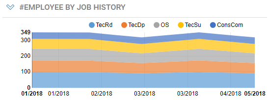]
]

You create a multi-serie history chart using the  icon in the dashboard toolbar.

### Multi-series History Chart Configuration

- **Basic** tab : sets the chart general characteristics
  - **Title** : Sets the text to be displayed in the chart's title bar
  - **Type :** defines the type of the chart among the two available types ( **line** or **bar**)
  - **Style :** allows to define the color scheme to use for the charts bars, from a list of available color scheme.   
If the number of values in the chart exceeds the number of colors defined in the scheme, colors are cycled.
  - **Display options:**  various chart flags depending on the chart's type
    - **Show legend** :  allows to display a separate legend above the chart .
    - **Stagger serie labels**  ( bar chart) to display bar labels on two lines.
    - **Grouping mode** : how the series bars in each category should be grouped:  **Side by side**  , **Stacked** or **Stacked at 100%.**  
In line mode, stacked mode display the series as stacked areas, not lines.
  - **Size** : Sets the chart's display size, expressed in columns and rows. See **Dashboard layout**  section for more information   
  <br>


- **Search**  tab : allows to select a **rule**  that will determine the entities from the Identity Ledger that will be in the scope of the chart. For example "All active entities", or "Orphaned Accounts".   
See **dashboard data access components**  section to understand what rules are displayed and how to add your own ones.
  - **Search on**  list allows to select the kind of entities to search for (Accounts, Application, Asset, Group, Identity, Organization, Permission, Repository or Usage) and will filter the list of rules accordingly.
  - **Rule** : lists and allows to select a rule for the selected entity kind.   
  - **Params...**  button allows to defines rule parameters if any.  (See § _Rule parameters_ for details)
  - **Test**  allows to check the result of the rule , using the parameter values if any.  
<br>


- **Chart data settings** : define a source view for the chart values and series to display, date formatting and optional sorting/limiting data options.
  - **View** drop down list allows to select the view to produce values for the chart.    
Only views that target the same entity ( account, people, organization, etc.) as the selected search rule are displayed.    
These views must also provide exactly one numerical value.   
The selected view may have parameters which can be set by clicking the **Params...**  button (See § _View parameters_ for details)   
  - **Chart value** : read/only field automatically set to the single numerical value column of the view.
  - **Time slots** configuration
    - **Date Format**  : allow to select or type a custom format to use for displaying time slot dates on the x axis. see Formatting Dates section below.
    - **Max displayed time slots**  : limits the number of time slots to display. For example, typing 5 will display the last 5 timeslots, including the current one.
    - **Reference time slots only** : displays only the time slots that are labelled as _Reference_. This is typical useful when the period of data collection is more frequent than the period of analysis.  

  

  - **Series** configuration:
    - Select **Serie label**  column from the view to be used as the chart serie label
    - You can optionally **Sort series** by value, label or not sorted (natural order).    
    - For readability matters, you must limit the number of series in the chart ( default 5, maximum 50)
    - Check **Include other with the remainders**  to gather the rest of the series into one single serie labelled _Other_.

#### Date Formatting

You can format dates on the y axis using the following localized tokens:

|%a|abbreviated weekday name|Mon|
|%A|full weekday name|Monday|
|%b|abbreviated month name.|Nov|
|%B|full month name.|November|
|%d|zero-padded day of the month as a decimal number [01,31]|01 for 2018/07/01|
|%e|space-padded day of the month as a decimal number [1,31]|1 for 2017/07/01|
|%j|day of the year as a decimal number [001,366].||
|%m|month as a decimal number [01,12].|07 for July|
|%U|Sunday-based week of the year as a decimal number [00,53].|26 for Sunday 2018/07/01|
|%w|Sunday-based weekday as a decimal number [0,6].|0 for Sunday 2018/07/01|
|%W|Monday-based week of the year as a decimal number [00,53].|25 for Sunday 2018/07/01|
|%x|the locale's date, such as %-m/%-d/%Y.\*|07/01/2018|
|%y|year without century as a decimal number [00,99].|18 for 07/01/2018|
|%Y|year with century as a decimal number.|2018|

For example, %b - %Y will format 07/01/2018 as Jul - 2018.

You can also select from predefined formats:

- Short date : equivalent to %x
- Month number / Year : equivalent to %m/%y
- Abbreviated month / Year : equivalent to %d-%y
- Month / day : equivalent to %m/%e

#### Data for Multi-Serie History Charts

The view for a multi-series history chart must provide one column with the numerical value to display and one or more columns for the serie (serie label, serie unique id, etc..)   
It need not contain timeslot related attributes and any link-related attributes.   
The view must return one row per serie.   


# Publish the Dashboard


Once your dashboard is ready, and you are satisfied with its content, you can publish it to a selection of people inside your organization.   

A dashboard can be in either of the publication states:   

- **private** : only visible and editable by its author
- **published** : visible and editable by its author and visible by selected people

A newly created dashboard is private by default. To publish it, do the following:   

- the dashboard is private by default.
- Select **Publish...** from the dashboard menu , to open the publication tab of the dashboard configuration wizard  
- Select a rule from the **Publish for** list of rules. Only portal-enabled rules targeting identities will be displayed.
- Click the **Test** button to verify that the rule retrieves the intended identities.
- Click **Finish** to make the dashboard public.
- Additionally, you may notify the dashboard recipients of the newly added dashboard.

To publish minor changes to an existing dashboard :   

- Edit the dashboard
- Make the changes
- **Save** the dashboard, changes are made available to its current recipient list.

To publish major changes to an existing dashboard:    

- Select **Unpublish** from the dashboard menu. It's recommended to make the dashboard private during the changes, until it's in a consistent state.  
During the changes, the dashboard may disappear from users displays if they log out or reload their configuration.
- Make all your changes, you can **Save** the dashboard as often as you like, changes won't be visible to users.
- Once you are done with the changes, select the **Publish** menu item, the dashboard will be published again to the same recipients.
- Additionally, you may notify the dashboard recipients of the changes.

| **Important**: <br><br> Users must select **Reload dashboard and styles definitions**  in the the web portal menu to view any changes to their dashboards ( modification, additions or removals). Logging out and back in has the same effect.|

# Advanced Configuration


## Dashboard Parameters

A dashboard may have one or more parameters to modify its content (data and titles).   
Any parameter will be displayed in the **dashboard parameters panel,** where the end-user can select or type values and click **Apply** to update the dashboard with new parameter values.   

The example below displays simple HR statistics dashboard for a given organization within the enterprise ( count of personel in the organizaton, and jobs breakdown).   
The end-user can then select an organization from a list of known organization to update the dashboard with data about the selected organization.

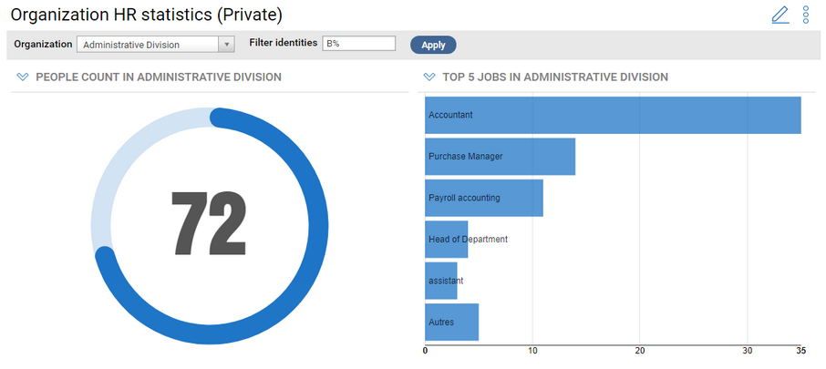   

A dashboard can have two kinds of parameters   

- **User editable parameters** : These are the regular parameters. the value of these parameters can be changed by the end-user. These parameters can affect dashboard component data and titles.
- **Hidden parameters** : The value of these parameters must be set at design time only. The parameter value can also be part of the dashboard title. Hidden parameters are mostly useful with **Dashboard Templates**. (see section below).  

### User Editable Parameters

**User editable parameters**   are the common type of dashboard parameters.   
They are defined by the designer and their values can be changed by the end-user through the dashboard parameter panel.   
The value of each parameter can be used to modify dashboard components data and/or title.   

The parameter value can either be typed in a text box, or selected from a list of possible values, by the end user.   
The possible values can either be dynamic and come from a view, or static list of values.    
The designer can also define a default text or item to be used when the dashboard is displayed for the first time.

### Hidden Parameters

The common purpose of **hidden parameters** is to allow creating separate instances of a **dashboard template** (read more on dashboard templates in the section below).   
These dashboard instances can then be published to different populations.   
For example, consider there are many account respositories (domain forest) managers in your company, which all need a similar dashboard with analytics for the accounts in the repository they manage.   
In this case, the designer would create a dashboard template that displays account analytics for a given repository, as a hidden parameter.   
He will then create instances of the dashboard template for each managed repository, and publish them to each repository manager.   
For convenience, the dashboard title could automatically include the repository name, eg. "Access Analytics on EMEA".   

Hidden parameters have the same behavior as regular parameters, with the following differences:    

- A hidden parameter does not show in the dashboard parameter panel. Its value must be set at design time, usually when instanciating the dashboard from a template.
- The hidden parameter value can affect dashboard component data and title plus it can also be used in the dashboard's title itself.


### Create a Dashboard Parameter

Dashboard parameters are managed via the **Parameters** tab of the dashboard's configuration wizard.  

   

The designer can do the following:   

- create a new parameter
- modify an existing parameter
- Delete a parameter
- Move up and down a parameters to change their display order in the dashboard parameter panel (from left to right)

To create a new parameter   

- Click **Create New**... to display the parameter creation dialog box  

   

- Type in **Name**  a unique name for the parameter. This name is used to identify the parameter in component titles.  
Use a meaningful but short name , such as **org**. Don't use anonymous names such as param1. Parameters names should not contain space.  
- Type in **Label** a label for the parameter. This label will be displayed a title for the parameter in the dashboard's parameter panel.
- Optionally type in **Help text** a text describing the purpose of the parameter. this text will show as a tooltip for the parameter in the dashboard's parameter panel.
- Check **Editable by end-user**  for regular user editable parameters and uncheck for hidden parameter
- Select a user interface type for editing the parameter:
  - **Text box** : the parameter value will be typed in a text box
    - Optionally type in **Default Value** a default value for the parameter.
  - **Menu** : the parameter value can be selected from a list.
- For Menu-based parameters, select the type of values that will be displayed in the menu
  - **Dynamic values** to display dynamic values coming from a view
  - **Static values** to display a static list of values

For **Dynamic values** menus:    

- Select the **Source View** that will provide items for the parameter menu.  
The view must have " **Allow selection of the view in the portal**" option to be listed as a source view.  
- If the view has parameters, click **Params...** to edit the parameters of the view.

- Select in **Value column** a column from the selected view that will provide the value of the parameter.    
This value will usually be used to modify data in the dashboard, It could be for exemple an organization permanent UID or code.
- Select in **Label column**  a column from the selected view that will provide the label of the parameter value to be displayed in the parameter panel.   
The parameter label can also be included component titles.
- Check the **Allow empty value** option to allow a null value to be selected for this parameter.
    You can type an optional label for this empty value, for example "_All Organisations_". The actual meaning and behavior for this null value is up to you.
    If this option is not checked, the first value in the list is automatically selected in the displayed mashup dashboard parameter panel.
- Optionally , select a **Default value** for the parameter, to be used when the dashboard is displayed for the first time.  

   

**NOTE 1:**  it's recommanded to use dedicated views to provide values for parameter menus, with only the columns that are used for values and labels.    
This is to ensure optimal performance when displaying the dashboard parameter panel with large datasets (eg. listing accounts).  
Don't use general purpose views with dozens of columns.   

**NOTE 2:** whenever possible, you should use permanent, timeslot-independant, and environment independant key attributes as value columns for parameters, to ensure maximum portability of the dashboard across timeslots and environments.   
This is especially important for hidden parameters and for parameter default values, because the value is stored with the dashboard and must be valid across timeslots and across environements ( UAT, Production).

For **static values** menus:     

- Click **Create** to add a new static value of the list. You must then provide a **Label** and a **Value** for each item in the list.   
  - The label will be displayed in the UI dashboard parameter panel and in component titles.
  - The value will be passed as parameters to dashboard data.
- You can **Create** , **Edit** , **Delete** or **Delete All** menu items
- Optionally , select a **Default value**  for the parameter, to be used when the dashboard is displayed for the first time.


### Use Parameters in a Pashboard

Parameter values can used to modify dashboard components data and titles and, only for hidden parameters, the dashboard title itself.   

To modify a dashboard component data based on the value of a parameter, do the following:   

- Open the component's **Configuration** wizard
- Select the **Search** or **Value** tab of the component's configuration
- In simple free search mode:
  - define the search criteria
  - when select a value for a given criterion, check the **Dashboard parameter** option, the value menu will now display the list of dashboard parameters
    - select the dashboard parameter to use
    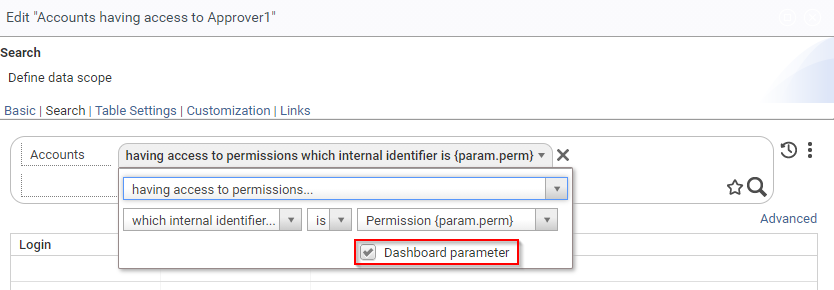

- In advanced rule mode:
    - Make sure that search **rule**  has at least a parameter
    - Click the **Parameters** button to configure the rule parameters
    - For the rule parameter that should use the dashboard parameter, select **Dashboard Parameter** as the source
    - Select the dashboard parameter to use from the parameter list ( the parameter's label and name are displayed is the list)

    

You can also use dashboard parameters in a table or chart component to filter secondary attributes.   

To include a dashboard parameter's label in a dashboard's component title, do the following:   

- Open the component's **Configuration** wizard
- Select the **Basic** tab  of the component's configuration
- Click In the **Title** text box, and move the insertion bar where the parameter label should be placed inside the title
- Select a parameter from the **Insert Variable** list (both user-editable and hidden parameters are listed) ; the parameter will be inserted as **{param.xxxx}** token.
- You could also directly type the parameter token in the title box  

    

To include a hidden parameter label in a dashboard's title, do the following:   

- Open the dashboard's **Configuration** wizard
- Select the **General**  tab  
- Click In the **Title**  text box, and move the insertion bar where the hidden parameter label should be placed inside the title
- Select a parameter from the **Insert Variable**  list (only hidden parameters are listed) ; the parameter will be inserted in the title as **{param.xxxx}** token.
- The actual value of the hidden parameter can be set in the **Instance** tab (see. § Dashboard Template section)
- Click **Finish** to validate your configuration
- Notice how the dashboard title (and the corresponding menu entry) have changed.  

    

### Cascading Parameters
{: .d-inline-block }

New in **Curie R1**
{: .label .label-blue }

Cascading parameters are useful when selecting a value from items that are hierarchically organized, for example `Application > Permission`, `Repository > Account`, etc...

Cascading parameters means that the list of values proposed for a parameter depends on the selected value from another parameter.

To define cascading parameters, do the following:
- Define the parent parameter, for exemple `app (Applications)`
- Define the child parameter, for example `perm (Permission)`
  - select **Dynamic values** for the source
  - select the **Source View** which must accept a parameter that points to the parent parameter selection value ( eg. application permanent identifier).
  If the view does not exist, create it and refresh the list of views using the refresh icon.
  - click the **Params** button, select the parameter of the view and set its source to **Dashboard param.**
  - select the parent parameter (in this case,  `Application {param.app}` ) from the value list.


This is how the dashboard parameter panel will look like:

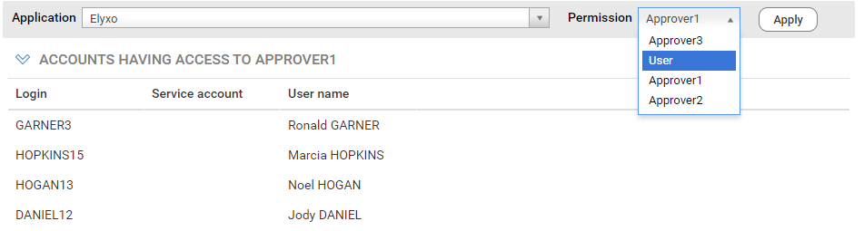


## Dashboard Templates

The main purpose of **Dashboard Templates**  is to streamline the creation of similar dashboard that only differ from their scopes.    

Consider the above example, where there are many account respositories, one per area, each being managed by a different team. The managers all need a similar dashboard with analytics for the accounts in the repository they manage. The scope of the dashboard in the repository.   
In this case, a designer would create a **dashboard template** that display access analytics for a given repository, as a hidden parameter.   
He will then **instanciate** the dashboard template for each of the managed repositories, and publish them to each repository manager.   
For convenience, the dashboard title could automatically include the repository name, eg. "Access Analytics on EMEA" .

To create a dashboard template or to turn a dashboard into a template, do the following :    

- Open the dashboard's configuration wizard
- In the **General** tab, check the **Template** option  
- In the **Parameters** tab, create one or more hidden parameters, with the option "**Editable by end-users**" unchecked, which will serve as the dashboard's scope parameters.
- In the **General** tab again, you can optionally include the parameter's labels in the dashboard title ( see section **Hidden Parameters** above )

To create an instance of a dashboard template, do the following:   

- In the **Dashboard Manager** page,
- Select the dashboard template to instanciate,
- Click the **Instanciate...** button, this opens the dashboard instanciation wizard
- In the **Instance** tab, Select or type a value for each of the dashboard's hidden parameters.
- Click **Finish** to create the dashboard instance
- The new dashboard instance appears in the list of dashboard
- The dashboard can be published as is to its target audience, or modified before publication
- The dashboard instance parameters can be modified at any time, through the **Instance** tab of the dashboard configuration.
- You can create as many dashboard instances of the same template as needed.

    

The dashboard instances can then be published as is to their respective audience, or be modified before publication.     
After creation, the new instance dashboards are independant of their template, and further changes to the template (or even deletion) won't be reflected in the dashboard instances.   

## Secondary Parameter Configuration

**Secondary Parameters** may be involved in different places in a dashboard's configuration:   

- **Component Rule with parameters** : Dashboard component (table, chart, gauge) Search Rule that may have parameters,
- **Component View with parameters** : Dashboard component (table, chart) View that may have parameters ,
- **Dashboard Parameter Menu View with parameters** : Dashboard parameter possible values coming from a View that may have parameters,
- **Component Link Target with parameters**  : Dashboard component (chart, table or gauge) link to another page or dashboard that may have parameters,

In all these cases, you can define for each involved secondary parameter where its actual value will come from (secondary parameter **Source** ), and what the actual value will be (secondary parameter **Value** ).    

There are four secondary parameter source types:   

- **Value** : the secondary parameter value is a predefined value that must set at design-time (typed or selected from a list of possible values)
- **Dashboard Parameter** : the secondary parameter value will be taken from one of the dashboard's main parameters runtime values
- **User** : the secondary parameter will take its value from one of the currently connected user attributes
- **Clicked Item** : the secondary parameter will take its value from the chart item or table row that was just clicked

Some source types only make sense for some secondary parameters kinds, eg Clicked Item for Table and Chart Link target parameters.   
The following table shows which source types applies to which secondary parameter kinds:   

|  | **Fixed Value** |  **Dashboard Parameter** |  **User Attribute** |  **Clicked Item Attribute** |
|          |:-----:|:-----:|:-----:|:-----:|
|  **Component Rule w/ params** |  X |  X | X |  |
|  **Component View w/ params** |  X |  X | X |  |
|  **Dashboard Parameter Menu <br> View w/ params** |  X |  | X |  |
|  **Gauge Link Target w/ params** |  X | X | X |  |
|  **Table and Chart Link Target  <br> w/ params** |  X | X | X | X |

### Fixed Value Source

The secondary parameter actual value is a fixed value that must be set at design-time.   
Fixed values can be used in all situations.   
This could be helpful to pass ad-hoc static values to rules, views, links etc...     

To use a fixed value as a source type, do the following:   

- Select **Value** as the **Source** in the **Parameters** configuration panel
- Either type the fixed value in the text box or select the value of the list of proposed values (The UI is automatically determined based on the type of the secondary parameter )

    

### Dashboard Parameter Source

The secondary parameter value will be passed from a given current dashboard's parameter value.     
When the dashboard's end-user selects or types another value for the related dashboard parameter, and clicks **Apply**, the secondary parameter value is automatically updated.    
Dashboard source types can be used with all secondary parameters, except to filter dashboard parameters themselves, so as to avoid recursion.   
This source type is the principal mean to use dashboard parameters in dashboard content.      
Dashboard parameters values can also be passed to other dashboard or pages through links.   

To use a dashboard's parameter as a source type, do the following:   

- Select **Dashboard Parameter** as the **Source** in the **Parameters** configuration panel, if the choice is available
- Select one the dashboard's parameters to use as the source. Each dashboard parameter in the list is displayed both with its label, and the syntax **{param.\<param\_name\>}**  

    

### User Attributes Source

The secondary parameter will take its value from characteristics of the currently connected user.   
This is especially useful to create dashboards which content automatically adapts to the current user (without the user having to select a parameter).    
This source type can be used with all secondary parameter types.   

To use an attribute of the current user as a source type, do the following:   

- Select **User**  as the **Source** in the **Parameters** configuration panel
- Select one the user's attributes from the list.   

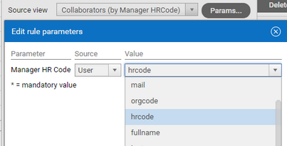    

- The proposed attributes are the columns of the **user.principal.view**  View which is configured in the project's **Configuration** \> **Web Portal** \> **Other Properties** section.  
The main purpose of this view is to validate the login used to connect to brainwave portal. It's also used to provide additional user-related attributes.    
You can design a view of your own to validate the login and provide custom values to use in secondary parameters (restart the server to make them effective).    

    

#### Simulate Another User

During dashboard design, the actual values for user attributes used in secondary parameters will be those of the designer's account (which is the currently connected user at design time).   
Fortunately, you can simulate another user account while in design mode to test your dashboard. To do so:   

- Select **Dashboad User Simulation...** from the dashboard's menu, to open the **Dashboard user simulation** dialog box  

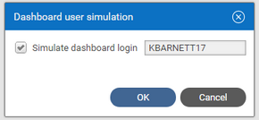    

- Check **Simulate dashboard login** and type a valid login to simulate another user
- or uncheck S **imulate dashboard login** to use back the designer's account
- Click **OK** to validate the simulated account against the configured **user.principal.view**  
- When changing to another account, the dashboard parameter lists and content are updated to reflect the new user attributes.  
If not, hit F5 to refresh the dashboard and take into account the new user characteristics.
- The simulation will be effective during the designer's user session or until manually cleared. It will affect all dashboards that have secondary user paramters.  
The dashboard title indicates whether a user simulation is active.  

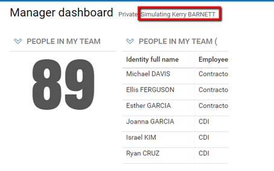    

- User simulation neither affects native _View perimeter_ results nor regular pages, which are based on the actual connected user account.

### Clicked Item Attributes Source

The secondary parameter will take its value from the chart item (bar, wedge) or table row that was just clicked, when links are enabled for this widget.   
This source type is only available to configure dashboard chart / table widget links and is the main mean of passing along context parameters to the link.

To use an attribute of the clicked item as a source for secondary parameters, do the following:

- Select **Clicked Item** as the **Source** in the **Links** configuration page **Parameter** area, for the target page or target dashboard.
- Select one of the clicked item attributes from the **Value** list (which are the columns of the widget's View) to pass to the secondary parameter.  

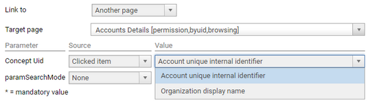    

## Managing Dashboard Links

**Dashboard Links** allow to click on any dashboard widget and go to another page, dashboard, detail dialog box or even an external web site, in order to get information or carry out action on the clicked linked element.   

Links are available on all dashboard widgets:   

| **Widget** | **Linked item** | **Link presentation** |
|  Table |  any row of the table | Text of one of the row's columns is displayed as an html link ( blue underlined text). <br> |
|  Chart |  bar/section/wedge of the chart | The cursor will turn to a hand when moved over the bar item when links are enabled  <br> |  
| Gauge | The gauge as a whole |   The cursor will turn to a hand when moved over the gauge when links are enabled  <br> |  

Links targets can be of four kinds:

- A detail page ( for example, detail on a given account, identity, group, application, etc...),
- Any given page or report page accessible to the end-user, possibly with parameters,
- Another dashboard accessible to the end-user, possibly with parameters,
- Detail dialog box,
- An external web site, possibly passing contextual parameters in the url . The linked external page will be opened on a separate browser tab.

Contextual information and information on the clicked item can be passed to the link target.

### Link configuration

To define a link on a widget do the following:

- Check **Enable links** in the configuration wizard **Links** tab to enable the links for this widget.
- Select from the **Link to**  menu the target link type, from four possibilities:
  - **Detail page** : this is the standard detail page for any given Ledger entity ( such as identity, account, applicatio, group, etc...)
  - **Another page** : a custom page in the web portal, usually with parameters
  - **Another dashboard:** another dashboard, usually with parameters, that is accessible to the user.
  - **Search detail dialog box** a dialog box that displays a list of items involved in search-based gauge figure computations.
  - **External URL :** a page in another web site. Parameters are passed in the url search.
- For **table** widgets, select from **Display link in column** , the table's column where the link should be displayed.   
Usually it will be the left-most column, but it could be any column of the table. Only one column can be displayed as a link.  
<br>


- Select from the **Link to** menu the type of the link target , among the four possible types: Detail Page, Another page, Another Dashboard and External URL.
- Additional link configuration will vary depending on the selected target type ( see below).
- Make sure to **Save** the dashboard before testing the link and get back to view mode, because you cannot go to another page while the dashboard is being edited.

#### Detail Page Link

- Choose from the **Selected item UID attribute** menu, the view column's value to use as the permanent identifier for the detail page.    
If the list is empty, you will need to add a permanent identifier to the widget's view.  
The entity type to display (eg identity, account, group) will be automatically determined from the selected column.    

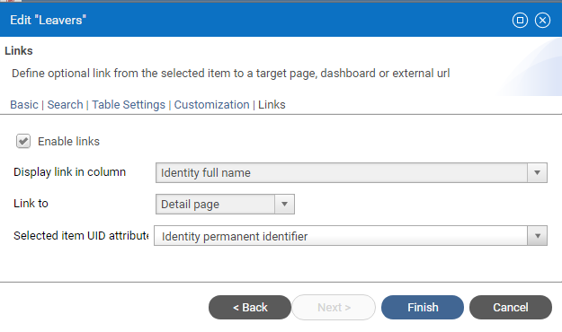

#### Another Page Link

- Select from **Target page**  menu, the target page of the link.  
Each item displays the pages's label and that page's tags within brackets, You can use both to filter the page you are targetting.   
Note that all pages with a <u><b>tag</b></u> are listed in the menu, so you have to make sure that the selected page will actually be accessible to the end user.  
- If the page have parameters, you can define the value to use for each of its parameters:    
  - **None** : to leave the page parameter empty. This is useful for non mandatory parameters, if the default value suits your need.
  - **Value:** to use a static predefined value for the parameter. Type the value to use in the text field.
  - **Clicked Item** : to use an attribute from the clicked row or chart part.  
You can select any column from the view, even it is not displayed in the widget.   
Note that this choice is not available for **gauge** links, as there is no clickable sub item.
  - **Dashboard parameter** : to use a global parameter from the dashboard as a contextual value for the page parameter. Select the dashboard parameter from the list.
  - **User** : to use an attribute related to the currently connected user. Select the attribute from the list.


#### Another Dashboard Link

- Select from **Target dashboard** menu, the target dashboard of the link. Type to filter by the label of the dashboard.   
Note that all dashboards are listed in the menu, so you have to make sure that the selected dashboard will actually be accessible to the end user.
- If the dashboard have parameters (either editable or hidden), you can define the value to use for each of its parameters:
  - **None** : to leave the dashboard parameter empty. This is useful for non mandatory parameters, if the default value suits your need.
  - **Value:**  to use a static predefined value for the parameter. Type the value to use in the text field.
  - **Clicked Item** : to use an attribute from the clicked row or chart part.  
You can select any column from the view, even it is not displayed in the widget.  
Note that this choice is not available for **gauge** links, as there is no clickable sub item.
  - **Dashboard parameter** : to use a global parameter from the dashboard as a contextual value for the target dashboard parameter.   
Select the dashboard parameter from the list.
  - **User** : to use an attribute related to the currently connected user. Select the attribute from the list.
  

#### Search Detail Dialog Box
{: .d-inline-block }

New in **Curie R1**
{: .label .label-blue }

This link is only available for **gauge** widgets and only when the value aggregation function is set to `Count`. It will display the list of items involved in the search count as a table in a dialog box.  

You can further specify the columns to be displayed in the table, depending on the counted entity type (account, etc...)

 

When clicking the gauge figure, a dialog box appears that lists the items in the count as a table with the selected columns. In this simple case, a list of 328 orphan accounts.  

 

From this dialog box, you can: 
- Export this list as a CSV or Excel file 
- Open the search page for the counted entity (eg. accounts) with the search criteria already set to match the gauge search, so that it will display the same list and give access to all the search analytics. In the case above, the search page is opened on orphan accounts, and displays the same 328 items.

 

#### External Link

- Type in **Link URL** a valid url for the link. The URL must start with http:// or https// . It can contain dynamic placeholders.
- Select from **Insert variable**  menu a variable in the URL text. All valid variables are listed, and grouped in two categories: **Clicked Item attributes** and **Mashup parameters**. The actual variable values will be url-encoded in the url text ( eg. space =\> %20 )  


Example of actual url :


## Configure Dashboard Rsources

Dashboards **resources** are **layouts** , **chart styles** and **indicator styles**.   
Dashboard resources are defined in `.dashres`  files that are stored in the project in the `webportal/resources` directory.

Two dashboard resources are provided by default: 
- **default**: which defines the default layout templates, chart styles and indicator styles
- **flatcolors**: which defines additional "flat colors" indicator styles and chart styles.

Additional dashboard resources can be defined and stored in other `.dashres` files. 

This is the XML structure of the `.dashres` file:

```xml
<?xml version="1.0" encoding="UTF-8" standalone="no"?>
<!DOCTYPE DashboardResourceBundle PUBLIC "-//Brainwave//DTD DashboardResourceBundle 1.0//EN" "urn:brainwave:igrc:dtds/dashres.dtd"> 
<DashboardResourceBundle name="default" displayname="Dashboards default resources">
    <layoutTemplates defaultId="1-1">
        <LayoutTemplate id="1-1" label="1 cols 100%" nbGridCols="1" nbCols="1" spans="1" />
        <LayoutTemplate id="2-1" label="2 cols 50/50%" nbGridCols="2" nbCols="2" spans="1 1" />
    </layoutTemplates>
    
    <indicatorStyles defaultId="default">
        <IndicatorStyle id="default" label="Default blue" valueColor="#1F76C7" warningColor="#ED9748" criticalColor="#FF6C6C" roundedTip="true" thickness="3" />
        <IndicatorStyle id="blueGrad" label="Blue gradient" valueColor="#008EA8 #006577" warningColor="#FFC268" criticalColor="#FF4C50" roundedTip="false" thickness="0" /> 
    </indicatorStyles> 
    
    <chartStyles defaultId="default">
        <ChartStyle id="default" label="Blue" serieColors=" #1F76C7" />
        <ChartStyle id="blueScale" label="Blue scale" serieColors="#175A97 #1F76C7 #2182DA #61A7E7 #AAD0F2" />       
    </chartStyles>   
    
</DashboardResourceBundle>
```

### Dashboard Layout Templates

Dashboard layout is based on a grid system, with a fixed number of columns of equal width and a variable number of rows, depending on the content.
Each widget in the dashboard can span over a given number of columns and rows.

A dashboard layout template defines the following characteristics of the layout: 

| attribute  | meaning |
|---|---|
| **id**  | unique identifier for the layout |
| **label**  | the label to be displayed in the configuration wizard |
| **nbGridCols**  | the number of columns in the underlying grid |
| **nbCols**  | the number of visible columns, this is an information only field. you can use the same value as nbGridCols |
| **spans**  | the default layouting sequence of successive widgets, separated by white spaces. width and height are indicated as WxH, and 1 is a shortcut for 1x1.  Additional widgets will get the layout of the last item in the sequence |

For example, suppose you would like to define a layout template with 3 widgets on the top and a large widget at the bottom, same as below

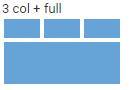

In this case, you need a 3-columns grid template, with three widgets of 1x1 width and height on the first row plus one large widget 
that spans 3 grid columns x 2 grid rows, on the next row.  
This sequence will be encoded as :  `1 1 1 3x2`

The final template definition will be:
```xml
<LayoutTemplate id="3-2" label="3 col + full" nbGridCols="3" nbCols="3" spans="1 1 1 3x2 " />
```

Note that additional widgets will inherit the layout of the last item in the template, in this case 3x2.

You can define as many templates as you like in different files. 

### Indicator Styles 

An indicator style allows to define the look and feel of dashboard indicator widgets, mainly the color of the indicator ring. 

The attributes of an indicator style are the following:

| attribute  | meaning |
|---|---|
| **id**  | unique identifier for the style |
| **label**  | the label to be displayed in the configuration wizard |
| **valueColor** | the color of the indicator ring , this color can either a plain color in `#RRGGBB` notation, or a gradient color with two colors separated by a space. `#RRGGBB` `#RRGGBB`  |
| **warningColor**  | not yet supported. |
| **criticalColor**  | not yet supported |
| **roundedTip**  | not yet supported |
| **thickness**  | not yet supported |

The following example defines an style with a green to blue gradient ring color, from #00AA4D to #6A00F3.  

```xml
 <IndicatorStyle id="greenBlue" label="Green blue gradient" valueColor="#00AA4D #6A00F3"  /> 
```
The indicator could look as follows: 


> **Note:** It is recommended to not use warm colors ( red and orange) for ring color so as not to be confused with the warning and critical threshold colors.

### Chart Styles
 
 An chart style allows to define the look and feel of dashboard chart styles, mainly series line and bars colors. 

The attributes of a chart style style are the following:

| attribute  | meaning |
|---|---|
| **id**  | unique identifier for the style |
| **label**  | the label to be displayed in the configuration wizard |
| **serieColors** | space separated list of serie colors in `#RRGGBB` format.  If there are more series than colors, the chart will cycle through defined colors |

The following example defines an chart style with 5 serie colors 

```xml
 <ChartStyle id="vivid" label="Vivid" serieColors="#01A9CD #FFB713 #F71B27 #6A6A6C #212B2C" />
```
The resulting configuration preview and chart will look as follows:

  

  
## Project-based Dashboards

There are two kinds of dashboards for different usages: **user dashboards** and **project-based dashboards**.

**User dashboards** are the regular dashboards created, modified and managed by **dashboard designers** through the web interface. 
These dashboards can then be shared for use to target group of end-users.
  
User dashboards are intended to be specific to a given customer and modified by customers to fit its specific needs.  
For this reason, they are stored in the database on each customer's environment.  
User dashboards must be manually transfered between the different customer environments (eg dev, test, production) or backed-up using the export/import feature. 

**Project dashboards**, on the other hand, are not specific to a customer, they address a common need and are delivered inside a facet or an app, just like pages, views and rules.  
Project dashboards are stored as `.dashboard` files inside the project in the specific `webportal/dashboards/` folder or a facet sub-folder.  
Contrary to user dashboards, project dashboards will be shared between customers that use the same app or facet
 and across different environments - dev , test, production - of the same customer as long as the web portal references the same project.  
 Dashboard project included in the project will automatically appear in the web portal to authorized users, without having to manually import them.  

### Create a Project Dashboard

Project dashboards are created and edited by dashboard **developers**, ie users with the **developer** role.  

To create a project dashboard, a developer must do the following:
- Click on the **Create** button in the Dashboard manager. The dashboard creation wizard is displayed.
- Give first a title to the dashboard in the **Title** box 
- Check the **Save to project** option (1). This option is only available if you have the new "developer" role (see below).
- A defaut file named is proposed, based on the dashboard title. You can change the file name (2).
- The file is stored by default in the `webportal/dashboards` folder. 
You can specify a different subfolder, for example to include the dashboard in a specific facet, by clicking the folder icon (3).  
- View & edit the dashboard in the portal as for user dashboards.
- Don't share the dashboard yet if it's intended to be distributed to different customers, through a facet or an app, because the target audience is not known at development time. 

Any dashboard developer can edit any project dashboard, even without being its author.


**Note:** The **designer** and **developer** roles, dedicated to dashboards, are provided in the `bw_dashboards` facet, which is included in **Identity Analytics version 1.4** add-on.

[Download Identity Analytics add-on](https://marketplace.brainwavegrc.com/package/bw_ias/){:.download}

### Working with Project Dashboards 

All project dashboards in the current project are visible to developers and technical administrators in the dashboard manager, with a special "Project" type.


Once the project is deployed to the web portal, a technical administrator - or a developer if he has access to the target platform - must share project dashboards to the target audience.   
Each time the project dashboard is modified, it will be automatically updated on the web portal and the sharing configuration will be preserved.

Dashboard designers that don't also have the developer role cannot modify project dashboards. 
This is because project dashboards can be modified in the project and will be automatically updated when the project is redeployed. 
This would cause conflicts if the projects dashboards were otherwise modified by designers on the target platform.   
If a designer would like to modify a project dashboard, he can duplicate the dashboard as a user dashboard, by un-checking the **Save to project** option in the duplicate wizard.  

Similarly, a developer can transform an existing user dashboard into a project dashboard, by duplicating the user dashboard and check the **Save to project** option in the duplicate wizard.

Note that project dashboards are excluded from the export feature. 

#### Project Dashboard Lifecycle

To sum up, the typical lifecycle of the project dashboard would be the following:
first time:
- a developer creates the project dashboard on the dev environment web portal
- the project is deployed to a test environment web portal 
- a technical administrator shares the project dashboard to a test audience
- project dashboard is tested
- the project is deployed to a production environment web portal 
- a technical administrator shares the project dashboard to the actual target audience
- end-users can access the project dashboard
each upgrade:
- a developer modifies the project dashboard on the dev environment web portal
- the project is deployed to a test environment web portal 
- project dashboard is tested
- the project is deployed to a production environment web portal 
- end-users can access the modified project dashboard

#### Detailed Personae and Permissions
The table below lists the detailed authorizations for each persona:
<table>
  <tbody>
    <tr>
      <th align="left">Persona</th>
      <th align="left" >Permissions</th>
    </tr>
    <tr>
      <td style="vertical-align: top; font-weight: bold">Designer</td>
      <td>
        <p class="icon check">Can create ( and own) ,  modify and delete user dashboards</p>
        <p class="icon check">Can duplicate user dashboard as another user dashboard</p>
        <p class="icon check">Can share user dashboards</p>
        <p class="icon cross">Cannot create a new project dashboard nor modify an existing one</p></td>
    </tr>
    <tr>
      <td style="vertical-align: top; font-weight: bold">Developer</td>
      <td >
        <p class="icon check">All designer permissions plus...</p>
        <p class="icon check">Can view, create, modify and delete all project dashboards (no ownership)</p>
        <p class="icon check">Can duplicate user or project dashboard to either user or project dashboard</p>
        <p class="icon check">Can optionally set default sharing parameters for any project dashboard ( which can be overriden)</p>
       </td>
    </tr>
    <tr>
      <td style="vertical-align: top; font-weight: bold">Technical administrator</td>
      <td>
        <p class="icon check">Can list and view all project and user dashboards</p>
        <p class="icon check">Can import / export all user dashboards</p>
        <p class="icon check">Can modify sharing parameters for user and project dashboards</p>
        <p class="icon check">Can delete any dashboard</p>
        <p class="icon cross">Cannot duplicate dashboards</p>
       </td>
    </tr>
  <tr>
      <td style="vertical-align: top; font-weight: bold">End user</td>
      <td>
        <p class="icon check">Can view all project and standard dashboards shared with him</p>
        <p class="icon cross">Cannot create, modify or delete dashboards</p>
       </td>
    </tr>   
  </tbody>
</table>


# Add Custom Data Accesses for Dashboards

## Create Specific Dashboard Data Access Components

Dashboards need two data components to access data from the Identity Ledger:

- **Rules** determine the scope of entities in the Identity Ledger that will be displayed in the dashboard. For example "Active accounts", or "people in the Finance department" . Dashboard rules can have parameters.
- **Views** determine how the entities selected in the rules will be displayed. The view provides a set of columns to access direct attributes of the entity (_e.g._ email or an account) , attributes of related entities (_e.g._ job title of an identity) or count entities according to some criteria (_e.g._ number of accounts by organization ).

The standard **Mashup Dashboards Support** add-on that you have included in your project comes with a number of predefined views and rules that gives access to common identity data, in nine categories:

- Accounts
- Application
- Asset
- Group
- Identity
- Organization
- Permission
- Repository
- Usage

These views and rules cover the most common use cases. However, you can also build your own rules and views for more specific needs, using the Studio.

## Create a Rule for Dashboards

To create a rule to be used in your dashboard like any regular rule, using the Studio rule editor.   
Some options are needed to be set for the rule to be available for selection in the dashboards:

- Check **Allow the selection of the rule in the portal**  in the **Publication** tab in the rule's **Properties**  panel  


Dashboard rules can have any number of parameters. It is recommended to place the rules available for use in a dashboard in the folder `rules/webportal/dashboard` sub-directory. This will facilitate maintenance of said rules.  

### Rule Design Feature

By default, a rule will be available to all dashboard designers. However, if you want your rule to be available only to a sub-set of designers, for example because it's costly to compute, or because it's not relevant to others, you can associate a **design feature**  to this rule. The rule will then be visible in the design editor to all designers that are authorized for this feature.

| **Note**: <br><br> The end-users that will use the dashboard do not need to be authorized for the feature.

The best practice is to declare a different feature for each rule, then grouping them using feature sets that are then associated to specific users.

## Create a View for Dashboards

Views determine how entities retrieved by rules will be displayed in the dashboards.   
The view provides a set of columns to access, the direct attributes of the entity (_e.g._ email or an account), attributes of related entities (_e.g._ job title of an identity) or count entities according to some criteria (_e.g._ number of accounts by organization ).     
Views to be used in dashboards are built as any regular view, using the Studio view editor. All view types can be used: audit view, business View or audit Logs view.   

For the view to be available to dashboard designers, you must do the following:

- Check **Allow the selection of the view in the portal**  in the **Execution** tab in the views **Properties**  panel


This view will then be available for dashboard components that target its main entity.   
The view's main entity is the top level entity of the view, Identity in the above example.    
It can be changed to target any other entity in the view using **Toggle web portal search anchor** menu item.   

It's recommended to set labels on each attribute of the view to something readable for the end-user. This also avoids the systematic re-labeling of the attributes by the dashboard designer.For example, when defining an aggregate column, it should be labelled "Count" or something similar. Nationalized labels can be set using the small flag icon.


### Using Business Views in Dasbhoards

Business Views can be used to feed dashboard components like any other views.   

- Make sure the business view's **Allow the selection of the view in the portal** option in the configuration tab is checked,
- Make sure the business view's inner view's **Allow selection in portal** option is **NOT CHECKED**.
- the business view will be available for dashboard components that target the business view's inner view main entity.


### View Design Feature

By default, a view will be available to all dashboard designers. However, if you want your view to be restricted to some designers, for example because it's costly to compute, or because it's not relevant to others, you can associate a **design feature**  to this view. The view will then be visible in the design editor to all designers that are authorized for this feature.


# Dashboard Management Page

The **Dashboard Management** page allows **dashboard designers** to create, configure and delete dashboards. The **platform administrators** are in addition authorized to export and import dashboards in the same environment or across different environments. This page is not available to regular users of the web portal.

Select **Manage Dashboards** from the top left portal menu to open the dashboard management page.

 

The page presents a list of dashboards and a set of action buttons.

The dashboard list allows single or multiple selection of dashboards, using standard keys and mouse operations:
- **mouse click** to select one dashboard
- **shift+mouse click** to extend multiple selection range 
- **shift+up/down** arrows to extend multiple selection range 
- **ctrl+mouse click** to toggle item selection status 

The list of dashboards displays the following information for each dashboards:
- **Dashboard title**
- **Dashboard author** (for platform administrators) 
- **Menu**: whether the dashboard is listed in the navigation menu bar
- **Category** : in which case , the menu category which includes the dashboard
- **Prio.**": priority of the menu in its parent category.  The higher priorities are the end of the list
- **Status** : Sharing status of the dashboard ( could be Private or Shared) 
- **Recipients** : when shared, the sharing criteria for the dashboard
- **Description** : dashboard description if provided.

You can sort dashboards in the list according to each column by clicking on the column header.  
You can also filter the displayed dashboards by title or description by entering a filtering pattern in the filter box above the list. For instance, typing "stats" will display only the dashboards that have the word stats in their title or description.

The displayed dashboards and set of actions are the following , depending on user's profile: 

**Dashboard designer** profile:

- **Dashboard List** : list of dashboards created by the current user. 
- **Create** button : allows to create a new dashboard. This is the only place where a dashboard can be created.
- **Instanciate** button : allows to instanciate the selected template dashboard. This button is disabled if the selected dashboard is not a template or if more than one dashboard is selected.
- **Configure** button: allows to change the characteristics of the selected dashboard (_e.g._ title, category) and its publication state, but not to edit its content.  Disabled if not exactly one dashboard is selected. 
- **Assign** button: allows to reassign one or more selected dashboards to another designer, so that he can take over. 
- **View** button: navigates to the dashboard page, to view or edit the dashboard content. Disabled if not exactly one dashboard is selected. 
- **Duplicate** button: creates a copy of the selected dashboard.  Disabled if not exactly one dashboard is selected. 
- **Delete** button : permanently deletes one or more selected dashboards. 

**Platform administrator** profile:

- **Dashboard List**  : List of all dashboards present in the current environment, whoever the creator.
- **Create** ,**Instanciate**, **Configure** , **Assign**, **View** , **Duplicate** and **Delete** buttons with the same behavior.  
Note that the _platform administrator_ can only edit the content of dashboards he has created, granted that he also has the _designer_ role.
- **Export** menu button : allows to export either the whole list of dashboards or the currently selected dashboards.
See section below for details.
- **Import** button: allows to import an exported set of dashboard from a file to the current environment.  
The import merges the imported dashboard with the existing one as follows:
  - The imported dashboards are added to the existing one (no dashboard is deleted)
  - If a dashboard already exists in the current configuration (because it was imported before, not because it has the same title), the imported dashboard will replace the existing one.
  - If the dashboard creator cannot be identified, the dashboard will be assigned to the current user (that is, the **platform administrator** )
   
## Export Dashboards
  The Export menu button allows platform administrators to export either the whole list of dashboards or a selection of dashboards to a file on their local computer.
This file can then be used for backup purposes, to copy the dashboards from an environment to another ( **e.g.** from test to production) or to share specific dashboards between designers.
Selecting either menu item will open the dashboard export wizard, which consists of 2 pages:

- **Dashboard selection** : allows to select the dashboards that will be actually included in the export file. 

 

- **Summary** : list the dashboards that will actually be includes in the export file.
Click Finish to create the export file and download it to your computer.  
The export file is named **dashboards_export.data** by default.


## Import dashboards
You can import all or part of exported dashboards through the dashboard import wizard

The wizard consists of 3 pages:
- **file selection** :  this page allows to select a file to import with .data extension.  
After the file content has been analyzed, either information on the file with be displayed if the content is valid, or an error message will be displayed if the file is not valid and cannot be imported, typically if a required project resource, such as a view or a rule, is missing in the current environment.  
Note that only the first error is displayed and needs to be fixed (ie. add to missing view or rule) before starting over to import the file.

 

- **dashboard selection** : this page displays the list of dashboards contained in the import file, and allows to select which dashboards to import.  
This list indicates for each dashboard whether it already exists in the current configuration (because it was imported before, not because it has the same title).  
In which case, you have to either uncheck the dashboard to exclude it from the import or check the "Overwrite existing dashboards" option to force all existing dashboards to be replaced.
The list also displays the author of each dashboard, as found in the export file. If the author cannot be found in the current configuration, it is replaced by the current user (ie. platform administrator). You will have to manually reassign the dashboard to an alternate valid designer.

 

- **Summary** : This page recaps the list of dashboards selected for import, and if they are going to replace existing ones.
Click on Finish to perform the actual import, or Cancel to abort and get back to the management page. 

 


# Dashboard Tips & Tricks

## Optimize Performances

If you observe that one of your component takes time to be executed, try to :

1. In the search property, use a non filtering rule (eg : search all accounts instead of search all active accounts)
2. Apply previous filtering criteria into the view/business view (eg : accounts with disabled attribute value equals to false or null)
