# Basic Concepts

The "Discovery" component allows you to discover source data and apply filtering, verification, and transformation rules to them.  
Among the available operations in Discovery, you will find:  

- Verification of the format of a string of characters or a date;
- Filtering records based on an arbitrary criterion, using pseudo-SQL or JavaScript syntax;
- Filtering records according to rules of de-duplication or verification of the presence of attributes;
- Computing new attributes from source data (format conversions, concatenation, normalizing values...)  

Thanks to this component, it is very easy to see the source data, no matter what entry format is used (CSV, LDIF, XML...) and to immediately evaluate the quality of the data.  
The Discovery component moves on to a systematic analysis of the file to produce the histogram of each attribute's values and allows you to build a list of rejected records exportable in Excel format as the rules are applied.  
All the operations performed in the Discovery are recorded as macros, and can therefore be reapplied by batch on any new file, which greatly reduces the repetitive verification tasks.  
Data filtering and transformation operations are performed in two stages:  

1. First perform the rejection operations
2. If the record was not rejected, the transformation operations are performed

The rejection operations are the first actions in the contextual menu, as seen below :  

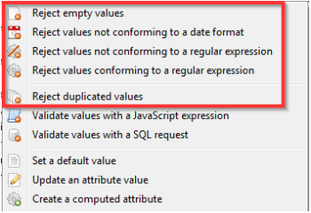  

These operations appear in the left side of the configuration summary  

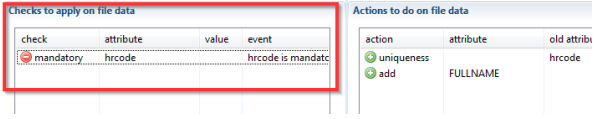  

## Types of Files

### CSV

CSV discovery allows the analysis of files whose data are separated by a character (",", ";"...)  

The CSV format is specified in the RFC 4180, but CSV discovery is also able to analyze files that don't correspond to the specification as long as they contain separators.  

  

Once the CSV format has been selected and the file chosen, file analysis configuration is automatically suggested. These settings may be changed if needed:  

- File encoding format
- Column separators
- Multivalued value separator
- Text value separator
- Indicate whether the file contains a header with column names or not
- Ignore the X first lines before starting the file analysis.

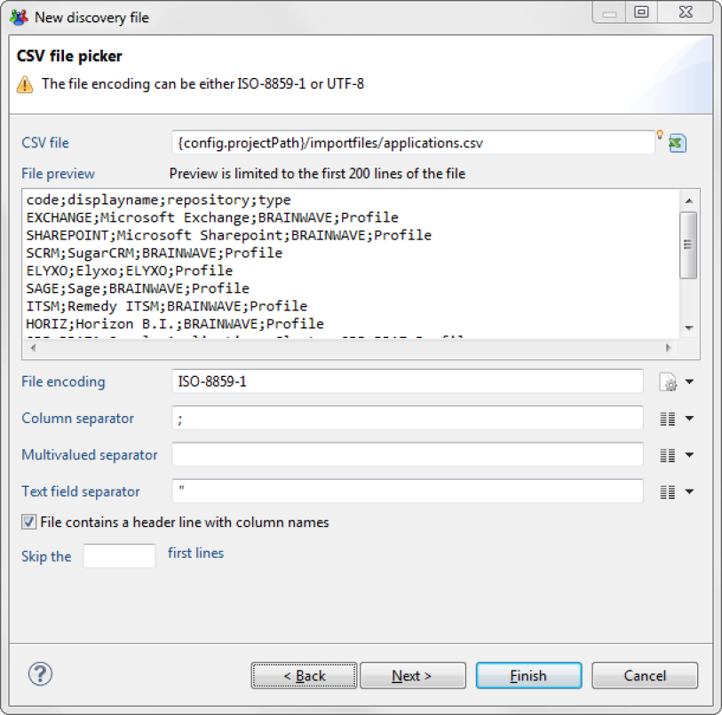

### Excel

EXCEL discovery allows the analysis of files in Microsoft XLS or XLSX format. EXCEL discovery allows the analysis of both spreadsheets and pivot tables.  

  

Once the EXCEL wizard has been selected and the file chosen, a wizard displays the various options, and it is possible to:  

- select the sheet to process (by its name or an order number)
- indicate which row the table starts on
- indicate which column the table starts on
- indicate up to which row the table should be processed
- indicate which column the table ends on
- indicate whether the table contains a header row

  

It is also possible to process pivot tables with the option "All data must be gathered in a multivalued attribute starting with column X." If this option is checked, all the values starting in column X are gathered in a multivalued attribute. A second multivalued attribute is created with the corresponding header rows.  

  

This pre-processing, associated with actions on the multivalued attributes (5.2) and the collector numbering component, allows the analysis and loading of data from pivot tables.

### LDIF

LDIF discovery allows the analysis of files in LDIF format (RFC 2849). LDIF files are exported LDAP or X500 directory files.  

  

Once the LDIF wizard has been selected and the file chosen, a wizard displays the various options.

  

In particular, it is possible to:  

- select the file encoding
- select the sub-tree to process and the depth of the search; a dedicated wizard displays the arborescence for this

  

- select the type of object to analyze and the associated filtering restrictions (strict filtering or not on object classes). A dedicated wizard allows you to select a typical entry

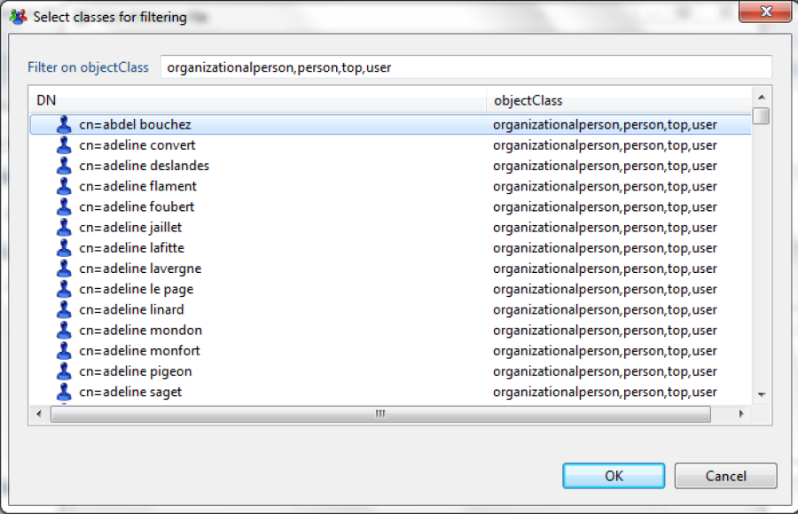

### Formatted

Formatted files are often text report type files from centralized sites (Mainframe). They don't contain separators; fields are identified by their position (characters 1 to 8 = field 1, characters 9 to 15 = field 2...)

  

Once the FORMATTED wizard has been selected and the file chosen, a wizard displays the various options.  

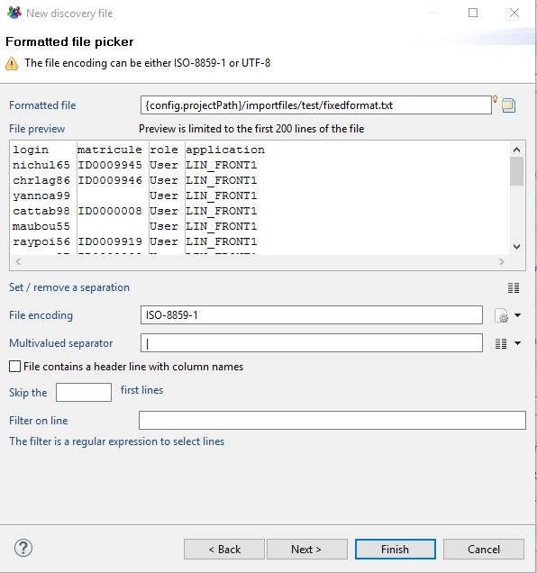  

It is possible to specify:  

- the file encoding
- the separation character used for multivalued attributes
- whether the file contains a header line with column names
- whether it needs to skip X lines before starting to process the file
- whether only certain rows of the file should be taken into account. Filtering is then performed with a regular expression. This setting may be useful in the case of a "dump" file from a central site that contains many elements of a varying nature.  

If you wish to adjust the column selection, just place the cursor in the right spot in the preview area, and then click on the "Set/Remove a Separation" button.

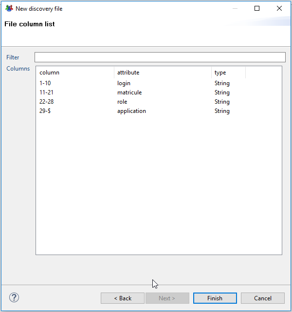

### XML

XML discovery allows you to extract data from an XML type file.  

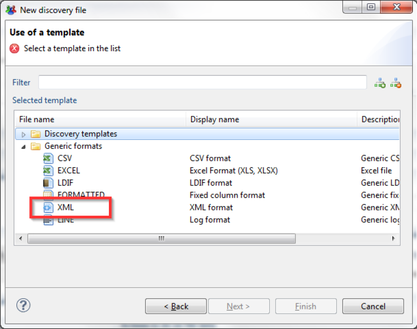  

Once the XML wizard has been selected and a file chosen, a wizard appears. It allows you to select the object to extract from the XML file. Object selection is performed with the help of the "Selected elements" setting. This setting must contain an XPATH expression that references the element in question.  

It is also possible to click on the element in the preview pane to fill in this field.  

  

The Discovery's attributes correspond to the various attributes of the selected objects.  
Here is an example of attributes extracted on the basis of an XML object that contains XML sub-objects:  

If the selected object contains sub-objects, their attributes are also extracted as attributes. Careful, though: this principle does not handle multiple sub-objects, only 1/1 relationship types. In this case, only one of the sub-objects will be taken into account.

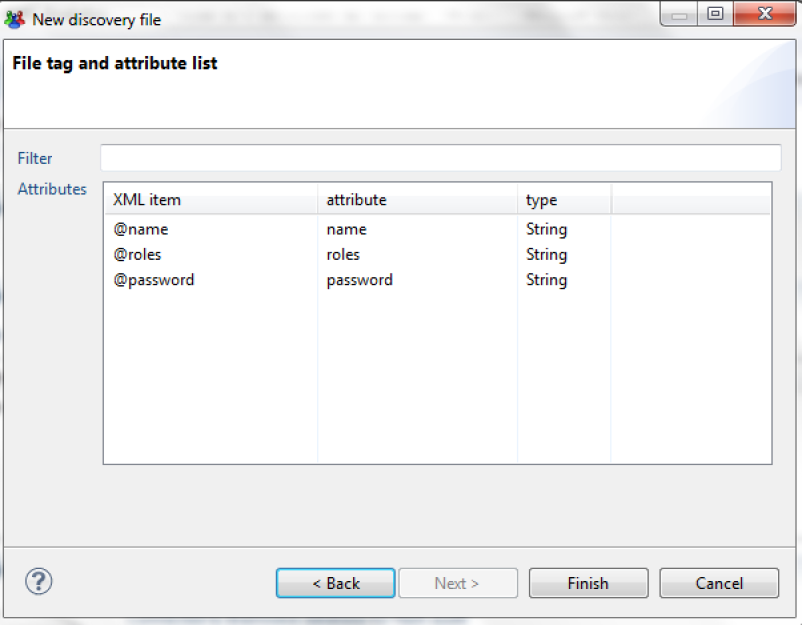

### Line

LINE type discovery allows the analysis of log files.

  

Once the LINE wizard has been selected and the file chosen, a wizard appears. This wizard allows you to:  

- Select the file encoding type
- Indicate whether you wish to ignore empty lines
- Indicate whether it should skip X lines before beginning the file analysis

  

A LINE type discovery loads the lines in a single attribute named "line." The true analysis of this line is then performed with actions like "Extract the characters into a new attribute," which will go through the line and extract the information in typed attributes.  

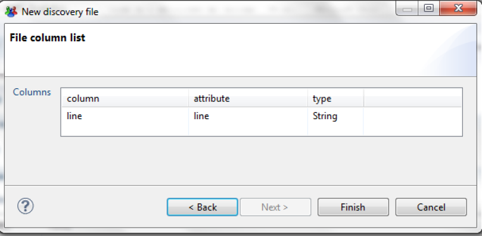  

## First Level of Record Filtering

### Skip the X First Records

This setting allows you to skip X lines (or X records in the case of formatted data such as LDIF files) before starting the processing.  

  

### Select a Maximum of X Records

This setting allows you to limit the analysis to the first X records.  
We recommend that you use this setting when you are setting up your Discovery on large files (>100MB) in order to limit the analysis to the first few records. This will allow you to have a more reactive configuration interface when you are setting up the Discovery.  

  

### Filter with a Query in SQL Format

It is possible to select only a subset of records. Do this by using a query in SQL format. You will find the corresponding documentation in the "Collector Configuration Guide."  
Note that this first-level filtering does not start any event or rejection; it is only used for preselecting data. If you wish to perform data rejection, to process data quality issues, for example, we suggest that you use the "rejection" actions, as these will allow you to associate events with rejections in order to generate log files.  

## Data Types Settings

It is possible to change the type of data of an attribute to convert it into another data format. To do so, click on the type column that corresponds to the attribute.  

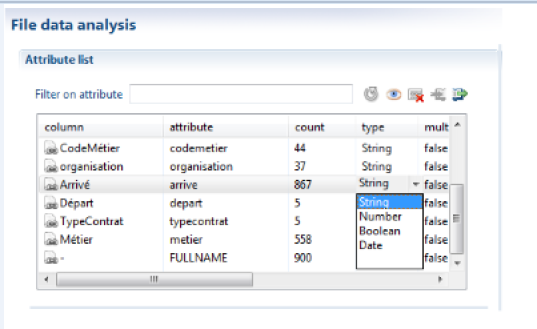  

The attribute will then be converted into a numerical value, date, or Boolean value as the file is read.  
Format configuration happens in the first tab:  

  

Regarding the dates, the format to use is the Java Format. To do so, you need to rely on the following table:  

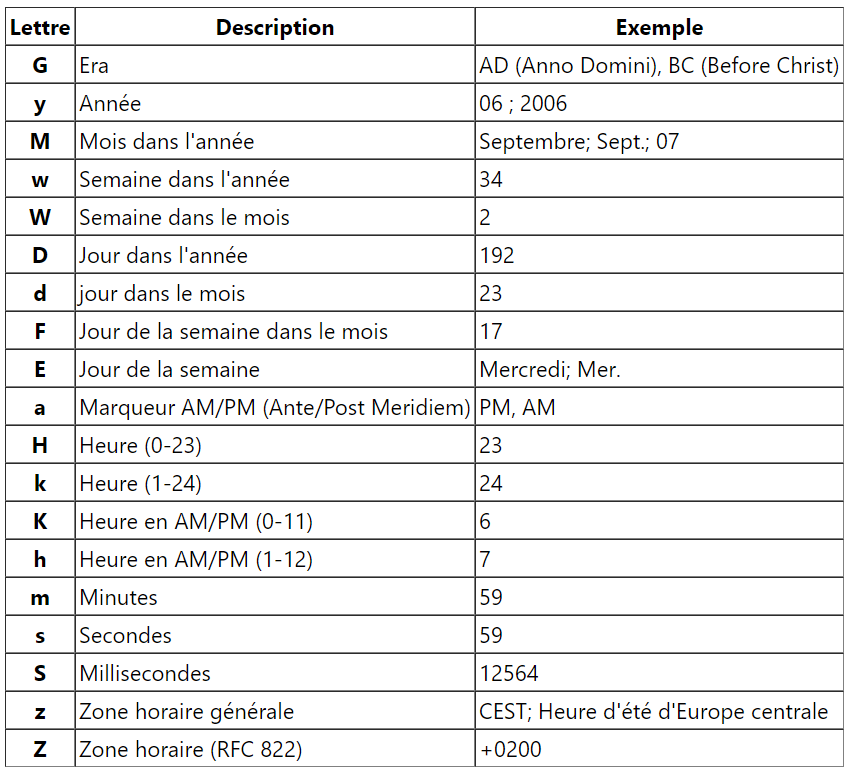  

For example, the format of date like:  

- "12/24/2019 4:23:30 PM" is "MM/dd/yyyy h:mm:ss a" which will be converted to "20191224162330"  
- "24/12/2019 16:23:30" is "dd/MM/yyyy HH:mm:ss" which will be converted to "20191224162330"  

**_Setting the attribute format_**  

> [!warning] The source file data must be correctly formatted to set a date/Boolean/whole value. If the attributes must be pre-processed or filtered, you must use transformation actions in order to convert these attributes into the right type in new computed attributes.  

  

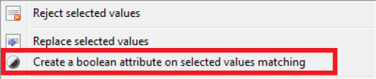

## Rejects

### Reject Empty Values

This action allows the rejection of empty values for an attribute.  

Rejecting empty values is done by right-clicking on the attribute then choosing "reject empty values".  

### Reject Values not Conforming to a Specific Date Format

This action will compare the date records in the source file and reject the ones who do not conform to the format you specified.

### Reject Duplicated Values

## Set a Default Value

This action allows you to set a value in an attribute if it is empty.  
The value can be a static or dynamic value (with syntax like macro {...}, illustrated in chapter 5.1).  

  

It is thus possible to associate a condition to the application of this action. Also, this action used consecutively on the same attribute, with the use of the conditional clause, allows (if, else if, else) type operations to be performed.

## Operations

### Operations on String Attributes

This entry contains all the operations that can be performed on string type attributes, such as:  

#### Convert to Date into a New Attribute

To convert a string type attribute into a date format, just right-click on the attribute -> **Operations on string attributes**  -> **Convert to date into a new attribute.**

  

Then enter the settings of the new attribute.  

Local language gives an indication as to how the days are written in the file.
For instance, if the month are written in plain text in your source file, you might see this:  
04 Feb 2016  
"Feb" means that the local language is English, so you would have to put "en" in the local language field.  

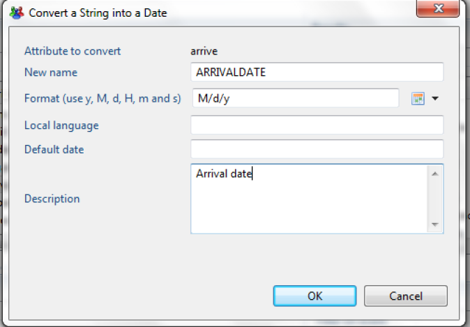  

Once the new attribute has been created, it will appear in the list of attributes. The date format must be filled out with a pattern. You will find the documentation about the pattern at this link:  
[http://docs.oracle.com/javase/1.4.2/docs/api/java/text/SimpleDateFormat.html](http://docs.oracle.com/javase/1.4.2/docs/api/java/text/SimpleDateFormat.html*)  

Here are some examples:

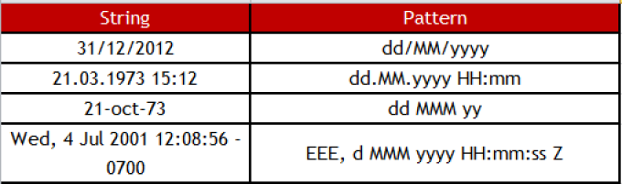  

#### Normalize the Value into a New Attribute

The principle is to eliminate all the special characters contained in the composition of the attribute's values (example of special characters: "ç", "\_", "'" "^"...). You can perform this operation by right-clicking on the attribute name-> **operations on string attributes->Normalize value into a new attribute**.  

#### Extract DN Values into a New Attribute

You can extract the values of a DN type attribute into a multivalued attribute. The values are stacked so that the first value of the multivalued attribute corresponds to the end of the DN value.  

  

A practical usage case is as follows:  
The DN of users contains useful complementary information (example: the organization to which the person belongs) in this format: `cn=abdel Kader, or=DSICORP, or=users, or=acme, or=com`
The application of this action on the DN in order to build a new "DNS" attribute will then allow the simple creation of a computed attribute "organization" which contains the sought-after value in the syntax {dataset.DNS.get(1)}.

#### Separate the Parts of a Value into a New Attribute

The operation separates the parts of an attribute's value into a new multivalued attribute.  
Example of value to separate: DSIO/OPS/CORP. In this example, we will put the parts of the value into a new multivalued attribute. To do this, just:  

- Right-click on the attribute name-> **Operations on string attributes** -> **Split parts of a value into a new attribute**.

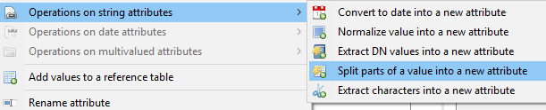  

- then enter the name of the new attribute and the separating character

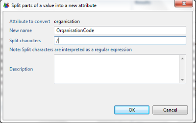  

It is important to note that the operation works if and only if the separator between the value's elements is the same.  

#### Extract the Characters into a New Attribute

It is possible to extract a value's characters into a new attribute. This operation is generally used to extract the elements present in a log file. In order to perform the operation, right-click on the attribute name-> **Operations on string attributes->Extract characters into a new attribute**.  

  

You have two options:  

- Extract the N first characters: this allows you to set the number of characters to put into a new attribute. You can go through the string from the beginning or the end by checking the appropriate box.
- Extract the N first characters until the first occurrence of the separator. You can go through the string from the beginning or the end by checking the appropriate box.

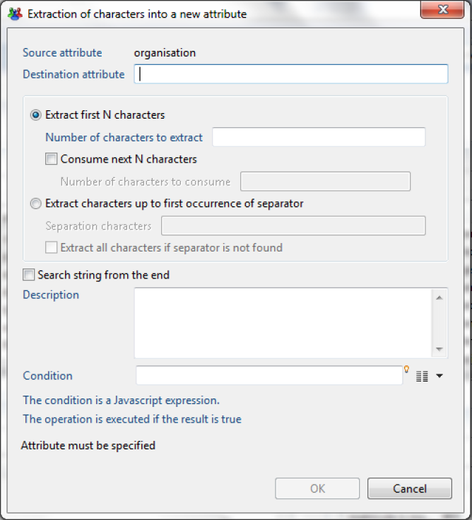  

> [!warning] The extracted characters will be consumed, which means that the initial attribute value is modified at the end of the operation.

### Operations on Date Attributes

Two types of operations are possible on date type attributes:

#### Compute the Time between Two Dates into a New Attribute

This operation allows you to deduct the number of days since a person left the company, for example. To perform this operation, right-click on the first date type attribute > **Compute time between two dates in a new attribute**.  

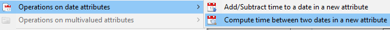  

Then enter the new attribute name, the second attribute date, and chose a unit of time.  

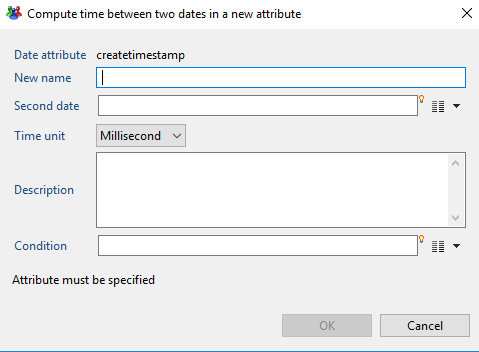  

#### Add/Subtract Time to a Date in a New Attribute

This is the opposite operation of "Compute time between two dates in a new attribute." To perform this operation, right-click on the date type attribute-\> **Operations on date attributes->Add/Subtract time to a date in a new attribute**.  

  

Then fill out the new attribute's name, the length of time, and the unit of time.  

  

### Operations on Attributes

#### Rename an Attribute

You can change an attribute's name by choosing "Rename Attribute".  

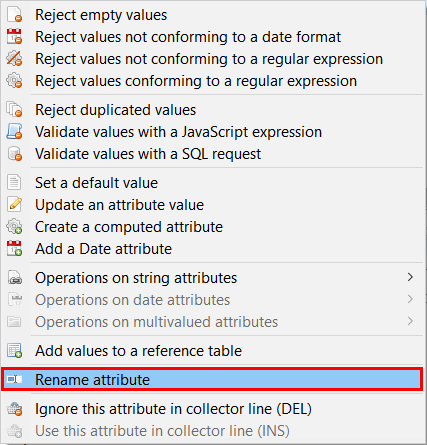  

In the dialog that opens, you just have to write the new name you want to give to the attribute.  

  

Before you click OK, clicking on "Preview >" gives you a list of files impacted by the renaming.  

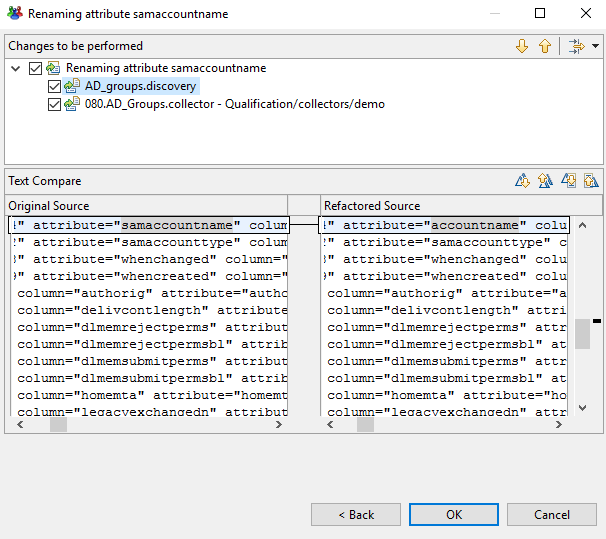  

Here we can see that two files will be impacted: the discovery file we are using, and the collector that was using the attribute that was renamed. This means that the product will change the name in the collector file automatically in addition to changing it in the discovery.  

When there are modifications on another file as in this case, the other file will be closed if it was opened in another tab.  

#### Rename Attribute Values

You can rename attribute values on the fly. To do so, select the appropriate value(s) in the lower left part of the editor, right-click, and choose "Replace selected values."

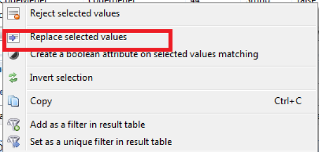  

An editor opens and allows you to set the replacement value(s).  

 of a list of attributes")  

#### Ignore this Attribute in Collector Line

You can ignore attributes that will not be in the collector file, in order to have less clutter when selecting them.  
There are two ways of doing this:  

- you can select the attribute and press "DEL"
- or you can right click the attribute and select "Ignore this attribute in collector line (DEL)  

  

The attribute will not be shown by default anymore. If you want to see ignored attributes, you can do so by clicking on the "eye" icon in the top right corner of the attribute list:  

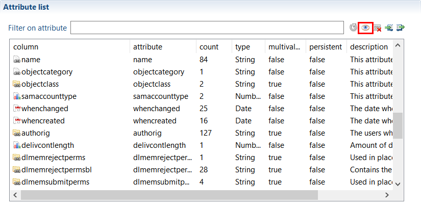  

The ignored attributes will appear, you can tell them apart because they will be greyed out.

#### Use this Attribute in Collector Line

Of course, the opposite operation is also possible. For this you have to select the ignored attribute (it should be greyed out) that you want to use again, right click and choose "Use this attribute in collector line (INS)":  

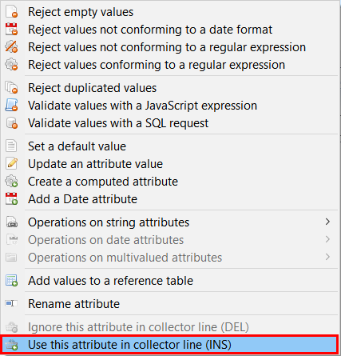  

The attribute will be back with the used attributes and you will be able to select it in the collector file.  

## Exports

### Export Rejected Values

You can do a CSV export of rejected values. To do so, right-click on any value in the "Rejected records" view.  

  

### Export Transformed Data

You can do a CSV export of all the data processed in the discovery. To do so, right-click on any value in the "Results"' block.  

## Add a Date Attribute

Adding a Date attribute gives two choices :

- **Adding the current date**  

For this option, the attribute will contain the date when it has been computed. It could be useful if you need to show the exact loading date of the data.  

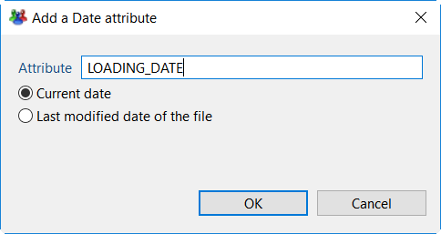  

- **Adding the last modified date of the file**  

Choosing this will create an attribute with the source file's last modification date.  

  

Please note that these attributes will not show up in the attributes list, but you will see their value in the "Results" block on the upper right side of the Analysis screen.  

Here are the results you will get:  

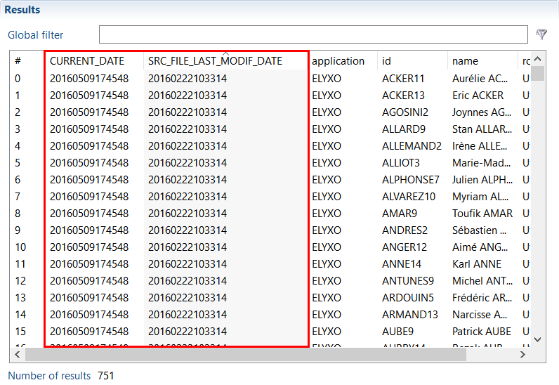  

## Update an Attribute Value

It is possible to update an attribute's value from the discovery interface.  
This action is different from the other discovery actions because it will modify the actual value of the attribute, not create a new one.  

Similarly to computed attributes, the update can contain static or dynamic values. Dynamic values can rely on any other values of the current record. The component uses JavaScript macro syntax laid out in the "Collector Guide."  
To update an attribute's value, right-click on the attribute and select "Update an attribute value".  

  

You can also use conditions, which can be generated  

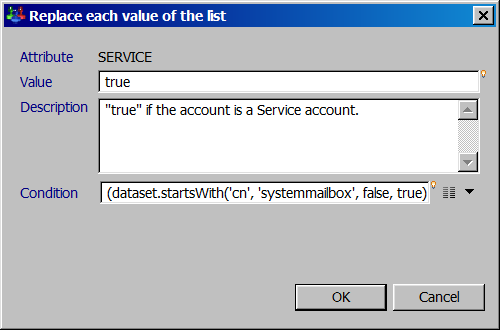  

The keyboard shortcut "Ctrl+Space" allows you to display the JavaScript query wizard.  
A wizard is also present on the right side of the "Condition" setting. It enables you to configure the conditions without needing to write the corresponding JavaScript code.  

